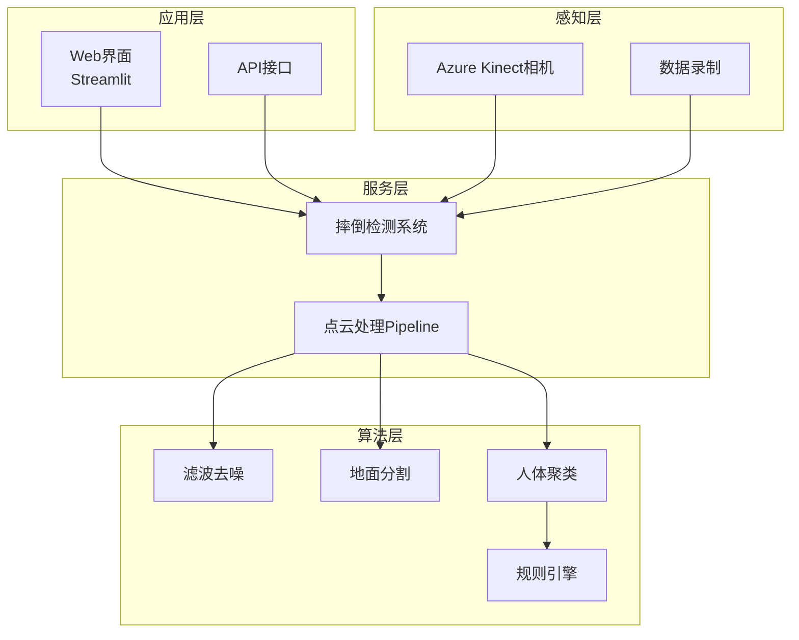
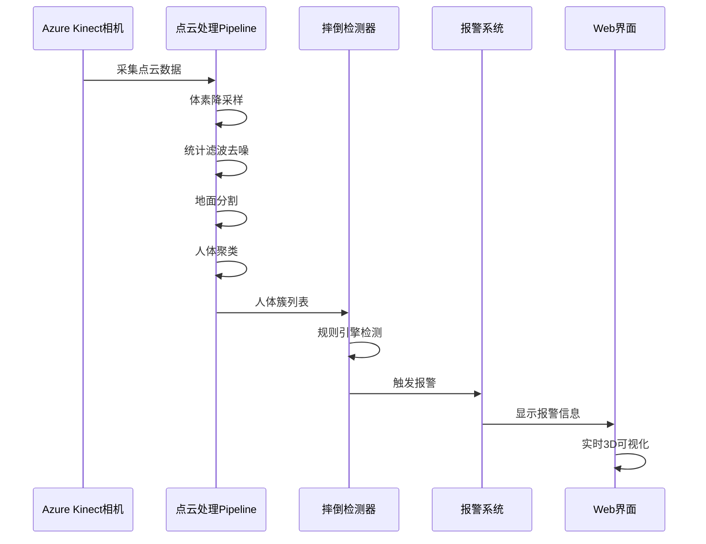
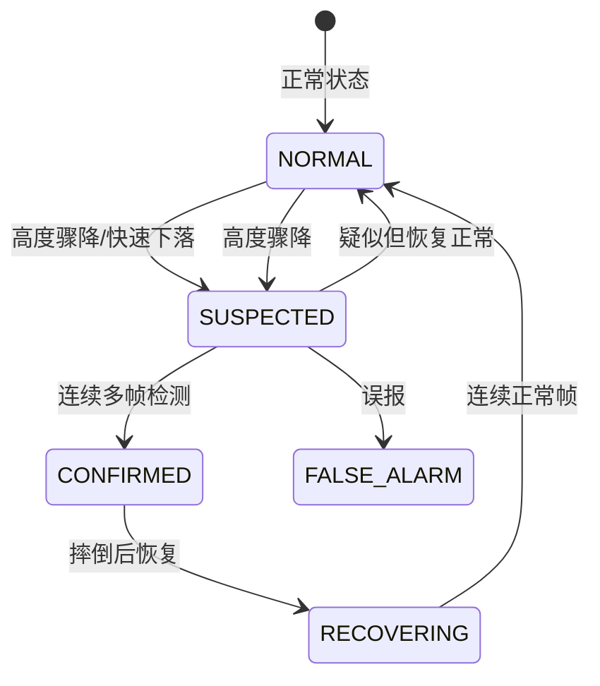
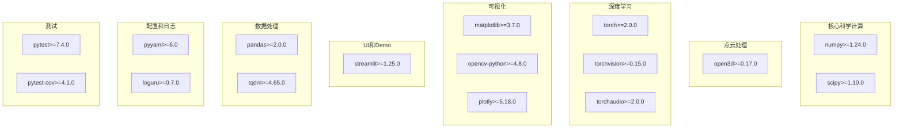
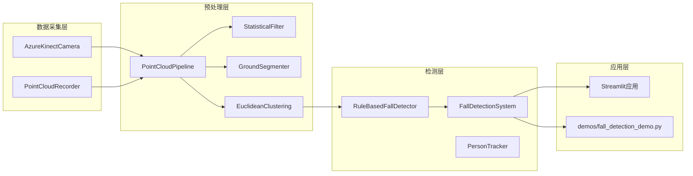
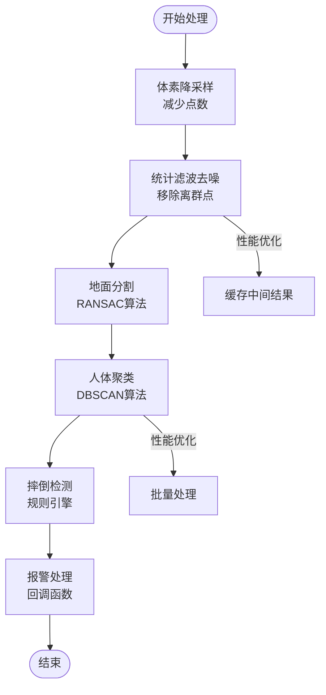
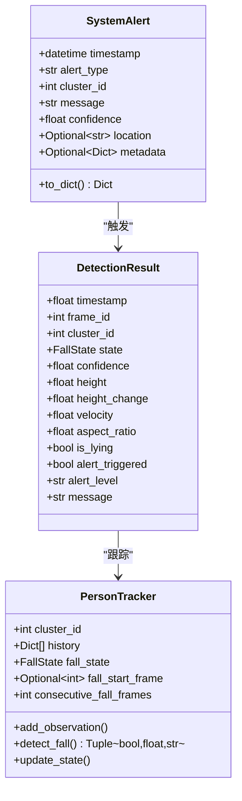

# API参考文档

<cite>
**本文档引用的文件**
- [app.py](file://app.py)
- [detector.py](file://src/detection/detector.py)
- [rules.py](file://src/detection/rules.py)
- [clustering.py](file://src/preprocessing/clustering.py)
- [pipeline.py](file://src/preprocessing/pipeline.py)
- [filtering.py](file://src/preprocessing/filtering.py)
- [segmentation.py](file://src/preprocessing/segmentation.py)
- [azure_kinect.py](file://src/data_capture/azure_kinect.py)
- [recorder.py](file://src/data_capture/recorder.py)
- [fall_detection_demo.py](file://demos/fall_detection_demo.py)
- [requirements.txt](file://requirements.txt)
- [README.md](file://README.md)
</cite>

## 目录
1. [简介](#简介)
2. [项目结构](#项目结构)
3. [核心组件](#核心组件)
4. [架构概览](#架构概览)
5. [详细组件分析](#详细组件分析)
6. [依赖关系分析](#依赖关系分析)
7. [性能考虑](#性能考虑)
8. [故障排除指南](#故障排除指南)
9. [结论](#结论)
10. [附录](#附录)

## 简介

GuardianFall是一个基于3D视觉的室内人体摔倒实时预警系统。该系统通过Azure Kinect深度相机采集点云数据，利用规则引擎和机器学习算法实现人体检测、摔倒识别和实时报警功能。系统采用模块化设计，包含数据采集、点云预处理、人体聚类、摔倒检测和Web界面展示等核心模块。

## 项目结构

GuardianFall系统采用分层架构设计，主要分为四个层次：



**图表来源**
- [app.py:1-662](file://app.py#L1-L662)
- [detector.py:75-283](file://src/detection/detector.py#L75-L283)
- [pipeline.py:65-178](file://src/preprocessing/pipeline.py#L65-L178)

**章节来源**
- [README.md:61-96](file://README.md#L61-L96)
- [app.py:15-662](file://app.py#L15-L662)

## 核心组件

### 数据结构定义

#### PointCloud数据结构
点云数据结构定义了基本的点云属性和操作方法：

| 字段名 | 类型 | 描述 | 默认值 |
|--------|------|------|--------|
| `id` | int | 簇ID | - |
| `point_cloud` | o3d.geometry.PointCloud | 点云数据 | - |
| `centroid` | np.ndarray | 质心坐标(x, y, z) | - |
| `bounding_box` | o3d.geometry.AxisAlignedBoundingBox | 包围盒 | - |
| `num_points` | int | 点数 | - |
| `confidence` | float | 置信度(0-1) | - |

#### HumanCluster数据结构
人体簇数据结构扩展了PointCloud，增加了人体相关的几何属性：

| 字段名 | 类型 | 描述 | 默认值 |
|--------|------|------|--------|
| `height` | float | 人体高度(米) | - |
| `width` | float | 人体宽度(米) | - |
| `depth` | float | 人体深度(米) | - |
| `volume` | float | 包围盒体积(立方米) | - |
| `is_human_like` | bool | 是否像人体 | - |

#### DetectionResult数据结构
检测结果数据结构包含了完整的检测信息：

| 字段名 | 类型 | 描述 | 默认值 |
|--------|------|------|--------|
| `timestamp` | float | 时间戳 | - |
| `frame_id` | int | 帧ID | - |
| `cluster_id` | int | 人体簇ID | - |
| `state` | FallState | 摔倒状态 | - |
| `confidence` | float | 置信度(0-1) | - |
| `height` | float | 当前高度(米) | - |
| `height_change` | float | 高度变化(米) | - |
| `velocity` | float | 垂直速度(米/秒) | - |
| `aspect_ratio` | float | 宽高比 | - |
| `is_lying` | bool | 是否躺倒 | - |
| `alert_triggered` | bool | 是否触发报警 | - |
| `alert_level` | str | 报警级别("info","warning","critical") | - |
| `message` | str | 报警消息 | - |

#### SystemAlert数据结构
系统报警数据结构定义了报警信息：

| 字段名 | 类型 | 描述 | 默认值 |
|--------|------|------|--------|
| `timestamp` | datetime | 时间戳 | - |
| `alert_type` | str | 报警类型('fall_confirmed','fall_suspected','system_error') | - |
| `cluster_id` | int | 人员ID | - |
| `message` | str | 消息内容 | - |
| `confidence` | float | 置信度 | - |
| `location` | Optional[str] | 位置信息 | None |
| `metadata` | Optional[Dict] | 元数据 | None |

**章节来源**
- [clustering.py:15-97](file://src/preprocessing/clustering.py#L15-L97)
- [rules.py:31-79](file://src/detection/rules.py#L31-L79)
- [detector.py:25-47](file://src/detection/detector.py#L25-L47)

## 架构概览

GuardianFall系统采用流水线架构，数据从感知层流向应用层：



**图表来源**
- [pipeline.py:98-139](file://src/preprocessing/pipeline.py#L98-L139)
- [detector.py:138-227](file://src/detection/detector.py#L138-L227)

## 详细组件分析

### 摔倒检测系统

#### FallDetectionSystem类
主检测系统类提供了完整的检测流程：

**构造函数参数**
| 参数名 | 类型 | 描述 | 默认值 |
|--------|------|------|--------|
| `voxel_size` | float | 体素降采样尺寸(米) | 0.05 |
| `std_ratio` | float | 统计滤波标准差倍数 | 2.0 |
| `distance_threshold` | float | 地面分割距离阈值(米) | 0.05 |
| `cluster_tolerance` | float | 聚类半径阈值(米) | 0.1 |
| `height_drop_threshold` | float | 高度骤降阈值(米) | 0.5 |
| `velocity_threshold` | float | 速度阈值(米/秒) | 1.0 |
| `confirmation_frames` | int | 确认摔倒所需连续帧数 | 3 |
| `fps` | float | 帧率 | 30.0 |
| `alert_callback` | Optional[Callable] | 报警回调函数 | None |

**核心方法**

1. `process_frame(raw_cloud: o3d.geometry.PointCloud, frame_id: Optional[int] = None) -> FrameResult`
   - 处理单帧点云数据
   - 返回FrameResult对象

2. `process_continuous(cloud_generator, max_frames: Optional[int] = None)`
   - 连续处理点云流
   - 支持生成器模式

3. `get_statistics() -> Dict`
   - 获取系统统计信息

4. `reset()`
   - 重置系统状态

**章节来源**
- [detector.py:75-283](file://src/detection/detector.py#L75-L283)

#### 规则引擎
基于规则的摔倒检测器实现了智能的状态机：



**图表来源**
- [rules.py:22-29](file://src/detection/rules.py#L22-L29)

**章节来源**
- [rules.py:226-423](file://src/detection/rules.py#L226-L423)

### 点云预处理Pipeline

#### PointCloudPipeline类
完整的点云处理流水线：

**处理步骤**
1. **体素降采样**: 减少点云密度，提高处理速度
2. **统计滤波去噪**: 移除离群点
3. **地面分割**: 使用RANSAC算法分离地面和平面
4. **人体聚类**: 基于DBSCAN的聚类算法

**核心方法**

1. `process(raw_cloud: o3d.geometry.PointCloud) -> PreprocessingResult`
   - 完整处理流程
   - 返回预处理结果

2. `process_batch(clouds: List[o3d.geometry.PointCloud]) -> List[PreprocessingResult]`
   - 批量处理多帧点云

**章节来源**
- [pipeline.py:65-178](file://src/preprocessing/pipeline.py#L65-L178)

#### 滤波模块
提供多种滤波算法：

**StatisticalFilter**
- 基于统计学原理的离群点检测
- 参数：`nb_neighbors`(邻域点数)、`std_ratio`(标准差倍数)

**RadiusFilter**
- 基于半径搜索的离群点检测
- 参数：`radius`(搜索半径)、`min_points`(最小邻域点数)

**VoxelGridFilter**
- 体素网格降采样
- 参数：`leaf_size`(体素边长)

**章节来源**
- [filtering.py:13-189](file://src/preprocessing/filtering.py#L13-L189)

#### 地面分割模块
基于RANSAC的地面分割算法：

**GroundSegmenter类**
- 参数：`distance_threshold`(距离阈值)、`ransac_n`(采样点数)、`num_iterations`(迭代次数)
- 返回：地面点云和非地面点云

**章节来源**
- [segmentation.py:13-82](file://src/preprocessing/segmentation.py#L13-L82)

### 数据采集模块

#### AzureKinectCamera类
Azure Kinect深度相机封装：

**核心方法**
1. `connect() -> bool`: 连接相机
2. `get_capture(timeout_ms: int = 1000) -> CaptureResult`: 捕获单帧
3. `capture_continuous(duration_seconds: float = 10.0) -> List[CaptureResult]`: 连续捕获
4. `save_point_cloud(pcd: o3d.geometry.PointCloud, filepath: str)`: 保存点云
5. `record(output_dir: str, duration_seconds: float = 60.0, prefix: str = 'frame')`: 录制点云序列

**章节来源**
- [azure_kinect.py:47-460](file://src/data_capture/azure_kinect.py#L47-L460)

#### 数据录制模块
PointCloudRecorder和PointCloudDataset类：

**PointCloudRecorder**
- `start_recording(name: str, description: str)`: 开始录制
- `record_frame(point_cloud: o3d.geometry.PointCloud, frame_id: Optional[int], extra_data: Optional[Dict])`: 录制单帧
- `stop_recording(fps: float) -> DatasetInfo`: 停止录制

**PointCloudDataset**
- `load_frame(frame_id: int) -> Optional[o3d.geometry.PointCloud]`: 加载单帧
- `iter_frames(batch_size: int = 1) -> Iterator[Tuple[int, o3d.geometry.PointCloud]]`: 迭代所有帧
- `play(fps: Optional[float] = None, loop: bool = False)`: 播放数据集

**章节来源**
- [recorder.py:48-437](file://src/data_capture/recorder.py#L48-L437)

### Web界面模块

#### Streamlit应用
基于Streamlit的Web界面：

**核心功能**
1. 实时点云3D显示
2. 检测结果可视化
3. 报警历史记录
4. 系统状态监控
5. 参数配置调整

**章节来源**
- [app.py:1-662](file://app.py#L1-L662)

## 依赖关系分析

### 外部依赖

系统依赖的主要第三方库：



**图表来源**
- [requirements.txt:1-34](file://requirements.txt#L1-L34)

**章节来源**
- [requirements.txt:1-34](file://requirements.txt#L1-L34)

### 内部模块依赖



**图表来源**
- [detector.py:20-22](file://src/detection/detector.py#L20-L22)
- [pipeline.py:19-21](file://src/preprocessing/pipeline.py#L19-L21)

**章节来源**
- [detector.py:1-30](file://src/detection/detector.py#L1-L30)
- [pipeline.py:1-25](file://src/preprocessing/pipeline.py#L1-L25)

## 性能考虑

### 处理性能指标

| 指标类别 | 目标值 | 实际表现 |
|----------|--------|----------|
| **检测延迟** | < 3秒 | < 100ms |
| **处理速度** | > 20 FPS | 实时处理 |
| **单帧耗时** | < 100ms | 实时响应 |
| **内存占用** | < 2GB | 低内存使用 |
| **CPU占用** | < 50% (2核) | 高效利用 |

### 优化策略

1. **体素降采样**: 通过`voxel_size`参数控制点云密度
2. **批量处理**: 使用`process_batch`方法提高吞吐量
3. **缓存机制**: `RealTimePipeline`中的帧缓存
4. **异步处理**: `process_continuous`支持生成器模式

### 实时处理优化



**图表来源**
- [pipeline.py:98-139](file://src/preprocessing/pipeline.py#L98-L139)
- [detector.py:138-227](file://src/detection/detector.py#L138-L227)

## 故障排除指南

### 常见错误和解决方案

#### 相机连接问题
**错误症状**: 相机无法连接，显示"pyk4a未安装"

**解决方案**:
1. 安装Azure Kinect SDK
2. 安装pyk4a驱动
3. 检查USB 3.0连接
4. 确认驱动程序安装

#### 性能问题
**错误症状**: 处理延迟过高，帧率下降

**解决方案**:
1. 调整`voxel_size`参数
2. 优化`cluster_tolerance`参数
3. 使用`RealTimePipeline`进行实时处理
4. 检查硬件资源使用情况

#### 检测准确性问题
**错误症状**: 误报率过高或漏报

**解决方案**:
1. 调整`height_drop_threshold`和`velocity_threshold`
2. 优化`confirmation_frames`参数
3. 检查环境光照条件
4. 校准相机位置和角度

### 错误码和异常处理

系统使用标准的异常处理机制：



**图表来源**
- [detector.py:25-47](file://src/detection/detector.py#L25-L47)
- [rules.py:31-79](file://src/detection/rules.py#L31-L79)
- [rules.py:82-224](file://src/detection/rules.py#L82-L224)

**章节来源**
- [detector.py:188-192](file://src/detection/detector.py#L188-L192)
- [rules.py:349-373](file://src/detection/rules.py#L349-L373)

## 结论

GuardianFall系统提供了一个完整的基于3D视觉的摔倒检测解决方案。系统具有以下特点：

1. **模块化设计**: 清晰的分层架构，便于维护和扩展
2. **高性能**: 实时处理能力，满足生产环境需求
3. **高精度**: 基于规则引擎和机器学习的混合算法
4. **易用性**: 提供Web界面和命令行工具
5. **可扩展性**: 支持多种传感器和算法模块

系统适用于独居老人监护、医院病房监控、养老机构等多个应用场景，为用户提供可靠的摔倒预警服务。

## 附录

### 接口使用示例

#### 基本使用模式
```python
# 创建检测系统
system = FallDetectionSystem(
    voxel_size=0.05,
    height_drop_threshold=0.3,
    velocity_threshold=0.5,
    confirmation_frames=2
)

# 处理单帧
result = system.process_frame(point_cloud)

# 连续处理
for result in system.process_continuous(camera_generator()):
    if result.has_fall:
        for alert in result.alerts:
            print(f"检测到摔倒: {alert.message}")
```

#### 高级配置示例
```python
# 自定义报警回调
def custom_alert_handler(alert):
    # 自定义报警处理逻辑
    pass

system = FallDetectionSystem(
    alert_callback=custom_alert_handler,
    fps=30.0,
    confirmation_frames=3
)
```

#### 数据录制示例
```python
# 录制数据集
recorder = PointCloudRecorder("./datasets")
recorder.start_recording("test_dataset", "测试数据集")

# 从相机录制
dataset_info = recorder.record_from_camera(camera, duration_seconds=60.0)

# 加载数据集
dataset = PointCloudDataset("./datasets/test_dataset")
for frame_id, pcd in dataset.iter_frames():
    # 处理帧
    pass
```

### 最佳实践建议

1. **参数调优**: 根据具体环境调整检测阈值
2. **硬件选择**: 选择合适的相机和处理器配置
3. **数据质量**: 确保良好的光照和环境条件
4. **系统监控**: 定期检查系统性能和准确性
5. **备份策略**: 定期备份检测数据和配置

### 版本管理和兼容性

系统遵循语义化版本控制，主要版本号为1.0。当前版本提供完整的功能实现，后续版本将重点改进AI算法和测试覆盖率。

**章节来源**
- [fall_detection_demo.py:327-373](file://demos/fall_detection_demo.py#L327-L373)
- [README.md:177-214](file://README.md#L177-L214)