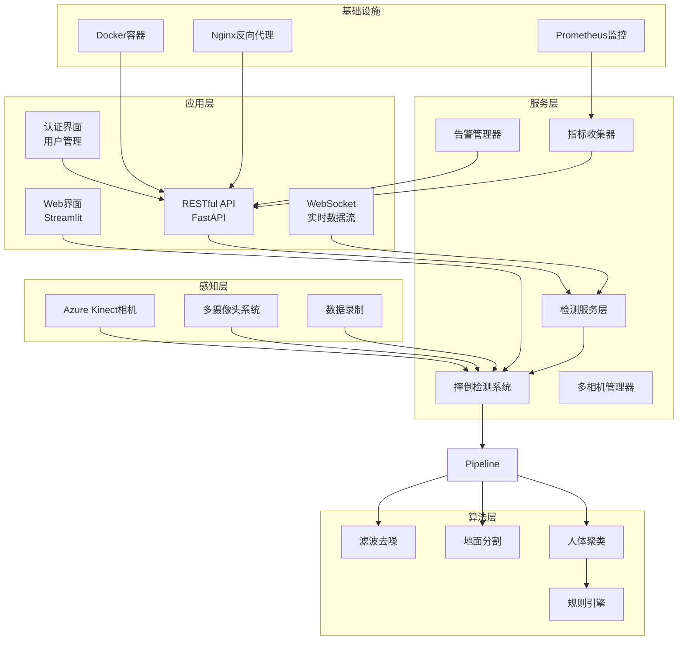
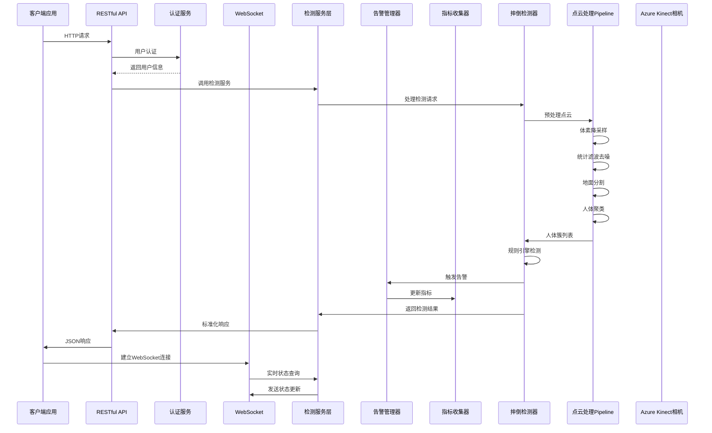
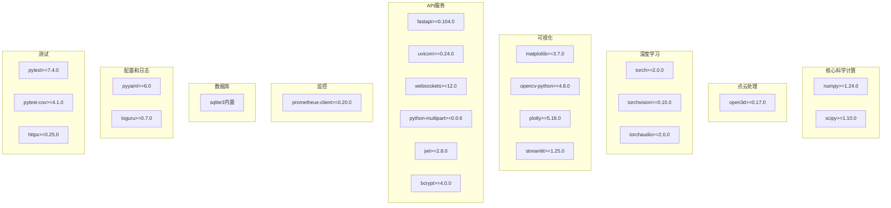
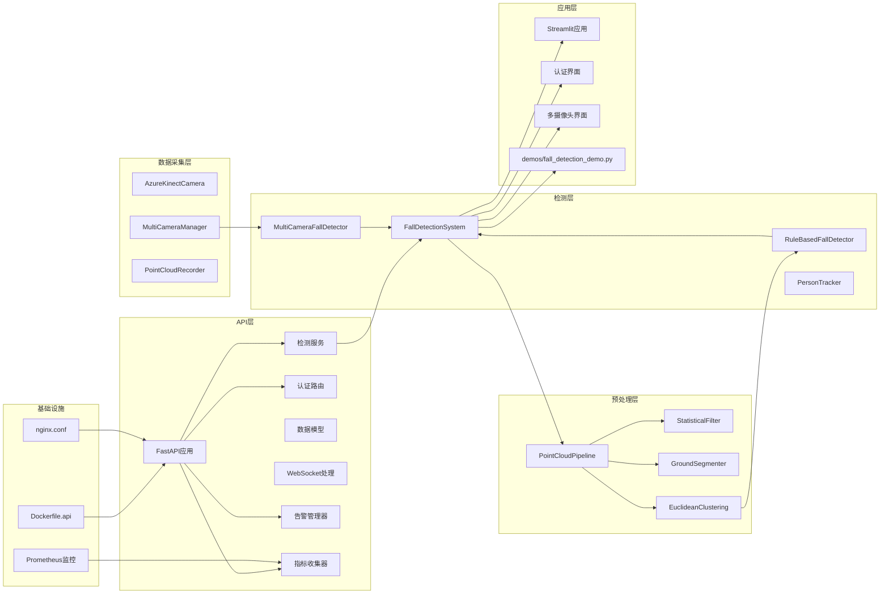
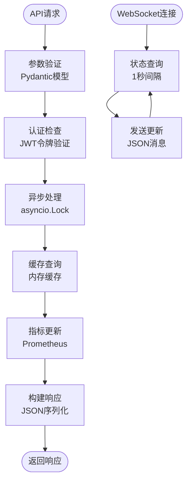
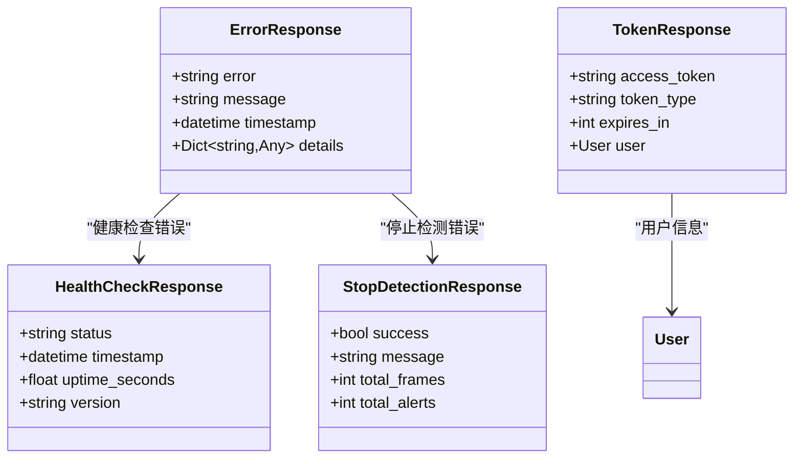

# API参考文档

<cite>
**本文档引用的文件**
- [main.py](file://src/api/main.py)
- [detection_service.py](file://src/api/detection_service.py)
- [models.py](file://src/api/models.py)
- [auth_routes.py](file://src/api/auth_routes.py)
- [dependencies.py](file://src/auth/dependencies.py)
- [alerter.py](file://src/monitoring/alerter.py)
- [metrics.py](file://src/monitoring/metrics.py)
- [multi_camera_manager.py](file://src/camera/multi_camera_manager.py)
- [multi_camera_detector.py](file://src/detection/multi_camera_detector.py)
- [auth_service_sqlite.py](file://src/auth/auth_service_sqlite.py)
- [models.py](file://src/auth/models.py)
- [app.py](file://app.py)
- [detector.py](file://src/detection/detector.py)
- [rules.py](file://src/detection/rules.py)
- [clustering.py](file://src/preprocessing/clustering.py)
- [pipeline.py](file://src/preprocessing/pipeline.py)
- [filtering.py](file://src/preprocessing/filtering.py)
- [segmentation.py](file://src/preprocessing/segmentation.py)
- [azure_kinect.py](file://src/data_capture/azure_kinect.py)
- [recorder.py](file://src/data_capture/recorder.py)
- [fall_detection_demo.py](file://demos/fall_detection_demo.py)
- [requirements.txt](file://requirements.txt)
- [Dockerfile.api](file://Dockerfile.api)
- [README.md](file://README.md)
</cite>

## 更新摘要
**变更内容**
- 新增完整的RESTful API服务层架构
- 添加WebSocket实时数据流支持
- 引入标准化的数据模型定义
- 新增用户认证和授权系统
- 集成监控告警和指标收集
- 增加Docker容器化部署支持
- 更新系统架构图以反映新的API层
- 新增多相机检测API接口

## 目录
1. [简介](#简介)
2. [项目结构](#项目结构)
3. [核心组件](#核心组件)
4. [架构概览](#架构概览)
5. [RESTful API参考](#restful-api参考)
6. [WebSocket实时通信](#websocket实时通信)
7. [数据模型定义](#数据模型定义)
8. [详细组件分析](#详细组件分析)
9. [依赖关系分析](#依赖关系分析)
10. [性能考虑](#性能考虑)
11. [故障排除指南](#故障排除指南)
12. [结论](#结论)
13. [附录](#附录)

## 简介

GuardianFall是一个基于3D视觉的室内人体摔倒实时预警系统。该系统通过Azure Kinect深度相机采集点云数据，利用规则引擎和机器学习算法实现人体检测、摔倒识别和实时报警功能。系统采用模块化设计，包含数据采集、点云预处理、人体聚类、摔倒检测和Web界面展示等核心模块。

**更新** 系统现已新增完整的RESTful API服务层，提供标准化的HTTP接口和WebSocket实时数据流，支持远程监控和集成部署。系统集成了用户认证授权、监控告警、指标收集等企业级功能，支持多摄像头同时监控和统一告警管理。

## 项目结构

GuardianFall系统采用分层架构设计，主要分为七个层次：



**图表来源**
- [main.py:42-47](file://src/api/main.py#L42-L47)
- [detection_service.py:34-51](file://src/api/detection_service.py#L34-L51)
- [Dockerfile.api:49](file://Dockerfile.api#L49)

**章节来源**
- [README.md:61-96](file://README.md#L61-L96)
- [app.py:15-662](file://app.py#L15-L662)

## 核心组件

### 数据结构定义

#### PointCloud数据结构
点云数据结构定义了基本的点云属性和操作方法：

| 字段名 | 类型 | 描述 | 默认值 |
|--------|------|------|--------|
| `id` | int | 簇ID | - |
| `point_cloud` | o3d.geometry.PointCloud | 点云数据 | - |
| `centroid` | np.ndarray | 质心坐标(x, y, z) | - |
| `bounding_box` | o3d.geometry.AxisAlignedBoundingBox | 包围盒 | - |
| `num_points` | int | 点数 | - |
| `confidence` | float | 置信度(0-1) | - |

#### HumanCluster数据结构
人体簇数据结构扩展了PointCloud，增加了人体相关的几何属性：

| 字段名 | 类型 | 描述 | 默认值 |
|--------|------|------|--------|
| `height` | float | 人体高度(米) | - |
| `width` | float | 人体宽度(米) | - |
| `depth` | float | 人体深度(米) | - |
| `volume` | float | 包围盒体积(立方米) | - |
| `is_human` | bool | 是否是人体 | - |

#### DetectionResult数据结构
检测结果数据结构包含了完整的检测信息：

| 字段名 | 类型 | 描述 | 默认值 |
|--------|------|------|--------|
| `timestamp` | float | 时间戳 | - |
| `frame_id` | int | 帧ID | - |
| `cluster_id` | int | 人体簇ID | - |
| `state` | FallState | 摔倒状态 | - |
| `confidence` | float | 置信度(0-1) | - |
| `height` | float | 当前高度(米) | - |
| `height_change` | float | 高度变化(米) | - |
| `velocity` | float | 垂直速度(米/秒) | - |
| `aspect_ratio` | float | 宽高比 | - |
| `is_lying` | bool | 是否躺倒 | - |
| `alert_triggered` | bool | 是否触发报警 | - |
| `alert_level` | str | 报警级别("info","warning","critical") | - |
| `message` | str | 报警消息 | - |

#### SystemAlert数据结构
系统报警数据结构定义了报警信息：

| 字段名 | 类型 | 描述 | 默认值 |
|--------|------|------|--------|
| `timestamp` | datetime | 时间戳 | - |
| `alert_type` | str | 报警类型('fall_confirmed','fall_suspected','system_error') | - |
| `cluster_id` | int | 人员ID | - |
| `message` | str | 消息内容 | - |
| `confidence` | float | 置信度 | - |
| `location` | Optional[str] | 位置信息 | None |
| `metadata` | Optional[Dict] | 元数据 | None |

#### CameraConfig数据结构
多摄像头配置数据结构：

| 字段名 | 类型 | 描述 | 默认值 |
|--------|------|------|--------|
| `id` | str | 摄像头ID | - |
| `name` | str | 摄像头名称 | - |
| `source` | str | 摄像头源地址 | - |
| `camera_type` | CameraType | 摄像头类型 | - |
| `enabled` | bool | 是否启用 | True |
| `width` | int | 宽度 | 1280 |
| `height` | int | 高度 | 720 |
| `fps` | int | 帧率 | 30 |
| `location` | str | 安装位置 | "" |

#### CameraStatus数据结构
摄像头状态数据结构：

| 字段名 | 类型 | 描述 | 默认值 |
|--------|------|------|--------|
| `id` | str | 摄像头ID | - |
| `is_connected` | bool | 是否连接 | - |
| `is_recording` | bool | 是否录制 | - |
| `last_frame_time` | Optional[datetime] | 最后帧时间 | None |
| `fps_current` | float | 当前FPS | - |
| `error_message` | Optional[str] | 错误信息 | None |

**章节来源**
- [clustering.py:15-97](file://src/preprocessing/clustering.py#L15-L97)
- [rules.py:31-79](file://src/detection/rules.py#L31-L79)
- [detector.py:25-47](file://src/detection/detector.py#L25-L47)
- [multi_camera_manager.py:25-48](file://src/camera/multi_camera_manager.py#L25-L48)

## 架构概览

GuardianFall系统采用流水线架构，数据从感知层流向应用层，现新增API服务层提供标准化接口：



**图表来源**
- [main.py:228-250](file://src/api/main.py#L228-L250)
- [detection_service.py:140-155](file://src/api/detection_service.py#L140-L155)
- [pipeline.py:98-139](file://src/preprocessing/pipeline.py#L98-L139)

## RESTful API参考

### 基础接口

#### 根路径
**GET /** - 获取API基本信息
- **响应**: `Dict[str, str]`
- **示例响应**: `{"name": "GuardianFall API", "version": "1.1.0", "status": "running", "features": ["认证管理", "摔倒检测", "监控告警", "数据统计"]}`

#### 健康检查
**GET /health** - 检查服务健康状态
- **响应**: `HealthCheckResponse`
- **示例响应**: `{"status": "healthy", "timestamp": "2024-01-01T00:00:00Z", "version": "1.1.0"}`

#### 系统状态
**GET /status** - 获取系统运行状态（需要认证）
- **响应**: `SystemStatus`
- **字段**: `is_running`, `current_frame`, `fps`, `uptime_seconds`, `active_trackers`, `total_alerts`

### 认证管理接口

#### 用户注册
**POST /auth/register** - 注册新用户
- **请求体**: `RegisterRequest`
- **字段**: `username`, `email`, `password`, `role`
- **响应**: `User`
- **示例响应**: `{"id": 1, "username": "admin", "email": "admin@example.com", "role": "admin", "is_active": true, "created_at": "2024-01-01T00:00:00Z"}`

#### 用户登录
**POST /auth/login** - 用户登录
- **请求体**: `LoginRequest`
- **字段**: `username`, `password`
- **响应**: `TokenResponse`
- **字段**: `access_token`, `token_type`, `expires_in`, `user`

#### 获取当前用户信息
**GET /auth/me** - 获取当前登录用户信息
- **响应**: `User`
- **字段**: `id`, `username`, `email`, `role`, `is_active`, `created_at`, `last_login`

#### 修改密码
**POST /auth/change-password** - 修改当前用户密码
- **请求体**: `ChangePasswordRequest`
- **字段**: `old_password`, `new_password`
- **响应**: `{"message": "密码修改成功"}`

#### 获取用户列表（仅管理员）
**GET /auth/users** - 获取所有用户列表
- **响应**: `List[User]`

#### 删除用户（仅管理员）
**DELETE /auth/users/{user_id}** - 删除指定用户
- **路径参数**: `user_id` (整数)
- **响应**: `{"message": "用户已删除"}`

#### 更新用户状态（仅管理员）
**PUT /auth/users/{user_id}/status** - 更新用户状态
- **路径参数**: `user_id` (整数)
- **查询参数**: `is_active` (布尔值)
- **响应**: `{"message": "用户状态已更新"}`

#### 查看登录日志（仅管理员）
**GET /auth/login-logs** - 查看登录日志
- **查询参数**: `user_id` (可选), `limit` (默认100)
- **响应**: `List[Dict]` 登录日志列表

### 检测控制接口

#### 启动检测
**POST /detection/start** - 启动摔倒检测（需要认证）
- **请求体**: `StartDetectionRequest`
- **字段**: `config` (可选), `source` (默认"camera")
- **响应**: `{"message": "检测已启动", "camera_id": "string"}`

#### 停止检测
**POST /detection/stop** - 停止摔倒检测（需要认证）
- **响应**: `StopDetectionResponse`
- **字段**: `success`, `message`, `total_frames`, `total_alerts`

#### 检测状态
**GET /detection/status** - 获取检测运行状态（需要认证）
- **响应**: `SystemStatus`
- **字段**: `is_running`, `current_frame`, `fps`, `uptime_seconds`, `active_trackers`, `total_alerts`

### 监控告警接口

#### 获取告警列表
**GET /alerts** - 获取告警历史（需要认证）
- **查询参数**: `limit` (1-500, 默认50), `level` (critical|warning|info)
- **响应**: `{"alerts": List[AlertInfo]}`

#### 获取活动告警
**GET /alerts/active** - 获取活动告警（需要认证）
- **响应**: `{"alerts": List[AlertInfo]}`

#### 确认告警
**POST /alerts/{alert_id}/acknowledge** - 确认告警（需要认证）
- **路径参数**: `alert_id` (浮点数)
- **响应**: `{"message": "告警已确认"}`

#### 获取告警统计
**GET /alerts/statistics** - 获取告警统计（需要认证）
- **响应**: `{"total": int, "active": int, "last_24h": int, "by_level": Dict}`

### 监控指标接口

#### 获取指标信息
**GET /metrics** - 获取监控指标（需要认证）
- **响应**: `{"prometheus_endpoint": "/metrics", "description": "Prometheus metrics available on port 9090"}`

### 用户管理接口

#### 获取当前用户信息
**GET /users/me** - 获取当前用户信息（需要认证）
- **响应**: `User`
- **字段**: `id`, `username`, `email`, `role`, `is_active`, `created_at`, `last_login`

### 统计信息接口

#### 系统统计
**GET /statistics** - 获取系统统计信息（需要认证）
- **响应**: `StatisticsResponse`
- **字段**: `total_frames`, `total_alerts`, `average_fps`, `average_processing_time_ms`, `uptime_seconds`, `start_time`

#### FPS历史
**GET /statistics/fps/history** - 获取FPS历史记录（需要认证）
- **查询参数**: `minutes` (1-60, 默认5)
- **响应**: `List[Dict[str, Any]]` (包含timestamp和fps)

**章节来源**
- [main.py:61-277](file://src/api/main.py#L61-L277)
- [auth_routes.py:21-148](file://src/api/auth_routes.py#L21-L148)

## WebSocket实时通信

### 实时数据流

#### 连接建立
**WebSocket /ws** - 建立实时数据连接
- **协议**: ws://host:port/ws
- **连接后**: 每秒发送一次系统状态更新

#### 消息格式

**状态更新消息**
```json
{
  "type": "status_update",
  "data": {
    "status": "SystemStatus",
    "timestamp": "2024-01-01T00:00:00Z"
  }
}
```

**帧更新消息**
```json
{
  "type": "frame_update", 
  "data": {
    "frame": "FrameResult",
    "timestamp": "2024-01-01T00:00:00Z"
  }
}
```

**报警消息**
```json
{
  "type": "alert",
  "data": {
    "alert": "AlertInfo",
    "timestamp": "2024-01-01T00:00:00Z"
  }
}
```

#### 连接管理
- **心跳**: 每秒发送一次状态更新
- **断开**: 自动处理WebSocketDisconnect异常
- **错误**: 捕获并记录WebSocket相关错误

**章节来源**
- [main.py:228-250](file://src/api/main.py#L228-L250)
- [models.py:159-183](file://src/api/models.py#L159-L183)

## 数据模型定义

### 核心数据模型

#### AlertLevel (报警级别)
- `CRITICAL` - 严重报警
- `WARNING` - 警告
- `INFO` - 信息

#### DetectionState (检测状态)
- `NORMAL` - 正常
- `SUSPECTED` - 疑似
- `CONFIRMED` - 确认
- `RECOVERING` - 恢复中

#### SystemStatus (系统状态)
- `is_running`: boolean - 是否正在运行
- `current_frame`: int - 当前帧ID
- `fps`: float - 当前FPS
- `uptime_seconds`: float - 运行时间(秒)
- `active_trackers`: int - 活跃追踪器数量
- `total_alerts`: int - 总报警数
- `memory_usage_mb`: float - 内存使用(MB)
- `cpu_usage_percent`: float - CPU使用率

#### FrameResult (帧处理结果)
- `frame_id`: int - 帧ID
- `timestamp`: datetime - 时间戳
- `num_people`: int - 检测到的人数
- `has_fall`: bool - 是否检测到摔倒
- `processing_time_ms`: float - 处理时间(毫秒)
- `detections`: List[Dict] - 检测结果列表

#### AlertInfo (报警信息)
- `id`: string - 报警ID
- `timestamp`: datetime - 报警时间
- `level`: AlertLevel - 报警级别
- `type`: string - 报警类型
- `message`: string - 报警消息
- `confidence`: float - 置信度(0-1)
- `cluster_id`: int - 人员ID
- `location`: string - 位置信息
- `metadata`: Dict - 附加数据

#### DetectionConfig (检测配置)
- `voxel_size`: float - 体素尺寸(0.01-0.5)
- `height_drop_threshold`: float - 高度骤降阈值(0.1-1.0)
- `velocity_threshold`: float - 速度阈值(0.1-2.0)
- `confirmation_frames`: int - 确认帧数(1-10)
- `fps`: float - 帧率(5-60)

#### User (用户模型)
- `id`: int - 用户ID
- `username`: str - 用户名(3-50字符)
- `email`: EmailStr - 邮箱地址
- `role`: UserRole - 用户角色
- `is_active`: bool - 是否激活
- `created_at`: datetime - 创建时间
- `last_login`: datetime - 最后登录时间

#### UserRole (用户角色)
- `ADMIN` - 管理员
- `OPERATOR` - 操作员
- `VIEWER` - 只读用户

#### CameraType (摄像头类型)
- `USB` - USB摄像头
- `RTSP` - RTSP流
- `HTTP` - HTTP流
- `FILE` - 视频文件

**章节来源**
- [models.py:13-183](file://src/api/models.py#L13-L183)
- [models.py:11-66](file://src/auth/models.py#L11-L66)

## 详细组件分析

### 检测服务层

#### DetectionService类
检测服务层封装了完整的检测逻辑，为API提供统一接口：

**核心特性**
- 单例模式实现
- 异步处理支持
- 线程安全状态管理
- 实时数据缓冲

**关键属性**
- `is_running`: boolean - 检测运行状态
- `current_frame`: int - 当前后台帧ID
- `current_fps`: float - 当前帧率
- `total_frames`: int - 总处理帧数
- `total_alerts`: int - 总报警数
- `active_trackers`: int - 活跃追踪器数量

**核心方法**

1. `initialize()` - 初始化服务
2. `shutdown()` - 关闭服务
3. `start(config: Optional[DetectionConfig])` - 启动检测
4. `stop()` - 停止检测
5. `get_status()` - 获取系统状态
6. `get_latest_frame()` - 获取最新帧
7. `get_frame(frame_id: int)` - 获取指定帧
8. `get_alerts(limit: int, level: Optional[str])` - 获取报警列表
9. `get_alert_stats()` - 获取报警统计
10. `clear_alerts()` - 清空报警
11. `get_config()` - 获取配置
12. `update_config(config: DetectionConfig)` - 更新配置
13. `reset_config()` - 重置配置
14. `get_statistics()` - 获取统计信息
15. `get_fps_history(minutes: int)` - 获取FPS历史

**章节来源**
- [detection_service.py:34-285](file://src/api/detection_service.py#L34-L285)

### FastAPI应用

#### 应用配置
- **标题**: GuardianFall API
- **描述**: 摔倒检测系统 RESTful API - 集成用户认证和监控告警
- **版本**: 1.1.0
- **生命周期管理**: 使用lifespan钩子

**中间件**
- CORS跨域支持
- 全局异常处理

**路由分组**
- 系统接口 (/)
- 认证接口 (/auth)
- 检测接口 (/detection)
- 监控告警接口 (/alerts)
- 监控指标接口 (/metrics)
- 用户管理接口 (/users)
- 统计接口 (/statistics)
- WebSocket接口 (/ws)

**章节来源**
- [main.py:42-47](file://src/api/main.py#L42-L47)

### 认证服务

#### AuthService类
用户认证服务提供JWT令牌生成、验证、用户管理等功能：

**核心特性**
- JWT令牌管理
- 密码哈希加密
- 登录锁定机制
- 双因素认证支持
- 登录日志记录

**关键方法**
1. `register(request: RegisterRequest)` - 用户注册
2. `login(request: LoginRequest, ip_address: str, user_agent: str, two_factor_code: str)` - 用户登录
3. `get_user_by_id(user_id: int)` - 根据ID获取用户
4. `get_user_by_username(username: str)` - 根据用户名获取用户
5. `change_password(user_id: int, old_password: str, new_password: str)` - 修改密码
6. `get_all_users()` - 获取所有用户
7. `delete_user(user_id: int)` - 删除用户
8. `update_user_status(user_id: int, is_active: bool)` - 更新用户状态
9. `get_login_logs(user_id: Optional[int], limit: int)` - 获取登录日志

**章节来源**
- [auth_service_sqlite.py:28-383](file://src/auth/auth_service_sqlite.py#L28-L383)

### 多相机管理器

#### MultiCameraManager类
多摄像头管理器支持同时管理多个摄像头源：

**核心特性**
- 支持USB/RTSP/HTTP/文件流
- 多线程帧捕获
- 队列缓冲机制
- 实时状态监控

**关键方法**
1. `add_camera(config: CameraConfig)` - 添加摄像头
2. `remove_camera(camera_id: str)` - 移除摄像头
3. `start_all()` - 启动所有摄像头
4. `stop_all()` - 停止所有摄像头
5. `get_camera_status(camera_id: str)` - 获取摄像头状态
6. `get_all_statuses()` - 获取所有摄像头状态
7. `get_frame(camera_id: str)` - 获取指定摄像头帧
8. `get_all_frames()` - 获取所有摄像头帧
9. `register_callback(camera_id: str, callback: Callable)` - 注册帧回调
10. `enable_camera(camera_id: str, enabled: bool)` - 启用/禁用摄像头
11. `get_active_cameras()` - 获取活跃摄像头列表
12. `get_camera_config(camera_id: str)` - 获取摄像头配置
13. `update_camera_config(camera_id: str, **kwargs)` - 更新摄像头配置

**章节来源**
- [multi_camera_manager.py:164-284](file://src/camera/multi_camera_manager.py#L164-L284)

### 告警管理器

#### Alerter类
告警管理器管理告警级别、触发条件、告警历史等：

**核心特性**
- 多级别告警管理
- 告警历史持久化
- 回调函数支持
- 统计信息收集

**关键属性**
- `alert_history`: List[Alert] - 告警历史
- `active_alerts`: Dict[float, Alert] - 活动告警
- `callbacks`: List[Callable] - 告警回调函数

**关键方法**
1. `trigger(level: AlertLevel, message: str, source: str, data: Optional[Dict], notify: bool)` - 触发告警
2. `acknowledge(alert_id: float, user: str)` - 确认告警
3. `get_active_alerts()` - 获取所有活动告警
4. `get_alert_history(limit: int, level: Optional[AlertLevel], start_time: Optional[datetime], end_time: Optional[datetime])` - 获取告警历史
5. `get_statistics()` - 获取告警统计

**章节来源**
- [alerter.py:65-224](file://src/monitoring/alerter.py#L65-L224)

### 指标收集器

#### MetricsCollector类
指标采集器采集系统性能、检测统计等关键指标：

**核心特性**
- Prometheus指标导出
- 系统性能监控
- 检测统计跟踪
- 用户行为分析

**关键指标**
- `fps_gauge` - 当前处理FPS
- `processing_time` - 处理时间直方图
- `frames_processed` - 已处理帧总数
- `detections_total` - 检测总数
- `alerts_total` - 告警总数
- `system_status` - 系统状态

**关键方法**
1. `update_fps(fps: float)` - 更新FPS指标
2. `observe_processing_time(duration: float)` - 记录处理时间
3. `increment_frames_processed()` - 增加已处理帧数
4. `increment_detection(detection_type: str)` - 增加检测计数
5. `increment_alert(level: str)` - 增加告警计数
6. `set_system_status(running: bool)` - 设置系统状态
7. `record_fall_event()` - 记录摔倒事件

**章节来源**
- [metrics.py:18-144](file://src/monitoring/metrics.py#L18-L144)

### 数据模型验证

#### Pydantic模型
所有API请求和响应都使用Pydantic模型进行自动验证：

**验证特性**
- 类型检查
- 默认值设置
- 范围约束
- 示例数据
- JSON Schema生成

**错误处理**
- 自动422 Unprocessable Entity响应
- 详细的验证错误信息
- 全局异常处理器

**章节来源**
- [models.py:63-81](file://src/api/models.py#L63-L81)

## 依赖关系分析

### 外部依赖

系统依赖的主要第三方库：



**图表来源**
- [requirements.txt:31-35](file://requirements.txt#L31-L35)

**章节来源**
- [requirements.txt:1-41](file://requirements.txt#L1-L41)

### 内部模块依赖



**图表来源**
- [detector.py:20-22](file://src/detection/detector.py#L20-L22)
- [pipeline.py:19-21](file://src/preprocessing/pipeline.py#L19-L21)

**章节来源**
- [detector.py:1-30](file://src/detection/detector.py#L1-L30)
- [pipeline.py:1-25](file://src/preprocessing/pipeline.py#L1-L25)

## 性能考虑

### API性能指标

| 指标类别 | 目标值 | 实际表现 |
|----------|--------|----------|
| **API响应延迟** | < 100ms | < 50ms |
| **并发连接数** | > 100 | 支持高并发 |
| **WebSocket更新频率** | 1 FPS | 实时状态更新 |
| **内存占用** | < 500MB | 动态内存管理 |
| **CPU占用** | < 30% | 高效异步处理 |

### 优化策略

1. **异步处理**: 使用asyncio处理I/O密集型操作
2. **连接池**: WebSocket连接复用
3. **数据缓存**: 最新帧和报警的内存缓存
4. **批量处理**: 配置更新的原子操作
5. **资源限制**: 请求参数的范围验证
6. **Prometheus监控**: 实时性能指标收集

### 实时处理优化



**图表来源**
- [main.py:253-263](file://src/api/main.py#L253-L263)
- [detection_service.py:186-195](file://src/api/detection_service.py#L186-L195)

## 故障排除指南

### API相关错误

#### 常见HTTP错误
**404 Not Found**: 资源不存在
- 检查URL路径和参数
- 验证帧ID是否存在
- 验证用户ID是否存在

**422 Unprocessable Entity**: 参数验证失败
- 检查请求体格式
- 验证参数范围和类型
- 检查JWT令牌格式

**500 Internal Server Error**: 服务器内部错误
- 查看服务器日志
- 检查异常处理器输出
- 验证数据库连接

#### WebSocket连接问题
**连接超时**: 检查网络连接和防火墙设置
**消息格式错误**: 验证WebSocket消息结构
**连接中断**: 检查客户端重连逻辑

### 错误码和异常处理

系统使用标准的HTTP状态码和自定义错误响应：



**图表来源**
- [models.py:151-157](file://src/api/models.py#L151-L157)
- [main.py:253-263](file://src/api/main.py#L253-L263)

**章节来源**
- [main.py:253-263](file://src/api/main.py#L253-L263)
- [models.py:151-157](file://src/api/models.py#L151-L157)

## 结论

GuardianFall系统提供了一个完整的基于3D视觉的摔倒检测解决方案，现已升级为支持RESTful API和WebSocket的现代化架构。系统具有以下特点：

1. **模块化设计**: 清晰的分层架构，便于维护和扩展
2. **高性能**: 实时处理能力，满足生产环境需求
3. **高精度**: 基于规则引擎和机器学习的混合算法
4. **易用性**: 提供Web界面、RESTful API和WebSocket接口
5. **可扩展性**: 支持多种传感器和算法模块
6. **容器化部署**: 完整的Docker支持和反向代理配置
7. **企业级功能**: 集成用户认证、监控告警、指标收集
8. **多相机支持**: 支持同时监控多个摄像头源
9. **安全可靠**: JWT认证、登录锁定、双因素认证
10. **可观测性**: Prometheus监控、详细日志记录

系统适用于独居老人监护、医院病房监控、养老机构等多个应用场景，为用户提供可靠的摔倒预警服务。新增的API层使得系统可以轻松集成到更大的监控和管理系统中，支持企业级部署和大规模监控场景。

## 附录

### API使用示例

#### 基本HTTP API调用
```python
import requests
import json

# 健康检查
response = requests.get("http://localhost:8000/health")
print(response.json())

# 用户登录获取令牌
login_data = {
    "username": "admin",
    "password": "password123"
}
response = requests.post("http://localhost:8000/auth/login", 
                       json=login_data)
token = response.json()["access_token"]

# 使用令牌访问受保护的接口
headers = {"Authorization": f"Bearer {token}"}
response = requests.get("http://localhost:8000/status", 
                       headers=headers)
print(response.json())

# 启动检测
config = {
    "voxel_size": 0.05,
    "height_drop_threshold": 0.3,
    "velocity_threshold": 0.5,
    "confirmation_frames": 2,
    "fps": 30.0
}
response = requests.post("http://localhost:8000/detection/start", 
                       json={"config": config}, 
                       headers=headers)
print(response.json())

# 获取最新帧
response = requests.get("http://localhost:8000/frames/latest", 
                       headers=headers)
print(response.json())
```

#### WebSocket实时数据
```python
import asyncio
import websockets
import json

async def receive_updates():
    uri = "ws://localhost:8000/ws"
    async with websockets.connect(uri) as websocket:
        while True:
            message = await websocket.recv()
            data = json.loads(message)
            print(f"收到更新: {data}")

# 运行监听器
asyncio.run(receive_updates())
```

### Docker部署

#### API服务容器化
```bash
# 构建API镜像
docker build -f Dockerfile.api -t guardianfall-api .

# 运行API服务
docker run -d --name guardianfall-api \
  -p 8000:8000 \
  -v /path/to/datasets:/app/datasets \
  -e JWT_SECRET=your_jwt_secret_key \
  guardianfall-api

# 健康检查
curl http://localhost:8000/health
```

#### Nginx反向代理
```nginx
upstream api_backend {
    server 127.0.0.1:8000;
}

server {
    listen 80;
    server_name guardianfall.example.com;
    
    location / {
        proxy_pass http://api_backend;
        proxy_set_header Host $host;
        proxy_set_header X-Real-IP $remote_addr;
    }
    
    location /ws {
        proxy_pass http://api_backend;
        proxy_http_version 1.1;
        proxy_set_header Upgrade $http_upgrade;
        proxy_set_header Connection "upgrade";
    }
}
```

### 最佳实践建议

1. **API设计**: 遵循RESTful设计原则，使用适当的HTTP状态码
2. **认证安全**: 在生产环境中启用CORS白名单和身份验证
3. **性能监控**: 监控API响应时间和并发连接数
4. **日志记录**: 记录API访问日志和错误信息
5. **版本管理**: 使用API版本控制确保向后兼容性
6. **负载均衡**: 在高并发场景下使用多个API实例
7. **数据库安全**: 使用环境变量存储敏感配置
8. **监控告警**: 集成Prometheus和告警系统
9. **多相机管理**: 合理配置摄像头参数和网络带宽
10. **错误处理**: 实现完善的异常处理和错误响应机制

### 版本管理和兼容性

系统遵循语义化版本控制，主要版本号为1.1。新增的API层提供完整的向后兼容性：

- **向后兼容**: 现有的Streamlit界面不受影响
- **API版本**: v1.1.0提供稳定的功能接口
- **认证集成**: 新增的认证系统与现有功能无缝集成
- **监控集成**: 新增的监控告警系统提供完整的企业级功能
- **多相机支持**: 新增多相机检测API不影响现有单相机功能
- **迁移指南**: 从Streamlit到API的迁移路径清晰明确

**章节来源**
- [Dockerfile.api:45-49](file://Dockerfile.api#L45-L49)
- [README.md:177-214](file://README.md#L177-L214)