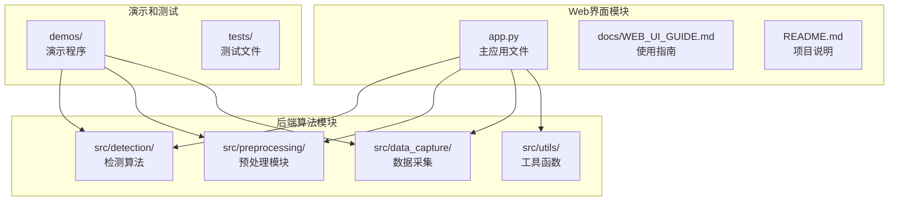
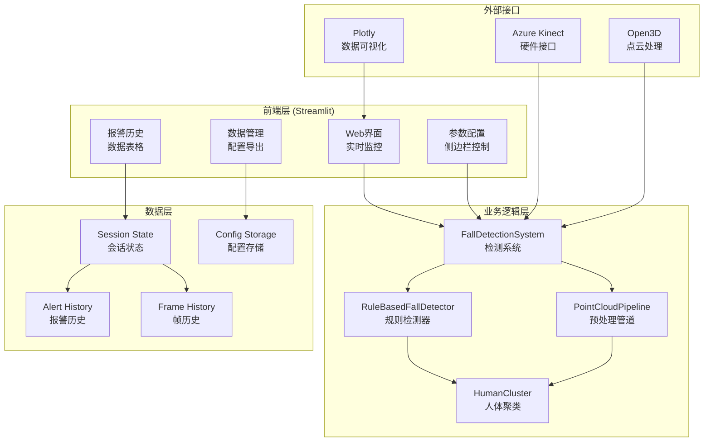
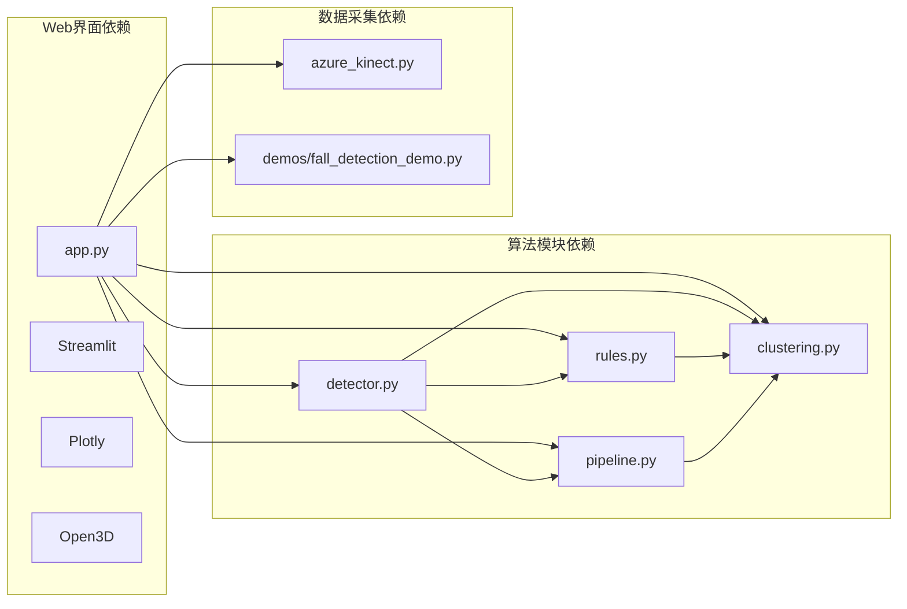

# Web界面API

<cite>
**本文档引用的文件**
- [app.py](file://app.py)
- [README.md](file://README.md)
- [docs/WEB_UI_GUIDE.md](file://docs/WEB_UI_GUIDE.md)
- [src/detection/detector.py](file://src/detection/detector.py)
- [src/detection/rules.py](file://src/detection/rules.py)
- [src/preprocessing/clustering.py](file://src/preprocessing/clustering.py)
- [src/preprocessing/pipeline.py](file://src/preprocessing/pipeline.py)
- [src/data_capture/azure_kinect.py](file://src/data_capture/azure_kinect.py)
- [demos/fall_detection_demo.py](file://demos/fall_detection_demo.py)
- [requirements.txt](file://requirements.txt)
</cite>

## 目录
1. [简介](#简介)
2. [项目结构](#项目结构)
3. [核心组件](#核心组件)
4. [架构概览](#架构概览)
5. [详细组件分析](#详细组件分析)
6. [依赖关系分析](#依赖关系分析)
7. [性能考虑](#性能考虑)
8. [故障排除指南](#故障排除指南)
9. [结论](#结论)

## 简介

GuardianFall系统的Web界面模块是一个基于Streamlit构建的实时摔倒检测可视化平台。该系统提供了完整的监控、分析和管理功能，支持实时点云3D可视化、智能摔倒检测、报警历史记录和参数配置管理。

该Web界面作为系统的前端入口，通过Streamlit框架实现了直观的用户交互体验，同时集成了后端的摔倒检测算法和数据处理模块。

## 项目结构

GuardianFall系统的Web界面模块位于项目的根目录，主要文件包括：

**图表来源**
- [app.py:1-662](file://app.py#L1-L662)
- [README.md:1-347](file://README.md#L1-L347)

**章节来源**
- [app.py:1-662](file://app.py#L1-L662)
- [README.md:1-347](file://README.md#L1-L347)

## 核心组件

### Streamlit应用架构

Web界面采用Streamlit框架构建，具有以下核心特性：

- **页面配置**：宽屏布局，初始侧边栏展开
- **会话状态管理**：完整的状态持久化机制
- **实时数据绑定**：自动更新的可视化组件
- **响应式设计**：适配不同屏幕尺寸

### 主要功能模块

1. **实时监控界面** - 3D点云可视化和检测结果展示
2. **参数配置界面** - 实时调整检测算法参数
3. **报警历史界面** - 报警事件记录和分析
4. **数据管理界面** - 数据集管理和配置导出

**章节来源**
- [app.py:34-134](file://app.py#L34-L134)
- [app.py:210-302](file://app.py#L210-L302)

## 架构概览

GuardianFall系统的Web界面采用分层架构设计：

**图表来源**
- [app.py:75-283](file://app.py#L75-L283)
- [src/detection/detector.py:75-283](file://src/detection/detector.py#L75-L283)
- [src/detection/rules.py:226-423](file://src/detection/rules.py#L226-L423)
- [src/preprocessing/pipeline.py:65-178](file://src/preprocessing/pipeline.py#L65-L178)

## 详细组件分析

### 实时监控界面

实时监控界面是Web界面的核心组件，提供以下功能：

#### 状态指示器
- **系统状态**：实时显示运行状态（运行中/已停止）
- **当前人数**：检测到的人数统计
- **确认摔倒**：已确认的摔倒次数
- **疑似摔倒**：待确认的摔倒次数

#### 3D点云可视化
- **实时渲染**：使用Plotly进行3D点云渲染
- **颜色映射**：根据高度显示不同颜色
- **交互功能**：支持旋转、缩放、平移操作
- **坐标轴控制**：自动调整X/Y/Z轴范围

#### 检测结果面板
- **当前帧信息**：显示当前处理的帧ID
- **人数统计**：实时检测到的人数
- **摔倒状态**：显示检测到的摔倒状态
- **性能指标**：单帧处理时间和FPS

**章节来源**
- [app.py:312-450](file://app.py#L312-L450)
- [app.py:168-193](file://app.py#L168-L193)

### 参数配置界面

参数配置界面允许用户实时调整检测算法的关键参数：

#### 可调参数
| 参数名称 | 默认值 | 范围 | 描述 |
|---------|--------|------|------|
| 体素尺寸 | 0.05m | 0.01-0.2m | 点云降采样精度，影响处理速度和精度 |
| 高度骤降阈值 | 0.3m | 0.1-1.0m | 触发摔倒的高度变化阈值 |
| 速度阈值 | 0.5m/s | 0.2-2.0m/s | 触发摔倒的下落速度阈值 |
| 确认帧数 | 2帧 | 1-10帧 | 连续多少帧确认摔倒 |
| 帧率 | 30 FPS | 10-60 FPS | 系统运行帧率 |

#### 配置管理
- **实时保存**：修改后立即保存到配置文件
- **自动重启**：配置更新后自动重启系统
- **配置导入导出**：支持JSON格式的配置备份和恢复

**章节来源**
- [app.py:244-270](file://app.py#L244-L270)
- [app.py:195-209](file://app.py#L195-L209)

### 报警历史界面

报警历史界面提供完整的报警事件记录和分析功能：

#### 报警记录字段
| 字段名称 | 数据类型 | 描述 |
|---------|----------|------|
| 时间 | Datetime | 报警发生的具体时间 |
| 类型 | String | 报警类型（fall_confirmed/fall_suspected） |
| 人员 ID | Integer | 检测到摔倒的人员编号 |
| 消息 | String | 报警详细描述信息 |
| 置信度 | Percentage | 算法置信度（0-100%） |
| 级别 | String | 报警级别（critical/warning） |

#### 过滤和导出功能
- **级别过滤**：支持按报警级别筛选（全部/确认摔倒/疑似摔倒）
- **数据导出**：支持CSV格式的报警记录导出
- **实时更新**：新增报警自动显示在历史记录中

**章节来源**
- [app.py:535-588](file://app.py#L535-L588)
- [app.py:552-564](file://app.py#L552-L564)

### 数据管理界面

数据管理界面提供数据集管理和配置管理功能：

#### 数据集管理
- **自动扫描**：自动扫描`datasets/`目录下的数据集
- **元数据显示**：显示每个数据集的详细信息（帧数、时长、创建时间）
- **路径查看**：显示数据集的存储路径

#### 配置管理
- **配置导出**：将当前配置保存到`config.json`文件
- **配置导入**：从`config.json`文件加载配置
- **配置显示**：以JSON格式显示当前所有配置参数

**章节来源**
- [app.py:590-652](file://app.py#L590-L652)

## 依赖关系分析

### 核心依赖关系

**图表来源**
- [app.py:29-31](file://app.py#L29-L31)
- [src/detection/detector.py:20-22](file://src/detection/detector.py#L20-L22)
- [src/detection/rules.py:19](file://src/detection/rules.py#L19)

### 外部依赖

系统依赖以下关键外部库：

| 依赖库 | 版本要求 | 用途 |
|--------|----------|------|
| streamlit | >=1.25.0 | Web界面框架 |
| plotly | >=5.18.0 | 3D数据可视化 |
| open3d | >=0.17.0 | 点云处理 |
| numpy | >=1.24.0 | 数值计算 |
| pandas | >=2.0.0 | 数据处理 |
| loguru | >=0.7.0 | 日志记录 |

**章节来源**
- [requirements.txt:1-34](file://requirements.txt#L1-L34)

## 性能考虑

### 实时性能指标

系统设计重点关注实时性能：

- **处理延迟**：< 100ms（目标 < 3ms）
- **检测延迟**：< 3秒（目标 < 100ms）
- **处理速度**：> 20 FPS（目标 > 30 FPS）
- **内存占用**：< 2GB
- **CPU占用**：< 50%（2核）

### 性能优化策略

1. **参数调优**：通过调整体素尺寸和帧率平衡精度和速度
2. **降采样优化**：使用体素降采样减少点云数量
3. **缓存机制**：使用Streamlit的会话状态缓存避免重复计算
4. **异步处理**：后台处理算法，前台保持响应

### 性能监控

系统提供完整的性能监控功能：

- **FPS监控**：实时显示处理速度
- **处理时间**：监控单帧处理耗时
- **内存使用**：跟踪内存占用情况
- **报警统计**：统计报警频率和类型分布

**章节来源**
- [README.md:201-214](file://README.md#L201-L214)
- [app.py:456-533](file://app.py#L456-L533)

## 故障排除指南

### 常见问题及解决方案

#### 浏览器连接问题
- **问题**：浏览器没有自动打开
- **解决方案**：手动访问 `http://localhost:8501`

#### 端口冲突
- **问题**：端口被占用
- **解决方案**：使用其他端口启动：`streamlit run app.py --server.port 8502`

#### 点云显示异常
- **问题**：点云显示空白
- **解决方案**：
  1. 检查是否点击了"启动"
  2. 检查相机连接（如果使用真实相机）
  3. 尝试点击"重置"

#### 性能问题
- **问题**：FPS很低
- **解决方案**：
  1. 增大体素尺寸（如0.1）
  2. 降低帧率设置
  3. 减少点云分辨率
  4. 关闭其他占用CPU的程序

#### 配置问题
- **问题**：误报太多
- **解决方案**：
  1. 增加高度骤降阈值
  2. 增加速度阈值
  3. 增加确认帧数
  4. 调整地面分割参数

**章节来源**
- [docs/WEB_UI_GUIDE.md:265-308](file://docs/WEB_UI_GUIDE.md#L265-L308)

## 结论

GuardianFall系统的Web界面模块提供了一个功能完整、性能优异的实时摔倒检测可视化平台。通过Streamlit框架的直观界面设计和强大的后端算法支持，用户可以轻松监控和管理摔倒检测系统。

### 主要优势

1. **实时性强**：满足实时监控需求，延迟控制在毫秒级别
2. **可视化丰富**：3D点云可视化和多维度统计图表
3. **配置灵活**：支持实时参数调整和配置管理
4. **易于使用**：直观的界面设计和完善的帮助文档
5. **扩展性好**：模块化架构便于功能扩展和维护

### 发展方向

未来可以考虑的功能增强：
- WebSocket通信接口支持实时数据推送
- 用户权限管理系统
- 会话管理和数据持久化优化
- 更丰富的报警通知机制
- 多用户协作功能

该Web界面模块为GuardianFall系统的成功部署和使用提供了坚实的技术基础，为独居老人的安全监护提供了可靠的技术保障。