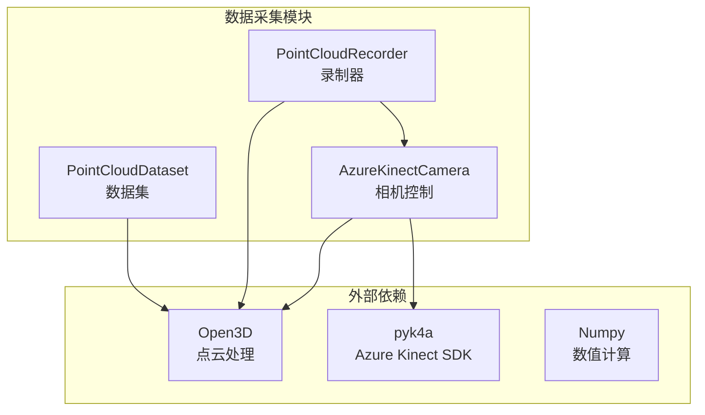
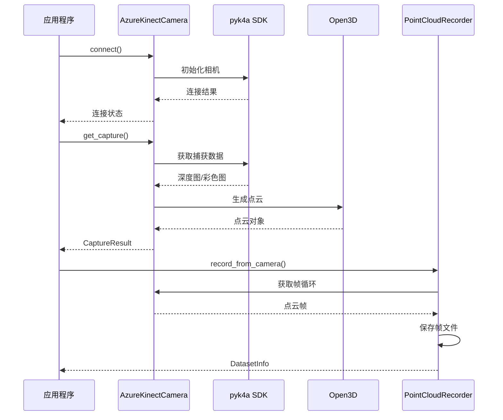
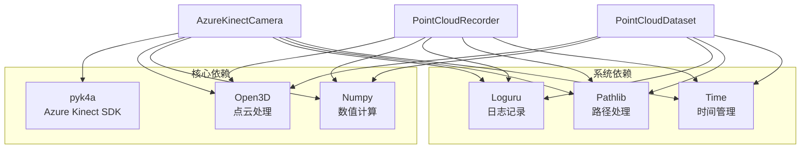
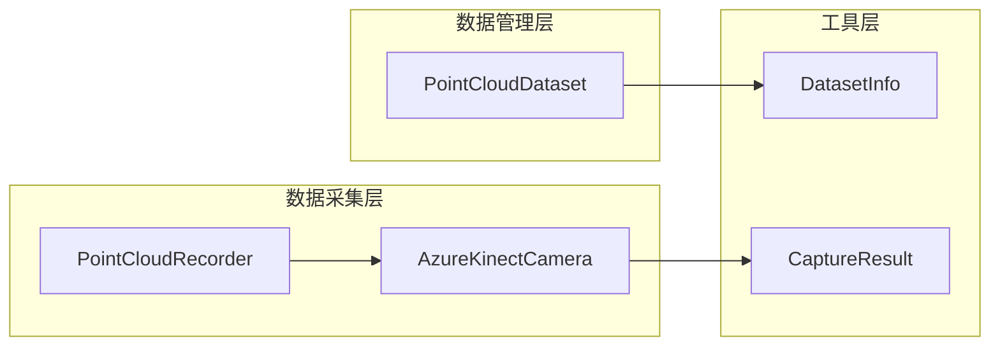

# 数据采集API

<cite>
**本文引用的文件**
- [azure_kinect.py](file://src/data_capture/azure_kinect.py)
- [recorder.py](file://src/data_capture/recorder.py)
- [fall_detection_demo.py](file://demos/fall_detection_demo.py)
- [requirements.txt](file://requirements.txt)
</cite>

## 目录
1. [简介](#简介)
2. [项目结构](#项目结构)
3. [核心组件](#核心组件)
4. [架构概览](#架构概览)
5. [详细组件分析](#详细组件分析)
6. [依赖关系分析](#依赖关系分析)
7. [性能考虑](#性能考虑)
8. [故障排除指南](#故障排除指南)
9. [结论](#结论)
10. [附录](#附录)

## 简介
GuardianFall系统的数据采集模块提供了完整的Azure Kinect DK集成和数据录制功能。该模块支持实时点云捕获、深度图和彩色图获取、点云保存、多帧录制等功能，为摔倒检测系统提供高质量的3D感知数据。

本API参考文档详细说明了Azure Kinect DK集成API的设备初始化、点云捕获、参数配置等接口，以及recorder模块的数据录制功能，包括录制控制、文件格式、存储策略等。文档提供了完整的函数签名、参数说明、返回值定义和异常处理机制，并包含实际的代码示例和使用模式。

## 项目结构
数据采集模块位于`src/data_capture/`目录下，包含两个核心文件：
- `azure_kinect.py`: Azure Kinect DK相机集成和点云处理
- `recorder.py`: 数据录制、保存和回放功能



**图表来源**
- [azure_kinect.py:1-532](file://src/data_capture/azure_kinect.py#L1-L532)
- [recorder.py:1-489](file://src/data_capture/recorder.py#L1-L489)

**章节来源**
- [azure_kinect.py:1-532](file://src/data_capture/azure_kinect.py#L1-L532)
- [recorder.py:1-489](file://src/data_capture/recorder.py#L1-L489)

## 核心组件
数据采集模块包含三个主要组件：

### AzureKinectCamera类
负责Azure Kinect DK相机的完整生命周期管理，包括设备连接、参数配置、实时捕获和点云生成。

### PointCloudRecorder类
提供数据录制功能，支持从相机直接录制、批量保存点云序列、元数据管理等。

### PointCloudDataset类
实现数据集的加载、回放和管理功能，支持迭代访问、标注管理和格式转换。

**章节来源**
- [azure_kinect.py:47-532](file://src/data_capture/azure_kinect.py#L47-L532)
- [recorder.py:48-489](file://src/data_capture/recorder.py#L48-L489)

## 架构概览
系统采用分层架构设计，各组件职责明确，耦合度低，便于维护和扩展。



**图表来源**
- [azure_kinect.py:152-284](file://src/data_capture/azure_kinect.py#L152-L284)
- [recorder.py:177-221](file://src/data_capture/recorder.py#L177-L221)

## 详细组件分析

### AzureKinectCamera类详解

#### 类定义和构造函数
AzureKinectCamera类提供了完整的相机控制功能，支持多种配置选项。

**函数签名**
```python
class AzureKinectCamera:
    def __init__(
        self,
        device_id: int = 0,
        depth_mode: str = 'nfov_unbinned',
        color_resolution: str = 'off',
        fps: int = 30,
        synchronized_images_only: bool = True,
    ):
```

**参数说明**
- `device_id`: 设备ID（多相机场景使用），默认0
- `depth_mode`: 深度模式，支持'nfov_unbinned'、'wfov_unbinned'、'nfov_binned'、'passive_ir'
- `color_resolution`: 彩色分辨率，支持'off'、'720p'、'1080p'、'1440p'、'1536p'、'2160p'、'3072p'
- `fps`: 帧率，支持5、15、30，默认30
- `synchronized_images_only`: 是否只获取同步的深度和彩色图

**返回值**
- 无（构造函数）

**异常处理**
- 当pyk4a库未安装时抛出ImportError
- 连接失败时返回False

**章节来源**
- [azure_kinect.py:50-134](file://src/data_capture/azure_kinect.py#L50-L134)

#### 设备连接管理
相机连接采用显式管理方式，支持连接状态检查和自动断开。

**函数签名**
```python
def connect(self) -> bool:
def disconnect(self):
```

**参数说明**
- connect(): 无参数
- disconnect(): 无参数

**返回值**
- connect(): 返回布尔值表示连接是否成功
- disconnect(): 无返回值

**异常处理**
- 捕获所有连接异常并提供详细错误信息
- 包含USB连接、驱动程序、设备占用等常见问题排查

**章节来源**
- [azure_kinect.py:152-192](file://src/data_capture/azure_kinect.py#L152-L192)

#### 点云捕获功能
提供单帧捕获和连续捕获两种模式，支持超时控制和错误恢复。

**函数签名**
```python
def get_capture(self, timeout_ms: int = 1000) -> CaptureResult:
def capture_continuous(self, duration_seconds: float = 10.0) -> List[CaptureResult]:
```

**参数说明**
- `timeout_ms`: 捕获超时时间（毫秒），默认1000ms
- `duration_seconds`: 连续捕获时长（秒），默认10秒

**返回值**
- get_capture(): 返回CaptureResult对象
- capture_continuous(): 返回CaptureResult列表

**异常处理**
- 捕获超时自动重试
- 深度图转换失败时返回空点云
- 网络异常时记录错误并继续执行

**章节来源**
- [azure_kinect.py:216-375](file://src/data_capture/azure_kinect.py#L216-L375)

#### 点云生成和保存
支持将深度图转换为点云并保存到文件系统。

**函数签名**
```python
def _depth_to_point_cloud(self, depth_image: np.ndarray, timestamp: float) -> o3d.geometry.PointCloud:
def save_point_cloud(self, pcd: o3d.geometry.PointCloud, filepath: str):
def record(self, output_dir: str, duration_seconds: float = 60.0, prefix: str = 'frame'):
```

**参数说明**
- `_depth_to_point_cloud()`: 深度图和时间戳
- `save_point_cloud()`: 点云对象和文件路径
- `record()`: 输出目录、捕获时长和文件名前缀

**返回值**
- `_depth_to_point_cloud()`: 返回Open3D点云对象
- `save_point_cloud()`: 无返回值
- `record()`: 返回元数据字典

**异常处理**
- 文件保存失败时记录错误
- 不支持的文件格式时自动转换为PLY格式

**章节来源**
- [azure_kinect.py:285-440](file://src/data_capture/azure_kinect.py#L285-L440)

#### 数据结构定义
CaptureResult数据类定义了捕获结果的标准格式。

**字段说明**
- `timestamp`: 时间戳（float）
- `depth_image`: 深度图（np.ndarray或None）
- `point_cloud`: 点云对象（Open3D点云或None）
- `color_image`: 彩色图（np.ndarray或None）
- `num_points`: 点数（int）

**属性**
- `has_point_cloud`: 检查是否有有效点云数据

**章节来源**
- [azure_kinect.py:32-45](file://src/data_capture/azure_kinect.py#L32-L45)

### PointCloudRecorder类详解

#### 录制器初始化
提供灵活的录制配置和目录管理。

**函数签名**
```python
def __init__(self, output_dir: str):
def start_recording(self, name: str = "recording", description: str = ""):
def record_frame(self, point_cloud: o3d.geometry.PointCloud, 
                frame_id: Optional[int] = None,
                extra_data: Optional[Dict] = None) -> str:
```

**参数说明**
- `output_dir`: 输出目录路径
- `name`: 数据集名称，默认"recording"
- `description`: 数据集描述
- `frame_id`: 帧ID，None时自动生成
- `extra_data`: 额外元数据

**返回值**
- record_frame(): 返回保存的文件路径

**异常处理**
- 未开始录制时抛出RuntimeError
- 文件保存失败时记录错误

**章节来源**
- [recorder.py:51-128](file://src/data_capture/recorder.py#L51-L128)

#### 直接相机录制
支持从AzureKinectCamera直接录制数据集。

**函数签名**
```python
def record_from_camera(self, camera, duration_seconds: float = 60.0, 
                      name: str = "recording", description: str = "") -> DatasetInfo:
```

**参数说明**
- `camera`: AzureKinectCamera实例
- `duration_seconds`: 录制时长
- `name`: 数据集名称
- `description`: 数据集描述

**返回值**
- 返回DatasetInfo对象

**异常处理**
- 支持用户中断（Ctrl+C）
- 自动清理临时数据

**章节来源**
- [recorder.py:177-221](file://src/data_capture/recorder.py#L177-L221)

#### 录制完成和元数据管理
提供完整的数据集管理和元数据保存功能。

**函数签名**
```python
def stop_recording(self, fps: float = 30.0) -> DatasetInfo:
```

**参数说明**
- `fps`: 帧率

**返回值**
- 返回DatasetInfo对象

**异常处理**
- 自动计算录制时长
- 保存JSON格式元数据

**章节来源**
- [recorder.py:129-176](file://src/data_capture/recorder.py#L129-L176)

### PointCloudDataset类详解

#### 数据集加载和管理
提供数据集的完整生命周期管理。

**函数签名**
```python
def __init__(self, dataset_path: str):
def load_frame(self, frame_id: int) -> Optional[o3d.geometry.PointCloud]:
def iter_frames(self, batch_size: int = 1) -> Iterator[Tuple[int, o3d.geometry.PointCloud]]:
def get_frame_info(self, frame_id: int) -> Dict:
```

**参数说明**
- `dataset_path`: 数据集目录路径
- `frame_id`: 帧ID

**返回值**
- load_frame(): 返回点云对象或None
- iter_frames(): 迭代器对象
- get_frame_info(): 返回帧信息字典

**异常处理**
- 文件不存在时记录警告
- 帧ID超出范围时抛出IndexError

**章节来源**
- [recorder.py:226-311](file://src/data_capture/recorder.py#L226-L311)

#### 数据集回放和标注
支持数据集的可视化回放和标注管理。

**函数签名**
```python
def play(self, fps: Optional[float] = None, loop: bool = False):
def add_annotation(self, frame_id: int, annotation: Dict):
def save_annotations(self, output_file: Optional[str] = None):
```

**参数说明**
- `fps`: 回放帧率
- `loop`: 是否循环播放
- `annotation`: 标注数据

**返回值**
- 无返回值

**异常处理**
- 标注保存到独立JSON文件
- 支持批量标注操作

**章节来源**
- [recorder.py:348-411](file://src/data_capture/recorder.py#L348-L411)

## 依赖关系分析

### 外部依赖
系统依赖多个关键库来实现完整的功能：



**图表来源**
- [requirements.txt:1-34](file://requirements.txt#L1-L34)
- [azure_kinect.py:14-21](file://src/data_capture/azure_kinect.py#L14-L21)
- [recorder.py:14-22](file://src/data_capture/recorder.py#L14-L22)

### 内部依赖关系
各组件之间的依赖关系清晰，避免循环依赖：



**图表来源**
- [azure_kinect.py:32-45](file://src/data_capture/azure_kinect.py#L32-L45)
- [recorder.py:24-46](file://src/data_capture/recorder.py#L24-L46)

**章节来源**
- [requirements.txt:1-34](file://requirements.txt#L1-L34)

## 性能考虑

### 相机性能优化
- **帧率控制**: 通过`time.sleep(1.0/self.fps)`精确控制捕获频率
- **内存管理**: 使用`select_by_index()`移除无效点云
- **并发处理**: 支持多线程同时进行数据捕获和处理

### 存储优化策略
- **文件格式选择**: 默认保存为PLY格式，支持PCD格式
- **目录结构**: 采用frames子目录存储帧文件，metadata.json存储元数据
- **缓存机制**: 数据集加载时使用内存缓存提高访问速度

### 错误恢复机制
- **连接重试**: 相机连接失败时提供详细错误信息
- **超时处理**: 捕获超时自动重试，避免死锁
- **资源清理**: 异常情况下自动断开相机连接

## 故障排除指南

### 常见问题及解决方案

#### 相机连接问题
**症状**: 相机无法连接
**原因**: 
- USB线缆非USB 3.0
- 驱动程序未安装
- 设备被其他程序占用

**解决方案**:
1. 检查USB线缆是否为USB 3.0
2. 安装pyk4a库：`pip install pyk4a`
3. 关闭占用相机的其他程序

#### 深度图转换失败
**症状**: 点云生成失败
**原因**:
- 深度图数据损坏
- 相机校准信息缺失
- 内存不足

**解决方案**:
1. 重新连接相机并重试
2. 检查相机校准状态
3. 释放系统内存

#### 文件保存错误
**症状**: 数据集保存失败
**原因**:
- 磁盘空间不足
- 权限不足
- 路径不存在

**解决方案**:
1. 检查磁盘空间
2. 修改文件权限
3. 创建输出目录

**章节来源**
- [azure_kinect.py:177-184](file://src/data_capture/azure_kinect.py#L177-L184)
- [recorder.py:335-347](file://src/data_capture/recorder.py#L335-L347)

## 结论
GuardianFall系统的数据采集模块提供了完整、可靠的Azure Kinect DK集成和数据录制功能。模块设计遵循良好的软件工程原则，具有以下特点：

1. **完整的功能覆盖**: 从设备连接到数据保存的全流程支持
2. **灵活的配置选项**: 支持多种深度模式、分辨率和帧率设置
3. **健壮的错误处理**: 提供详细的错误信息和自动恢复机制
4. **高效的性能表现**: 优化的内存使用和处理流程
5. **清晰的API设计**: 简洁明了的函数签名和参数说明

该模块为摔倒检测系统提供了高质量的基础数据支撑，能够满足实时监控和离线分析的不同需求。

## 附录

### 使用示例

#### 基础相机使用
```python
# 创建相机实例
camera = AzureKinectCamera(
    depth_mode='nfov_unbinned',
    color_resolution='off',
    fps=30
)

# 连接相机
if camera.connect():
    # 捕获单帧
    result = camera.get_capture()
    if result.has_point_cloud:
        # 保存点云
        camera.save_point_cloud(result.point_cloud, 'frame.ply')
    
    # 断开连接
    camera.disconnect()
```

#### 数据集录制
```python
# 创建录制器
recorder = PointCloudRecorder('./datasets/my_dataset')

# 开始录制
recorder.start_recording('my_recording', '测试数据集')

# 录制帧
for i in range(100):
    result = camera.get_capture()
    if result.has_point_cloud:
        recorder.record_frame(result.point_cloud, i)

# 完成录制
dataset_info = recorder.stop_recording(fps=30.0)
```

#### 数据集加载和回放
```python
# 加载数据集
dataset = PointCloudDataset('./datasets/my_dataset')

# 迭代所有帧
for frame_id, pcd in dataset.iter_frames():
    print(f"帧 {frame_id}: {len(pcd.points)} 个点")

# 播放数据集
dataset.play(fps=30.0, loop=False)
```

### API参考速查表

#### AzureKinectCamera类
- `__init__()`: 初始化相机配置
- `connect()`: 连接相机设备
- `disconnect()`: 断开相机连接
- `get_capture()`: 捕获单帧数据
- `capture_continuous()`: 连续捕获
- `save_point_cloud()`: 保存点云文件
- `record()`: 录制完整数据集

#### PointCloudRecorder类
- `__init__()`: 初始化录制器
- `start_recording()`: 开始录制
- `record_frame()`: 录制单帧
- `record_from_camera()`: 直接从相机录制
- `stop_recording()`: 完成录制

#### PointCloudDataset类
- `__init__()`: 加载数据集
- `load_frame()`: 加载单帧
- `iter_frames()`: 迭代所有帧
- `play()`: 播放数据集
- `add_annotation()`: 添加标注
- `export_to_format()`: 导出数据