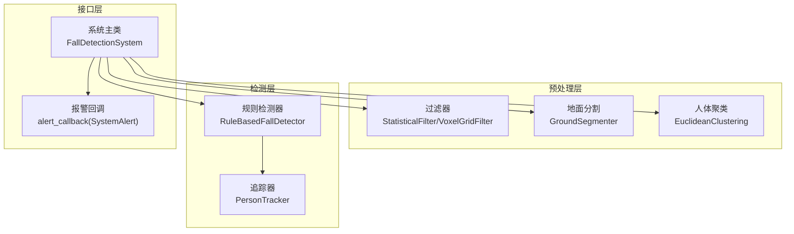
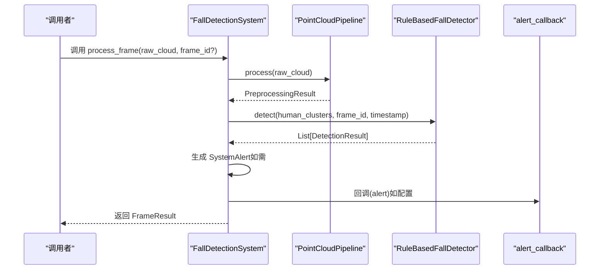
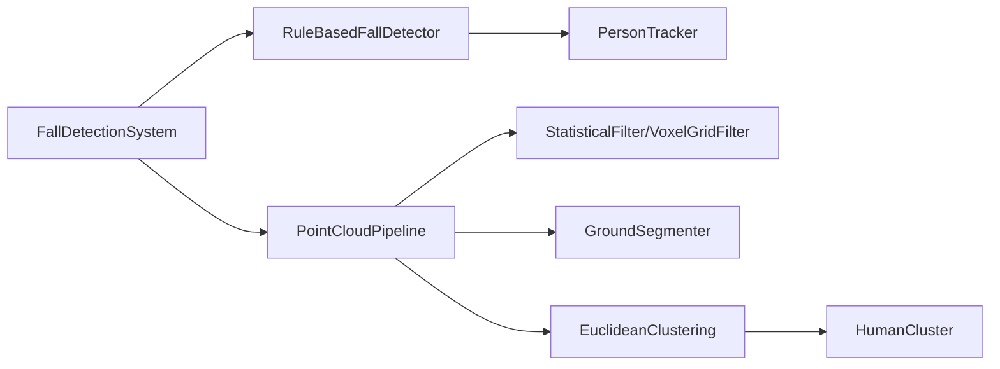

# 检测API

<cite>
**本文档引用的文件**
- [src/detection/detector.py](file://src/detection/detector.py)
- [src/detection/rules.py](file://src/detection/rules.py)
- [src/preprocessing/pipeline.py](file://src/preprocessing/pipeline.py)
- [src/preprocessing/clustering.py](file://src/preprocessing/clustering.py)
- [src/preprocessing/filtering.py](file://src/preprocessing/filtering.py)
- [src/preprocessing/segmentation.py](file://src/preprocessing/segmentation.py)
- [demos/fall_detection_demo.py](file://demos/fall_detection_demo.py)
- [app.py](file://app.py)
</cite>

## 目录
1. [简介](#简介)
2. [项目结构](#项目结构)
3. [核心组件](#核心组件)
4. [架构总览](#架构总览)
5. [详细组件分析](#详细组件分析)
6. [依赖分析](#依赖分析)
7. [性能考虑](#性能考虑)
8. [故障排查指南](#故障排查指南)
9. [结论](#结论)
10. [附录](#附录)

## 简介
本文件为 GuardianFall 系统的摔倒检测模块提供详细的 API 参考与使用说明。重点覆盖：
- FallDetectionSystem 主类的公共接口与参数说明
- RuleBasedFallDetector 的检测接口与配置选项
- SystemAlert、FrameResult、DetectionResult 等核心数据结构的字段定义与使用方法
- 报警回调机制的 API 说明与最佳实践
- 完整使用示例、错误处理策略与性能监控接口

## 项目结构
摔倒检测系统采用“预处理流水线 + 规则引擎”的分层设计：
- 预处理层：体素降采样、统计滤波、地面分割、人体聚类
- 检测层：基于规则的摔倒检测与状态跟踪
- 接口层：系统主类对外暴露统一的处理接口与统计查询

**图表来源**
- [src/detection/detector.py:75-283](file://src/detection/detector.py#L75-L283)
- [src/detection/rules.py:226-422](file://src/detection/rules.py#L226-L422)
- [src/preprocessing/pipeline.py:65-178](file://src/preprocessing/pipeline.py#L65-L178)
- [src/preprocessing/clustering.py:99-181](file://src/preprocessing/clustering.py#L99-L181)

**章节来源**
- [src/detection/detector.py:1-373](file://src/detection/detector.py#L1-L373)
- [src/detection/rules.py:1-526](file://src/detection/rules.py#L1-L526)
- [src/preprocessing/pipeline.py:1-337](file://src/preprocessing/pipeline.py#L1-L337)
- [src/preprocessing/clustering.py:1-495](file://src/preprocessing/clustering.py#L1-L495)
- [src/preprocessing/filtering.py:1-189](file://src/preprocessing/filtering.py#L1-L189)
- [src/preprocessing/segmentation.py:1-243](file://src/preprocessing/segmentation.py#L1-L243)

## 核心组件
- FallDetectionSystem：系统主控制器，负责调用预处理流水线与规则检测器，生成 FrameResult 与 SystemAlert，并维护统计信息。
- RuleBasedFallDetector：基于规则的检测器，对每个人体簇进行状态跟踪与报警判定。
- PersonTracker：对单个人体簇的状态进行历史跟踪，维护状态机与阈值配置。
- 数据结构：SystemAlert、FrameResult、DetectionResult、HumanCluster、PreprocessingResult 等。

**章节来源**
- [src/detection/detector.py:75-283](file://src/detection/detector.py#L75-L283)
- [src/detection/rules.py:226-422](file://src/detection/rules.py#L226-L422)
- [src/preprocessing/clustering.py:15-97](file://src/preprocessing/clustering.py#L15-L97)
- [src/preprocessing/pipeline.py:24-63](file://src/preprocessing/pipeline.py#L24-L63)

## 架构总览
系统主流程如下：
- 输入：Open3D 点云
- 预处理：体素降采样 → 统计滤波 → 地面分割 → 人体聚类
- 检测：对每个簇进行规则检测与状态更新
- 报警：根据状态生成 SystemAlert，触发 alert_callback
- 统计：记录帧数、报警数、平均 FPS、活跃追踪器等

**图表来源**
- [src/detection/detector.py:138-227](file://src/detection/detector.py#L138-L227)
- [src/preprocessing/pipeline.py:98-139](file://src/preprocessing/pipeline.py#L98-L139)
- [src/detection/rules.py:266-337](file://src/detection/rules.py#L266-L337)

## 详细组件分析

### FallDetectionSystem API 参考
- 初始化
  - 构造函数参数
    - voxel_size：体素降采样尺寸（米）
    - std_ratio：统计滤波标准差倍数
    - distance_threshold：地面分割距离阈值（米）
    - cluster_tolerance：聚类半径阈值（米）
    - height_drop_threshold：高度骤降阈值（米）
    - velocity_threshold：速度阈值（米/秒）
    - confirmation_frames：确认摔倒所需连续帧数
    - fps：帧率
    - alert_callback：报警回调函数（可选）
  - 作用：初始化预处理流水线与规则检测器，设置回调与统计变量

- 处理接口
  - process_frame(raw_cloud, frame_id=None) -> FrameResult
    - 功能：处理单帧点云，返回 FrameResult
    - 参数：
      - raw_cloud：原始 Open3D 点云
      - frame_id：帧 ID（可选，默认自增）
    - 返回：FrameResult 对象，包含预处理结果、检测结果、报警列表与处理耗时
  - process_continuous(cloud_generator, max_frames=None)
    - 功能：连续处理点云流，按帧产出 FrameResult
    - 参数：
      - cloud_generator：生成器，每次产出一个点云
      - max_frames：最大处理帧数（None 表示无限）
    - 返回：迭代器，逐帧产出 FrameResult
  - get_statistics() -> Dict
    - 功能：获取系统统计信息
    - 返回：包含运行时长、总帧数、总报警数、平均 FPS、活跃追踪器数、检测器统计等
  - reset()
    - 功能：重置系统状态（重建流水线、清空统计）

- 性能与日志
  - 内部维护 fps_history，用于计算平均 FPS
  - 每帧处理完成后记录调试/警告日志，包含处理时间与当前 FPS

**章节来源**
- [src/detection/detector.py:78-137](file://src/detection/detector.py#L78-L137)
- [src/detection/detector.py:138-227](file://src/detection/detector.py#L138-L227)
- [src/detection/detector.py:229-259](file://src/detection/detector.py#L229-L259)
- [src/detection/detector.py:261-282](file://src/detection/detector.py#L261-L282)

### RuleBasedFallDetector API 参考
- 初始化
  - 构造函数参数
    - height_drop_threshold：高度骤降阈值（米）
    - velocity_threshold：速度阈值（米/秒）
    - lying_aspect_ratio_threshold：躺倒宽高比阈值
    - confirmation_frames：确认摔倒所需连续帧数
    - fps：帧率
  - 作用：创建检测器实例，初始化统计信息

- 检测接口
  - detect(clusters, frame_id, timestamp=None) -> List[DetectionResult]
    - 功能：对给定的人体簇列表进行检测，返回 DetectionResult 列表
    - 参数：
      - clusters：HumanCluster 列表
      - frame_id：帧 ID
      - timestamp：时间戳（可选，默认使用当前时间）
    - 返回：DetectionResult 列表，包含状态、置信度、检测指标与报警信息

- 状态与统计
  - get_tracker(cluster_id) -> Optional[PersonTracker]
    - 功能：获取指定人体的追踪器
  - get_statistics() -> Dict
    - 功能：获取检测统计（总检测数、总报警数、误报数、活跃追踪器数、报警率）
  - reset()
    - 功能：重置检测器状态与统计

- PersonTracker（内部）
  - add_observation(cluster, frame_id, timestamp)
    - 功能：添加观测数据，维护历史记录
  - detect_fall() -> Tuple[bool, float, str]
    - 功能：基于规则判断是否摔倒，返回布尔值、置信度与原因描述
  - update_state(is_fall, confidence, frame_id)
    - 功能：更新摔倒状态机（NORMAL/SUSPECTED/CONFIRMED/RECOVERING/FALSE_ALARM）

**章节来源**
- [src/detection/rules.py:229-264](file://src/detection/rules.py#L229-L264)
- [src/detection/rules.py:266-337](file://src/detection/rules.py#L266-L337)
- [src/detection/rules.py:402-422](file://src/detection/rules.py#L402-L422)
- [src/detection/rules.py:82-224](file://src/detection/rules.py#L82-L224)

### 核心数据结构 API 参考

#### SystemAlert
- 字段
  - timestamp：datetime，报警时间
  - alert_type：str，报警类型（fall_confirmed、fall_suspected、system_error）
  - cluster_id：int，人体簇 ID
  - message：str，报警消息
  - confidence：float，置信度（0-1）
  - location：Optional[str]，位置信息
  - metadata：Optional[Dict]，附加元数据
- 方法
  - to_dict() -> Dict：序列化为字典

**章节来源**
- [src/detection/detector.py:25-46](file://src/detection/detector.py#L25-L46)

#### FrameResult
- 字段
  - frame_id：int
  - timestamp：datetime
  - preprocessing：PreprocessingResult
  - detections：List[DetectionResult]
  - alerts：List[SystemAlert]
  - processing_time_ms：float
- 属性
  - has_fall：是否检测到摔倒
  - num_people：检测到的人数
  - num_falls：摔倒人数

**章节来源**
- [src/detection/detector.py:49-73](file://src/detection/detector.py#L49-L73)

#### DetectionResult
- 字段
  - timestamp：float
  - frame_id：int
  - cluster_id：int
  - state：FallState（枚举）
  - confidence：float
  - height/height_change/velocity/aspect_ratio/is_lying：检测指标
  - alert_triggered：bool
  - alert_level：str（info/warning/critical）
  - message：str
  - cluster：Optional[HumanCluster]
- 方法
  - to_dict() -> Dict：序列化为字典
  - __str__() -> str：字符串表示

**章节来源**
- [src/detection/rules.py:31-78](file://src/detection/rules.py#L31-L78)

#### HumanCluster
- 字段
  - id：int
  - point_cloud：o3d.geometry.PointCloud
  - centroid：np.ndarray
  - bounding_box：o3d.geometry.AxisAlignedBoundingBox
  - num_points：int
  - confidence：float
- 属性
  - height/width/depth/volume：几何属性
  - is_human_like(min_height,max_height,min_points) -> bool：人体相似性判断
- 方法
  - to_dict() -> Dict：序列化为字典

**章节来源**
- [src/preprocessing/clustering.py:15-97](file://src/preprocessing/clustering.py#L15-L97)

#### PreprocessingResult
- 字段
  - original_points/filtered_points/ground_points/non_ground_points：点数统计
  - human_clusters：List[HumanCluster]
  - processing_time_ms：float
- 属性
  - num_humans/has_humans：人数与是否存在人体
- 方法
  - to_dict() -> Dict：序列化为字典
  - __str__() -> str：字符串表示

**章节来源**
- [src/preprocessing/pipeline.py:24-63](file://src/preprocessing/pipeline.py#L24-L63)

### 报警回调机制 API 说明与最佳实践
- 回调签名
  - alert_callback(alert: SystemAlert) -> None
  - 在每帧检测到报警时被调用（若配置）
- 最佳实践
  - 回调应尽量轻量，避免阻塞主线程
  - 对回调异常进行捕获与记录，防止影响主流程
  - 回调中可进行日志、推送、存储等操作，但注意幂等性与限流
  - 若需要异步处理，建议使用队列或线程池

**章节来源**
- [src/detection/detector.py:186-191](file://src/detection/detector.py#L186-L191)

### 使用示例
- 模拟数据演示
  - 使用 demos/fall_detection_demo.py 的 run_mock_demo() 展示如何创建系统、配置回调、连续处理模拟数据并打印统计
- 真实相机演示
  - 使用 demos/fall_detection_demo.py 的 run_camera_demo() 展示如何通过 AzureKinectCamera 获取点云流并接入系统
- Web 界面演示
  - 使用 app.py 的 Streamlit 界面展示实时监控、统计图表与报警历史

**章节来源**
- [demos/fall_detection_demo.py:92-179](file://demos/fall_detection_demo.py#L92-L179)
- [demos/fall_detection_demo.py:181-271](file://demos/fall_detection_demo.py#L181-L271)
- [app.py:105-134](file://app.py#L105-L134)

## 依赖分析
- 组件耦合
  - FallDetectionSystem 依赖 PointCloudPipeline 与 RuleBasedFallDetector
  - RuleBasedFallDetector 依赖 HumanCluster 与 PersonTracker
  - 预处理层内部由 Filtering、Segmentation、Clustering 组成
- 外部依赖
  - Open3D：点云处理
  - NumPy：数值计算
  - Loguru：日志
  - 可选：pyk4a（Azure Kinect SDK）

**图表来源**
- [src/detection/detector.py:104-120](file://src/detection/detector.py#L104-L120)
- [src/detection/rules.py:285-300](file://src/detection/rules.py#L285-L300)
- [src/preprocessing/pipeline.py:86-93](file://src/preprocessing/pipeline.py#L86-L93)
- [src/preprocessing/filtering.py:13-139](file://src/preprocessing/filtering.py#L13-L139)
- [src/preprocessing/segmentation.py:13-81](file://src/preprocessing/segmentation.py#L13-L81)
- [src/preprocessing/clustering.py:99-181](file://src/preprocessing/clustering.py#L99-L181)

**章节来源**
- [src/detection/detector.py:1-373](file://src/detection/detector.py#L1-L373)
- [src/detection/rules.py:1-526](file://src/detection/rules.py#L1-L526)
- [src/preprocessing/pipeline.py:1-337](file://src/preprocessing/pipeline.py#L1-L337)
- [src/preprocessing/clustering.py:1-495](file://src/preprocessing/clustering.py#L1-L495)
- [src/preprocessing/filtering.py:1-189](file://src/preprocessing/filtering.py#L1-L189)
- [src/preprocessing/segmentation.py:1-243](file://src/preprocessing/segmentation.py#L1-L243)

## 性能考虑
- 处理延迟
  - 系统在每帧处理完成后记录 processing_time_ms，并维护最近 30 帧的 FPS 历史，用于计算平均 FPS
- 配置优化
  - voxel_size：影响点云规模与处理速度
  - std_ratio：影响离群点剔除效果与稳定性
  - distance_threshold：影响地面分割精度
  - cluster_tolerance：影响聚类半径与召回
  - height_drop_threshold/velocity_threshold：影响检测灵敏度
  - confirmation_frames：影响误报抑制
- 实时性
  - process_continuous 支持持续流式处理，适合实时场景
  - get_statistics 提供平均 FPS 与活跃追踪器数，便于动态调参

**章节来源**
- [src/detection/detector.py:196-226](file://src/detection/detector.py#L196-L226)
- [src/detection/detector.py:261-272](file://src/detection/detector.py#L261-L272)
- [src/preprocessing/pipeline.py:195-248](file://src/preprocessing/pipeline.py#L195-L248)

## 故障排查指南
- 常见问题
  - 回调异常：系统会捕获回调异常并记录错误日志，不影响主流程
  - 无检测结果：检查预处理参数（如 voxel_size、distance_threshold、cluster_tolerance）是否合理
  - 报警过多：提高 confirmation_frames、height_drop_threshold、velocity_threshold，或降低 std_ratio
  - 报警过少：降低 confirmation_frames、height_drop_threshold、velocity_threshold，或提高 std_ratio
- 日志定位
  - 系统在关键节点输出调试/警告日志，包含处理时间与当前 FPS，便于定位瓶颈
- 相机连接问题（Azure Kinect）
  - 若未安装 pyk4a，将抛出 ImportError；请按提示安装并检查硬件连接

**章节来源**
- [src/detection/detector.py:186-191](file://src/detection/detector.py#L186-L191)
- [src/detection/detector.py:253-257](file://src/detection/detector.py#L253-L257)
- [src/data_capture/azure_kinect.py:79-86](file://src/data_capture/azure_kinect.py#L79-L86)

## 结论
本 API 文档系统性梳理了 GuardianFall 摔倒检测模块的接口与数据结构，提供了规则检测器的配置要点、报警回调的最佳实践以及性能监控方法。结合演示程序与 Web 界面，用户可快速集成并部署实时摔倒检测能力。

## 附录

### API 一览（方法与参数）
- FallDetectionSystem
  - 构造函数：配置预处理与检测参数，设置 alert_callback
  - process_frame(raw_cloud, frame_id=None) -> FrameResult
  - process_continuous(cloud_generator, max_frames=None)
  - get_statistics() -> Dict
  - reset()
- RuleBasedFallDetector
  - 构造函数：配置检测阈值与确认帧数
  - detect(clusters, frame_id, timestamp=None) -> List[DetectionResult]
  - get_tracker(cluster_id) -> Optional[PersonTracker]
  - get_statistics() -> Dict
  - reset()

**章节来源**
- [src/detection/detector.py:78-137](file://src/detection/detector.py#L78-L137)
- [src/detection/detector.py:138-227](file://src/detection/detector.py#L138-L227)
- [src/detection/detector.py:229-259](file://src/detection/detector.py#L229-L259)
- [src/detection/detector.py:261-282](file://src/detection/detector.py#L261-L282)
- [src/detection/rules.py:229-264](file://src/detection/rules.py#L229-L264)
- [src/detection/rules.py:266-337](file://src/detection/rules.py#L266-L337)
- [src/detection/rules.py:402-422](file://src/detection/rules.py#L402-L422)