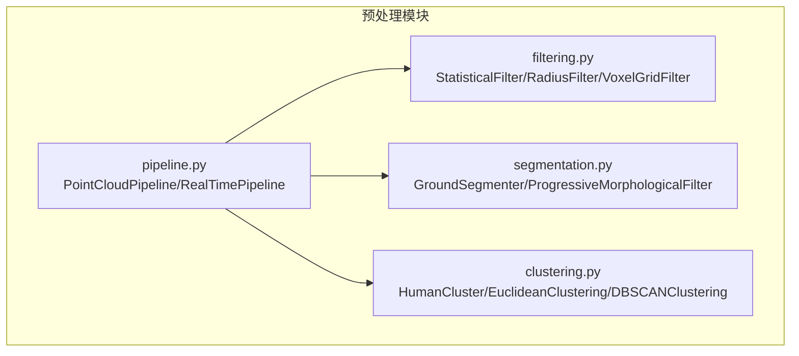
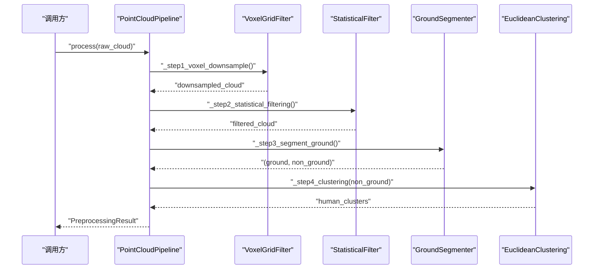
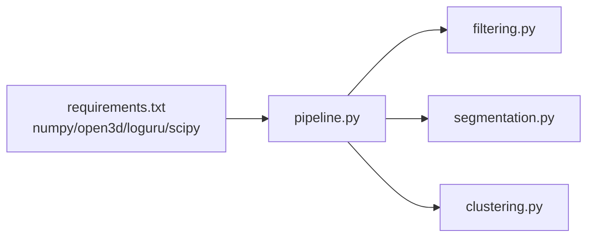

# 预处理API

<cite>
**本文引用的文件**
- [pipeline.py](file://src/preprocessing/pipeline.py)
- [filtering.py](file://src/preprocessing/filtering.py)
- [segmentation.py](file://src/preprocessing/segmentation.py)
- [clustering.py](file://src/preprocessing/clustering.py)
- [requirements.txt](file://requirements.txt)
- [README.md](file://README.md)
</cite>

## 目录
1. [简介](#简介)
2. [项目结构](#项目结构)
3. [核心组件](#核心组件)
4. [架构总览](#架构总览)
5. [详细组件分析](#详细组件分析)
6. [依赖分析](#依赖分析)
7. [性能考虑](#性能考虑)
8. [故障排查指南](#故障排查指南)
9. [结论](#结论)
10. [附录](#附录)

## 简介
本文件为GuardianFall系统的点云预处理模块提供详细的API参考文档，涵盖PointCloudPipeline类的公共接口、滤波算法API、地面分割API、人体聚类API、结果数据结构PreprocessingResult，以及错误码与异常处理机制和性能调优指南。内容面向开发者与技术支持人员，帮助快速理解与集成预处理流水线。

## 项目结构
点云预处理模块位于src/preprocessing目录下，包含四个核心文件：
- pipeline.py：定义PointCloudPipeline、RealTimePipeline及工厂函数
- filtering.py：提供统计滤波、半径滤波、体素降采样等滤波器
- segmentation.py：提供RANSAC地面分割与渐进形态学滤波器
- clustering.py：提供人体簇数据结构与欧式聚类、DBSCAN聚类、多视角聚类等

图表来源
- [pipeline.py:1-337](file://src/preprocessing/pipeline.py#L1-L337)
- [filtering.py:1-189](file://src/preprocessing/filtering.py#L1-L189)
- [segmentation.py:1-243](file://src/preprocessing/segmentation.py#L1-L243)
- [clustering.py:1-495](file://src/preprocessing/clustering.py#L1-L495)

章节来源
- [pipeline.py:1-337](file://src/preprocessing/pipeline.py#L1-L337)
- [filtering.py:1-189](file://src/preprocessing/filtering.py#L1-L189)
- [segmentation.py:1-243](file://src/preprocessing/segmentation.py#L1-L243)
- [clustering.py:1-495](file://src/preprocessing/clustering.py#L1-L495)

## 核心组件
- PointCloudPipeline：完整的点云预处理流水线，包含体素降采样、统计滤波、地面分割、人体聚类四步处理。
- RealTimePipeline：针对连续帧的实时优化流水线，内置帧率统计与历史记录。
- PreprocessingResult：预处理结果数据结构，包含原始点数、滤波后点数、地面点数、非地面点数、人体簇列表、处理时间等。
- 滤波器：StatisticalFilter、RadiusFilter、VoxelGridFilter。
- 地面分割器：GroundSegmenter、ProgressiveMorphologicalFilter。
- 聚类器：EuclideanClustering、DBSCANClustering、MultiViewClustering。
- HumanCluster：人体簇数据结构，包含质心、包围盒、高度、宽度、深度、体积、置信度等。

章节来源
- [pipeline.py:24-63](file://src/preprocessing/pipeline.py#L24-L63)
- [pipeline.py:65-178](file://src/preprocessing/pipeline.py#L65-L178)
- [pipeline.py:180-248](file://src/preprocessing/pipeline.py#L180-L248)
- [filtering.py:13-164](file://src/preprocessing/filtering.py#L13-L164)
- [segmentation.py:13-137](file://src/preprocessing/segmentation.py#L13-L137)
- [segmentation.py:139-185](file://src/preprocessing/segmentation.py#L139-L185)
- [clustering.py:15-97](file://src/preprocessing/clustering.py#L15-L97)
- [clustering.py:99-181](file://src/preprocessing/clustering.py#L99-L181)
- [clustering.py:223-318](file://src/preprocessing/clustering.py#L223-L318)
- [clustering.py:321-372](file://src/preprocessing/clustering.py#L321-L372)

## 架构总览
PointCloudPipeline将四个处理步骤串联，形成标准预处理流水线；RealTimePipeline在标准流水线基础上增加帧率统计与历史记录，便于实时监控与调参。

图表来源
- [pipeline.py:98-139](file://src/preprocessing/pipeline.py#L98-L139)
- [pipeline.py:141-159](file://src/preprocessing/pipeline.py#L141-L159)
- [filtering.py:28-49](file://src/preprocessing/filtering.py#L28-L49)
- [segmentation.py:41-81](file://src/preprocessing/segmentation.py#L41-L81)
- [clustering.py:124-181](file://src/preprocessing/clustering.py#L124-L181)

## 详细组件分析

### PointCloudPipeline类
- 功能概述
  - 标准预处理流水线，依次执行体素降采样、统计滤波、地面分割、人体聚类。
  - 支持批量处理process_batch，适合离线分析。
- 关键接口
  - __init__(config: Optional[Dict] = None)
    - 从配置字典加载参数，初始化各子模块。
    - 参数键：voxel_size、std_ratio、distance_threshold、cluster_tolerance、min_cluster_size、max_cluster_size。
  - process(raw_cloud: o3d.geometry.PointCloud) -> PreprocessingResult
    - 执行完整流水线，返回PreprocessingResult。
  - process_batch(clouds: List[o3d.geometry.PointCloud]) -> List[PreprocessingResult]
    - 批量处理点云列表。
- 内部步骤
  - _step1_voxel_downsample：体素降采样
  - _step2_statistical_filtering：统计滤波
  - _step3_segment_ground：地面分割
  - _step4_clustering：人体聚类
- 返回结果
  - PreprocessingResult包含原始点数、滤波后点数、地面点数、非地面点数、人体簇列表、处理时间（毫秒）。

章节来源
- [pipeline.py:68-96](file://src/preprocessing/pipeline.py#L68-L96)
- [pipeline.py:98-139](file://src/preprocessing/pipeline.py#L98-L139)
- [pipeline.py:161-177](file://src/preprocessing/pipeline.py#L161-L177)

### RealTimePipeline类
- 功能概述
  - 针对连续帧流的实时优化，记录每帧处理时间与FPS，维护最近30帧的FPS历史。
- 关键接口
  - __init__(config: Optional[Dict] = None)
  - process_frame(cloud: o3d.geometry.PointCloud) -> PreprocessingResult
  - get_average_fps() -> float
  - reset()
- 性能统计
  - 每帧计算处理时间与瞬时FPS，维护平均FPS与历史记录。

章节来源
- [pipeline.py:183-248](file://src/preprocessing/pipeline.py#L183-L248)

### PreprocessingResult数据结构
- 字段
  - original_points: int
  - filtered_points: int
  - ground_points: int
  - non_ground_points: int
  - human_clusters: List[HumanCluster]
  - processing_time_ms: float
- 计算属性
  - num_humans: int
  - has_humans: bool
- 辅助方法
  - to_dict(): Dict
  - __str__(): str

章节来源
- [pipeline.py:24-63](file://src/preprocessing/pipeline.py#L24-L63)

### 滤波算法API
- StatisticalFilter
  - __init__(nb_neighbors: int = 20, std_ratio: float = 2.0)
  - apply(cloud: o3d.geometry.PointCloud) -> o3d.geometry.PointCloud
  - apply_with_indices(cloud: o3d.geometry.PointCloud) -> Tuple[o3d.geometry.PointCloud, np.ndarray]
- RadiusFilter
  - __init__(radius: float = 0.1, min_points: int = 5)
  - apply(cloud: o3d.geometry.PointCloud) -> o3d.geometry.PointCloud
- VoxelGridFilter
  - __init__(leaf_size: float = 0.05)
  - apply(cloud: o3d.geometry.PointCloud) -> o3d.geometry.PointCloud
- 工厂函数
  - create_filter(filter_type: str, **kwargs) -> Filter

章节来源
- [filtering.py:13-164](file://src/preprocessing/filtering.py#L13-L164)

### 地面分割API
- GroundSegmenter
  - __init__(distance_threshold: float = 0.05, ransac_n: int = 3, num_iterations: int = 100, z_axis: int = 1)
  - segment(cloud: o3d.geometry.PointCloud) -> Tuple[o3d.geometry.PointCloud, o3d.geometry.PointCloud]
  - get_plane_equation(cloud: o3d.geometry.PointCloud) -> np.ndarray
  - remove_ground(cloud: o3d.geometry.PointCloud) -> o3d.geometry.PointCloud
- ProgressiveMorphologicalFilter
  - __init__(max_window_size: float = 2.0, slope: float = 1.0, initial_distance: float = 0.5)
  - apply(cloud: o3d.geometry.PointCloud) -> Tuple[o3d.geometry.PointCloud, o3d.geometry.PointCloud]
- 工厂函数
  - create_segmenter(method: str = 'ransac', **kwargs) -> Segmenter

章节来源
- [segmentation.py:13-137](file://src/preprocessing/segmentation.py#L13-L137)
- [segmentation.py:139-185](file://src/preprocessing/segmentation.py#L139-L185)

### 人体聚类API
- HumanCluster
  - 字段：id, point_cloud, centroid, bounding_box, num_points, confidence
  - 属性：height, width, depth, volume
  - 方法：is_human_like(min_height=0.5, max_height=2.5, min_points=50) -> bool, to_dict() -> Dict
- EuclideanClustering
  - __init__(cluster_tolerance: float = 0.1, min_cluster_size: int = 50, max_cluster_size: int = 5000)
  - cluster(cloud: o3d.geometry.PointCloud) -> List[HumanCluster]
- DBSCANClustering
  - __init__(eps: float = 0.15, min_samples: int = 30, metric: str = 'euclidean')
  - cluster(cloud: o3d.geometry.PointCloud) -> List[HumanCluster]
- MultiViewClustering
  - __init__(base_clusterer: EuclideanClustering)
  - cluster_from_multiple_views(clouds: List[o3d.geometry.PointCloud], transforms: List[np.ndarray]) -> List[HumanCluster]
- 工厂函数
  - create_clusterer(method: str = 'euclidean', **kwargs) -> Clusterer

章节来源
- [clustering.py:15-97](file://src/preprocessing/clustering.py#L15-L97)
- [clustering.py:99-181](file://src/preprocessing/clustering.py#L99-L181)
- [clustering.py:223-318](file://src/preprocessing/clustering.py#L223-L318)
- [clustering.py:321-372](file://src/preprocessing/clustering.py#L321-L372)

### API使用示例（路径指引）
- 标准流水线处理
  - [pipeline.py:295-304](file://src/preprocessing/pipeline.py#L295-L304)
- 批量处理
  - [pipeline.py:171-176](file://src/preprocessing/pipeline.py#L171-L176)
- 实时处理
  - [pipeline.py:199-235](file://src/preprocessing/pipeline.py#L199-L235)
- 滤波器使用
  - [filtering.py:180-188](file://src/preprocessing/filtering.py#L180-L188)
- 地面分割
  - [segmentation.py:232-236](file://src/preprocessing/segmentation.py#L232-L236)
- 聚类
  - [clustering.py:473-488](file://src/preprocessing/clustering.py#L473-L488)

## 依赖分析
- 外部依赖
  - numpy、open3d、loguru、scipy（requirements.txt）
- 内部模块耦合
  - pipeline.py依赖filtering.py、segmentation.py、clustering.py
  - 各模块内部职责清晰，耦合度低，便于替换与扩展

图表来源
- [requirements.txt:1-34](file://requirements.txt#L1-L34)
- [pipeline.py:19-21](file://src/preprocessing/pipeline.py#L19-L21)

章节来源
- [requirements.txt:1-34](file://requirements.txt#L1-L34)
- [pipeline.py:19-21](file://src/preprocessing/pipeline.py#L19-L21)

## 性能考虑
- 处理速度与资源占用
  - 系统目标：处理速度>20 FPS，单帧耗时<100ms，内存占用<2GB，CPU占用<50%（2核）。
- 优化建议
  - 体素降采样：适当增大leaf_size以显著降低点数，平衡精度与速度。
  - 统计滤波：调整std_ratio与邻域点数，避免过度滤波导致人体细节丢失。
  - 地面分割：合理设置distance_threshold与迭代次数，确保地面平面拟合稳定。
  - 聚类：根据场景调整cluster_tolerance、min_cluster_size、max_cluster_size，提升召回与精度。
  - 实时模式：使用RealTimePipeline监控平均FPS，动态调节参数。
- 性能基准
  - README中给出系统性能指标与覆盖范围，可作为调参参考。

章节来源
- [README.md:201-218](file://README.md#L201-L218)
- [pipeline.py:180-248](file://src/preprocessing/pipeline.py#L180-L248)

## 故障排查指南
- 常见问题与定位
  - 点云为空或点数过少：检查数据采集与预处理前置条件。
  - 地面分割异常：检查distance_threshold是否过大或过小，z_axis是否匹配传感器坐标系。
  - 聚类结果为空：检查cluster_tolerance与min_cluster_size设置，确认非地面点云质量。
  - 性能不足：通过RealTimePipeline查看平均FPS，逐步降低体素大小或滤波强度。
- 日志与告警
  - 模块广泛使用loguru记录调试、信息、警告与错误日志，便于定位问题。
  - 对异常输入与边界情况会输出警告或抛出异常（如平面拟合点数不足）。
- 依赖缺失
  - 缺少pyk4a等依赖时，相关模块会输出警告或抛出ImportError，需按提示安装。

章节来源
- [segmentation.py:102-103](file://src/preprocessing/segmentation.py#L102-L103)
- [demos/fall_detection_demo.py:188-195](file://demos/fall_detection_demo.py#L188-L195)

## 结论
PointCloudPipeline提供了从原始点云到人体簇的完整预处理流程，结合滤波、地面分割与聚类算法，能够稳定地支撑摔倒检测系统。通过PreprocessingResult统一输出关键指标与统计信息，便于上层检测模块与可视化展示。配合RealTimePipeline的性能监控与调参建议，可在保证精度的同时满足实时性要求。

## 附录

### API清单与参数说明
- PointCloudPipeline.__init__(config)
  - voxel_size: 体素边长（米）
  - std_ratio: 统计滤波标准差倍数
  - distance_threshold: 地面分割距离阈值（米）
  - cluster_tolerance: 聚类半径阈值（米）
  - min_cluster_size/max_cluster_size: 簇点数上下限
- StatisticalFilter.__init__(nb_neighbors, std_ratio)
- RadiusFilter.__init__(radius, min_points)
- VoxelGridFilter.__init__(leaf_size)
- GroundSegmenter.__init__(distance_threshold, ransac_n, num_iterations, z_axis)
- EuclideanClustering.__init__(cluster_tolerance, min_cluster_size, max_cluster_size)
- DBSCANClustering.__init__(eps, min_samples, metric)
- MultiViewClustering.__init__(base_clusterer)

章节来源
- [pipeline.py:68-96](file://src/preprocessing/pipeline.py#L68-L96)
- [filtering.py:16-26](file://src/preprocessing/filtering.py#L16-L26)
- [filtering.py:73-83](file://src/preprocessing/filtering.py#L73-L83)
- [filtering.py:112-120](file://src/preprocessing/filtering.py#L112-L120)
- [segmentation.py:16-36](file://src/preprocessing/segmentation.py#L16-L36)
- [clustering.py:102-119](file://src/preprocessing/clustering.py#L102-L119)
- [clustering.py:226-244](file://src/preprocessing/clustering.py#L226-L244)
- [clustering.py:324-332](file://src/preprocessing/clustering.py#L324-L332)