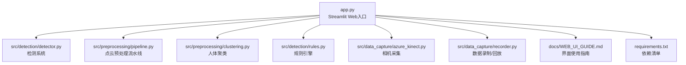
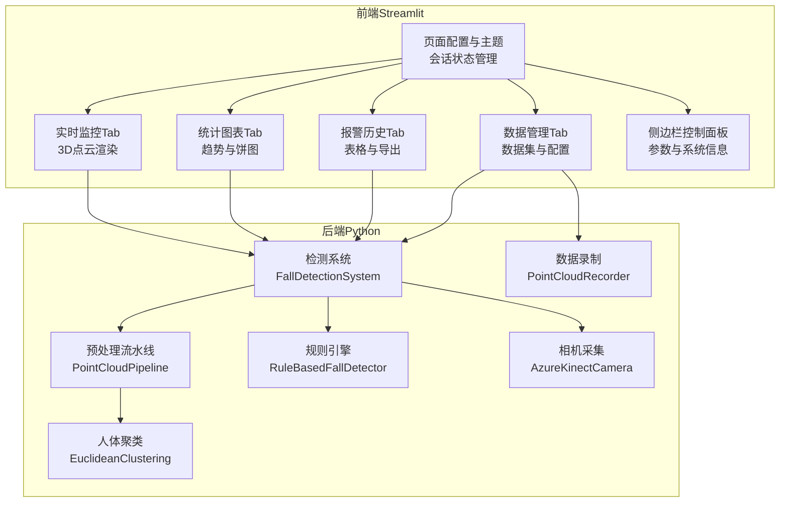
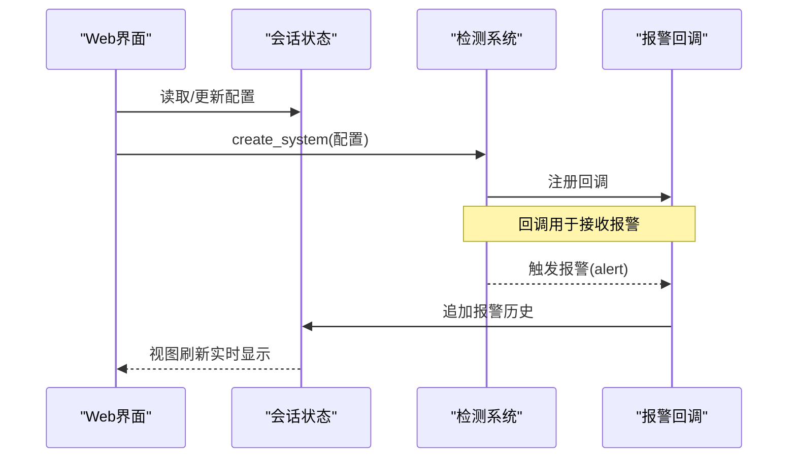
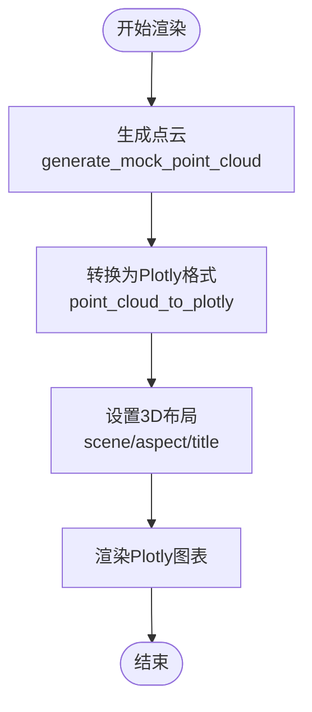
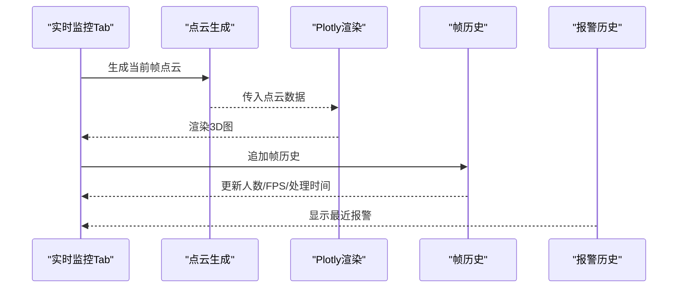
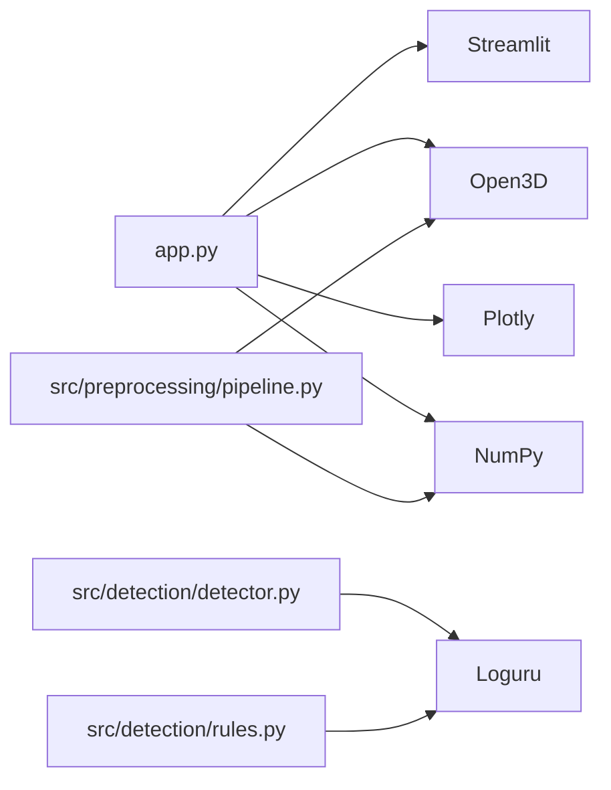

# Web界面系统

<cite>
**本文引用的文件**
- [app.py](file://app.py)
- [WEB_UI_GUIDE.md](file://docs/WEB_UI_GUIDE.md)
- [requirements.txt](file://requirements.txt)
- [README.md](file://README.md)
- [src/detection/detector.py](file://src/detection/detector.py)
- [src/detection/rules.py](file://src/detection/rules.py)
- [src/preprocessing/pipeline.py](file://src/preprocessing/pipeline.py)
- [src/preprocessing/clustering.py](file://src/preprocessing/clustering.py)
- [src/data_capture/azure_kinect.py](file://src/data_capture/azure_kinect.py)
- [src/data_capture/recorder.py](file://src/data_capture/recorder.py)
- [demos/fall_detection_demo.py](file://demos/fall_detection_demo.py)
</cite>

## 目录
1. [简介](#简介)
2. [项目结构](#项目结构)
3. [核心组件](#核心组件)
4. [架构总览](#架构总览)
5. [详细组件分析](#详细组件分析)
6. [依赖分析](#依赖分析)
7. [性能考虑](#性能考虑)
8. [故障排查指南](#故障排查指南)
9. [结论](#结论)
10. [附录](#附录)

## 简介
本文件面向GuardianFall的Web界面系统，基于Streamlit构建，提供实时3D点云可视化、检测结果展示、报警历史、性能统计图表与数据管理能力。系统通过自定义CSS样式、Plotly 3D渲染、Streamlit组件与后端检测算法的紧密协作，形成完整的可视化与交互闭环。本文将从架构、组件、数据流、交互模式、性能与扩展性等方面进行全面阐述，并给出定制化与主题配置、响应式设计与实时更新机制的实践指导。

## 项目结构
GuardianFall采用模块化分层组织，Web界面位于应用入口文件中，核心检测与预处理逻辑分布在src目录下，配套Demo与数据采集模块完善端到端体验。

**图表来源**
- [app.py:1-662](file://app.py#L1-L662)
- [src/detection/detector.py:1-373](file://src/detection/detector.py#L1-L373)
- [src/preprocessing/pipeline.py:1-337](file://src/preprocessing/pipeline.py#L1-L337)
- [src/preprocessing/clustering.py:1-495](file://src/preprocessing/clustering.py#L1-L495)
- [src/detection/rules.py:1-526](file://src/detection/rules.py#L1-L526)
- [src/data_capture/azure_kinect.py:1-532](file://src/data_capture/azure_kinect.py#L1-L532)
- [src/data_capture/recorder.py:1-489](file://src/data_capture/recorder.py#L1-L489)
- [docs/WEB_UI_GUIDE.md:1-362](file://docs/WEB_UI_GUIDE.md#L1-L362)
- [requirements.txt:1-34](file://requirements.txt#L1-L34)

**章节来源**
- [README.md:100-148](file://README.md#L100-L148)
- [app.py:15-40](file://app.py#L15-L40)

## 核心组件
- 页面配置与主题样式
  - 页面布局、图标、初始展开侧边栏
  - 自定义CSS样式卡片、状态指示器、告警提示样式
- 会话状态管理
  - 系统实例、运行状态、报警历史、帧历史、启动时间、配置字典
- 检测系统创建与回调
  - 通过配置参数创建检测系统，注册报警回调，更新历史记录
- 3D点云渲染
  - Open3D点云生成与转换，Plotly Scatter3d渲染，颜色映射与交互
- 实时监控Tab
  - 状态指示器、点云视图、检测结果面板、报警提示
- 统计图表Tab
  - FPS趋势、处理时间趋势、报警统计饼图
- 报警历史Tab
  - 历史记录表格、过滤、CSV导出
- 数据管理Tab
  - 数据集列表、元数据展示、配置导入导出
- 侧边栏控制面板
  - 启动/停止/重置、参数配置滑条、系统信息、关于

**章节来源**
- [app.py:33-102](file://app.py#L33-L102)
- [app.py:104-134](file://app.py#L104-L134)
- [app.py:136-166](file://app.py#L136-L166)
- [app.py:168-193](file://app.py#L168-L193)
- [app.py:195-209](file://app.py#L195-L209)
- [app.py:210-302](file://app.py#L210-L302)
- [app.py:308-450](file://app.py#L308-L450)
- [app.py:452-533](file://app.py#L452-L533)
- [app.py:535-588](file://app.py#L535-L588)
- [app.py:590-652](file://app.py#L590-L652)

## 架构总览
Web界面作为前端入口，负责实时渲染与用户交互；后端检测系统由预处理流水线、人体聚类与规则引擎组成，二者通过会话状态与回调进行数据绑定与更新。

**图表来源**
- [app.py:33-662](file://app.py#L33-L662)
- [src/detection/detector.py:75-283](file://src/detection/detector.py#L75-L283)
- [src/preprocessing/pipeline.py:65-178](file://src/preprocessing/pipeline.py#L65-L178)
- [src/preprocessing/clustering.py:99-182](file://src/preprocessing/clustering.py#L99-L182)
- [src/detection/rules.py:226-423](file://src/detection/rules.py#L226-L423)
- [src/data_capture/azure_kinect.py:47-460](file://src/data_capture/azure_kinect.py#L47-L460)
- [src/data_capture/recorder.py:48-176](file://src/data_capture/recorder.py#L48-L176)

## 详细组件分析

### 页面配置与主题样式
- 页面配置：宽屏布局、初始展开侧边栏、页面标题与图标
- 自定义CSS：告警卡片样式（严重/警告/信息）、统计卡片、指标数字样式
- 作用：统一视觉风格，提升可读性与警示效果

**章节来源**
- [app.py:33-82](file://app.py#L33-L82)

### 会话状态管理
- 关键状态键：
  - system：检测系统实例
  - running：运行开关
  - alert_history：报警历史（最多100条）
  - frame_history：帧历史（最多100帧）
  - start_time：系统启动时间
  - config：配置字典（体素尺寸、高度骤降阈值、速度阈值、确认帧数、帧率）
- 作用：跨刷新保持状态，支撑实时更新与历史记录

**章节来源**
- [app.py:83-102](file://app.py#L83-L102)

### 检测系统创建与回调
- create_system：根据session_state.config创建FallDetectionSystem，注入on_alert回调
- on_alert：将报警追加到alert_history，维持长度上限，自动标记级别
- 作用：建立UI与后端检测系统的数据绑定，实现报警实时展示

**图表来源**
- [app.py:104-134](file://app.py#L104-L134)
- [src/detection/detector.py:172-192](file://src/detection/detector.py#L172-L192)

**章节来源**
- [app.py:104-134](file://app.py#L104-L134)
- [src/detection/detector.py:172-192](file://src/detection/detector.py#L172-L192)

### 3D点云渲染与颜色映射
- generate_mock_point_cloud：生成地面与人体点云，带噪声与高度变化
- point_cloud_to_plotly：将Open3D点云转换为Plotly Scatter3d，按Z轴高度映射颜色
- 实时监控Tab：动态生成图、设置坐标轴范围、标题与交互
- 作用：直观展示点云与检测状态，支持旋转、缩放、平移

**图表来源**
- [app.py:136-166](file://app.py#L136-L166)
- [app.py:168-193](file://app.py#L168-L193)
- [app.py:340-420](file://app.py#L340-L420)

**章节来源**
- [app.py:136-193](file://app.py#L136-L193)
- [app.py:340-420](file://app.py#L340-L420)

### 实时监控Tab（核心交互）
- 状态指示器：系统状态、当前人数、确认摔倒、疑似摔倒
- 点云视图：Plotly 3D渲染，标题随检测状态变化
- 检测结果面板：当前帧、人数、摔倒状态、处理时间、最近报警
- 报警提示：根据最新报警级别显示错误/警告提示
- 作用：集中展示实时状态与检测结果，便于快速响应

**图表来源**
- [app.py:311-450](file://app.py#L311-L450)

**章节来源**
- [app.py:311-450](file://app.py#L311-L450)

### 统计图表Tab（性能与报警）
- FPS趋势：基于frame_history中处理时间计算FPS，绘制折线
- 处理时间：直接使用processing_time_ms绘制折线
- 报警统计：统计critical/warning数量，饼图展示分布
- 作用：辅助调参与性能评估，定位异常波动

**章节来源**
- [app.py:452-533](file://app.py#L452-L533)

### 报警历史Tab（数据治理）
- 过滤：按级别（全部/确认摔倒/疑似摔倒）筛选
- 表格：列配置（时间、类型、人员ID、消息、置信度、级别）
- 导出：CSV下载，便于审计与分析
- 作用：提供可追溯的报警记录与合规导出

**章节来源**
- [app.py:535-588](file://app.py#L535-L588)

### 数据管理Tab（数据资产）
- 数据集列表：扫描datasets目录，读取metadata.json，展示名称、帧数、时长、创建时间
- 配置管理：导出/导入config.json，显示当前配置
- 作用：统一管理数据资产与系统配置，支持迁移与备份

**章节来源**
- [app.py:590-652](file://app.py#L590-L652)

### 侧边栏控制面板（参数与系统）
- 系统控制：启动、停止、重置
- 参数配置：体素尺寸、高度骤降阈值、速度阈值、确认帧数、帧率
- 系统信息：运行时长、总报警数、平均FPS、活跃追踪
- 关于：版本与技术栈说明
- 作用：集中控制与参数调优，提供系统健康度概览

**章节来源**
- [app.py:210-302](file://app.py#L210-L302)

## 依赖分析
- Streamlit：UI框架、组件、会话状态、图表渲染
- Open3D：点云数据结构与基础操作
- Plotly：3D散点图渲染与交互
- NumPy：数值计算与点云数组操作
- Loguru：日志记录（后端模块）

**图表来源**
- [app.py:16-25](file://app.py#L16-L25)
- [requirements.txt:3-34](file://requirements.txt#L3-L34)
- [src/detection/detector.py:12-18](file://src/detection/detector.py#L12-L18)
- [src/preprocessing/pipeline.py:13-21](file://src/preprocessing/pipeline.py#L13-L21)
- [src/detection/rules.py:13-17](file://src/detection/rules.py#L13-L17)

**章节来源**
- [requirements.txt:1-34](file://requirements.txt#L1-L34)

## 性能考虑
- 体素降采样：通过配置voxel_size显著降低点数，直接影响FPS与内存占用
- 帧率控制：实时渲染中使用sleep控制帧率，避免过度占用CPU
- 历史长度限制：报警与帧历史最多100条，防止内存膨胀
- 统计窗口：FPS历史窗口固定，避免长期漂移导致误判
- 建议：
  - 优先降低体素尺寸以提升性能
  - 在高负载场景下调低帧率
  - 定期清理历史数据，保持界面流畅

**章节来源**
- [app.py:95-101](file://app.py#L95-L101)
- [app.py:376-390](file://app.py#L376-L390)
- [src/detection/detector.py:196-202](file://src/detection/detector.py#L196-L202)

## 故障排查指南
- 界面未自动打开：手动访问本地端口
- 端口被占用：使用其他端口启动
- 点云空白：确认已点击“启动”，检查相机连接或重置
- FPS低：增大体素尺寸、降低帧率、减少点云分辨率、关闭其他占用CPU程序
- 误报多：提高高度骤降阈值、速度阈值、确认帧数
- 漏报：降低阈值、减少确认帧数、检查相机角度

**章节来源**
- [WEB_UI_GUIDE.md:265-309](file://docs/WEB_UI_GUIDE.md#L265-L309)

## 结论
GuardianFall的Web界面系统以Streamlit为核心，结合Open3D与Plotly实现了高效的3D点云可视化与实时检测展示。通过会话状态与后端检测系统的紧密耦合，界面能够即时反映系统状态、检测结果与报警历史。配合完善的统计图表与数据管理功能，系统既满足日常监控需求，也为参数调优与数据分析提供了坚实支撑。未来可在主题定制、响应式布局与后端数据绑定方面进一步增强，以适配更多部署场景与用户偏好。

## 附录

### 用户操作流程与交互模式
- 启动流程：侧边栏点击“启动” → 实时监控Tab显示点云与状态 → 报警历史与统计图表联动更新
- 参数调优：侧边栏调整阈值与帧率 → 点击“保存配置” → 若系统已运行则自动重启应用新配置
- 数据分析：切换至统计图表Tab查看趋势，导出报警CSV进行离线分析
- 数据管理：查看数据集列表，导入/导出配置，定位数据集路径

**章节来源**
- [WEB_UI_GUIDE.md:183-216](file://docs/WEB_UI_GUIDE.md#L183-L216)

### 界面布局与交互说明
- 布局：宽屏布局，侧边栏初始展开，主内容区域分为选项卡
- 交互：按钮禁用状态、进度条、状态文本、图表自适应容器宽度
- 响应式：Plotly图表与表格使用容器宽度自适应

**章节来源**
- [app.py:33-40](file://app.py#L33-L40)
- [app.py:210-302](file://app.py#L210-L302)
- [app.py:308-450](file://app.py#L308-L450)

### 与后端服务的数据绑定与实时更新机制
- 数据绑定：会话状态作为UI与后端的桥梁，检测系统通过回调将报警写入alert_history，系统统计写入frame_history
- 实时更新：Tab内部通过st.empty/placeholder与st.progress/st.status_text实现局部刷新与进度反馈
- 后端集成：检测系统process_frame返回FrameResult，包含人数、摔倒状态、处理时间等，供UI展示

**章节来源**
- [app.py:340-420](file://app.py#L340-L420)
- [src/detection/detector.py:138-227](file://src/detection/detector.py#L138-L227)

### 界面定制与主题配置指导
- 自定义CSS：通过st.markdown注入样式，可扩展告警卡片、统计卡片与指标样式
- 主题建议：保持颜色语义一致性（严重/警告/信息），确保对比度与可读性
- 响应式设计：利用use_container_width=True与宽屏布局，适配不同屏幕尺寸

**章节来源**
- [app.py:42-81](file://app.py#L42-L81)
- [app.py:36-39](file://app.py#L36-L39)

### 扩展与自定义开发指导
- 新增Tab：参考现有Tab结构，使用st.tabs与st.empty/placeholder实现局部渲染
- 新增图表：使用Plotly或Matplotlib，结合会话状态数据进行渲染
- 后端扩展：在src/detection与src/preprocessing新增模块，通过会话状态与回调接入UI
- 配置持久化：沿用config.json与save/load_config模式，确保配置可迁移

**章节来源**
- [app.py:308-652](file://app.py#L308-L652)
- [app.py:195-209](file://app.py#L195-L209)