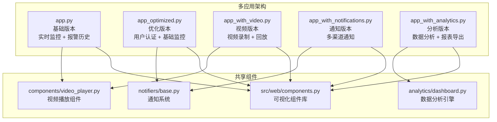
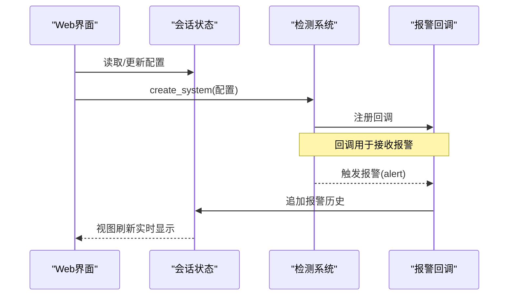
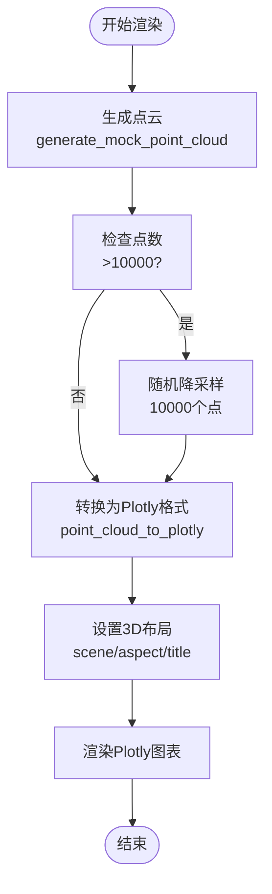
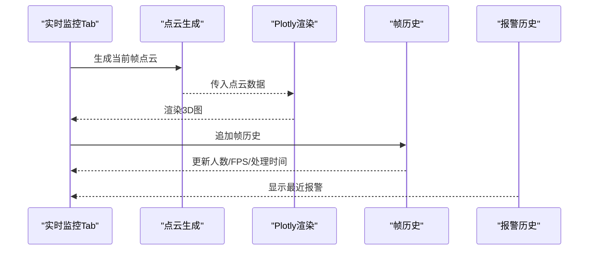
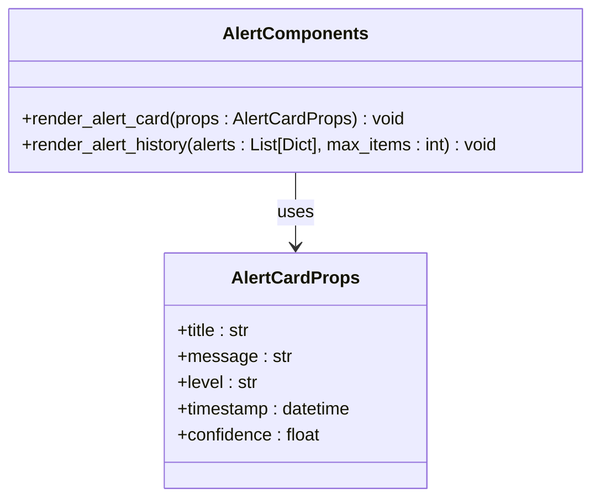
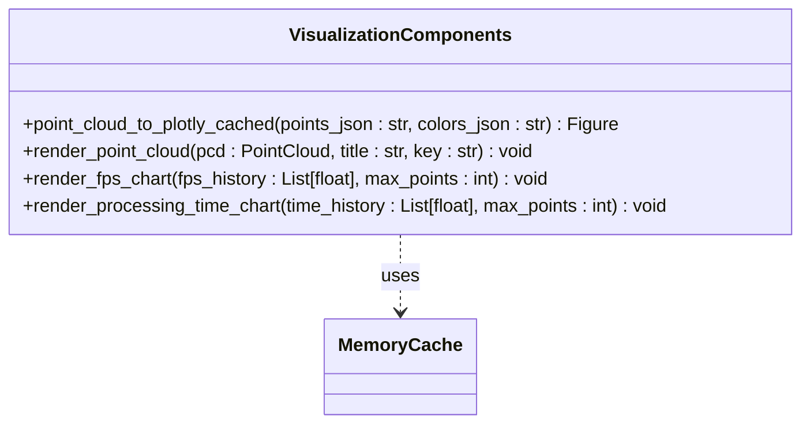
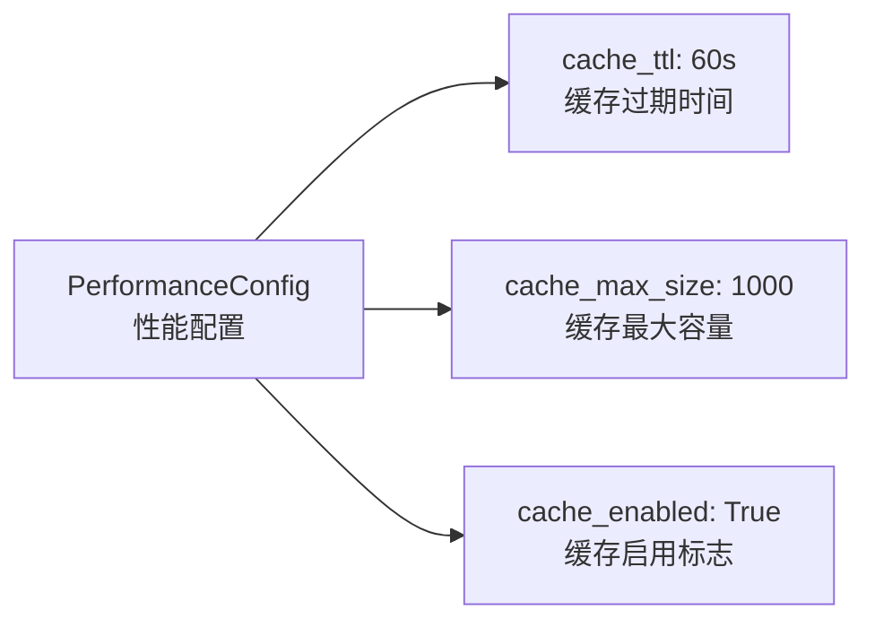
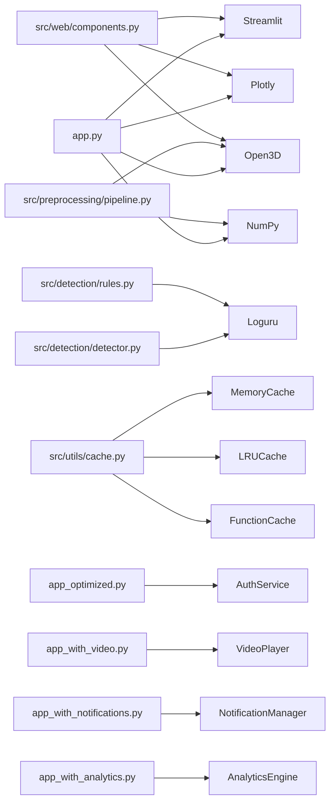

# Web界面系统

<cite>
**本文引用的文件**
- [app.py](file://app.py)
- [app_optimized.py](file://app_optimized.py)
- [app_with_analytics.py](file://app_with_analytics.py)
- [app_with_notifications.py](file://app_with_notifications.py)
- [app_with_video.py](file://app_with_video.py)
- [components/video_player.py](file://components/video_player.py)
- [notifiers/base.py](file://notifiers/base.py)
- [analytics/dashboard.py](file://analytics/dashboard.py)
- [config.notifications.example.json](file://config.notifications.example.json)
- [src/web/components.py](file://src/web/components.py)
- [src/web/__init__.py](file://src/web/__init__.py)
- [src/utils/cache.py](file://src/utils/cache.py)
- [src/utils/config.py](file://src/utils/config.py)
- [WEB_UI_GUIDE.md](file://docs/WEB_UI_GUIDE.md)
- [requirements.txt](file://requirements.txt)
- [README.md](file://README.md)
- [src/detection/detector.py](file://src/detection/detector.py)
- [src/detection/rules.py](file://src/detection/rules.py)
- [src/preprocessing/pipeline.py](file://src/preprocessing/pipeline.py)
- [src/preprocessing/clustering.py](file://src/preprocessing/clustering.py)
- [src/data_capture/azure_kinect.py](file://src/data_capture/azure_kinect.py)
- [src/data_capture/recorder.py](file://src/data_capture/recorder.py)
- [demos/fall_detection_demo.py](file://demos/fall_detection_demo.py)
</cite>

## 更新摘要
**变更内容**
- 从单一Streamlit应用升级为多应用架构，包含四个专用应用变体
- 新增用户认证系统，支持角色权限管理
- 集成视频录制与回放功能
- 实现多渠道通知系统（微信、飞书、邮件、短信、Webhook）
- 添加数据分析面板，支持趋势分析和报表导出
- 重构组件架构，提供可复用的UI组件库
- 引入多种缓存优化策略，包括Streamlit缓存和内存缓存
- 优化渲染性能，实现点云降采样和缓存机制

## 目录
1. [简介](#简介)
2. [多应用架构概览](#多应用架构概览)
3. [应用变体详解](#应用变体详解)
4. [核心组件](#核心组件)
5. [架构总览](#架构总览)
6. [详细组件分析](#详细组件分析)
7. [可视化组件库](#可视化组件库)
8. [性能优化策略](#性能优化策略)
9. [依赖分析](#依赖分析)
10. [性能考虑](#性能考虑)
11. [故障排查指南](#故障排查指南)
12. [结论](#结论)
13. [附录](#附录)

## 简介
GuardianFall的Web界面系统现已升级为多应用架构，基于Streamlit构建，提供四种专用应用变体，分别针对不同的使用场景和功能需求。系统通过自定义CSS样式、Plotly 3D渲染、Streamlit组件与后端检测算法的紧密协作，形成完整的可视化与交互闭环。

**重大升级**：系统从单一应用演进为多应用架构，每个应用都针对特定功能进行了深度优化。新增的用户认证系统、视频录制功能、多渠道通知系统和数据分析面板，显著增强了系统的实用性和扩展性。

## 多应用架构概览

GuardianFall采用多应用架构设计，提供四种专用的应用变体，每种都针对特定的使用场景和功能需求：



**图表来源**
- [app.py:1-692](file://app.py#L1-L692)
- [app_optimized.py:1-341](file://app_optimized.py#L1-L341)
- [app_with_video.py:1-646](file://app_with_video.py#L1-L646)
- [app_with_notifications.py:1-782](file://app_with_notifications.py#L1-L782)
- [app_with_analytics.py:1-732](file://app_with_analytics.py#L1-L732)
- [components/video_player.py:1-258](file://components/video_player.py#L1-L258)
- [notifiers/base.py:1-682](file://notifiers/base.py#L1-L682)
- [analytics/dashboard.py:1-559](file://analytics/dashboard.py#L1-L559)

## 应用变体详解

### 基础应用 (app.py)
**功能定位**：核心监控功能，提供实时点云显示、检测结果可视化、报警历史记录和系统状态监控。

**核心特性**：
- 实时3D点云可视化
- 检测结果实时展示
- 报警历史记录与导出
- 系统状态监控
- 参数配置调整

### 优化应用 (app_optimized.py)
**功能定位**：在基础应用基础上增加用户认证系统，提供角色权限管理和安全控制。

**核心特性**：
- 用户登录认证
- 角色权限管理（管理员、操作员、查看者）
- 安全控制面板
- 管理后台入口
- 用户信息展示

### 视频应用 (app_with_video.py)
**功能定位**：专注于视频录制与回放功能，支持事件触发录制和视频管理。

**核心特性**：
- 视频录制与缓冲
- 事件触发录制
- 录像库管理
- 视频回放功能
- 录制状态监控

### 通知应用 (app_with_notifications.py)
**功能定位**：集成多渠道通知系统，支持实时告警推送。

**核心特性**：
- 多渠道通知（微信、飞书、邮件、短信、Webhook）
- 异步通知发送
- 通知统计与监控
- 告警级别区分
- 通知规则配置

### 分析应用 (app_with_analytics.py)
**功能定位**：提供全面的数据分析功能，支持趋势分析、报表导出和统计可视化。

**核心特性**：
- 跌倒事件统计分析
- 趋势图表生成
- 位置分布热力图
- 时间分布分析
- 报表导出功能

**章节来源**
- [app.py:1-692](file://app.py#L1-L692)
- [app_optimized.py:1-341](file://app_optimized.py#L1-L341)
- [app_with_video.py:1-646](file://app_with_video.py#L1-L646)
- [app_with_notifications.py:1-782](file://app_with_notifications.py#L1-L782)
- [app_with_analytics.py:1-732](file://app_with_analytics.py#L1-L732)

## 核心组件
- 页面配置与主题样式
  - 页面布局、图标、初始展开侧边栏
  - 自定义CSS样式卡片、状态指示器、告警提示样式
- 会话状态管理
  - 系统实例、运行状态、报警历史、帧历史、启动时间、配置字典
- 检测系统创建与回调
  - 通过配置参数创建检测系统，注册报警回调，更新历史记录
- **新增** 用户认证系统
  - 登录验证、用户角色管理、会话状态维护
- **新增** 视频录制组件
  - 录像管理器、视频缓冲、事件触发录制
- **新增** 通知系统
  - 多渠道通知、异步发送、统计监控
- **新增** 数据分析引擎
  - 事件统计、趋势分析、报表导出
- **新增** 可视化组件库
  - 报警卡片组件、统计卡片组件、点云渲染组件、控制面板组件
  - 统一的组件接口和样式规范
- **优化** 3D点云渲染
  - Open3D点云生成与转换，Plotly Scatter3d渲染，颜色映射与交互
  - **新增** 点云降采样优化，缓存机制提升渲染性能
- 实时监控Tab
  - 状态指示器、点云视图、检测结果面板、报警提示
- 统计图表Tab
  - FPS趋势、处理时间趋势、报警统计饼图
- 报警历史Tab
  - 历史记录表格、过滤、CSV导出
- 数据管理Tab
  - 数据集列表、元数据展示、配置导入导出
- 侧边栏控制面板
  - 启动/停止/重置、参数配置滑条、系统信息、关于

**章节来源**
- [app.py:33-102](file://app.py#L33-L102)
- [app_optimized.py:28-45](file://app_optimized.py#L28-L45)
- [app_with_video.py:76-102](file://app_with_video.py#L76-L102)
- [app_with_notifications.py:88-119](file://app_with_notifications.py#L88-L119)
- [app_with_analytics.py:49-85](file://app_with_analytics.py#L49-L85)
- [app.py:104-134](file://app.py#L104-L134)
- [app.py:136-193](file://app.py#L136-L193)
- [app.py:195-209](file://app.py#L195-L209)
- [app.py:210-302](file://app.py#L210-L302)
- [app.py:308-450](file://app.py#L308-L450)
- [app.py:452-533](file://app.py#L452-L533)
- [app.py:535-588](file://app.py#L535-L588)
- [app.py:590-652](file://app.py#L590-L652)
- [src/web/components.py:28-428](file://src/web/components.py#L28-L428)

## 架构总览
Web界面作为前端入口，负责实时渲染与用户交互；后端检测系统由预处理流水线、人体聚类与规则引擎组成，二者通过会话状态与回调进行数据绑定与更新。**新增的多应用架构**提供四种专用应用变体，每种都针对特定功能进行了优化，同时共享核心组件库。

```mermaid
graph TB
subgraph "前端Streamlit应用"
UI["页面配置与主题<br/>会话状态管理"]
COMP["可视化组件库<br/>可复用UI组件"]
MON["实时监控Tab<br/>3D点云渲染"]
STAT["统计图表Tab<br/>趋势与饼图"]
ALERT["报警历史Tab<br/>表格与导出"]
DATA["数据管理Tab<br/>数据集与配置"]
SIDEBAR["侧边栏控制面板<br/>参数与系统信息"]
end
subgraph "后端Python"
DET["检测系统<br/>FallDetectionSystem"]
PIPE["预处理流水线<br/>PointCloudPipeline"]
CLU["人体聚类<br/>EuclideanClustering"]
RULE["规则引擎<br/>RuleBasedFallDetector"]
CAM["相机采集<br/>AzureKinectCamera"]
REC["数据录制<br/>PointCloudRecorder"]
END
subgraph "共享组件"
VID["视频播放组件<br/>VideoPlayer"]
NOTIF["通知系统<br/>NotificationManager"]
ANALYTICS["数据分析引擎<br/>AnalyticsEngine"]
AUTH["认证服务<br/>AuthService"]
END
UI --> COMP
COMP --> MON
COMP --> STAT
COMP --> ALERT
COMP --> DATA
COMP --> SIDEBAR
MON --> DET
STAT --> DET
ALERT --> DET
DATA --> DET
DET --> PIPE
PIPE --> CLU
DET --> RULE
DET --> CAM
DATA --> REC
COMP --> VID
COMP --> NOTIF
COMP --> ANALYTICS
COMP --> AUTH
```

**图表来源**
- [app.py:33-692](file://app.py#L33-L692)
- [app_optimized.py:95-341](file://app_optimized.py#L95-L341)
- [app_with_video.py:104-646](file://app_with_video.py#L104-L646)
- [app_with_notifications.py:121-782](file://app_with_notifications.py#L121-L782)
- [app_with_analytics.py:147-732](file://app_with_analytics.py#L147-L732)
- [src/web/components.py:123-248](file://src/web/components.py#L123-L248)
- [src/detection/detector.py:75-283](file://src/detection/detector.py#L75-L283)
- [src/preprocessing/pipeline.py:65-178](file://src/preprocessing/pipeline.py#L65-L178)
- [src/preprocessing/clustering.py:99-182](file://src/preprocessing/clustering.py#L99-L182)
- [src/detection/rules.py:226-423](file://src/detection/rules.py#L226-L423)
- [src/data_capture/azure_kinect.py:47-460](file://src/data_capture/azure_kinect.py#L47-L460)
- [src/data_capture/recorder.py:48-176](file://src/data_capture/recorder.py#L48-L176)
- [components/video_player.py:12-258](file://components/video_player.py#L12-L258)
- [notifiers/base.py:596-682](file://notifiers/base.py#L596-L682)
- [analytics/dashboard.py:57-559](file://analytics/dashboard.py#L57-L559)

## 详细组件分析

### 页面配置与主题样式
- 页面配置：宽屏布局、初始展开侧边栏、页面标题与图标
- 自定义CSS：告警卡片样式（严重/警告/信息）、统计卡片、指标数字样式
- 作用：统一视觉风格，提升可读性与警示效果

**章节来源**
- [app.py:33-82](file://app.py#L33-L82)
- [app_optimized.py:101-181](file://app_optimized.py#L101-L181)
- [app_with_video.py:44-75](file://app_with_video.py#L44-L75)
- [app_with_notifications.py:54-87](file://app_with_notifications.py#L54-L87)
- [app_with_analytics.py:41-48](file://app_with_analytics.py#L41-L48)

### 会话状态管理
- 关键状态键：
  - system：检测系统实例
  - running：运行开关
  - alert_history：报警历史（最多100条）
  - frame_history：帧历史（最多100帧）
  - start_time：系统启动时间
  - config：配置字典（体素尺寸、高度骤降阈值、速度阈值、确认帧数、帧率）
- 作用：跨刷新保持状态，支撑实时更新与历史记录

**章节来源**
- [app.py:83-102](file://app.py#L83-L102)
- [app_optimized.py:28-45](file://app_optimized.py#L28-L45)
- [app_with_video.py:76-102](file://app_with_video.py#L76-L102)
- [app_with_notifications.py:88-119](file://app_with_notifications.py#L88-L119)
- [app_with_analytics.py:49-85](file://app_with_analytics.py#L49-L85)

### 检测系统创建与回调
- create_system：根据session_state.config创建FallDetectionSystem，注入on_alert回调
- on_alert：将报警追加到alert_history，维持长度上限，自动标记级别
- 作用：建立UI与后端检测系统的数据绑定，实现报警实时展示



**图表来源**
- [app.py:104-134](file://app.py#L104-L134)
- [src/detection/detector.py:172-192](file://src/detection/detector.py#L172-L192)

**章节来源**
- [app.py:104-134](file://app.py#L104-L134)
- [src/detection/detector.py:172-192](file://src/detection/detector.py#L172-L192)

### 3D点云渲染与颜色映射
- generate_mock_point_cloud：生成地面与人体点云，带噪声与高度变化
- **优化** point_cloud_to_plotly：将Open3D点云转换为Plotly Scatter3d，按Z轴高度映射颜色
- **新增** 点云降采样优化：当点数超过10000时进行随机降采样
- 实时监控Tab：动态生成图、设置坐标轴范围、标题与交互
- 作用：直观展示点云与检测状态，支持旋转、缩放、平移



**图表来源**
- [app.py:136-193](file://app.py#L136-L193)
- [src/web/components.py:164-211](file://src/web/components.py#L164-L211)
- [app.py:340-420](file://app.py#L340-L420)

**章节来源**
- [app.py:136-193](file://app.py#L136-L193)
- [src/web/components.py:164-211](file://src/web/components.py#L164-L211)
- [app.py:340-420](file://app.py#L340-L420)

### 实时监控Tab（核心交互）
- 状态指示器：系统状态、当前人数、确认摔倒、疑似摔倒
- 点云视图：Plotly 3D渲染，标题随检测状态变化
- 检测结果面板：当前帧、人数、摔倒状态、处理时间、最近报警
- 报警提示：根据最新报警级别显示错误/警告提示
- 作用：集中展示实时状态与检测结果，便于快速响应



**图表来源**
- [app.py:311-450](file://app.py#L311-L450)

**章节来源**
- [app.py:311-450](file://app.py#L311-L450)

### 统计图表Tab（性能与报警）
- FPS趋势：基于frame_history中处理时间计算FPS，绘制折线
- 处理时间：直接使用processing_time_ms绘制折线
- 报警统计：统计critical/warning数量，饼图展示分布
- 作用：辅助调参与性能评估，定位异常波动

**章节来源**
- [app.py:452-533](file://app.py#L452-L533)

### 报警历史Tab（数据治理）
- 过滤：按级别（全部/确认摔倒/疑似摔倒）筛选
- 表格：列配置（时间、类型、人员ID、消息、置信度、级别）
- 导出：CSV下载，便于审计与分析
- 作用：提供可追溯的报警记录与合规导出

**章节来源**
- [app.py:535-588](file://app.py#L535-L588)

### 数据管理Tab（数据资产）
- 数据集列表：扫描datasets目录，读取metadata.json，展示名称、帧数、时长、创建时间
- 配置管理：导出/导入config.json，显示当前配置
- 作用：统一管理数据资产与系统配置，支持迁移与备份

**章节来源**
- [app.py:590-652](file://app.py#L590-L652)

### 侧边栏控制面板（参数与系统）
- 系统控制：启动、停止、重置
- 参数配置：体素尺寸、高度骤降阈值、速度阈值、确认帧数、帧率
- 系统信息：运行时长、总报警数、平均FPS、活跃追踪
- 关于：版本与技术栈说明
- 作用：集中控制与参数调优，提供系统健康度概览

**章节来源**
- [app.py:210-302](file://app.py#L210-L302)

### 用户认证系统（新增）
- 登录验证：用户名密码验证，支持SQLite数据库
- 角色管理：管理员、操作员、查看者三种角色
- 会话管理：用户信息存储、权限控制、登出功能
- 安全控制：密码强度、令牌管理、会话超时
- 作用：提供安全的用户访问控制和权限管理

**章节来源**
- [app_optimized.py:66-94](file://app_optimized.py#L66-L94)
- [app_optimized.py:98-181](file://app_optimized.py#L98-L181)
- [app_optimized.py:190-230](file://app_optimized.py#L190-L230)

### 视频录制系统（新增）
- 录像管理：环形缓冲区、事件触发录制、录制状态监控
- 视频播放：HTML5播放器、缩略图、下载功能
- 录像库：按摄像头和事件类型分类、排序、过滤
- 性能优化：缓冲区管理、内存控制、异步处理
- 作用：提供完整的视频录制与回放解决方案

**章节来源**
- [app_with_video.py:104-144](file://app_with_video.py#L104-L144)
- [app_with_video.py:342-543](file://app_with_video.py#L342-L543)
- [components/video_player.py:12-258](file://components/video_player.py#L12-L258)

### 通知系统（新增）
- 多渠道支持：企业微信、飞书、邮件、短信、Webhook
- 异步发送：并发通知、错误处理、统计监控
- 消息格式：Markdown、HTML、JSON格式支持
- 规则配置：不同告警类型的通道选择
- 作用：提供实时多渠道告警通知能力

**章节来源**
- [app_with_notifications.py:121-186](file://app_with_notifications.py#L121-L186)
- [app_with_notifications.py:188-271](file://app_with_notifications.py#L188-L271)
- [notifiers/base.py:596-682](file://notifiers/base.py#L596-L682)

### 数据分析引擎（新增）
- 事件统计：总数、确认摔倒、疑似摔倒、平均置信度
- 时间分析：趋势图、24小时分布、星期分布
- 空间分析：位置热力图、区域统计
- 报表导出：JSON、CSV格式支持
- 作用：提供全面的数据分析和可视化能力

**章节来源**
- [app_with_analytics.py:88-94](file://app_with_analytics.py#L88-L94)
- [app_with_analytics.py:147-193](file://app_with_analytics.py#L147-L193)
- [analytics/dashboard.py:57-144](file://analytics/dashboard.py#L57-L144)

## 可视化组件库

### 组件架构概述
GuardianFall引入了专门的可视化组件库，采用面向对象的设计模式，将UI组件按照功能分类，提供统一的接口和样式规范。组件库包含以下主要类别：

- **AlertComponents**：报警相关组件，包括报警卡片和历史列表
- **VisualizationComponents**：可视化组件，包括点云渲染、图表绘制
- **ControlComponents**：控制面板组件，包括启动停止按钮、配置表单
- **StatsComponents**：统计信息组件，包括统计卡片和指标展示
- **StatusComponents**：状态指示组件，包括状态指示器和进度条

### 报警组件（AlertComponents）
提供统一的报警展示接口，支持不同级别的报警样式：



**图表来源**
- [src/web/components.py:28-92](file://src/web/components.py#L28-L92)
- [src/web/components.py:18-26](file://src/web/components.py#L18-L26)

### 可视化组件（VisualizationComponents）
提供高性能的3D点云渲染和图表绘制组件：



**图表来源**
- [src/web/components.py:123-266](file://src/web/components.py#L123-L266)

### 性能优化特性
- **Streamlit缓存**：使用`@st.cache_data(ttl=1)`缓存点云转换结果
- **点云降采样**：超过10000点时自动降采样到10000点
- **内存缓存**：集成全局缓存系统，支持TTL过期机制
- **组件复用**：统一的组件接口，便于维护和扩展

**章节来源**
- [src/web/components.py:123-266](file://src/web/components.py#L123-L266)
- [src/web/components.py:28-92](file://src/web/components.py#L28-L92)
- [src/web/components.py:94-121](file://src/web/components.py#L94-L121)
- [src/web/components.py:268-341](file://src/web/components.py#L268-L341)

## 性能优化策略

### 缓存机制
系统采用了多层次的缓存策略来优化渲染性能：

1. **Streamlit缓存**：使用`@st.cache_data`装饰器缓存点云转换结果
2. **内存缓存**：集成全局MemoryCache，支持TTL过期和LRU淘汰
3. **点云降采样**：自动降采样大量点云数据以提升渲染性能

### 性能配置
通过配置系统支持性能参数的动态调整：



**图表来源**
- [src/utils/config.py:129-132](file://src/utils/config.py#L129-L132)

### 缓存统计
系统提供详细的缓存统计信息，包括命中率、过期数量等指标：

**章节来源**
- [src/web/components.py:127-161](file://src/web/components.py#L127-L161)
- [src/utils/cache.py:165-177](file://src/utils/cache.py#L165-L177)
- [src/utils/config.py:129-132](file://src/utils/config.py#L129-L132)

## 依赖分析
- Streamlit：UI框架、组件、会话状态、图表渲染
- Open3D：点云数据结构与基础操作
- Plotly：3D散点图渲染与交互
- NumPy：数值计算与点云数组操作
- Loguru：日志记录（后端模块）
- **新增** 自定义缓存系统：提供内存缓存、LRU缓存、TTL缓存功能
- **新增** 异步处理：asyncio支持多任务并发
- **新增** 通知渠道：企业微信、飞书、邮件、短信、Webhook
- **新增** 数据分析：Plotly Express、JSON处理



**图表来源**
- [app.py:16-25](file://app.py#L16-L25)
- [requirements.txt:3-41](file://requirements.txt#L3-L41)
- [src/detection/detector.py:12-18](file://src/detection/detector.py#L12-L18)
- [src/preprocessing/pipeline.py:13-21](file://src/preprocessing/pipeline.py#L13-L21)
- [src/detection/rules.py:13-17](file://src/detection/rules.py#L13-L17)
- [src/web/components.py:7-15](file://src/web/components.py#L7-L15)
- [src/utils/cache.py:43-242](file://src/utils/cache.py#L43-L242)
- [app_optimized.py:47-56](file://app_optimized.py#L47-L56)
- [app_with_video.py:32-33](file://app_with_video.py#L32-L33)
- [app_with_notifications.py:36-43](file://app_with_notifications.py#L36-L43)
- [app_with_analytics.py:38-39](file://app_with_analytics.py#L38-L39)

**章节来源**
- [requirements.txt:1-41](file://requirements.txt#L1-L41)

## 性能考虑
- **体素降采样**：通过配置voxel_size显著降低点数，直接影响FPS与内存占用
- **帧率控制**：实时渲染中使用sleep控制帧率，避免过度占用CPU
- **历史长度限制**：报警与帧历史最多100条，防止内存膨胀
- **统计窗口**：FPS历史窗口固定，避免长期漂移导致误判
- ****新增** 点云降采样优化**：当点数超过10000时自动降采样，提升渲染性能
- ****新增** 缓存机制**：使用Streamlit缓存和内存缓存减少重复计算
- ****新增** 组件复用**：统一的组件接口减少代码重复和维护成本
- ****新增** 异步处理**：通知系统使用asyncio提升并发性能
- ****新增** 内存管理**：视频录制使用环形缓冲区控制内存使用
- 建议：
  - 优先降低体素尺寸以提升性能
  - 在高负载场景下调低帧率
  - 定期清理历史数据，保持界面流畅
  - **新增** 调整缓存配置以平衡内存使用和性能
  - **新增** 配置通知渠道以避免阻塞主线程

**章节来源**
- [app.py:95-101](file://app.py#L95-L101)
- [app.py:376-390](file://app.py#L376-L390)
- [src/detection/detector.py:196-202](file://src/detection/detector.py#L196-L202)
- [src/web/components.py:174-178](file://src/web/components.py#L174-L178)
- [src/web/components.py:127-161](file://src/web/components.py#L127-L161)

## 故障排查指南
- 界面未自动打开：手动访问本地端口
- 端口被占用：使用其他端口启动
- 点云空白：确认已点击"启动"，检查相机连接或重置
- FPS低：增大体素尺寸、降低帧率、减少点云分辨率、关闭其他占用CPU程序
- **新增** 组件渲染问题：检查组件库导入，确认依赖版本兼容
- **新增** 缓存相关问题：检查缓存配置，清理过期缓存条目
- **新增** 性能问题：调整缓存大小和过期时间，优化点云降采样参数
- **新增** 认证问题：检查数据库初始化，确认用户凭据正确
- **新增** 视频录制问题：检查录制目录权限，确认OpenCV可用
- **新增** 通知发送失败：检查网络连接，验证通知渠道配置
- **新增** 数据分析异常：检查数据文件格式，确认JSON解析正确
- 误报多：提高高度骤降阈值、速度阈值、确认帧数
- 漏报：降低阈值、减少确认帧数、检查相机角度

**章节来源**
- [WEB_UI_GUIDE.md:265-309](file://docs/WEB_UI_GUIDE.md#L265-L309)

## 结论
GuardianFall的Web界面系统以Streamlit为核心，结合Open3D与Plotly实现了高效的3D点云可视化与实时检测展示。**重大升级后的系统**通过新增的多应用架构，提供了四种专用应用变体，每种都针对特定功能进行了深度优化。

**多应用架构的优势**：
- **功能专业化**：每个应用专注于特定功能领域
- **性能优化**：针对特定场景进行性能调优
- **扩展性强**：模块化设计便于功能扩展
- **用户体验**：提供多样化的使用场景选择

通过引入多种缓存优化策略（Streamlit缓存、内存缓存、点云降采样）、用户认证系统、视频录制功能、多渠道通知系统和数据分析面板，系统在保证功能完整性的同时显著提升了渲染性能和用户体验。

配合完善的统计图表与数据管理功能，系统既满足日常监控需求，也为参数调优与数据分析提供了坚实支撑。未来可在主题定制、响应式布局与后端数据绑定方面进一步增强，以适配更多部署场景与用户偏好。

## 附录

### 用户操作流程与交互模式
- 启动流程：侧边栏点击"启动" → 实时监控Tab显示点云与状态 → 报警历史与统计图表联动更新
- 参数调优：侧边栏调整阈值与帧率 → 点击"保存配置" → 若系统已运行则自动重启应用新配置
- 数据分析：切换至统计图表Tab查看趋势，导出报警CSV进行离线分析
- 数据管理：查看数据集列表，导入/导出配置，定位数据集路径
- **新增** 用户认证：登录系统，根据角色显示不同功能菜单
- **新增** 视频管理：录制事件视频，查看录像库，下载或删除视频文件
- **新增** 通知配置：配置多渠道通知，查看发送统计
- **新增** 数据分析：使用分析面板查看趋势、热力图、报表导出
- **新增** 组件使用：通过组件库提供的统一接口创建和配置UI组件

**章节来源**
- [WEB_UI_GUIDE.md:183-216](file://docs/WEB_UI_GUIDE.md#L183-L216)
- [app_optimized.py:98-181](file://app_optimized.py#L98-L181)
- [app_with_video.py:342-543](file://app_with_video.py#L342-L543)
- [app_with_notifications.py:121-186](file://app_with_notifications.py#L121-L186)
- [app_with_analytics.py:541-622](file://app_with_analytics.py#L541-L622)

### 界面布局与交互说明
- 布局：宽屏布局，侧边栏初始展开，主内容区域分为选项卡
- 交互：按钮禁用状态、进度条、状态文本、图表自适应容器宽度
- 响应式：Plotly图表与表格使用容器宽度自适应
- **新增** 组件样式：统一的CSS样式和组件外观规范
- **新增** 角色权限：根据用户角色显示不同功能菜单
- **新增** 安全控制：登录状态、会话管理、权限验证

**章节来源**
- [app.py:33-40](file://app.py#L33-L40)
- [app_optimized.py:190-230](file://app_optimized.py#L190-L230)
- [app.py:210-302](file://app.py#L210-L302)
- [app.py:308-450](file://app.py#L308-L450)
- [src/web/components.py:42-57](file://src/web/components.py#L42-L57)

### 与后端服务的数据绑定与实时更新机制
- 数据绑定：会话状态作为UI与后端的桥梁，检测系统通过回调将报警写入alert_history，系统统计写入frame_history
- 实时更新：Tab内部通过st.empty/placeholder与st.progress/st.status_text实现局部刷新与进度反馈
- 后端集成：检测系统process_frame返回FrameResult，包含人数、摔倒状态、处理时间等，供UI展示
- **新增** 组件通信：通过组件库提供的统一接口进行数据传递和状态管理
- **新增** 异步处理：通知系统使用asyncio进行并发处理
- **新增** 缓存管理：多层缓存策略提升数据访问性能

**章节来源**
- [app.py:340-420](file://app.py#L340-L420)
- [src/detection/detector.py:138-227](file://src/detection/detector.py#L138-L227)
- [app_with_notifications.py:230-248](file://app_with_notifications.py#L230-L248)

### 界面定制与主题配置指导
- 自定义CSS：通过st.markdown注入样式，可扩展告警卡片、统计卡片与指标样式
- 主题建议：保持颜色语义一致性（严重/警告/信息），确保对比度与可读性
- 响应式设计：利用use_container_width=True与宽屏布局，适配不同屏幕尺寸
- **新增** 组件定制：通过组件库的属性配置和样式接口进行个性化定制
- **新增** 角色主题：根据用户角色应用不同的主题样式
- **新增** 权限控制：基于角色的界面元素显示控制

**章节来源**
- [app.py:42-81](file://app.py#L42-L81)
- [app.py:36-39](file://app.py#L36-L39)
- [app_optimized.py:193-200](file://app_optimized.py#L193-L200)
- [src/web/components.py:32-57](file://src/web/components.py#L32-L57)

### 扩展与自定义开发指导
- 新增Tab：参考现有Tab结构，使用st.tabs与st.empty/placeholder实现局部渲染
- 新增图表：使用Plotly或Matplotlib，结合会话状态数据进行渲染
- 后端扩展：在src/detection与src/preprocessing新增模块，通过会话状态与回调接入UI
- 配置持久化：沿用config.json与save/load_config模式，确保配置可迁移
- **新增** 组件扩展：在src/web/components.py中添加新的组件类，遵循现有的接口规范
- **新增** 缓存集成：使用MemoryCache或FunctionCache装饰器优化性能关键代码
- **新增** 性能监控：利用缓存统计信息监控系统性能，及时发现和解决性能问题
- **新增** 应用扩展**：基于现有应用模板创建新的应用变体
- **新增** 通知渠道**：在notifiers模块中添加新的通知渠道实现
- **新增** 分析功能**：在analytics模块中添加新的分析维度和图表类型

**章节来源**
- [app.py:308-652](file://app.py#L308-L652)
- [app.py:195-209](file://app.py#L195-L209)
- [src/web/components.py:28-428](file://src/web/components.py#L28-L428)
- [src/utils/cache.py:231-386](file://src/utils/cache.py#L231-L386)
- [notifiers/base.py:596-682](file://notifiers/base.py#L596-L682)
- [analytics/dashboard.py:147-559](file://analytics/dashboard.py#L147-L559)