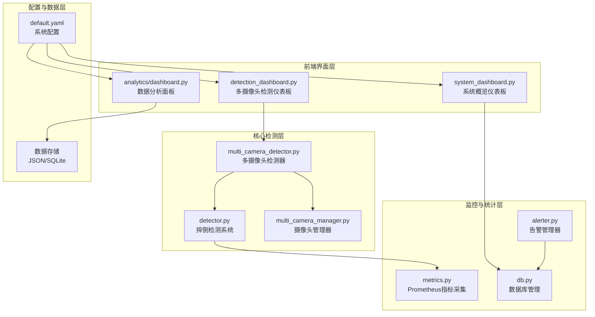
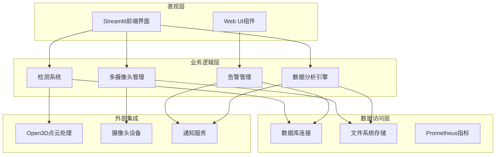
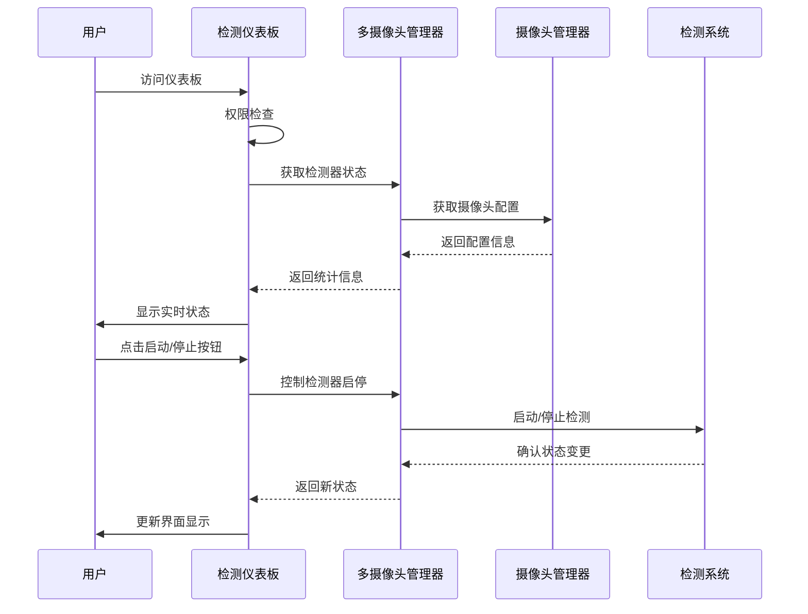
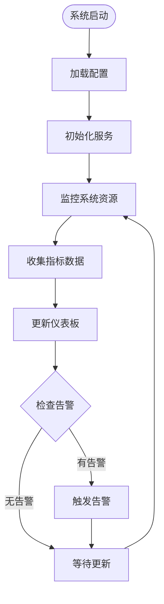
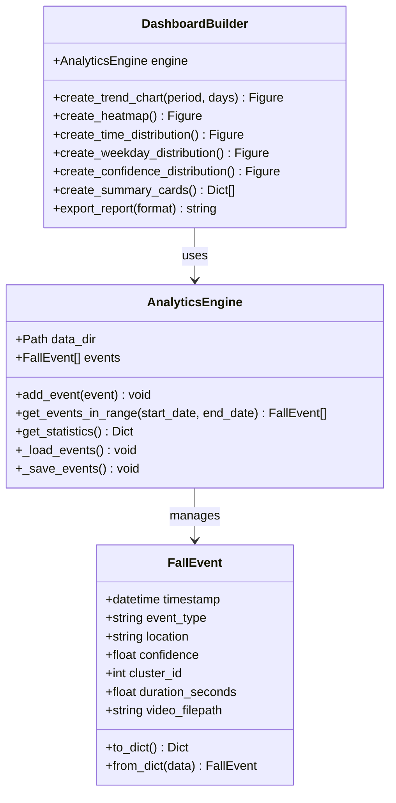
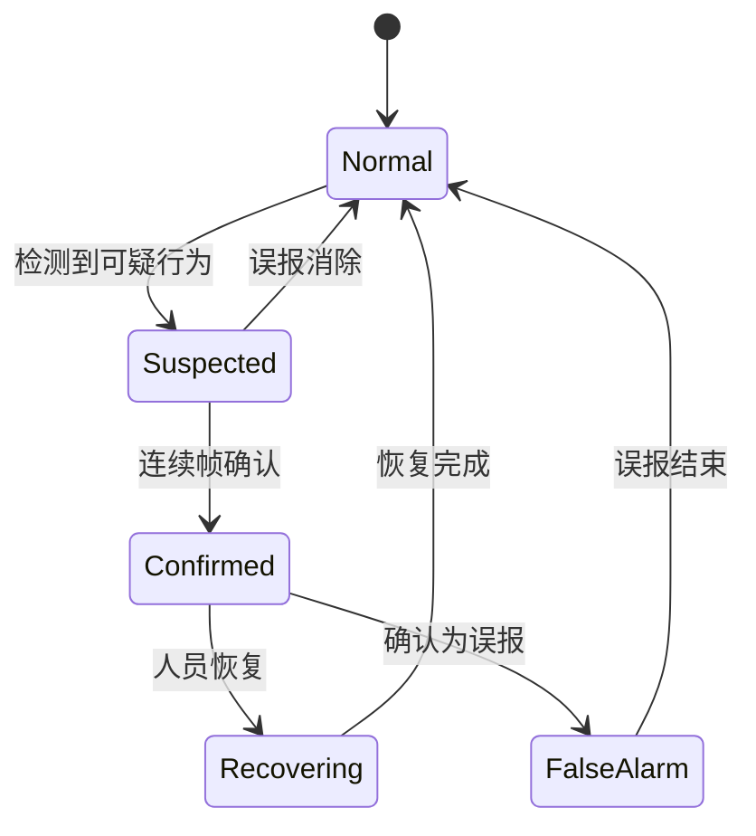
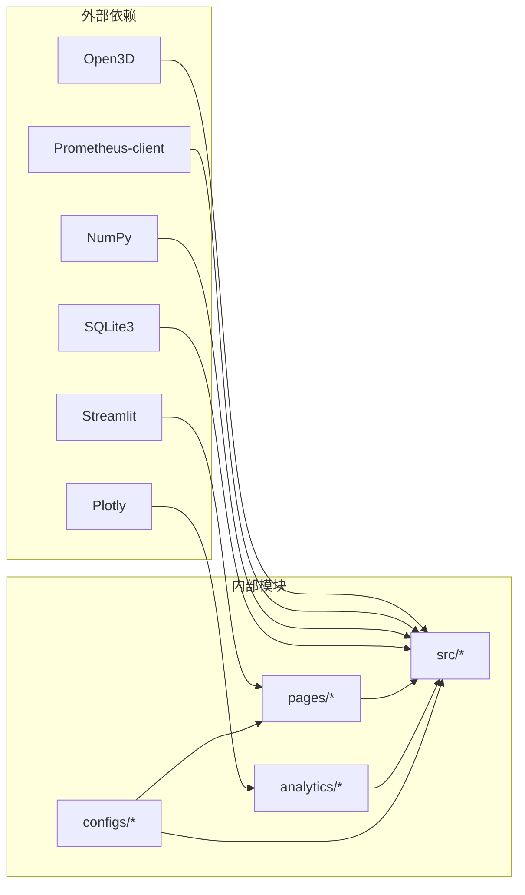

# 分析仪表板与统计系统

<cite>
**本文档引用的文件**
- [pages/detection_dashboard.py](file://pages/detection_dashboard.py)
- [pages/system_dashboard.py](file://pages/system_dashboard.py)
- [analytics/dashboard.py](file://analytics/dashboard.py)
- [src/monitoring/metrics.py](file://src/monitoring/metrics.py)
- [src/detection/detector.py](file://src/detection/detector.py)
- [src/detection/multi_camera_detector.py](file://src/detection/multi_camera_detector.py)
- [src/camera/multi_camera_manager.py](file://src/camera/multi_camera_manager.py)
- [src/monitoring/alerter.py](file://src/monitoring/alerter.py)
- [src/database/db.py](file://src/database/db.py)
- [configs/default.yaml](file://configs/default.yaml)
</cite>

## 目录
1. [简介](#简介)
2. [项目结构](#项目结构)
3. [核心组件](#核心组件)
4. [架构概览](#架构概览)
5. [详细组件分析](#详细组件分析)
6. [依赖关系分析](#依赖关系分析)
7. [性能考虑](#性能考虑)
8. [故障排除指南](#故障排除指南)
9. [结论](#结论)

## 简介

本项目是一个基于深度学习的多摄像头摔倒检测系统，包含完整的仪表板与统计分析功能。系统采用Python开发，集成了Open3D点云处理、规则引擎检测算法和实时监控功能。本文档深入分析了系统的仪表板与统计系统架构，包括多摄像头监控仪表板、系统概览仪表板、数据分析面板以及相关的监控和告警机制。

## 项目结构

系统采用模块化设计，主要分为以下几个核心模块：

**图表来源**
- [pages/detection_dashboard.py:1-210](file://pages/detection_dashboard.py#L1-L210)
- [pages/system_dashboard.py:1-318](file://pages/system_dashboard.py#L1-L318)
- [analytics/dashboard.py:1-559](file://analytics/dashboard.py#L1-L559)
- [src/detection/detector.py:1-373](file://src/detection/detector.py#L1-L373)

**章节来源**
- [pages/detection_dashboard.py:1-210](file://pages/detection_dashboard.py#L1-L210)
- [pages/system_dashboard.py:1-318](file://pages/system_dashboard.py#L1-L318)
- [analytics/dashboard.py:1-559](file://analytics/dashboard.py#L1-L559)

## 核心组件

### 仪表板组件

系统包含三个主要的仪表板组件：

1. **多摄像头检测仪表板** - 实时监控多个摄像头的检测状态
2. **系统概览仪表板** - 管理员视图，显示系统整体状态
3. **数据分析面板** - 跌倒事件统计与可视化分析

### 监控与统计组件

1. **Prometheus指标采集器** - 收集系统性能和检测统计数据
2. **告警管理器** - 管理告警级别、触发条件和历史记录
3. **摄像头管理器** - 管理多摄像头连接和状态监控

**章节来源**
- [src/monitoring/metrics.py:1-144](file://src/monitoring/metrics.py#L1-L144)
- [src/monitoring/alerter.py:1-224](file://src/monitoring/alerter.py#L1-L224)
- [src/camera/multi_camera_manager.py:1-284](file://src/camera/multi_camera_manager.py#L1-L284)

## 架构概览

系统采用分层架构设计，实现了清晰的关注点分离：

**图表来源**
- [src/detection/detector.py:75-283](file://src/detection/detector.py#L75-L283)
- [src/detection/multi_camera_detector.py:146-244](file://src/detection/multi_camera_detector.py#L146-L244)
- [analytics/dashboard.py:57-144](file://analytics/dashboard.py#L57-L144)

## 详细组件分析

### 多摄像头检测仪表板

多摄像头检测仪表板提供了实时监控功能，包含以下核心特性：

#### 实时状态监控
- **摄像头状态显示**：实时显示每个摄像头的连接状态和检测状态
- **处理统计**：显示总帧数、检测到的摔倒次数、告警数量
- **活跃检测器管理**：支持启动/停止特定摄像头的检测功能

#### 用户交互功能
- **权限验证**：确保只有认证用户可以访问仪表板
- **动态控制**：支持实时启停检测器和调整摄像头配置
- **快速操作**：提供暂停/恢复检测的快捷按钮

**图表来源**
- [pages/detection_dashboard.py:49-115](file://pages/detection_dashboard.py#L49-L115)
- [src/detection/multi_camera_detector.py:167-182](file://src/detection/multi_camera_detector.py#L167-L182)

**章节来源**
- [pages/detection_dashboard.py:1-210](file://pages/detection_dashboard.py#L1-L210)

### 系统概览仪表板

系统概览仪表板专为管理员设计，提供全面的系统监控能力：

#### 核心指标展示
- **用户统计**：总用户数、活跃用户数、今日登录统计
- **系统运行状态**：系统运行时间、磁盘使用率、CPU/内存使用情况
- **安全审计**：最近登录活动记录和失败尝试统计

#### 系统资源监控
- **实时资源使用**：CPU使用率、内存使用率、磁盘空间使用
- **健康检查**：系统稳定性评估和预警机制
- **快速操作**：用户管理、日志查看、系统设置入口

**图表来源**
- [pages/system_dashboard.py:64-80](file://pages/system_dashboard.py#L64-L80)
- [src/monitoring/metrics.py:52-74](file://src/monitoring/metrics.py#L52-L74)

**章节来源**
- [pages/system_dashboard.py:1-318](file://pages/system_dashboard.py#L1-L318)

### 数据分析面板

数据分析面板提供了丰富的统计分析功能：

#### 数据模型设计
- **事件记录**：标准化的跌倒事件数据结构
- **统计聚合**：支持按时间、地点、置信度等维度的统计
- **历史数据**：持久化的事件存储和查询接口

#### 可视化图表
- **趋势分析**：日/周/月跌倒事件趋势图
- **热力图**：高发区域位置分布
- **时间分布**：24小时和星期分布分析
- **置信度分析**：检测准确度统计

**图表来源**
- [analytics/dashboard.py:22-559](file://analytics/dashboard.py#L22-L559)

**章节来源**
- [analytics/dashboard.py:1-559](file://analytics/dashboard.py#L1-L559)

### 监控与告警系统

#### Prometheus指标采集
系统集成了Prometheus监控，提供以下关键指标：
- **性能指标**：FPS处理速率、帧处理时间、内存使用
- **检测统计**：总帧数、检测次数、告警触发次数
- **状态指标**：系统运行状态、摄像头连接状态、最后检测时间

#### 告警管理机制
- **多级别告警**：信息、警告、错误、严重四个级别
- **告警历史**：持久化的告警记录和状态跟踪
- **回调机制**：支持自定义告警处理回调函数

**图表来源**
- [src/detection/rules.py:22-28](file://src/detection/rules.py#L22-L28)
- [src/detection/multi_camera_detector.py:116-135](file://src/detection/multi_camera_detector.py#L116-L135)

**章节来源**
- [src/monitoring/metrics.py:1-144](file://src/monitoring/metrics.py#L1-L144)
- [src/monitoring/alerter.py:1-224](file://src/monitoring/alerter.py#L1-L224)

## 依赖关系分析

系统采用松耦合的设计，通过清晰的接口实现模块间的通信：

**图表来源**
- [requirements.txt](file://requirements.txt)
- [pages/detection_dashboard.py:12-38](file://pages/detection_dashboard.py#L12-L38)

### 关键依赖关系

1. **前端框架依赖**：Streamlit用于构建交互式仪表板
2. **数据可视化依赖**：Plotly用于创建丰富的图表和可视化
3. **监控依赖**：Prometheus客户端用于指标收集和暴露
4. **数据库依赖**：SQLite用于持久化存储用户和系统数据

**章节来源**
- [configs/default.yaml:1-105](file://configs/default.yaml#L1-L105)

## 性能考虑

### 实时处理优化
- **帧率控制**：通过检测间隔参数控制处理频率
- **队列管理**：使用线程安全的队列避免数据丢失
- **内存管理**：及时清理历史数据和临时变量

### 监控指标优化
- **指标聚合**：定期聚合指标减少存储压力
- **缓存策略**：对常用数据进行缓存提高响应速度
- **异步处理**：使用后台线程处理耗时操作

### 存储优化
- **数据压缩**：对历史数据进行压缩存储
- **索引优化**：为常用查询字段建立索引
- **清理策略**：自动清理过期数据释放存储空间

## 故障排除指南

### 常见问题诊断

#### 仪表板访问问题
1. **权限验证失败**：检查用户认证状态和会话信息
2. **页面加载错误**：确认检测模块依赖是否正确安装
3. **数据加载超时**：检查数据库连接和网络配置

#### 摄像头连接问题
1. **连接失败**：验证摄像头URL或设备路径正确性
2. **帧率异常**：检查摄像头配置和网络带宽
3. **图像质量差**：调整摄像头参数和环境光照

#### 检测性能问题
1. **处理延迟**：优化检测参数和硬件配置
2. **误报过多**：调整检测阈值和规则参数
3. **内存泄漏**：检查资源释放和垃圾回收

**章节来源**
- [src/monitoring/alerter.py:117-157](file://src/monitoring/alerter.py#L117-L157)
- [src/camera/multi_camera_manager.py:68-98](file://src/camera/multi_camera_manager.py#L68-L98)

## 结论

该摔倒检测系统的仪表板与统计系统展现了良好的架构设计和实现质量。系统通过模块化设计实现了功能的清晰分离，通过监控和告警机制确保了系统的可靠性和可维护性。

### 主要优势

1. **完整的监控体系**：从硬件状态到软件性能的全方位监控
2. **灵活的数据分析**：支持多种维度的统计分析和可视化
3. **实时响应能力**：通过异步处理和缓存机制保证实时性能
4. **可扩展性设计**：模块化架构便于功能扩展和维护

### 改进建议

1. **增强告警功能**：完善告警历史查询和统计分析功能
2. **优化性能监控**：增加更详细的性能指标和趋势分析
3. **改进数据存储**：考虑使用更高效的数据库解决方案
4. **增强用户体验**：提供更丰富的自定义选项和配置功能

该系统为智能监控应用提供了优秀的参考实现，其设计理念和架构模式值得在类似项目中借鉴和应用。