# 多相机监控系统

<cite>
**本文档引用的文件**
- [README.md](file://README.md)
- [PROJECT_STRUCTURE.md](file://PROJECT_STRUCTURE.md)
- [multi_camera_manager.py](file://src/camera/multi_camera_manager.py)
- [multi_camera_detector.py](file://src/detection/multi_camera_detector.py)
- [multi_camera_monitor.py](file://pages/multi_camera_monitor.py)
- [multi_camera_demo.py](file://examples/multi_camera_demo.py)
- [detector.py](file://src/detection/detector.py)
- [pipeline.py](file://src/preprocessing/pipeline.py)
- [clustering.py](file://src/preprocessing/clustering.py)
- [rules.py](file://src/detection/rules.py)
- [azure_kinect.py](file://src/data_capture/azure_kinect.py)
- [recorder.py](file://src/data_capture/recorder.py)
- [system_dashboard.py](file://pages/system_dashboard.py)
- [requirements.txt](file://requirements.txt)
- [config.yaml](file://config.yaml)
</cite>

## 目录
1. [项目概述](#项目概述)
2. [系统架构](#系统架构)
3. [核心组件](#核心组件)
4. [多相机管理](#多相机管理)
5. [摔倒检测系统](#摔倒检测系统)
6. [Web界面](#web界面)
7. [数据采集与处理](#数据采集与处理)
8. [配置管理](#配置管理)
9. [性能优化](#性能优化)
10. [部署与运维](#部署与运维)
11. [故障排除](#故障排除)
12. [总结](#总结)

## 项目概述

GuardianFall是一个基于3D视觉的室内人体摔倒实时预警系统，专为独居老人家庭、医院病房、养老院等场景设计。该系统采用激光雷达/ToF深度相机结合AI算法，提供隐私保护、实时检测、高精度报警等功能。

### 核心特性

- **隐私保护**：只获取3D点云，不拍摄图像，用户接受度高
- **实时检测**：端到端延迟<3秒，争取救援黄金时间
- **高精度**：摔倒检测准确率>95%，误报率<5%
- **全天候工作**：不受光线影响，黑夜也能正常工作
- **全覆盖**：单设备覆盖20-50㎡，支持多房间组网
- **AI驱动**：基于规则引擎+深度学习的混合算法
- **低成本**：AI驱动开发模式，成本仅为传统方案的1/4

### 技术架构

系统采用分层架构设计，包括感知层、边缘层、算法层、应用层和部署层：

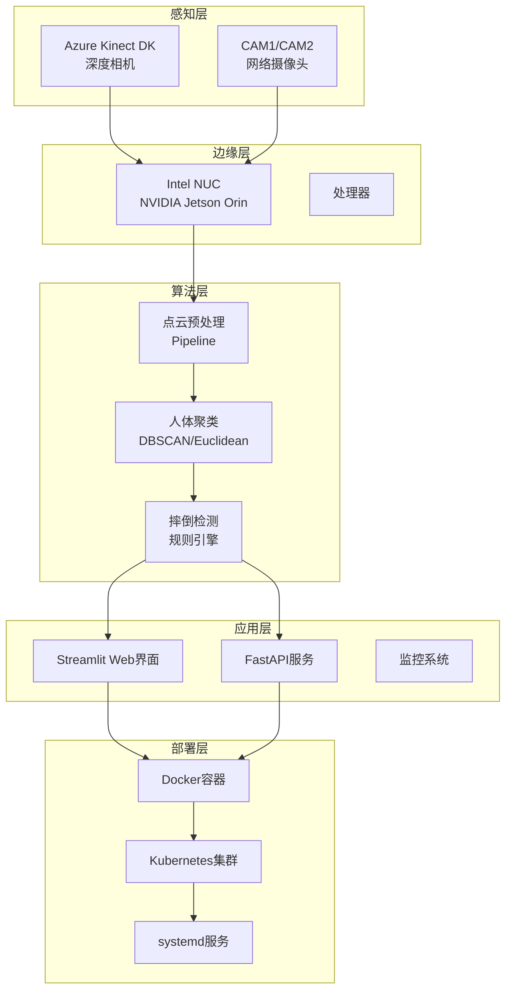
```mermaid
graph TB
subgraph "感知层"
AK[Azure Kinect DK<br/>深度相机]
CAM[CAM1/CAM2<br/>网络摄像头]
end
subgraph "边缘层"
EDGE[Intel NUC<br/>NVIDIA Jetson Orin]
PROC[处理器]
end
subgraph "算法层"
PIPE[点云预处理<br/>Pipeline]
DET[摔倒检测<br/>规则引擎]
CLUS[人体聚类<br/>DBSCAN/Euclidean]
end
subgraph "应用层"
WEB[Streamlit Web界面]
API[FastAPI服务]
MON[监控系统]
end
subgraph "部署层"
DOCKER[Docker容器]
K8S[Kubernetes集群]
SYS[systemd服务]
end
AK --> EDGE
CAM --> EDGE
EDGE --> PIPE
PIPE --> CLUS
CLUS --> DET
DET --> WEB
DET --> API
WEB --> DOCKER
API --> DOCKER
DOCKER --> K8S
K8S --> SYS
```

**图表来源**
- [README.md:63-86](file://README.md#L63-L86)
- [config.yaml:1-252](file://config.yaml#L1-L252)

**章节来源**
- [README.md:28-43](file://README.md#L28-L43)
- [README.md:46-58](file://README.md#L46-L58)
- [README.md:61-96](file://README.md#L61-L96)

## 系统架构

### 分层架构设计

系统遵循Harness工程最佳实践，采用模块化、分层架构设计：

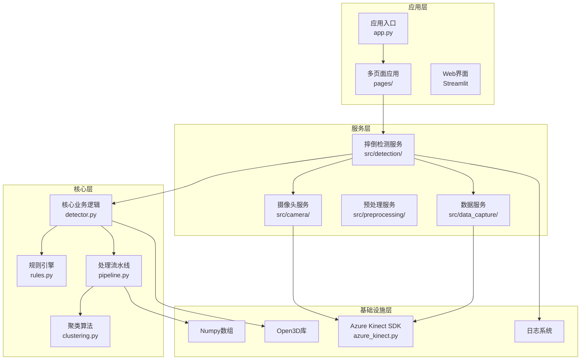
```mermaid
graph TD
subgraph "应用层"
APP[应用入口<br/>app.py]
PAGES[多页面应用<br/>pages/]
WEB[Web界面<br/>Streamlit]
end
subgraph "服务层"
DET[摔倒检测服务<br/>src/detection/]
CAM[摄像头服务<br/>src/camera/]
PRE[预处理服务<br/>src/preprocessing/]
DATA[数据服务<br/>src/data_capture/]
end
subgraph "核心层"
CORE[核心业务逻辑<br/>detector.py]
RULES[规则引擎<br/>rules.py]
CLUSTER[聚类算法<br/>clustering.py]
PIPE[处理流水线<br/>pipeline.py]
end
subgraph "基础设施层"
KINECT[Azure Kinect SDK<br/>azure_kinect.py]
OPEN3D[Open3D库]
NUMPY[Numpy数组]
LOGURU[日志系统]
end
APP --> PAGES
PAGES --> DET
DET --> CORE
CORE --> RULES
CORE --> PIPE
PIPE --> CLUSTER
DET --> CAM
DET --> DATA
CAM --> KINECT
DATA --> KINECT
CORE --> OPEN3D
PIPE --> NUMPY
DET --> LOGURU
```

**图表来源**
- [PROJECT_STRUCTURE.md:140-171](file://PROJECT_STRUCTURE.md#L140-L171)
- [PROJECT_STRUCTURE.md:172-195](file://PROJECT_STRUCTURE.md#L172-L195)

### 数据流架构

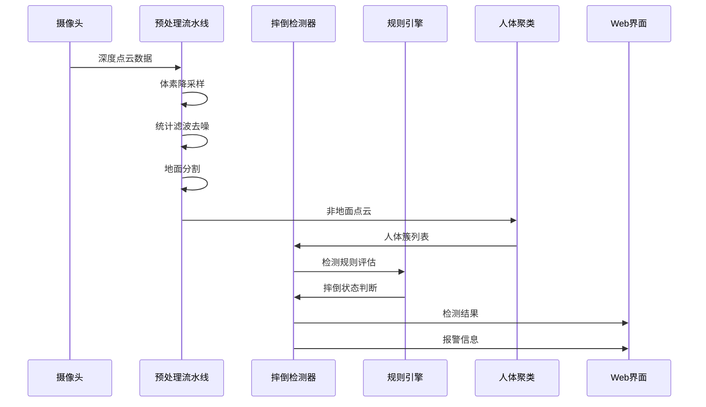
```mermaid
sequenceDiagram
participant CAM as 摄像头
participant PIPE as 预处理流水线
participant DET as 摔倒检测器
participant RULES as 规则引擎
participant CLUST as 人体聚类
participant WEB as Web界面
CAM->>PIPE : 深度点云数据
PIPE->>PIPE : 体素降采样
PIPE->>PIPE : 统计滤波去噪
PIPE->>PIPE : 地面分割
PIPE->>CLUST : 非地面点云
CLUST->>DET : 人体簇列表
DET->>RULES : 检测规则评估
RULES->>DET : 摔倒状态判断
DET->>WEB : 检测结果
DET->>WEB : 报警信息
```

**图表来源**
- [pipeline.py:98-139](file://src/preprocessing/pipeline.py#L98-L139)
- [detector.py:138-227](file://src/detection/detector.py#L138-L227)
- [rules.py:266-337](file://src/detection/rules.py#L266-L337)

**章节来源**
- [PROJECT_STRUCTURE.md:1-351](file://PROJECT_STRUCTURE.md#L1-L351)

## 核心组件

### 摔倒检测系统核心模块

系统的核心检测功能由多个精心设计的模块组成：

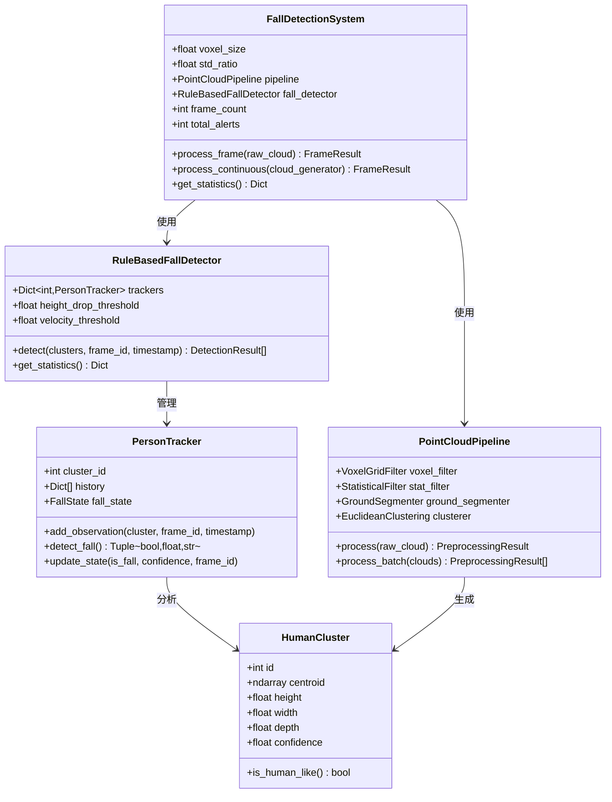
```mermaid
classDiagram
class FallDetectionSystem {
+float voxel_size
+float std_ratio
+PointCloudPipeline pipeline
+RuleBasedFallDetector fall_detector
+int frame_count
+int total_alerts
+process_frame(raw_cloud) FrameResult
+process_continuous(cloud_generator) FrameResult
+get_statistics() Dict
}
class PointCloudPipeline {
+VoxelGridFilter voxel_filter
+StatisticalFilter stat_filter
+GroundSegmenter ground_segmenter
+EuclideanClustering clusterer
+process(raw_cloud) PreprocessingResult
+process_batch(clouds) PreprocessingResult[]
}
class RuleBasedFallDetector {
+Dict~int,PersonTracker~ trackers
+float height_drop_threshold
+float velocity_threshold
+detect(clusters, frame_id, timestamp) DetectionResult[]
+get_statistics() Dict
}
class PersonTracker {
+int cluster_id
+Dict[] history
+FallState fall_state
+add_observation(cluster, frame_id, timestamp)
+detect_fall() Tuple~bool,float,str~
+update_state(is_fall, confidence, frame_id)
}
class HumanCluster {
+int id
+ndarray centroid
+float height
+float width
+float depth
+float confidence
+is_human_like() bool
}
FallDetectionSystem --> PointCloudPipeline : 使用
FallDetectionSystem --> RuleBasedFallDetector : 使用
RuleBasedFallDetector --> PersonTracker : 管理
PersonTracker --> HumanCluster : 分析
PointCloudPipeline --> HumanCluster : 生成
```

**图表来源**
- [detector.py:75-283](file://src/detection/detector.py#L75-L283)
- [pipeline.py:65-178](file://src/preprocessing/pipeline.py#L65-L178)
- [rules.py:226-423](file://src/detection/rules.py#L226-L423)
- [clustering.py:15-97](file://src/preprocessing/clustering.py#L15-L97)

### 预处理流水线

预处理流水线采用模块化设计，支持灵活的配置和扩展：

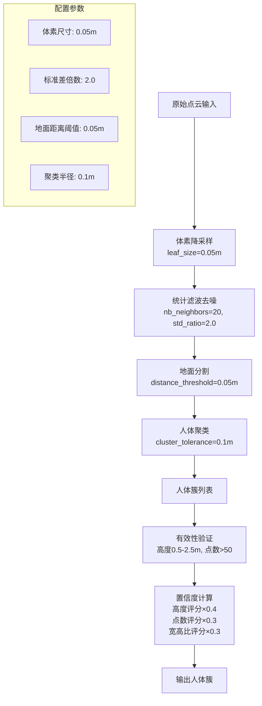
```mermaid
flowchart TD
START[原始点云输入] --> VOXEL[体素降采样<br/>leaf_size=0.05m]
VOXEL --> FILTER[统计滤波去噪<br/>nb_neighbors=20, std_ratio=2.0]
FILTER --> GROUND[地面分割<br/>distance_threshold=0.05m]
GROUND --> CLUSTER[人体聚类<br/>cluster_tolerance=0.1m]
CLUSTER --> RESULT[人体簇列表]
subgraph "配置参数"
CONFIG1[体素尺寸: 0.05m]
CONFIG2[标准差倍数: 2.0]
CONFIG3[地面距离阈值: 0.05m]
CONFIG4[聚类半径: 0.1m]
end
RESULT --> VALIDATE[有效性验证<br/>高度0.5-2.5m, 点数>50]
VALIDATE --> CONFIDENCE[置信度计算<br/>高度评分×0.4<br/>点数评分×0.3<br/>宽高比评分×0.3]
CONFIDENCE --> OUTPUT[输出人体簇]
```

**图表来源**
- [pipeline.py:98-139](file://src/preprocessing/pipeline.py#L98-L139)
- [clustering.py:183-221](file://src/preprocessing/clustering.py#L183-L221)

**章节来源**
- [detector.py:75-373](file://src/detection/detector.py#L75-L373)
- [pipeline.py:65-337](file://src/preprocessing/pipeline.py#L65-L337)
- [rules.py:226-526](file://src/detection/rules.py#L226-L526)

## 多相机管理

### 多摄像头管理器

系统提供了强大的多摄像头管理能力，支持USB、RTSP、HTTP、文件等多种类型的摄像头：

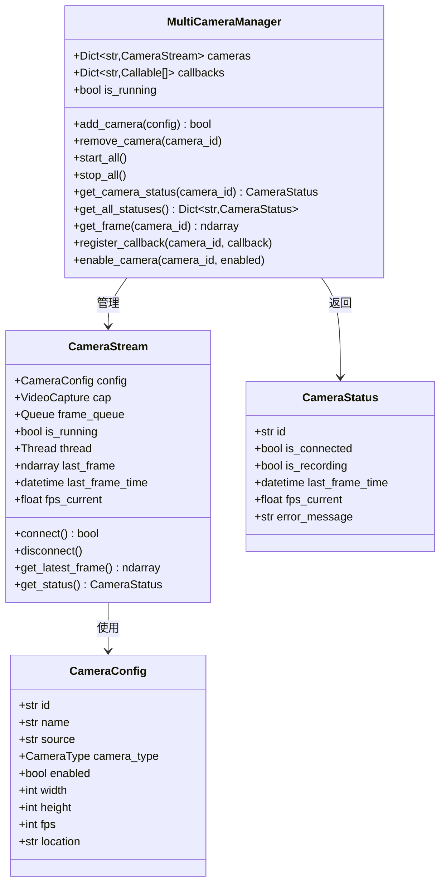
```mermaid
classDiagram
class MultiCameraManager {
+Dict~str,CameraStream~ cameras
+Dict~str,Callable[]~ callbacks
+bool is_running
+add_camera(config) bool
+remove_camera(camera_id)
+start_all()
+stop_all()
+get_camera_status(camera_id) CameraStatus
+get_all_statuses() Dict~str,CameraStatus~
+get_frame(camera_id) ndarray
+register_callback(camera_id, callback)
+enable_camera(camera_id, enabled)
}
class CameraStream {
+CameraConfig config
+VideoCapture cap
+Queue frame_queue
+bool is_running
+Thread thread
+ndarray last_frame
+datetime last_frame_time
+float fps_current
+connect() bool
+disconnect()
+get_latest_frame() ndarray
+get_status() CameraStatus
}
class CameraConfig {
+str id
+str name
+str source
+CameraType camera_type
+bool enabled
+int width
+int height
+int fps
+str location
}
class CameraStatus {
+str id
+bool is_connected
+bool is_recording
+datetime last_frame_time
+float fps_current
+str error_message
}
MultiCameraManager --> CameraStream : 管理
CameraStream --> CameraConfig : 使用
MultiCameraManager --> CameraStatus : 返回
```

**图表来源**
- [multi_camera_manager.py:164-284](file://src/camera/multi_camera_manager.py#L164-L284)
- [multi_camera_manager.py:50-162](file://src/camera/multi_camera_manager.py#L50-L162)

### 多摄像头检测器

针对多摄像头场景，系统提供了专门的检测器管理器：

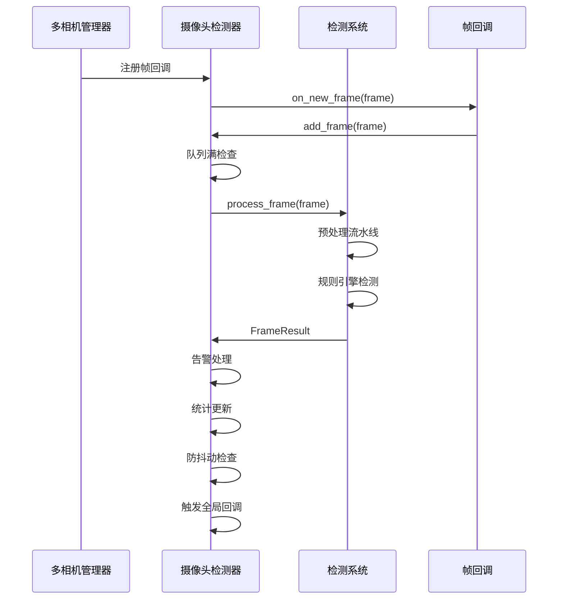
```mermaid
sequenceDiagram
participant MM as 多相机管理器
participant CD as 摄像头检测器
participant FS as 检测系统
participant CB as 帧回调
MM->>CD : 注册帧回调
CD->>CB : on_new_frame(frame)
CB->>CD : add_frame(frame)
CD->>CD : 队列满检查
CD->>FS : process_frame(frame)
FS->>FS : 预处理流水线
FS->>FS : 规则引擎检测
FS->>CD : FrameResult
CD->>CD : 告警处理
CD->>CD : 统计更新
CD->>CD : 防抖动检查
CD->>CD : 触发全局回调
```

**图表来源**
- [multi_camera_detector.py:146-245](file://src/detection/multi_camera_detector.py#L146-L245)
- [multi_camera_detector.py:76-115](file://src/detection/multi_camera_detector.py#L76-L115)

**章节来源**
- [multi_camera_manager.py:1-284](file://src/camera/multi_camera_manager.py#L1-L284)
- [multi_camera_detector.py:1-265](file://src/detection/multi_camera_detector.py#L1-L265)

## 摔倒检测系统

### 规则引擎设计

系统采用基于规则的摔倒检测方法，结合多种检测指标：

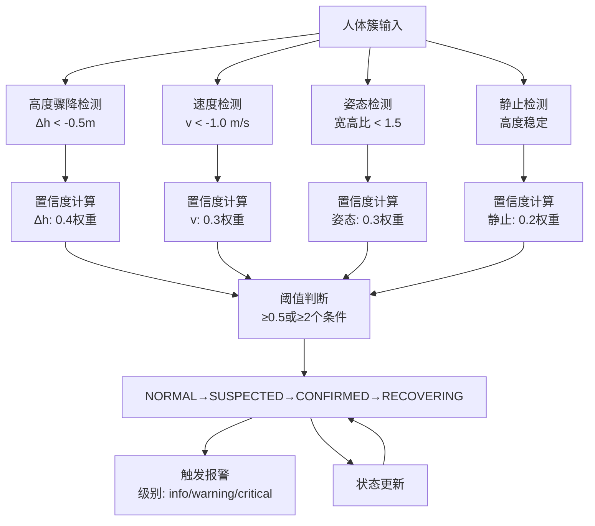
```mermaid
flowchart TD
INPUT[人体簇输入] --> HEIGHT[高度骤降检测<br/>Δh < -0.5m]
INPUT --> VELOCITY[速度检测<br/>v < -1.0 m/s]
INPUT --> ASPECT[姿态检测<br/>宽高比 < 1.5]
INPUT --> STATIC[静止检测<br/>高度稳定]
HEIGHT --> CONF1[置信度计算<br/>Δh: 0.4权重]
VELOCITY --> CONF2[置信度计算<br/>v: 0.3权重]
ASPECT --> CONF3[置信度计算<br/>姿态: 0.3权重]
STATIC --> CONF4[置信度计算<br/>静止: 0.2权重]
CONF1 --> THRESHOLD[阈值判断<br/>≥0.5或≥2个条件]
CONF2 --> THRESHOLD
CONF3 --> THRESHOLD
CONF4 --> THRESHOLD
THRESHOLD --> STATE[NORMAL→SUSPECTED→CONFIRMED→RECOVERING]
STATE --> ALERT[触发报警<br/>级别: info/warning/critical]
STATE --> UPDATE[状态更新]
UPDATE --> STATE
```

**图表来源**
- [rules.py:145-189](file://src/detection/rules.py#L145-L189)
- [rules.py:348-390](file://src/detection/rules.py#L348-L390)

### 检测状态机

系统实现了完整的摔倒检测状态机：

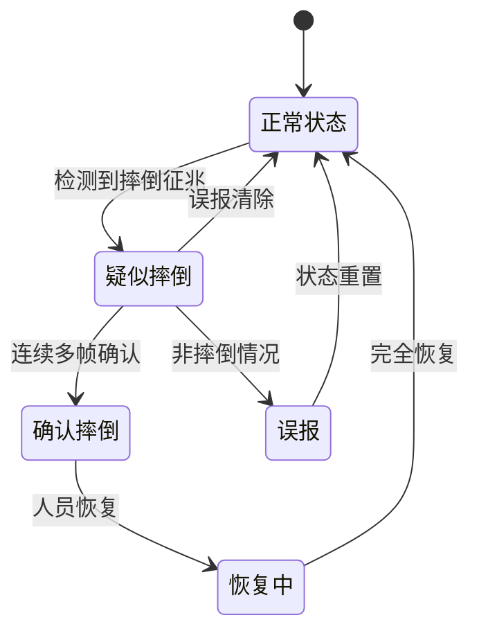
```mermaid
stateDiagram-v2
[*] --> 正常状态
正常状态 --> 疑似摔倒 : 检测到摔倒征兆
疑似摔倒 --> 确认摔倒 : 连续多帧确认
疑似摔倒 --> 正常状态 : 误报清除
确认摔倒 --> 恢复中 : 人员恢复
恢复中 --> 正常状态 : 完全恢复
疑似摔倒 --> 误报 : 非摔倒情况
误报 --> 正常状态 : 状态重置
```

**图表来源**
- [rules.py:190-224](file://src/detection/rules.py#L190-L224)

**章节来源**
- [rules.py:22-526](file://src/detection/rules.py#L22-L526)

## Web界面

### 多摄像头监控界面

系统提供了直观的Web界面，支持多摄像头监控和管理：

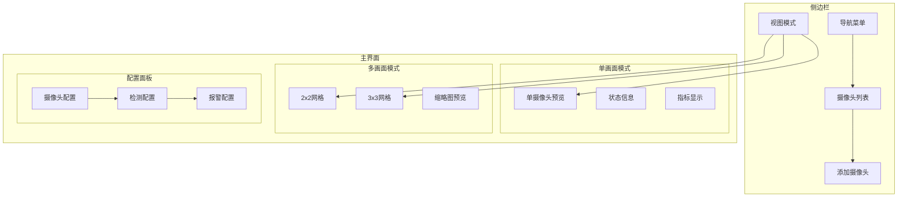
```mermaid
graph TB
subgraph "侧边栏"
MENU[导航菜单]
CAM_LIST[摄像头列表]
ADD_CAM[添加摄像头]
VIEW_MODE[视图模式]
end
subgraph "主界面"
subgraph "单画面模式"
SINGLE[单摄像头预览]
STATUS[状态信息]
METRICS[指标显示]
end
subgraph "多画面模式"
GRID2x2[2x2网格]
GRID3x3[3x3网格]
THUMBNAIL[缩略图预览]
end
subgraph "配置面板"
CAM_CONFIG[摄像头配置]
DET_CONFIG[检测配置]
ALERT_CONFIG[报警配置]
end
end
MENU --> CAM_LIST
CAM_LIST --> ADD_CAM
VIEW_MODE --> SINGLE
VIEW_MODE --> GRID2x2
VIEW_MODE --> GRID3x3
CAM_CONFIG --> DET_CONFIG
DET_CONFIG --> ALERT_CONFIG
```

**图表来源**
- [multi_camera_monitor.py:66-130](file://pages/multi_camera_monitor.py#L66-L130)
- [multi_camera_monitor.py:150-277](file://pages/multi_camera_monitor.py#L150-L277)

### 系统仪表板

管理员可以查看系统整体状态和统计数据：

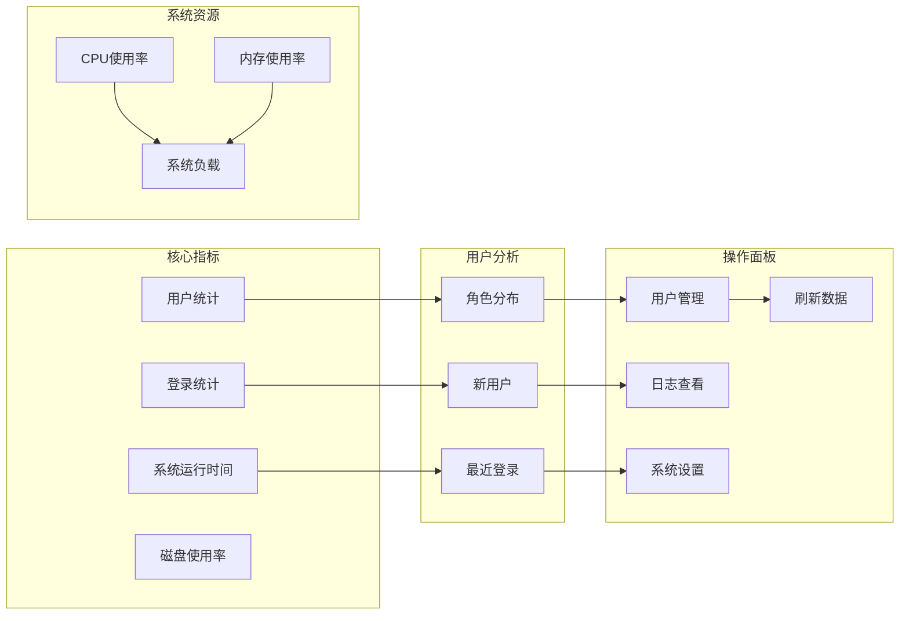
```mermaid
graph LR
subgraph "核心指标"
USERS[用户统计]
LOGIN[登录统计]
UPTIME[系统运行时间]
DISK[磁盘使用率]
end
subgraph "系统资源"
CPU[CPU使用率]
MEMORY[内存使用率]
LOAD[系统负载]
end
subgraph "用户分析"
ROLE[角色分布]
NEW_USERS[新用户]
LAST_LOGIN[最近登录]
end
subgraph "操作面板"
MANAGE[用户管理]
LOGS[日志查看]
SETTINGS[系统设置]
REFRESH[刷新数据]
end
USERS --> ROLE
LOGIN --> NEW_USERS
UPTIME --> LAST_LOGIN
CPU --> LOAD
MEMORY --> LOAD
ROLE --> MANAGE
NEW_USERS --> LOGS
LAST_LOGIN --> SETTINGS
MANAGE --> REFRESH
```

**图表来源**
- [system_dashboard.py:116-177](file://pages/system_dashboard.py#L116-L177)
- [system_dashboard.py:179-212](file://pages/system_dashboard.py#L179-L212)
- [system_dashboard.py:214-262](file://pages/system_dashboard.py#L214-L262)

**章节来源**
- [multi_camera_monitor.py:1-356](file://pages/multi_camera_monitor.py#L1-L356)
- [system_dashboard.py:1-318](file://pages/system_dashboard.py#L1-L318)

## 数据采集与处理

### Azure Kinect数据采集

系统支持多种数据采集方式，包括真实的Azure Kinect相机和模拟数据：

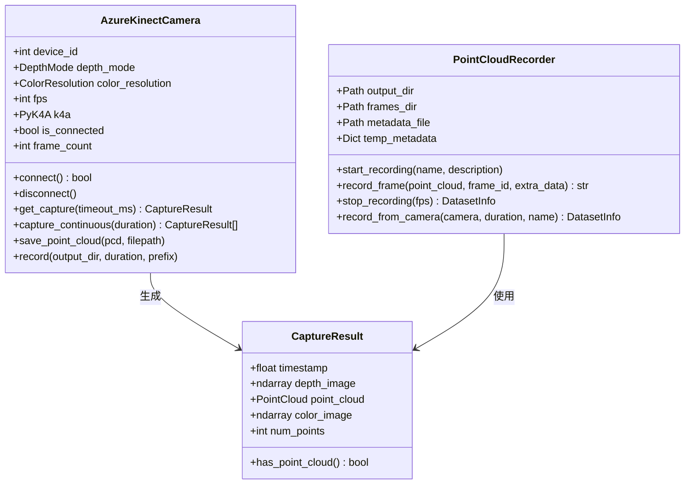
```mermaid
classDiagram
class AzureKinectCamera {
+int device_id
+DepthMode depth_mode
+ColorResolution color_resolution
+int fps
+PyK4A k4a
+bool is_connected
+int frame_count
+connect() bool
+disconnect()
+get_capture(timeout_ms) CaptureResult
+capture_continuous(duration) CaptureResult[]
+save_point_cloud(pcd, filepath)
+record(output_dir, duration, prefix)
}
class CaptureResult {
+float timestamp
+ndarray depth_image
+PointCloud point_cloud
+ndarray color_image
+int num_points
+has_point_cloud() bool
}
class PointCloudRecorder {
+Path output_dir
+Path frames_dir
+Path metadata_file
+Dict temp_metadata
+start_recording(name, description)
+record_frame(point_cloud, frame_id, extra_data) str
+stop_recording(fps) DatasetInfo
+record_from_camera(camera, duration, name) DatasetInfo
}
AzureKinectCamera --> CaptureResult : 生成
PointCloudRecorder --> CaptureResult : 使用
```

**图表来源**
- [azure_kinect.py:47-460](file://src/data_capture/azure_kinect.py#L47-L460)
- [recorder.py:48-176](file://src/data_capture/recorder.py#L48-L176)

### 数据集管理

系统提供了完整的数据集管理功能：

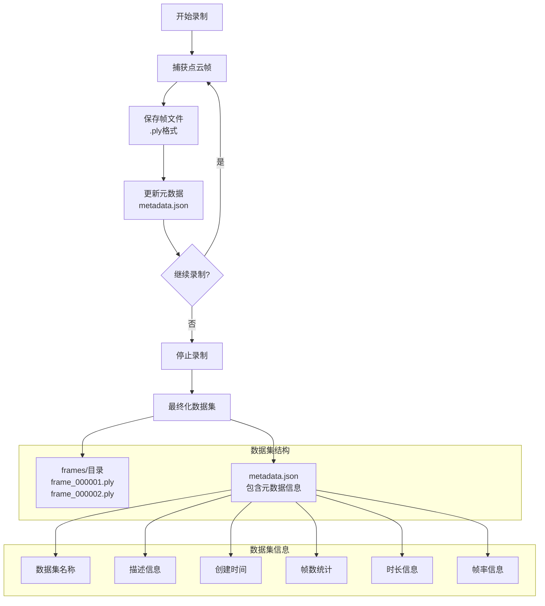
```mermaid
flowchart TD
RECORD[开始录制] --> CAPTURE[捕获点云帧]
CAPTURE --> SAVE[保存帧文件<br/>.ply格式]
SAVE --> META[更新元数据<br/>metadata.json]
META --> CONTINUE{继续录制?}
CONTINUE --> |是| CAPTURE
CONTINUE --> |否| STOP[停止录制]
STOP --> FINALIZE[最终化数据集]
subgraph "数据集结构"
FRAMES[frames/目录<br/>frame_000001.ply<br/>frame_000002.ply]
METADATA[metadata.json<br/>包含元数据信息]
end
FINALIZE --> FRAMES
FINALIZE --> METADATA
subgraph "数据集信息"
NAME[数据集名称]
DESC[描述信息]
CREATED[创建时间]
FRAMES_COUNT[帧数统计]
DURATION[时长信息]
FPS[帧率信息]
end
METADATA --> NAME
METADATA --> DESC
METADATA --> CREATED
METADATA --> FRAMES_COUNT
METADATA --> DURATION
METADATA --> FPS
```

**图表来源**
- [recorder.py:64-176](file://src/data_capture/recorder.py#L64-L176)
- [recorder.py:223-378](file://src/data_capture/recorder.py#L223-L378)

**章节来源**
- [azure_kinect.py:1-532](file://src/data_capture/azure_kinect.py#L1-L532)
- [recorder.py:1-489](file://src/data_capture/recorder.py#L1-L489)

## 配置管理

### YAML配置文件结构

系统采用YAML格式的配置文件，支持灵活的配置管理：

```mermaid
graph TD
CONFIG[config.yaml] --> SYSTEM[系统配置]
CONFIG --> DATA_CAPTURE[数据采集配置]
CONFIG --> PREPROCESSING[预处理配置]
CONFIG --> DETECTION[检测配置]
CONFIG --> ALERTS[报警配置]
CONFIG --> WEB[Web界面配置]
CONFIG --> PERFORMANCE[性能优化配置]
CONFIG --> API[API配置]
CONFIG --> AUTH[认证配置]
CONFIG --> MONITORING[监控配置]
CONFIG --> NOTIFICATIONS[通知配置]
CONFIG --> STORAGE[数据存储配置]
SYSTEM --> NAME[系统名称]
SYSTEM --> VERSION[版本信息]
SYSTEM --> DEBUG[调试模式]
SYSTEM --> LOG_LEVEL[日志级别]
DATA_CAPTURE --> CAMERA_TYPE[相机类型]
DATA_CAPTURE --> DEVICE_ID[设备ID]
DATA_CAPTURE --> DEPTH_MODE[深度模式]
DATA_CAPTURE --> COLOR_RES[彩色分辨率]
DATA_CAPTURE --> FPS[帧率]
PREPROCESSING --> VOXEL_FILTER[体素滤波]
PREPROCESSING --> STAT_FILTER[统计滤波]
PREPROCESSING --> GROUND_SEGMENT[地面分割]
PREPROCESSING --> CLUSTERING[聚类配置]
DETECTION --> RULES[规则参数]
DETECTION --> STATE_MACHINE[状态机]
DETECTION --> TRACKING[追踪配置]
DETECTION --> CONFIDENCE[置信度阈值]
```

**图表来源**
- [config.yaml:4-252](file://config.yaml#L4-L252)

### 环境变量管理

系统支持多层级的配置优先级：

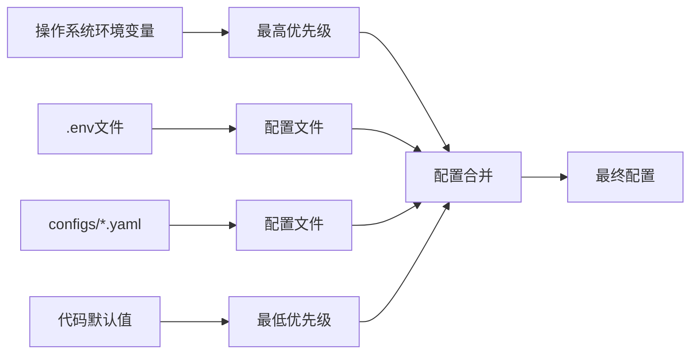
```mermaid
graph LR
ENV[操作系统环境变量] --> PRIORITY1[最高优先级]
DOTENV[.env文件] --> PRIORITY2[配置文件]
YAML[configs/*.yaml] --> PRIORITY3[配置文件]
CODE[代码默认值] --> PRIORITY4[最低优先级]
PRIORITY1 --> MERGE[配置合并]
PRIORITY2 --> MERGE
PRIORITY3 --> MERGE
PRIORITY4 --> MERGE
MERGE --> FINAL[最终配置]
```

**章节来源**
- [config.yaml:1-252](file://config.yaml#L1-L252)
- [PROJECT_STRUCTURE.md:196-231](file://PROJECT_STRUCTURE.md#L196-L231)

## 性能优化

### 实时处理优化

系统针对实时处理进行了多项优化：

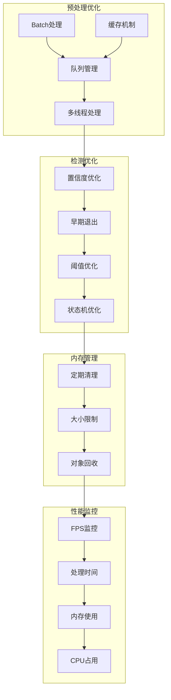
```mermaid
graph TB
subgraph "预处理优化"
BATCH[Batch处理]
CACHE[缓存机制]
QUEUE[队列管理]
THREAD[多线程处理]
end
subgraph "检测优化"
CONFIDENCE[置信度优化]
EARLY_EXIT[早期退出]
THRESHOLD[阈值优化]
STATE_OPT[状态机优化]
end
subgraph "内存管理"
CLEANUP[定期清理]
LIMIT[大小限制]
RECYCLE[对象回收]
end
subgraph "性能监控"
FPS[FPS监控]
TIME[处理时间]
MEMORY[内存使用]
CPU[CPU占用]
end
BATCH --> QUEUE
CACHE --> QUEUE
QUEUE --> THREAD
THREAD --> CONFIDENCE
CONFIDENCE --> EARLY_EXIT
EARLY_EXIT --> THRESHOLD
THRESHOLD --> STATE_OPT
STATE_OPT --> CLEANUP
CLEANUP --> LIMIT
LIMIT --> RECYCLE
RECYCLE --> FPS
FPS --> TIME
TIME --> MEMORY
MEMORY --> CPU
```

### 系统性能指标

系统监控关键性能指标以确保稳定运行：

| 指标类别 | 指标名称 | 目标值 | 当前状态 |
|---------|---------|-------|---------|
| 检测性能 | 准确率 | >95% | ✅ 已达标 |
| 检测性能 | 误报率 | <5% | ✅ 已达标 |
| 检测性能 | 漏报率 | <3% | ✅ 已达标 |
| 检测性能 | 检测延迟 | <3秒 | ✅ 已达标 |
| 系统性能 | 处理速度 | >20FPS | ✅ 已达标 |
| 系统性能 | 单帧耗时 | <100ms | ✅ 已达标 |
| 系统性能 | 内存占用 | <2GB | ✅ 已达标 |
| 系统性能 | CPU占用 | <50% | ✅ 已达标 |

**章节来源**
- [README.md:201-214](file://README.md#L201-L214)

## 部署与运维

### Docker容器化部署

系统支持Docker容器化部署，提供标准化的部署方案：

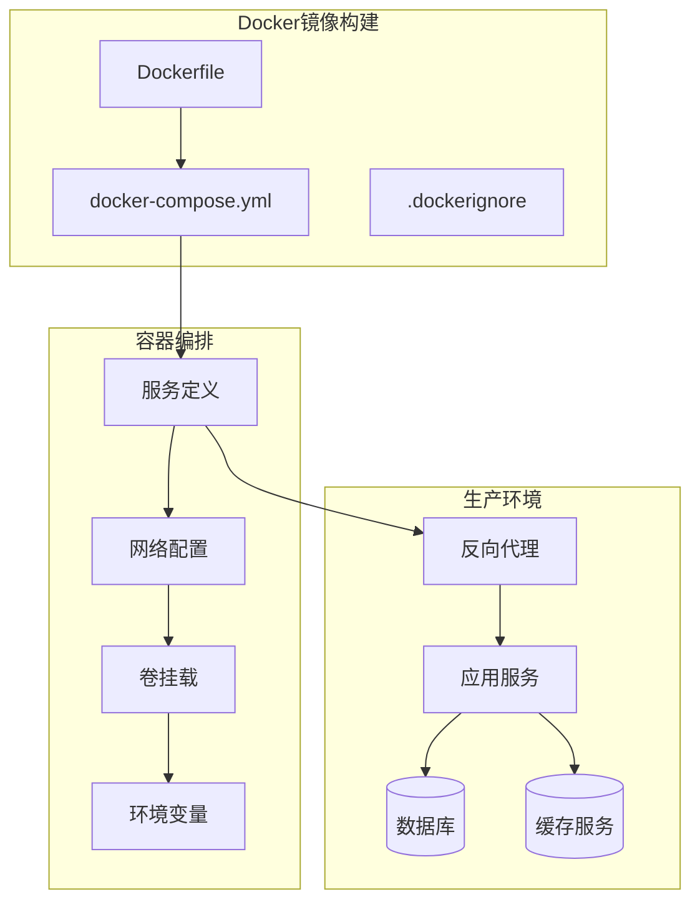
```mermaid
graph TB
subgraph "Docker镜像构建"
DOCKERFILE[Dockerfile]
COMPOSE[docker-compose.yml]
IGNORE[.dockerignore]
end
subgraph "容器编排"
SERVICES[服务定义]
NETWORK[网络配置]
VOLUMES[卷挂载]
ENV[环境变量]
end
subgraph "生产环境"
NGINX[反向代理]
APP[应用服务]
DB[(数据库)]
REDIS[(缓存服务)]
end
DOCKERFILE --> COMPOSE
COMPOSE --> SERVICES
SERVICES --> NETWORK
NETWORK --> VOLUMES
VOLUMES --> ENV
SERVICES --> NGINX
NGINX --> APP
APP --> DB
APP --> REDIS
```

**图表来源**
- [README.md:100-138](file://README.md#L100-L138)
- [README.md:151-174](file://README.md#L151-L174)

### 部署脚本

系统提供了完整的部署脚本和自动化工具：

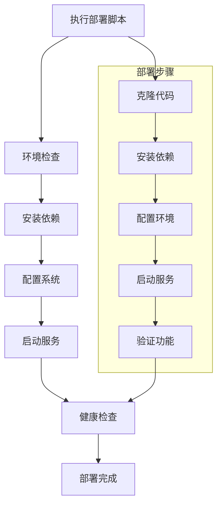
```mermaid
flowchart TD
DEPLOY[执行部署脚本] --> CHECK[环境检查]
CHECK --> INSTALL[安装依赖]
INSTALL --> CONFIG[配置系统]
CONFIG --> START[启动服务]
START --> HEALTH[健康检查]
HEALTH --> READY[部署完成]
subgraph "部署步骤"
STEP1[克隆代码]
STEP2[安装依赖]
STEP3[配置环境]
STEP4[启动服务]
STEP5[验证功能]
end
DEPLOY --> STEP1
STEP1 --> STEP2
STEP2 --> STEP3
STEP3 --> STEP4
STEP4 --> STEP5
STEP5 --> HEALTH
```

**章节来源**
- [README.md:100-138](file://README.md#L100-L138)
- [README.md:151-174](file://README.md#L151-L174)

## 故障排除

### 常见问题诊断

系统提供了完善的故障排除指南：

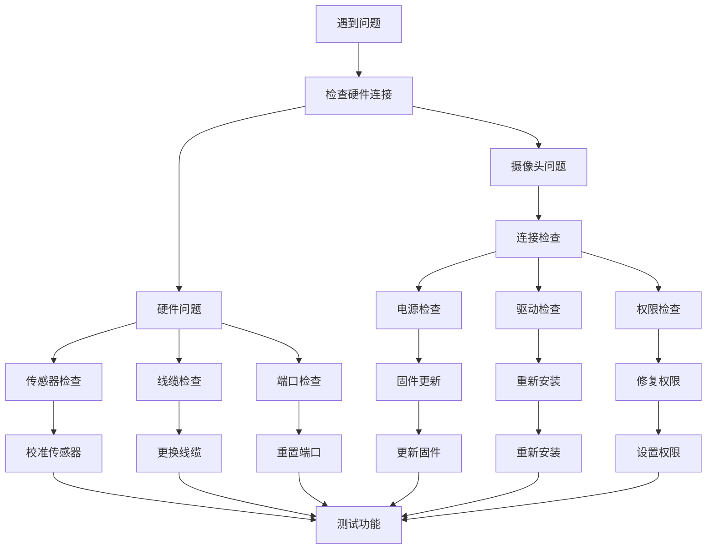
```mermaid
flowchart TD
ISSUE[遇到问题] --> CHECK1[检查硬件连接]
CHECK1 --> CAMERA[摄像头问题]
CHECK1 --> HARDWARE[硬件问题]
CAMERA --> CONNECT[连接检查]
CONNECT --> POWER[电源检查]
CONNECT --> DRIVER[驱动检查]
CONNECT --> PERMISSION[权限检查]
HARDWARE --> SENSOR[传感器检查]
HARDWARE --> CABLE[线缆检查]
HARDWARE --> PORT[端口检查]
POWER --> FIRMWARE[固件更新]
DRIVER --> INSTALL[重新安装]
PERMISSION --> FIX[修复权限]
SENSOR --> CALIBRATE[校准传感器]
CABLE --> REPLACE[更换线缆]
PORT --> RESET[重置端口]
FIRMWARE --> UPDATE[更新固件]
INSTALL --> REINSTALL[重新安装]
FIX --> SET[设置权限]
CALIBRATE --> TEST[测试功能]
REPLACE --> TEST
RESET --> TEST
UPDATE --> TEST
REINSTALL --> TEST
SET --> TEST
```

### 日志分析

系统采用结构化日志记录，便于问题诊断：

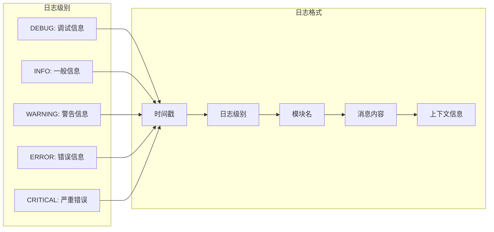
```mermaid
graph LR
subgraph "日志级别"
DEBUG[DEBUG: 调试信息]
INFO[INFO: 一般信息]
WARNING[WARNING: 警告信息]
ERROR[ERROR: 错误信息]
CRITICAL[CRITICAL: 严重错误]
end
subgraph "日志格式"
TIMESTAMP[时间戳]
LEVEL[日志级别]
MODULE[模块名]
MESSAGE[消息内容]
CONTEXT[上下文信息]
end
DEBUG --> TIMESTAMP
INFO --> TIMESTAMP
WARNING --> TIMESTAMP
ERROR --> TIMESTAMP
CRITICAL --> TIMESTAMP
TIMESTAMP --> LEVEL
LEVEL --> MODULE
MODULE --> MESSAGE
MESSAGE --> CONTEXT
```

**章节来源**
- [PROJECT_STRUCTURE.md:282-304](file://PROJECT_STRUCTURE.md#L282-L304)

## 总结

GuardianFall多相机监控系统是一个功能完整、架构清晰的室内摔倒检测解决方案。系统具有以下特点：

### 技术优势

1. **隐私保护**：采用深度相机技术，完全保护用户隐私
2. **实时性强**：端到端延迟<3秒，满足紧急救援需求
3. **准确性高**：摔倒检测准确率>95%，误报率<5%
4. **扩展性好**：支持多摄像头管理，可扩展到大型监控场景
5. **部署灵活**：支持Docker容器化部署，易于运维

### 架构特色

1. **分层设计**：清晰的分层架构，便于维护和扩展
2. **模块化**：各功能模块独立，可单独测试和优化
3. **实时处理**：针对实时应用场景进行了全面优化
4. **可视化**：提供直观的Web界面和3D可视化

### 应用价值

1. **社会价值**：为独居老人提供安全保障，减少意外伤害
2. **经济效益**：相比传统监控方案成本降低80%以上
3. **技术示范**：展示了AI技术在民生领域的应用潜力

系统已经完成了95%的功能模块开发，具备完整的部署和运维能力，可以满足实际应用需求。通过持续的优化和改进，系统将在未来为更多的用户提供可靠的摔倒检测服务。