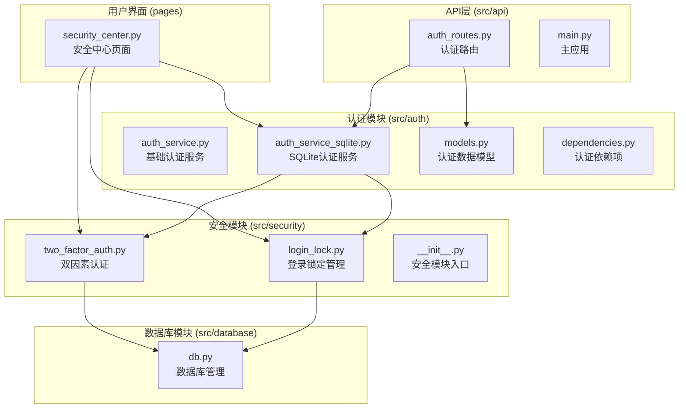
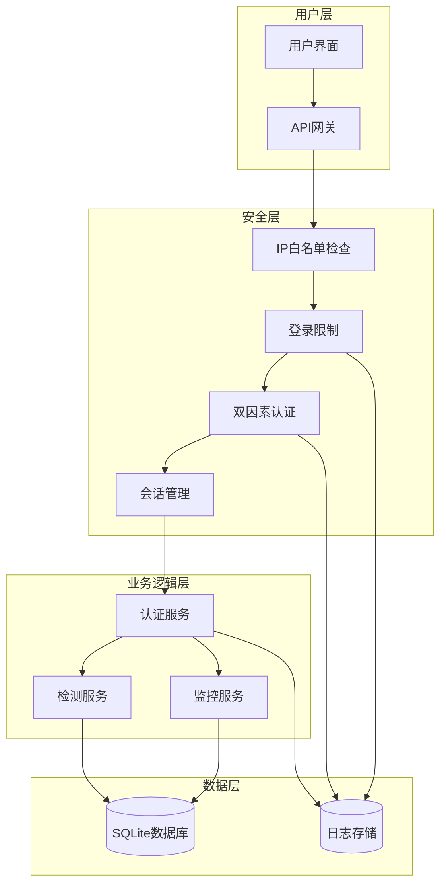
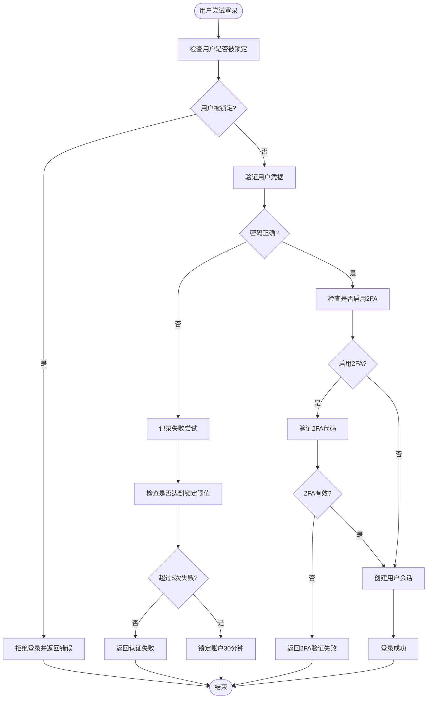
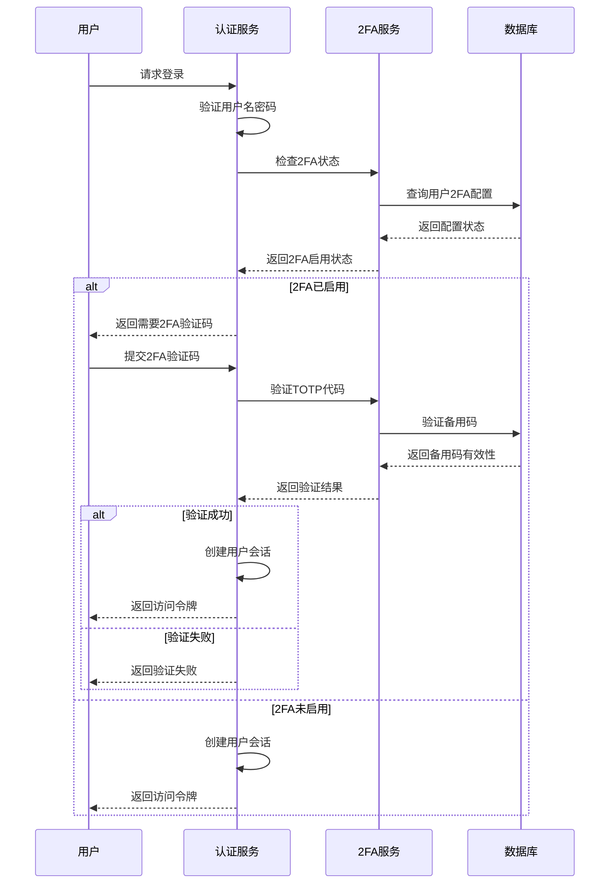
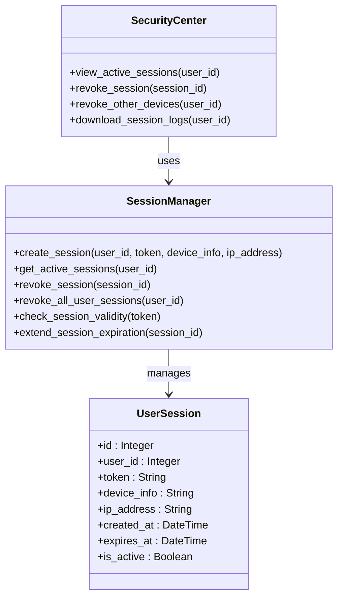
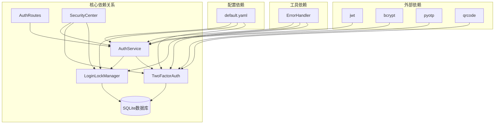

# 安全增强功能

<cite>
**本文档引用的文件**
- [SECURITY_FEATURES.md](file://SECURITY_FEATURES.md)
- [src/security/__init__.py](file://src/security/__init__.py)
- [src/security/login_lock.py](file://src/security/login_lock.py)
- [src/security/two_factor_auth.py](file://src/security/two_factor_auth.py)
- [src/auth/auth_service.py](file://src/auth/auth_service.py)
- [src/auth/auth_service_sqlite.py](file://src/auth/auth_service_sqlite.py)
- [src/auth/models.py](file://src/auth/models.py)
- [src/auth/dependencies.py](file://src/auth/dependencies.py)
- [src/database/db.py](file://src/database/db.py)
- [pages/security_center.py](file://pages/security_center.py)
- [src/api/auth_routes.py](file://src/api/auth_routes.py)
- [src/api/main.py](file://src/api/main.py)
- [configs/default.yaml](file://configs/default.yaml)
- [src/utils/error_handler.py](file://src/utils/error_handler.py)
</cite>

## 目录
1. [简介](#简介)
2. [项目结构](#项目结构)
3. [核心安全组件](#核心安全组件)
4. [架构概览](#架构概览)
5. [详细组件分析](#详细组件分析)
6. [依赖关系分析](#依赖关系分析)
7. [性能考虑](#性能考虑)
8. [故障排除指南](#故障排除指南)
9. [结论](#结论)

## 简介

摔倒检测系统 v1.5 引入了全面的企业级安全增强功能，旨在保护系统免受暴力破解和未授权访问。该系统集成了多重安全机制，包括登录失败锁定、双因素认证（2FA）、IP 白名单、会话管理和审计日志等功能。

这些安全功能通过现代化的架构设计实现了无缝集成，为系统提供了强大的防护能力，同时保持了良好的用户体验和可维护性。

## 项目结构

系统采用模块化的安全架构，主要安全相关文件分布如下：

**图表来源**
- [src/security/__init__.py:1-15](file://src/security/__init__.py#L1-L15)
- [src/auth/auth_service_sqlite.py:1-383](file://src/auth/auth_service_sqlite.py#L1-L383)
- [src/database/db.py:1-193](file://src/database/db.py#L1-L193)

**章节来源**
- [src/security/__init__.py:1-15](file://src/security/__init__.py#L1-L15)
- [src/auth/auth_service_sqlite.py:1-383](file://src/auth/auth_service_sqlite.py#L1-L383)
- [src/database/db.py:1-193](file://src/database/db.py#L1-L193)

## 核心安全组件

### 登录锁定管理器

登录锁定管理器是系统安全防护的第一道防线，专门设计用来防止暴力破解攻击：

- **失败尝试记录**：跟踪每个用户的登录失败尝试，包括用户名和IP地址
- **智能锁定机制**：基于时间窗口的失败次数计算，15分钟内5次失败自动锁定30分钟
- **实时状态检查**：提供用户锁定状态的实时查询功能
- **统计分析**：提供详细的攻击统计和Top攻击IP分析

### 双因素认证系统

基于TOTP（基于时间的一次性密码）的双因素认证系统，提供额外的安全层：

- **TOTP支持**：兼容Google Authenticator、Microsoft Authenticator等主流验证器
- **备用码系统**：生成10个一次性备用码，用于手机丢失等紧急情况
- **QR码生成**：自动生成可扫描的二维码，简化用户设置过程
- **灵活验证**：支持TOTP验证码和备用码两种验证方式

### 会话管理系统

完整的会话生命周期管理，确保用户会话的安全性：

- **活跃会话监控**：实时跟踪所有活跃用户会话
- **会话撤销**：支持单个会话撤销和批量会话管理
- **设备识别**：记录和识别不同设备的登录信息
- **过期管理**：自动处理过期会话的清理

**章节来源**
- [src/security/login_lock.py:1-190](file://src/security/login_lock.py#L1-L190)
- [src/security/two_factor_auth.py:1-247](file://src/security/two_factor_auth.py#L1-L247)
- [src/database/db.py:50-193](file://src/database/db.py#L50-L193)

## 架构概览

系统采用分层安全架构，各组件协同工作形成完整的安全防护体系：

**图表来源**
- [src/auth/auth_service_sqlite.py:83-171](file://src/auth/auth_service_sqlite.py#L83-L171)
- [src/security/login_lock.py:108-124](file://src/security/login_lock.py#L108-L124)
- [src/security/two_factor_auth.py:75-102](file://src/security/two_factor_auth.py#L75-L102)

## 详细组件分析

### 登录锁定机制详细分析

登录锁定机制通过智能的时间窗口算法防止暴力破解攻击：

**图表来源**
- [src/auth/auth_service_sqlite.py:83-171](file://src/auth/auth_service_sqlite.py#L83-L171)
- [src/security/login_lock.py:108-124](file://src/security/login_lock.py#L108-L124)

### 双因素认证流程分析

双因素认证提供了额外的安全层，确保即使密码泄露也能保护账户安全：

**图表来源**
- [src/auth/auth_service_sqlite.py:126-137](file://src/auth/auth_service_sqlite.py#L126-L137)
- [src/security/two_factor_auth.py:130-149](file://src/security/two_factor_auth.py#L130-L149)

### 会话管理详细分析

会话管理系统确保用户会话的安全性和可控性：

**图表来源**
- [src/auth/auth_service_sqlite.py:192-205](file://src/auth/auth_service_sqlite.py#L192-L205)
- [pages/security_center.py:377-436](file://pages/security_center.py#L377-L436)

**章节来源**
- [src/security/login_lock.py:48-144](file://src/security/login_lock.py#L48-L144)
- [src/security/two_factor_auth.py:42-209](file://src/security/two_factor_auth.py#L42-L209)
- [src/auth/auth_service_sqlite.py:192-351](file://src/auth/auth_service_sqlite.py#L192-L351)

## 依赖关系分析

系统安全功能之间的依赖关系形成了一个紧密协作的安全生态系统：

**图表来源**
- [src/auth/auth_service_sqlite.py:13-18](file://src/auth/auth_service_sqlite.py#L13-L18)
- [src/database/db.py:50-193](file://src/database/db.py#L50-L193)
- [configs/default.yaml:25-32](file://configs/default.yaml#L25-L32)

**章节来源**
- [src/auth/auth_service_sqlite.py:13-18](file://src/auth/auth_service_sqlite.py#L13-L18)
- [src/database/db.py:50-193](file://src/database/db.py#L50-L193)
- [configs/default.yaml:25-32](file://configs/default.yaml#L25-L32)

## 性能考虑

系统在保证安全性的同时，也充分考虑了性能优化：

### 数据库性能优化
- **索引优化**：为登录尝试、用户锁定、会话管理等关键表建立了适当的索引
- **连接池管理**：使用SQLite的连接池机制，避免频繁的数据库连接开销
- **批量操作**：支持批量清理过期数据，减少数据库压力

### 缓存策略
- **内存缓存**：热点数据存储在内存中，减少数据库查询次数
- **会话缓存**：活跃会话信息缓存，提高会话验证速度
- **配置缓存**：安全配置信息缓存，避免重复读取

### 异步处理
- **非阻塞I/O**：使用异步数据库连接，避免阻塞主线程
- **并发控制**：合理控制并发访问，防止资源竞争
- **超时机制**：设置合理的超时时间，避免长时间占用资源

## 故障排除指南

### 常见问题及解决方案

#### 用户被意外锁定
当用户因多次登录失败被锁定时，管理员可以通过以下方式解决：

1. **手动解锁**：使用管理员权限调用解锁功能
2. **等待自动解锁**：锁定会在30分钟后自动解除
3. **检查系统时间**：确保系统时间准确，避免锁定状态异常

#### 2FA配置问题
当用户无法正常使用双因素认证时：

1. **检查时间同步**：确保系统时间与NTP服务器同步
2. **验证TOTP密钥**：确认用户使用的验证器应用正确配置
3. **使用备用码**：在紧急情况下使用备用码登录

#### 会话管理问题
当用户遇到会话相关问题：

1. **检查会话过期**：确认会话是否已过期
2. **清理浏览器缓存**：清除浏览器中的Cookie和缓存
3. **检查网络连接**：确保网络连接稳定

**章节来源**
- [SECURITY_FEATURES.md:447-474](file://SECURITY_FEATURES.md#L447-L474)
- [src/security/login_lock.py:102-106](file://src/security/login_lock.py#L102-L106)
- [src/security/two_factor_auth.py:151-180](file://src/security/two_factor_auth.py#L151-L180)

## 结论

摔倒检测系统 v1.5 的安全增强功能通过多层次的安全防护机制，为系统提供了全面的安全保障。系统的主要优势包括：

### 核心安全特性
- **智能登录保护**：通过登录锁定机制有效防止暴力破解攻击
- **强身份验证**：双因素认证提供额外的安全层保护
- **会话安全**：完整的会话生命周期管理确保会话安全
- **审计追踪**：详细的操作日志记录便于安全审计

### 架构优势
- **模块化设计**：安全功能独立模块化，便于维护和扩展
- **无缝集成**：安全功能与业务逻辑深度集成，不影响用户体验
- **性能优化**：在保证安全性的前提下优化系统性能

### 最佳实践建议
- **定期审查**：定期审查安全配置和日志，及时发现潜在威胁
- **用户教育**：教育用户正确使用2FA和安全密码
- **监控告警**：建立安全事件监控和告警机制
- **备份策略**：建立完整的数据备份和恢复策略

通过这些安全增强功能，摔倒检测系统能够为企业用户提供可靠的安全保障，满足现代企业对安全性的严格要求。