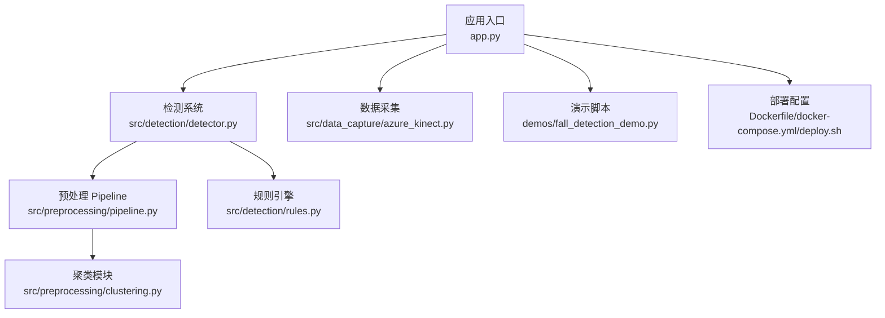
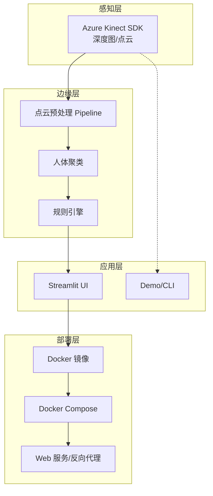
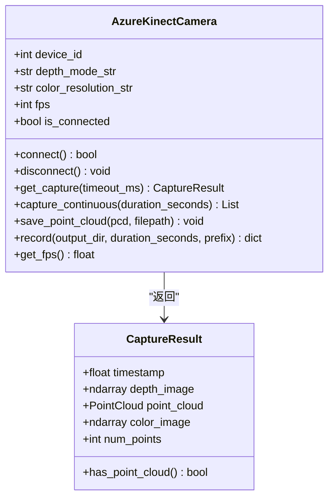
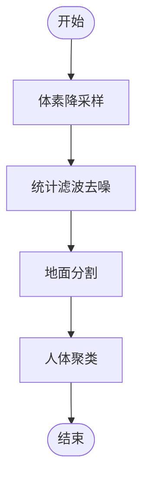
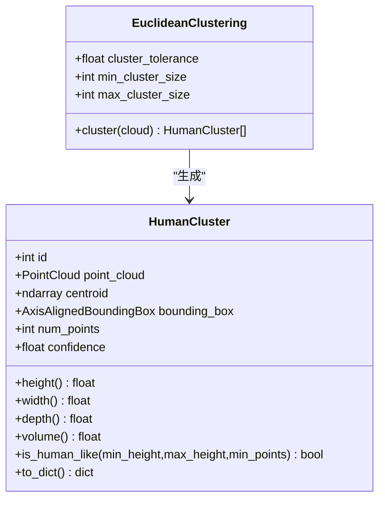
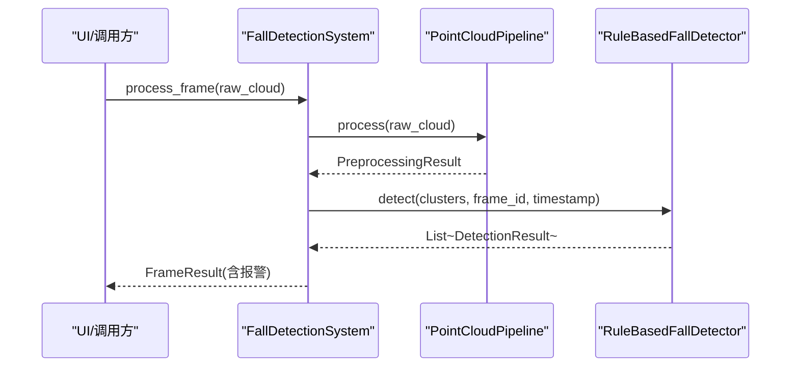
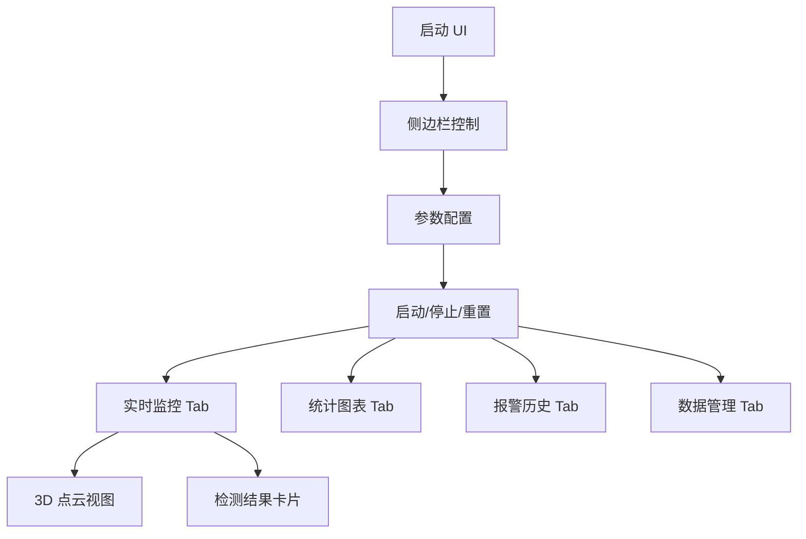
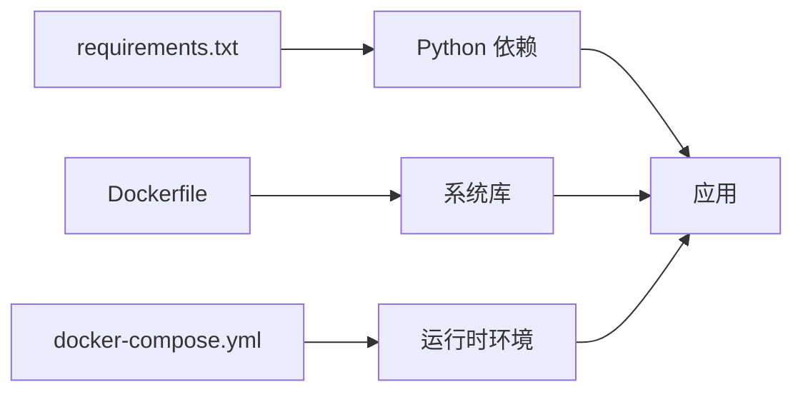

# 开发指南

<cite>
**本文档引用的文件**
- [README.md](file://README.md)
- [CODE_GENERATION_PLAN.md](file://CODE_GENERATION_PLAN.md)
- [ai-prompts-collection.md](file://ai-prompts-collection.md)
- [requirements.txt](file://requirements.txt)
- [app.py](file://app.py)
- [Dockerfile](file://Dockerfile)
- [docker-compose.yml](file://docker-compose.yml)
- [deploy.sh](file://deploy.sh)
- [src/data_capture/azure_kinect.py](file://src/data_capture/azure_kinect.py)
- [src/preprocessing/pipeline.py](file://src/preprocessing/pipeline.py)
- [src/preprocessing/clustering.py](file://src/preprocessing/clustering.py)
- [src/detection/detector.py](file://src/detection/detector.py)
- [src/detection/rules.py](file://src/detection/rules.py)
- [demos/fall_detection_demo.py](file://demos/fall_detection_demo.py)
</cite>

## 目录
1. [简介](#简介)
2. [项目结构](#项目结构)
3. [核心组件](#核心组件)
4. [架构总览](#架构总览)
5. [详细组件分析](#详细组件分析)
6. [依赖分析](#依赖分析)
7. [性能考虑](#性能考虑)
8. [故障排查指南](#故障排查指南)
9. [结论](#结论)
10. [附录](#附录)

## 简介
GuardianFall 是一个基于 3D 视觉的室内人体摔倒实时预警系统，采用“规则引擎 + 深度学习”的混合方法，结合点云预处理、人体聚类与摔倒检测规则，提供高精度、低延迟的摔倒检测能力。系统支持多种部署方式（一键部署、Docker Compose、手动运行），并通过 Streamlit 提供可视化界面。

## 项目结构
项目采用模块化组织，核心目录与文件如下：
- src/：核心源代码
  - data_capture/：数据采集模块（Azure Kinect SDK 封装）
  - preprocessing/：点云预处理模块（滤波、分割、聚类、Pipeline）
  - detection/：摔倒检测模块（检测器、规则引擎）
  - models/：AI 模型（预留）
  - utils/：工具函数（预留）
- demos/：演示与示例
- docs/：文档
- 配置与部署：requirements.txt、Dockerfile、docker-compose.yml、deploy.sh、nginx.conf、start.sh、monitor.sh、fall-detection.service

**图表来源**
- [app.py:1-662](file://app.py#L1-L662)
- [src/detection/detector.py:1-373](file://src/detection/detector.py#L1-L373)
- [src/preprocessing/pipeline.py:1-337](file://src/preprocessing/pipeline.py#L1-L337)
- [src/preprocessing/clustering.py:1-495](file://src/preprocessing/clustering.py#L1-L495)
- [src/detection/rules.py:1-526](file://src/detection/rules.py#L1-L526)
- [src/data_capture/azure_kinect.py:1-532](file://src/data_capture/azure_kinect.py#L1-L532)
- [demos/fall_detection_demo.py:1-373](file://demos/fall_detection_demo.py#L1-L373)
- [Dockerfile:1-50](file://Dockerfile#L1-L50)
- [docker-compose.yml:1-149](file://docker-compose.yml#L1-L149)
- [deploy.sh:1-243](file://deploy.sh#L1-L243)

**章节来源**
- [README.md:100-148](file://README.md#L100-L148)
- [CODE_GENERATION_PLAN.md:44-102](file://CODE_GENERATION_PLAN.md#L44-L102)

## 核心组件
- 数据采集层：封装 Azure Kinect SDK，提供点云捕获、深度图转点云、录制与元数据管理。
- 预处理层：体素降采样、统计滤波、地面分割、人体聚类，形成统一 Pipeline。
- 检测层：基于规则的摔倒检测（高度骤降、速度、姿态、静止），并引入状态机与确认帧机制。
- 应用层：Streamlit 可视化界面，展示点云、检测结果、报警历史与统计图表；提供参数配置与数据管理。
- 部署层：Docker 镜像与 Compose 编排，支持健康检查、资源限制与反向代理。

**章节来源**
- [src/data_capture/azure_kinect.py:47-460](file://src/data_capture/azure_kinect.py#L47-L460)
- [src/preprocessing/pipeline.py:65-268](file://src/preprocessing/pipeline.py#L65-L268)
- [src/preprocessing/clustering.py:99-495](file://src/preprocessing/clustering.py#L99-L495)
- [src/detection/detector.py:75-283](file://src/detection/detector.py#L75-L283)
- [src/detection/rules.py:226-446](file://src/detection/rules.py#L226-L446)
- [app.py:105-662](file://app.py#L105-L662)

## 架构总览
系统采用分层架构，数据从感知层进入，经边缘层处理，再由应用层呈现与交互，并通过部署层实现容器化与运维。

**图表来源**
- [src/data_capture/azure_kinect.py:22-460](file://src/data_capture/azure_kinect.py#L22-L460)
- [src/preprocessing/pipeline.py:65-268](file://src/preprocessing/pipeline.py#L65-L268)
- [src/detection/rules.py:226-446](file://src/detection/rules.py#L226-L446)
- [app.py:105-662](file://app.py#L105-L662)
- [Dockerfile:1-50](file://Dockerfile#L1-L50)
- [docker-compose.yml:1-149](file://docker-compose.yml#L1-L149)

## 详细组件分析

### 数据采集模块（Azure Kinect）
- 功能：连接设备、捕获深度图、生成点云、录制序列、保存元数据。
- 关键点：支持多种深度模式与彩色分辨率；提供上下文管理器；错误处理与日志记录。
- 依赖：pyk4a（可选，硬件到货后安装）。

**图表来源**
- [src/data_capture/azure_kinect.py:32-460](file://src/data_capture/azure_kinect.py#L32-L460)

**章节来源**
- [src/data_capture/azure_kinect.py:47-460](file://src/data_capture/azure_kinect.py#L47-L460)

### 预处理 Pipeline
- 功能：体素降采样、统计滤波、地面分割、人体聚类；提供批量处理与实时优化。
- 关键点：模块化步骤、结果数据结构、性能统计、工厂函数创建。

**图表来源**
- [src/preprocessing/pipeline.py:98-160](file://src/preprocessing/pipeline.py#L98-L160)

**章节来源**
- [src/preprocessing/pipeline.py:65-268](file://src/preprocessing/pipeline.py#L65-L268)

### 人体聚类模块
- 功能：欧式聚类、DBSCAN 聚类、多视角融合；提供人体簇数据结构与可视化。
- 关键点：置信度计算、宽高比与高度约束、工厂函数创建聚类器。

**图表来源**
- [src/preprocessing/clustering.py:15-181](file://src/preprocessing/clustering.py#L15-L181)

**章节来源**
- [src/preprocessing/clustering.py:99-495](file://src/preprocessing/clustering.py#L99-L495)

### 摔倒检测系统与规则引擎
- 功能：整合预处理与检测，基于规则的状态机检测；提供报警回调与统计。
- 关键点：PersonTracker 状态机、DetectionResult 报警级别、确认帧机制。

**图表来源**
- [src/detection/detector.py:138-227](file://src/detection/detector.py#L138-L227)
- [src/preprocessing/pipeline.py:98-160](file://src/preprocessing/pipeline.py#L98-L160)
- [src/detection/rules.py:266-337](file://src/detection/rules.py#L266-L337)

**章节来源**
- [src/detection/detector.py:75-283](file://src/detection/detector.py#L75-L283)
- [src/detection/rules.py:226-446](file://src/detection/rules.py#L226-L446)

### Streamlit 可视化界面
- 功能：实时点云显示、检测结果可视化、报警历史、统计图表、参数配置、数据管理。
- 关键点：Session State 管理、配置持久化、模拟数据与真实相机切换。

**图表来源**
- [app.py:210-662](file://app.py#L210-L662)

**章节来源**
- [app.py:105-662](file://app.py#L105-L662)

### 演示与测试
- 功能：模拟数据演示、真实相机演示、录制数据集。
- 关键点：参数解析、生成器模式、统计输出、可视化窗口。

**章节来源**
- [demos/fall_detection_demo.py:1-373](file://demos/fall_detection_demo.py#L1-L373)

## 依赖分析
- Python 依赖：numpy、scipy、open3d、torch、matplotlib、opencv-python、streamlit、plotly、pandas、tqdm、pyyaml、loguru、pytest、pytest-cov 等。
- Docker 依赖：系统库（libgl1-mesa-glx、ffmpeg 等）与 Python 依赖安装。
- 运行时环境：Streamlit 服务器端口 8501，Redis 缓存，可选 Nginx 反向代理。

**图表来源**
- [requirements.txt:1-34](file://requirements.txt#L1-L34)
- [Dockerfile:17-33](file://Dockerfile#L17-L33)
- [docker-compose.yml:19-64](file://docker-compose.yml#L19-L64)

**章节来源**
- [requirements.txt:1-34](file://requirements.txt#L1-L34)
- [Dockerfile:1-50](file://Dockerfile#L1-L50)
- [docker-compose.yml:1-149](file://docker-compose.yml#L1-L149)

## 性能考虑
- 实时性目标：单帧处理时间 < 100ms，目标 FPS > 30。
- 优化方向：
  - 算法层面：降采样、滤波参数调优、聚类阈值优化。
  - 工程层面：批处理、流水线并行、异步处理、GPU 加速（如可用）。
  - 部署层面：容器资源限制、健康检查、日志轮转、反向代理。
- 当前性能指标：处理速度 > 20 FPS，单帧耗时 < 100ms，内存占用 < 2GB。

**章节来源**
- [README.md:201-218](file://README.md#L201-L218)
- [src/preprocessing/pipeline.py:199-248](file://src/preprocessing/pipeline.py#L199-L248)
- [src/detection/detector.py:261-272](file://src/detection/detector.py#L261-L272)

## 故障排查指南
- 相机连接问题（Azure Kinect）：
  - 检查 USB 3.0 线缆、驱动安装、设备占用。
  - 使用测试脚本验证 pyk4a 安装与设备连通性。
- Docker 部署问题：
  - 使用 deploy.sh 完整部署，检查服务状态与健康检查。
  - 查看容器日志，确认端口映射与网络配置。
- Streamlit UI 无法访问：
  - 确认端口 8501 可用，防火墙放行，容器健康状态正常。
- 性能异常：
  - 调整预处理参数（体素大小、滤波标准差、聚类阈值）。
  - 检查 CPU/内存资源限制，必要时增加资源配额。

**章节来源**
- [src/data_capture/azure_kinect.py:152-191](file://src/data_capture/azure_kinect.py#L152-L191)
- [deploy.sh:84-102](file://deploy.sh#L84-L102)
- [docker-compose.yml:51-57](file://docker-compose.yml#L51-L57)

## 结论
本指南提供了从开发环境搭建、代码规范、测试策略到调试技巧的完整路径，明确了项目的代码生成计划、AI 提示收集与依赖管理策略，并给出了新功能开发流程、代码审查标准与持续集成配置建议。通过模块化设计与容器化部署，系统具备良好的可扩展性与可维护性，适合在生产环境中长期运行与迭代。

## 附录

### 开发环境搭建
- Python 环境：使用 Python 3.10+，创建虚拟环境并安装依赖。
- 可选硬件：Azure Kinect DK（pyk4a），安装后方可使用真实相机模式。
- 运行方式：一键部署、Docker Compose、手动运行、命令行 Demo。

**章节来源**
- [README.md:100-148](file://README.md#L100-L148)
- [requirements.txt:1-34](file://requirements.txt#L1-L34)

### 代码规范与测试策略
- 代码规范：遵循 PEP8，模块化设计，清晰的 docstring 与日志记录。
- 测试策略：pytest 单元测试、覆盖率要求 ≥80%，Mock 外部依赖与耗时操作。
- CI/CD 建议：在 CI 中执行 pytest、覆盖率检查与 Docker 构建。

**章节来源**
- [CODE_GENERATION_PLAN.md:505-570](file://CODE_GENERATION_PLAN.md#L505-L570)
- [README.md:285-301](file://README.md#L285-L301)

### 新功能开发流程
- 需求评审：参考 AI 提示模板，明确功能边界与验收标准。
- 设计与实现：遵循模块化与可扩展性原则，提供配置与日志。
- 测试与验证：单元测试 + 集成测试，性能回归测试。
- 文档与发布：更新 README 与部署脚本，发布版本与变更日志。

**章节来源**
- [ai-prompts-collection.md:196-400](file://ai-prompts-collection.md#L196-L400)
- [CODE_GENERATION_PLAN.md:574-595](file://CODE_GENERATION_PLAN.md#L574-L595)

### 依赖管理策略
- 明确核心依赖与可选依赖（如 pyk4a），在 requirements.txt 与 Dockerfile 中统一管理。
- 使用容器化隔离环境，避免主机污染。
- 定期更新依赖版本，关注安全补丁与兼容性。

**章节来源**
- [requirements.txt:1-34](file://requirements.txt#L1-L34)
- [Dockerfile:17-33](file://Dockerfile#L17-L33)

### 性能优化与并发处理
- 算法优化：合理设置降采样与滤波参数，减少无效计算。
- 工程优化：流水线并行、批处理、异步处理，避免阻塞。
- 并发处理：多线程/多进程（谨慎使用），注意 GIL 与共享状态。
- 内存管理：及时释放点云对象，避免内存泄漏。

**章节来源**
- [src/preprocessing/pipeline.py:199-248](file://src/preprocessing/pipeline.py#L199-L248)
- [src/detection/detector.py:261-272](file://src/detection/detector.py#L261-L272)

### 扩展点与插件开发
- 插件化检测器：通过工厂函数扩展新的检测方法（如 AI-based、hybrid）。
- 预处理模块：新增滤波或分割算法，保持 Pipeline 接口一致。
- 可视化扩展：在 UI 中增加新的图表与交互控件。

**章节来源**
- [src/detection/rules.py:425-446](file://src/detection/rules.py#L425-L446)
- [src/preprocessing/pipeline.py:251-268](file://src/preprocessing/pipeline.py#L251-L268)
- [app.py:210-662](file://app.py#L210-L662)

### 开发工具与 IDE 设置
- 推荐工具：VS Code（Python 扩展、Pylance、pytest 扩展）。
- 调试环境：在 VS Code 中配置 launch.json，支持断点与远程调试。
- 代码格式化：使用 black/autoflake 等工具，统一风格。
- Git 工作流：Fork + Feature 分支 + Pull Request + 代码审查。

**章节来源**
- [README.md:285-301](file://README.md#L285-L301)