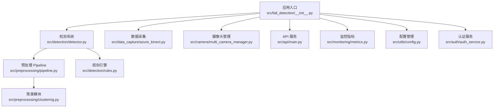
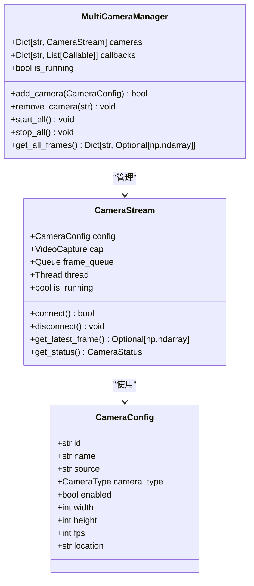
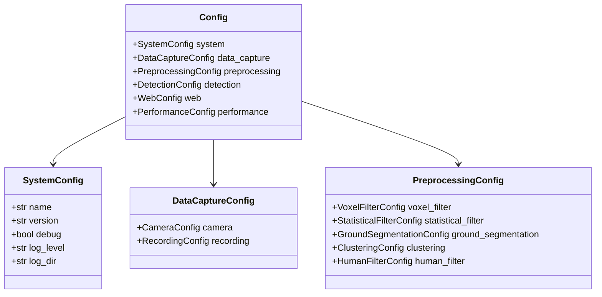
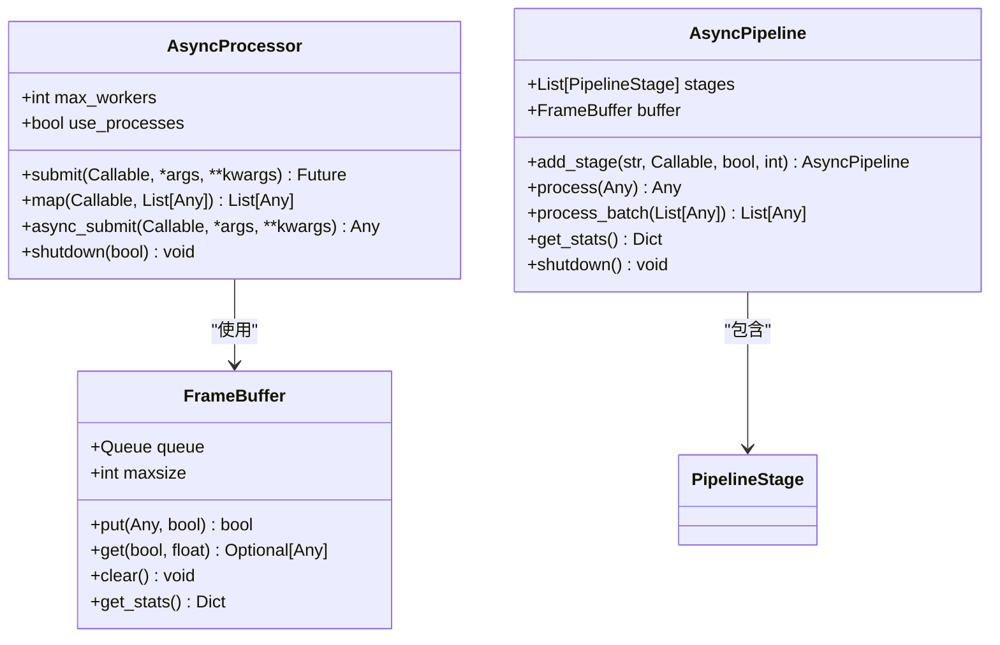
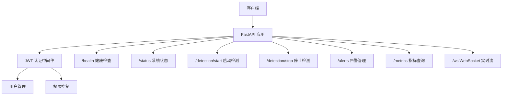

# 开发指南

<cite>
**本文档引用的文件**
- [pyproject.toml](file://pyproject.toml)
- [requirements.txt](file://requirements.txt)
- [pytest.ini](file://pytest.ini)
- [Dockerfile](file://Dockerfile)
- [Dockerfile.api](file://Dockerfile.api)
- [src/fall_detection/__init__.py](file://src/fall_detection/__init__.py)
- [src/api/main.py](file://src/api/main.py)
- [src/utils/async_processor.py](file://src/utils/async_processor.py)
- [src/preprocessing/pipeline.py](file://src/preprocessing/pipeline.py)
- [src/detection/detector.py](file://src/detection/detector.py)
- [src/camera/multi_camera_manager.py](file://src/camera/multi_camera_manager.py)
- [src/monitoring/metrics.py](file://src/monitoring/metrics.py)
- [src/utils/config.py](file://src/utils/config.py)
- [src/auth/auth_service.py](file://src/auth/auth_service.py)
- [tests/conftest.py](file://tests/conftest.py)
- [tests/test_detection.py](file://tests/test_detection.py)
- [tests/test_preprocessing.py](file://tests/test_preprocessing.py)
</cite>

## 更新摘要
**所做更改**
- 更新项目结构章节以反映新的 src/ 包结构
- 新增现代 Python 打包（pyproject.toml）章节
- 增强测试策略章节，包含类型注解和异步编程实践
- 添加配置管理章节，介绍数据类配置系统
- 更新异步处理和并发编程章节
- 新增监控和指标收集章节
- 更新依赖管理章节，包含新的打包配置

## 目录
1. [简介](#简介)
2. [项目结构](#项目结构)
3. [核心组件](#核心组件)
4. [架构总览](#架构总览)
5. [详细组件分析](#详细组件分析)
6. [现代 Python 打包与依赖管理](#现代-python-打包与依赖管理)
7. [测试策略与质量保证](#测试策略与质量保证)
8. [配置管理](#配置管理)
9. [异步处理与并发编程](#异步处理与并发编程)
10. [监控与指标收集](#监控与指标收集)
11. [容器化部署](#容器化部署)
12. [故障排查指南](#故障排查指南)
13. [结论](#结论)
14. [附录](#附录)

## 简介
GuardianFall 是一个基于 3D 视觉的室内人体摔倒实时预警系统，采用"规则引擎 + 深度学习"的混合方法，结合点云预处理、人体聚类与摔倒检测规则，提供高精度、低延迟的摔倒检测能力。系统支持多种部署方式（一键部署、Docker Compose、手动运行），并通过 Streamlit 提供可视化界面。

## 项目结构
项目采用现代化的 src/ 包结构组织，核心目录与文件如下：
- src/：核心源代码包
  - fall_detection/：主包，包含系统核心功能
  - api/：FastAPI 服务接口
  - auth/：用户认证与授权
  - camera/：多摄像头管理
  - data_capture/：数据采集模块（Azure Kinect SDK 封装）
  - detection/：摔倒检测模块
  - monitoring/：监控与告警
  - preprocessing/：点云预处理模块
  - utils/：工具函数（缓存、异步处理、配置、错误处理）
  - web/：Web UI 组件
- tests/：单元测试与集成测试
- 配置文件：pyproject.toml（现代打包）、pytest.ini、config.yaml
- 部署文件：Dockerfile、Dockerfile.api、docker-compose.yml



**图表来源**
- [src/fall_detection/__init__.py:12-22](file://src/fall_detection/__init__.py#L12-L22)
- [src/detection/detector.py:75-283](file://src/detection/detector.py#L75-L283)
- [src/preprocessing/pipeline.py:65-268](file://src/preprocessing/pipeline.py#L65-L268)
- [src/camera/multi_camera_manager.py:164-284](file://src/camera/multi_camera_manager.py#L164-L284)
- [src/api/main.py:29-68](file://src/api/main.py#L29-L68)
- [src/monitoring/metrics.py:18-144](file://src/monitoring/metrics.py#L18-L144)
- [src/utils/config.py:135-328](file://src/utils/config.py#L135-L328)
- [src/auth/auth_service.py:35-244](file://src/auth/auth_service.py#L35-L244)

**章节来源**
- [src/fall_detection/__init__.py:1-23](file://src/fall_detection/__init__.py#L1-L23)
- [pyproject.toml:81-83](file://pyproject.toml#L81-L83)

## 核心组件
- **数据采集层**：封装 Azure Kinect SDK，提供点云捕获、深度图转点云、录制与元数据管理。
- **预处理层**：体素降采样、统计滤波、地面分割、人体聚类，形成统一 Pipeline。
- **检测层**：基于规则的摔倒检测（高度骤降、速度、姿态、静止），并引入状态机与确认帧机制。
- **摄像头管理**：支持多摄像头源（USB/IP Camera/RTSP），提供并发帧捕获与管理。
- **认证服务**：JWT Token 生成与验证，用户注册与登录管理。
- **监控系统**：Prometheus 指标采集，系统状态监控与告警。
- **异步处理**：线程池、进程池、异步任务管理，支持并发处理。
- **配置管理**：基于数据类的配置系统，支持 YAML 文件和环境变量覆盖。
- **API 服务**：FastAPI 服务，提供 RESTful 接口和 WebSocket 实时流。
- **测试框架**：完整的单元测试框架，支持类型注解和异步测试。

**章节来源**
- [src/camera/multi_camera_manager.py:164-284](file://src/camera/multi_camera_manager.py#L164-L284)
- [src/auth/auth_service.py:35-244](file://src/auth/auth_service.py#L35-L244)
- [src/monitoring/metrics.py:18-144](file://src/monitoring/metrics.py#L18-L144)
- [src/utils/async_processor.py:30-465](file://src/utils/async_processor.py#L30-L465)
- [src/utils/config.py:135-328](file://src/utils/config.py#L135-L328)
- [src/api/main.py:29-265](file://src/api/main.py#L29-L265)

## 架构总览
系统采用分层架构，数据从感知层进入，经边缘层处理，再由应用层呈现与交互，并通过部署层实现容器化与运维。

```mermaid
graph TB
subgraph "感知层"
K["Azure Kinect SDK<br/>深度图/点云"]
CAM["多摄像头管理<br/>USB/RTSP/IP Camera"]
end
subgraph "边缘层"
P["点云预处理 Pipeline"]
T["人体聚类"]
R["规则引擎"]
END
subgraph "应用层"
S["Streamlit UI"]
M["Demo/CLI"]
A["FastAPI 服务"]
AUTH["JWT 认证"]
MON["监控指标"]
end
subgraph "工具层"
C["缓存机制"]
AP["异步处理"]
CFG["配置管理"]
EH["错误处理"]
end
subgraph "测试层"
TEST["单元测试框架"]
end
subgraph "部署层"
D["Docker 镜像"]
DC["Docker Compose"]
W["Web 服务/反向代理"]
end
K --> P --> T --> R --> S
CAM --> P
AUTH --> A
MON --> A
CFG --> P
TEST --> P
TEST --> R
TEST --> C
```

**图表来源**
- [src/camera/multi_camera_manager.py:17-23](file://src/camera/multi_camera_manager.py#L17-L23)
- [src/preprocessing/pipeline.py:65-268](file://src/preprocessing/pipeline.py#L65-L268)
- [src/detection/detector.py:75-283](file://src/detection/detector.py#L75-L283)
- [src/auth/auth_service.py:25-30](file://src/auth/auth_service.py#L25-L30)
- [src/monitoring/metrics.py:18-47](file://src/monitoring/metrics.py#L18-L47)
- [src/utils/config.py:135-143](file://src/utils/config.py#L135-L143)
- [src/api/main.py:70-87](file://src/api/main.py#L70-L87)

## 详细组件分析

### 多摄像头管理器
- **功能**：支持同时管理多个摄像头源（USB/IP Camera/RTSP），提供并发帧捕获与管理。
- **关键特性**：线程安全的帧队列、状态监控、错误处理、动态配置更新。
- **类型注解**：完整的类型提示，支持枚举类型 CameraType 和数据类配置。



**图表来源**
- [src/camera/multi_camera_manager.py:164-284](file://src/camera/multi_camera_manager.py#L164-L284)
- [src/camera/multi_camera_manager.py:25-48](file://src/camera/multi_camera_manager.py#L25-L48)

**章节来源**
- [src/camera/multi_camera_manager.py:164-284](file://src/camera/multi_camera_manager.py#L164-L284)

### 配置管理系统
- **功能**：基于数据类的配置系统，支持 YAML 文件加载和环境变量覆盖。
- **关键特性**：类型安全的配置结构、懒加载缓存、环境变量优先级。
- **模块化设计**：系统配置、相机配置、预处理配置、检测配置等独立模块。



**图表来源**
- [src/utils/config.py:135-143](file://src/utils/config.py#L135-L143)
- [src/utils/config.py:15-143](file://src/utils/config.py#L15-L143)

**章节来源**
- [src/utils/config.py:135-328](file://src/utils/config.py#L135-L328)

### 异步处理模块
- **功能**：提供并发处理、线程池、异步任务管理等功能。
- **关键特性**：线程池与进程池支持、帧缓冲区、流水线处理、统计监控。
- **应用场景**：多摄像头并发处理、批量数据处理、异步任务调度。



**图表来源**
- [src/utils/async_processor.py:30-344](file://src/utils/async_processor.py#L30-L344)

**章节来源**
- [src/utils/async_processor.py:30-465](file://src/utils/async_processor.py#L30-L465)

### FastAPI 服务接口
- **功能**：提供 RESTful API 和 WebSocket 实时流，支持健康检查、状态查询、检测控制。
- **关键特性**：Pydantic 数据模型、WebSocket 连接管理、异步处理、CORS 支持。
- **认证集成**：JWT Token 验证，用户权限管理。



**图表来源**
- [src/api/main.py:70-265](file://src/api/main.py#L70-L265)

**章节来源**
- [src/api/main.py:29-265](file://src/api/main.py#L29-L265)

## 现代 Python 打包与依赖管理

### pyproject.toml 配置
项目采用现代 Python 打包标准，使用 pyproject.toml 进行配置：

- **构建系统**：setuptools + wheel
- **项目元数据**：名称、版本、描述、作者、许可证
- **依赖管理**：核心依赖、可选开发依赖、文档依赖、部署依赖
- **工具配置**：Black 格式化、Ruff Lint、MyPy 类型检查、PyTest 配置

### 依赖分类
- **核心依赖**：streamlit、fastapi、uvicorn、pydantic、opencv-python、numpy、open3d
- **开发依赖**：pytest、pytest-cov、pytest-asyncio、black、ruff、mypy
- **文档依赖**：mkdocs、mkdocs-material
- **部署依赖**：gunicorn、supervisor

### 包发现配置
使用 setuptools.packages.find 配置自动发现包：
- where = ["src"]：在 src 目录下查找包
- include = ["fall_detection*"]：包含 fall_detection 前缀的所有包

**章节来源**
- [pyproject.toml:1-106](file://pyproject.toml#L1-L106)

### 传统 requirements.txt
虽然使用了现代打包方式，但仍保留 requirements.txt 用于：
- Docker 部署时的依赖安装
- 兼容性考虑
- 开发环境的快速安装

**章节来源**
- [requirements.txt:1-93](file://requirements.txt#L1-L93)

## 测试策略与质量保证

### 测试框架概述
项目采用完整的单元测试框架，基于 pytest，提供：
- **类型注解**：完整的类型提示，支持 MyPy 静态类型检查
- **异步测试**：pytest-asyncio 支持异步函数测试
- **测试固件**：丰富的 fixture，包括示例点云、模拟人体簇、配置对象
- **覆盖率报告**：pytest-cov 生成 HTML 覆盖率报告

### 测试配置
- **测试路径**：tests 目录
- **测试文件模式**：test_*.py
- **测试类命名**：Test*
- **测试函数命名**：test_*
- **标记系统**：slow、integration、unit、hardware

### 类型注解实践
- **函数参数**：完整的类型注解
- **返回值**：明确的返回类型
- **数据类**：使用 dataclass 装饰器
- **泛型**：支持 List、Dict、Optional 等泛型类型

### 测试覆盖范围
- **预处理模块**：滤波、分割、聚类、Pipeline 测试
- **检测模块**：人体追踪器、规则检测器、检测结果测试
- **工具模块**：缓存、异步处理、配置管理测试
- **API 模块**：认证、监控、告警测试

**章节来源**
- [pytest.ini:1-37](file://pytest.ini#L1-L37)
- [tests/conftest.py:18-88](file://tests/conftest.py#L18-L88)
- [tests/test_detection.py:1-225](file://tests/test_detection.py#L1-L225)
- [tests/test_preprocessing.py:1-187](file://tests/test_preprocessing.py#L1-L187)

## 配置管理
系统采用基于数据类的配置管理，提供类型安全的配置访问：

### 配置层次结构
- **SystemConfig**：系统基本信息、日志配置
- **DataCaptureConfig**：数据采集配置、相机配置、录制配置
- **PreprocessingConfig**：预处理各阶段配置
- **DetectionConfig**：检测规则配置
- **WebConfig**：Web 界面配置
- **PerformanceConfig**：性能相关配置

### 配置加载机制
- **文件加载**：支持 config.yaml 和 config.yml
- **环境变量覆盖**：支持环境变量优先级
- **默认值**：每个配置项都有合理的默认值
- **懒加载缓存**：使用 lru_cache 优化性能

### 配置访问模式
- **全局访问**：get_config() 获取全局配置实例
- **模块化访问**：get_system_config()、get_detection_config() 等
- **便捷函数**：各种配置的便捷访问函数

**章节来源**
- [src/utils/config.py:135-328](file://src/utils/config.py#L135-L328)

## 异步处理与并发编程
系统广泛使用异步编程模式，提高并发处理能力和响应性：

### 异步处理架构
- **AsyncProcessor**：统一的异步处理器，支持线程池和进程池
- **FrameBuffer**：线程安全的帧缓冲区，支持丢弃策略
- **AsyncPipeline**：异步流水线处理，支持多阶段并发
- **并发模式**：同步和异步两种处理模式可选

### 多摄像头并发
- **线程安全**：每个摄像头使用独立线程
- **帧队列**：使用 Queue 实现线程间通信
- **状态监控**：实时监控摄像头状态和性能指标
- **动态管理**：支持摄像头的动态添加和移除

### 性能优化
- **资源池**：线程池和进程池复用
- **内存管理**：及时释放不需要的帧数据
- **统计监控**：实时监控处理性能和资源使用
- **错误处理**：完善的异常处理和恢复机制

**章节来源**
- [src/utils/async_processor.py:30-465](file://src/utils/async_processor.py#L30-L465)
- [src/camera/multi_camera_manager.py:164-284](file://src/camera/multi_camera_manager.py#L164-L284)

## 监控与指标收集
系统集成 Prometheus 指标收集，提供全面的系统监控：

### 指标类型
- **性能指标**：FPS、处理时间、内存使用、CPU 使用率
- **检测统计**：检测总数、告警总数、最后检测时间
- **状态指标**：系统状态、摄像头状态、活跃用户数
- **用户行为**：登录尝试、用户活跃度

### 指标服务器
- **Prometheus 集成**：使用 prometheus_client 库
- **HTTP 服务器**：内置指标 HTTP 服务器
- **端口配置**：可配置的指标端口（默认 9090）
- **后台监控**：独立线程监控系统资源

### 告警系统
- **告警级别**：CRITICAL、ERROR、WARNING、INFO
- **回调机制**：支持告警回调函数
- **通知渠道**：邮件、微信等多种通知方式
- **历史记录**：完整的告警历史记录

**章节来源**
- [src/monitoring/metrics.py:18-144](file://src/monitoring/metrics.py#L18-L144)

## 容器化部署
系统提供完整的容器化部署方案：

### 多阶段 Dockerfile
- **Dockerfile**：Streamlit 前端应用
- **Dockerfile.api**：FastAPI 后端服务
- **分离部署**：前端和后端分别容器化
- **独立配置**：不同的环境变量和端口配置

### 系统依赖
- **基础镜像**：python:3.10-slim
- **系统库**：OpenCV、FFmpeg、USB 设备支持
- **环境变量**：配置 Streamlit 和 API 服务
- **健康检查**：自动健康检查和重启机制

### 部署配置
- **端口映射**：Streamlit 8501，API 8000
- **数据卷**：配置文件、日志、数据存储
- **网络配置**：容器间通信和外部访问
- **资源限制**：CPU 和内存资源限制

**章节来源**
- [Dockerfile:1-50](file://Dockerfile#L1-L50)
- [Dockerfile.api:1-50](file://Dockerfile.api#L1-L50)

## 故障排查指南
- **相机连接问题**：检查 USB 3.0 线缆、驱动安装、设备占用
- **Docker 部署问题**：使用 docker-compose 完整部署，检查服务状态
- **Streamlit UI 无法访问**：确认端口 8501 可用，防火墙放行
- **FastAPI 服务问题**：检查端口 8000 可用性，验证依赖安装
- **测试执行问题**：确保 pytest 和 pytest-cov 正确安装
- **异步处理问题**：检查线程池配置和资源限制
- **配置加载问题**：验证 config.yaml 格式和环境变量设置

**章节来源**
- [src/camera/multi_camera_manager.py:68-98](file://src/camera/multi_camera_manager.py#L68-L98)
- [Dockerfile:44-46](file://Dockerfile#L44-L46)
- [pytest.ini:20-26](file://pytest.ini#L20-L26)

## 结论
本指南提供了从开发环境搭建、代码规范、测试策略到调试技巧的完整路径，反映了项目的现代化开发实践。新的 src/ 包结构、pyproject.toml 打包配置、类型注解、异步编程模式、配置管理系统、监控指标收集等特性，为项目的可维护性和可扩展性奠定了坚实基础。通过模块化设计与容器化部署，系统具备良好的生产环境适应性，适合长期发展和迭代。

## 附录

### 开发环境搭建
- **Python 环境**：使用 Python 3.8+，推荐 3.10+
- **现代打包**：使用 pip 安装 pyproject.toml 中的依赖
- **开发工具**：Black、Ruff、MyPy、PyTest
- **容器化**：Docker 和 Docker Compose

**章节来源**
- [pyproject.toml:14-50](file://pyproject.toml#L14-L50)
- [requirements.txt:1-93](file://requirements.txt#L1-L93)

### 代码规范与测试策略
- **类型注解**：完整的类型提示，支持 MyPy 检查
- **异步编程**：使用 asyncio 和并发模式
- **测试策略**：pytest 单元测试、覆盖率要求 ≥80%
- **CI/CD**：在 CI 中执行测试、覆盖率检查与 Docker 构建

**章节来源**
- [pyproject.toml:95-105](file://pyproject.toml#L95-L105)
- [pytest.ini:20-26](file://pytest.ini#L20-L26)

### 新功能开发流程
- **需求评审**：明确功能边界与验收标准
- **设计实现**：遵循模块化与可扩展性原则
- **类型检查**：使用 MyPy 进行静态类型检查
- **测试验证**：单元测试 + 集成测试，异步测试
- **文档更新**：更新 README 与部署脚本

**章节来源**
- [src/utils/config.py:273-276](file://src/utils/config.py#L273-L276)
- [src/utils/async_processor.py:389-396](file://src/utils/async_processor.py#L389-L396)

### 依赖管理策略
- **现代打包**：使用 pyproject.toml 管理核心依赖
- **可选依赖**：开发、文档、部署依赖分类管理
- **容器化隔离**：Docker 镜像中的依赖管理
- **版本控制**：锁定关键依赖版本

**章节来源**
- [pyproject.toml:35-70](file://pyproject.toml#L35-L70)
- [requirements.txt:1-93](file://requirements.txt#L1-L93)

### 性能优化与并发处理
- **异步处理**：线程池、进程池、异步任务管理
- **并发模式**：多摄像头并发处理、批量数据处理
- **资源管理**：内存优化、线程安全、错误处理
- **监控指标**：实时性能监控和告警

**章节来源**
- [src/utils/async_processor.py:30-465](file://src/utils/async_processor.py#L30-L465)
- [src/monitoring/metrics.py:18-144](file://src/monitoring/metrics.py#L18-L144)

### 扩展点与插件开发
- **插件化架构**：基于数据类的配置系统
- **模块化设计**：独立的功能模块和清晰的接口
- **监控扩展**：自定义指标和告警规则
- **认证扩展**：支持多种认证方式

**章节来源**
- [src/utils/config.py:135-328](file://src/utils/config.py#L135-L328)
- [src/monitoring/metrics.py:18-144](file://src/monitoring/metrics.py#L18-L144)

### 开发工具与 IDE 设置
- **编辑器配置**：VS Code、PyCharm 等主流 IDE
- **格式化工具**：Black 自动格式化
- **代码检查**：Ruff Lint、MyPy 类型检查
- **调试配置**：断点调试、远程调试支持

**章节来源**
- [pyproject.toml:85-99](file://pyproject.toml#L85-L99)

### 测试工具配置
- **pytest 配置**：完整的测试框架配置
- **类型检查**：MyPy 配置和使用
- **覆盖率工具**：pytest-cov 生成 HTML 报告
- **异步测试**：pytest-asyncio 支持

**章节来源**
- [pytest.ini:1-37](file://pytest.ini#L1-L37)
- [pyproject.toml:95-105](file://pyproject.toml#L95-L105)