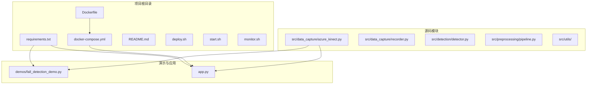
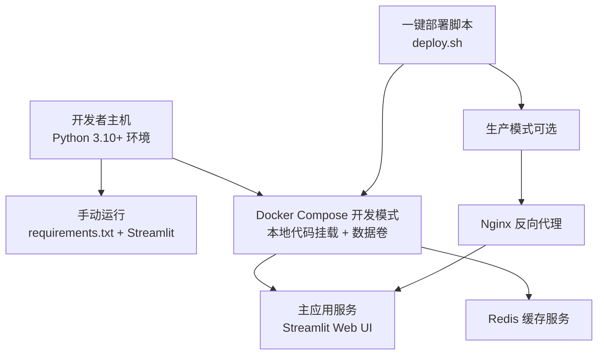
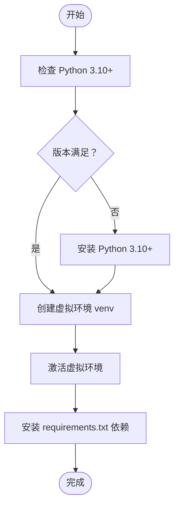
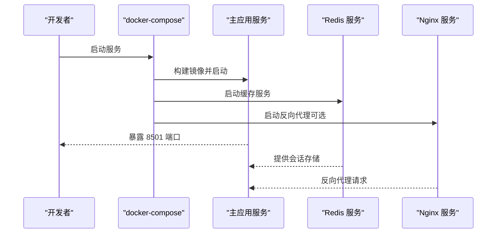
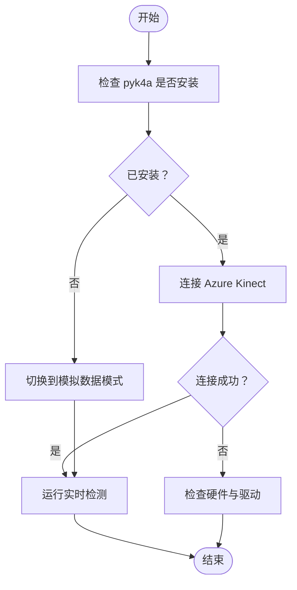
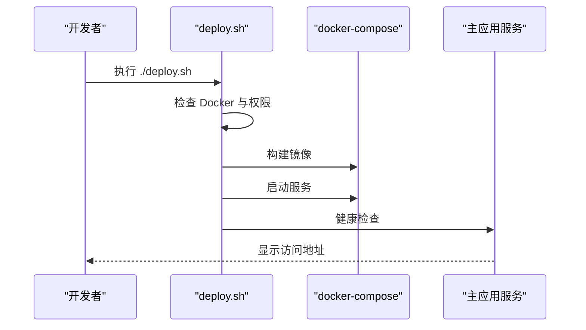
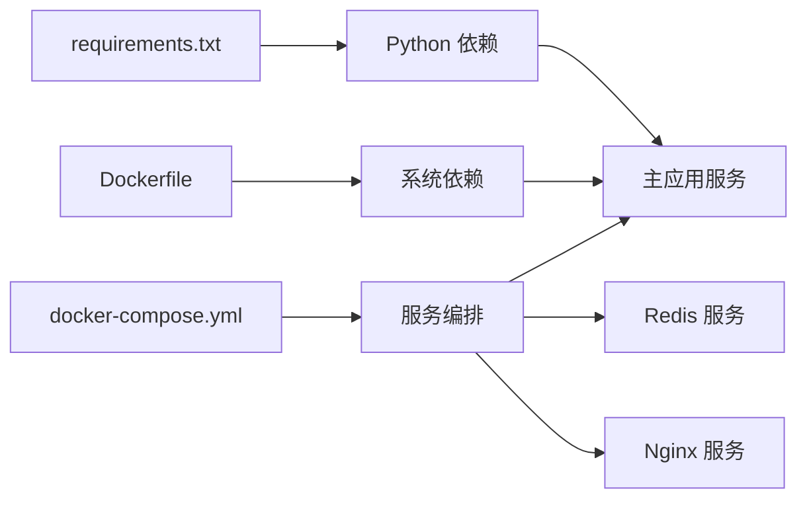
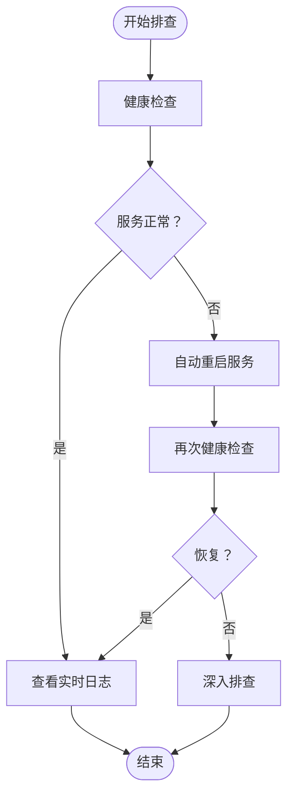

# 开发环境搭建

<cite>
**本文引用的文件**
- [requirements.txt](file://requirements.txt)
- [Dockerfile](file://Dockerfile)
- [docker-compose.yml](file://docker-compose.yml)
- [README.md](file://README.md)
- [src/data_capture/azure_kinect.py](file://src/data_capture/azure_kinect.py)
- [app.py](file://app.py)
- [demos/fall_detection_demo.py](file://demos/fall_detection_demo.py)
- [deploy.sh](file://deploy.sh)
- [start.sh](file://start.sh)
- [monitor.sh](file://monitor.sh)
</cite>

## 目录
1. [简介](#简介)
2. [项目结构](#项目结构)
3. [核心组件](#核心组件)
4. [架构概览](#架构概览)
5. [详细组件分析](#详细组件分析)
6. [依赖分析](#依赖分析)
7. [性能考虑](#性能考虑)
8. [故障排查指南](#故障排查指南)
9. [结论](#结论)
10. [附录](#附录)

## 简介
本指南面向开发者，提供GuardianFall（室内人体摔倒实时预警系统）的完整开发环境搭建方法，涵盖Python 3.10+环境配置、虚拟环境创建、依赖安装、Docker容器化开发环境、Azure Kinect SDK可选安装与硬件配置、常见环境问题排查以及IDE配置建议。内容基于仓库中的requirements.txt、Dockerfile、docker-compose.yml、README.md及各模块源码进行整理，确保读者能够快速、稳定地搭建并运行项目。

## 项目结构
项目采用分层模块化组织，核心目录与文件如下：
- 根目录：requirements.txt、Dockerfile、docker-compose.yml、README.md、deploy.sh、start.sh、monitor.sh
- 源码目录：src/ 下包含数据采集、检测、预处理、模型、工具等子模块
- 示例与演示：demos/ 下包含完整的Demo脚本
- 应用入口：app.py 提供Streamlit可视化界面

**图表来源**
- [requirements.txt](file://requirements.txt)
- [Dockerfile](file://Dockerfile)
- [docker-compose.yml](file://docker-compose.yml)
- [app.py](file://app.py)
- [demos/fall_detection_demo.py](file://demos/fall_detection_demo.py)
- [src/data_capture/azure_kinect.py](file://src/data_capture/azure_kinect.py)

**章节来源**
- [README.md:100-148](file://README.md#L100-L148)

## 核心组件
- Python 3.10+ 环境：项目明确要求Python 3.10及以上版本，Dockerfile使用python:3.10-slim作为基础镜像，确保容器化环境一致性。
- 依赖管理：requirements.txt集中声明了核心科学计算、点云处理、深度学习、可视化、UI/Demo、数据处理、配置与日志、测试等依赖及其最低版本要求。
- 容器化：Dockerfile定义了系统依赖（OpenGL、FFmpeg、USB开发库等）与Python依赖安装流程；docker-compose.yml定义了主应用、Redis缓存、Nginx反向代理的服务编排与资源限制。
- 数据采集：src/data_capture/azure_kinect.py封装Azure Kinect DK SDK，提供点云采集、深度图/彩色图处理、点云保存与录制等功能，并对pyk4a缺失提供友好提示。
- 可视化与演示：app.py提供Streamlit Web界面；demos/fall_detection_demo.py提供模拟数据与真实相机两种运行模式，便于开发与测试。

**章节来源**
- [requirements.txt:1-34](file://requirements.txt#L1-L34)
- [Dockerfile:1-50](file://Dockerfile#L1-L50)
- [docker-compose.yml:1-149](file://docker-compose.yml#L1-L149)
- [src/data_capture/azure_kinect.py:1-532](file://src/data_capture/azure_kinect.py#L1-L532)
- [app.py:1-662](file://app.py#L1-L662)
- [demos/fall_detection_demo.py:1-373](file://demos/fall_detection_demo.py#L1-L373)

## 架构概览
下图展示了开发环境的典型运行路径：本地开发（手动运行）、Docker Compose开发模式、Docker Compose生产模式（含Nginx）以及一键部署脚本。

**图表来源**
- [README.md:100-148](file://README.md#L100-L148)
- [Dockerfile:1-50](file://Dockerfile#L1-L50)
- [docker-compose.yml:1-149](file://docker-compose.yml#L1-L149)
- [deploy.sh:1-243](file://deploy.sh#L1-L243)

## 详细组件分析

### Python 3.10+ 环境配置与虚拟环境
- 环境要求：Python 3.10+，Dockerfile明确使用python:3.10-slim。
- 推荐做法：
  - 使用Python 3.10+版本创建虚拟环境，避免系统Python污染。
  - 在虚拟环境中安装requirements.txt中的依赖。
  - 使用start.sh脚本进行一键初始化（创建并激活虚拟环境、安装依赖、选择运行模式）。

**图表来源**
- [start.sh:1-58](file://start.sh#L1-L58)
- [requirements.txt:1-34](file://requirements.txt#L1-L34)

**章节来源**
- [start.sh:1-58](file://start.sh#L1-L58)
- [requirements.txt:1-34](file://requirements.txt#L1-L34)

### 依赖安装步骤与作用说明
- 核心科学计算：numpy、scipy（数值计算基础）
- 点云处理：open3d（点云数据结构与处理）
- 深度学习：torch、torchvision、torchaudio（AI推理与音频处理）
- 可视化：matplotlib、opencv-python（绘图与图像处理）
- UI与Demo：streamlit、plotly（Web界面与交互图表）
- 数据处理：pandas、tqdm（数据分析与进度条）
- 配置与日志：pyyaml、loguru（配置解析与日志）
- 测试：pytest、pytest-cov（单元测试与覆盖率）

建议在虚拟环境中逐项安装，确保版本满足requirements.txt中的最低版本要求。

**章节来源**
- [requirements.txt:1-34](file://requirements.txt#L1-L34)

### Docker容器化开发环境
- Dockerfile要点：
  - 基础镜像：python:3.10-slim
  - 系统依赖：OpenGL、FFmpeg、USB开发库等
  - 环境变量：Streamlit服务器端口、地址、headless模式等
  - 健康检查：对Streamlit健康端点进行探测
  - 启动命令：以Streamlit运行app.py
- docker-compose.yml要点：
  - 主应用服务：暴露8501端口，挂载本地代码与数据卷，设置资源限制
  - Redis服务：用于会话管理，持久化到本地卷
  - Nginx服务：可选反向代理，支持SSL挂载
  - 网络与日志：桥接网络与日志轮转配置

**图表来源**
- [Dockerfile:1-50](file://Dockerfile#L1-L50)
- [docker-compose.yml:1-149](file://docker-compose.yml#L1-L149)

**章节来源**
- [Dockerfile:1-50](file://Dockerfile#L1-L50)
- [docker-compose.yml:1-149](file://docker-compose.yml#L1-L149)

### Azure Kinect SDK可选安装与硬件配置
- 可选依赖：pyk4a（Azure Kinect SDK Python绑定），在src/data_capture/azure_kinect.py中通过try/except进行导入检测，若未安装则提供友好提示。
- 硬件要求与连接：
  - 使用USB 3.0线缆连接
  - 确保驱动程序已安装
  - 避免其他程序占用相机
- 运行模式：
  - 模拟数据：无需硬件，适合开发与测试
  - 真实相机：需要Azure Kinect，需安装pyk4a

**图表来源**
- [src/data_capture/azure_kinect.py:22-29](file://src/data_capture/azure_kinect.py#L22-L29)
- [src/data_capture/azure_kinect.py:152-184](file://src/data_capture/azure_kinect.py#L152-L184)
- [demos/fall_detection_demo.py:181-271](file://demos/fall_detection_demo.py#L181-L271)

**章节来源**
- [src/data_capture/azure_kinect.py:22-29](file://src/data_capture/azure_kinect.py#L22-L29)
- [src/data_capture/azure_kinect.py:152-184](file://src/data_capture/azure_kinect.py#L152-L184)
- [demos/fall_detection_demo.py:181-271](file://demos/fall_detection_demo.py#L181-L271)

### 一键部署与启动脚本
- deploy.sh：提供完整部署流程（检查Docker、停止现有服务、构建镜像、启动服务、健康检查、显示访问信息），支持update、start、stop、logs、status、cleanup等子命令。
- start.sh：本地开发向导，检查Python版本、创建并激活虚拟环境、安装依赖、选择运行模式（Web界面、命令行Demo、实时检测、数据录制）。
- monitor.sh：服务状态检查、资源使用监控、日志查看、统计信息展示与自动重启。

**图表来源**
- [deploy.sh:131-145](file://deploy.sh#L131-L145)
- [deploy.sh:84-102](file://deploy.sh#L84-L102)
- [docker-compose.yml:1-149](file://docker-compose.yml#L1-L149)

**章节来源**
- [deploy.sh:1-243](file://deploy.sh#L1-L243)
- [start.sh:1-58](file://start.sh#L1-L58)
- [monitor.sh:1-183](file://monitor.sh#L1-L183)

### IDE配置建议与调试环境设置
- 推荐IDE：VS Code或PyCharm
- Python解释器：指向虚拟环境中的Python可执行文件
- 调试配置：
  - Streamlit应用：以app.py为入口，设置服务器地址与端口参数
  - 命令行Demo：以demos/fall_detection_demo.py为入口，添加--mock或--camera参数
  - Docker开发：使用docker-compose开发模式，挂载本地代码实现热更新
- 日志与测试：
  - 使用loguru进行日志输出
  - 使用pytest进行单元测试与覆盖率统计

**章节来源**
- [app.py:16-31](file://app.py#L16-L31)
- [demos/fall_detection_demo.py:327-373](file://demos/fall_detection_demo.py#L327-L373)
- [requirements.txt:27-33](file://requirements.txt#L27-L33)

## 依赖分析
- 直接依赖：requirements.txt集中声明了项目所需的所有Python包及其最低版本。
- 间接依赖：Dockerfile安装系统依赖（OpenGL、FFmpeg、USB开发库等），确保Open3D与图形渲染正常工作。
- 服务依赖：docker-compose定义了主应用、Redis、Nginx之间的依赖关系与网络拓扑。

**图表来源**
- [requirements.txt:1-34](file://requirements.txt#L1-L34)
- [Dockerfile:17-27](file://Dockerfile#L17-L27)
- [docker-compose.yml:6-73](file://docker-compose.yml#L6-L73)

**章节来源**
- [requirements.txt:1-34](file://requirements.txt#L1-L34)
- [Dockerfile:17-27](file://Dockerfile#L17-L27)
- [docker-compose.yml:6-73](file://docker-compose.yml#L6-L73)

## 性能考虑
- 处理性能：README中给出系统性能指标（检测延迟<3秒、处理速度>20 FPS、单帧耗时<100ms、内存占用<2GB、CPU占用<50%），开发环境应尽量接近这些指标以保证演示效果。
- 资源限制：docker-compose为各服务设置了CPU与内存上限，避免资源争用导致性能波动。
- 可视化开销：Streamlit与Plotly在Web界面中进行3D点云可视化，建议在本地开发时适当降低点云密度或帧率以提升交互流畅度。

**章节来源**
- [README.md:201-218](file://README.md#L201-L218)
- [docker-compose.yml:42-49](file://docker-compose.yml#L42-L49)

## 故障排查指南
- CUDA兼容性：
  - 若使用PyTorch且需要GPU加速，需确保CUDA版本与PyTorch匹配。可在本地环境中通过torch.cuda.is_available()进行检测。
  - Docker环境下默认不包含CUDA，如需GPU推理，需自定义镜像或使用NVIDIA Container Toolkit。
- Open3D编译问题：
  - Dockerfile已安装OpenGL与FFmpeg等系统依赖，若在宿主机出现编译问题，需检查系统依赖是否齐全。
  - 若Open3D无法导入，可参考安装测试脚本中的依赖检测逻辑进行定位。
- Azure Kinect SDK问题：
  - pyk4a未安装：按照提示安装pyk4a；若硬件未到货，可使用模拟数据模式进行开发。
  - 相机连接失败：检查USB 3.0线缆、驱动程序、是否被其他程序占用。
- 健康检查与日志：
  - 使用deploy.sh的健康检查与monitor.sh的日志查看功能，快速定位服务异常。
  - docker-compose logs -f查看实时日志，结合monitor.sh的统计信息进行分析。

**图表来源**
- [deploy.sh:84-102](file://deploy.sh#L84-L102)
- [monitor.sh:127-146](file://monitor.sh#L127-L146)

**章节来源**
- [deploy.sh:84-102](file://deploy.sh#L84-L102)
- [monitor.sh:127-146](file://monitor.sh#L127-L146)
- [src/data_capture/azure_kinect.py:177-184](file://src/data_capture/azure_kinect.py#L177-L184)

## 结论
通过本指南，开发者可以基于Python 3.10+环境、虚拟环境与requirements.txt依赖清单快速搭建开发环境；利用Dockerfile与docker-compose.yml实现一致化的容器化开发与生产部署；在具备Azure Kinect硬件时可启用真实相机模式，在无硬件时使用模拟数据模式进行高效开发与测试。同时，借助deploy.sh、start.sh与monitor.sh等脚本，可实现一键部署、本地启动与持续监控，显著提升开发与运维效率。

## 附录
- 快速开始命令参考（来自README与脚本）：
  - 一键部署：sudo ./deploy.sh
  - Docker Compose：docker-compose up -d
  - 手动运行：python3 -m venv venv；source venv/bin/activate；pip install -r requirements.txt；streamlit run app.py
  - 命令行Demo：python demos/fall_detection_demo.py --mock 或 --camera

**章节来源**
- [README.md:100-148](file://README.md#L100-L148)
- [deploy.sh:131-145](file://deploy.sh#L131-L145)
- [start.sh:38-46](file://start.sh#L38-L46)