# 扩展开发与插件机制

<cite>
**本文档引用的文件**
- [app.py](file://app.py)
- [detector.py](file://src/detection/detector.py)
- [rules.py](file://src/detection/rules.py)
- [pipeline.py](file://src/preprocessing/pipeline.py)
- [clustering.py](file://src/preprocessing/clustering.py)
- [filtering.py](file://src/preprocessing/filtering.py)
- [segmentation.py](file://src/preprocessing/segmentation.py)
- [recorder.py](file://src/data_capture/recorder.py)
- [fall_detection_demo.py](file://demos/fall_detection_demo.py)
- [requirements.txt](file://requirements.txt)
- [README.md](file://README.md)
- [CODE_GENERATION_PLAN.md](file://CODE_GENERATION_PLAN.md)
</cite>

## 目录
1. [项目概述](#项目概述)
2. [插件架构设计](#插件架构设计)
3. [核心组件分析](#核心组件分析)
4. [扩展开发指南](#扩展开发指南)
5. [AI模型集成](#ai模型集成)
6. [检测算法扩展](#检测算法扩展)
7. [预处理模块扩展](#预处理模块扩展)
8. [配置系统扩展](#配置系统扩展)
9. [第三方库集成](#第三方库集成)
10. [性能优化策略](#性能优化策略)
11. [向后兼容性保障](#向后兼容性保障)
12. [总结](#总结)

## 项目概述

GuardianFall是一个基于3D视觉的室内人体摔倒实时预警系统，采用模块化架构设计，支持灵活的插件扩展机制。系统主要分为四个核心层次：

- **感知层**: Azure Kinect深度相机数据采集
- **预处理层**: 点云滤波、分割、聚类处理
- **检测层**: 基于规则的摔倒检测算法
- **应用层**: Web界面展示和报警通知

系统采用Python 3.10+开发，使用Open3D进行点云处理，PyTorch进行深度学习推理，Streamlit构建Web界面。

## 插件架构设计

### 整体架构图

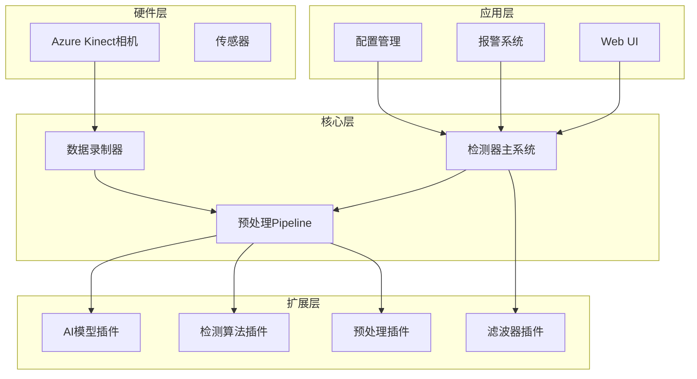
```mermaid
graph TB
subgraph "应用层"
UI[Web UI]
Alert[报警系统]
Config[配置管理]
end
subgraph "核心层"
Detector[检测器主系统]
Pipeline[预处理Pipeline]
Recorder[数据录制器]
end
subgraph "扩展层"
AIModels[AI模型插件]
Detectors[检测算法插件]
Preprocessors[预处理插件]
Filters[滤波器插件]
end
subgraph "硬件层"
Camera[Azure Kinect相机]
Sensors[传感器]
end
UI --> Detector
Alert --> Detector
Config --> Detector
Detector --> Pipeline
Pipeline --> AIModels
Pipeline --> Detectors
Pipeline --> Preprocessors
Detector --> Filters
Camera --> Recorder
Recorder --> Pipeline
```

**架构图来源**
- [app.py:1-662](file://app.py#L1-L662)
- [detector.py:75-283](file://src/detection/detector.py#L75-L283)
- [pipeline.py:65-178](file://src/preprocessing/pipeline.py#L65-L178)

### 插件接口规范

系统定义了统一的插件接口规范，确保各模块间的松耦合设计：

#### 1. 基础插件接口

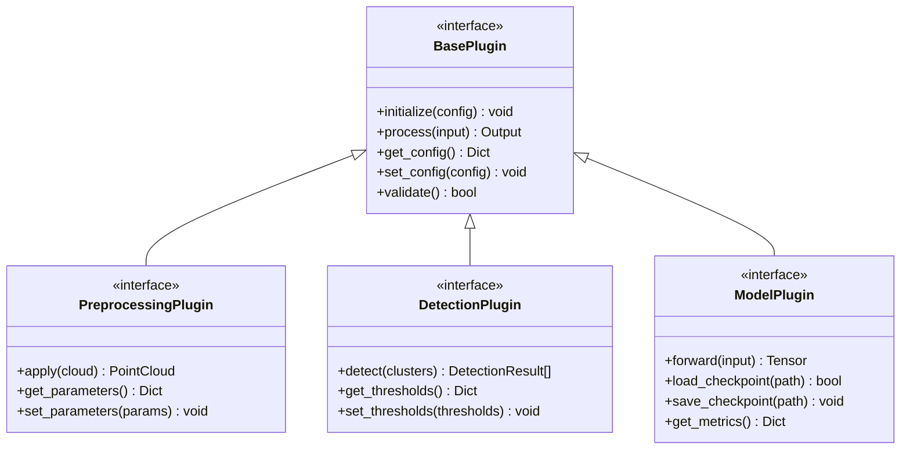
```mermaid
classDiagram
class BasePlugin {
<<interface>>
+initialize(config) void
+process(input) Output
+get_config() Dict
+set_config(config) void
+validate() bool
}
class PreprocessingPlugin {
<<interface>>
+apply(cloud) PointCloud
+get_parameters() Dict
+set_parameters(params) void
}
class DetectionPlugin {
<<interface>>
+detect(clusters) DetectionResult[]
+get_thresholds() Dict
+set_thresholds(thresholds) void
}
class ModelPlugin {
<<interface>>
+forward(input) Tensor
+load_checkpoint(path) bool
+save_checkpoint(path) void
+get_metrics() Dict
}
BasePlugin <|-- PreprocessingPlugin
BasePlugin <|-- DetectionPlugin
BasePlugin <|-- ModelPlugin
```

**类图来源**
- [pipeline.py:65-178](file://src/preprocessing/pipeline.py#L65-L178)
- [rules.py:226-423](file://src/detection/rules.py#L226-L423)

#### 2. 工厂模式设计

系统采用工厂模式创建各种插件实例：

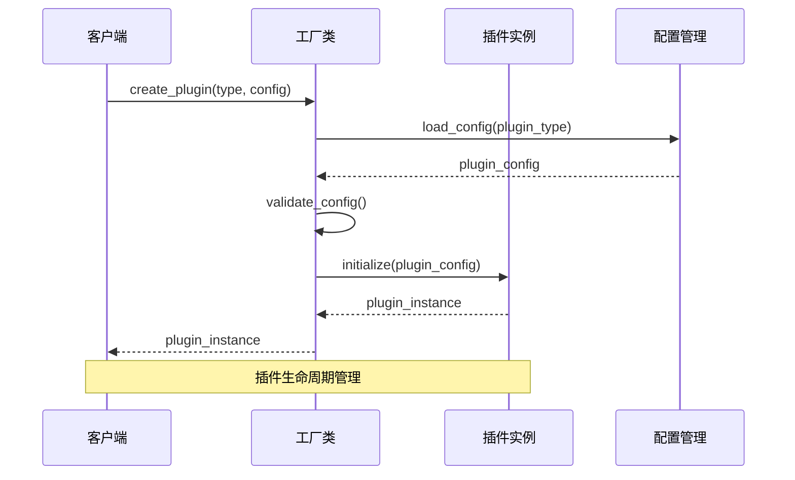
```mermaid
sequenceDiagram
participant Client as 客户端
participant Factory as 工厂类
participant Plugin as 插件实例
participant Config as 配置管理
Client->>Factory : create_plugin(type, config)
Factory->>Config : load_config(plugin_type)
Config-->>Factory : plugin_config
Factory->>Factory : validate_config()
Factory->>Plugin : initialize(plugin_config)
Plugin-->>Factory : plugin_instance
Factory-->>Client : plugin_instance
Note over Client,Plugin : 插件生命周期管理
```

**序列图来源**
- [pipeline.py:251-267](file://src/preprocessing/pipeline.py#L251-L267)
- [rules.py:425-445](file://src/detection/rules.py#L425-L445)

## 核心组件分析

### 检测系统主架构

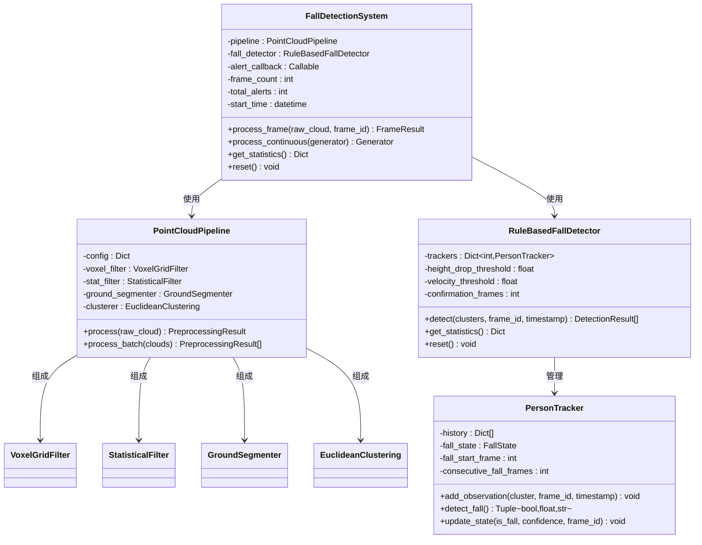
```mermaid
classDiagram
class FallDetectionSystem {
-pipeline : PointCloudPipeline
-fall_detector : RuleBasedFallDetector
-alert_callback : Callable
-frame_count : int
-total_alerts : int
-start_time : datetime
+process_frame(raw_cloud, frame_id) FrameResult
+process_continuous(generator) Generator
+get_statistics() Dict
+reset() void
}
class PointCloudPipeline {
-config : Dict
-voxel_filter : VoxelGridFilter
-stat_filter : StatisticalFilter
-ground_segmenter : GroundSegmenter
-clusterer : EuclideanClustering
+process(raw_cloud) PreprocessingResult
+process_batch(clouds) PreprocessingResult[]
}
class RuleBasedFallDetector {
-trackers : Dict~int,PersonTracker~
-height_drop_threshold : float
-velocity_threshold : float
-confirmation_frames : int
+detect(clusters, frame_id, timestamp) DetectionResult[]
+get_statistics() Dict
+reset() void
}
class PersonTracker {
-history : Dict[]
-fall_state : FallState
-fall_start_frame : int
-consecutive_fall_frames : int
+add_observation(cluster, frame_id, timestamp) void
+detect_fall() Tuple~bool,float,str~
+update_state(is_fall, confidence, frame_id) void
}
FallDetectionSystem --> PointCloudPipeline : 使用
FallDetectionSystem --> RuleBasedFallDetector : 使用
RuleBasedFallDetector --> PersonTracker : 管理
PointCloudPipeline --> VoxelGridFilter : 组成
PointCloudPipeline --> StatisticalFilter : 组成
PointCloudPipeline --> GroundSegmenter : 组成
PointCloudPipeline --> EuclideanClustering : 组成
```

**类图来源**
- [detector.py:75-283](file://src/detection/detector.py#L75-L283)
- [pipeline.py:65-178](file://src/preprocessing/pipeline.py#L65-L178)
- [rules.py:226-423](file://src/detection/rules.py#L226-L423)

### 数据流处理

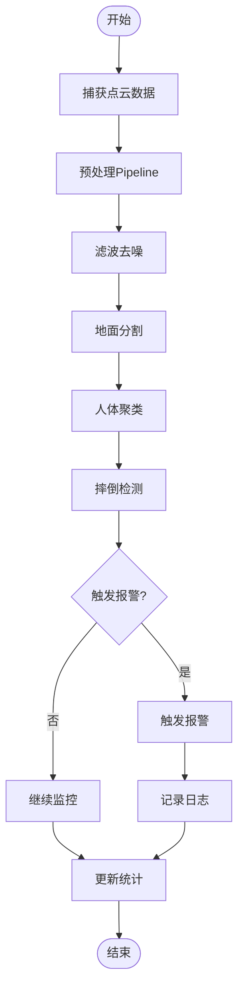
```mermaid
flowchart TD
Start([开始]) --> Capture["捕获点云数据"]
Capture --> Preprocess["预处理Pipeline"]
Preprocess --> Filter["滤波去噪"]
Filter --> Segment["地面分割"]
Segment --> Cluster["人体聚类"]
Cluster --> Detect["摔倒检测"]
Detect --> Alert{"触发报警?"}
Alert --> |是| Trigger["触发报警"]
Alert --> |否| Continue["继续监控"]
Trigger --> Log["记录日志"]
Continue --> Stats["更新统计"]
Log --> Stats
Stats --> End([结束])
```

**流程图来源**
- [detector.py:138-227](file://src/detection/detector.py#L138-L227)
- [pipeline.py:98-139](file://src/preprocessing/pipeline.py#L98-L139)

## 扩展开发指南

### 新AI模型开发流程

#### 1. 模型接口实现

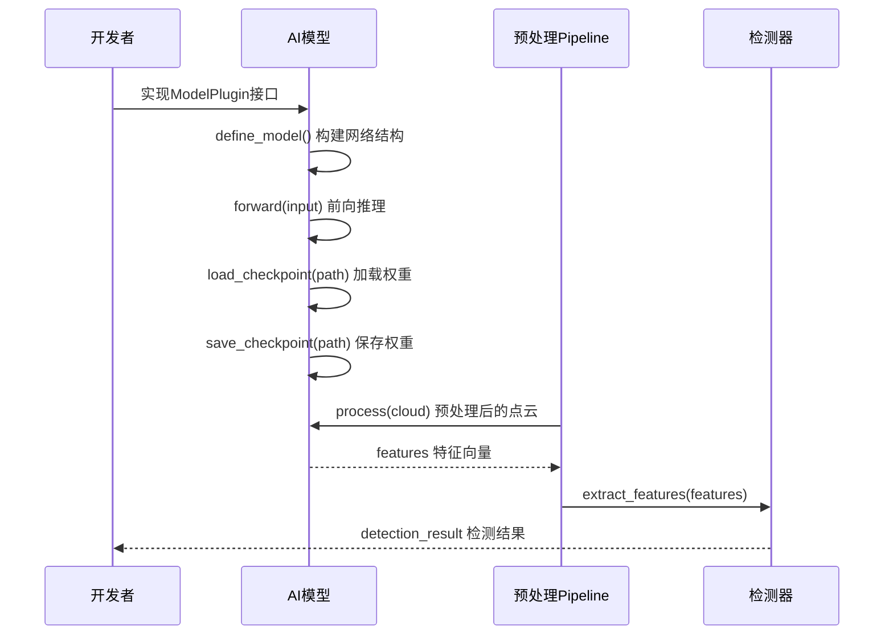
```mermaid
sequenceDiagram
participant Dev as 开发者
participant Model as AI模型
participant Pipeline as 预处理Pipeline
participant Detector as 检测器
Dev->>Model : 实现ModelPlugin接口
Model->>Model : define_model() 构建网络结构
Model->>Model : forward(input) 前向推理
Model->>Model : load_checkpoint(path) 加载权重
Model->>Model : save_checkpoint(path) 保存权重
Pipeline->>Model : process(cloud) 预处理后的点云
Model-->>Pipeline : features 特征向量
Pipeline->>Detector : extract_features(features)
Detector-->>Dev : detection_result 检测结果
```

**序列图来源**
- [rules.py:425-445](file://src/detection/rules.py#L425-L445)

#### 2. 模型训练集成

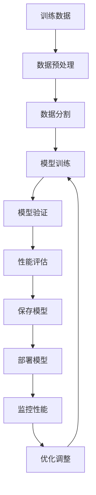
```mermaid
flowchart TD
Data[训练数据] --> Preprocess["数据预处理"]
Preprocess --> Split["数据分割"]
Split --> Train["模型训练"]
Train --> Validate["模型验证"]
Validate --> Evaluate["性能评估"]
Evaluate --> Save["保存模型"]
Save --> Deploy["部署模型"]
Deploy --> Monitor["监控性能"]
Monitor --> Optimize["优化调整"]
Optimize --> Train
```

**流程图来源**
- [CODE_GENERATION_PLAN.md:137-175](file://CODE_GENERATION_PLAN.md#L137-L175)

### 新检测算法集成

#### 1. 算法接口规范

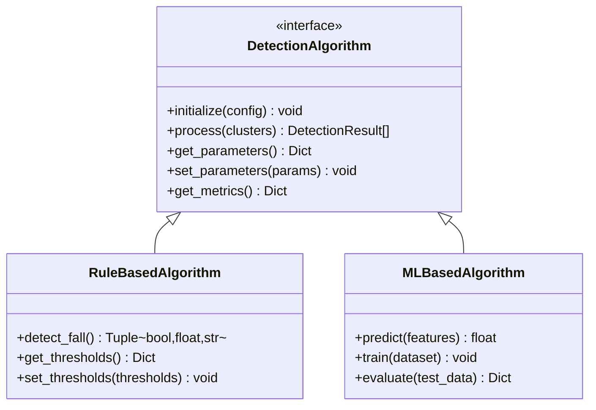
```mermaid
classDiagram
class DetectionAlgorithm {
<<interface>>
+initialize(config) void
+process(clusters) DetectionResult[]
+get_parameters() Dict
+set_parameters(params) void
+get_metrics() Dict
}
class RuleBasedAlgorithm {
+detect_fall() Tuple~bool,float,str~
+get_thresholds() Dict
+set_thresholds(thresholds) void
}
class MLBasedAlgorithm {
+predict(features) float
+train(dataset) void
+evaluate(test_data) Dict
}
DetectionAlgorithm <|-- RuleBasedAlgorithm
DetectionAlgorithm <|-- MLBasedAlgorithm
```

**类图来源**
- [rules.py:226-423](file://src/detection/rules.py#L226-L423)

#### 2. 算法评估流程

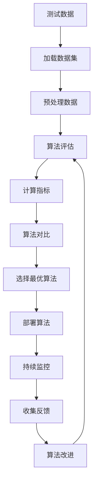
```mermaid
flowchart TD
Test[测试数据] --> Load["加载数据集"]
Load --> Process["预处理数据"]
Process --> Evaluate["算法评估"]
Evaluate --> Metrics["计算指标"]
Metrics --> Compare["算法对比"]
Compare --> Select["选择最优算法"]
Select --> Deploy["部署算法"]
Deploy --> Monitor["持续监控"]
Monitor --> Feedback["收集反馈"]
Feedback --> Improve["算法改进"]
Improve --> Evaluate
```

**流程图来源**
- [fall_detection_demo.py:92-179](file://demos/fall_detection_demo.py#L92-L179)

### 预处理模块扩展

#### 1. 新滤波器开发

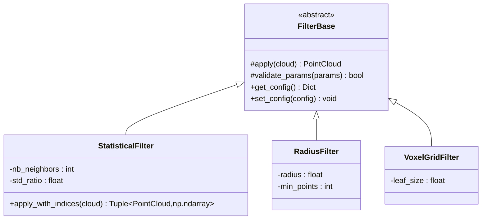
```mermaid
classDiagram
class FilterBase {
<<abstract>>
#apply(cloud) PointCloud
#validate_params(params) bool
+get_config() Dict
+set_config(config) void
}
class StatisticalFilter {
-nb_neighbors : int
-std_ratio : float
+apply_with_indices(cloud) Tuple~PointCloud,np.ndarray~
}
class RadiusFilter {
-radius : float
-min_points : int
}
class VoxelGridFilter {
-leaf_size : float
}
FilterBase <|-- StatisticalFilter
FilterBase <|-- RadiusFilter
FilterBase <|-- VoxelGridFilter
```

**类图来源**
- [filtering.py:13-189](file://src/preprocessing/filtering.py#L13-L189)

#### 2. 新聚类算法

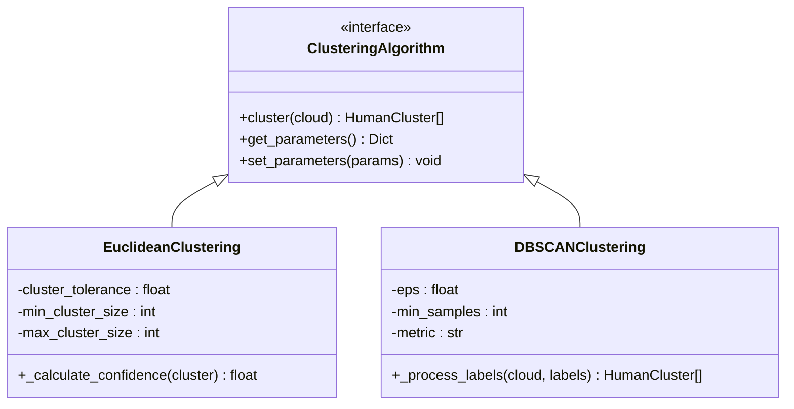
```mermaid
classDiagram
class ClusteringAlgorithm {
<<interface>>
+cluster(cloud) HumanCluster[]
+get_parameters() Dict
+set_parameters(params) void
}
class EuclideanClustering {
-cluster_tolerance : float
-min_cluster_size : int
-max_cluster_size : int
+_calculate_confidence(cluster) float
}
class DBSCANClustering {
-eps : float
-min_samples : int
-metric : str
+_process_labels(cloud, labels) HumanCluster[]
}
ClusteringAlgorithm <|-- EuclideanClustering
ClusteringAlgorithm <|-- DBSCANClustering
```

**类图来源**
- [clustering.py:99-495](file://src/preprocessing/clustering.py#L99-L495)

## AI模型集成

### 模型架构设计

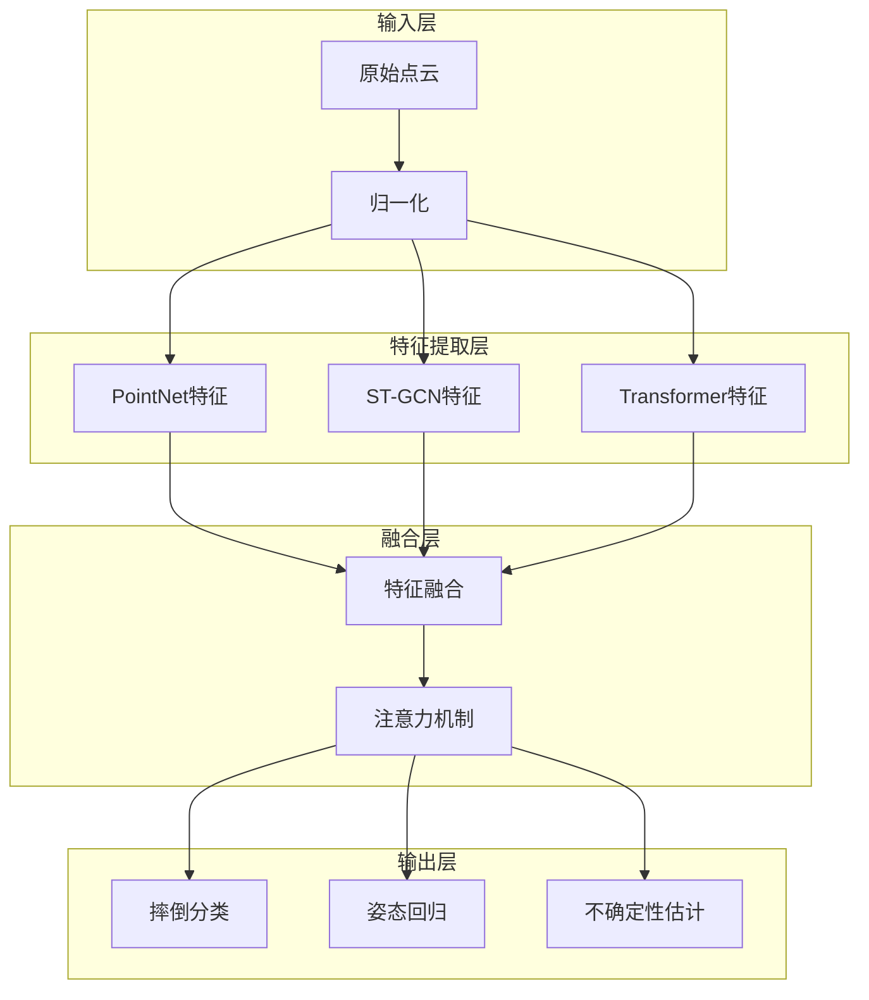
```mermaid
graph TB
subgraph "输入层"
RawCloud[原始点云]
Normalized[归一化]
end
subgraph "特征提取层"
Feature1[PointNet特征]
Feature2[ST-GCN特征]
Feature3[Transformer特征]
end
subgraph "融合层"
Fusion[特征融合]
Attention[注意力机制]
end
subgraph "输出层"
Classification[摔倒分类]
Regression[姿态回归]
Uncertainty[不确定性估计]
end
RawCloud --> Normalized
Normalized --> Feature1
Normalized --> Feature2
Normalized --> Feature3
Feature1 --> Fusion
Feature2 --> Fusion
Feature3 --> Fusion
Fusion --> Attention
Attention --> Classification
Attention --> Regression
Attention --> Uncertainty
```

**架构图来源**
- [CODE_GENERATION_PLAN.md:137-151](file://CODE_GENERATION_PLAN.md#L137-L151)

### 模型训练流程

#### 1. 数据准备

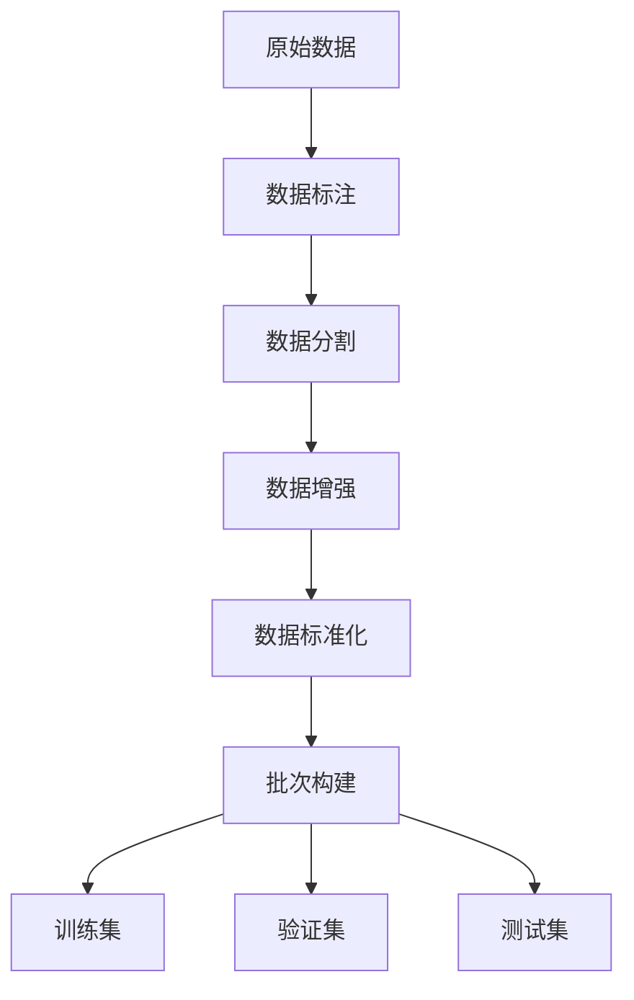
```mermaid
flowchart TD
RawData[原始数据] --> Annotation[数据标注]
Annotation --> Split[数据分割]
Split --> Augmentation[数据增强]
Augmentation --> Normalize[数据标准化]
Normalize --> Batch[批次构建]
Batch --> Training[训练集]
Batch --> Validation[验证集]
Batch --> Test[测试集]
```

#### 2. 训练配置

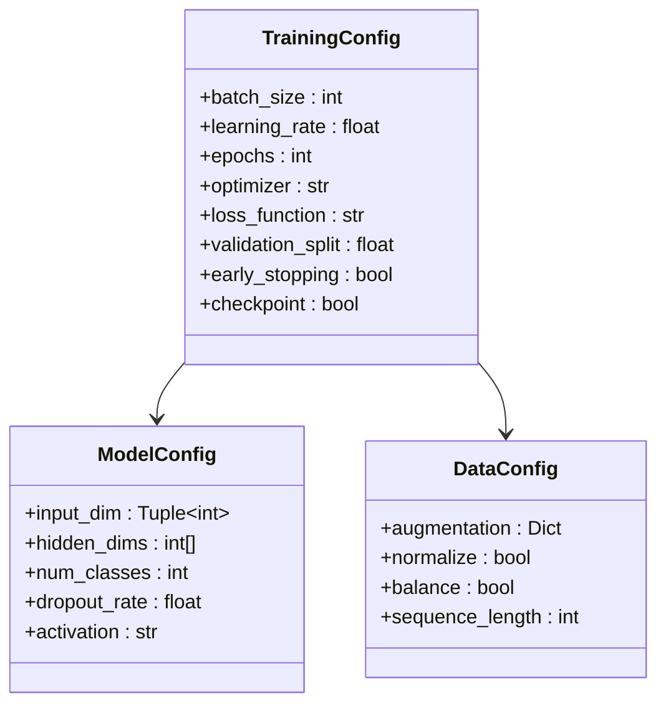
```mermaid
classDiagram
class TrainingConfig {
+batch_size : int
+learning_rate : float
+epochs : int
+optimizer : str
+loss_function : str
+validation_split : float
+early_stopping : bool
+checkpoint : bool
}
class ModelConfig {
+input_dim : Tuple~int~
+hidden_dims : int[]
+num_classes : int
+dropout_rate : float
+activation : str
}
class DataConfig {
+augmentation : Dict
+normalize : bool
+balance : bool
+sequence_length : int
}
TrainingConfig --> ModelConfig
TrainingConfig --> DataConfig
```

**类图来源**
- [CODE_GENERATION_PLAN.md:538-570](file://CODE_GENERATION_PLAN.md#L538-L570)

## 检测算法扩展

### 状态机设计

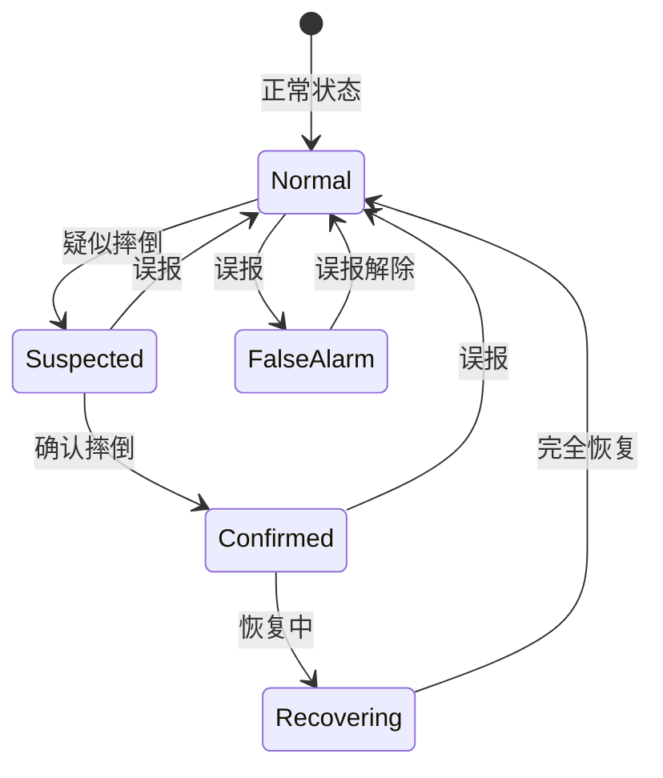
```mermaid
stateDiagram-v2
[*] --> Normal : 正常状态
Normal --> Suspected : 疑似摔倒
Suspected --> Confirmed : 确认摔倒
Confirmed --> Recovering : 恢复中
Recovering --> Normal : 完全恢复
Suspected --> Normal : 误报
Confirmed --> Normal : 误报
Normal --> FalseAlarm : 误报
FalseAlarm --> Normal : 误报解除
```

**状态图来源**
- [rules.py:22-28](file://src/detection/rules.py#L22-L28)

### 检测规则引擎

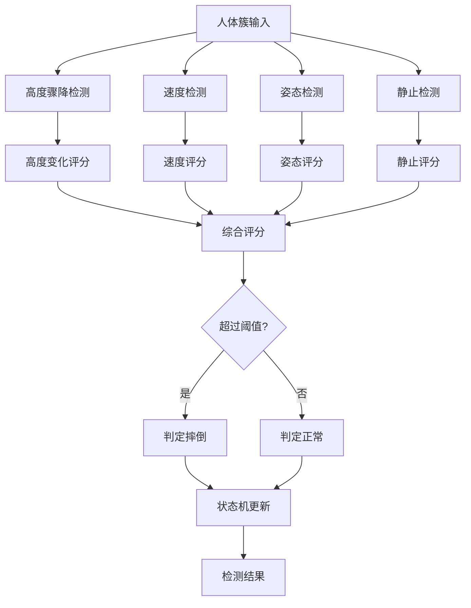
```mermaid
flowchart TD
Input[人体簇输入] --> HeightCheck["高度骤降检测"]
Input --> VelocityCheck["速度检测"]
Input --> PoseCheck["姿态检测"]
Input --> StaticCheck["静止检测"]
HeightCheck --> HeightScore["高度变化评分"]
VelocityCheck --> VelocityScore["速度评分"]
PoseCheck --> PoseScore["姿态评分"]
StaticCheck --> StaticScore["静止评分"]
HeightScore --> Combine["综合评分"]
VelocityScore --> Combine
PoseScore --> Combine
StaticScore --> Combine
Combine --> Threshold{"超过阈值?"}
Threshold --> |是| Fall["判定摔倒"]
Threshold --> |否| Normal["判定正常"]
Fall --> StateMachine["状态机更新"]
Normal --> StateMachine
StateMachine --> Output[检测结果]
```

**流程图来源**
- [rules.py:145-188](file://src/detection/rules.py#L145-L188)

## 预处理模块扩展

### Pipeline设计模式

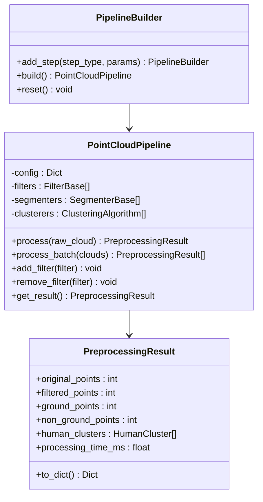
```mermaid
classDiagram
class PointCloudPipeline {
-config : Dict
-filters : FilterBase[]
-segmenters : SegmenterBase[]
-clusterers : ClusteringAlgorithm[]
+process(raw_cloud) PreprocessingResult
+process_batch(clouds) PreprocessingResult[]
+add_filter(filter) void
+remove_filter(filter) void
+get_result() PreprocessingResult
}
class PreprocessingResult {
+original_points : int
+filtered_points : int
+ground_points : int
+non_ground_points : int
+human_clusters : HumanCluster[]
+processing_time_ms : float
+to_dict() Dict
}
class PipelineBuilder {
+add_step(step_type, params) PipelineBuilder
+build() PointCloudPipeline
+reset() void
}
PointCloudPipeline --> PreprocessingResult
PipelineBuilder --> PointCloudPipeline
```

**类图来源**
- [pipeline.py:65-178](file://src/preprocessing/pipeline.py#L65-L178)

### 实时处理优化

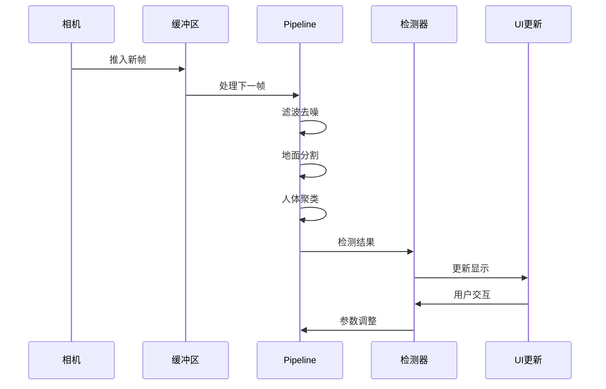
```mermaid
sequenceDiagram
participant Camera as 相机
participant Buffer as 缓冲区
participant Pipeline as Pipeline
participant Detector as 检测器
participant UI as UI更新
Camera->>Buffer : 推入新帧
Buffer->>Pipeline : 处理下一帧
Pipeline->>Pipeline : 滤波去噪
Pipeline->>Pipeline : 地面分割
Pipeline->>Pipeline : 人体聚类
Pipeline->>Detector : 检测结果
Detector->>UI : 更新显示
UI->>Detector : 用户交互
Detector->>Pipeline : 参数调整
```

**序列图来源**
- [pipeline.py:199-248](file://src/preprocessing/pipeline.py#L199-L248)

## 配置系统扩展

### 配置管理架构

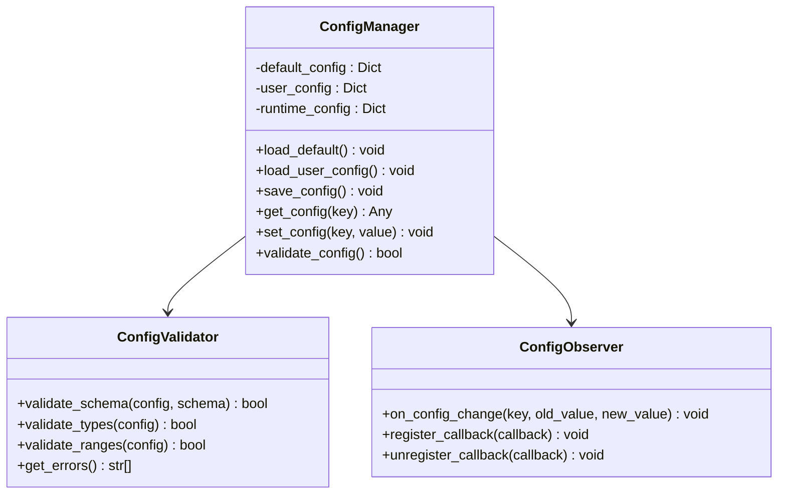
```mermaid
classDiagram
class ConfigManager {
-default_config : Dict
-user_config : Dict
-runtime_config : Dict
+load_default() void
+load_user_config() void
+save_config() void
+get_config(key) Any
+set_config(key, value) void
+validate_config() bool
}
class ConfigValidator {
+validate_schema(config, schema) bool
+validate_types(config) bool
+validate_ranges(config) bool
+get_errors() str[]
}
class ConfigObserver {
+on_config_change(key, old_value, new_value) void
+register_callback(callback) void
+unregister_callback(callback) void
}
ConfigManager --> ConfigValidator
ConfigManager --> ConfigObserver
```

**类图来源**
- [app.py:95-101](file://app.py#L95-L101)

### 配置文件结构

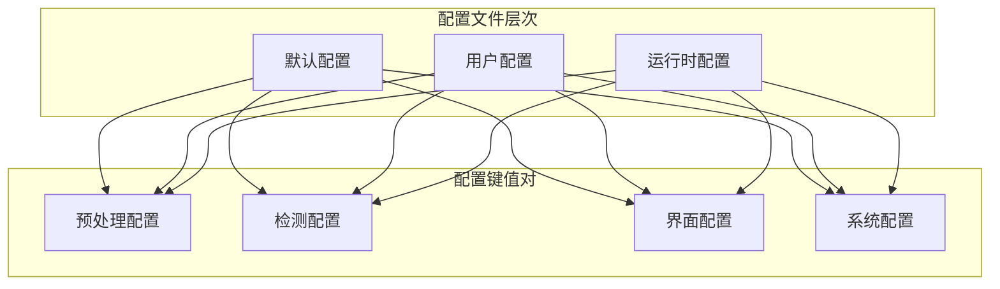
```mermaid
graph TB
subgraph "配置文件层次"
Default[默认配置]
User[用户配置]
Runtime[运行时配置]
end
subgraph "配置键值对"
Preprocess[预处理配置]
Detection[检测配置]
UI[界面配置]
System[系统配置]
end
Default --> Preprocess
Default --> Detection
Default --> UI
Default --> System
User --> Preprocess
User --> Detection
User --> UI
User --> System
Runtime --> Preprocess
Runtime --> Detection
Runtime --> UI
Runtime --> System
```

**架构图来源**
- [app.py:195-208](file://app.py#L195-L208)

## 第三方库集成

### 外部API对接

```mermaid
graph TB
subgraph "外部系统"
Alarm[报警系统]
Database[数据库]
Cloud[云存储]
Analytics[分析平台]
end
subgraph "GuardianFall系统"
Detector[检测器]
Recorder[录制器]
Config[配置管理]
Logger[日志系统]
end
Detector --> Alarm
Detector --> Database
Recorder --> Cloud
Config --> Analytics
Logger --> Database
Logger --> Analytics
```

**架构图来源**
- [recorder.py:48-489](file://src/data_capture/recorder.py#L48-L489)

### API集成模式

```mermaid
sequenceDiagram
participant Client as 客户端
participant API as 外部API
participant Auth as 认证服务
participant Cache as 缓存层
participant Retry as 重试机制
Client->>Auth : 获取访问令牌
Auth-->>Client : 令牌
Client->>API : 发送请求
API->>Retry : 检查重试
Retry->>API : 执行请求
API-->>Client : 返回响应
Client->>Cache : 缓存响应
Cache-->>Client : 缓存命中
```

**序列图来源**
- [recorder.py:312-346](file://src/data_capture/recorder.py#L312-L346)

## 性能优化策略

### 内存管理优化

```mermaid
flowchart TD
Memory[内存使用] --> Cache[缓存管理]
Memory --> Pool[对象池]
Memory --> Lazy[延迟加载]
Cache --> LRU[LRU缓存]
Cache --> TTL[TTL过期]
Cache --> SizeLimit[大小限制]
Pool --> Reuse[对象复用]
Pool --> ThreadSafe[线程安全]
Pool --> Capacity[容量控制]
Lazy --> OnDemand[按需加载]
Lazy --> AsyncLoad[异步加载]
Lazy --> Prefetch[预加载]
```

### 并行处理优化

```mermaid
graph TB
subgraph "并行处理架构"
CPU[CPU核心]
GPU[GPU加速]
IO[IO并发]
end
subgraph "任务调度"
Task1[点云处理]
Task2[特征提取]
Task3[模型推理]
Task4[结果聚合]
end
CPU --> Task1
CPU --> Task2
GPU --> Task3
IO --> Task4
Task1 --> Task2
Task2 --> Task3
Task3 --> Task4
```

**架构图来源**
- [detector.py:229-259](file://src/detection/detector.py#L229-L259)

### 性能监控

```mermaid
classDiagram
class PerformanceMonitor {
-fps_history : float[]
-memory_usage : int[]
-cpu_usage : float[]
-latency_stats : Dict
+start_monitoring() void
+stop_monitoring() void
+get_fps() float
+get_memory_usage() int
+get_cpu_usage() float
+get_latency_stats() Dict
+export_metrics() Dict
}
class MetricCollector {
+collect_fps() void
+collect_memory() void
+collect_cpu() void
+collect_latency() void
+reset_stats() void
}
PerformanceMonitor --> MetricCollector
```

**类图来源**
- [detector.py:261-282](file://src/detection/detector.py#L261-L282)

## 向后兼容性保障

### 版本管理策略

```mermaid
graph TB
subgraph "版本控制"
Major[主版本]
Minor[次版本]
Patch[补丁版本]
end
subgraph "兼容性保证"
API[API兼容]
Data[数据兼容]
Config[配置兼容]
end
subgraph "升级策略"
Migration[迁移脚本]
Deprecation[弃用警告]
Backward[向后兼容]
end
Major --> API
Minor --> API
Patch --> API
API --> Data
Data --> Config
Migration --> Backward
Deprecation --> Backward
```

### 兼容性测试

```mermaid
flowchart TD
Test[兼容性测试] --> Unit[Unit Tests]
Test --> Integration[Integration Tests]
Test --> Regression[Regression Tests]
Unit --> API[API兼容性]
Unit --> Data[数据格式]
Unit --> Config[配置解析]
Integration --> Component[组件交互]
Integration --> Performance[性能回归]
Integration --> Security[安全兼容]
Regression --> Breaking[破坏性变更]
Regression --> Feature[功能回归]
Regression --> Bug[Bug修复回归]
```

**流程图来源**
- [README.md:177-273](file://README.md#L177-L273)

## 总结

GuardianFall项目的扩展开发与插件机制设计体现了现代软件架构的最佳实践：

### 核心优势

1. **模块化设计**: 清晰的职责分离和接口定义
2. **可扩展性**: 支持新的AI模型、检测算法和预处理模块
3. **性能优化**: 多层次的性能监控和优化策略
4. **向后兼容**: 完善的版本管理和兼容性保障
5. **易于集成**: 标准化的第三方库和API对接

### 开发建议

1. **遵循接口规范**: 新插件必须实现相应的接口
2. **性能优先**: 重视处理速度和内存使用
3. **测试充分**: 提供完整的单元测试和集成测试
4. **文档完善**: 详细的API文档和使用指南
5. **监控到位**: 实时性能监控和错误处理

### 未来发展方向

1. **AI模型增强**: 集成更先进的深度学习模型
2. **算法优化**: 改进检测精度和鲁棒性
3. **系统扩展**: 支持更多硬件平台和传感器
4. **云端集成**: 增强云服务和远程监控能力
5. **生态建设**: 构建完整的开发者生态系统

通过这套完善的扩展开发指南和插件机制，开发者可以快速集成新的功能模块，同时保持系统的稳定性和性能表现。