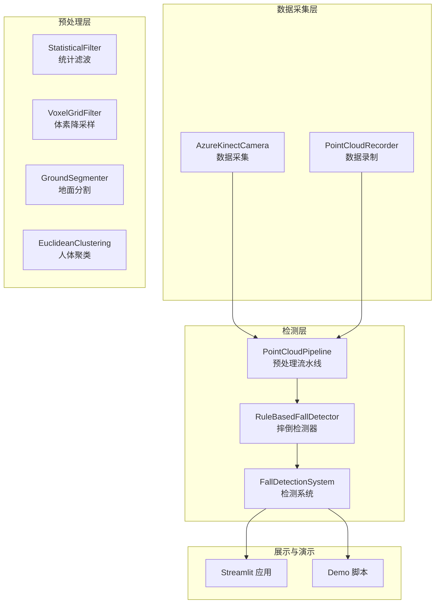
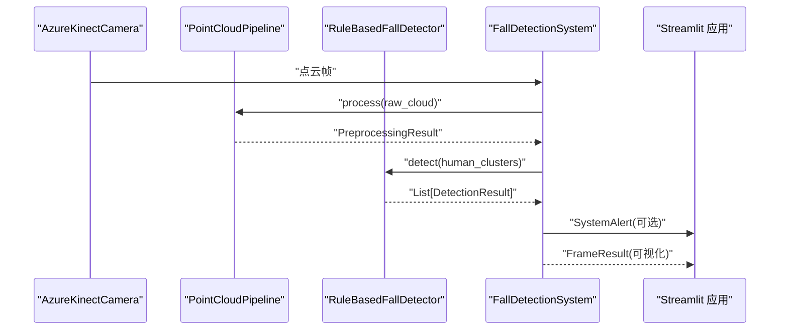
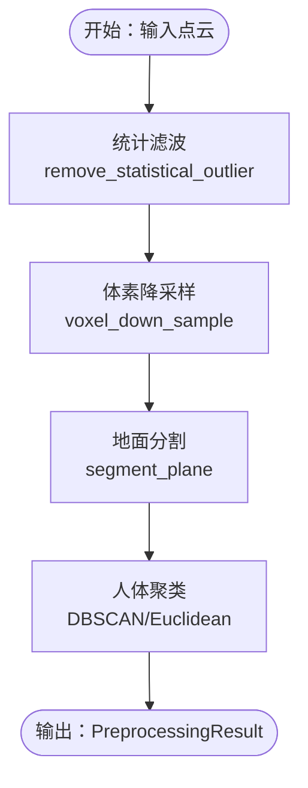
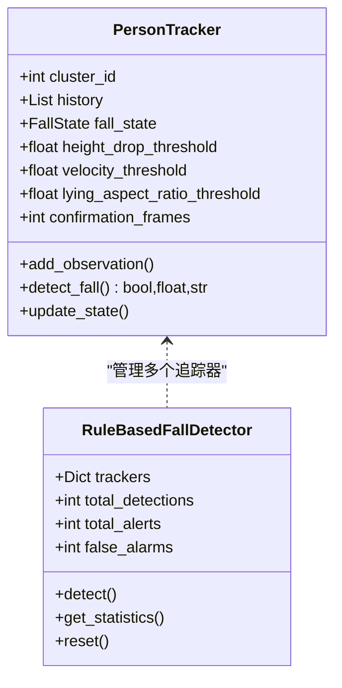
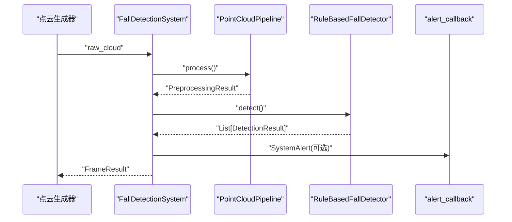
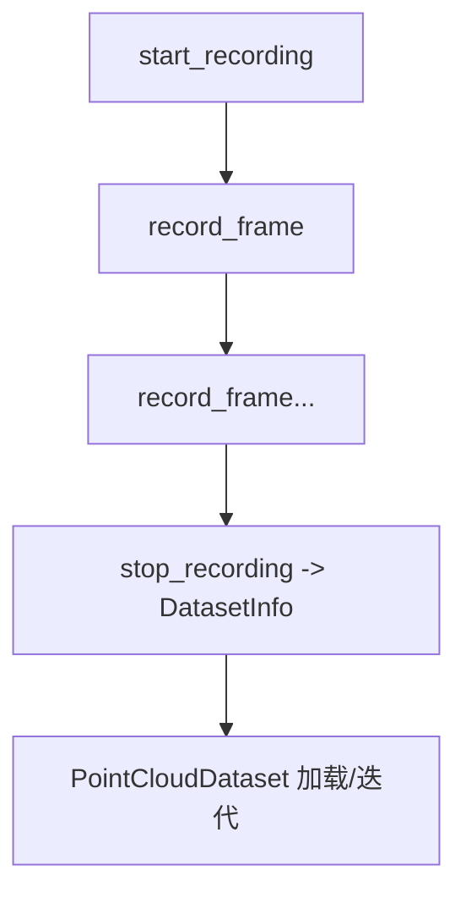
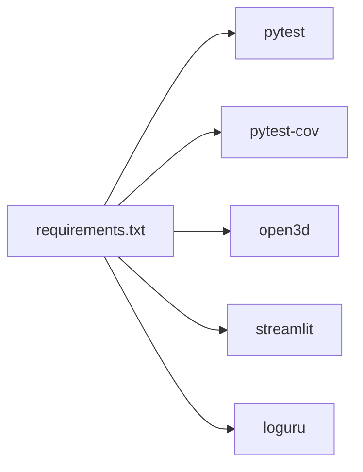

# 测试策略与质量保证

<cite>
**本文档引用的文件**
- [app.py](file://app.py)
- [demos/fall_detection_demo.py](file://demos/fall_detection_demo.py)
- [src/detection/detector.py](file://src/detection/detector.py)
- [src/detection/rules.py](file://src/detection/rules.py)
- [src/preprocessing/pipeline.py](file://src/preprocessing/pipeline.py)
- [src/preprocessing/clustering.py](file://src/preprocessing/clustering.py)
- [src/preprocessing/filtering.py](file://src/preprocessing/filtering.py)
- [src/preprocessing/segmentation.py](file://src/preprocessing/segmentation.py)
- [src/data_capture/azure_kinect.py](file://src/data_capture/azure_kinect.py)
- [src/data_capture/recorder.py](file://src/data_capture/recorder.py)
- [requirements.txt](file://requirements.txt)
</cite>

## 目录
1. [简介](#简介)
2. [项目结构](#项目结构)
3. [核心组件](#核心组件)
4. [架构概览](#架构概览)
5. [详细组件分析](#详细组件分析)
6. [依赖分析](#依赖分析)
7. [性能考虑](#性能考虑)
8. [故障排查指南](#故障排查指南)
9. [结论](#结论)
10. [附录](#附录)

## 简介
本文件面向GuardianFall项目的测试策略与质量保证体系，围绕单元测试、集成测试、端到端测试的设计与实施展开，结合点云处理、摔倒检测等核心功能，提供测试用例编写规范、测试数据准备与Mock策略、性能与压力测试、边界条件测试、CI/CD自动化测试配置建议、测试覆盖率与质量门禁标准，以及调试技巧与测试环境搭建指导。

## 项目结构
GuardianFall采用模块化分层架构，核心模块包括：
- 数据采集层：Azure Kinect相机封装与数据录制
- 预处理层：统计滤波、体素降采样、地面分割、人体聚类
- 检测层：基于规则的摔倒检测与状态机
- 可视化与演示：Streamlit前端与Demo脚本

**图表来源**
- [src/data_capture/azure_kinect.py:47-472](file://src/data_capture/azure_kinect.py#L47-L472)
- [src/data_capture/recorder.py:48-436](file://src/data_capture/recorder.py#L48-L436)
- [src/preprocessing/pipeline.py:65-178](file://src/preprocessing/pipeline.py#L65-L178)
- [src/preprocessing/filtering.py:13-189](file://src/preprocessing/filtering.py#L13-L189)
- [src/preprocessing/segmentation.py:13-243](file://src/preprocessing/segmentation.py#L13-L243)
- [src/preprocessing/clustering.py:99-495](file://src/preprocessing/clustering.py#L99-L495)
- [src/detection/rules.py:226-423](file://src/detection/rules.py#L226-L423)
- [src/detection/detector.py:75-283](file://src/detection/detector.py#L75-L283)
- [app.py:1-662](file://app.py#L1-L662)
- [demos/fall_detection_demo.py:1-373](file://demos/fall_detection_demo.py#L1-L373)

**章节来源**
- [src/preprocessing/pipeline.py:1-337](file://src/preprocessing/pipeline.py#L1-L337)
- [src/detection/detector.py:1-373](file://src/detection/detector.py#L1-L373)
- [src/detection/rules.py:1-526](file://src/detection/rules.py#L1-L526)
- [src/data_capture/azure_kinect.py:1-532](file://src/data_capture/azure_kinect.py#L1-L532)
- [src/data_capture/recorder.py:1-489](file://src/data_capture/recorder.py#L1-L489)
- [app.py:1-662](file://app.py#L1-L662)
- [demos/fall_detection_demo.py:1-373](file://demos/fall_detection_demo.py#L1-L373)

## 核心组件
- 点云预处理流水线：体素降采样、统计滤波、地面分割、人体聚类
- 摔倒检测器：基于规则的状态机，包含高度骤降、速度、姿态、静止等指标
- 检测系统：整合预处理与检测，提供帧级处理与报警回调
- 数据采集与录制：Azure Kinect相机封装与点云录制/回放
- 可视化与演示：Streamlit前端与Demo脚本

**章节来源**
- [src/preprocessing/pipeline.py:65-178](file://src/preprocessing/pipeline.py#L65-L178)
- [src/detection/rules.py:226-423](file://src/detection/rules.py#L226-L423)
- [src/detection/detector.py:75-283](file://src/detection/detector.py#L75-L283)
- [src/data_capture/azure_kinect.py:47-472](file://src/data_capture/azure_kinect.py#L47-L472)
- [src/data_capture/recorder.py:48-436](file://src/data_capture/recorder.py#L48-L436)
- [app.py:105-134](file://app.py#L105-L134)
- [demos/fall_detection_demo.py:92-179](file://demos/fall_detection_demo.py#L92-L179)

## 架构概览
系统从数据采集开始，经过预处理流水线得到人体簇，再由摔倒检测器判定状态并触发报警；Streamlit应用提供可视化与交互。

**图表来源**
- [src/data_capture/azure_kinect.py:216-283](file://src/data_capture/azure_kinect.py#L216-L283)
- [src/preprocessing/pipeline.py:98-139](file://src/preprocessing/pipeline.py#L98-L139)
- [src/detection/rules.py:266-337](file://src/detection/rules.py#L266-L337)
- [src/detection/detector.py:138-227](file://src/detection/detector.py#L138-L227)
- [app.py:346-420](file://app.py#L346-L420)

## 详细组件分析

### 点云预处理模块测试策略
- 单元测试目标
  - 统计滤波：离群点移除数量、索引返回一致性
  - 体素降采样：点数压缩比例、保留率
  - 地面分割：RANSAC平面拟合、地面/非地面分离比例
  - 人体聚类：簇数量、簇内点数范围、置信度评分
- 测试数据准备
  - 模拟含离群点的点云、含噪声的地面与人体点云
  - 不同尺度与密度的输入，覆盖边界条件
- Mock策略
  - Mock Open3D内部实现，固定随机种子，确保可重复性
  - 对外部依赖（如相机SDK）进行接口层Mock
- 覆盖率与质量门禁
  - 覆盖率目标：≥80%
  - 关键分支与异常路径必须覆盖

**图表来源**
- [src/preprocessing/filtering.py:28-67](file://src/preprocessing/filtering.py#L28-L67)
- [src/preprocessing/segmentation.py:41-81](file://src/preprocessing/segmentation.py#L41-L81)
- [src/preprocessing/clustering.py:124-181](file://src/preprocessing/clustering.py#L124-L181)
- [src/preprocessing/pipeline.py:98-139](file://src/preprocessing/pipeline.py#L98-L139)

**章节来源**
- [src/preprocessing/filtering.py:13-189](file://src/preprocessing/filtering.py#L13-L189)
- [src/preprocessing/segmentation.py:13-243](file://src/preprocessing/segmentation.py#L13-L243)
- [src/preprocessing/clustering.py:99-495](file://src/preprocessing/clustering.py#L99-L495)
- [src/preprocessing/pipeline.py:65-178](file://src/preprocessing/pipeline.py#L65-L178)

### 摔倒检测规则引擎测试策略
- 单元测试目标
  - PersonTracker：高度变化、速度计算、躺倒姿态判断、状态机流转
  - RuleBasedFallDetector：检测结果构造、报警级别、统计信息
- 测试数据准备
  - 模拟不同高度、速度、宽高比的时间序列
  - 多人场景与单人场景对比
- Mock策略
  - Mock HumanCluster属性（高度、宽高比、点数）
  - Mock时间戳与帧ID序列
- 覆盖率与质量门禁
  - 覆盖率目标：≥80%
  - 状态机关键路径与边界条件（连续帧、恢复、误报）

**图表来源**
- [src/detection/rules.py:82-224](file://src/detection/rules.py#L82-L224)
- [src/detection/rules.py:226-423](file://src/detection/rules.py#L226-L423)

**章节来源**
- [src/detection/rules.py:22-526](file://src/detection/rules.py#L22-L526)

### 检测系统与报警回调测试策略
- 单元测试目标
  - process_frame：帧处理流程、处理时间、FPS统计
  - process_continuous：生成器驱动、中断处理、异常传播
  - get_statistics/reset：统计聚合、状态重置
- 测试数据准备
  - 模拟点云生成器，包含正常与摔倒帧序列
  - 回调函数Mock，验证报警触发与消息内容
- Mock策略
  - Mock Pipeline与Detector输出，控制返回值
  - Mock时间函数，控制处理时延
- 覆盖率与质量门禁
  - 覆盖率目标：≥80%
  - 异常路径（键盘中断、异常抛出）必须覆盖

**图表来源**
- [src/detection/detector.py:138-227](file://src/detection/detector.py#L138-L227)
- [src/preprocessing/pipeline.py:98-139](file://src/preprocessing/pipeline.py#L98-L139)
- [src/detection/rules.py:266-337](file://src/detection/rules.py#L266-L337)

**章节来源**
- [src/detection/detector.py:75-283](file://src/detection/detector.py#L75-L283)

### 数据采集与录制模块测试策略
- 单元测试目标
  - AzureKinectCamera：连接、捕获、深度转点云、帧率统计
  - PointCloudRecorder：录制生命周期、元数据生成、异常处理
  - PointCloudDataset：加载、迭代、标注、导出
- 测试数据准备
  - 模拟深度图与点云，覆盖空点云、异常深度值
  - 录制与回放的元数据一致性
- Mock策略
  - Mock pyk4a SDK，模拟连接与捕获
  - Mock文件系统，避免真实IO
- 覆盖率与质量门禁
  - 覆盖率目标：≥80%
  - 异常路径（连接失败、超时、文件不存在）必须覆盖

**图表来源**
- [src/data_capture/recorder.py:64-175](file://src/data_capture/recorder.py#L64-L175)
- [src/data_capture/recorder.py:223-436](file://src/data_capture/recorder.py#L223-L436)

**章节来源**
- [src/data_capture/azure_kinect.py:152-472](file://src/data_capture/azure_kinect.py#L152-L472)
- [src/data_capture/recorder.py:48-436](file://src/data_capture/recorder.py#L48-L436)

### 可视化与演示测试策略
- 单元测试目标
  - Streamlit页面布局、控件状态、数据渲染
  - Demo脚本：模拟数据与真实相机模式切换
- 测试数据准备
  - 模拟session_state与历史数据
  - 模拟点云转换为Plotly格式
- Mock策略
  - Mock session_state与st.*组件
  - MockOpen3D可视化窗口
- 覆盖率与质量门禁
  - 覆盖率目标：≥80%
  - 交互逻辑与异常路径（未运行状态、无数据）

**章节来源**
- [app.py:105-134](file://app.py#L105-L134)
- [app.py:311-450](file://app.py#L311-L450)
- [demos/fall_detection_demo.py:92-179](file://demos/fall_detection_demo.py#L92-L179)

## 依赖分析
- 测试框架与覆盖率
  - pytest与pytest-cov已作为依赖引入
- 外部依赖与集成点
  - Open3D用于点云处理
  - Streamlit用于可视化
  - pyk4a用于Azure Kinect相机（可选）
- 潜在循环依赖
  - 模块间通过接口调用，无明显循环依赖

**图表来源**
- [requirements.txt:1-34](file://requirements.txt#L1-L34)

**章节来源**
- [requirements.txt:1-34](file://requirements.txt#L1-L34)

## 性能考虑
- 单元测试中的性能测试
  - 使用pytest-benchmark或timeit测量关键函数耗时
  - 针对大数据规模的输入进行基准测试
- 集成测试中的性能验证
  - 在连续帧处理场景下验证FPS与延迟
  - 使用Mock控制外部依赖的耗时
- 压力测试
  - 生成大量帧序列，验证系统稳定性与内存占用
  - 模拟异常输入（空点云、极端噪声）评估鲁棒性
- 边界条件测试
  - 空输入、极少数点、极低/极高高度、极高速度
  - 相机连接失败、文件系统异常等

[本节为通用性能讨论，无需特定文件引用]

## 故障排查指南
- 常见问题定位
  - 相机连接失败：检查USB接口、驱动、占用情况
  - 点云为空：检查深度图有效性与过滤参数
  - 检测误报：调整高度骤降、速度、确认帧数阈值
- 日志与调试
  - 使用loguru记录关键路径与异常
  - 在Streamlit中输出中间结果与统计信息
- 回滚与降级
  - 降级到Open3D DBSCAN实现
  - 关闭耗时功能（如可视化）以提升性能

**章节来源**
- [src/data_capture/azure_kinect.py:152-191](file://src/data_capture/azure_kinect.py#L152-L191)
- [src/preprocessing/segmentation.py:64-81](file://src/preprocessing/segmentation.py#L64-L81)
- [app.py:346-420](file://app.py#L346-L420)

## 结论
通过分层测试策略与严格的覆盖率与质量门禁，GuardianFall可在保证功能正确性的前提下，持续提升性能与稳定性。建议优先完善单元测试与Mock策略，再扩展到集成与端到端测试，并在CI/CD中强制执行覆盖率检查与质量门禁。

## 附录

### 测试用例编写规范
- 命名规范：TestXxx类，test_*方法
- 断言规范：明确期望值与实际值，使用pytest内置断言
- Fixture复用：共享测试数据与Mock对象
- 异常测试：覆盖异常输入与外部依赖失败场景

### 测试数据准备清单
- 点云：含噪声、离群点、地面与人体混合
- 参数：阈值边界、极端参数组合
- 场景：单人、多人、摔倒序列、静止序列

### CI/CD自动化测试配置建议
- 测试执行：pytest + pytest-cov
- 覆盖率门禁：整体覆盖率≥80%，关键模块100%
- 质量门禁：失败即阻断，报告覆盖率与关键指标
- 缓慢测试：标记为slow，允许在PR中跳过

### 调试技巧与测试环境搭建
- 使用pytest --pdb快速定位异常
- 在Streamlit中启用详细日志
- 使用Mock隔离外部依赖，提高可重复性
- 使用Docker容器化测试环境，统一依赖版本