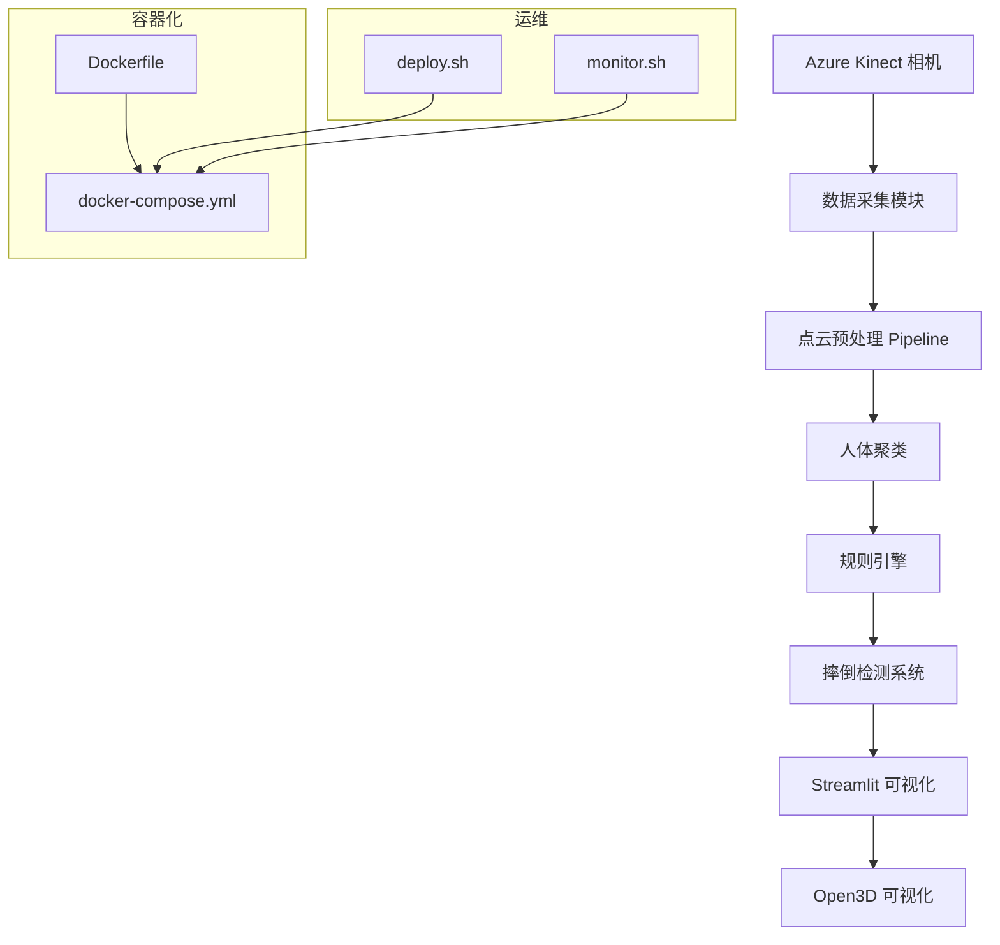
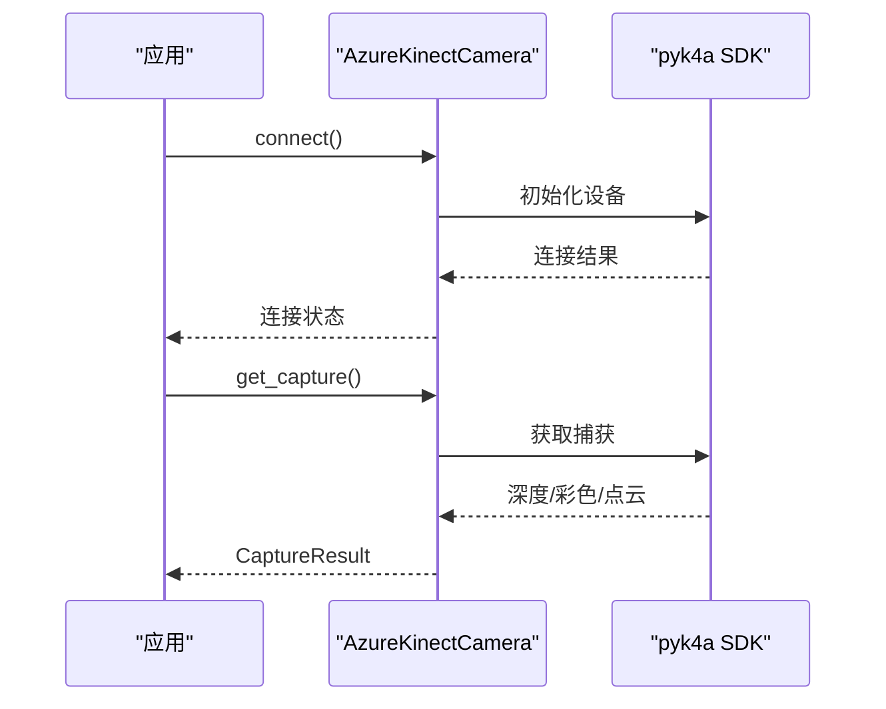
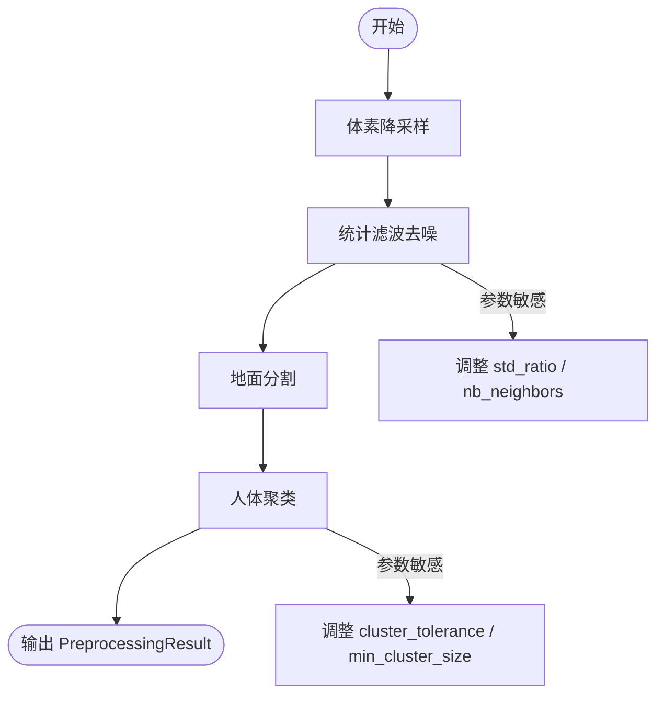
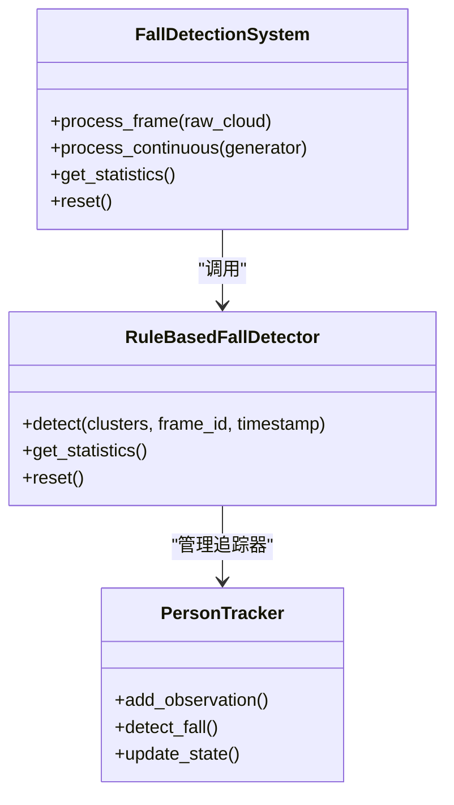
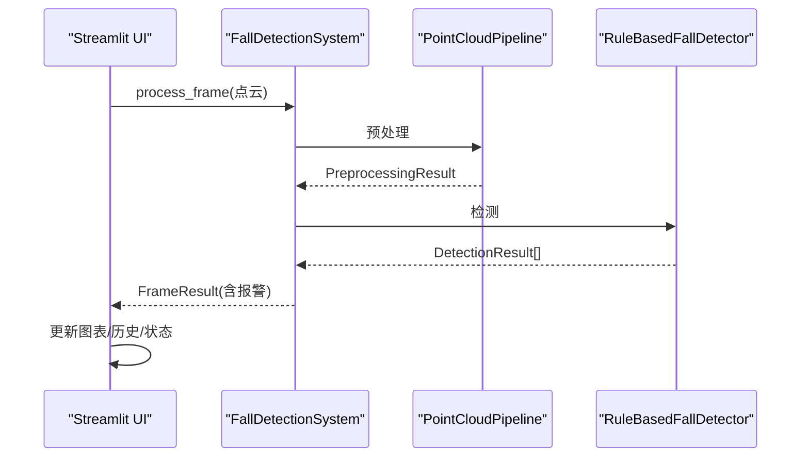
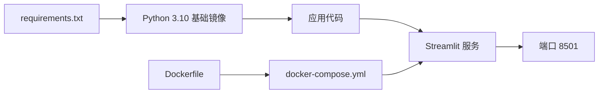

# 调试工具与故障诊断

<cite>
**本文引用的文件**
- [README.md](file://README.md)
- [app.py](file://app.py)
- [src/detection/detector.py](file://src/detection/detector.py)
- [src/detection/rules.py](file://src/detection/rules.py)
- [src/preprocessing/pipeline.py](file://src/preprocessing/pipeline.py)
- [src/preprocessing/clustering.py](file://src/preprocessing/clustering.py)
- [src/data_capture/azure_kinect.py](file://src/data_capture/azure_kinect.py)
- [src/data_capture/recorder.py](file://src/data_capture/recorder.py)
- [demos/fall_detection_demo.py](file://demos/fall_detection_demo.py)
- [Dockerfile](file://Dockerfile)
- [docker-compose.yml](file://docker-compose.yml)
- [deploy.sh](file://deploy.sh)
- [monitor.sh](file://monitor.sh)
- [start.sh](file://start.sh)
- [requirements.txt](file://requirements.txt)
</cite>

## 目录
1. [简介](#简介)
2. [项目结构](#项目结构)
3. [核心组件](#核心组件)
4. [架构总览](#架构总览)
5. [详细组件分析](#详细组件分析)
6. [依赖关系分析](#依赖关系分析)
7. [性能考虑](#性能考虑)
8. [故障排查指南](#故障排查指南)
9. [结论](#结论)
10. [附录](#附录)

## 简介
本指南面向GuardianFall项目的开发者与运维人员，提供系统化的调试工具使用方法与故障诊断流程。内容涵盖：
- Python调试器（pdb与IDE调试器）技巧
- Open3D可视化调试与点云检查
- 系统级调试（Docker容器、进程监控、日志分析）
- 性能分析工具（cProfile、memory_profiler等）
- 常见运行时错误与解决方案
- 网络调试、硬件接口调试与跨平台兼容性排查

## 项目结构
GuardianFall采用模块化分层设计，前端通过Streamlit展示，后端由点云采集、预处理、检测与规则引擎组成，并提供Docker容器化部署与监控脚本。

```mermaid
graph TB
subgraph "前端"
UI["Streamlit 应用<br/>app.py"]
end
subgraph "后端"
DC["数据采集<br/>azure_kinect.py"]
PP["点云预处理<br/>pipeline.py / clustering.py"]
DT["摔倒检测<br/>detector.py / rules.py"]
DS["数据集与回放<br/>recorder.py"]
end
subgraph "部署与运维"
DK["Dockerfile"]
DCOM["docker-compose.yml"]
DEP["deploy.sh"]
MON["monitor.sh"]
STA["start.sh"]
end
UI --> PP
UI --> DT
DC --> PP
PP --> DT
DT --> UI
DS < --> PP
DS < --> DT
DK --> DCOM
DCOM --> UI
DCOM --> MON
DEP --> DCOM
STA --> UI
```

**图表来源**
- [app.py](file://app.py)
- [src/data_capture/azure_kinect.py](file://src/data_capture/azure_kinect.py)
- [src/preprocessing/pipeline.py](file://src/preprocessing/pipeline.py)
- [src/preprocessing/clustering.py](file://src/preprocessing/clustering.py)
- [src/detection/detector.py](file://src/detection/detector.py)
- [src/detection/rules.py](file://src/detection/rules.py)
- [src/data_capture/recorder.py](file://src/data_capture/recorder.py)
- [Dockerfile](file://Dockerfile)
- [docker-compose.yml](file://docker-compose.yml)
- [deploy.sh](file://deploy.sh)
- [monitor.sh](file://monitor.sh)
- [start.sh](file://start.sh)

**章节来源**
- [README.md](file://README.md)
- [app.py](file://app.py)
- [src/data_capture/azure_kinect.py](file://src/data_capture/azure_kinect.py)
- [src/preprocessing/pipeline.py](file://src/preprocessing/pipeline.py)
- [src/preprocessing/clustering.py](file://src/preprocessing/clustering.py)
- [src/detection/detector.py](file://src/detection/detector.py)
- [src/detection/rules.py](file://src/detection/rules.py)
- [src/data_capture/recorder.py](file://src/data_capture/recorder.py)
- [Dockerfile](file://Dockerfile)
- [docker-compose.yml](file://docker-compose.yml)
- [deploy.sh](file://deploy.sh)
- [monitor.sh](file://monitor.sh)
- [start.sh](file://start.sh)

## 核心组件
- 数据采集层：Azure Kinect SDK封装，提供点云捕获、深度图转点云、录制与回放能力。
- 预处理层：体素降采样、统计滤波、地面分割、人体聚类，输出人体簇与统计信息。
- 检测层：规则引擎结合高度骤降、速度、姿态与静止状态，实现摔倒判定与报警。
- 可视化层：Streamlit界面实时显示点云、检测结果、报警历史与统计图表；Open3D可视化辅助调试。
- 部署与运维：Dockerfile与Compose定义容器化环境；deploy.sh与monitor.sh提供一键部署与持续监控。

**章节来源**
- [src/data_capture/azure_kinect.py](file://src/data_capture/azure_kinect.py)
- [src/preprocessing/pipeline.py](file://src/preprocessing/pipeline.py)
- [src/preprocessing/clustering.py](file://src/preprocessing/clustering.py)
- [src/detection/detector.py](file://src/detection/detector.py)
- [src/detection/rules.py](file://src/detection/rules.py)
- [app.py](file://app.py)
- [Dockerfile](file://Dockerfile)
- [docker-compose.yml](file://docker-compose.yml)
- [deploy.sh](file://deploy.sh)
- [monitor.sh](file://monitor.sh)

## 架构总览
系统采用“感知-边缘-算法-应用-部署”五层架构，数据从Azure Kinect采集，经Open3D与规则引擎处理，通过Streamlit呈现，最终容器化部署并可选Nginx反向代理。



**图表来源**
- [src/data_capture/azure_kinect.py](file://src/data_capture/azure_kinect.py)
- [src/preprocessing/pipeline.py](file://src/preprocessing/pipeline.py)
- [src/preprocessing/clustering.py](file://src/preprocessing/clustering.py)
- [src/detection/rules.py](file://src/detection/rules.py)
- [src/detection/detector.py](file://src/detection/detector.py)
- [app.py](file://app.py)
- [Dockerfile](file://Dockerfile)
- [docker-compose.yml](file://docker-compose.yml)
- [deploy.sh](file://deploy.sh)
- [monitor.sh](file://monitor.sh)

## 详细组件分析

### 数据采集模块（Azure Kinect）
- 功能要点：连接相机、捕获深度/彩色帧、深度图转点云、连续捕获、录制与元数据管理。
- 调试关注点：SDK可用性、USB带宽、帧率控制、异常捕获与日志记录。
- 可视化调试：将捕获的点云交给Open3D窗口显示，验证深度图质量与点云有效性。



**图表来源**
- [src/data_capture/azure_kinect.py](file://src/data_capture/azure_kinect.py)

**章节来源**
- [src/data_capture/azure_kinect.py](file://src/data_capture/azure_kinect.py)

### 点云预处理Pipeline
- 功能要点：体素降采样、统计滤波、地面分割、人体聚类，输出预处理结果与处理时间。
- 调试关注点：滤波参数对点云密度的影响、聚类阈值对人数检测的影响、处理时间统计。



**图表来源**
- [src/preprocessing/pipeline.py](file://src/preprocessing/pipeline.py)
- [src/preprocessing/clustering.py](file://src/preprocessing/clustering.py)

**章节来源**
- [src/preprocessing/pipeline.py](file://src/preprocessing/pipeline.py)
- [src/preprocessing/clustering.py](file://src/preprocessing/clustering.py)

### 摔倒检测系统与规则引擎
- 功能要点：接收预处理结果，基于高度骤降、速度、姿态与静止状态判定摔倒，生成报警并回调。
- 调试关注点：阈值配置（高度骤降、速度、确认帧数）、状态机（疑似/确认/恢复/误报）。



**图表来源**
- [src/detection/detector.py](file://src/detection/detector.py)
- [src/detection/rules.py](file://src/detection/rules.py)

**章节来源**
- [src/detection/detector.py](file://src/detection/detector.py)
- [src/detection/rules.py](file://src/detection/rules.py)

### Streamlit可视化与交互
- 功能要点：实时点云显示、检测结果展示、报警历史、参数配置、统计图表。
- 调试关注点：渲染性能、3D视图稳定性、回调触发与历史记录一致性。



**图表来源**
- [app.py](file://app.py)
- [src/detection/detector.py](file://src/detection/detector.py)
- [src/preprocessing/pipeline.py](file://src/preprocessing/pipeline.py)
- [src/detection/rules.py](file://src/detection/rules.py)

**章节来源**
- [app.py](file://app.py)
- [src/detection/detector.py](file://src/detection/detector.py)
- [src/preprocessing/pipeline.py](file://src/preprocessing/pipeline.py)
- [src/detection/rules.py](file://src/detection/rules.py)

### 数据录制与回放
- 功能要点：录制点云序列、保存元数据、回放与标注。
- 调试关注点：文件格式一致性、元数据完整性、回放缓存与批处理。

**章节来源**
- [src/data_capture/recorder.py](file://src/data_capture/recorder.py)
- [demos/fall_detection_demo.py](file://demos/fall_detection_demo.py)

## 依赖关系分析
- Python依赖集中在requirements.txt，包含Open3D、PyTorch、Streamlit、Plotly、loguru等。
- Dockerfile与docker-compose定义容器镜像、端口暴露、健康检查与日志策略。
- 部署脚本与监控脚本提供自动化与运维保障。



**图表来源**
- [requirements.txt](file://requirements.txt)
- [Dockerfile](file://Dockerfile)
- [docker-compose.yml](file://docker-compose.yml)

**章节来源**
- [requirements.txt](file://requirements.txt)
- [Dockerfile](file://Dockerfile)
- [docker-compose.yml](file://docker-compose.yml)

## 性能考虑
- 处理延迟与FPS：系统目标<100ms/帧，目标<3秒端到端延迟。可通过调整体素尺寸、聚类阈值与确认帧数平衡精度与性能。
- 内存占用与CPU：容器资源限制建议2核CPU、2GB内存上限，避免过载导致丢帧。
- 可视化性能：Streamlit渲染3D图时注意点云密度与刷新频率，必要时降低刷新频率或简化渲染。

[本节为通用指导，无需特定文件引用]

## 故障排查指南

### Python调试器使用技巧
- 使用pdb：
  - 在关键函数入口插入断点，逐步执行观察变量变化。
  - 结合日志输出定位异常点，优先检查预处理与检测中间结果。
- IDE调试器：
  - 在Streamlit UI中打断点，观察FrameResult与DetectionResult字段。
  - 在规则引擎中设置断点，验证高度变化、速度与姿态判定逻辑。

**章节来源**
- [src/detection/detector.py](file://src/detection/detector.py)
- [src/detection/rules.py](file://src/detection/rules.py)
- [app.py](file://app.py)

### Open3D可视化调试与点云检查
- 生成与显示：将Open3D点云对象传入可视化窗口，检查地面分割与聚类效果。
- 常见问题：
  - 点云为空：检查深度图转换与无效点过滤。
  - 聚类异常：调整聚类半径与最小簇点数。
- 实战步骤：
  - 在Demo中调用可视化函数，观察人体簇边界框与置信度。
  - 对比不同阈值下的聚类结果，定位参数敏感区域。

**章节来源**
- [src/preprocessing/clustering.py](file://src/preprocessing/clustering.py)
- [demos/fall_detection_demo.py](file://demos/fall_detection_demo.py)

### 系统级调试（Docker容器、进程监控、日志分析）
- 容器调试：
  - 使用compose查看容器状态与健康检查结果。
  - 进入容器执行命令，检查端口监听与进程状态。
- 进程监控：
  - 使用监控脚本定期检查服务状态、资源使用与网络统计。
  - 自动重启失败时，查看容器日志定位异常。
- 日志分析：
  - 配置日志轮转，限制单文件大小与数量。
  - 结合业务日志（检测系统统计、报警回调）定位性能瓶颈。

**章节来源**
- [docker-compose.yml](file://docker-compose.yml)
- [Dockerfile](file://Dockerfile)
- [monitor.sh](file://monitor.sh)
- [deploy.sh](file://deploy.sh)

### 性能分析工具使用
- cProfile：
  - 对关键函数（如process_frame、detect）进行性能剖析，识别热点。
- memory_profiler：
  - 分析点云处理与聚类过程的内存占用，避免峰值过高导致丢帧。
- 实践建议：
  - 在Demo中启用性能分析，对比不同参数组合的性能表现。
  - 将分析结果纳入参数调优流程。

[本节为通用指导，无需特定文件引用]

### 常见运行时错误与解决方案
- 相机连接失败：
  - 检查USB 3.0线缆、驱动安装与占用情况。
  - 使用Demo的相机测试流程验证SDK可用性。
- 点云为空或异常：
  - 检查深度图转换参数与无效点过滤逻辑。
  - 降低体素尺寸或调整滤波参数以提升鲁棒性。
- 检测误报/漏报：
  - 调整高度骤降阈值、速度阈值与确认帧数。
  - 结合历史追踪器状态，评估状态机切换合理性。
- Web界面无响应：
  - 检查容器健康检查与端口映射。
  - 使用监控脚本查看进程与网络状态。

**章节来源**
- [src/data_capture/azure_kinect.py](file://src/data_capture/azure_kinect.py)
- [src/preprocessing/pipeline.py](file://src/preprocessing/pipeline.py)
- [src/detection/rules.py](file://src/detection/rules.py)
- [docker-compose.yml](file://docker-compose.yml)
- [monitor.sh](file://monitor.sh)

### 网络调试、硬件接口与跨平台兼容性
- 网络调试：
  - 使用curl与健康检查端点验证服务可用性。
  - 如启用Nginx，检查反向代理配置与证书。
- 硬件接口：
  - Azure Kinect需USB 3.0与合适供电；确保无其他程序占用。
  - 录制与回放模块需正确读写PLY文件与元数据JSON。
- 跨平台兼容性：
  - Docker基础镜像为Python 3.10 slim，确保第三方库兼容。
  - 在不同Linux发行版上验证Open3D与GPU相关依赖。

**章节来源**
- [docker-compose.yml](file://docker-compose.yml)
- [Dockerfile](file://Dockerfile)
- [src/data_capture/recorder.py](file://src/data_capture/recorder.py)

## 结论
通过将Python调试器、Open3D可视化、Docker容器化与系统监控相结合，可高效定位GuardianFall项目中的性能瓶颈与运行时错误。建议在开发与部署流程中固化参数调优与性能分析步骤，确保系统稳定运行并满足实时性要求。

[本节为总结性内容，无需特定文件引用]

## 附录

### 快速调试清单
- 硬件：确认相机连接与SDK可用。
- 数据：检查深度图转换与点云有效性。
- 算法：调整预处理与检测阈值，验证状态机。
- 可视化：确认Streamlit与Open3D渲染正常。
- 容器：检查健康检查、端口与日志。
- 性能：使用cProfile与memory_profiler分析热点与内存。

[本节为通用指导，无需特定文件引用]