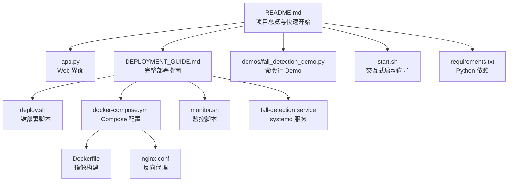
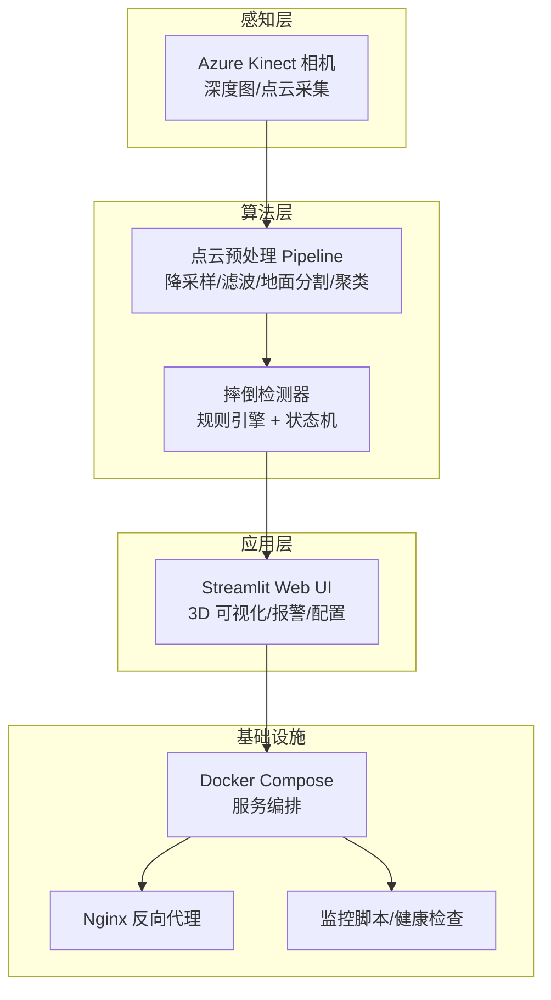
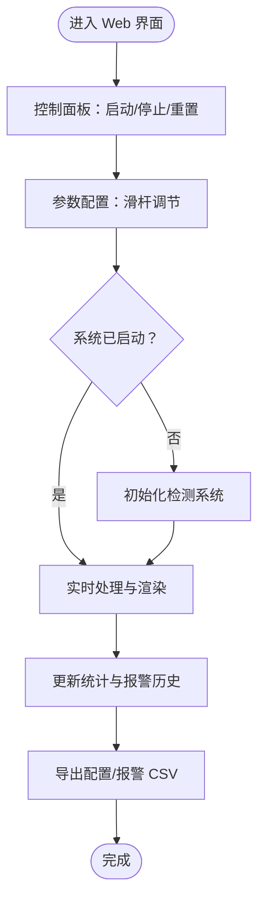
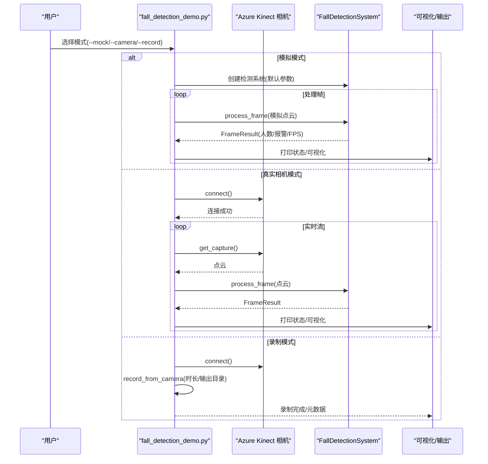
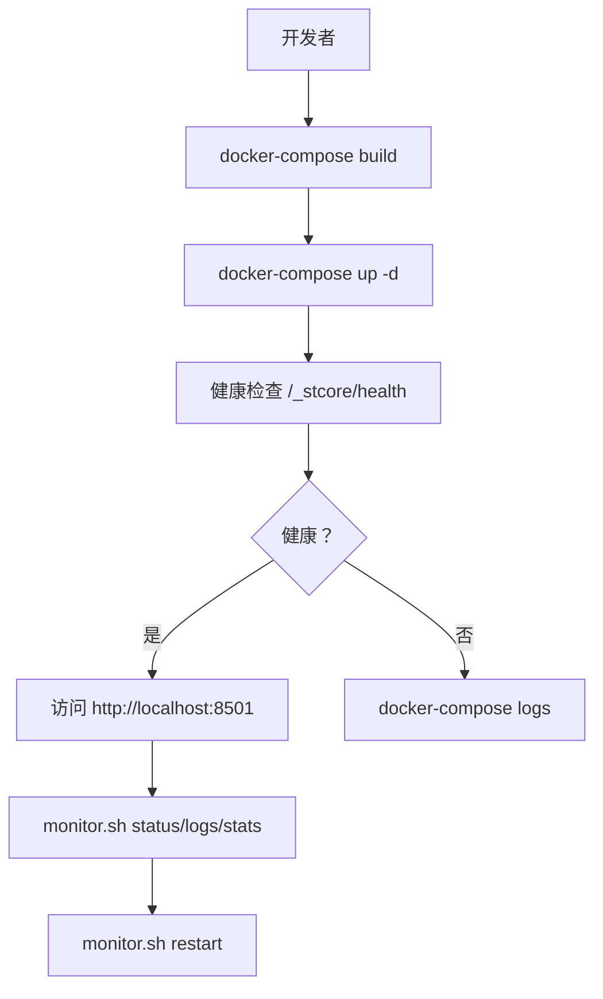
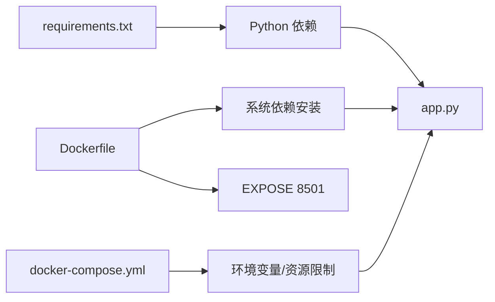

# 快速开始

<cite>
**本文引用的文件**
- [README.md](file://README.md)
- [DEPLOYMENT_GUIDE.md](file://docs/DEPLOYMENT_GUIDE.md)
- [deploy.sh](file://deploy.sh)
- [docker-compose.yml](file://docker-compose.yml)
- [Dockerfile](file://Dockerfile)
- [nginx.conf](file://nginx.conf)
- [app.py](file://app.py)
- [requirements.txt](file://requirements.txt)
- [demos/fall_detection_demo.py](file://demos/fall_detection_demo.py)
- [start.sh](file://start.sh)
- [monitor.sh](file://monitor.sh)
- [fall-detection.service](file://fall-detection.service)
</cite>

## 目录
1. [简介](#简介)
2. [项目结构](#项目结构)
3. [核心组件](#核心组件)
4. [架构总览](#架构总览)
5. [详细组件分析](#详细组件分析)
6. [依赖关系分析](#依赖关系分析)
7. [性能与环境要求](#性能与环境要求)
8. [部署方式详解](#部署方式详解)
9. [Web 界面与功能演示](#web-界面与功能演示)
10. [验证与常见问题](#验证与常见问题)
11. [故障排查指南](#故障排查指南)
12. [结论](#结论)

## 简介
GuardianFall 是一个基于 3D 视觉的室内人体摔倒实时预警系统，通过点云数据进行人体检测与摔倒识别，具备隐私保护、实时性与高精度的特点。系统提供多种部署方式，包括一键部署、Docker Compose、手动运行与命令行 Demo，满足不同技术背景用户的上手需求。

## 项目结构
- 应用入口与界面：app.py（Streamlit Web UI）
- 部署与容器化：Dockerfile、docker-compose.yml、deploy.sh、nginx.conf
- 演示与命令行：demos/fall_detection_demo.py、start.sh
- 监控与服务：monitor.sh、fall-detection.service
- 依赖与环境：requirements.txt

**图表来源**
- [README.md](file://README.md)
- [DEPLOYMENT_GUIDE.md](file://docs/DEPLOYMENT_GUIDE.md)
- [app.py](file://app.py)
- [deploy.sh](file://deploy.sh)
- [docker-compose.yml](file://docker-compose.yml)
- [Dockerfile](file://Dockerfile)
- [nginx.conf](file://nginx.conf)
- [demos/fall_detection_demo.py](file://demos/fall_detection_demo.py)
- [start.sh](file://start.sh)
- [monitor.sh](file://monitor.sh)
- [fall-detection.service](file://fall-detection.service)
- [requirements.txt](file://requirements.txt)

**章节来源**
- [README.md](file://README.md)
- [DEPLOYMENT_GUIDE.md](file://docs/DEPLOYMENT_GUIDE.md)

## 核心组件
- Web 界面（Streamlit）：实时点云展示、检测结果、报警历史、参数配置与数据管理
- 摔倒检测系统：点云预处理（降采样、滤波、地面分割、聚类）、规则引擎检测、报警回调
- 数据采集与录制：Azure Kinect SDK 封装、点云录制器
- 容器化与部署：Docker 镜像构建、Compose 服务编排、Nginx 反代、systemd 服务
- 监控与运维：健康检查、日志轮转、资源监控、自动重启

**章节来源**
- [app.py](file://app.py)
- [demos/fall_detection_demo.py](file://demos/fall_detection_demo.py)
- [docker-compose.yml](file://docker-compose.yml)
- [Dockerfile](file://Dockerfile)
- [nginx.conf](file://nginx.conf)
- [monitor.sh](file://monitor.sh)
- [fall-detection.service](file://fall-detection.service)

## 架构总览
系统采用分层架构，从感知层（深度相机）到应用层（Web UI），中间通过预处理与检测算法实现端到端实时推理，并通过容器化与反向代理提供稳定的对外服务。

**图表来源**
- [app.py](file://app.py)
- [demos/fall_detection_demo.py](file://demos/fall_detection_demo.py)
- [docker-compose.yml](file://docker-compose.yml)
- [nginx.conf](file://nginx.conf)
- [monitor.sh](file://monitor.sh)

## 详细组件分析

### Web 界面（Streamlit）
- 功能模块：实时监控、统计图表、报警历史、数据管理
- 控制面板：启动/停止/重置系统；参数调节（体素尺寸、高度骤降阈值、速度阈值、确认帧数、帧率）
- 实时可视化：3D 点云渲染、处理时延与 FPS 统计
- 数据管理：数据集浏览、配置导入导出

**图表来源**
- [app.py](file://app.py)

**章节来源**
- [app.py](file://app.py)

### 命令行 Demo（模拟/真实相机）
- 模拟数据：生成模拟点云，演示摔倒过程，输出报警与统计
- 真实相机：连接 Azure Kinect，实时采集点云并进行检测
- 录制模式：将点云数据录制为数据集，便于离线训练与分析

**图表来源**
- [demos/fall_detection_demo.py](file://demos/fall_detection_demo.py)

**章节来源**
- [demos/fall_detection_demo.py](file://demos/fall_detection_demo.py)

### 容器化与部署
- Dockerfile：基础镜像、系统依赖、Python 依赖、健康检查、启动命令
- docker-compose.yml：主应用服务、Redis 缓存、Nginx 反代、资源限制、健康检查、日志策略、网络隔离
- deploy.sh：一键部署脚本，自动安装 Docker/Docker Compose、构建镜像、启动服务、健康检查、显示访问信息
- nginx.conf：反向代理、HTTPS、WebSocket 支持、安全头、健康检查端点
- monitor.sh：服务状态检查、资源使用、日志查看、统计信息、自动重启
- fall-detection.service：systemd 服务，开机自启、重启策略、工作目录

**图表来源**
- [Dockerfile](file://Dockerfile)
- [docker-compose.yml](file://docker-compose.yml)
- [deploy.sh](file://deploy.sh)
- [nginx.conf](file://nginx.conf)
- [monitor.sh](file://monitor.sh)

**章节来源**
- [Dockerfile](file://Dockerfile)
- [docker-compose.yml](file://docker-compose.yml)
- [deploy.sh](file://deploy.sh)
- [nginx.conf](file://nginx.conf)
- [monitor.sh](file://monitor.sh)
- [fall-detection.service](file://fall-detection.service)

## 依赖关系分析
- Python 依赖：numpy、scipy、open3d、torch、matplotlib、streamlit、plotly、pandas、pytest 等
- 系统依赖：libgl1-mesa-glx、libglib2.0-0、ffmpeg、libsm6、libxext6 等
- 容器内暴露端口：8501（Streamlit）
- 环境变量：STREAMLIT_SERVER_*、LOG_LEVEL、检测阈值参数

**图表来源**
- [requirements.txt](file://requirements.txt)
- [Dockerfile](file://Dockerfile)
- [docker-compose.yml](file://docker-compose.yml)
- [app.py](file://app.py)

**章节来源**
- [requirements.txt](file://requirements.txt)
- [Dockerfile](file://Dockerfile)
- [docker-compose.yml](file://docker-compose.yml)
- [app.py](file://app.py)

## 性能与环境要求
- 硬件建议：2 核 CPU、2GB+ 内存、SSD 存储、USB 3.0 接口（相机）
- 系统要求：Linux（Ubuntu/Debian）或兼容发行版，Docker 20.10+、Docker Compose 2.0+
- 网络：开放 80/443（生产环境，可选 Nginx）与 8501（本地调试）
- 性能指标：平均 FPS > 20、单帧耗时 < 100ms、内存占用 < 2GB、CPU 占用 < 50%

**章节来源**
- [DEPLOYMENT_GUIDE.md](file://docs/DEPLOYMENT_GUIDE.md)
- [README.md](file://README.md)

## 部署方式详解

### 方式一：一键部署（推荐）
- 适用人群：希望最快上线、无需手工配置
- 前置条件：Linux 服务器、root 权限、网络可达
- 步骤要点：
  - 赋权并执行一键部署脚本
  - 自动安装 Docker 与 Docker Compose
  - 构建镜像、启动服务、健康检查
  - 显示本地与远程访问地址
- 常用命令：
  - 查看状态：docker-compose ps
  - 查看日志：docker-compose logs -f
  - 重启服务：docker-compose restart
  - 停止服务：docker-compose down
  - 更新部署：./deploy.sh update
  - 清理资源：./deploy.sh cleanup

**章节来源**
- [README.md](file://README.md)
- [DEPLOYMENT_GUIDE.md](file://docs/DEPLOYMENT_GUIDE.md)
- [deploy.sh](file://deploy.sh)

### 方式二：Docker Compose
- 适用人群：熟悉容器化、需要灵活控制
- 前置条件：Docker 与 Docker Compose
- 步骤要点：
  - docker-compose up -d --build
  - 配置 Nginx 反代（生产环境可选）
  - 调整环境变量与资源限制
- 常用命令：
  - 查看状态与日志
  - 重启与停止
  - 清理镜像与数据卷

**章节来源**
- [README.md](file://README.md)
- [DEPLOYMENT_GUIDE.md](file://docs/DEPLOYMENT_GUIDE.md)
- [docker-compose.yml](file://docker-compose.yml)
- [nginx.conf](file://nginx.conf)

### 方式三：手动运行
- 适用人群：学习与开发、无需容器化
- 前置条件：Python 3.10+、系统依赖
- 步骤要点：
  - 创建虚拟环境、安装依赖
  - 启动 Streamlit：streamlit run app.py --server.address 0.0.0.0 --server.port 8501
  - 可配合 systemd 服务长期运行
- 常用命令：
  - 激活虚拟环境
  - 启动 Web 界面
  - 管理 systemd 服务

**章节来源**
- [README.md](file://README.md)
- [DEPLOYMENT_GUIDE.md](file://docs/DEPLOYMENT_GUIDE.md)
- [requirements.txt](file://requirements.txt)
- [app.py](file://app.py)
- [fall-detection.service](file://fall-detection.service)

### 方式四：命令行 Demo
- 适用人群：快速验证算法与数据流
- 前置条件：Python 环境
- 步骤要点：
  - 模拟数据：python demos/fall_detection_demo.py --mock
  - 真实相机：python demos/fall_detection_demo.py --camera（需安装 pyk4a）
  - 录制数据集：python demos/fall_detection_demo.py --record --output ./dataset --duration 30
- 常用命令：
  - 查看帮助与示例
  - 根据硬件选择模式

**章节来源**
- [README.md](file://README.md)
- [demos/fall_detection_demo.py](file://demos/fall_detection_demo.py)

## Web 界面与功能演示
- 访问地址：http://localhost:8501（本地）；远程访问需配置反向代理与域名
- 主要功能：
  - 实时监控：3D 点云视图、人数统计、摔倒状态、处理时延
  - 统计图表：FPS 趋势、处理时间、报警分布
  - 报警历史：筛选与导出 CSV
  - 数据管理：数据集浏览、配置导入导出
- 基本操作：
  - 在侧边栏点击“启动”开始实时检测
  - 调整参数后保存，系统将自动重启以应用新配置
  - 在“数据管理”中导出配置或查看数据集元数据

**章节来源**
- [README.md](file://README.md)
- [app.py](file://app.py)
- [nginx.conf](file://nginx.conf)

## 验证与常见问题
- 验证服务是否运行：
  - curl -I http://localhost:8501
  - docker-compose ps 查看容器状态
  - docker-compose logs -f fall-detection 查看日志
- 常见问题与解决：
  - 端口被占用：检查 8501 端口占用并释放
  - 内存不足：增加内存或降低点云精度/帧率
  - 相机连接失败：检查 USB 3.0 线缆、驱动与占用情况
  - Docker 相关：重置系统并重新构建

**章节来源**
- [DEPLOYMENT_GUIDE.md](file://docs/DEPLOYMENT_GUIDE.md)
- [monitor.sh](file://monitor.sh)

## 故障排查指南
- 服务无法启动：
  - 检查 Docker 与 Compose 状态
  - 查看详细日志定位异常
- 无法访问 Web 界面：
  - 检查防火墙与端口监听
  - 若使用 Nginx，确认反代与证书配置
- 性能低下：
  - 降低体素尺寸、帧率或升级硬件
  - 使用 SSD 存储与更高内存
- 频繁崩溃：
  - 增加 Swap 空间
  - 查看崩溃日志并分析异常
- Docker 相关：
  - 停止容器、删除镜像、清理系统后重建

**章节来源**
- [DEPLOYMENT_GUIDE.md](file://docs/DEPLOYMENT_GUIDE.md)

## 结论
通过以上四种部署方式，用户可以快速在本地或生产环境中启动 GuardianFall 系统。建议初学者优先使用一键部署或 Docker Compose，具备开发与学习需求的用户可选择手动运行或命令行 Demo。结合监控脚本与反向代理，系统可在生产环境下稳定运行并持续优化性能。