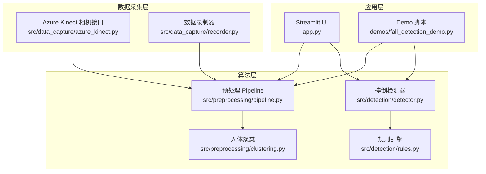
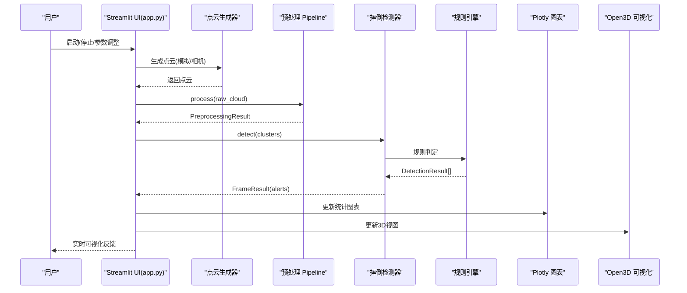
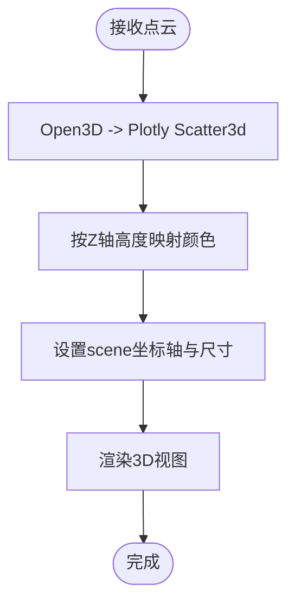
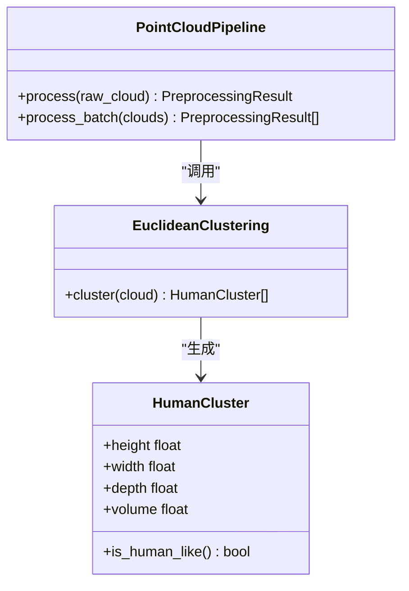
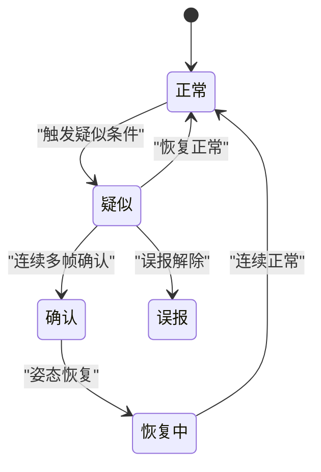
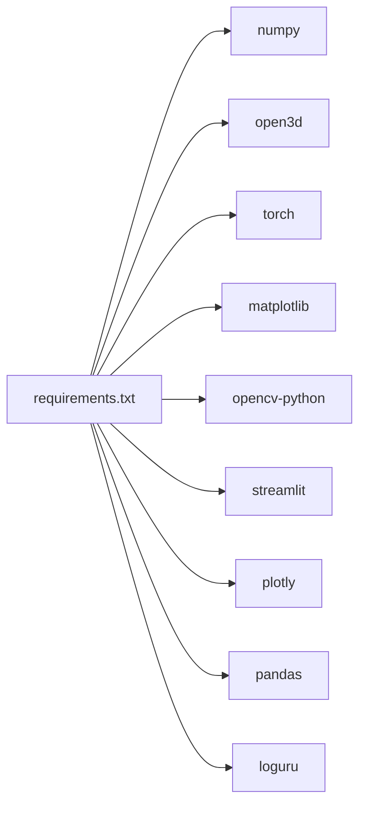

# 可视化组件扩展

<cite>
**本文引用的文件**
- [app.py](file://app.py)
- [demos/fall_detection_demo.py](file://demos/fall_detection_demo.py)
- [src/data_capture/recorder.py](file://src/data_capture/recorder.py)
- [src/detection/detector.py](file://src/detection/detector.py)
- [src/detection/rules.py](file://src/detection/rules.py)
- [src/preprocessing/pipeline.py](file://src/preprocessing/pipeline.py)
- [src/preprocessing/clustering.py](file://src/preprocessing/clustering.py)
- [requirements.txt](file://requirements.txt)
- [README.md](file://README.md)
</cite>

## 目录
1. [简介](#简介)
2. [项目结构](#项目结构)
3. [核心组件](#核心组件)
4. [架构总览](#架构总览)
5. [详细组件分析](#详细组件分析)
6. [依赖分析](#依赖分析)
7. [性能考虑](#性能考虑)
8. [故障排查指南](#故障排查指南)
9. [结论](#结论)
10. [附录](#附录)

## 简介
本指南面向希望为GuardianFall系统开发“可视化组件扩展”的工程师与产品同学，围绕以下目标展开：
- 如何开发新的可视化插件与扩展3D渲染能力
- 如何定制Streamlit组件、自定义图表绘制与实现实时数据可视化
- 如何开发新的显示模式、交互式控件与主题定制
- 如何优化可视化性能、内存管理与渲染效率
- 提供从UI设计到数据绑定的完整实现路径与参考示例

GuardianFall系统以Streamlit为前端UI框架，结合Open3D与Plotly进行3D点云与统计图表的可视化，并通过规则引擎驱动的摔倒检测系统提供实时数据源。本文将基于现有代码结构，给出可落地的扩展策略与最佳实践。

## 项目结构
GuardianFall采用模块化分层组织：
- 应用入口：Streamlit页面与组件布局
- 数据采集：Azure Kinect相机接入与数据录制
- 预处理：点云降采样、滤波、地面分割、人体聚类
- 检测：规则引擎与状态机驱动的摔倒检测
- 可视化：3D点云、统计图表、报警历史与数据管理

**图表来源**
- [app.py](file://app.py)
- [demos/fall_detection_demo.py](file://demos/fall_detection_demo.py)
- [src/data_capture/recorder.py](file://src/data_capture/recorder.py)
- [src/detection/detector.py](file://src/detection/detector.py)
- [src/detection/rules.py](file://src/detection/rules.py)
- [src/preprocessing/pipeline.py](file://src/preprocessing/pipeline.py)
- [src/preprocessing/clustering.py](file://src/preprocessing/clustering.py)

**章节来源**
- [README.md](file://README.md)
- [app.py](file://app.py)
- [demos/fall_detection_demo.py](file://demos/fall_detection_demo.py)

## 核心组件
- Streamlit UI与布局：页面配置、侧边栏控制面板、选项卡布局、占位符与图表容器
- 3D可视化：Open3D点云与Plotly 3D散点图桥接
- 实时数据流：模拟/真实相机数据生成器、连续处理管道
- 统计图表：Plotly折线图、饼图、数据表与CSV导出
- 报警与历史：SystemAlert回调、历史列表与过滤
- 数据管理：配置导入导出、数据集列表与元数据展示

**章节来源**
- [app.py](file://app.py)
- [src/detection/detector.py](file://src/detection/detector.py)
- [src/detection/rules.py](file://src/detection/rules.py)
- [src/preprocessing/pipeline.py](file://src/preprocessing/pipeline.py)
- [src/preprocessing/clustering.py](file://src/preprocessing/clustering.py)
- [src/data_capture/recorder.py](file://src/data_capture/recorder.py)

## 架构总览
GuardianFall的可视化架构以Streamlit为入口，将实时点云与检测结果通过Plotly与Open3D进行渲染；同时提供统计图表与报警历史展示，形成完整的可视化闭环。

**图表来源**
- [app.py](file://app.py)
- [src/detection/detector.py](file://src/detection/detector.py)
- [src/detection/rules.py](file://src/detection/rules.py)
- [src/preprocessing/pipeline.py](file://src/preprocessing/pipeline.py)
- [src/preprocessing/clustering.py](file://src/preprocessing/clustering.py)

## 详细组件分析

### Streamlit UI与布局扩展
- 页面配置：标题、图标、布局与侧边栏状态
- 自定义CSS：告警卡片、状态卡样式
- Session State：系统实例、运行状态、报警历史、帧历史、配置
- 侧边栏控制：启动/停止/重置、参数滑条、配置保存/加载
- 主界面选项卡：实时监控、统计图表、报警历史、数据管理
- 实时监控Tab：状态指标、3D视图、检测结果面板、报警提示
- 统计图表Tab：FPS趋势、处理时间、报警分布
- 报警历史Tab：过滤、表格展示、CSV导出
- 数据管理Tab：数据集列表、配置导入导出、当前配置展示

扩展建议：
- 新增显示模式：在选项卡中新增“高级模式”，切换3D视图渲染质量、点云密度、聚类框显示等
- 交互式控件：在侧边栏增加“显示模式”下拉菜单，动态切换渲染管线（如降采样强度、聚类容忍度）
- 主题定制：通过Session State切换浅/深色主题，配合CSS变量实现

**章节来源**
- [app.py](file://app.py)

### 3D渲染与点云可视化
- 点云到Plotly转换：将Open3D点云转为Scatter3d，按Z轴高度着色
- 3D视图布局：scene坐标轴范围、宽高、标题
- 实时渲染：空闲时显示静态示例图，运行时每帧生成并更新
- 性能控制：通过sleep控制帧率，避免UI阻塞

扩展建议：
- 新渲染模式：支持多视角拼接、聚类包围盒叠加、轨迹线绘制
- 交互增强：点击/悬停显示簇ID、高度、置信度
- 渲染优化：批量更新、缓存最近N帧、限制最大点数

**图表来源**
- [app.py](file://app.py)

**章节来源**
- [app.py](file://app.py)

### 统计图表与实时可视化
- FPS趋势：基于帧处理时间反推FPS，折线图展示
- 处理时间：单帧处理时间折线图
- 报警统计：确认/疑似数量与饼图
- 数据表格：报警历史表格，列配置与CSV导出

扩展建议：
- 新图表：热力图（高度-速度二维分布）、柱状图（各簇置信度）
- 实时刷新：使用st.empty()占位符与st.experimental_rerun()控制刷新频率
- 交互筛选：按时间范围、报警级别筛选

**章节来源**
- [app.py](file://app.py)

### 报警历史与数据管理
- 报警历史：按级别过滤、时间格式化、消息展示
- 数据管理：数据集目录扫描、元数据解析、导出配置、当前配置JSON展示

扩展建议：
- 新显示模式：报警历史地图（按时间轴动画）、报警密度热力图
- 数据管理：支持上传数据集、标注导入导出、数据集对比分析

**章节来源**
- [app.py](file://app.py)

### 预处理Pipeline与聚类扩展
- Pipeline：体素降采样、统计滤波、地面分割、聚类
- 聚类：欧式聚类、DBSCAN、多视角融合
- 可视化：聚类结果点云与包围盒

扩展建议：
- 新显示模式：聚类过程可视化（每步输出中间点云）
- 交互控件：聚类容忍度、最小/最大簇点数滑条
- 性能优化：批处理、缓存中间结果、增量更新

**图表来源**
- [src/preprocessing/pipeline.py](file://src/preprocessing/pipeline.py)
- [src/preprocessing/clustering.py](file://src/preprocessing/clustering.py)

**章节来源**
- [src/preprocessing/pipeline.py](file://src/preprocessing/pipeline.py)
- [src/preprocessing/clustering.py](file://src/preprocessing/clustering.py)

### 摔倒检测规则引擎扩展
- 状态机：NORMAL/SUSPECTED/CONFIRMED/RECOVERING/FALSE_ALARM
- 检测指标：高度变化、垂直速度、宽高比、躺倒姿态
- 报警级别：info/warning/critical
- Tracker：按簇ID跟踪状态与历史

扩展建议：
- 新显示模式：状态机可视化（状态转移图）、检测指标仪表盘
- 交互控件：阈值滑条（高度骤降、速度、确认帧数）
- 统计面板：误报率、报警率、恢复时间

**图表来源**
- [src/detection/rules.py](file://src/detection/rules.py)

**章节来源**
- [src/detection/rules.py](file://src/detection/rules.py)

### 数据采集与录制扩展
- 录制器：开始/停止录制、元数据保存、帧信息记录
- 数据集：加载、迭代、标注、播放、导出
- Demo：模拟数据、真实相机、录制模式

扩展建议：
- 新显示模式：录制进度可视化、帧率曲线、标注面板
- 交互控件：录制时长、帧率、输出目录选择
- 数据管理：数据集对比、标注统计、回放控制

**章节来源**
- [src/data_capture/recorder.py](file://src/data_capture/recorder.py)
- [demos/fall_detection_demo.py](file://demos/fall_detection_demo.py)

## 依赖分析
- 核心库：numpy、open3d、torch、matplotlib、opencv-python、streamlit、plotly、pandas、loguru
- 可视化：Open3D用于3D几何处理，Plotly用于2D/3D图表，Streamlit用于Web UI
- 数据流：点云生成器 -> Pipeline -> 检测器 -> 报警回调 -> UI渲染

**图表来源**
- [requirements.txt](file://requirements.txt)

**章节来源**
- [requirements.txt](file://requirements.txt)

## 性能考虑
- 渲染优化
  - 限制点云数量：在3D视图中限制最大点数，或按帧率降采样
  - 批量更新：使用st.empty()占位符，按需更新Plotly图表
  - 缓存策略：缓存最近N帧的聚类结果与检测结果，避免重复计算
- 内存管理
  - 控制Session State长度：报警历史与帧历史维持固定长度
  - 及时释放中间对象：处理完成后清理临时变量
- 渲染效率
  - 降低3D渲染复杂度：关闭包围盒/轨迹线等非必要元素
  - 控制刷新频率：通过sleep或定时器控制帧率，避免UI阻塞
- 算法优化
  - 聚类参数调优：cluster_tolerance、min_cluster_size等
  - 检测阈值：height_drop_threshold、velocity_threshold、confirmation_frames

[本节为通用性能建议，不直接分析具体文件]

## 故障排查指南
- Streamlit页面空白或报错
  - 检查依赖安装：确保requirements.txt中包版本满足要求
  - 检查Open3D与Plotly版本兼容性
- 3D视图不显示
  - 确认点云非空且包含有效点
  - 检查scene坐标轴范围与aspectmode
- 报警历史为空
  - 确认系统已运行且存在报警回调
  - 检查Session State初始化
- 数据集无法加载
  - 确认metadata.json存在且格式正确
  - 检查帧文件路径与权限

**章节来源**
- [app.py](file://app.py)
- [src/data_capture/recorder.py](file://src/data_capture/recorder.py)

## 结论
通过以上分析与扩展建议，开发者可以在GuardianFall系统中：
- 以Streamlit为入口，灵活扩展可视化组件与交互控件
- 以Open3D与Plotly为核心，构建高质量的3D与2D可视化
- 以规则引擎与Pipeline为基础，实现可配置的检测与渲染模式
- 以数据采集与录制模块为支撑，完善数据管理与回放能力

建议优先实现“显示模式切换”、“交互式控件”与“主题定制”，再逐步引入“新渲染模式”和“新图表类型”，以渐进式方式提升用户体验与系统可扩展性。

[本节为总结性内容，不直接分析具体文件]

## 附录

### 开发与集成步骤（从UI到数据绑定）
- 设计UI布局：在app.py中新增选项卡或侧边栏控件
- 定义数据通道：通过Session State或回调函数传递数据
- 实现渲染逻辑：在3D/2D渲染函数中接入新数据
- 性能优化：限制点数、缓存中间结果、控制刷新频率
- 测试验证：使用demos/fall_detection_demo.py验证端到端流程

**章节来源**
- [app.py](file://app.py)
- [demos/fall_detection_demo.py](file://demos/fall_detection_demo.py)