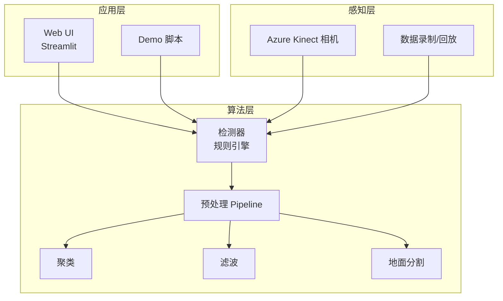
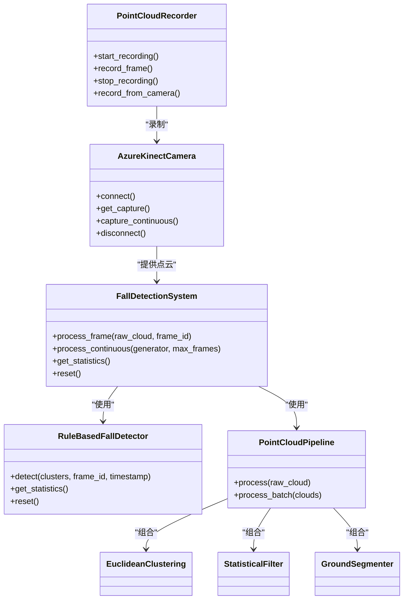
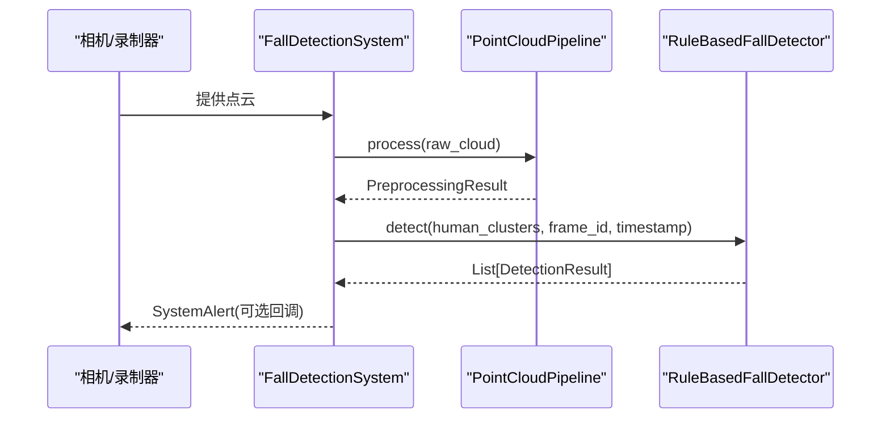
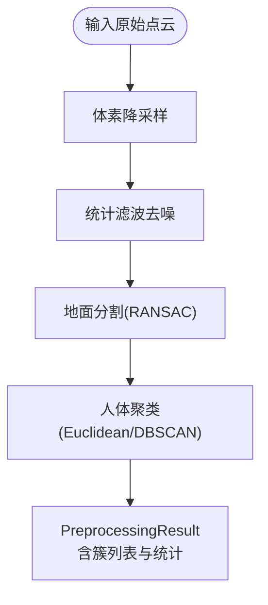
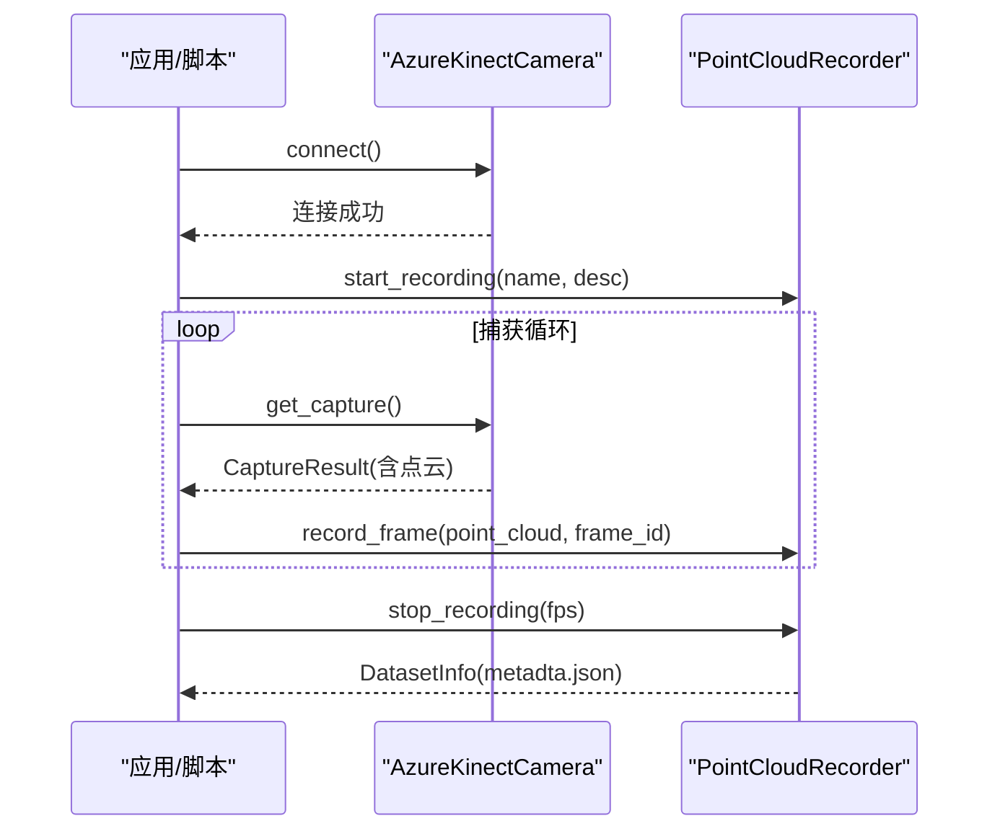
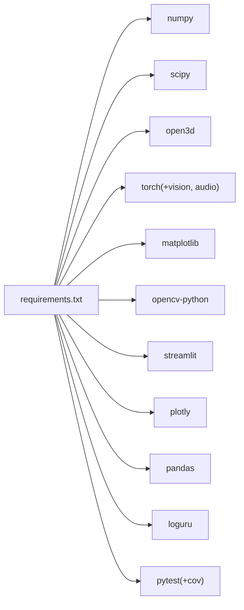

# 扩展开发

<cite>
**本文引用的文件**
- [README.md](file://README.md)
- [app.py](file://app.py)
- [src/detection/detector.py](file://src/detection/detector.py)
- [src/detection/rules.py](file://src/detection/rules.py)
- [src/preprocessing/pipeline.py](file://src/preprocessing/pipeline.py)
- [src/preprocessing/clustering.py](file://src/preprocessing/clustering.py)
- [src/preprocessing/filtering.py](file://src/preprocessing/filtering.py)
- [src/preprocessing/segmentation.py](file://src/preprocessing/segmentation.py)
- [src/data_capture/recorder.py](file://src/data_capture/recorder.py)
- [src/data_capture/azure_kinect.py](file://src/data_capture/azure_kinect.py)
- [demos/fall_detection_demo.py](file://demos/fall_detection_demo.py)
- [requirements.txt](file://requirements.txt)
</cite>

## 目录
1. [简介](#简介)
2. [项目结构](#项目结构)
3. [核心组件](#核心组件)
4. [架构总览](#架构总览)
5. [详细组件分析](#详细组件分析)
6. [依赖分析](#依赖分析)
7. [性能考虑](#性能考虑)
8. [故障排查指南](#故障排查指南)
9. [结论](#结论)
10. [附录](#附录)

## 简介
本指南面向希望为GuardianFall系统进行扩展开发的工程师，围绕插件开发方法、新功能集成流程、第三方系统集成方案展开，系统阐述系统的扩展点设计、接口抽象与模块化架构，并提供检测算法集成、可视化组件开发、数据格式扩展、模型训练与部署、性能优化及新硬件支持的实践路径。文档同时给出最佳实践与设计原则，帮助在保证系统稳定性的同时高效迭代。

## 项目结构
GuardianFall采用分层模块化架构，核心分为“感知层-边缘层-算法层-应用层-部署”五层，代码集中在src目录下，配合demo与UI入口，形成从数据采集到实时可视化的完整链路。

**图表来源**
- [app.py:1-662](file://app.py#L1-L662)
- [src/detection/detector.py:1-373](file://src/detection/detector.py#L1-L373)
- [src/preprocessing/pipeline.py:1-337](file://src/preprocessing/pipeline.py#L1-L337)
- [src/data_capture/azure_kinect.py:1-532](file://src/data_capture/azure_kinect.py#L1-L532)
- [src/data_capture/recorder.py:1-489](file://src/data_capture/recorder.py#L1-L489)

**章节来源**
- [README.md:61-96](file://README.md#L61-L96)
- [app.py:1-662](file://app.py#L1-L662)
- [src/detection/detector.py:1-373](file://src/detection/detector.py#L1-L373)
- [src/preprocessing/pipeline.py:1-337](file://src/preprocessing/pipeline.py#L1-L337)
- [src/data_capture/azure_kinect.py:1-532](file://src/data_capture/azure_kinect.py#L1-L532)
- [src/data_capture/recorder.py:1-489](file://src/data_capture/recorder.py#L1-L489)

## 核心组件
- 检测系统主控制器：负责接收点云、调度预处理与检测、生成报警并统计性能。
- 规则引擎：基于高度骤降、速度、姿态、静止等规则的状态机检测器。
- 预处理Pipeline：统一的点云处理流水线，包含体素降采样、统计滤波、地面分割、人体聚类。
- 数据采集与录制：封装Azure Kinect相机SDK，提供点云采集、录制与回放能力。
- Web UI：Streamlit界面，展示实时点云、检测结果、报警历史与系统统计。

**章节来源**
- [src/detection/detector.py:75-283](file://src/detection/detector.py#L75-L283)
- [src/detection/rules.py:226-423](file://src/detection/rules.py#L226-L423)
- [src/preprocessing/pipeline.py:65-178](file://src/preprocessing/pipeline.py#L65-L178)
- [src/data_capture/azure_kinect.py:47-460](file://src/data_capture/azure_kinect.py#L47-L460)
- [app.py:104-420](file://app.py#L104-L420)

## 架构总览
系统采用“模块化+工厂函数+回调”的扩展点设计，便于替换算法、接入新硬件与第三方系统。

**图表来源**
- [src/detection/detector.py:75-283](file://src/detection/detector.py#L75-L283)
- [src/detection/rules.py:226-423](file://src/detection/rules.py#L226-L423)
- [src/preprocessing/pipeline.py:65-178](file://src/preprocessing/pipeline.py#L65-L178)
- [src/preprocessing/clustering.py:99-181](file://src/preprocessing/clustering.py#L99-L181)
- [src/preprocessing/filtering.py:13-139](file://src/preprocessing/filtering.py#L13-L139)
- [src/preprocessing/segmentation.py:13-81](file://src/preprocessing/segmentation.py#L13-L81)
- [src/data_capture/azure_kinect.py:47-460](file://src/data_capture/azure_kinect.py#L47-L460)
- [src/data_capture/recorder.py:48-175](file://src/data_capture/recorder.py#L48-L175)

## 详细组件分析

### 检测系统与规则引擎
- 扩展点：通过构造函数注入预处理配置、检测阈值与确认帧数；支持工厂函数创建系统实例。
- 状态机：PersonTracker维护单人状态（正常/疑似/确认/恢复/误报），基于规则累积置信度并触发报警。
- 回调机制：系统在检测到摔倒时调用alert_callback，便于对接外部通知系统。

**图表来源**
- [src/detection/detector.py:138-227](file://src/detection/detector.py#L138-L227)
- [src/detection/rules.py:266-337](file://src/detection/rules.py#L266-L337)
- [src/preprocessing/pipeline.py:98-139](file://src/preprocessing/pipeline.py#L98-L139)

**章节来源**
- [src/detection/detector.py:75-283](file://src/detection/detector.py#L75-L283)
- [src/detection/rules.py:82-423](file://src/detection/rules.py#L82-L423)

### 预处理Pipeline与模块化
- 扩展点：Pipeline内部组合滤波、地面分割与聚类模块，支持通过配置切换参数；提供批量处理与实时优化版本。
- 数据结构：PreprocessingResult标准化输出，包含原始/滤波/地面/非地面点数、人体簇列表与处理耗时。
- 工厂函数：create_pipeline(mode, ...)支持标准与实时两种模式。

**图表来源**
- [src/preprocessing/pipeline.py:98-139](file://src/preprocessing/pipeline.py#L98-L139)
- [src/preprocessing/filtering.py:28-49](file://src/preprocessing/filtering.py#L28-L49)
- [src/preprocessing/segmentation.py:41-81](file://src/preprocessing/segmentation.py#L41-L81)
- [src/preprocessing/clustering.py:124-181](file://src/preprocessing/clustering.py#L124-L181)

**章节来源**
- [src/preprocessing/pipeline.py:65-178](file://src/preprocessing/pipeline.py#L65-L178)
- [src/preprocessing/filtering.py:13-139](file://src/preprocessing/filtering.py#L13-L139)
- [src/preprocessing/segmentation.py:13-81](file://src/preprocessing/segmentation.py#L13-L81)
- [src/preprocessing/clustering.py:99-181](file://src/preprocessing/clustering.py#L99-L181)

### 数据采集与录制
- 相机封装：AzureKinectCamera提供连接、捕获、连续采集、点云保存与录制元数据。
- 录制器：PointCloudRecorder支持命名录制、帧记录、元数据写入与停止录制；PointCloudDataset支持加载、迭代、标注与导出。

**图表来源**
- [src/data_capture/azure_kinect.py:152-283](file://src/data_capture/azure_kinect.py#L152-L283)
- [src/data_capture/recorder.py:64-175](file://src/data_capture/recorder.py#L64-L175)

**章节来源**
- [src/data_capture/azure_kinect.py:47-460](file://src/data_capture/azure_kinect.py#L47-L460)
- [src/data_capture/recorder.py:48-175](file://src/data_capture/recorder.py#L48-L175)

### Web UI与可视化
- Streamlit界面：提供系统控制、参数配置、实时监控、统计图表、报警历史与数据管理。
- 可视化：将Open3D点云转换为Plotly 3D散点图，支持高度映射与交互缩放。
- 配置持久化：支持导出/导入配置JSON，便于部署与迁移。

**章节来源**
- [app.py:104-652](file://app.py#L104-L652)

## 依赖分析
系统依赖以科学计算与点云处理为核心，结合可视化与UI框架，形成轻量且高效的运行环境。

**图表来源**
- [requirements.txt:1-34](file://requirements.txt#L1-L34)

**章节来源**
- [requirements.txt:1-34](file://requirements.txt#L1-L34)

## 性能考虑
- 处理延迟与吞吐：系统目标单帧<100ms，处理速度>20FPS，内存占用<2GB，CPU占用<50%（2核）。可通过体素降采样、统计滤波与合理的聚类阈值控制。
- 实时优化：RealTimePipeline提供帧级统计与平均FPS计算，便于动态调节参数。
- 算法权衡：规则引擎在准确率与误报率之间通过阈值与确认帧数平衡；聚类置信度评分辅助过滤异常簇。

**章节来源**
- [README.md:201-218](file://README.md#L201-L218)
- [src/preprocessing/pipeline.py:180-248](file://src/preprocessing/pipeline.py#L180-L248)
- [src/detection/rules.py:189-224](file://src/detection/rules.py#L189-L224)

## 故障排查指南
- 相机连接问题：确认USB 3.0线缆、驱动安装与设备占用；参考相机封装的错误提示与日志。
- 依赖缺失：pyk4a未安装会导致相机模块导入失败；确保requirements安装完整。
- 性能异常：若FPS下降，检查体素尺寸、聚类容忍度与滤波参数；必要时降低分辨率或帧率。
- 报警误报：调整高度骤降阈值、速度阈值、确认帧数与宽高比阈值；结合历史统计分析。

**章节来源**
- [src/data_capture/azure_kinect.py:152-191](file://src/data_capture/azure_kinect.py#L152-L191)
- [requirements.txt:1-34](file://requirements.txt#L1-34)
- [src/detection/rules.py:226-423](file://src/detection/rules.py#L226-L423)

## 结论
GuardianFall通过清晰的模块边界与扩展点设计，为二次开发提供了稳健基础。遵循本文的扩展方法与最佳实践，可在不破坏系统稳定性的前提下，快速集成新检测算法、可视化组件、数据格式与硬件平台，并持续优化性能与准确性。

## 附录

### 插件开发方法与最佳实践
- 接口抽象
  - 预处理：实现与PointCloudPipeline一致的process接口，返回PreprocessingResult。
  - 检测：实现与RuleBasedFallDetector一致的detect接口，返回DetectionResult列表。
  - 相机：实现与AzureKinectCamera一致的get_capture接口，返回CaptureResult。
- 工厂函数
  - 为新增组件提供create_*工厂函数，统一参数传递与实例化。
- 回调与事件
  - 使用SystemAlert回调对接外部通知系统；在检测器中记录统计信息以便监控。
- 配置与持久化
  - 通过JSON配置文件管理参数；提供导入/导出功能，便于部署迁移。

**章节来源**
- [src/preprocessing/pipeline.py:251-268](file://src/preprocessing/pipeline.py#L251-L268)
- [src/detection/detector.py:285-299](file://src/detection/detector.py#L285-L299)
- [src/data_capture/azure_kinect.py:462-472](file://src/data_capture/azure_kinect.py#L462-L472)
- [app.py:195-209](file://app.py#L195-L209)

### 新功能集成流程
- 需求分析：明确输入/输出、性能指标与集成点。
- 设计与实现：在src子模块中实现新功能，遵循现有数据结构与接口约定。
- 单元测试：为关键模块编写测试，确保边界条件与异常处理。
- 集成验证：通过demos/fall_detection_demo.py或Web UI进行端到端验证。
- 文档与发布：更新文档与版本日志，按需打包发布。

**章节来源**
- [demos/fall_detection_demo.py:327-373](file://demos/fall_detection_demo.py#L327-L373)
- [docs/README.md:123-145](file://docs/README.md#L123-L145)

### 第三方系统集成方案
- 报警系统：在系统初始化时传入alert_callback，将SystemAlert转发至外部系统（如短信、邮件、推送）。
- 数据存储：通过PointCloudRecorder/PointCloudDataset实现数据采集与回放，支持导出为自定义格式。
- 可视化：在Web UI中扩展Tab或图表，调用Plotly/Streamlit组件渲染检测结果与统计信息。

**章节来源**
- [src/detection/detector.py:104-133](file://src/detection/detector.py#L104-L133)
- [src/data_capture/recorder.py:379-411](file://src/data_capture/recorder.py#L379-L411)
- [app.py:309-652](file://app.py#L309-L652)

### 检测算法集成指南
- 规则引擎扩展：在PersonTracker中增加新规则权重与阈值；在RuleBasedFallDetector中汇总规则结果并更新状态机。
- AI模型集成：预留create_fall_detector('ai_based')占位，按需实现深度学习推理与置信度输出。
- 多传感器融合：在MultiViewClustering中融合多视角点云，提升检测鲁棒性。

**章节来源**
- [src/detection/rules.py:82-423](file://src/detection/rules.py#L82-L423)
- [src/preprocessing/clustering.py:321-373](file://src/preprocessing/clustering.py#L321-L373)
- [src/detection/rules.py:425-446](file://src/detection/rules.py#L425-L446)

### 可视化组件开发
- 3D点云：使用Open3D生成点云几何，转换为Plotly Scatter3d进行渲染。
- 交互控件：在Streamlit中使用滑块、按钮与表单管理参数与状态。
- 历史数据：维护报警历史与帧历史，支持筛选、导出与统计图表。

**章节来源**
- [app.py:168-193](file://app.py#L168-L193)
- [app.py:244-270](file://app.py#L244-L270)
- [app.py:535-588](file://app.py#L535-L588)

### 数据格式扩展方法
- 录制格式：PLY/PCD，元数据包含帧数、时长、FPS与文件列表。
- 导出格式：支持自定义格式（如npy数组）与保留元数据。
- 标注系统：为每帧附加标注字段，支持导出为独立JSON。

**章节来源**
- [src/data_capture/recorder.py:24-46](file://src/data_capture/recorder.py#L24-L46)
- [src/data_capture/recorder.py:379-411](file://src/data_capture/recorder.py#L379-L411)
- [src/data_capture/recorder.py:312-347](file://src/data_capture/recorder.py#L312-L347)

### 模型训练与部署扩展
- 训练数据：使用PointCloudDataset加载与回放数据集，支持标注与统计。
- 导出与部署：导出为常用格式（如npy），结合Docker镜像进行容器化部署。
- 性能监控：通过系统统计接口获取平均FPS与报警率，指导模型优化。

**章节来源**
- [src/data_capture/recorder.py:223-378](file://src/data_capture/recorder.py#L223-L378)
- [src/detection/detector.py:261-272](file://src/detection/detector.py#L261-L272)

### 性能优化扩展策略
- 参数调优：体素尺寸、滤波标准差、聚类容忍度、确认帧数等。
- 算法选择：在EuclideanClustering与DBSCAN之间权衡；RANSAC与渐进形态学滤波的选择。
- 实时性保障：使用RealTimePipeline与帧率控制，避免阻塞UI与回调。

**章节来源**
- [src/preprocessing/pipeline.py:180-248](file://src/preprocessing/pipeline.py#L180-L248)
- [src/preprocessing/clustering.py:223-318](file://src/preprocessing/clustering.py#L223-L318)
- [src/preprocessing/segmentation.py:139-186](file://src/preprocessing/segmentation.py#L139-L186)

### 新硬件支持集成方案
- 相机SDK：封装新硬件SDK，提供与AzureKinectCamera一致的接口（connect/get_capture/capture_continuous）。
- 点云生成：实现深度图到点云的转换，确保有效点过滤与坐标系一致性。
- 录制与回放：沿用PointCloudRecorder/PointCloudDataset流程，适配新硬件的元数据格式。

**章节来源**
- [src/data_capture/azure_kinect.py:285-344](file://src/data_capture/azure_kinect.py#L285-L344)
- [src/data_capture/recorder.py:48-175](file://src/data_capture/recorder.py#L48-L175)