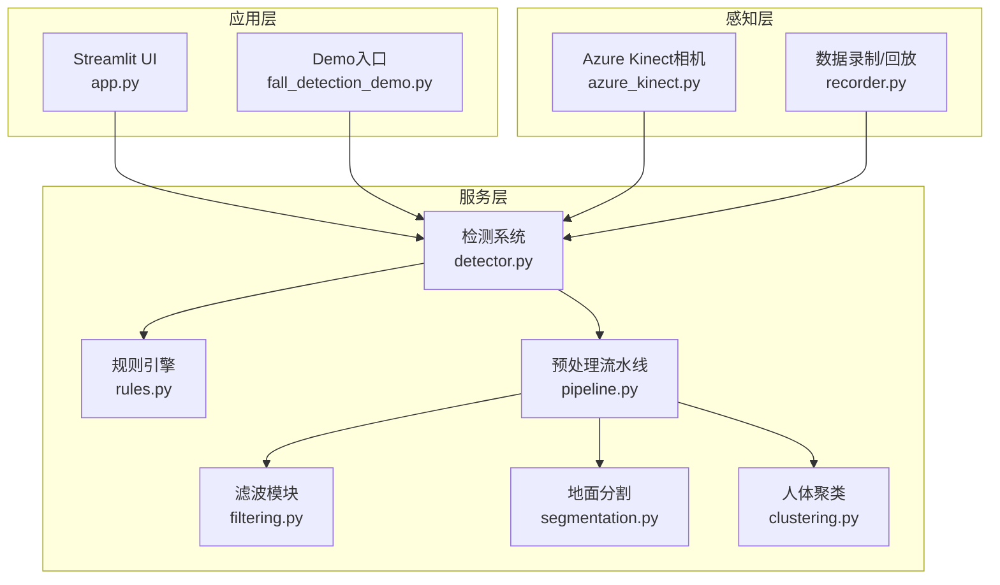
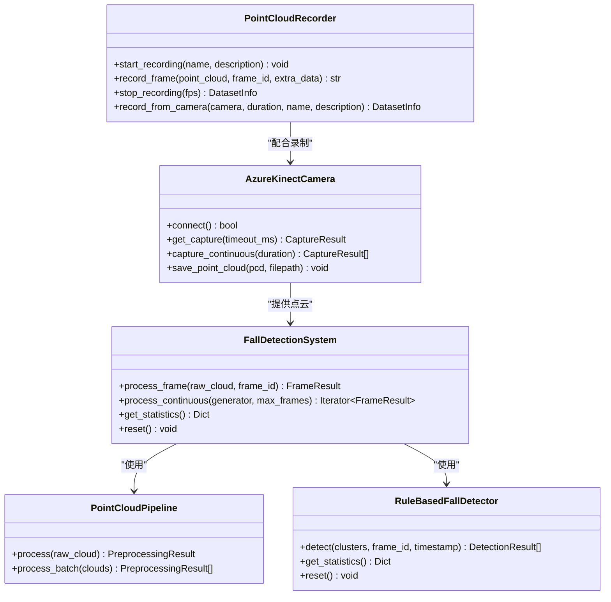
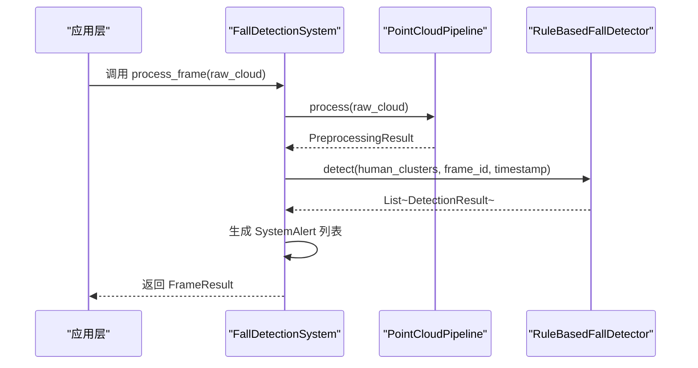
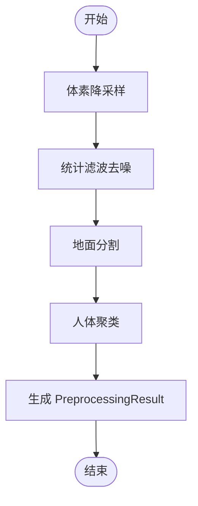
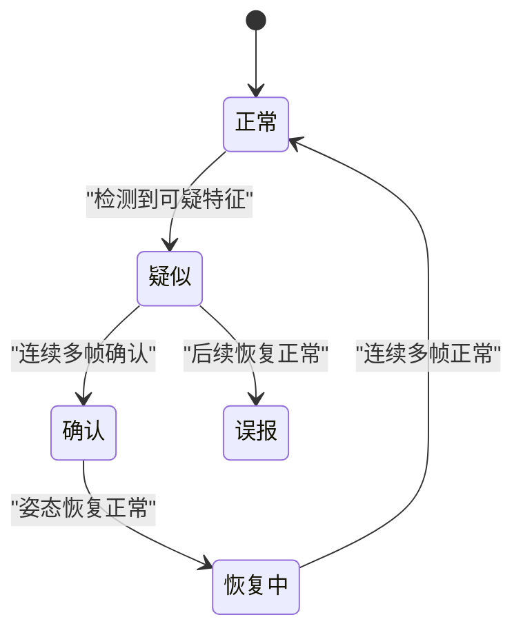
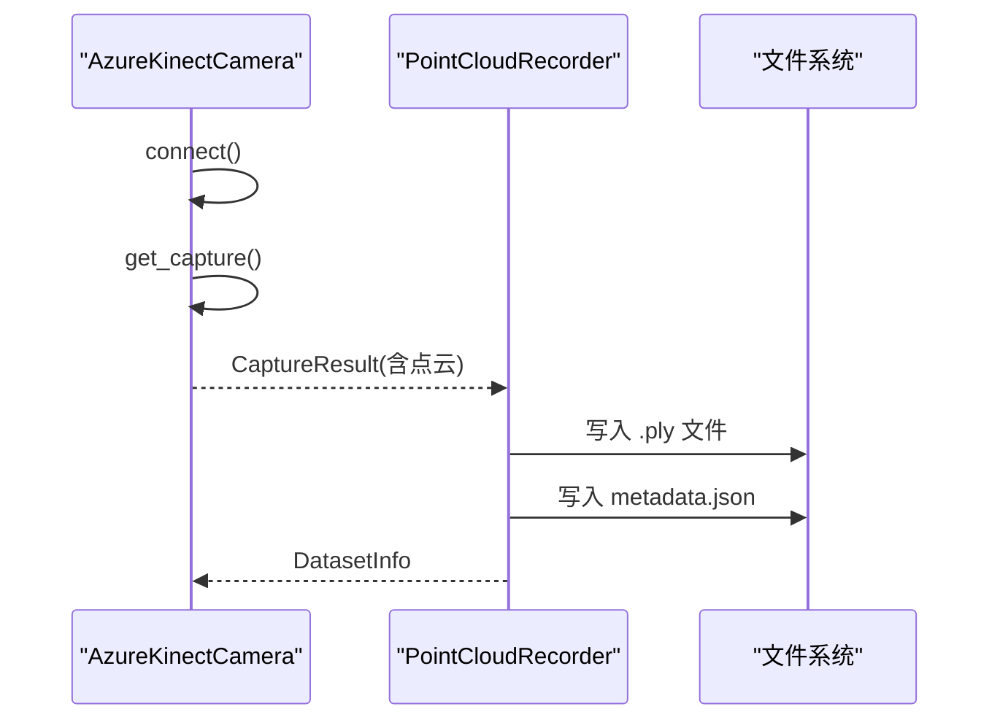
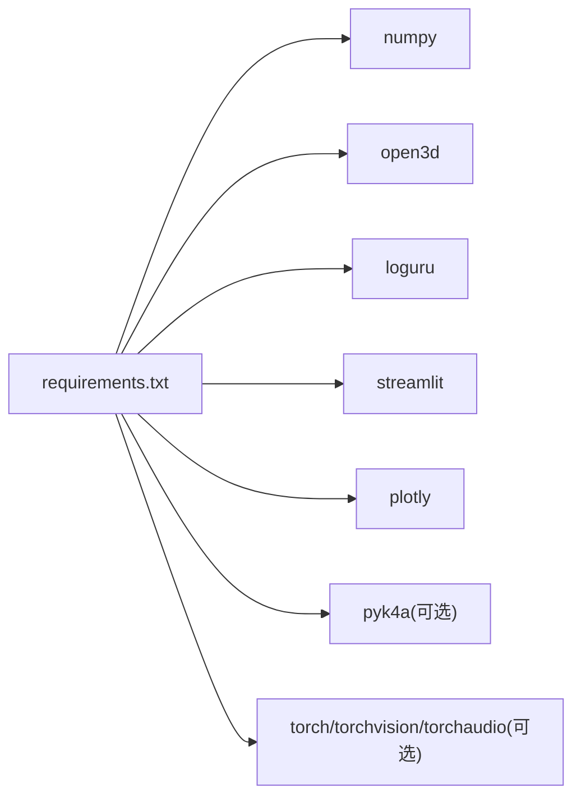

# 插件开发指南

<cite>
**本文引用的文件**
- [app.py](file://app.py)
- [detector.py](file://src/detection/detector.py)
- [rules.py](file://src/detection/rules.py)
- [pipeline.py](file://src/preprocessing/pipeline.py)
- [filtering.py](file://src/preprocessing/filtering.py)
- [segmentation.py](file://src/preprocessing/segmentation.py)
- [clustering.py](file://src/preprocessing/clustering.py)
- [azure_kinect.py](file://src/data_capture/azure_kinect.py)
- [recorder.py](file://src/data_capture/recorder.py)
- [fall_detection_demo.py](file://demos/fall_detection_demo.py)
- [requirements.txt](file://requirements.txt)
- [README.md](file://README.md)
</cite>

## 目录
1. [简介](#简介)
2. [项目结构](#项目结构)
3. [核心组件](#核心组件)
4. [架构总览](#架构总览)
5. [详细组件分析](#详细组件分析)
6. [依赖分析](#依赖分析)
7. [性能考虑](#性能考虑)
8. [故障排除指南](#故障排除指南)
9. [结论](#结论)
10. [附录](#附录)

## 简介
本指南面向希望为GuardianFall系统开发插件的开发者，系统采用模块化架构，围绕“数据采集-预处理-检测-可视化”的流水线组织代码。插件开发的核心在于遵循统一的数据接口、生命周期管理和可扩展的工厂模式，使检测算法、预处理和可视化模块能够灵活替换与组合。

## 项目结构
GuardianFall系统采用分层模块化设计：
- 应用层：Streamlit前端与Demo入口，负责用户交互与可视化
- 服务层：核心检测系统，协调预处理与检测模块
- 感知层：Azure Kinect相机SDK封装，提供点云采集能力

**图表来源**
- [app.py:1-662](file://app.py#L1-L662)
- [detector.py:1-373](file://src/detection/detector.py#L1-L373)
- [pipeline.py:1-337](file://src/preprocessing/pipeline.py#L1-L337)
- [filtering.py:1-189](file://src/preprocessing/filtering.py#L1-L189)
- [segmentation.py:1-243](file://src/preprocessing/segmentation.py#L1-L243)
- [clustering.py:1-495](file://src/preprocessing/clustering.py#L1-L495)
- [azure_kinect.py:1-532](file://src/data_capture/azure_kinect.py#L1-L532)
- [recorder.py:1-489](file://src/data_capture/recorder.py#L1-L489)
- [fall_detection_demo.py:1-373](file://demos/fall_detection_demo.py#L1-L373)

**章节来源**
- [README.md:61-86](file://README.md#L61-L86)
- [app.py:1-662](file://app.py#L1-L662)
- [detector.py:1-373](file://src/detection/detector.py#L1-L373)
- [pipeline.py:1-337](file://src/preprocessing/pipeline.py#L1-L337)

## 核心组件
- 检测系统主控制器：协调预处理与检测模块，提供报警回调与统计信息
- 预处理流水线：封装滤波、地面分割、聚类等步骤，支持批量与实时模式
- 规则引擎：基于状态机的摔倒检测，支持多帧确认与报警分级
- 数据采集与录制：封装Azure Kinect相机，提供录制与回放能力

**章节来源**
- [detector.py:75-283](file://src/detection/detector.py#L75-L283)
- [pipeline.py:65-178](file://src/preprocessing/pipeline.py#L65-L178)
- [rules.py:226-423](file://src/detection/rules.py#L226-L423)
- [azure_kinect.py:47-460](file://src/data_capture/azure_kinect.py#L47-L460)
- [recorder.py:48-176](file://src/data_capture/recorder.py#L48-L176)

## 架构总览
系统通过“工厂函数”和“数据结构契约”实现模块解耦：
- 工厂函数：create_detection_system、create_pipeline、create_filter、create_segmenter、create_clusterer、create_camera、create_recorder
- 数据结构：SystemAlert、FrameResult、PreprocessingResult、HumanCluster、DetectionResult、CaptureResult

**图表来源**
- [detector.py:75-283](file://src/detection/detector.py#L75-L283)
- [pipeline.py:65-178](file://src/preprocessing/pipeline.py#L65-L178)
- [rules.py:226-423](file://src/detection/rules.py#L226-L423)
- [azure_kinect.py:47-460](file://src/data_capture/azure_kinect.py#L47-L460)
- [recorder.py:48-176](file://src/data_capture/recorder.py#L48-L176)

## 详细组件分析

### 检测系统（FallDetectionSystem）
- 职责：编排预处理与检测，生成报警，统计性能
- 关键接口：
  - process_frame：单帧处理，返回FrameResult
  - process_continuous：持续处理点云生成器
  - get_statistics：系统统计信息
- 生命周期：初始化时创建预处理流水线与检测器；支持reset重置
- 错误处理：捕获异常并记录日志；回调异常安全包装

**图表来源**
- [detector.py:138-227](file://src/detection/detector.py#L138-L227)
- [pipeline.py:98-139](file://src/preprocessing/pipeline.py#L98-L139)
- [rules.py:266-337](file://src/detection/rules.py#L266-L337)

**章节来源**
- [detector.py:75-283](file://src/detection/detector.py#L75-L283)

### 预处理流水线（PointCloudPipeline）
- 职责：封装滤波、地面分割、聚类的完整流程
- 关键步骤：体素降采样 → 统计滤波去噪 → 地面分割 → 人体聚类
- 实时优化：RealTimePipeline提供帧级统计与平均FPS计算
- 批处理：process_batch支持批量处理

**图表来源**
- [pipeline.py:98-139](file://src/preprocessing/pipeline.py#L98-L139)

**章节来源**
- [pipeline.py:65-178](file://src/preprocessing/pipeline.py#L65-L178)

### 规则引擎（RuleBasedFallDetector）
- 职责：基于状态机的摔倒检测，支持多帧确认与报警分级
- 关键实体：PersonTracker（跟踪单个人状态）、DetectionResult（单次检测结果）
- 状态机：NORMAL → SUSPECTED → CONFIRMED → RECOVERING → FALSE_ALARM
- 报警级别：info/warning/critical

**图表来源**
- [rules.py:82-224](file://src/detection/rules.py#L82-L224)

**章节来源**
- [rules.py:226-423](file://src/detection/rules.py#L226-L423)

### 数据采集与录制（AzureKinectCamera、PointCloudRecorder）
- AzureKinectCamera：封装相机连接、捕获、点云生成、录制与元数据管理
- PointCloudRecorder：录制点云序列、保存元数据、回放与标注

**图表来源**
- [azure_kinect.py:216-284](file://src/data_capture/azure_kinect.py#L216-L284)
- [recorder.py:87-175](file://src/data_capture/recorder.py#L87-L175)

**章节来源**
- [azure_kinect.py:47-460](file://src/data_capture/azure_kinect.py#L47-L460)
- [recorder.py:48-176](file://src/data_capture/recorder.py#L48-L176)

## 依赖分析
- 核心依赖：numpy、open3d、loguru、streamlit、plotly（UI与可视化）
- 可选依赖：pyk4a（Azure Kinect SDK）、torch/torchvision/torchaudio（AI增强）

**图表来源**
- [requirements.txt:1-34](file://requirements.txt#L1-L34)

**章节来源**
- [requirements.txt:1-34](file://requirements.txt#L1-L34)

## 性能考虑
- 预处理优化：体素降采样减少点数；统计滤波去除离群点；RANSAC地面分割提高稳定性
- 实时性保障：RealTimePipeline记录帧时间与平均FPS；限制历史长度避免内存膨胀
- UI与处理分离：Streamlit界面与检测逻辑解耦，避免阻塞

[本节为通用指导，无需特定文件引用]

## 故障排除指南
- 相机连接失败：检查USB 3.0线缆、驱动安装、设备占用
- pyk4a未安装：按照提示安装依赖
- 处理异常：系统会记录错误日志，检查回调异常包装与日志输出

**章节来源**
- [azure_kinect.py:152-191](file://src/data_capture/azure_kinect.py#L152-L191)
- [detector.py:253-257](file://src/detection/detector.py#L253-L257)

## 结论
GuardianFall系统通过清晰的模块边界与工厂模式实现了良好的可扩展性。开发者可基于现有接口与数据结构，开发新的检测算法、预处理与可视化插件，并通过统一的生命周期与错误处理机制融入整体系统。

[本节为总结性内容，无需特定文件引用]

## 附录

### 插件开发最佳实践与设计原则
- 接口一致性：遵循现有数据结构（如SystemAlert、FrameResult、PreprocessingResult、DetectionResult、HumanCluster、CaptureResult）
- 生命周期管理：在初始化时完成资源准备，在reset时释放资源
- 错误处理：捕获并记录异常，避免影响主流程
- 性能优化：尽量减少内存拷贝与重复计算，必要时引入缓存与批处理
- 可测试性：提供工厂函数与最小可运行示例，便于单元测试与集成测试

[本节为通用指导，无需特定文件引用]

### 插件开发流程示例（步骤说明）
- 检测算法插件
  - 定义检测接口：接收人体簇列表，返回DetectionResult列表
  - 实现状态机：维护PersonTracker状态，支持多帧确认
  - 注册工厂：create_fall_detector扩展新方法
  - 集成测试：使用demo脚本验证效果
  - 参考路径：[rules.py:226-423](file://src/detection/rules.py#L226-L423)

- 预处理插件
  - 定义滤波/分割/聚类接口：apply/segment/cluster
  - 实现工厂：create_filter/create_segmenter/create_clusterer
  - 集成到流水线：在PointCloudPipeline中组合使用
  - 参考路径：[filtering.py:13-164](file://src/preprocessing/filtering.py#L13-L164)、[segmentation.py:13-204](file://src/preprocessing/segmentation.py#L13-L204)、[clustering.py:99-398](file://src/preprocessing/clustering.py#L99-L398)

- 可视化插件
  - 定义渲染接口：接收点云/聚类结果，返回可视化几何
  - 集成到UI：在Streamlit页面中调用
  - 参考路径：[clustering.py:401-438](file://src/preprocessing/clustering.py#L401-L438)、[app.py:168-192](file://app.py#L168-L192)

- 数据采集插件
  - 定义采集接口：connect/get_capture/save_point_cloud
  - 实现工厂：create_camera
  - 支持录制：与PointCloudRecorder协作
  - 参考路径：[azure_kinect.py:47-460](file://src/data_capture/azure_kinect.py#L47-L460)、[recorder.py:48-176](file://src/data_capture/recorder.py#L48-L176)

- 插件注册与依赖注入
  - 工厂函数：集中管理插件实例创建
  - 依赖注入：在FallDetectionSystem构造时传入插件实例
  - 参考路径：[detector.py:78-120](file://src/detection/detector.py#L78-L120)、[pipeline.py:68-96](file://src/preprocessing/pipeline.py#L68-L96)

- 插件间通信机制
  - 数据结构契约：统一使用HumanCluster、DetectionResult、PreprocessingResult等
  - 回调机制：SystemAlert通过alert_callback传递给上层
  - 参考路径：[detector.py:172-192](file://src/detection/detector.py#L172-L192)、[rules.py:339-389](file://src/detection/rules.py#L339-L389)

- 错误处理与性能优化策略
  - 异常捕获：在回调与处理流程中包裹try-except
  - 性能监控：记录处理时间与FPS，限制历史长度
  - 参考路径：[detector.py:190-202](file://src/detection/detector.py#L190-L202)、[pipeline.py:214-234](file://src/preprocessing/pipeline.py#L214-L234)