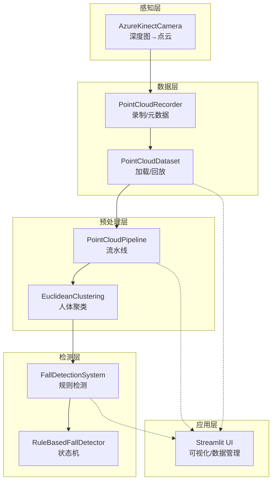
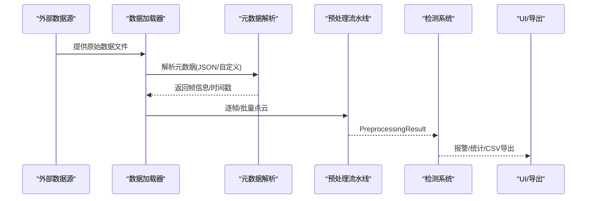
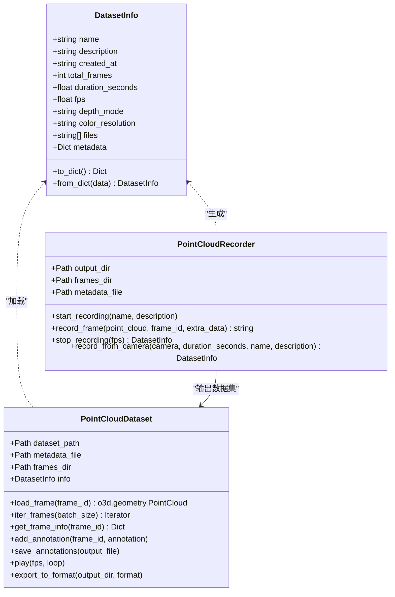
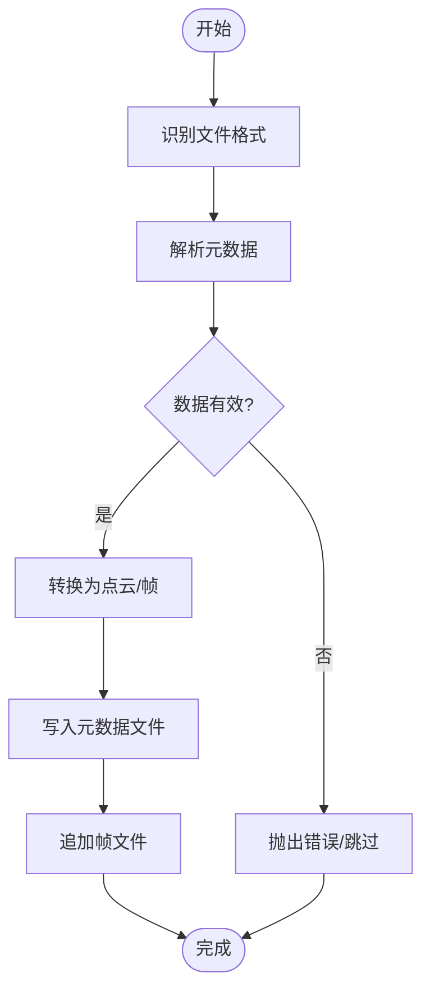
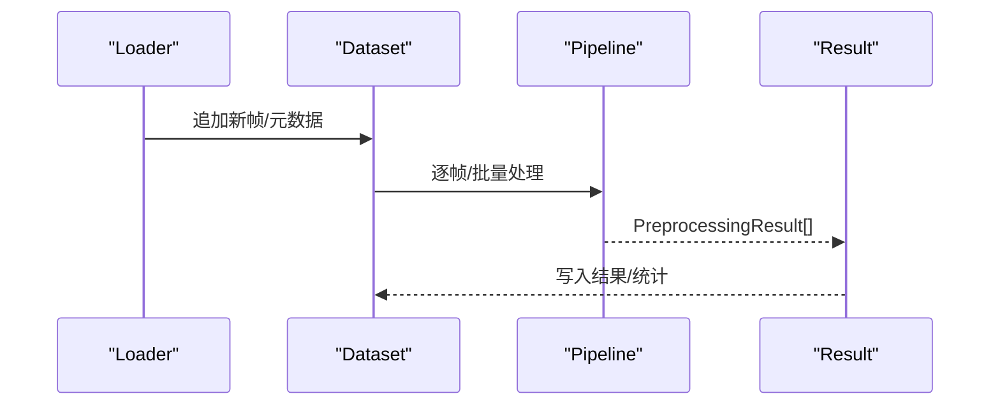
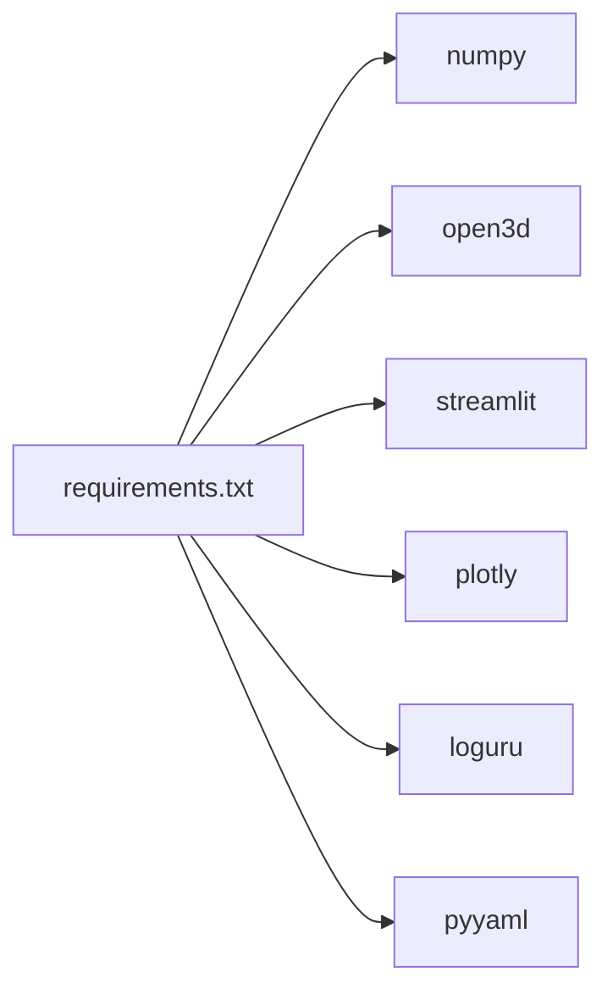

# 数据格式扩展

<cite>
**本文档引用的文件**
- [app.py](file://app.py)
- [requirements.txt](file://requirements.txt)
- [src/data_capture/recorder.py](file://src/data_capture/recorder.py)
- [src/data_capture/azure_kinect.py](file://src/data_capture/azure_kinect.py)
- [src/preprocessing/pipeline.py](file://src/preprocessing/pipeline.py)
- [src/preprocessing/clustering.py](file://src/preprocessing/clustering.py)
- [src/detection/detector.py](file://src/detection/detector.py)
- [src/detection/rules.py](file://src/detection/rules.py)
</cite>

## 目录
1. [简介](#简介)
2. [项目结构](#项目结构)
3. [核心组件](#核心组件)
4. [架构总览](#架构总览)
5. [详细组件分析](#详细组件分析)
6. [依赖分析](#依赖分析)
7. [性能考量](#性能考量)
8. [故障排查指南](#故障排查指南)
9. [结论](#结论)
10. [附录](#附录)

## 简介
本指南面向需要为GuardianFall系统扩展新数据格式的开发者，涵盖从格式定义、读写能力扩展、元数据处理、数据验证，到批量处理与增量更新策略，以及数据压缩、加密与存储优化的完整链路。文档同时提供最佳实践与兼容性考虑，帮助在不破坏现有架构的前提下，安全地引入第三方数据源与新格式。

## 项目结构
GuardianFall系统采用模块化分层架构：
- 感知层：Azure Kinect相机采集点云
- 数据层：录制/回放、元数据管理
- 预处理层：体素降采样、统计滤波、地面分割、人体聚类
- 检测层：规则引擎与状态机
- 应用层：Streamlit可视化界面与数据管理

**图表来源**
- [src/data_capture/azure_kinect.py:47-460](file://src/data_capture/azure_kinect.py#L47-L460)
- [src/data_capture/recorder.py:48-436](file://src/data_capture/recorder.py#L48-L436)
- [src/preprocessing/pipeline.py:65-178](file://src/preprocessing/pipeline.py#L65-L178)
- [src/preprocessing/clustering.py:99-181](file://src/preprocessing/clustering.py#L99-L181)
- [src/detection/detector.py:75-282](file://src/detection/detector.py#L75-L282)
- [src/detection/rules.py:226-422](file://src/detection/rules.py#L226-L422)
- [app.py:304-651](file://app.py#L304-L651)

**章节来源**
- [app.py:1-662](file://app.py#L1-L662)
- [src/data_capture/recorder.py:1-489](file://src/data_capture/recorder.py#L1-L489)
- [src/data_capture/azure_kinect.py:1-532](file://src/data_capture/azure_kinect.py#L1-L532)
- [src/preprocessing/pipeline.py:1-337](file://src/preprocessing/pipeline.py#L1-L337)
- [src/preprocessing/clustering.py:1-495](file://src/preprocessing/clustering.py#L1-L495)
- [src/detection/detector.py:1-373](file://src/detection/detector.py#L1-L373)
- [src/detection/rules.py:1-526](file://src/detection/rules.py#L1-L526)

## 核心组件
- 数据采集与录制：AzureKinectCamera负责深度图到点云转换；PointCloudRecorder负责帧级录制与元数据生成；PointCloudDataset负责数据集加载与回放。
- 预处理流水线：PointCloudPipeline串联体素降采样、统计滤波、地面分割与人体聚类，并提供实时处理模式。
- 检测系统：FallDetectionSystem整合预处理与规则检测，输出报警与统计信息。
- UI与数据管理：Streamlit界面提供数据集浏览、配置导入导出、报警历史导出等功能。

**章节来源**
- [src/data_capture/azure_kinect.py:285-440](file://src/data_capture/azure_kinect.py#L285-L440)
- [src/data_capture/recorder.py:48-436](file://src/data_capture/recorder.py#L48-L436)
- [src/preprocessing/pipeline.py:65-178](file://src/preprocessing/pipeline.py#L65-L178)
- [src/detection/detector.py:75-282](file://src/detection/detector.py#L75-L282)
- [app.py:590-651](file://app.py#L590-L651)

## 架构总览
新数据格式扩展应遵循“输入→元数据→读取→预处理→检测→输出”的统一链路，确保与现有模块解耦与兼容。

[此图为概念流程图，不对应具体源码文件，故无图表来源]

## 详细组件分析

### 数据格式扩展：Recorder与Dataset的扩展点
- 扩展Recorder以支持新格式的录制与元数据生成
- 扩展Dataset以支持新格式的加载与回放
- 新格式需提供帧级元数据（时间戳、点数、额外字段）

**图表来源**
- [src/data_capture/recorder.py:24-175](file://src/data_capture/recorder.py#L24-L175)
- [src/data_capture/recorder.py:223-436](file://src/data_capture/recorder.py#L223-L436)

**章节来源**
- [src/data_capture/recorder.py:48-175](file://src/data_capture/recorder.py#L48-L175)
- [src/data_capture/recorder.py:223-436](file://src/data_capture/recorder.py#L223-L436)

### 数据格式转换器开发方法
- 定义格式适配器：实现“读取→转换→写入”三段式
- 元数据映射：将新格式字段映射到DatasetInfo与帧级元数据
- 数据验证：校验点数、时间戳、文件存在性与完整性
- 批量与增量：支持批量转换与增量追加

[此图为概念流程图，不对应具体源码文件，故无图表来源]

### 元数据处理与数据验证机制
- 元数据结构：DatasetInfo包含基础信息与扩展metadata字典
- 验证策略：文件存在性、帧数一致性、时间戳连续性、点数阈值
- 扩展字段：在metadata中存放格式特定字段，避免破坏现有结构

**章节来源**
- [src/data_capture/recorder.py:24-46](file://src/data_capture/recorder.py#L24-L46)
- [src/data_capture/recorder.py:76-175](file://src/data_capture/recorder.py#L76-L175)
- [src/data_capture/recorder.py:240-245](file://src/data_capture/recorder.py#L240-L245)

### 解析流程、批量处理与增量更新
- 解析流程：Loader按格式解析→构建帧索引→生成元数据
- 批量处理：PointCloudPipeline.process_batch支持列表输入
- 增量更新：PointCloudDataset支持追加新帧并更新元数据

**图表来源**
- [src/preprocessing/pipeline.py:161-177](file://src/preprocessing/pipeline.py#L161-L177)
- [src/data_capture/recorder.py:328-346](file://src/data_capture/recorder.py#L328-L346)

**章节来源**
- [src/preprocessing/pipeline.py:161-177](file://src/preprocessing/pipeline.py#L161-L177)
- [src/data_capture/recorder.py:328-346](file://src/data_capture/recorder.py#L328-L346)

### 集成第三方数据源
- 适配器接口：实现统一的帧生成器接口，供process_continuous消费
- 相机/数据源抽象：参考AzureKinectCamera的工厂与上下文管理器模式
- 回放模式：通过生成器实现离线回放与测试

**章节来源**
- [src/data_capture/azure_kinect.py:475-531](file://src/data_capture/azure_kinect.py#L475-L531)
- [src/detection/detector.py:229-257](file://src/detection/detector.py#L229-L257)

### 数据压缩、加密传输与存储优化
- 压缩：建议使用无损压缩（如zstd/lz4）存储点云文件，平衡压缩比与CPU开销
- 传输：HTTP/HTTPS上传下载，配合断点续传与校验
- 存储：按时间/会话拆分目录，避免单目录过大；定期清理临时文件
- 加密：对敏感元数据与报警记录进行本地加密存储（如Fernet）

[本节为通用实践建议，不直接分析具体源码文件，故无章节来源]

### 代码示例：新数据格式集成链路
以下示例展示从格式定义到数据处理的完整链路（以路径代替具体代码）：
- 定义格式适配器：实现读取与元数据解析
  - 示例路径：[src/data_capture/recorder.py:379-411](file://src/data_capture/recorder.py#L379-L411)
- 扩展Dataset加载器：支持新格式的帧读取
  - 示例路径：[src/data_capture/recorder.py:252-281](file://src/data_capture/recorder.py#L252-L281)
- 批量处理：使用PointCloudPipeline.process_batch
  - 示例路径：[src/preprocessing/pipeline.py:161-177](file://src/preprocessing/pipeline.py#L161-L177)
- 增量更新：在现有数据集基础上追加新帧
  - 示例路径：[src/data_capture/recorder.py:129-175](file://src/data_capture/recorder.py#L129-L175)
- 导出与回放：export_to_format与play
  - 示例路径：[src/data_capture/recorder.py:379-411](file://src/data_capture/recorder.py#L379-L411)
  - 示例路径：[src/data_capture/recorder.py:348-377](file://src/data_capture/recorder.py#L348-L377)

**章节来源**
- [src/data_capture/recorder.py:252-281](file://src/data_capture/recorder.py#L252-L281)
- [src/data_capture/recorder.py:348-411](file://src/data_capture/recorder.py#L348-L411)
- [src/preprocessing/pipeline.py:161-177](file://src/preprocessing/pipeline.py#L161-L177)

## 依赖分析
- 核心依赖：numpy、open3d、streamlit、plotly、loguru、pyyaml等
- 扩展依赖：建议新增格式时引入轻量依赖，避免污染全局环境

**图表来源**
- [requirements.txt:1-34](file://requirements.txt#L1-L34)

**章节来源**
- [requirements.txt:1-34](file://requirements.txt#L1-L34)

## 性能考量
- 体素降采样与统计滤波是性能瓶颈，建议在格式适配阶段尽量减少冗余点
- 批量处理优于逐帧处理，提高吞吐量
- 元数据缓存与帧缓存（如frames_cache）可降低I/O开销
- 增量更新时仅处理新增帧，避免全量重算

[本节提供通用性能建议，不直接分析具体源码文件，故无章节来源]

## 故障排查指南
- 元数据缺失：检查metadata.json是否存在与完整性
  - 参考路径：[src/data_capture/recorder.py:237-245](file://src/data_capture/recorder.py#L237-L245)
- 帧文件不存在：确认文件路径与命名规则
  - 参考路径：[src/data_capture/recorder.py:267-273](file://src/data_capture/recorder.py#L267-L273)
- 处理异常：查看日志与回调错误
  - 参考路径：[src/detection/detector.py:186-192](file://src/detection/detector.py#L186-L192)
- UI导出CSV失败：确认数据结构与编码
  - 参考路径：[app.py:567-584](file://app.py#L567-L584)

**章节来源**
- [src/data_capture/recorder.py:237-273](file://src/data_capture/recorder.py#L237-L273)
- [src/detection/detector.py:186-192](file://src/detection/detector.py#L186-L192)
- [app.py:567-584](file://app.py#L567-L584)

## 结论
通过在Recorder/Dataset层扩展格式适配器、在Pipeline层保持一致的数据接口、在UI层提供元数据与导出能力，GuardianFall系统能够以最小代价安全地支持新数据格式与第三方数据源。建议在扩展过程中严格遵循元数据规范、数据验证与增量更新策略，确保系统稳定性与可维护性。

## 附录
- 最佳实践清单
  - 保持元数据结构稳定，扩展字段放入metadata
  - 逐帧校验点数与时间戳，保证数据完整性
  - 批量处理优先，必要时提供增量更新
  - 为新格式提供回放与导出能力，便于测试与迁移
  - 对敏感数据进行本地加密存储

[本节为通用建议，不直接分析具体源码文件，故无章节来源]