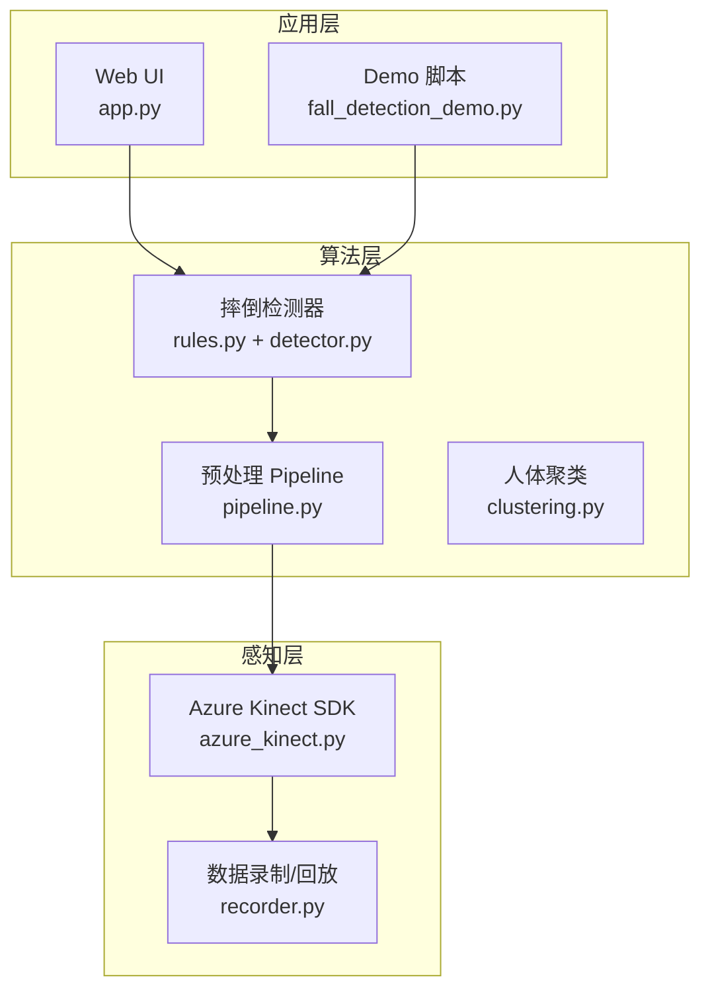
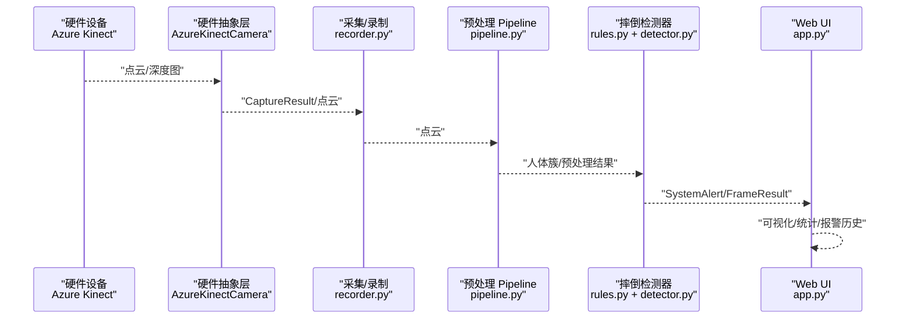
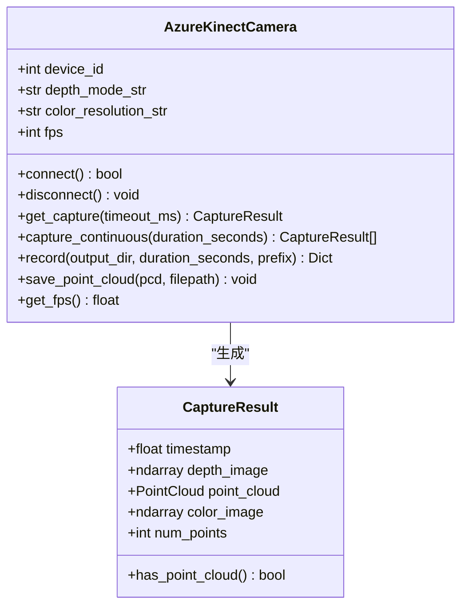
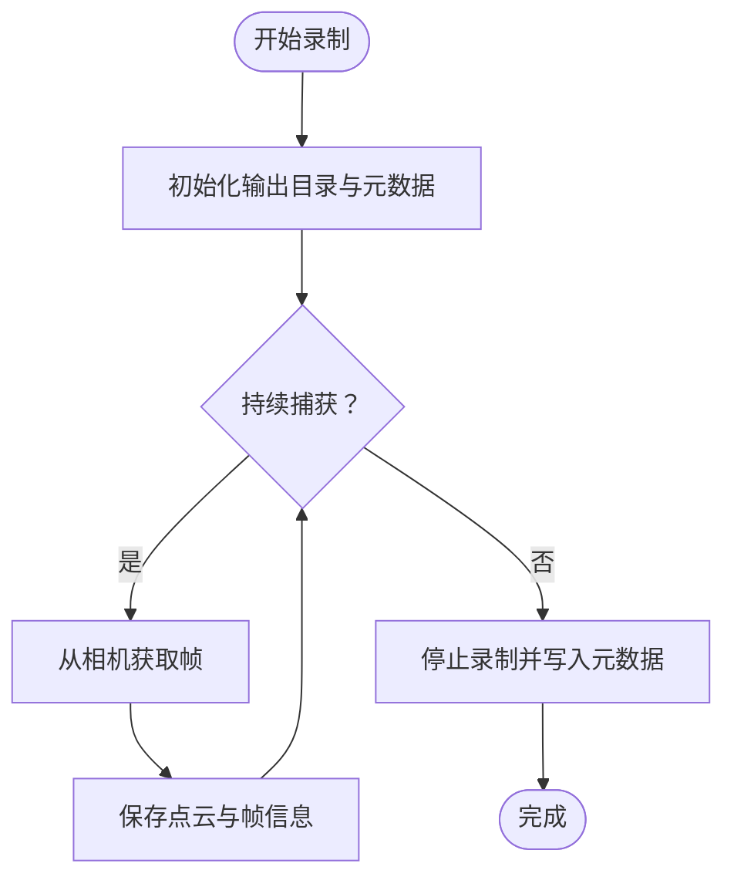
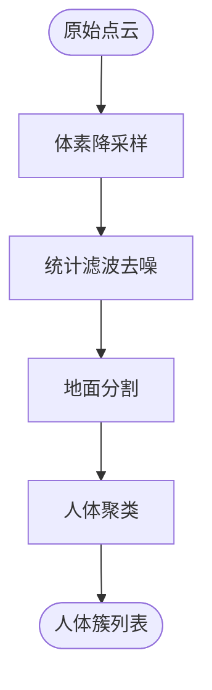
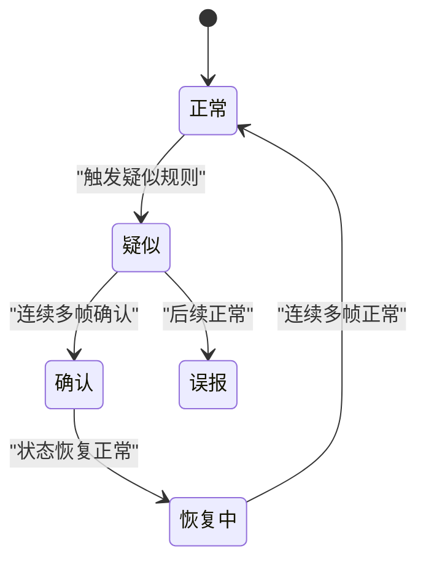
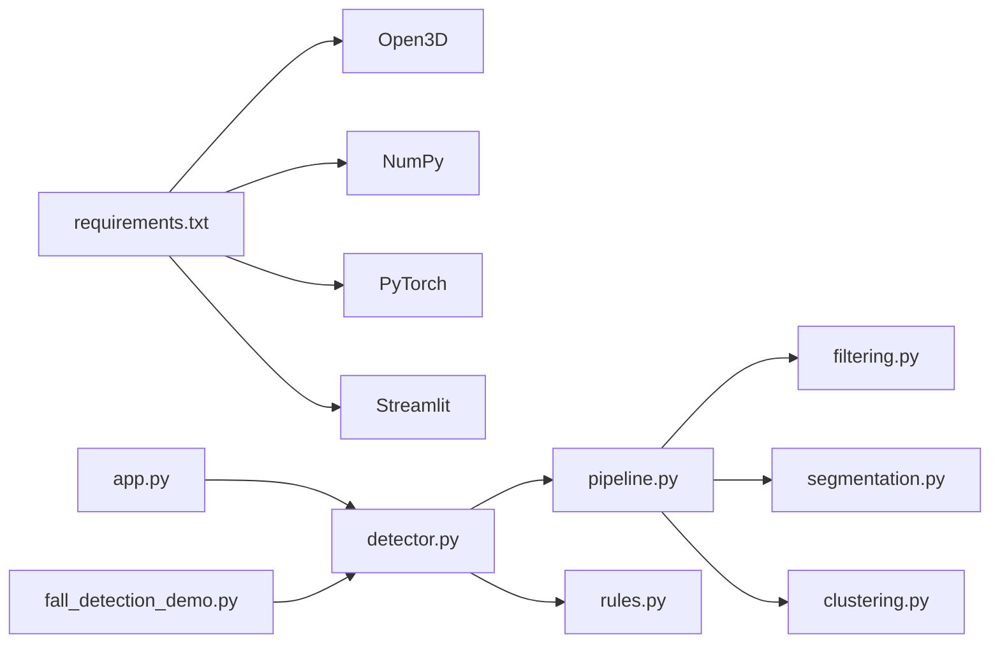

# 硬件集成扩展

<cite>
**本文引用的文件**
- [app.py](file://app.py)
- [azure_kinect.py](file://src/data_capture/azure_kinect.py)
- [recorder.py](file://src/data_capture/recorder.py)
- [detector.py](file://src/detection/detector.py)
- [pipeline.py](file://src/preprocessing/pipeline.py)
- [clustering.py](file://src/preprocessing/clustering.py)
- [rules.py](file://src/detection/rules.py)
- [filtering.py](file://src/preprocessing/filtering.py)
- [segmentation.py](file://src/preprocessing/segmentation.py)
- [fall_detection_demo.py](file://demos/fall_detection_demo.py)
- [requirements.txt](file://requirements.txt)
- [README.md](file://README.md)
</cite>

## 目录
1. [简介](#简介)
2. [项目结构](#项目结构)
3. [核心组件](#核心组件)
4. [架构总览](#架构总览)
5. [详细组件分析](#详细组件分析)
6. [依赖关系分析](#依赖关系分析)
7. [性能考量](#性能考量)
8. [故障排查指南](#故障排查指南)
9. [结论](#结论)
10. [附录](#附录)

## 简介
本指南面向为GuardianFall系统扩展硬件集成能力的开发者，围绕“支持新传感器设备、扩展数据采集能力、集成第三方硬件接口、设计硬件抽象层、设备驱动开发与数据格式转换、接入流程与配置管理、兼容性测试、故障检测与异常处理、性能监控”等方面，提供从概念到落地的完整方法论与最佳实践。文档同时给出代码级参考路径，帮助你快速定位实现细节并进行二次开发。

## 项目结构
GuardianFall采用分层架构：感知层负责采集点云；算法层完成预处理、聚类与摔倒检测；应用层提供Web界面与可视化。数据采集模块目前以Azure Kinect DK为核心，具备录制与回放能力；检测系统通过规则引擎实现摔倒判定；UI通过Streamlit提供交互与监控。

**图表来源**
- [app.py:1-662](file://app.py#L1-L662)
- [detector.py:1-373](file://src/detection/detector.py#L1-L373)
- [pipeline.py:1-337](file://src/preprocessing/pipeline.py#L1-L337)
- [clustering.py:1-495](file://src/preprocessing/clustering.py#L1-L495)
- [rules.py:1-526](file://src/detection/rules.py#L1-L526)
- [azure_kinect.py:1-532](file://src/data_capture/azure_kinect.py#L1-L532)
- [recorder.py:1-489](file://src/data_capture/recorder.py#L1-L489)
- [fall_detection_demo.py:1-373](file://demos/fall_detection_demo.py#L1-L373)

**章节来源**
- [README.md:61-96](file://README.md#L61-L96)
- [app.py:1-662](file://app.py#L1-L662)
- [azure_kinect.py:1-532](file://src/data_capture/azure_kinect.py#L1-L532)
- [recorder.py:1-489](file://src/data_capture/recorder.py#L1-L489)
- [detector.py:1-373](file://src/detection/detector.py#L1-L373)
- [pipeline.py:1-337](file://src/preprocessing/pipeline.py#L1-L337)
- [clustering.py:1-495](file://src/preprocessing/clustering.py#L1-L495)
- [rules.py:1-526](file://src/detection/rules.py#L1-L526)
- [fall_detection_demo.py:1-373](file://demos/fall_detection_demo.py#L1-L373)

## 核心组件
- 硬件抽象层（HAL）：以Azure Kinect为例，提供统一的相机接口（连接、捕获、保存、录制、统计），屏蔽底层SDK差异。
- 数据采集与存储：支持实时捕获、多帧录制、元数据管理、数据集回放。
- 预处理Pipeline：体素降采样、统计滤波、地面分割、人体聚类。
- 摔倒检测器：基于规则的状态机，结合高度变化、速度、姿态等指标。
- UI与监控：Streamlit可视化界面，展示点云、检测结果、报警历史与系统统计。

**章节来源**
- [azure_kinect.py:47-460](file://src/data_capture/azure_kinect.py#L47-L460)
- [recorder.py:48-489](file://src/data_capture/recorder.py#L48-L489)
- [pipeline.py:65-178](file://src/preprocessing/pipeline.py#L65-L178)
- [clustering.py:99-181](file://src/preprocessing/clustering.py#L99-L181)
- [rules.py:226-423](file://src/detection/rules.py#L226-L423)
- [detector.py:75-283](file://src/detection/detector.py#L75-L283)
- [app.py:1-662](file://app.py#L1-L662)

## 架构总览
系统采用“数据采集—预处理—检测—报警—可视化”的流水线式处理。硬件抽象层向上提供一致的点云接口，向下适配不同传感器。检测系统通过回调机制将报警推送到UI与外部系统。

**图表来源**
- [azure_kinect.py:216-284](file://src/data_capture/azure_kinect.py#L216-L284)
- [recorder.py:177-221](file://src/data_capture/recorder.py#L177-L221)
- [pipeline.py:98-139](file://src/preprocessing/pipeline.py#L98-L139)
- [rules.py:266-337](file://src/detection/rules.py#L266-L337)
- [detector.py:138-227](file://src/detection/detector.py#L138-L227)
- [app.py:109-131](file://app.py#L109-L131)

## 详细组件分析

### 硬件抽象层（HAL）设计与实现
- 设计原则
  - 接口稳定：对外暴露统一的connect/get_capture/save_point_cloud等方法，隐藏SDK差异。
  - 错误隔离：异常捕获与日志记录，提供清晰的错误提示与诊断线索。
  - 资源管理：上下文管理器确保连接释放，避免资源泄漏。
  - 统计与监控：帧计数、起始时间、FPS计算，便于性能评估。
- 关键接口参考
  - 相机连接与断开：[connect:152-192](file://src/data_capture/azure_kinect.py#L152-L192)、[disconnect:186-191](file://src/data_capture/azure_kinect.py#L186-L191)
  - 单帧捕获与点云生成：[get_capture:216-284](file://src/data_capture/azure_kinect.py#L216-L284)、[_depth_to_point_cloud:285-344](file://src/data_capture/azure_kinect.py#L285-L344)
  - 连续捕获与录制：[capture_continuous:345-375](file://src/data_capture/azure_kinect.py#L345-L375)、[record:398-439](file://src/data_capture/azure_kinect.py#L398-L439)
  - 点云保存与元数据：[save_point_cloud:376-396](file://src/data_capture/azure_kinect.py#L376-L396)、[metadata.json:424-438](file://src/data_capture/azure_kinect.py#L424-L438)
  - FPS统计：[get_fps:441-450](file://src/data_capture/azure_kinect.py#L441-L450)

**图表来源**
- [azure_kinect.py:32-134](file://src/data_capture/azure_kinect.py#L32-L134)
- [azure_kinect.py:47-460](file://src/data_capture/azure_kinect.py#L47-L460)

**章节来源**
- [azure_kinect.py:1-532](file://src/data_capture/azure_kinect.py#L1-L532)

### 数据采集与录制（Recorder）
- 功能要点
  - 录制器：start_recording/record_frame/stop_recording，支持额外元数据与帧信息。
  - 数据集：加载元数据、迭代帧、标注、导出、播放回放。
  - 从相机录制：record_from_camera直接对接AzureKinectCamera。
- 关键接口参考
  - 录制器：[PointCloudRecorder:48-176](file://src/data_capture/recorder.py#L48-L176)
  - 数据集：[PointCloudDataset:223-378](file://src/data_capture/recorder.py#L223-L378)
  - 从相机录制：[record_from_camera:177-221](file://src/data_capture/recorder.py#L177-L221)

**图表来源**
- [recorder.py:64-176](file://src/data_capture/recorder.py#L64-L176)
- [recorder.py:177-221](file://src/data_capture/recorder.py#L177-L221)

**章节来源**
- [recorder.py:1-489](file://src/data_capture/recorder.py#L1-L489)

### 预处理Pipeline与人体聚类
- Pipeline步骤
  - 体素降采样、统计滤波去噪、地面分割、人体聚类。
- 聚类策略
  - 欧式聚类（DBSCAN）、DBSCAN聚类、多视角融合。
- 关键接口参考
  - Pipeline：[PointCloudPipeline:65-178](file://src/preprocessing/pipeline.py#L65-L178)
  - 聚类器工厂：[create_clusterer:375-398](file://src/preprocessing/clustering.py#L375-L398)
  - 欧式聚类：[EuclideanClustering:99-181](file://src/preprocessing/clustering.py#L99-L181)

**图表来源**
- [pipeline.py:98-139](file://src/preprocessing/pipeline.py#L98-L139)
- [clustering.py:124-181](file://src/preprocessing/clustering.py#L124-L181)

**章节来源**
- [pipeline.py:1-337](file://src/preprocessing/pipeline.py#L1-L337)
- [clustering.py:1-495](file://src/preprocessing/clustering.py#L1-L495)

### 摔倒检测器（规则引擎）
- 状态机
  - NORMAL → SUSPECTED → CONFIRMED → RECOVERING → NORMAL/FALSE_ALARM。
- 检测指标
  - 高度骤降、垂直速度、宽高比、静止状态。
- 关键接口参考
  - 检测器：[RuleBasedFallDetector:226-423](file://src/detection/rules.py#L226-L423)
  - 追踪器：[PersonTracker:82-224](file://src/detection/rules.py#L82-L224)
  - 系统入口：[FallDetectionSystem.process_frame:138-227](file://src/detection/detector.py#L138-L227)

**图表来源**
- [rules.py:82-224](file://src/detection/rules.py#L82-L224)

**章节来源**
- [rules.py:1-526](file://src/detection/rules.py#L1-L526)
- [detector.py:1-373](file://src/detection/detector.py#L1-L373)

### Web UI与报警回调
- UI通过回调接收报警，更新历史与可视化。
- 关键接口参考
  - 回调注册与报警推送：[on_alert:109-131](file://src/detection/detector.py#L109-L131)
  - UI侧接收与展示：[app.py:109-131](file://app.py#L109-L131)

**章节来源**
- [app.py:1-662](file://app.py#L1-L662)
- [detector.py:1-373](file://src/detection/detector.py#L1-L373)

## 依赖关系分析
- 依赖管理：requirements.txt声明了Open3D、NumPy、PyTorch、Streamlit等核心依赖。
- 模块耦合：检测系统依赖预处理Pipeline与聚类模块；UI依赖检测系统与聚类可视化。
- 外部接口：Azure Kinect SDK（pyk4a），Open3D点云处理，Streamlit可视化。

**图表来源**
- [requirements.txt:1-34](file://requirements.txt#L1-L34)
- [detector.py:1-373](file://src/detection/detector.py#L1-L373)
- [pipeline.py:1-337](file://src/preprocessing/pipeline.py#L1-L337)
- [filtering.py:1-189](file://src/preprocessing/filtering.py#L1-L189)
- [segmentation.py:1-243](file://src/preprocessing/segmentation.py#L1-L243)
- [clustering.py:1-495](file://src/preprocessing/clustering.py#L1-L495)
- [rules.py:1-526](file://src/detection/rules.py#L1-L526)
- [app.py:1-662](file://app.py#L1-L662)
- [fall_detection_demo.py:1-373](file://demos/fall_detection_demo.py#L1-L373)

**章节来源**
- [requirements.txt:1-34](file://requirements.txt#L1-L34)
- [detector.py:1-373](file://src/detection/detector.py#L1-L373)
- [pipeline.py:1-337](file://src/preprocessing/pipeline.py#L1-L337)
- [app.py:1-662](file://app.py#L1-L662)

## 性能考量
- 处理延迟与吞吐
  - Pipeline与检测器均记录单帧处理时间与FPS历史，便于监控与优化。
  - 可通过降低体素尺寸、调整聚类阈值、选择合适滤波器提升精度与速度平衡。
- 资源占用
  - Open3D与NumPy在大规模点云上的内存与CPU消耗需关注；可通过降采样与批处理策略缓解。
- 实时性保障
  - Demo与UI侧均提供帧率统计与可视化，便于在不同硬件上评估性能。

**章节来源**
- [pipeline.py:199-248](file://src/preprocessing/pipeline.py#L199-L248)
- [detector.py:194-227](file://src/detection/detector.py#L194-L227)
- [app.py:282-286](file://app.py#L282-L286)

## 故障排查指南
- 相机连接失败
  - 检查USB 3.0线缆、驱动安装、是否被其他程序占用；参考错误日志与提示。
  - 参考：[connect异常处理:177-184](file://src/data_capture/azure_kinect.py#L177-L184)
- 捕获失败或无点云
  - 确认相机已连接且返回有效深度图；检查超时设置与帧率配置。
  - 参考：[get_capture返回空结果:226-234](file://src/data_capture/azure_kinect.py#L226-L234)
- 录制数据集缺失
  - 检查输出目录权限、元数据文件是否存在、帧缓存命中情况。
  - 参考：[record/stop_recording:129-175](file://src/data_capture/recorder.py#L129-L175)
- 检测误报/漏报
  - 调整高度骤降阈值、速度阈值、确认帧数与聚类容忍度；观察状态机切换。
  - 参考：[PersonTracker阈值与状态更新:90-224](file://src/detection/rules.py#L90-L224)
- UI无响应或卡顿
  - 检查Streamlit服务器端口与网络；适当降低可视化复杂度或帧率。
  - 参考：[UI状态与统计展示:282-286](file://app.py#L282-L286)

**章节来源**
- [azure_kinect.py:152-192](file://src/data_capture/azure_kinect.py#L152-L192)
- [recorder.py:129-175](file://src/data_capture/recorder.py#L129-L175)
- [rules.py:90-224](file://src/detection/rules.py#L90-L224)
- [app.py:282-286](file://app.py#L282-L286)

## 结论
GuardianFall的硬件集成扩展应遵循“硬件抽象层—数据采集—预处理—检测—报警—可视化”的完整链路。通过HAL屏蔽底层差异、标准化数据接口、完善错误处理与性能监控，可在不改动上层算法的前提下快速接入新传感器。建议优先实现HAL接口与数据格式转换，再进行检测参数调优与UI联动验证。

## 附录

### 新硬件接入流程（从设备发现到数据流处理）
- 设计HAL接口
  - 定义connect/disconnect/get_capture/save_point_cloud等方法，保证与现有调用一致。
  - 参考：[AzureKinectCamera接口:152-460](file://src/data_capture/azure_kinect.py#L152-L460)
- 设备驱动开发
  - 实现SDK调用、异常捕获、日志记录、资源管理与统计。
  - 参考：[connect/get_capture:152-284](file://src/data_capture/azure_kinect.py#L152-L284)
- 数据格式转换
  - 将设备原始数据转换为Open3D点云或深度图，必要时生成RGBD。
  - 参考：[深度图转点云:285-344](file://src/data_capture/azure_kinect.py#L285-L344)
- 集成到Pipeline
  - 替换或包装现有相机对象，确保process_frame/continuous处理链路可用。
  - 参考：[process_frame:138-227](file://src/detection/detector.py#L138-L227)
- 配置管理与兼容性测试
  - 通过参数配置（体素、阈值、帧率）验证不同硬件在相同算法下的表现。
  - 参考：[UI配置与保存:244-269](file://app.py#L244-L269)
- 性能监控与报警
  - 通过FPS历史与报警回调验证实时性与准确性。
  - 参考：[get_statistics:261-272](file://src/detection/detector.py#L261-L272)、[on_alert:109-131](file://src/detection/detector.py#L109-L131)

**章节来源**
- [azure_kinect.py:152-460](file://src/data_capture/azure_kinect.py#L152-L460)
- [detector.py:138-272](file://src/detection/detector.py#L138-L272)
- [app.py:244-269](file://app.py#L244-L269)

### 硬件抽象层最佳实践
- 接口一致性：统一命名与返回值，便于替换与扩展。
- 错误处理：捕获异常并记录上下文，提供可操作的诊断信息。
- 资源管理：使用上下文管理器或显式释放，避免泄漏。
- 统计与可观测性：记录帧率、处理时间、点数变化，便于性能分析。
- 兼容性：支持多设备ID、多分辨率、多帧率配置，便于多场景部署。

**章节来源**
- [azure_kinect.py:152-460](file://src/data_capture/azure_kinect.py#L152-L460)
- [recorder.py:48-176](file://src/data_capture/recorder.py#L48-L176)

### 调试技巧
- 使用Demo脚本快速验证：模拟数据、真实相机、录制模式。
  - 参考：[run_mock_demo/run_camera_demo/run_record_demo:92-325](file://demos/fall_detection_demo.py#L92-L325)
- UI侧观察：报警历史、统计图表、处理时间趋势。
  - 参考：[Tab 2/3/4:452-651](file://app.py#L452-L651)
- 日志级别：结合loguru输出DEBUG/INFO/WARNING/ERROR，定位问题根因。
- 逐步验证：先验证HAL，再验证Pipeline，最后验证检测器与UI。

**章节来源**
- [fall_detection_demo.py:92-325](file://demos/fall_detection_demo.py#L92-L325)
- [app.py:452-651](file://app.py#L452-L651)