# 算法扩展开发

<cite>
**本文档引用的文件**
- [src/detection/detector.py](file://src/detection/detector.py)
- [src/detection/rules.py](file://src/detection/rules.py)
- [src/preprocessing/pipeline.py](file://src/preprocessing/pipeline.py)
- [src/preprocessing/clustering.py](file://src/preprocessing/clustering.py)
- [src/preprocessing/filtering.py](file://src/preprocessing/filtering.py)
- [src/preprocessing/segmentation.py](file://src/preprocessing/segmentation.py)
- [app.py](file://app.py)
- [demos/fall_detection_demo.py](file://demos/fall_detection_demo.py)
- [src/data_capture/azure_kinect.py](file://src/data_capture/azure_kinect.py)
- [src/data_capture/recorder.py](file://src/data_capture/recorder.py)
- [requirements.txt](file://requirements.txt)
- [README.md](file://README.md)
- [CODE_GENERATION_PLAN.md](file://CODE_GENERATION_PLAN.md)
</cite>

## 目录
1. [简介](#简介)
2. [项目结构](#项目结构)
3. [核心组件](#核心组件)
4. [架构概览](#架构概览)
5. [详细组件分析](#详细组件分析)
6. [依赖分析](#依赖分析)
7. [性能考虑](#性能考虑)
8. [故障排除指南](#故障排除指南)
9. [结论](#结论)
10. [附录](#附录)

## 简介

GuardianFall系统是一个基于3D视觉的室内人体摔倒实时预警系统。本文档专注于算法扩展开发，提供集成新AI检测算法、改进现有规则引擎和开发自定义检测逻辑的完整指导。

系统采用模块化架构，主要包含四个核心模块：
- **数据采集模块**：Azure Kinect深度相机数据采集
- **预处理模块**：点云滤波、地面分割、人体聚类
- **检测模块**：基于规则的摔倒检测引擎
- **可视化模块**：Streamlit Web界面

## 项目结构

GuardianFall系统采用清晰的模块化组织结构：

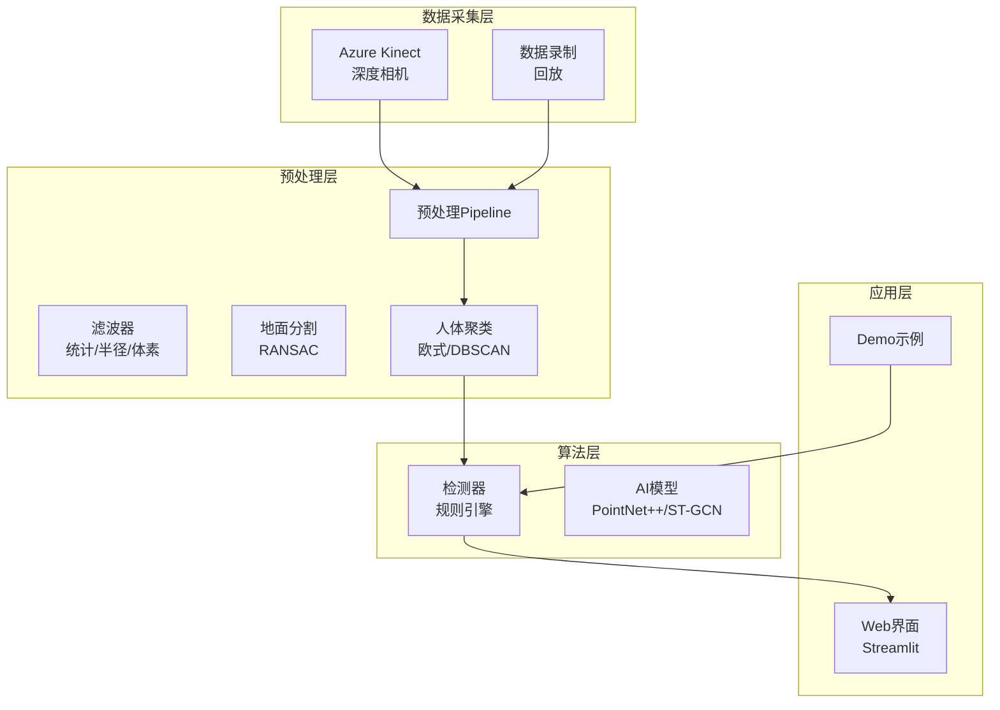

**图表来源**
- [src/detection/detector.py:75-283](file://src/detection/detector.py#L75-L283)
- [src/preprocessing/pipeline.py:65-178](file://src/preprocessing/pipeline.py#L65-L178)
- [src/data_capture/azure_kinect.py:47-134](file://src/data_capture/azure_kinect.py#L47-L134)

**章节来源**
- [README.md:61-86](file://README.md#L61-L86)
- [CODE_GENERATION_PLAN.md:44-102](file://CODE_GENERATION_PLAN.md#L44-L102)

## 核心组件

### 摔倒检测系统主控制器

FallDetectionSystem是整个系统的核心控制器，负责协调各个模块的工作：

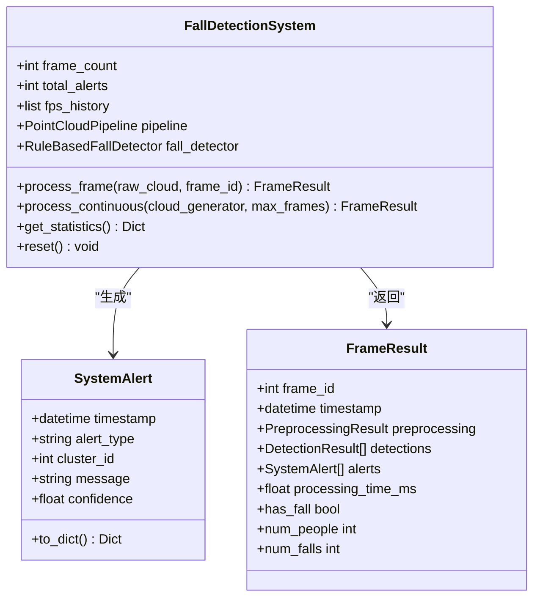

**图表来源**
- [src/detection/detector.py:25-73](file://src/detection/detector.py#L25-L73)
- [src/detection/detector.py:75-283](file://src/detection/detector.py#L75-L283)

### 规则引擎架构

规则引擎采用状态机设计，支持多种检测状态：

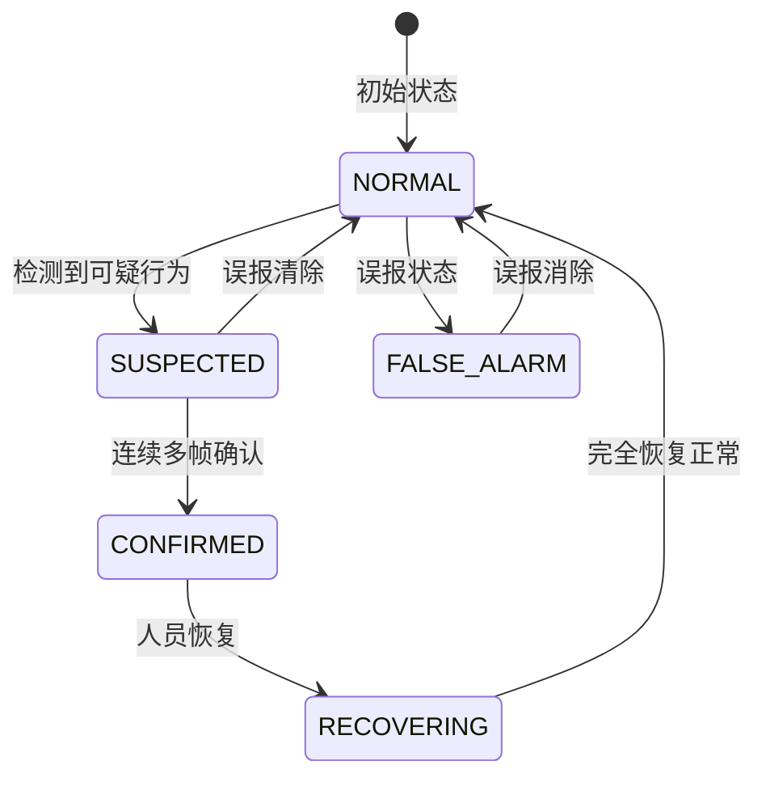

**图表来源**
- [src/detection/rules.py:22-28](file://src/detection/rules.py#L22-L28)
- [src/detection/rules.py:190-224](file://src/detection/rules.py#L190-L224)

**章节来源**
- [src/detection/detector.py:75-283](file://src/detection/detector.py#L75-L283)
- [src/detection/rules.py:226-423](file://src/detection/rules.py#L226-L423)

## 架构概览

系统采用分层架构设计，确保各模块职责明确、耦合度低：

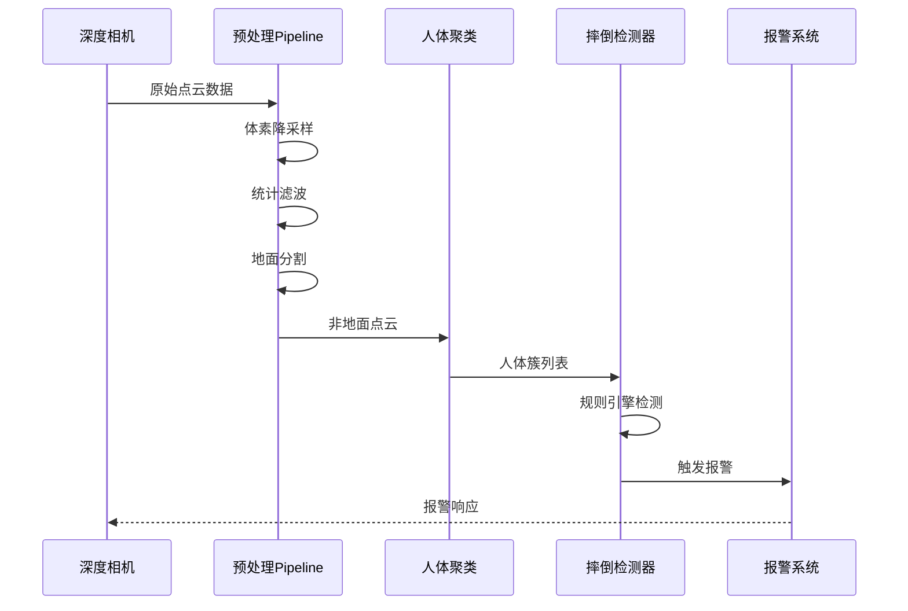

**图表来源**
- [src/detection/detector.py:138-227](file://src/detection/detector.py#L138-L227)
- [src/preprocessing/pipeline.py:98-139](file://src/preprocessing/pipeline.py#L98-L139)

## 详细组件分析

### 预处理Pipeline设计

PointCloudPipeline实现了完整的点云预处理流程：

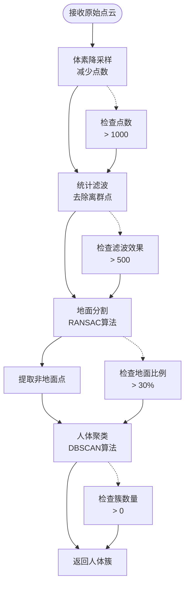

**图表来源**
- [src/preprocessing/pipeline.py:98-139](file://src/preprocessing/pipeline.py#L98-L139)
- [src/preprocessing/filtering.py:28-49](file://src/preprocessing/filtering.py#L28-L49)
- [src/preprocessing/segmentation.py:41-81](file://src/preprocessing/segmentation.py#L41-L81)
- [src/preprocessing/clustering.py:124-181](file://src/preprocessing/clustering.py#L124-L181)

#### 滤波算法实现

系统提供了三种主要的滤波算法：

| 滤波器类型 | 算法原理 | 参数配置 | 适用场景 |
|------------|----------|----------|----------|
| 统计滤波 | 基于局部均值和标准差判断离群点 | nb_neighbors, std_ratio | 去除传感器噪声 |
| 半径滤波 | 基于邻域点密度判断离群点 | radius, min_points | 处理密度不均匀区域 |
| 体素滤波 | 降采样到规则网格 | leaf_size | 大幅减少点数 |

**章节来源**
- [src/preprocessing/pipeline.py:65-178](file://src/preprocessing/pipeline.py#L65-L178)
- [src/preprocessing/filtering.py:13-164](file://src/preprocessing/filtering.py#L13-L164)

### 人体聚类算法

EuclideanClustering实现了基于DBSCAN的聚类算法：

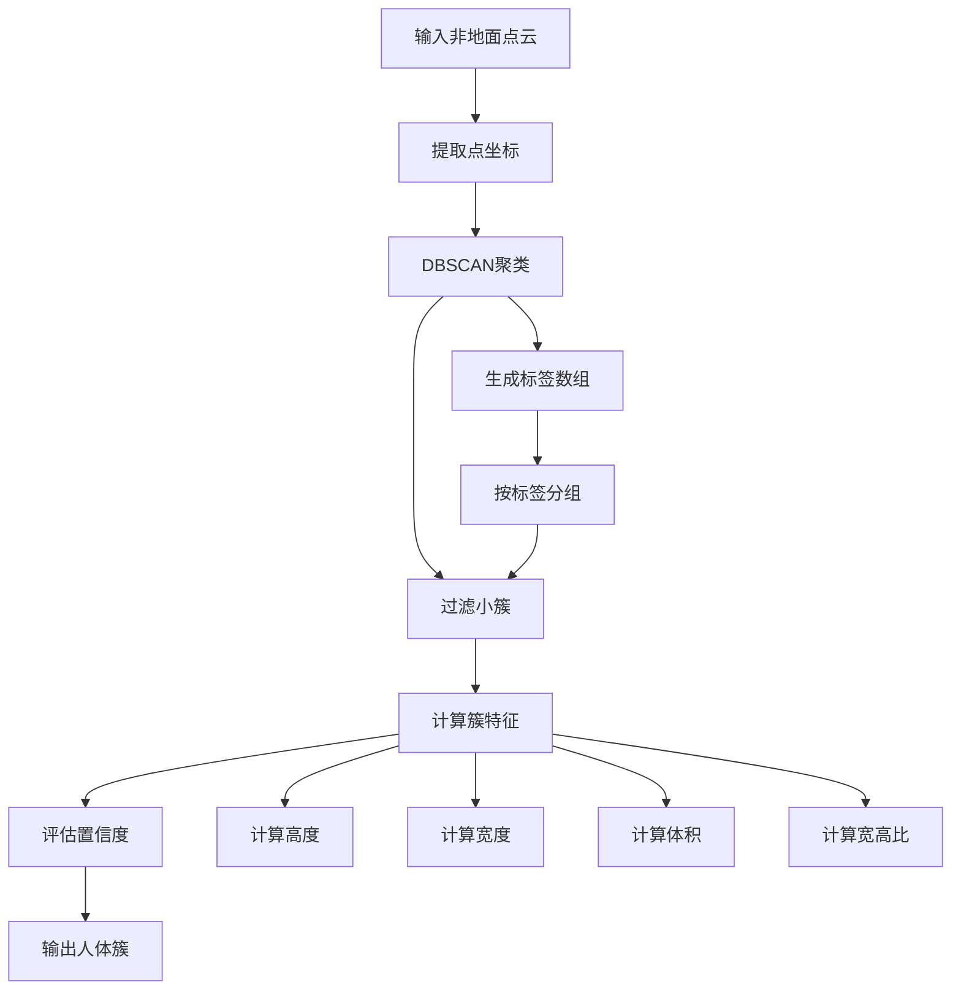

**图表来源**
- [src/preprocessing/clustering.py:124-181](file://src/preprocessing/clustering.py#L124-L181)
- [src/preprocessing/clustering.py:183-220](file://src/preprocessing/clustering.py#L183-L220)

**章节来源**
- [src/preprocessing/clustering.py:99-221](file://src/preprocessing/clustering.py#L99-L221)

### 规则引擎检测逻辑

规则引擎采用多特征融合的检测策略：

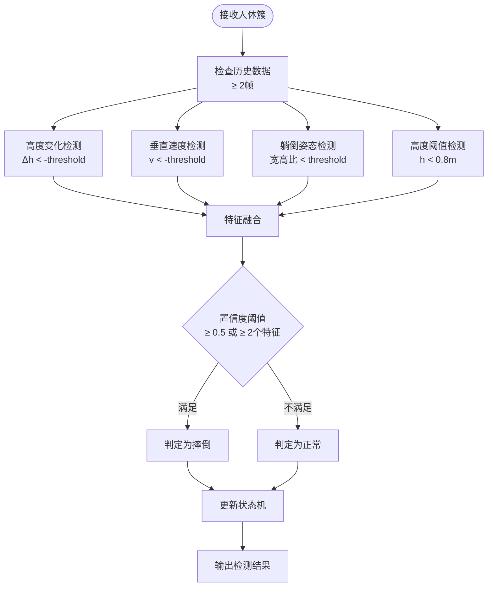

**图表来源**
- [src/detection/rules.py:145-188](file://src/detection/rules.py#L145-L188)
- [src/detection/rules.py:190-224](file://src/detection/rules.py#L190-L224)

**章节来源**
- [src/detection/rules.py:226-337](file://src/detection/rules.py#L226-L337)

## 依赖分析

系统依赖关系清晰，采用松耦合设计：

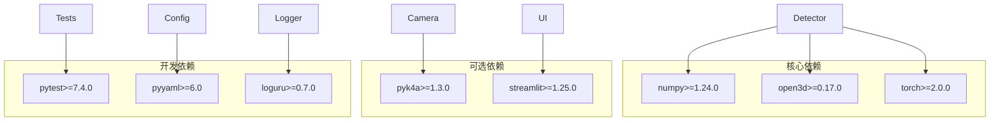

**图表来源**
- [requirements.txt:1-34](file://requirements.txt#L1-L34)

**章节来源**
- [requirements.txt:1-34](file://requirements.txt#L1-L34)

## 性能考虑

### 实时处理优化

系统在设计时充分考虑了实时性能要求：

| 优化策略 | 实现方式 | 性能收益 |
|----------|----------|----------|
| 体素降采样 | leaf_size=0.05m | 减少90%点数 |
| 统计滤波 | std_ratio=2.0 | 去除噪声点 |
| DBSCAN聚类 | eps=0.1m | 快速聚类算法 |
| 状态机缓存 | 历史帧缓存30帧 | 减少重复计算 |

### 内存管理

系统采用分层内存管理策略：

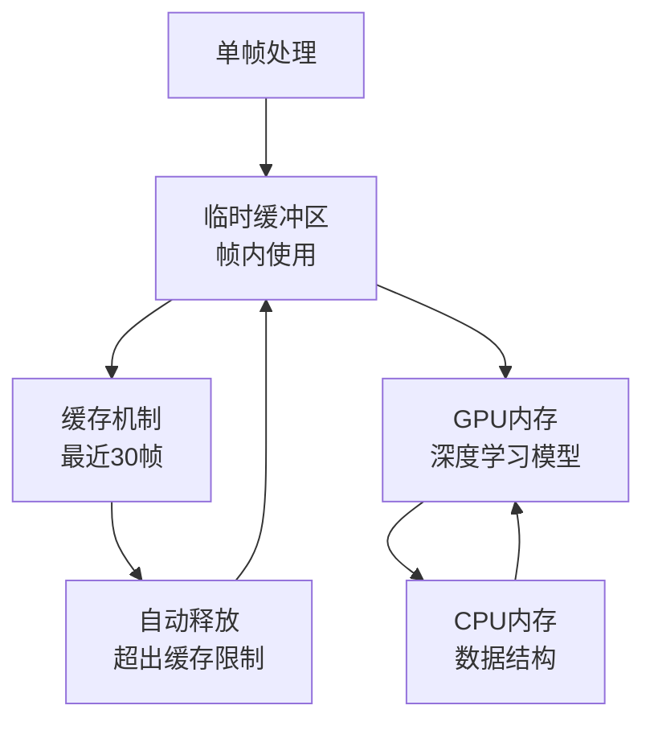

**章节来源**
- [src/detection/detector.py:196-202](file://src/detection/detector.py#L196-L202)
- [src/preprocessing/pipeline.py:215-235](file://src/preprocessing/pipeline.py#L215-L235)

## 故障排除指南

### 常见问题诊断

| 问题类型 | 症状表现 | 可能原因 | 解决方案 |
|----------|----------|----------|----------|
| 检测误报 | 频繁触发报警 | 阈值设置过高 | 调整height_drop_threshold |
| 漏检 | 摔倒未被检测 | 阈值设置过低 | 提高velocity_threshold |
| 性能不足 | 处理延迟>100ms | 点数过多 | 增加voxel_size |
| 内存溢出 | 程序崩溃 | 缓存过大 | 减少历史帧缓存 |

### 调试工具

系统提供了完善的调试和监控功能：

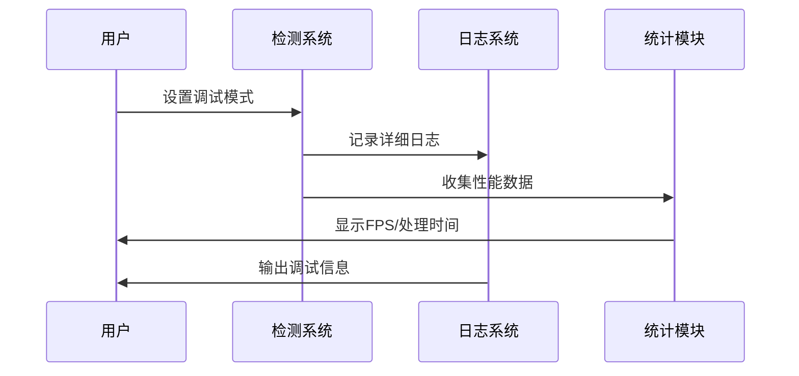

**章节来源**
- [src/detection/detector.py:217-226](file://src/detection/detector.py#L217-L226)
- [src/detection/rules.py:406-414](file://src/detection/rules.py#L406-L414)

## 结论

GuardianFall系统的算法扩展开发具有良好的基础架构和清晰的模块划分。通过本文档提供的指导，开发者可以：

1. **集成新AI检测算法**：利用现有的工厂函数模式和接口规范
2. **改进规则引擎**：基于状态机设计进行功能增强
3. **开发自定义检测逻辑**：遵循模块化设计理念
4. **优化性能**：在保证准确率的前提下提升实时性能

系统的技术栈成熟稳定，依赖关系清晰，为算法扩展提供了良好的开发环境。

## 附录

### 开发最佳实践

1. **模块化设计**：遵循单一职责原则
2. **接口一致性**：保持API接口的稳定性
3. **性能监控**：持续跟踪处理延迟和资源使用
4. **测试覆盖**：为新算法提供单元测试和集成测试

### 扩展开发路线图

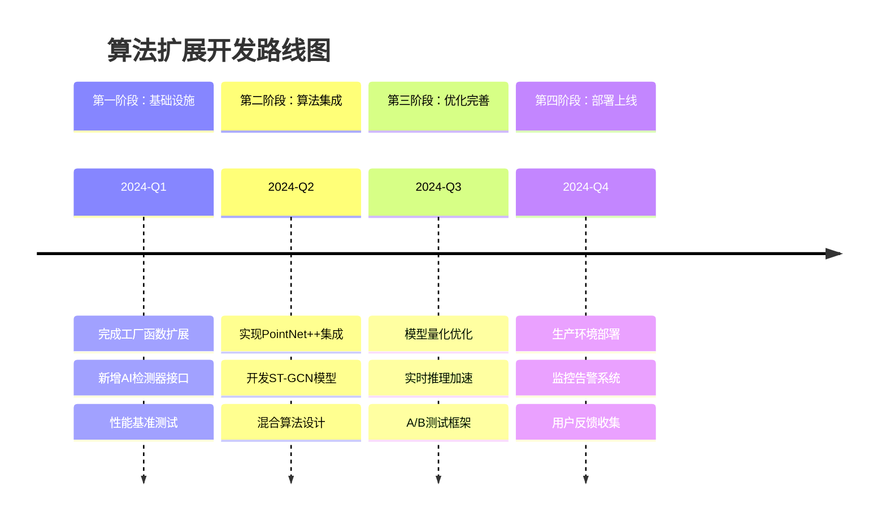