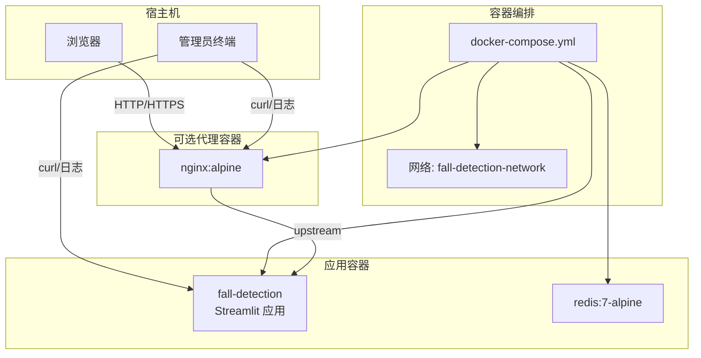
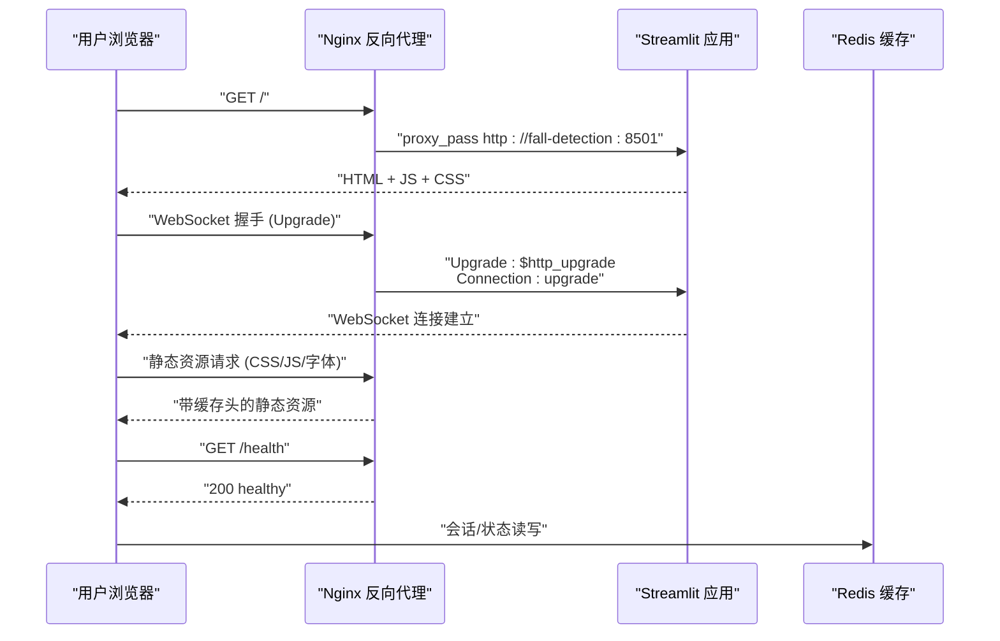
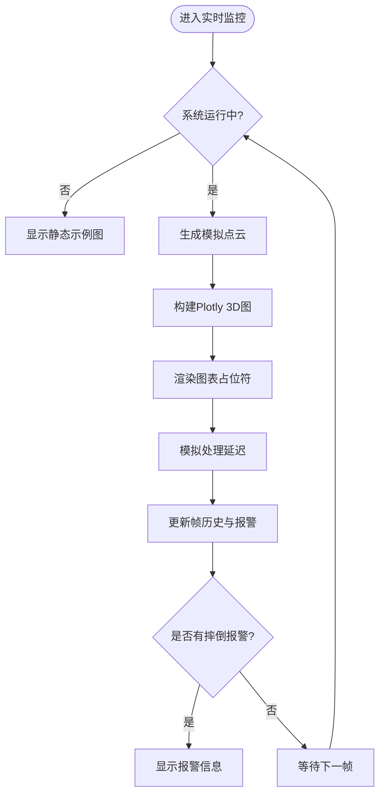
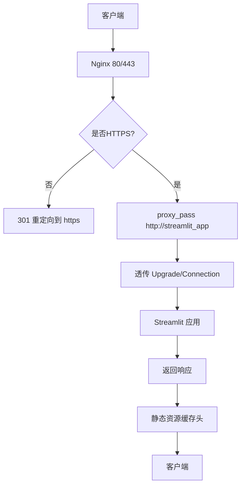
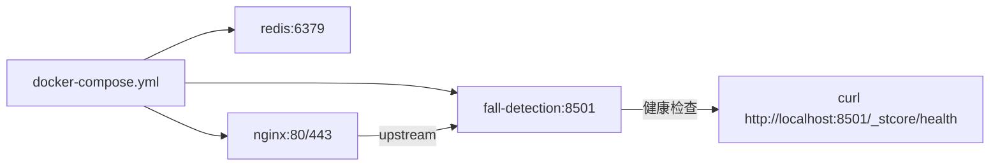
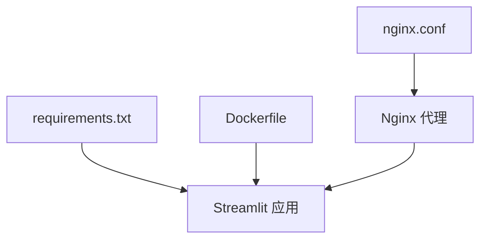
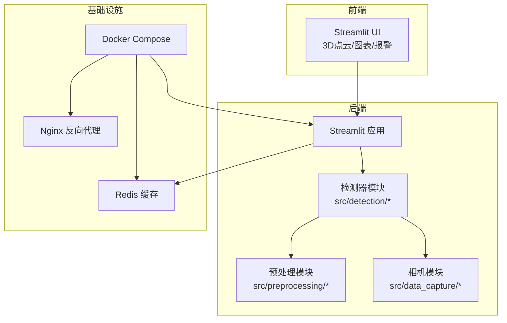

# Web界面问题

<cite>
**本文引用的文件**
- [app.py](file://app.py)
- [nginx.conf](file://nginx.conf)
- [docker-compose.yml](file://docker-compose.yml)
- [Dockerfile](file://Dockerfile)
- [requirements.txt](file://requirements.txt)
- [start.sh](file://start.sh)
- [deploy.sh](file://deploy.sh)
- [docs/WEB_UI_GUIDE.md](file://docs/WEB_UI_GUIDE.md)
- [src/detection/detector.py](file://src/detection/detector.py)
- [src/data_capture/azure_kinect.py](file://src/data_capture/azure_kinect.py)
- [demos/fall_detection_demo.py](file://demos/fall_detection_demo.py)
</cite>

## 目录
1. [简介](#简介)
2. [项目结构](#项目结构)
3. [核心组件](#核心组件)
4. [架构总览](#架构总览)
5. [详细组件分析](#详细组件分析)
6. [依赖分析](#依赖分析)
7. [性能考虑](#性能考虑)
8. [故障排查指南](#故障排查指南)
9. [结论](#结论)
10. [附录](#附录)

## 简介
本文件面向GuardianFall系统的Web界面（Streamlit）使用者与运维人员，提供系统性的问题诊断与解决指南。内容覆盖页面无法访问、页面加载失败、实时数据不更新、静态资源加载失败、WebSocket连接问题、跨域请求错误、Nginx反向代理配置问题、防火墙端口阻塞、浏览器兼容性问题、网络连接异常等常见场景，并配套curl测试、浏览器开发者工具使用、网络连通性检查等实用诊断技巧。

## 项目结构
GuardianFall系统采用Streamlit作为Web界面，配合Docker容器化部署，可选Nginx反向代理提供HTTPS与健康检查端点。系统还包含点云处理、人体聚类与摔倒检测算法模块，以及Demo脚本用于无硬件场景下的演示。

**图表来源**
- [docker-compose.yml:6-149](file://docker-compose.yml#L6-L149)
- [nginx.conf:32-119](file://nginx.conf#L32-L119)
- [Dockerfile:1-50](file://Dockerfile#L1-L50)

**章节来源**
- [docker-compose.yml:1-149](file://docker-compose.yml#L1-L149)
- [nginx.conf:1-127](file://nginx.conf#L1-L127)
- [Dockerfile:1-50](file://Dockerfile#L1-L50)

## 核心组件
- Streamlit Web界面：负责实时3D点云展示、检测结果可视化、报警历史、系统状态与参数配置。
- Nginx反向代理：提供HTTPS、WebSocket支持、健康检查端点、静态资源缓存与安全头。
- Docker Compose：统一编排应用、Redis缓存、Nginx代理及网络。
- 健康检查：Streamlit健康端点与Docker健康检查共同保障可用性。
- Demo与脚本：一键启动脚本与部署脚本简化本地与生产环境部署。

**章节来源**
- [app.py:1-662](file://app.py#L1-L662)
- [nginx.conf:1-127](file://nginx.conf#L1-L127)
- [docker-compose.yml:1-149](file://docker-compose.yml#L1-L149)
- [Dockerfile:1-50](file://Dockerfile#L1-L50)
- [start.sh:1-109](file://start.sh#L1-L109)
- [deploy.sh:1-243](file://deploy.sh#L1-L243)

## 架构总览
Web界面通过Streamlit提供交互式UI；在生产环境中，Nginx作为反向代理接收外部请求，转发至Streamlit应用，并为WebSocket升级、安全头与静态资源缓存提供支持。Docker Compose负责容器编排与网络隔离。

**图表来源**
- [nginx.conf:78-119](file://nginx.conf#L78-L119)
- [docker-compose.yml:102-136](file://docker-compose.yml#L102-L136)
- [Dockerfile:44-49](file://Dockerfile#L44-L49)

## 详细组件分析

### Streamlit界面（app.py）
- 页面配置与样式：设置页面标题、图标、布局与自定义CSS样式。
- 会话状态：维护系统实例、运行状态、报警历史、帧历史、起始时间与配置。
- 实时监控Tab：3D点云渲染、检测结果面板、报警提示与性能指标。
- 统计图表Tab：FPS趋势、处理时间趋势与报警分布。
- 报警历史Tab：过滤、导出CSV。
- 数据管理Tab：数据集列表、配置导入导出与当前配置展示。
- 模拟数据：在未连接真实相机时，使用模拟点云进行演示。

**图表来源**
- [app.py:346-402](file://app.py#L346-L402)

**章节来源**
- [app.py:1-662](file://app.py#L1-L662)

### Nginx反向代理（nginx.conf）
- HTTP重定向：监听80，重定向至HTTPS。
- HTTPS服务器：监听443，启用TLSv1.2/1.3、现代加密套件与安全头。
- 上游服务：指向fall-detection:8501，启用keepalive。
- WebSocket支持：升级头透传，超时与缓冲配置。
- 健康检查端点：/health返回“healthy”。
- 静态资源缓存：图片、CSS、JS、字体缓存一年并添加immutable头。

**图表来源**
- [nginx.conf:38-119](file://nginx.conf#L38-L119)

**章节来源**
- [nginx.conf:1-127](file://nginx.conf#L1-L127)

### Docker编排与健康检查（docker-compose.yml）
- fall-detection服务：端口映射8501:8501，环境变量配置Streamlit，健康检查调用应用内部健康端点。
- Redis服务：会话缓存，健康检查使用redis-cli ping。
- Nginx服务：端口映射80:80、443:443，挂载nginx.conf与SSL证书，依赖fall-detection。
- 网络：统一桥接网络fall-detection-network，便于容器间通信。

**图表来源**
- [docker-compose.yml:6-149](file://docker-compose.yml#L6-L149)
- [Dockerfile:44-49](file://Dockerfile#L44-L49)

**章节来源**
- [docker-compose.yml:1-149](file://docker-compose.yml#L1-L149)
- [Dockerfile:1-50](file://Dockerfile#L1-L50)

### 健康检查与部署脚本
- Streamlit健康端点：/_stcore/health。
- Docker健康检查：每30秒执行curl，启动期40秒，超时10秒，重试3次。
- 部署脚本：一键安装Docker/Docker Compose、停止旧服务、构建镜像、启动服务、等待就绪、显示访问信息与日志查看命令。

**章节来源**
- [Dockerfile:44-49](file://Dockerfile#L44-L49)
- [deploy.sh:1-243](file://deploy.sh#L1-L243)

## 依赖分析
- Streamlit应用依赖：numpy、open3d、plotly、pandas、loguru等。
- Dockerfile中声明了系统依赖（GL、USB、FFmpeg等），确保图形与媒体处理能力。
- Nginx依赖SSL证书与上游服务可达性。

**图表来源**
- [requirements.txt:1-34](file://requirements.txt#L1-L34)
- [Dockerfile:17-27](file://Dockerfile#L17-L27)
- [nginx.conf:58-119](file://nginx.conf#L58-L119)

**章节来源**
- [requirements.txt:1-34](file://requirements.txt#L1-L34)
- [Dockerfile:1-50](file://Dockerfile#L1-L50)
- [nginx.conf:1-127](file://nginx.conf#L1-L127)

## 性能考虑
- Streamlit渲染3D点云与实时图表对CPU/GPU有一定压力，可通过增大体素尺寸、降低帧率、减少点云分辨率等方式优化。
- Nginx开启Gzip压缩与静态资源缓存，有助于提升页面加载速度。
- WebSocket长连接在高并发下需关注上游服务的处理能力与超时配置。

[本节为通用指导，无需特定文件引用]

## 故障排查指南

### 一、页面无法访问
- 本地访问
  - 确认Streamlit服务已在8501端口监听且未被占用。
  - 使用curl验证健康端点：curl -I http://localhost:8501/_stcore/health
  - 若使用Docker Compose，确认容器状态与端口映射。
- 生产访问（Nginx）
  - 检查Nginx是否监听80/443，证书是否存在。
  - 使用curl验证健康端点：curl -I http://外网IP/health
  - 查看Nginx访问/错误日志定位问题。
- 常见原因
  - 端口被占用或防火墙阻断
  - Nginx上游地址错误或容器未就绪
  - 证书配置错误导致HTTPS握手失败

**章节来源**
- [deploy.sh:84-102](file://deploy.sh#L84-L102)
- [docker-compose.yml:16-17](file://docker-compose.yml#L16-L17)
- [nginx.conf:38-119](file://nginx.conf#L38-L119)

### 二、页面加载失败（静态资源问题）
- 现象：CSS/JS/字体加载失败或白屏。
- 排查步骤
  - 浏览器开发者工具Network标签查看静态资源404/502/504。
  - 检查Nginx静态资源缓存配置与路径映射。
  - 确认Docker卷挂载nginx.conf与ssl目录。
- 解决方案
  - 重新构建并启动容器，确保配置文件挂载正确。
  - 检查Nginx日志中的错误码与上游响应。

**章节来源**
- [nginx.conf:115-118](file://nginx.conf#L115-L118)
- [docker-compose.yml:114-116](file://docker-compose.yml#L114-L116)

### 三、实时数据不更新（WebSocket连接问题）
- 现象：页面空白、图表不刷新、报警不出现。
- 排查步骤
  - 浏览器开发者工具Network标签查看WebSocket握手与升级头。
  - 确认Nginx已透传Upgrade/Connection头部。
  - 使用curl验证Streamlit健康端点，确认应用存活。
- 解决方案
  - 检查Nginx代理头配置，确保升级头透传。
  - 重启Nginx与Streamlit容器，清理浏览器缓存。
  - 如无Nginx，直接访问容器内8501端口验证。

**章节来源**
- [nginx.conf:82-92](file://nginx.conf#L82-L92)
- [Dockerfile:44-49](file://Dockerfile#L44-L49)

### 四、跨域请求错误（CORS）
- 现象：前端请求后端API时报跨域错误。
- 排查步骤
  - 浏览器开发者工具Console查看CORS错误。
  - 确认Nginx是否配置了必要的安全头与代理头。
- 解决方案
  - 在Nginx中添加或检查CORS相关头（如Access-Control-Allow-Origin等）。
  - 若为同源访问，检查代理头Host/X-Forwarded-*是否正确透传。

**章节来源**
- [nginx.conf:70-76](file://nginx.conf#L70-L76)
- [nginx.conf:86-92](file://nginx.conf#L86-L92)

### 五、防火墙端口阻塞
- 现象：外网无法访问，内网访问正常。
- 排查步骤
  - 使用telnet或nc测试80/443端口连通性。
  - 检查服务器防火墙策略与安全组规则。
- 解决方案
  - 开放80/443端口，必要时开放8501端口（不推荐暴露给公网）。
  - 使用Nginx作为唯一对外入口，避免直接暴露应用端口。

**章节来源**
- [docker-compose.yml:109-111](file://docker-compose.yml#L109-L111)
- [nginx.conf:38-51](file://nginx.conf#L38-L51)

### 六、浏览器兼容性问题
- 现象：部分浏览器无法加载或显示异常。
- 排查步骤
  - 使用最新版Chrome/Firefox/Safari测试。
  - 检查浏览器Console与Network标签。
- 解决方案
  - 确保Nginx启用了正确的MIME类型与缓存头。
  - 避免使用过时的浏览器版本。

**章节来源**
- [nginx.conf:24-30](file://nginx.conf#L24-L30)

### 七、网络连接异常
- 现象：页面加载缓慢或超时。
- 排查步骤
  - 使用curl -w "@-" -o /dev/null -s http://外网IP/health测试RTT与状态码。
  - 检查Nginx超时配置与上游连接超时。
- 解决方案
  - 调整proxy_connect/send/read_timeout。
  - 优化上游Streamlit性能（降低体素尺寸、帧率）。

**章节来源**
- [nginx.conf:94-98](file://nginx.conf#L94-L98)

### 八、curl测试清单
- 应用健康检查
  - curl -I http://localhost:8501/_stcore/health
  - curl -I http://外网IP/health
- WebSocket握手
  - curl -i -N -H "Connection: Upgrade" -H "Upgrade: websocket" http://localhost:8501
- 静态资源
  - curl -I http://localhost:8501/static/css/main.css
- 日志与状态
  - docker-compose logs -f fall-detection
  - docker-compose ps

**章节来源**
- [Dockerfile:44-49](file://Dockerfile#L44-L49)
- [nginx.conf:108-112](file://nginx.conf#L108-L112)
- [deploy.sh:174-176](file://deploy.sh#L174-L176)

### 九、浏览器开发者工具使用
- Network标签
  - 查看请求/响应状态码、Headers、Timing与WebSocket升级。
- Console标签
  - 查看JavaScript错误与CORS错误。
- Application标签
  - 查看Cookies、Local Storage与缓存状态。

**章节来源**
- [app.py:42-81](file://app.py#L42-L81)

### 十、网络连通性检查
- 本机连通性
  - curl -I http://localhost:8501/_stcore/health
- 容器间连通性
  - docker exec -it fall-detection-system curl -I http://localhost:8501/_stcore/health
- 外网连通性
  - curl -I http://外网IP/health

**章节来源**
- [deploy.sh:89-101](file://deploy.sh#L89-L101)

### 十一、常见问题与建议
- 浏览器未自动打开
  - 手动访问 http://localhost:8501
- 端口被占用
  - 使用其他端口启动：streamlit run app.py --server.port 8502
- 点云显示空白
  - 确认已点击“启动”，检查相机连接（若使用真实相机），尝试“重置”
- FPS过低
  - 增大体素尺寸、降低帧率、减少点云分辨率、关闭其他占用CPU的程序
- 误报/漏报
  - 调整高度骤降阈值、速度阈值、确认帧数，或检查相机角度与位置

**章节来源**
- [docs/WEB_UI_GUIDE.md:265-308](file://docs/WEB_UI_GUIDE.md#L265-L308)

## 结论
通过结合Streamlit健康检查、Docker健康检查、Nginx代理与浏览器开发者工具，可系统性地定位并解决GuardianFall Web界面的访问与数据更新问题。建议在生产环境始终使用Nginx作为统一入口，合理配置WebSocket、静态资源缓存与安全头，并定期检查日志与网络连通性。

## 附录

### A. 一键启动与部署
- 一键启动脚本：start.sh 提供本地开发环境的便捷启动。
- 一键部署脚本：deploy.sh 提供完整的安装、构建、启动与状态检查流程。

**章节来源**
- [start.sh:1-109](file://start.sh#L1-L109)
- [deploy.sh:1-243](file://deploy.sh#L1-L243)

### B. 系统架构与数据流

**图表来源**
- [app.py:29-30](file://app.py#L29-L30)
- [src/detection/detector.py:1-200](file://src/detection/detector.py#L1-L200)
- [src/data_capture/azure_kinect.py:1-200](file://src/data_capture/azure_kinect.py#L1-L200)
- [docker-compose.yml:6-149](file://docker-compose.yml#L6-L149)
- [nginx.conf:32-119](file://nginx.conf#L32-L119)