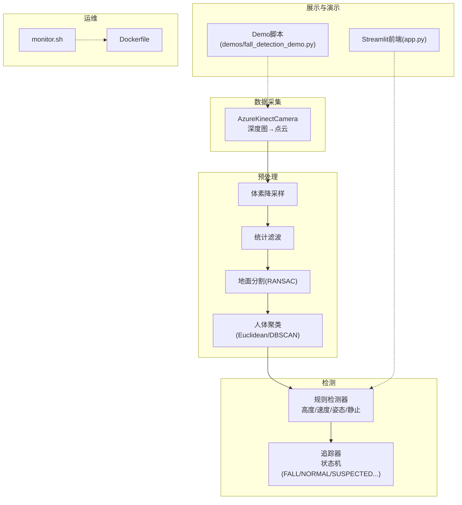
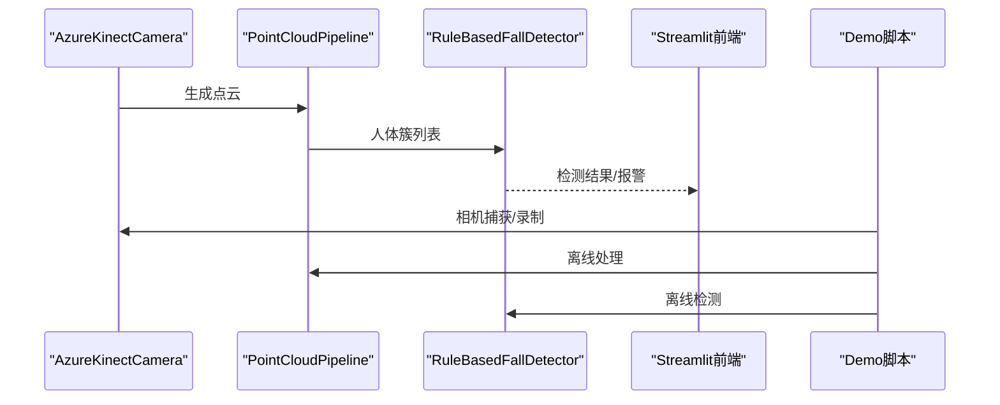
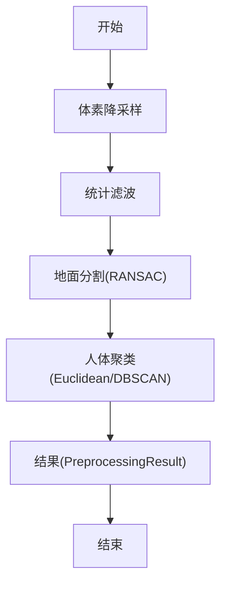
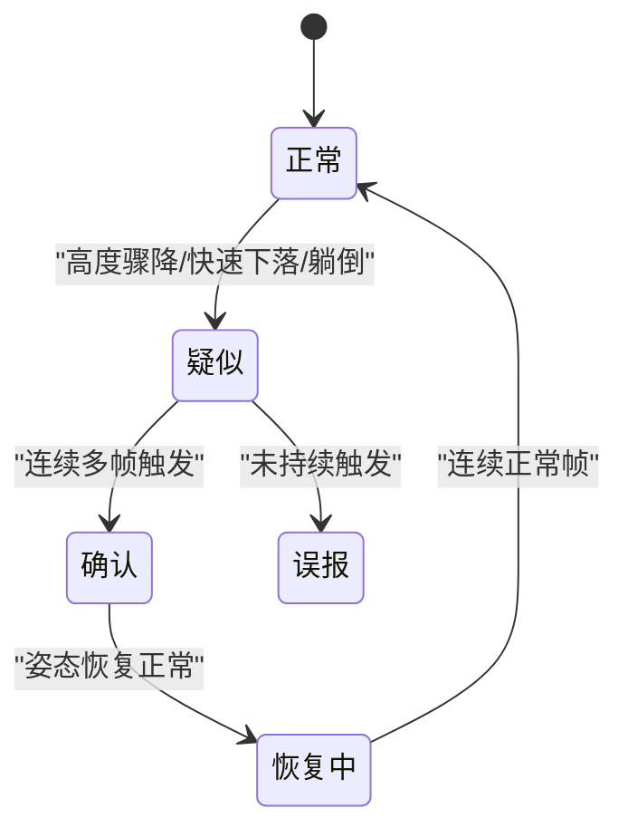
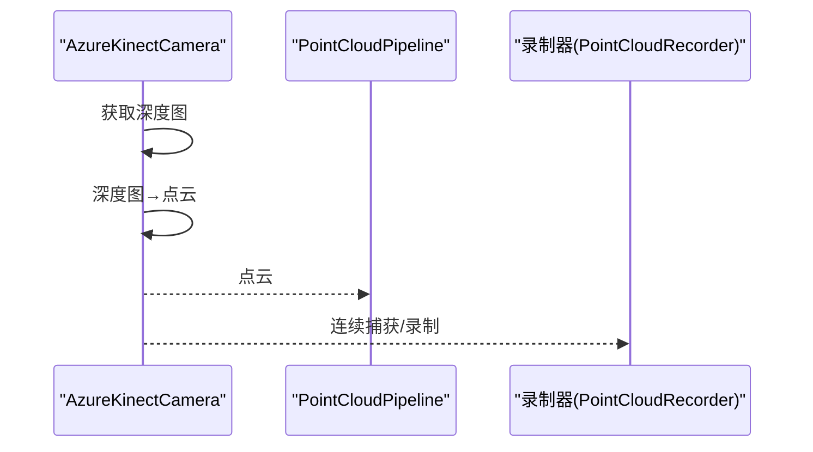
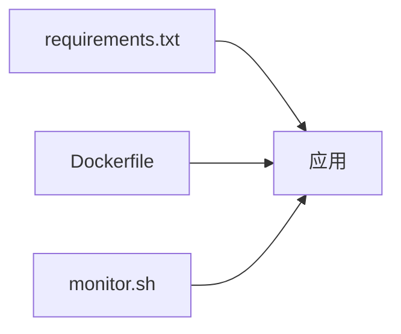

# 性能问题

<cite>
**本文引用的文件**
- [app.py](file://app.py)
- [src/preprocessing/pipeline.py](file://src/preprocessing/pipeline.py)
- [src/preprocessing/clustering.py](file://src/preprocessing/clustering.py)
- [src/preprocessing/filtering.py](file://src/preprocessing/filtering.py)
- [src/preprocessing/segmentation.py](file://src/preprocessing/segmentation.py)
- [src/detection/detector.py](file://src/detection/detector.py)
- [src/detection/rules.py](file://src/detection/rules.py)
- [src/data_capture/azure_kinect.py](file://src/data_capture/azure_kinect.py)
- [demos/fall_detection_demo.py](file://demos/fall_detection_demo.py)
- [monitor.sh](file://monitor.sh)
- [Dockerfile](file://Dockerfile)
- [requirements.txt](file://requirements.txt)
</cite>

## 目录
1. [简介](#简介)
2. [项目结构](#项目结构)
3. [核心组件](#核心组件)
4. [架构总览](#架构总览)
5. [详细组件分析](#详细组件分析)
6. [依赖分析](#依赖分析)
7. [性能考虑](#性能考虑)
8. [故障排查指南](#故障排查指南)
9. [结论](#结论)
10. [附录](#附录)

## 简介
本文件面向GuardianFall（摔倒检测）系统，聚焦于性能问题诊断与优化，覆盖CPU使用率过高、内存泄漏、磁盘I/O瓶颈、网络延迟等常见问题，并结合系统中的点云处理流水线，提出降采样、缓存机制、并行处理等优化策略。同时提供系统资源监控工具的使用指南与硬件资源配置建议。

## 项目结构
系统采用模块化设计，主要分为：
- 数据采集层：Azure Kinect相机封装，负责深度图到点云的转换与连续捕获
- 预处理层：体素降采样、统计滤波、地面分割、聚类
- 检测层：基于规则的摔倒检测与状态跟踪
- 可视化与演示：Streamlit前端、Demo脚本
- 运维与容器：Dockerfile、监控脚本

图表来源
- [src/data_capture/azure_kinect.py:47-460](file://src/data_capture/azure_kinect.py#L47-L460)
- [src/preprocessing/filtering.py:13-139](file://src/preprocessing/filtering.py#L13-L139)
- [src/preprocessing/segmentation.py:13-81](file://src/preprocessing/segmentation.py#L13-L81)
- [src/preprocessing/clustering.py:99-181](file://src/preprocessing/clustering.py#L99-L181)
- [src/detection/rules.py:226-337](file://src/detection/rules.py#L226-L337)
- [src/detection/detector.py:75-227](file://src/detection/detector.py#L75-L227)
- [app.py:104-450](file://app.py#L104-L450)
- [demos/fall_detection_demo.py:181-271](file://demos/fall_detection_demo.py#L181-L271)
- [monitor.sh:127-146](file://monitor.sh#L127-L146)
- [Dockerfile:1-50](file://Dockerfile#L1-L50)

章节来源
- [app.py:1-662](file://app.py#L1-L662)
- [src/data_capture/azure_kinect.py:1-532](file://src/data_capture/azure_kinect.py#L1-L532)
- [src/preprocessing/pipeline.py:1-337](file://src/preprocessing/pipeline.py#L1-L337)
- [src/detection/detector.py:1-373](file://src/detection/detector.py#L1-L373)
- [monitor.sh:1-183](file://monitor.sh#L1-L183)
- [Dockerfile:1-50](file://Dockerfile#L1-L50)

## 核心组件
- 点云预处理流水线：体素降采样、统计滤波、地面分割、聚类，提供标准与实时两种模式
- 摔倒检测系统：整合预处理与规则检测，维护追踪器状态机
- 数据采集模块：Azure Kinect相机封装，支持连续捕获与录制
- 可视化与演示：Streamlit前端与Demo脚本，便于调试与演示
- 运维监控：Shell脚本与Docker健康检查，辅助运行时监控

章节来源
- [src/preprocessing/pipeline.py:65-178](file://src/preprocessing/pipeline.py#L65-L178)
- [src/detection/detector.py:75-227](file://src/detection/detector.py#L75-L227)
- [src/data_capture/azure_kinect.py:47-460](file://src/data_capture/azure_kinect.py#L47-L460)
- [app.py:104-450](file://app.py#L104-L450)
- [demos/fall_detection_demo.py:181-271](file://demos/fall_detection_demo.py#L181-L271)
- [monitor.sh:1-183](file://monitor.sh#L1-L183)
- [Dockerfile:44-49](file://Dockerfile#L44-L49)

## 架构总览
系统采用“数据采集→预处理→检测→可视化”的流水线架构。数据采集层负责将深度图转换为点云；预处理层对点云进行降采样、滤波、地面分割与聚类；检测层基于规则对簇进行摔倒判定并维护状态；前端通过Streamlit展示实时点云与检测结果；Demo脚本提供离线与在线两种运行模式；monitor.sh与Dockerfile提供容器化与健康检查能力。

图表来源
- [src/data_capture/azure_kinect.py:216-283](file://src/data_capture/azure_kinect.py#L216-L283)
- [src/preprocessing/pipeline.py:98-139](file://src/preprocessing/pipeline.py#L98-L139)
- [src/detection/detector.py:138-227](file://src/detection/detector.py#L138-L227)
- [app.py:346-402](file://app.py#L346-L402)
- [demos/fall_detection_demo.py:181-271](file://demos/fall_detection_demo.py#L181-L271)

## 详细组件分析

### 点云预处理流水线
- 体素降采样：大幅减少点数，提升后续处理效率
- 统计滤波：去除离群点，提高鲁棒性
- 地面分割：RANSAC拟合平面，分离地面与非地面
- 人体聚类：DBSCAN/Euclidean聚类，提取人体簇并计算几何特征
- 实时优化：维护最近N帧FPS历史，便于动态调参

图表来源
- [src/preprocessing/pipeline.py:98-139](file://src/preprocessing/pipeline.py#L98-L139)
- [src/preprocessing/filtering.py:13-139](file://src/preprocessing/filtering.py#L13-L139)
- [src/preprocessing/segmentation.py:41-81](file://src/preprocessing/segmentation.py#L41-L81)
- [src/preprocessing/clustering.py:124-181](file://src/preprocessing/clustering.py#L124-L181)

章节来源
- [src/preprocessing/pipeline.py:65-250](file://src/preprocessing/pipeline.py#L65-L250)
- [src/preprocessing/filtering.py:13-139](file://src/preprocessing/filtering.py#L13-L139)
- [src/preprocessing/segmentation.py:13-81](file://src/preprocessing/segmentation.py#L13-L81)
- [src/preprocessing/clustering.py:99-181](file://src/preprocessing/clustering.py#L99-L181)

### 摔倒检测系统与规则引擎
- 状态机：NORMAL→SUSPECTED→CONFIRMED→RECOVERING→NORMAL，支持误报与恢复
- 检测指标：高度变化、垂直速度、宽高比、姿态
- 报警级别：info/warning/critical，区分疑似与确认
- 追踪器：按簇ID维护历史，限制存储大小，避免内存膨胀

图表来源
- [src/detection/rules.py:22-224](file://src/detection/rules.py#L22-L224)

章节来源
- [src/detection/detector.py:75-227](file://src/detection/detector.py#L75-L227)
- [src/detection/rules.py:226-423](file://src/detection/rules.py#L226-L423)

### 数据采集与录制
- 相机封装：支持NFOV/WFOV、彩色关闭/开启、帧率控制
- 深度图→点云：针孔相机模型重建，移除无效点
- 连续捕获与录制：支持时长控制与元数据保存

图表来源
- [src/data_capture/azure_kinect.py:216-440](file://src/data_capture/azure_kinect.py#L216-L440)

章节来源
- [src/data_capture/azure_kinect.py:47-460](file://src/data_capture/azure_kinect.py#L47-L460)

### 可视化与演示
- Streamlit前端：实时点云3D显示、检测结果、报警历史、配置管理
- Demo脚本：模拟数据/真实相机/录制三种模式，便于离线验证与演示

章节来源
- [app.py:104-450](file://app.py#L104-L450)
- [demos/fall_detection_demo.py:92-179](file://demos/fall_detection_demo.py#L92-L179)

## 依赖分析
- Python依赖：numpy、open3d、torch系列、matplotlib、opencv、streamlit、plotly、pandas、loguru等
- 容器化：Dockerfile定义基础镜像、环境变量、系统依赖与健康检查
- 运维脚本：monitor.sh提供服务状态、资源使用、日志查看与自动重启

图表来源
- [requirements.txt:1-34](file://requirements.txt#L1-L34)
- [Dockerfile:1-50](file://Dockerfile#L1-L50)
- [monitor.sh:1-183](file://monitor.sh#L1-L183)

章节来源
- [requirements.txt:1-34](file://requirements.txt#L1-L34)
- [Dockerfile:1-50](file://Dockerfile#L1-L50)
- [monitor.sh:1-183](file://monitor.sh#L1-L183)

## 性能考虑

### CPU使用率过高
- 症状：帧率下降、处理时间上升、系统负载高
- 根因定位
  - 体素降采样粒度过细导致点数仍较多
  - 统计滤波邻域过大或标准差倍数过小
  - 聚类半径过小导致大量簇，增加追踪器数量
  - RANSAC迭代次数过多
  - Streamlit渲染3D图与图表造成额外CPU消耗
- 优化策略
  - 调整体素尺寸与统计滤波参数，减少点数
  - 合理设置聚类容忍半径与最小簇点数，避免过度细分
  - 降低RANSAC迭代次数或阈值，平衡精度与性能
  - 在Streamlit中按需刷新图表，减少不必要的Plotly重绘
  - 对连续帧处理启用实时模式，利用历史帧做平滑

章节来源
- [src/preprocessing/filtering.py:13-49](file://src/preprocessing/filtering.py#L13-L49)
- [src/preprocessing/segmentation.py:13-81](file://src/preprocessing/segmentation.py#L13-L81)
- [src/preprocessing/clustering.py:99-181](file://src/preprocessing/clustering.py#L99-L181)
- [src/preprocessing/pipeline.py:180-250](file://src/preprocessing/pipeline.py#L180-L250)
- [app.py:346-402](file://app.py#L346-L402)

### 内存泄漏
- 症状：RSS持续增长、系统频繁回收、容器被OOMKilled
- 根因定位
  - 追踪器历史记录未清理或容量过大
  - 大量点云对象未释放或重复构造
  - Streamlit session state累积报警与帧历史
- 优化策略
  - 限制PersonTracker历史长度（如最近30帧），及时清理
  - 使用select_by_index等高效索引操作，避免复制点云
  - 控制Streamlit session state大小，定期截断历史
  - 在容器中设置内存限制与健康检查，配合monitor.sh自动重启

章节来源
- [src/detection/rules.py:82-114](file://src/detection/rules.py#L82-L114)
- [src/detection/detector.py:261-272](file://src/detection/detector.py#L261-L272)
- [app.py:83-94](file://app.py#L83-L94)
- [monitor.sh:112-125](file://monitor.sh#L112-L125)

### 磁盘I/O瓶颈
- 症状：磁盘写入延迟高、录制卡顿、空间占用飙升
- 根因定位
  - 录制时长过长、点云文件过大
  - 元数据频繁写入
  - 缓冲区未优化
- 优化策略
  - 控制录制时长与帧率，压缩点云格式（PLY/PCD）
  - 合并写入批次，减少元数据写入频率
  - 使用SSD或高性能磁盘，合理规划数据目录结构

章节来源
- [src/data_capture/azure_kinect.py:398-439](file://src/data_capture/azure_kinect.py#L398-L439)

### 网络延迟
- 症状：Streamlit页面加载慢、图表渲染卡顿
- 根因定位
  - 前端渲染3D图与图表密集
  - 服务器带宽不足或并发过高
- 优化策略
  - 减少3D点云密度与图表刷新频率
  - 使用本地部署或边缘节点，降低跨网络传输
  - 优化Docker网络配置与暴露端口

章节来源
- [app.py:346-402](file://app.py#L346-L402)
- [Dockerfile:41-49](file://Dockerfile#L41-L49)

### 点云处理流水线性能热点
- 体素降采样与统计滤波：点数规模决定计算复杂度
- 地面分割：RANSAC拟合对点数敏感
- 聚类：DBSCAN/Euclidean对点云规模与参数敏感
- 规则检测：状态机与历史查询的开销
- 可视化：3D渲染与Plotly图表绘制

优化建议
- 降采样：增大leaf_size，减少点数
- 滤波：适度增大邻域与阈值，减少离群点剔除成本
- 聚类：增大cluster_tolerance，减少簇数量
- 缓存：对历史帧与中间结果做有限缓存
- 并行：在批处理场景使用多进程/多线程（注意GIL与数据共享）

章节来源
- [src/preprocessing/pipeline.py:98-178](file://src/preprocessing/pipeline.py#L98-L178)
- [src/preprocessing/clustering.py:124-181](file://src/preprocessing/clustering.py#L124-L181)
- [src/detection/rules.py:266-337](file://src/detection/rules.py#L266-L337)

### 系统资源监控工具使用指南
- docker stats：查看容器CPU、内存、网络、IO使用
- htop：查看进程CPU/内存占用与线程
- iotop：查看磁盘I/O进程排行
- iftop：查看网络带宽使用
- monitor.sh：检查服务状态、资源使用、日志与统计信息，支持自动重启

章节来源
- [monitor.sh:1-183](file://monitor.sh#L1-L183)

### 硬件资源配置建议
- CPU：多核CPU优先，建议≥8核，以支持并行处理
- 内存：≥16GB，留足Open3D与深度学习库内存
- 存储：SSD，建议≥500GB，用于录制与数据集
- 网络：千兆网卡，保障Streamlit访问
- GPU：可选，用于深度学习推理（当前系统以CPU为主）

章节来源
- [requirements.txt:1-34](file://requirements.txt#L1-L34)
- [Dockerfile:18-27](file://Dockerfile#L18-L27)

### 系统调优最佳实践
- 容器层面
  - 设置合理的资源限制与重启策略
  - 使用健康检查与日志聚合
- 运行时
  - 动态调整体素尺寸、聚类半径、RANSAC阈值
  - 控制Streamlit刷新频率与图表复杂度
  - 合理安排录制时长与输出格式
- 监控与告警
  - 结合monitor.sh与外部监控系统
  - 对CPU、内存、磁盘、网络建立阈值告警

章节来源
- [Dockerfile:44-49](file://Dockerfile#L44-L49)
- [monitor.sh:127-146](file://monitor.sh#L127-L146)
- [app.py:346-402](file://app.py#L346-L402)

## 故障排查指南
- 服务不可用
  - 使用monitor.sh status检查容器与HTTP响应
  - 若异常，执行restart并再次status
- CPU/内存异常
  - 使用htop/iostat/iftop定位热点进程与I/O/网络
  - 检查Streamlit前端渲染压力与session state大小
- 磁盘空间不足
  - 检查录制目录与日志目录，清理旧数据
  - 优化录制参数，缩短时长或降低帧率
- 相机连接失败
  - 确认USB3.0线缆与驱动安装
  - 使用demo脚本的camera模式进行连通性测试

章节来源
- [monitor.sh:26-76](file://monitor.sh#L26-L76)
- [demos/fall_detection_demo.py:181-271](file://demos/fall_detection_demo.py#L181-L271)
- [src/data_capture/azure_kinect.py:152-192](file://src/data_capture/azure_kinect.py#L152-L192)

## 结论
通过精细化的点云处理参数、合理的缓存与状态机设计、以及完善的监控与容器化策略，GuardianFall系统可在保证检测准确性的前提下，显著降低CPU与内存压力，缓解磁盘I/O与网络延迟问题。建议在生产环境中结合monitor.sh与Docker健康检查，持续观察系统指标并动态调优。

## 附录
- 关键配置项参考
  - 体素尺寸：voxel_size（影响点数规模）
  - 统计滤波：nb_neighbors/std_ratio（影响离群点剔除）
  - 地面分割：distance_threshold/num_iterations（影响RANSAC拟合）
  - 聚类：cluster_tolerance/min_cluster_size/max_cluster_size（影响簇数量）
  - 规则检测：height_drop_threshold/velocity_threshold/confirmation_frames（影响报警灵敏度）

章节来源
- [src/preprocessing/pipeline.py:68-96](file://src/preprocessing/pipeline.py#L68-L96)
- [src/preprocessing/filtering.py:16-26](file://src/preprocessing/filtering.py#L16-L26)
- [src/preprocessing/segmentation.py:16-35](file://src/preprocessing/segmentation.py#L16-L35)
- [src/preprocessing/clustering.py:102-118](file://src/preprocessing/clustering.py#L102-L118)
- [src/detection/rules.py:229-251](file://src/detection/rules.py#L229-L251)