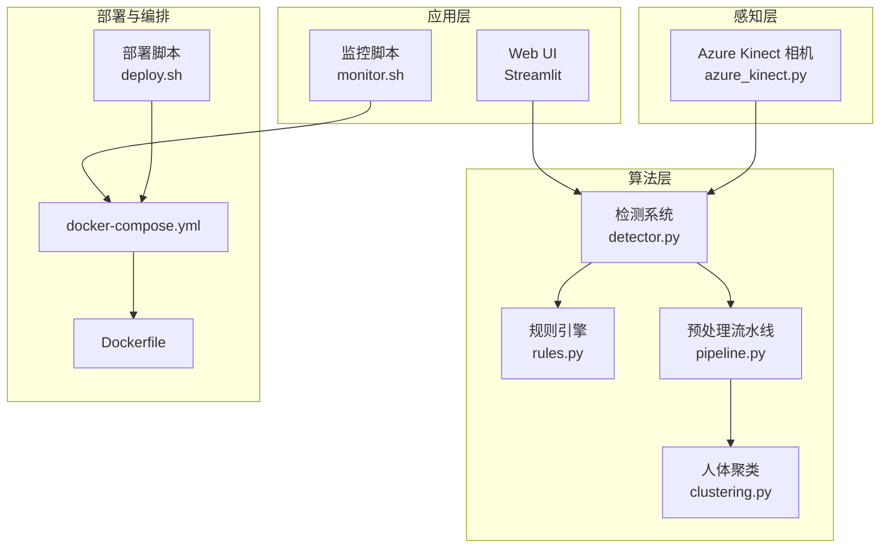
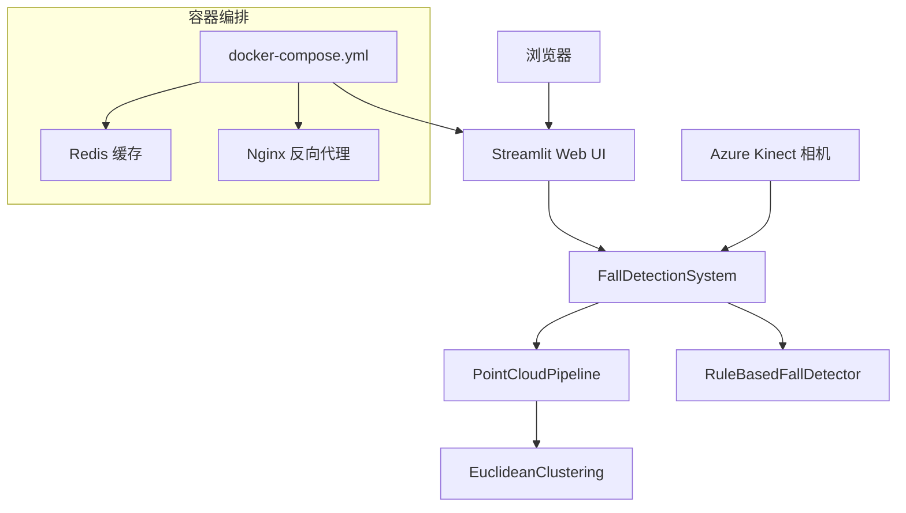
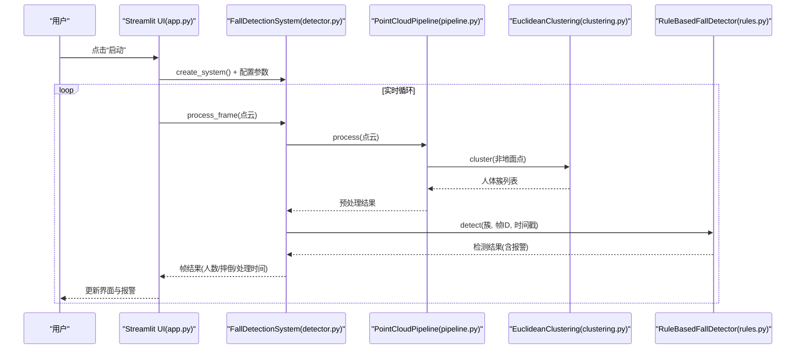
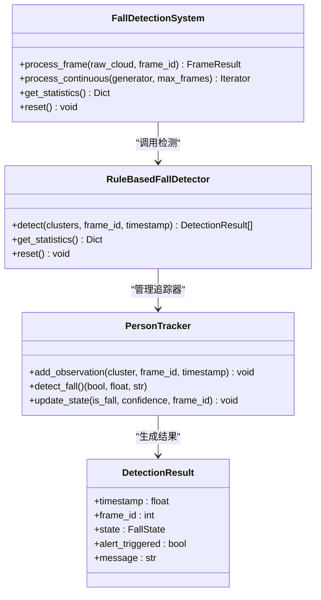
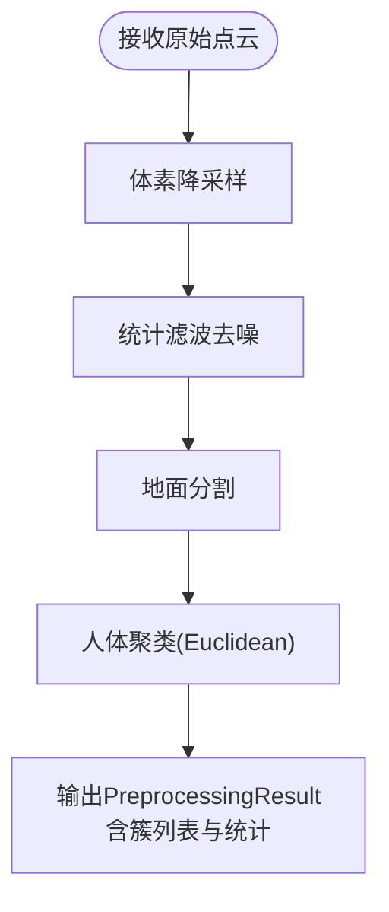
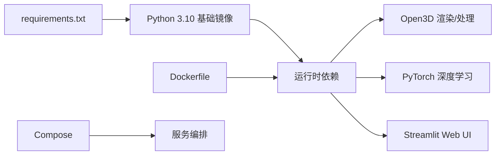

# 故障排查

<cite>
**本文引用的文件**
- [README.md](file://README.md)
- [app.py](file://app.py)
- [requirements.txt](file://requirements.txt)
- [Dockerfile](file://Dockerfile)
- [docker-compose.yml](file://docker-compose.yml)
- [deploy.sh](file://deploy.sh)
- [monitor.sh](file://monitor.sh)
- [src/detection/detector.py](file://src/detection/detector.py)
- [src/detection/rules.py](file://src/detection/rules.py)
- [src/preprocessing/pipeline.py](file://src/preprocessing/pipeline.py)
- [src/preprocessing/clustering.py](file://src/preprocessing/clustering.py)
- [src/data_capture/azure_kinect.py](file://src/data_capture/azure_kinect.py)
- [demos/fall_detection_demo.py](file://demos/fall_detection_demo.py)
- [docs/DEPLOYMENT_GUIDE.md](file://docs/DEPLOYMENT_GUIDE.md)
</cite>

## 目录
1. [简介](#简介)
2. [项目结构](#项目结构)
3. [核心组件](#核心组件)
4. [架构总览](#架构总览)
5. [详细组件分析](#详细组件分析)
6. [依赖分析](#依赖分析)
7. [性能考虑](#性能考虑)
8. [故障排查指南](#故障排查指南)
9. [结论](#结论)
10. [附录](#附录)

## 简介
本文件面向开发者、系统管理员与最终用户，提供GuardianFall系统的系统化故障排查文档。内容涵盖硬件连接问题、软件配置错误、性能瓶颈与网络通信故障的诊断与修复方法；解释系统监控指标与异常判断标准；给出紧急故障处理流程与恢复策略，并按角色提供针对性指导。

## 项目结构
GuardianFall系统由Web前端界面、点云预处理流水线、摔倒检测规则引擎、数据采集模块与容器化部署组成。整体采用“感知层-边缘层-算法层-应用层”的分层架构，通过Docker Compose进行编排，提供一键部署能力。

**图示来源**
- [app.py:1-662](file://app.py#L1-L662)
- [src/detection/detector.py:1-373](file://src/detection/detector.py#L1-L373)
- [src/detection/rules.py:1-526](file://src/detection/rules.py#L1-L526)
- [src/preprocessing/pipeline.py:1-337](file://src/preprocessing/pipeline.py#L1-L337)
- [src/preprocessing/clustering.py:1-495](file://src/preprocessing/clustering.py#L1-L495)
- [src/data_capture/azure_kinect.py:1-532](file://src/data_capture/azure_kinect.py#L1-L532)
- [Dockerfile:1-50](file://Dockerfile#L1-L50)
- [docker-compose.yml:1-149](file://docker-compose.yml#L1-L149)
- [deploy.sh:1-243](file://deploy.sh#L1-L243)
- [monitor.sh:1-183](file://monitor.sh#L1-L183)

**章节来源**
- [README.md:61-126](file://README.md#L61-L126)
- [docker-compose.yml:6-73](file://docker-compose.yml#L6-L73)
- [Dockerfile:1-50](file://Dockerfile#L1-L50)

## 核心组件
- Web界面与可视化：Streamlit提供实时点云展示、检测结果与报警历史，支持参数配置与导出。
- 检测系统：整合预处理、聚类与规则引擎，输出报警事件与统计信息。
- 预处理流水线：体素降采样、统计滤波、地面分割、人体聚类。
- 规则引擎：基于高度骤降、速度、姿态与静止状态的摔倒判定。
- 数据采集：Azure Kinect SDK封装，提供点云捕获、录制与元数据管理。
- 部署与监控：Docker容器化、Compose编排、健康检查、一键部署脚本与监控脚本。

**章节来源**
- [app.py:104-270](file://app.py#L104-L270)
- [src/detection/detector.py:75-283](file://src/detection/detector.py#L75-L283)
- [src/preprocessing/pipeline.py:65-178](file://src/preprocessing/pipeline.py#L65-L178)
- [src/detection/rules.py:226-423](file://src/detection/rules.py#L226-L423)
- [src/data_capture/azure_kinect.py:47-460](file://src/data_capture/azure_kinect.py#L47-L460)
- [deploy.sh:131-145](file://deploy.sh#L131-L145)
- [monitor.sh:26-76](file://monitor.sh#L26-L76)

## 架构总览
系统采用前后端分离与容器化部署。前端通过Streamlit提供交互界面，后端通过检测系统处理点云数据，Azure Kinect作为感知设备提供原始点云，Docker Compose统一编排服务与资源限制，Redis用于会话缓存，Nginx可选作为反向代理。

**图示来源**
- [app.py:308-450](file://app.py#L308-L450)
- [src/detection/detector.py:138-227](file://src/detection/detector.py#L138-L227)
- [src/preprocessing/pipeline.py:98-139](file://src/preprocessing/pipeline.py#L98-L139)
- [src/detection/rules.py:266-337](file://src/detection/rules.py#L266-L337)
- [src/data_capture/azure_kinect.py:216-283](file://src/data_capture/azure_kinect.py#L216-L283)
- [docker-compose.yml:8-73](file://docker-compose.yml#L8-L73)

## 详细组件分析

### Web界面与参数配置
- 控制面板提供启动/停止/重置、参数调节（体素尺寸、高度骤降阈值、速度阈值、确认帧数、帧率）与系统信息展示。
- 支持配置导出/导入与报警历史导出CSV。
- 实时监控Tab展示人数、确认/疑似摔倒数量、点云视图与处理时间趋势。

**图示来源**
- [app.py:104-270](file://app.py#L104-L270)
- [src/detection/detector.py:138-227](file://src/detection/detector.py#L138-L227)
- [src/preprocessing/pipeline.py:98-139](file://src/preprocessing/pipeline.py#L98-L139)
- [src/preprocessing/clustering.py:124-181](file://src/preprocessing/clustering.py#L124-L181)
- [src/detection/rules.py:266-337](file://src/detection/rules.py#L266-L337)

**章节来源**
- [app.py:210-302](file://app.py#L210-L302)
- [app.py:311-450](file://app.py#L311-L450)

### 检测系统与规则引擎
- FallDetectionSystem负责预处理与检测，记录帧统计与报警，提供get_statistics()获取平均FPS、活跃追踪器等。
- RuleBasedFallDetector基于历史观察计算高度变化、速度与姿态，结合确认帧数判定摔倒状态（疑似/确认/恢复/误报）。

**图示来源**
- [src/detection/detector.py:75-283](file://src/detection/detector.py#L75-L283)
- [src/detection/rules.py:226-423](file://src/detection/rules.py#L226-L423)
- [src/detection/rules.py:82-224](file://src/detection/rules.py#L82-L224)

**章节来源**
- [src/detection/detector.py:261-272](file://src/detection/detector.py#L261-L272)
- [src/detection/rules.py:406-414](file://src/detection/rules.py#L406-L414)

### 预处理流水线与聚类
- PointCloudPipeline串联体素降采样、统计滤波、地面分割与人体聚类，输出PreprocessingResult。
- EuclideanClustering基于DBSCAN实现，支持置信度评估与包围盒几何属性。

**图示来源**
- [src/preprocessing/pipeline.py:98-139](file://src/preprocessing/pipeline.py#L98-L139)
- [src/preprocessing/clustering.py:124-181](file://src/preprocessing/clustering.py#L124-L181)

**章节来源**
- [src/preprocessing/pipeline.py:24-63](file://src/preprocessing/pipeline.py#L24-L63)
- [src/preprocessing/clustering.py:15-97](file://src/preprocessing/clustering.py#L15-L97)

### 数据采集与相机
- AzureKinectCamera封装SDK，支持连接、捕获、深度图转点云、录制与元数据保存。
- 提供工厂函数与上下文管理器，便于测试与集成。

**章节来源**
- [src/data_capture/azure_kinect.py:47-460](file://src/data_capture/azure_kinect.py#L47-L460)

### 部署与监控
- Dockerfile定义基础镜像、环境变量、系统依赖与健康检查。
- docker-compose编排主服务、Redis与Nginx，设置资源限制与日志轮转。
- deploy.sh提供一键部署、更新、状态检查与日志查看。
- monitor.sh提供服务状态检查、资源使用监控、统计信息与自动重启。

**章节来源**
- [Dockerfile:10-49](file://Dockerfile#L10-L49)
- [docker-compose.yml:20-69](file://docker-compose.yml#L20-L69)
- [deploy.sh:131-145](file://deploy.sh#L131-L145)
- [monitor.sh:26-125](file://monitor.sh#L26-L125)

## 依赖分析
- Python依赖集中在requirements.txt，包含科学计算、点云处理、深度学习、可视化、配置与日志等模块。
- Docker镜像安装OpenGL、FFmpeg、libsm6、libxext6等系统依赖，确保Open3D渲染与视频处理。
- Compose服务间通过bridge网络通信，主服务暴露8501端口，Nginx可选映射80/443。

**图示来源**
- [requirements.txt:1-34](file://requirements.txt#L1-L34)
- [Dockerfile:18-27](file://Dockerfile#L18-L27)
- [docker-compose.yml:67-136](file://docker-compose.yml#L67-L136)

**章节来源**
- [requirements.txt:1-34](file://requirements.txt#L1-L34)
- [Dockerfile:18-27](file://Dockerfile#L18-L27)

## 性能考虑
- 性能指标（来自README）：检测准确率>95%，误报率<5%，检测延迟<3秒；处理速度>20 FPS，单帧耗时<100ms，内存占用<2GB，CPU占用<50%（2核）。
- 实时监控指标：平均FPS、活跃追踪器数量、最近帧处理时间与报警分布。
- 优化建议：增大体素尺寸、降低帧率、增加内存与SSD存储、避免高负载并发任务。

**章节来源**
- [README.md:201-218](file://README.md#L201-L218)
- [app.py:282-286](file://app.py#L282-L286)
- [src/detection/detector.py:261-272](file://src/detection/detector.py#L261-L272)

## 故障排查指南

### 一、硬件连接问题
- 现象：无法访问Web界面、相机无点云、服务启动失败。
- 诊断步骤：
  - 检查Docker状态与Compose服务：systemctl status docker；docker-compose ps。
  - 检查端口占用与监听：ss -tlnp | grep 8501；ufw status。
  - 检查相机连接：AzureKinectCamera.connect()返回值与日志；USB 3.0线缆与驱动安装。
  - 查看详细日志：docker-compose logs fall-detection；monitor.sh logs。
- 常见原因与修复：
  - 端口冲突：修改映射或释放端口。
  - 驱动缺失：安装pyk4a与系统依赖；确认相机供电与USB接口。
  - 权限问题：确保/dev/bus/usb可访问或容器以特权模式运行（谨慎）。

**章节来源**
- [docs/DEPLOYMENT_GUIDE.md:331-348](file://docs/DEPLOYMENT_GUIDE.md#L331-L348)
- [src/data_capture/azure_kinect.py:152-191](file://src/data_capture/azure_kinect.py#L152-L191)
- [monitor.sh:38-44](file://monitor.sh#L38-L44)

### 二、软件配置错误
- 现象：界面参数无效、报警阈值异常、系统重启后配置丢失。
- 诊断步骤：
  - 检查配置文件：config.json是否存在与内容；app.py中save_config()/load_config()。
  - 检查环境变量：docker-compose.yml中的DETECTION_*变量。
  - 检查依赖安装：requirements.txt完整性与版本兼容。
- 修复建议：
  - 导出/导入配置：使用UI的“导出配置/导入配置”或命令行。
  - 重新构建镜像：docker-compose build --no-cache。
  - 更新依赖：pip install -r requirements.txt。

**章节来源**
- [app.py:195-209](file://app.py#L195-L209)
- [docker-compose.yml:20-28](file://docker-compose.yml#L20-L28)
- [requirements.txt:1-34](file://requirements.txt#L1-L34)

### 三、性能瓶颈
- 现象：FPS下降、处理时间过长、CPU/内存占用过高。
- 诊断步骤：
  - 查看资源使用：docker stats；free -h；df -h。
  - 检查实时指标：UI统计页与monitor.sh status。
  - 分析日志：docker-compose logs -f fall-detection。
- 优化措施：
  - 调整参数：增大体素尺寸、降低帧率、减少确认帧数。
  - 升级硬件：增加内存、使用SSD、提升CPU核心数。
  - 调整Compose资源限制：cpus/memory limits/reservations。

**章节来源**
- [docs/DEPLOYMENT_GUIDE.md:367-381](file://docs/DEPLOYMENT_GUIDE.md#L367-L381)
- [docker-compose.yml:42-49](file://docker-compose.yml#L42-L49)
- [monitor.sh:50-76](file://monitor.sh#L50-L76)

### 四、网络通信故障
- 现象：无法访问Web界面、反向代理异常、Nginx 502/504。
- 诊断步骤：
  - 检查Nginx状态与配置：nginx -t；systemctl status nginx。
  - 检查上游服务：curl -I http://localhost:8501；docker-compose ps。
  - 查看Nginx日志：tail -f /var/log/nginx/error.log。
- 修复建议：
  - 修正nginx.conf与SSL证书；确保80/443端口可用。
  - 调整upstream与健康检查；必要时禁用Nginx直接访问8501。

**章节来源**
- [docker-compose.yml:102-136](file://docker-compose.yml#L102-L136)
- [docs/DEPLOYMENT_GUIDE.md:171-204](file://docs/DEPLOYMENT_GUIDE.md#L171-L204)

### 五、系统资源不足
- 现象：频繁重启、容器OOM、服务不可用。
- 诊断步骤：
  - 查看重启次数与启动时间：docker inspect；docker-compose ps。
  - 检查内存与Swap：free -h；swapon --show。
- 修复建议：
  - 增加内存与Swap分区；调整Compose资源限制。
  - 清理日志与数据卷，释放磁盘空间。

**章节来源**
- [monitor.sh:90-110](file://monitor.sh#L90-L110)
- [docs/DEPLOYMENT_GUIDE.md:390-397](file://docs/DEPLOYMENT_GUIDE.md#L390-L397)

### 六、紧急故障处理流程
- 立即行动：
  - 停止服务：docker-compose down；./deploy.sh stop。
  - 查看日志：docker-compose logs -f；./monitor.sh logs。
  - 自动重启：./monitor.sh restart；docker-compose restart。
- 恢复策略：
  - 清理资源：./deploy.sh cleanup；docker system prune -a --volumes。
  - 重新部署：./deploy.sh update；docker-compose up -d。
  - 备份恢复：从备份目录恢复datasets/configs/logs。

**章节来源**
- [deploy.sh:158-188](file://deploy.sh#L158-L188)
- [monitor.sh:112-125](file://monitor.sh#L112-L125)
- [docs/DEPLOYMENT_GUIDE.md:418-450](file://docs/DEPLOYMENT_GUIDE.md#L418-L450)

### 七、角色化指导
- 开发者：
  - 使用demos/fall_detection_demo.py验证流程；修改参数后重启系统。
  - 通过loguru日志定位问题；关注预处理与检测各阶段耗时。
- 系统管理员：
  - 使用deploy.sh与monitor.sh自动化运维；配置防火墙与Nginx。
  - 定期备份数据集与配置；监控CPU/内存/磁盘使用。
- 最终用户：
  - 通过Web UI调整参数；查看报警历史与统计数据。
  - 如遇异常，点击“重置”按钮并联系管理员。

**章节来源**
- [demos/fall_detection_demo.py:327-373](file://demos/fall_detection_demo.py#L327-L373)
- [app.py:231-237](file://app.py#L231-L237)
- [docs/DEPLOYMENT_GUIDE.md:248-325](file://docs/DEPLOYMENT_GUIDE.md#L248-L325)

## 结论
通过明确的角色分工、系统化的诊断流程与完善的监控手段，GuardianFall可在复杂环境中稳定运行。建议在部署初期即建立标准化的监控与备份机制，定期演练故障恢复流程，确保系统高可用与可维护性。

## 附录

### A. 性能监控指标与异常判断
- 指标含义：
  - 平均FPS：系统处理速度，应>20。
  - 活跃追踪器：当前跟踪的人体数量。
  - 处理时间(ms)：单帧处理耗时，应<100。
  - 报警类型分布：确认摔倒/疑似摔倒占比。
- 异常判断：
  - FPS持续低于阈值或波动剧烈：检查硬件与参数。
  - 处理时间突增：检查内存与磁盘IO。
  - 报警率异常升高：调整阈值或检查环境干扰。

**章节来源**
- [README.md:201-218](file://README.md#L201-L218)
- [app.py:452-533](file://app.py#L452-L533)

### B. 常见问题速查表
- 服务无法启动：检查Docker状态、端口占用、依赖安装。
- 无法访问Web界面：检查防火墙、Nginx配置与健康检查。
- 性能低下：降低参数、升级硬件、优化存储。
- 频繁崩溃：查看容器状态与日志，增加Swap。
- Docker相关问题：重置Docker系统并重建镜像。

**章节来源**
- [docs/DEPLOYMENT_GUIDE.md:329-415](file://docs/DEPLOYMENT_GUIDE.md#L329-L415)