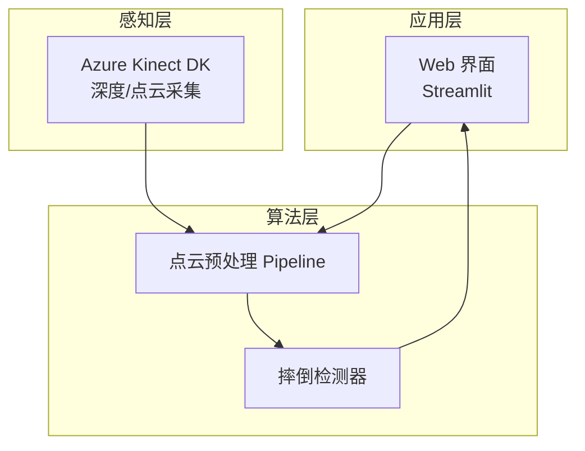
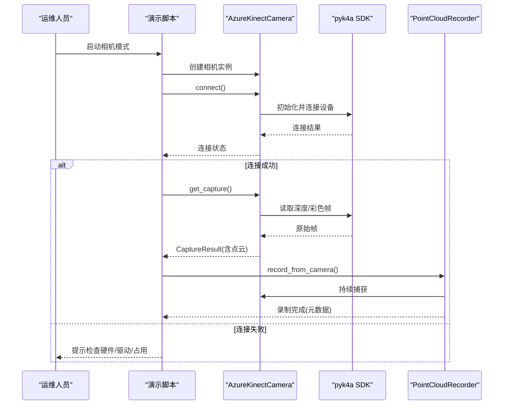
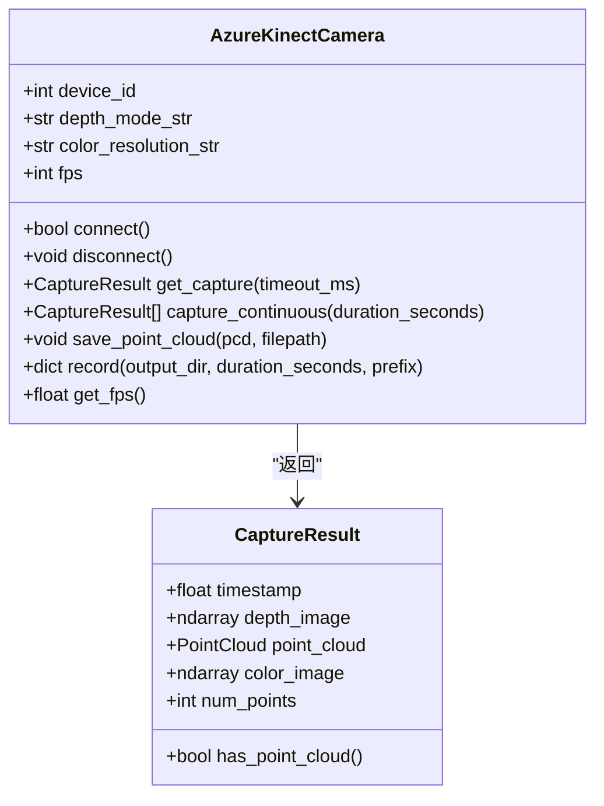
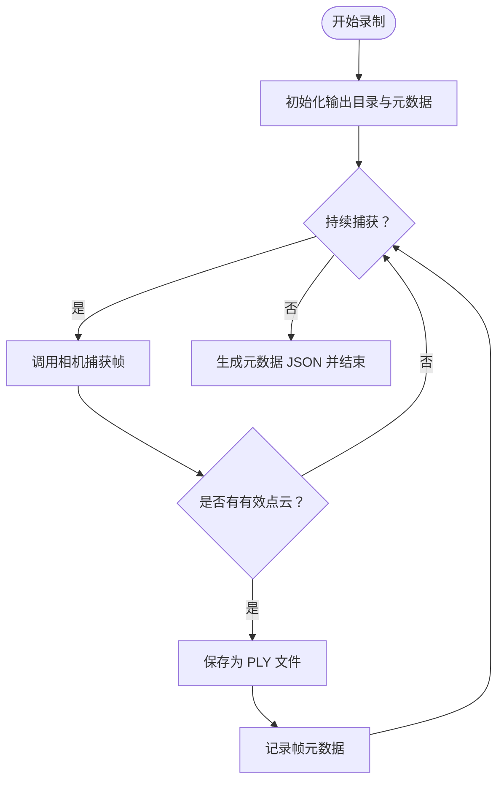
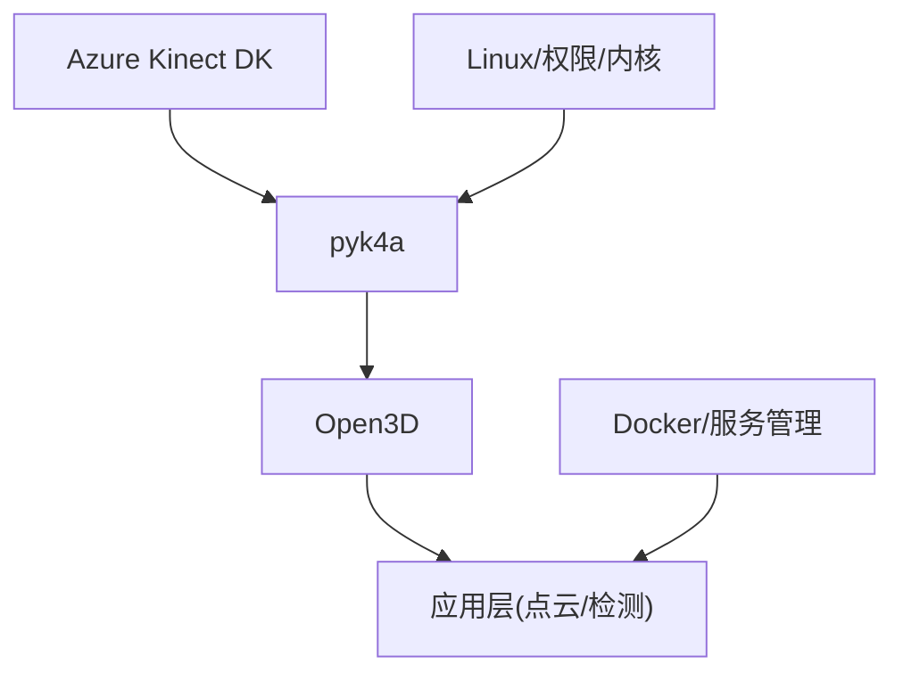

# 硬件问题

<cite>
**本文引用的文件**
- [src/data_capture/azure_kinect.py](file://src/data_capture/azure_kinect.py)
- [src/data_capture/recorder.py](file://src/data_capture/recorder.py)
- [demos/fall_detection_demo.py](file://demos/fall_detection_demo.py)
- [docs/DEPLOYMENT_GUIDE.md](file://docs/DEPLOYMENT_GUIDE.md)
- [docs/DEPLOYMENT.md](file://docs/DEPLOYMENT.md)
- [README.md](file://README.md)
- [requirements.txt](file://requirements.txt)
</cite>

## 目录
1. [简介](#简介)
2. [项目结构](#项目结构)
3. [核心组件](#核心组件)
4. [架构总览](#架构总览)
5. [详细组件分析](#详细组件分析)
6. [依赖分析](#依赖分析)
7. [性能考虑](#性能考虑)
8. [故障排查指南](#故障排查指南)
9. [结论](#结论)
10. [附录](#附录)

## 简介
本章节面向硬件运维与现场工程师，聚焦GuardianFall系统中Azure Kinect DK深度相机的硬件故障排查与预防性维护。内容涵盖设备识别检查、驱动安装验证、权限配置、固件更新、数据采集异常与帧率不稳定、视角偏差等性能问题的定位与解决，并提供替代硬件的配置方案与备用策略。

## 项目结构
GuardianFall系统围绕“感知层-算法层-应用层”分层设计，其中感知层通过Azure Kinect DK采集深度/点云数据，算法层进行点云预处理与摔倒检测，应用层提供Web界面与可视化。与硬件相关的关键模块集中在数据采集与录制模块中，便于定位与修复硬件问题。

**图表来源**
- [README.md: 61-86:61-86](file://README.md#L61-L86)

**章节来源**
- [README.md: 61-86:61-86](file://README.md#L61-L86)

## 核心组件
- AzureKinectCamera：封装pyk4a SDK，负责相机初始化、连接、捕获、点云生成、录制与元数据管理。
- PointCloudRecorder：负责将点云序列录制为文件，生成元数据与数据集。
- demos/fall_detection_demo.py：提供相机模式与录制模式的演示入口，便于快速验证硬件连通性与数据流。

**章节来源**
- [src/data_capture/azure_kinect.py: 47-472:47-472](file://src/data_capture/azure_kinect.py#L47-L472)
- [src/data_capture/recorder.py: 48-436:48-436](file://src/data_capture/recorder.py#L48-L436)
- [demos/fall_detection_demo.py: 181-271:181-271](file://demos/fall_detection_demo.py#L181-L271)

## 架构总览
下图展示从硬件到软件的数据流与关键检查点，便于在出现硬件问题时快速定位。

**图表来源**
- [demos/fall_detection_demo.py: 181-271:181-271](file://demos/fall_detection_demo.py#L181-L271)
- [src/data_capture/azure_kinect.py: 152-184:152-184](file://src/data_capture/azure_kinect.py#L152-L184)
- [src/data_capture/recorder.py: 177-220:177-220](file://src/data_capture/recorder.py#L177-L220)

## 详细组件分析

### AzureKinectCamera 组件
- 职责：封装pyk4a，提供相机连接、帧捕获、点云生成、录制与元数据管理。
- 关键点：
  - 连接失败时会输出常见问题提示（设备连接、USB 3.0线缆、驱动安装、其他程序占用）。
  - 支持多种深度模式与彩色分辨率，不同配置对性能与视角有直接影响。
  - 提供帧率统计接口，便于判断硬件性能问题。

**图表来源**
- [src/data_capture/azure_kinect.py: 32-472:32-472](file://src/data_capture/azure_kinect.py#L32-L472)

**章节来源**
- [src/data_capture/azure_kinect.py: 47-472:47-472](file://src/data_capture/azure_kinect.py#L47-L472)

### 录制器组件
- 职责：将连续帧录制为PLY文件与元数据JSON，便于离线验证与回放。
- 关键点：
  - 录制过程与相机帧率耦合，帧率异常会导致录制时长与帧数不匹配。
  - 元数据包含帧数、时长、FPS、深度模式等，便于回溯硬件配置。

**图表来源**
- [src/data_capture/recorder.py: 177-220:177-220](file://src/data_capture/recorder.py#L177-L220)
- [src/data_capture/recorder.py: 413-436:413-436](file://src/data_capture/recorder.py#L413-L436)

**章节来源**
- [src/data_capture/recorder.py: 48-436:48-436](file://src/data_capture/recorder.py#L48-L436)

### 演示脚本与硬件验证
- 相机模式：连接真实相机，输出连接状态与报警回调；若连接失败，提示检查硬件/驱动/占用。
- 录制模式：直接从相机录制数据集，便于离线验证硬件稳定性与数据质量。

**章节来源**
- [demos/fall_detection_demo.py: 181-271:181-271](file://demos/fall_detection_demo.py#L181-L271)
- [demos/fall_detection_demo.py: 273-325:273-325](file://demos/fall_detection_demo.py#L273-L325)

## 依赖分析
- 硬件依赖：Azure Kinect DK（深度/点云）、USB 3.0线缆、可用USB端口。
- 软件依赖：pyk4a（相机SDK）、Open3D（点云处理）、NumPy等。
- 系统依赖：Linux内核USB子系统、udev权限、Docker/系统服务管理。

**图表来源**
- [requirements.txt: 1-34:1-34](file://requirements.txt#L1-L34)
- [README.md: 88-96:88-96](file://README.md#L88-L96)

**章节来源**
- [requirements.txt: 1-34:1-34](file://requirements.txt#L1-L34)
- [README.md: 88-96:88-96](file://README.md#L88-L96)

## 性能考虑
- 帧率与视角：不同深度模式与彩色分辨率会影响帧率与视角覆盖，需结合部署场景权衡。
- 点云处理：体素降采样、统计滤波、地面分割与聚类等步骤对CPU/GPU负载有直接影响，需在硬件能力范围内调整参数。
- 稳定性：长时间运行需关注温度、供电与线缆质量，避免因供电不足导致帧率抖动或掉线。

[本节为通用指导，不直接分析具体文件]

## 故障排查指南

### 一、设备识别检查
- 检查USB接口与线缆
  - 使用USB 3.0线缆连接，确保接口供电充足。
  - 尝试更换USB端口或连接至主板直连端口。
- 检查系统识别
  - Linux：使用lsusb查看设备是否被识别。
  - Windows：设备管理器中查看Azure Kinect设备。
- 检查权限
  - Linux：确保当前用户属于plugdev/视频组，必要时配置udev规则。
  - Docker：若容器化部署，确保宿主机设备挂载与权限传递正确。

**章节来源**
- [src/data_capture/azure_kinect.py: 179-183:179-183](file://src/data_capture/azure_kinect.py#L179-L183)
- [docs/DEPLOYMENT.md: 257-285:257-285](file://docs/DEPLOYMENT.md#L257-L285)

### 二、驱动安装验证
- 安装pyk4a
  - 通过pip安装pyk4a，确保与系统架构匹配。
  - 若安装失败，参考官方文档与系统依赖。
- 验证SDK
  - 运行演示脚本的相机模式，观察连接日志与点云输出。
  - 若提示pyk4a未安装，按提示先行安装。

**章节来源**
- [src/data_capture/azure_kinect.py: 22-29:22-29](file://src/data_capture/azure_kinect.py#L22-L29)
- [demos/fall_detection_demo.py: 187-195:187-195](file://demos/fall_detection_demo.py#L187-L195)

### 三、权限配置
- Linux权限
  - 将用户加入plugdev组，或为设备配置udev规则。
  - 验证/dev/video*与/proc/bus/usb设备可访问。
- Docker容器
  - 使用--device或--privileged模式挂载设备。
  - 确保容器内用户具备访问权限。

**章节来源**
- [docs/DEPLOYMENT.md: 257-285:257-285](file://docs/DEPLOYMENT.md#L257-L285)

### 四、固件更新
- 更新相机固件
  - 使用官方工具更新固件，避免与SDK版本不兼容。
  - 更新后重启系统并重新连接设备。
- 驱动更新
  - 更新内核与USB控制器驱动，确保兼容性。

**章节来源**
- [src/data_capture/azure_kinect.py: 179-183:179-183](file://src/data_capture/azure_kinect.py#L179-L183)

### 五、数据采集异常
- 现象：无点云、空帧、帧丢失。
- 排查步骤：
  - 检查连接状态与帧率统计。
  - 确认深度模式与彩色分辨率设置合理。
  - 使用录制模式保存多帧，检查元数据与文件完整性。

**章节来源**
- [src/data_capture/azure_kinect.py: 441-450:441-450](file://src/data_capture/azure_kinect.py#L441-L450)
- [src/data_capture/recorder.py: 177-220:177-220](file://src/data_capture/recorder.py#L177-L220)

### 六、帧率不稳定
- 现象：FPS波动、处理时间抖动。
- 排查步骤：
  - 降低体素尺寸、滤波参数或聚类容忍度，减轻处理负载。
  - 降低帧率设置，避免硬件过载。
  - 检查USB带宽占用，避免同时连接多个高带宽设备。

**章节来源**
- [src/preprocessing/pipeline.py: 199-248:199-248](file://src/preprocessing/pipeline.py#L199-L248)
- [src/data_capture/azure_kinect.py: 135-150:135-150](file://src/data_capture/azure_kinect.py#L135-L150)

### 七、视角偏差
- 现象：检测区域不覆盖或边缘缺失。
- 排查步骤：
  - 调整相机安装高度与角度，确保覆盖目标区域。
  - 选择合适的深度模式（窄/宽视场）与分辨率。
  - 使用录制模式回放验证视角覆盖。

**章节来源**
- [src/data_capture/azure_kinect.py: 58-78:58-78](file://src/data_capture/azure_kinect.py#L58-L78)

### 八、替代硬件与配置方案
- Ouster OSDome：固态激光雷达，360°覆盖、抗光干扰，但成本较高。
- Velodyne VLP-16：机械式激光雷达，精度高、远距离，但体积与功耗较大。
- 方案选择建议：
  - 原型阶段优先Azure Kinect DK，成本低、开发友好。
  - 成长期根据覆盖需求与预算选择Ouster/Velodyne。

**章节来源**
- [README.md: 92-96:92-96](file://README.md#L92-L96)

### 九、预防性维护与备用方案
- 预防性维护
  - 定期清洁镜头与外壳，避免灰尘遮挡。
  - 检查USB线缆与接口，避免松动与氧化。
  - 监控系统温度与风扇状态，避免过热降频。
- 备用方案
  - 多机位部署，互为冗余。
  - 使用录制模式离线回放，作为实时检测的补充验证。

**章节来源**
- [docs/DEPLOYMENT_GUIDE.md: 527-533:527-533](file://docs/DEPLOYMENT_GUIDE.md#L527-L533)

## 结论
针对Azure Kinect DK的硬件故障排查，应从“连接—驱动—权限—配置—性能—替代方案”六个维度系统推进。通过演示脚本与录制工具快速验证，结合日志与元数据定位问题，再依据场景选择合适的替代硬件与冗余策略，可显著提升系统的稳定性与可维护性。

[本节为总结性内容，不直接分析具体文件]

## 附录

### A. 快速检查清单
- [ ] 设备已连接且被系统识别
- [ ] pyk4a已安装且版本兼容
- [ ] 用户具备访问权限
- [ ] USB 3.0线缆与端口正常
- [ ] 深度模式/分辨率/帧率设置合理
- [ ] 录制模式可生成完整元数据
- [ ] 替代硬件方案已评估并准备

**章节来源**
- [src/data_capture/azure_kinect.py: 179-183:179-183](file://src/data_capture/azure_kinect.py#L179-L183)
- [demos/fall_detection_demo.py: 187-195:187-195](file://demos/fall_detection_demo.py#L187-L195)
- [src/data_capture/recorder.py: 177-220:177-220](file://src/data_capture/recorder.py#L177-L220)