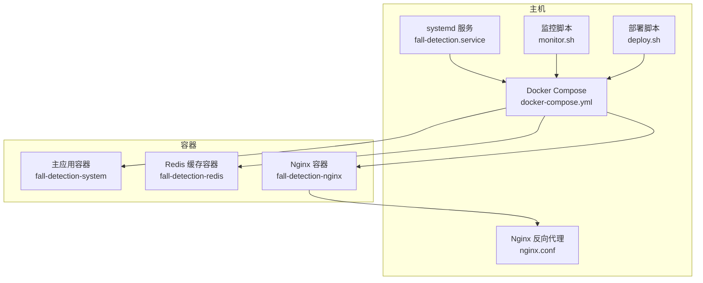
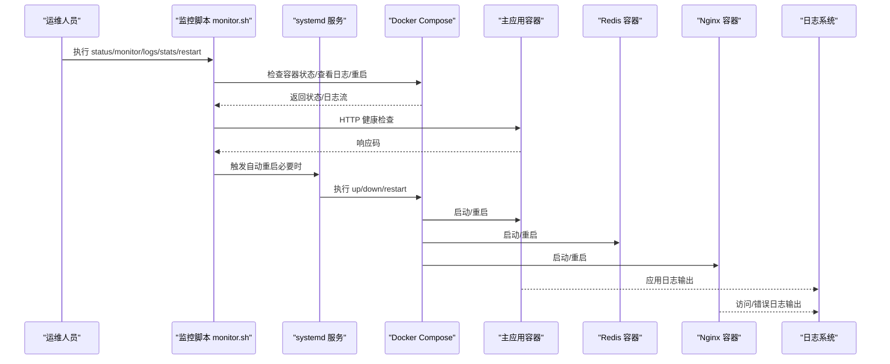
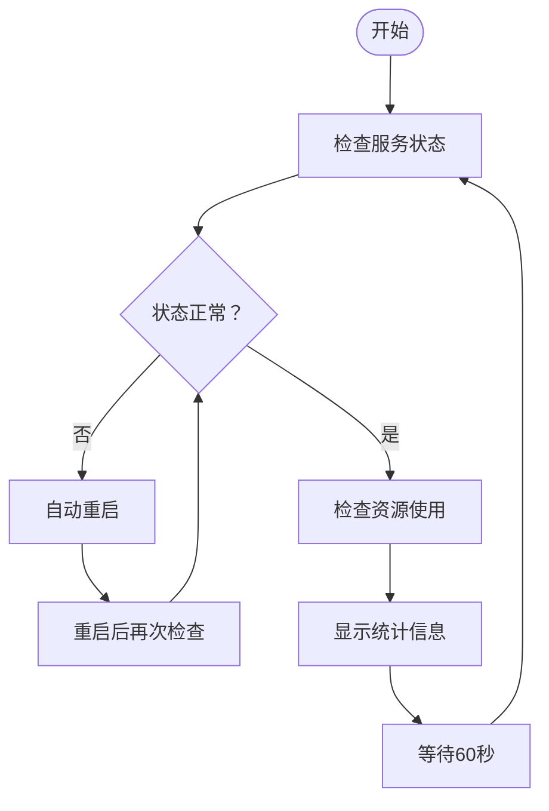
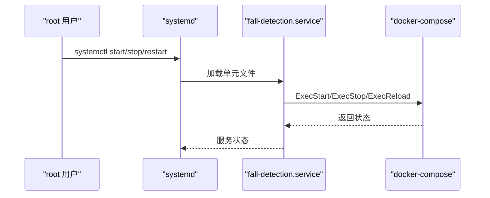
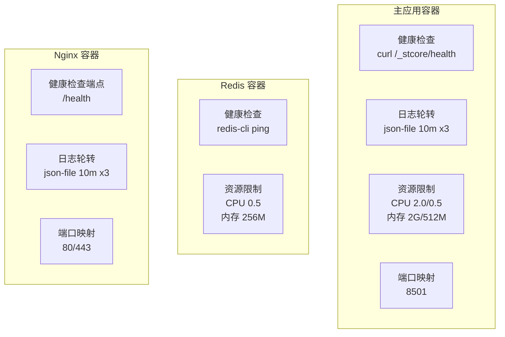
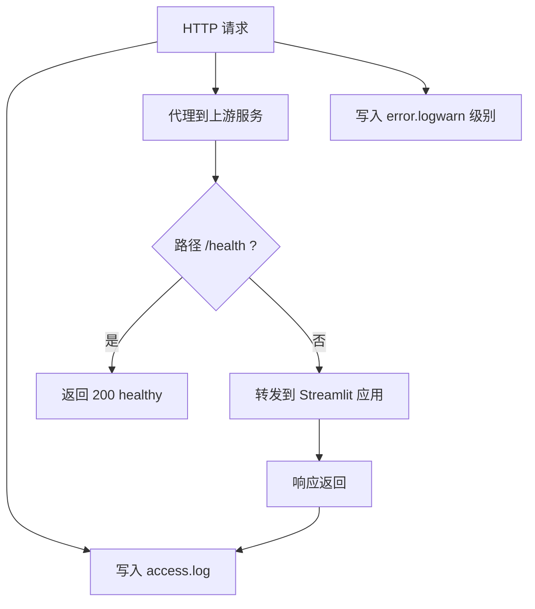
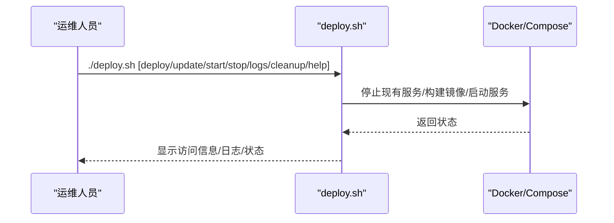
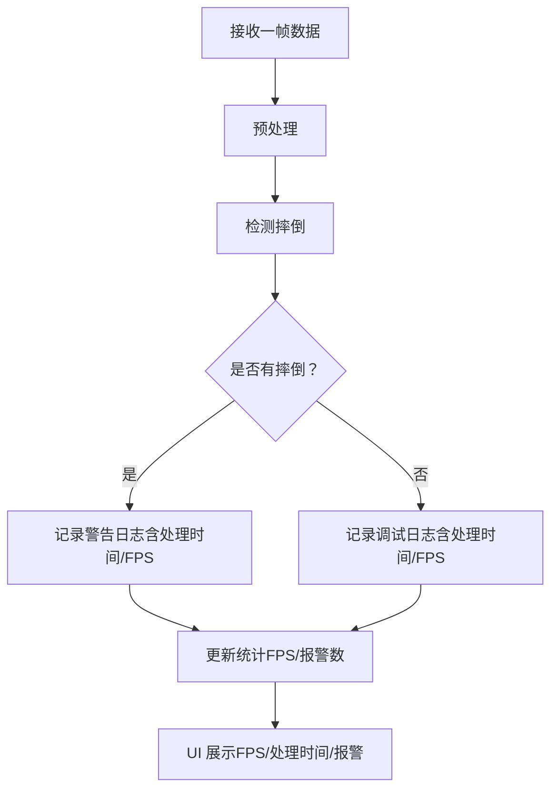
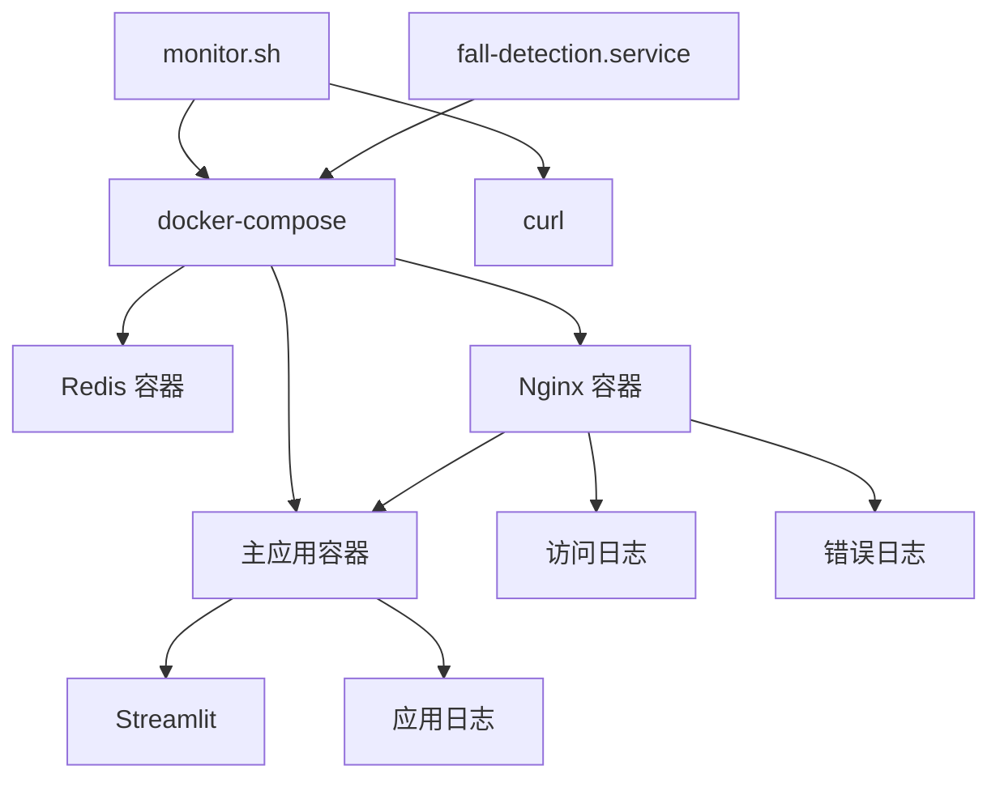

# 系统监控

<cite>
**本文引用的文件**
- [monitor.sh](file://monitor.sh)
- [fall-detection.service](file://fall-detection.service)
- [docker-compose.yml](file://docker-compose.yml)
- [nginx.conf](file://nginx.conf)
- [deploy.sh](file://deploy.sh)
- [Dockerfile](file://Dockerfile)
- [app.py](file://app.py)
- [requirements.txt](file://requirements.txt)
</cite>

## 目录
1. [简介](#简介)
2. [项目结构](#项目结构)
3. [核心组件](#核心组件)
4. [架构总览](#架构总览)
5. [详细组件分析](#详细组件分析)
6. [依赖分析](#依赖分析)
7. [性能考量](#性能考量)
8. [故障排查指南](#故障排查指南)
9. [结论](#结论)
10. [附录](#附录)

## 简介
本文件面向GuardianFall（摔倒检测系统）的运维与监控场景，系统采用Docker容器化部署，包含Web前端（Streamlit）、点云处理与检测算法、Redis缓存以及可选的Nginx反向代理。本文档聚焦以下主题：
- 监控脚本的使用方法与监控指标含义（服务状态、资源使用、性能指标）
- systemd服务管理与Docker容器监控
- Nginx日志分析与健康检查
- 关键日志文件位置与格式说明（应用日志、系统日志、容器日志）
- 告警机制配置、日志轮转、性能基线建立等运维最佳实践

## 项目结构
系统由以下关键文件构成，支撑监控与运维能力：
- 监控脚本：monitor.sh 提供服务状态检查、资源使用统计、持续监控、日志查看、统计信息展示与自动重启能力
- systemd服务：fall-detection.service 将Docker Compose作为系统服务进行管理
- 容器编排：docker-compose.yml 定义主应用、Redis缓存与Nginx服务，含健康检查与日志轮转
- Web入口：nginx.conf 提供反向代理、TLS、安全头与健康检查端点
- 部署脚本：deploy.sh 提供一键部署、更新、日志查看、状态检查与清理能力
- 容器镜像：Dockerfile 定义运行时环境、健康检查与启动命令
- 应用入口：app.py 提供Web界面与性能统计展示（FPS、处理时间等）

**图表来源**
- [fall-detection.service:1-28](file://fall-detection.service#L1-L28)
- [docker-compose.yml:1-149](file://docker-compose.yml#L1-L149)
- [nginx.conf:1-127](file://nginx.conf#L1-L127)
- [monitor.sh:1-183](file://monitor.sh#L1-L183)
- [deploy.sh:1-243](file://deploy.sh#L1-L243)

**章节来源**
- [monitor.sh:1-183](file://monitor.sh#L1-L183)
- [fall-detection.service:1-28](file://fall-detection.service#L1-L28)
- [docker-compose.yml:1-149](file://docker-compose.yml#L1-L149)
- [nginx.conf:1-127](file://nginx.conf#L1-L127)
- [deploy.sh:1-243](file://deploy.sh#L1-L243)
- [Dockerfile:1-50](file://Dockerfile#L1-L50)
- [app.py:1-662](file://app.py#L1-L662)

## 核心组件
- 监控脚本 monitor.sh
  - 功能：服务状态检查（Docker容器与HTTP健康检查）、资源使用统计（CPU/内存/磁盘）、持续监控循环、日志查看、统计信息展示、自动重启
  - 关键命令：status、logs、stats、monitor、restart、help
- systemd服务 fall-detection.service
  - 功能：将Docker Compose作为systemd服务管理，支持启动、停止、重启与超时控制
- 容器编排 docker-compose.yml
  - 功能：定义主应用、Redis、Nginx服务；配置端口映射、环境变量、资源限制、健康检查、日志轮转、网络与数据卷
- 反向代理 nginx.conf
  - 功能：HTTP/HTTPS、WebSocket支持、安全头、Gzip压缩、健康检查端点、访问/错误日志格式
- 部署脚本 deploy.sh
  - 功能：Docker与Compose安装检查、停止现有服务、构建镜像、启动服务、状态检查、访问信息提示、日志查看、清理资源
- 容器镜像 Dockerfile
  - 功能：基础镜像、环境变量、系统依赖、健康检查、启动命令
- 应用入口 app.py
  - 功能：Streamlit界面、参数配置、实时监控、统计图表、报警历史、数据管理

**章节来源**
- [monitor.sh:149-182](file://monitor.sh#L149-L182)
- [fall-detection.service:8-24](file://fall-detection.service#L8-L24)
- [docker-compose.yml:6-149](file://docker-compose.yml#L6-L149)
- [nginx.conf:1-127](file://nginx.conf#L1-L127)
- [deploy.sh:132-145](file://deploy.sh#L132-L145)
- [Dockerfile:44-49](file://Dockerfile#L44-L49)
- [app.py:304-450](file://app.py#L304-L450)

## 架构总览
下图展示了监控与运维视角下的系统交互关系，涵盖服务管理、容器编排、Web入口与日志输出。

**图表来源**
- [monitor.sh:26-47](file://monitor.sh#L26-L47)
- [monitor.sh:128-146](file://monitor.sh#L128-L146)
- [fall-detection.service:13-20](file://fall-detection.service#L13-L20)
- [docker-compose.yml:51-57](file://docker-compose.yml#L51-L57)
- [nginx.conf:107-112](file://nginx.conf#L107-L112)

## 详细组件分析

### 监控脚本 monitor.sh
- 服务状态检查
  - Docker容器状态：通过docker-compose ps判断容器是否处于Up状态
  - HTTP健康检查：对本地8501端口发起请求，期望返回200
- 资源使用统计
  - CPU使用率：基于top输出解析，阈值80%
  - 内存使用率：基于free输出解析，阈值80%
  - 磁盘使用率：基于df输出解析，阈值80%
- 持续监控循环
  - 每60秒执行一次检查，若服务异常则尝试自动重启
- 日志查看与统计信息
  - 实时日志：docker-compose logs -f
  - 统计信息：容器启动时间、重启次数、网络统计、进程信息
- 自动重启
  - docker-compose restart后再次检查服务状态

**图表来源**
- [monitor.sh:26-47](file://monitor.sh#L26-L47)
- [monitor.sh:50-76](file://monitor.sh#L50-L76)
- [monitor.sh:83-110](file://monitor.sh#L83-L110)
- [monitor.sh:128-146](file://monitor.sh#L128-L146)

**章节来源**
- [monitor.sh:26-47](file://monitor.sh#L26-L47)
- [monitor.sh:50-76](file://monitor.sh#L50-L76)
- [monitor.sh:78-81](file://monitor.sh#L78-L81)
- [monitor.sh:83-110](file://monitor.sh#L83-L110)
- [monitor.sh:112-125](file://monitor.sh#L112-L125)
- [monitor.sh:128-146](file://monitor.sh#L128-L146)

### systemd服务管理（fall-detection.service）
- 作用：将Docker Compose作为systemd服务进行生命周期管理
- 关键点：
  - ExecStart/ExecStop/ExecReload分别对应docker-compose up -d、down、restart
  - After=Wants=Requires确保在网络与Docker可用后再启动
  - TimeoutStartSec/TimeoutStopSec设置超时
- 使用建议：
  - 使用systemctl start/stop/restart/status管理服务
  - 结合monitor.sh进行健康检查与自动重启

**图表来源**
- [fall-detection.service:1-28](file://fall-detection.service#L1-L28)

**章节来源**
- [fall-detection.service:1-28](file://fall-detection.service#L1-L28)

### Docker容器监控与日志轮转（docker-compose.yml）
- 主应用容器（fall-detection-system）
  - 健康检查：curl探测/_stcore/health
  - 日志驱动：json-file，单文件最大10MB，最多保留3个
  - 资源限制：CPU上限2.0核、内存2GB；预留0.5核CPU、512MB内存
  - 端口映射：8501
- Redis容器（fall-detection-redis）
  - 健康检查：redis-cli ping
  - 资源限制：CPU上限0.5核、内存256MB
- Nginx容器（fall-detection-nginx）
  - 健康检查端点：/health
  - 日志驱动：json-file，单文件最大10MB，最多保留3个
  - 端口映射：80/443
- 日志轮转策略
  - 单文件最大10MB，最多3个文件，超出按轮转顺序覆盖旧文件

**图表来源**
- [docker-compose.yml:51-57](file://docker-compose.yml#L51-L57)
- [docker-compose.yml:60-64](file://docker-compose.yml#L60-L64)
- [docker-compose.yml:42-49](file://docker-compose.yml#L42-L49)
- [docker-compose.yml:88-93](file://docker-compose.yml#L88-L93)
- [docker-compose.yml:95-100](file://docker-compose.yml#L95-L100)
- [docker-compose.yml:107-112](file://docker-compose.yml#L107-L112)
- [docker-compose.yml:126-131](file://docker-compose.yml#L126-L131)

**章节来源**
- [docker-compose.yml:51-57](file://docker-compose.yml#L51-L57)
- [docker-compose.yml:60-64](file://docker-compose.yml#L60-L64)
- [docker-compose.yml:42-49](file://docker-compose.yml#L42-L49)
- [docker-compose.yml:88-93](file://docker-compose.yml#L88-L93)
- [docker-compose.yml:95-100](file://docker-compose.yml#L95-L100)
- [docker-compose.yml:107-112](file://docker-compose.yml#L107-L112)
- [docker-compose.yml:126-131](file://docker-compose.yml#L126-L131)

### Nginx日志分析（nginx.conf）
- 日志格式：access_log使用自定义main格式，包含客户端IP、时间、请求、状态码、用户代理、转发头等
- 访问日志与错误日志：分别输出到/var/log/nginx/access.log与/var/log/nginx/error.log，并设置不同级别
- 健康检查端点：/health返回200并输出“healthy”，关闭访问日志
- 安全头：Strict-Transport-Security、X-Frame-Options、X-Content-Type-Options、X-XSS-Protection、Referrer-Policy
- WebSocket支持：代理头部Upgrade/Connection用于支持Streamlit的WebSocket通信
- 压缩与缓存：Gzip开启，静态资源缓存1年

**图表来源**
- [nginx.conf:16-22](file://nginx.conf#L16-L22)
- [nginx.conf:107-112](file://nginx.conf#L107-L112)
- [nginx.conf:77-105](file://nginx.conf#L77-L105)

**章节来源**
- [nginx.conf:16-22](file://nginx.conf#L16-L22)
- [nginx.conf:107-112](file://nginx.conf#L107-L112)
- [nginx.conf:77-105](file://nginx.conf#L77-L105)

### 部署脚本 deploy.sh
- 完整部署流程：检查root权限与Docker/Compose、停止现有服务、构建镜像、启动服务、等待就绪、显示访问信息
- 更新部署：停止服务、拉取镜像、构建镜像、启动服务、检查状态
- 仅启动/停止：快速启动或停止服务
- 日志查看：docker-compose logs -f
- 清理资源：删除容器、镜像与数据卷（带确认）
- 访问信息：本地与远程访问地址提示

**图表来源**
- [deploy.sh:132-145](file://deploy.sh#L132-L145)
- [deploy.sh:148-156](file://deploy.sh#L148-L156)
- [deploy.sh:158-164](file://deploy.sh#L158-L164)
- [deploy.sh:173-176](file://deploy.sh#L173-L176)
- [deploy.sh:178-188](file://deploy.sh#L178-L188)

**章节来源**
- [deploy.sh:132-145](file://deploy.sh#L132-L145)
- [deploy.sh:148-156](file://deploy.sh#L148-L156)
- [deploy.sh:158-164](file://deploy.sh#L158-L164)
- [deploy.sh:173-176](file://deploy.sh#L173-L176)
- [deploy.sh:178-188](file://deploy.sh#L178-L188)

### 应用日志与性能指标（app.py）
- 日志输出：系统在检测到摔倒或正常帧时输出日志，包含帧号、人数、处理时间与平均FPS
- 性能指标：
  - FPS：每帧处理耗时的倒数，UI中展示趋势与柱状图
  - 处理时间：单帧处理时间（毫秒），用于评估系统性能
  - 报警统计：确认摔倒与疑似摔倒数量
- 参数配置：体素尺寸、高度骤降阈值、速度阈值、确认帧数、帧率等，支持保存与导入

**图表来源**
- [app.py:452-533](file://app.py#L452-L533)
- [app.py:535-588](file://app.py#L535-L588)
- [app.py:590-652](file://app.py#L590-L652)

**章节来源**
- [app.py:452-533](file://app.py#L452-L533)
- [app.py:535-588](file://app.py#L535-L588)
- [app.py:590-652](file://app.py#L590-L652)

## 依赖分析
- 组件耦合
  - monitor.sh依赖docker-compose与curl进行服务与HTTP健康检查
  - fall-detection.service依赖systemd与docker-compose
  - docker-compose.yml定义了主应用、Redis与Nginx之间的依赖关系
  - nginx.conf依赖主应用容器的健康检查端点
- 外部依赖
  - Docker与Docker Compose
  - curl用于HTTP健康检查
  - Streamlit用于Web界面与性能展示
  - Redis用于会话与缓存
  - Nginx用于反向代理与TLS终止

**图表来源**
- [monitor.sh:39-44](file://monitor.sh#L39-L44)
- [fall-detection.service:13-20](file://fall-detection.service#L13-L20)
- [docker-compose.yml:71-72](file://docker-compose.yml#L71-L72)
- [nginx.conf:77-105](file://nginx.conf#L77-L105)

**章节来源**
- [monitor.sh:39-44](file://monitor.sh#L39-L44)
- [fall-detection.service:13-20](file://fall-detection.service#L13-L20)
- [docker-compose.yml:71-72](file://docker-compose.yml#L71-L72)
- [nginx.conf:77-105](file://nginx.conf#L77-L105)

## 性能考量
- 理想性能基线（参考使用指南）
  - FPS > 20
  - 处理时间 < 100ms
  - 准确率 > 95%
  - 误报率 < 5%
- 影响因素
  - 硬件性能（CPU/GPU）
  - 点云密度（点数越多越慢）
  - 参数设置（体素大小影响最大）
  - 相机帧率（30 FPS vs 60 FPS）
- 优化建议
  - 降低体素尺寸以减少点云复杂度
  - 降低帧率设置
  - 减少点云分辨率
  - 关闭占用CPU的其他程序
  - 在UI中调整阈值与确认帧数以平衡误报与漏报

**章节来源**
- [app.py:311-324](file://app.py#L311-L324)

## 故障排查指南
- 服务状态异常
  - 使用monitor.sh status检查Docker容器与HTTP健康检查
  - 若异常，执行monitor.sh restart尝试自动重启
  - 使用monitor.sh logs实时查看日志
- 容器日志轮转
  - docker-compose.yml中json-file单文件10MB，最多3个文件
  - 如出现日志过大，可通过轮转策略自动清理旧日志
- Nginx日志分析
  - 访问日志位于/var/log/nginx/access.log，错误日志位于/var/log/nginx/error.log
  - 健康检查端点/health返回200表示Nginx正常
- systemd服务管理
  - 使用systemctl start/stop/restart/status管理fall-detection.service
  - 若服务无法启动，检查Docker/Compose安装与权限
- 部署与更新
  - 使用deploy.sh deploy进行完整部署
  - 使用deploy.sh update进行更新部署
  - 使用deploy.sh logs查看日志
- 应用日志
  - 主应用容器输出应用日志，包含每帧处理时间与平均FPS
  - UI中展示报警历史与统计图表，便于定位异常

**章节来源**
- [monitor.sh:149-182](file://monitor.sh#L149-L182)
- [monitor.sh:78-81](file://monitor.sh#L78-L81)
- [docker-compose.yml:60-64](file://docker-compose.yml#L60-L64)
- [nginx.conf:21-22](file://nginx.conf#L21-L22)
- [nginx.conf:107-112](file://nginx.conf#L107-L112)
- [fall-detection.service:1-28](file://fall-detection.service#L1-L28)
- [deploy.sh:132-145](file://deploy.sh#L132-L145)
- [deploy.sh:148-156](file://deploy.sh#L148-L156)
- [app.py:217-224](file://app.py#L217-L224)

## 结论
本监控与运维文档围绕GuardianFall系统的Docker容器化部署，提供了从服务管理、容器监控、日志轮转到Web入口与性能指标的完整方案。通过monitor.sh与deploy.sh实现自动化运维，结合systemd与docker-compose实现高可用的服务生命周期管理，配合Nginx的健康检查与日志分析，能够有效保障系统的稳定性与可观测性。建议在生产环境中结合日志轮转策略与性能基线，持续优化参数配置以达到理想的检测精度与处理性能。

## 附录
- 关键命令速查
  - monitor.sh status/logs/stats/monitor/restart/help
  - systemctl start/stop/restart/status
  - docker-compose ps/logs -f/up -d/down/restart
  - ./deploy.sh deploy/update/start/stop/logs/status/cleanup/help
- 日志位置
  - 容器应用日志：docker-compose.yml中json-file配置
  - Nginx访问日志：/var/log/nginx/access.log
  - Nginx错误日志：/var/log/nginx/error.log
- 健康检查端点
  - 主应用：/_stcore/health
  - Nginx：/health