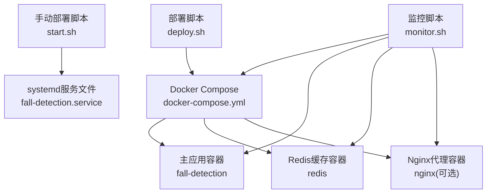
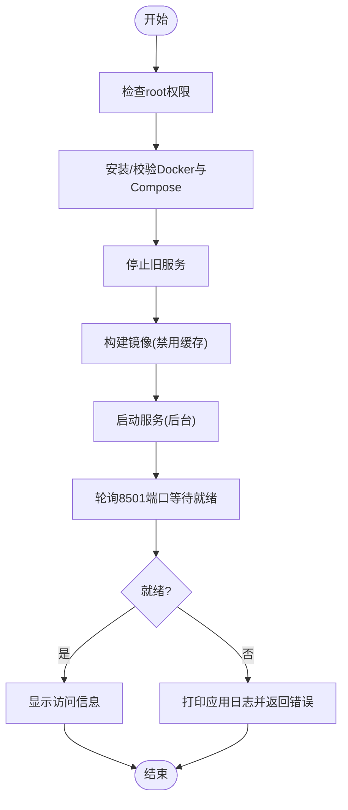
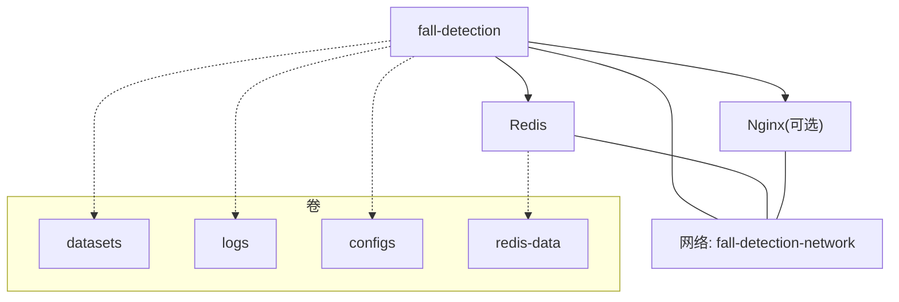
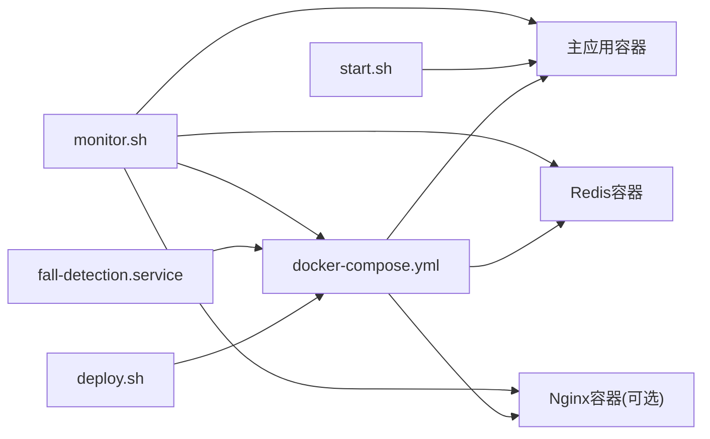

# 部署问题

<cite>
**本文引用的文件**
- [deploy.sh](file://deploy.sh)
- [docker-compose.yml](file://docker-compose.yml)
- [Dockerfile](file://Dockerfile)
- [start.sh](file://start.sh)
- [fall-detection.service](file://fall-detection.service)
- [nginx.conf](file://nginx.conf)
- [requirements.txt](file://requirements.txt)
- [app.py](file://app.py)
- [docs/DEPLOYMENT_GUIDE.md](file://docs/DEPLOYMENT_GUIDE.md)
- [monitor.sh](file://monitor.sh)
</cite>

## 目录
1. [简介](#简介)
2. [项目结构](#项目结构)
3. [核心组件](#核心组件)
4. [架构总览](#架构总览)
5. [详细组件分析](#详细组件分析)
6. [依赖关系分析](#依赖关系分析)
7. [性能考虑](#性能考虑)
8. [故障排查指南](#故障排查指南)
9. [结论](#结论)
10. [附录](#附录)

## 简介
本文件面向GuardianFall（摔倒检测系统）的部署运维人员，提供系统化的部署问题排查文档。内容覆盖Docker部署失败、容器启动异常、端口冲突、权限问题、镜像构建错误、容器资源限制、网络配置故障等常见场景，并解释部署脚本的执行流程与常见错误码含义。同时提供手动部署与Docker部署两种方式的故障排除方法，以及命令行诊断工具使用与日志分析技巧。

## 项目结构
该仓库采用“Docker + Compose + 可选Nginx反向代理”的多服务架构，主要文件与职责如下：
- 部署脚本：一键部署、更新、启动、停止、日志查看、状态查询、资源清理
- Compose编排：主应用、Redis缓存、可选Nginx代理
- 容器镜像：基于Python 3.10 Slim，安装系统依赖与Python依赖
- 手动部署：通过systemd服务或直接运行Streamlit
- 监控脚本：健康检查、资源监控、日志查看、自动重启



图表来源
- [deploy.sh:131-145](file://deploy.sh#L131-L145)
- [docker-compose.yml:6-149](file://docker-compose.yml#L6-L149)
- [start.sh:1-109](file://start.sh#L1-L109)
- [fall-detection.service:1-28](file://fall-detection.service#L1-L28)
- [monitor.sh:26-47](file://monitor.sh#L26-L47)

章节来源
- [deploy.sh:131-145](file://deploy.sh#L131-L145)
- [docker-compose.yml:6-149](file://docker-compose.yml#L6-L149)
- [start.sh:1-109](file://start.sh#L1-L109)
- [fall-detection.service:1-28](file://fall-detection.service#L1-L28)
- [monitor.sh:26-47](file://monitor.sh#L26-L47)

## 核心组件
- 一键部署脚本：负责检查root权限、安装/校验Docker与Compose、停止旧服务、构建镜像、启动服务、健康检查与访问信息展示
- Compose编排：定义主应用、Redis、Nginx三类服务，含端口映射、环境变量、数据卷、资源限制、健康检查、日志驱动
- Dockerfile：基础镜像、系统依赖、Python依赖、工作目录、暴露端口、健康检查、启动命令
- 手动部署：start.sh提供交互式模式；systemd服务文件定义开机自启与重启策略
- 监控脚本：健康检查、资源使用率检查、日志查看、统计信息、自动重启

章节来源
- [deploy.sh:31-102](file://deploy.sh#L31-L102)
- [docker-compose.yml:6-149](file://docker-compose.yml#L6-L149)
- [Dockerfile:1-50](file://Dockerfile#L1-L50)
- [start.sh:1-109](file://start.sh#L1-L109)
- [fall-detection.service:8-24](file://fall-detection.service#L8-L24)
- [monitor.sh:26-125](file://monitor.sh#L26-L125)

## 架构总览
系统采用多容器协作架构：主应用容器承载Web界面与推理逻辑；Redis用于会话/缓存；Nginx作为反向代理（生产环境可选）。Compose统一编排，定义网络、卷、资源限制与健康检查。

```mermaid
graph TB
subgraph "宿主机"
U["用户浏览器"]
S["systemd服务<br/>fall-detection.service"]
M["监控脚本<br/>monitor.sh"]
end
subgraph "Docker Compose编排"
subgraph "网络<br/>fall-detection-network"
A["主应用<br/>fall-detection"]
R["Redis缓存<br/>redis"]
N["Nginx代理<br/>nginx(可选)"]
end
end
U --> |HTTP/HTTPS| N
N --> |转发| A
A <- --> R
S --> |控制| A
M --> |监控| A
M --> |监控| R
M --> |监控| N
```

图表来源
- [docker-compose.yml:6-149](file://docker-compose.yml#L6-L149)
- [nginx.conf:32-119](file://nginx.conf#L32-L119)
- [fall-detection.service:8-24](file://fall-detection.service#L8-L24)
- [monitor.sh:26-47](file://monitor.sh#L26-L47)

## 详细组件分析

### 组件A：一键部署脚本（deploy.sh）
- 功能要点
  - 权限检查：必须以root运行
  - Docker与Compose安装：自动安装并启用服务
  - 停止旧服务：兼容性清理
  - 构建镜像：强制不使用缓存
  - 启动服务：后台运行
  - 健康检查：轮询8501端口，超时打印应用日志
  - 访问信息：本地与远程访问地址提示
  - 子命令：update、start、stop、logs、status、cleanup、help
- 关键流程图



图表来源
- [deploy.sh:131-145](file://deploy.sh#L131-L145)
- [deploy.sh:84-102](file://deploy.sh#L84-L102)

章节来源
- [deploy.sh:31-102](file://deploy.sh#L31-L102)
- [deploy.sh:131-145](file://deploy.sh#L131-L145)
- [deploy.sh:147-171](file://deploy.sh#L147-L171)
- [deploy.sh:173-188](file://deploy.sh#L173-L188)
- [deploy.sh:190-242](file://deploy.sh#L190-L242)

### 组件B：Docker Compose编排（docker-compose.yml）
- 服务定义
  - 主应用：端口8501映射、环境变量（Streamlit参数、日志级别、检测阈值）、数据卷（代码挂载、持久化数据）、资源限制、健康检查、日志驱动
  - Redis：数据卷持久化、健康检查、资源限制
  - Nginx：可选生产环境反向代理，端口80/443映射、配置与证书卷挂载、依赖主应用
- 网络与卷
  - 自定义bridge网络与子网
  - 本地命名卷用于Redis数据持久化



图表来源
- [docker-compose.yml:6-149](file://docker-compose.yml#L6-L149)

章节来源
- [docker-compose.yml:6-149](file://docker-compose.yml#L6-L149)

### 组件C：Dockerfile
- 基础镜像与工作目录
- 环境变量：禁用缓冲、禁写.pyc、禁用pip缓存、Streamlit服务参数
- 系统依赖：OpenGL、FFmpeg、USB、CMake等
- 依赖安装：requirements.txt
- 目录创建：datasets、logs、configs
- 暴露端口与健康检查
- CMD启动命令

章节来源
- [Dockerfile:1-50](file://Dockerfile#L1-L50)

### 组件D：手动部署（start.sh 与 systemd）
- start.sh
  - 检查Python版本、创建/激活虚拟环境、安装依赖
  - 交互式选择运行模式：Web界面、命令行Demo、实时检测、数据录制
- systemd服务
  - 依赖Docker服务，工作目录、启动/停止/重启命令
  - 超时配置

章节来源
- [start.sh:1-109](file://start.sh#L1-L109)
- [fall-detection.service:1-28](file://fall-detection.service#L1-L28)

### 组件E：监控脚本（monitor.sh）
- 健康检查：Docker容器状态、HTTP 200响应
- 资源监控：CPU、内存、磁盘使用率
- 日志查看：实时跟踪指定服务日志
- 统计信息：容器启动时间、重启次数、网络与进程信息
- 自动重启：失败时尝试重启并验证

章节来源
- [monitor.sh:26-125](file://monitor.sh#L26-L125)

## 依赖关系分析
- 组件耦合
  - deploy.sh强依赖docker-compose命令与Docker守护进程
  - docker-compose.yml定义了主应用、Redis、Nginx之间的依赖与网络隔离
  - start.sh与systemd服务共同实现手动部署路径
  - monitor.sh对Docker与HTTP进行统一监控
- 外部依赖
  - Docker与Compose版本要求
  - 系统依赖（FFmpeg、OpenGL、USB等）
  - Python依赖（requirements.txt）



图表来源
- [deploy.sh:131-145](file://deploy.sh#L131-L145)
- [docker-compose.yml:6-149](file://docker-compose.yml#L6-L149)
- [start.sh:1-109](file://start.sh#L1-L109)
- [fall-detection.service:8-24](file://fall-detection.service#L8-L24)
- [monitor.sh:26-47](file://monitor.sh#L26-L47)

## 性能考虑
- 资源限制：主应用与Redis均设置了CPU与内存上限与预留，避免资源争抢
- 健康检查：主应用与Redis分别配置健康检查，便于自动恢复
- 日志轮转：json-file驱动配合max-size与max-file，避免日志膨胀
- 网络与代理：Nginx开启gzip、WebSocket支持、安全头，适合生产环境

章节来源
- [docker-compose.yml:42-64](file://docker-compose.yml#L42-L64)
- [docker-compose.yml:88-93](file://docker-compose.yml#L88-L93)
- [nginx.conf:24-119](file://nginx.conf#L24-L119)

## 故障排查指南

### 一、Docker部署失败
- 症状
  - 部署脚本报错“请使用 sudo 运行此脚本”
  - Docker/Compose未安装或版本过低
  - 镜像构建失败（依赖下载超时、权限不足）
- 排查步骤
  - 检查root权限与Docker服务状态
  - 查看构建日志定位具体依赖问题
  - 确认网络连通性与代理设置
- 解决方案
  - 使用root权限执行部署脚本
  - 升级Docker与Compose至推荐版本
  - 在compose中添加网络代理或更换镜像源
  - 清理缓存后重新构建

章节来源
- [deploy.sh:31-59](file://deploy.sh#L31-L59)
- [deploy.sh:69-74](file://deploy.sh#L69-L74)
- [docs/DEPLOYMENT_GUIDE.md:331-348](file://docs/DEPLOYMENT_GUIDE.md#L331-L348)

### 二、容器启动异常
- 症状
  - 容器反复重启或健康检查失败
  - 8501端口无响应
- 排查步骤
  - 查看容器状态与日志
  - 检查健康检查URL与端口映射
  - 核对环境变量与数据卷挂载
- 解决方案
  - 修复健康检查路径与端口
  - 调整环境变量（如日志级别、检测阈值）
  - 修正数据卷权限与路径

章节来源
- [deploy.sh:84-102](file://deploy.sh#L84-L102)
- [docker-compose.yml:51-57](file://docker-compose.yml#L51-L57)
- [docs/DEPLOYMENT_GUIDE.md:331-348](file://docs/DEPLOYMENT_GUIDE.md#L331-L348)

### 三、端口冲突
- 症状
  - 8501端口被占用导致无法启动
  - 访问Web界面失败
- 排查步骤
  - 检查8501端口占用情况
  - 更改compose中的端口映射或释放占用进程
- 解决方案
  - 修改compose端口映射或释放占用进程
  - 若使用Nginx，确保其端口未被占用

章节来源
- [docs/DEPLOYMENT_GUIDE.md:349-366](file://docs/DEPLOYMENT_GUIDE.md#L349-L366)
- [docker-compose.yml:15-17](file://docker-compose.yml#L15-L17)

### 四、权限问题
- 症状
  - 部署脚本无法安装Docker/Compose
  - 数据卷挂载失败或写入权限不足
- 排查步骤
  - 确认root权限与sudo可用
  - 检查宿主机目录权限与SELinux/AppArmor
- 解决方案
  - 使用root权限执行
  - 修正宿主机目录权限或关闭SELinux/AppArmor

章节来源
- [deploy.sh:31-37](file://deploy.sh#L31-L37)
- [docker-compose.yml:29-39](file://docker-compose.yml#L29-L39)

### 五、镜像构建错误
- 症状
  - 依赖安装失败（超时/版本不兼容）
  - 系统依赖安装失败
- 排查步骤
  - 查看构建日志中的具体错误
  - 检查requirements.txt与系统依赖列表
- 解决方案
  - 替换pip源或添加代理
  - 升级系统依赖版本
  - 使用--no-cache重试

章节来源
- [Dockerfile:17-33](file://Dockerfile#L17-L33)
- [requirements.txt:1-34](file://requirements.txt#L1-34)
- [docs/DEPLOYMENT_GUIDE.md:399-414](file://docs/DEPLOYMENT_GUIDE.md#L399-L414)

### 六、容器资源限制问题
- 症状
  - 容器频繁OOM或CPU受限
- 排查步骤
  - 使用docker stats观察资源使用
  - 检查compose中的资源限制配置
- 解决方案
  - 调整CPU/内存上限与预留
  - 优化应用参数（如检测阈值、帧率）

章节来源
- [docker-compose.yml:42-49](file://docker-compose.yml#L42-L49)
- [docker-compose.yml:95-101](file://docker-compose.yml#L95-L101)
- [monitor.sh:49-76](file://monitor.sh#L49-L76)

### 七、网络配置故障
- 症状
  - 无法访问Web界面
  - Nginx代理无法转发请求
- 排查步骤
  - 检查防火墙与端口放行
  - 验证Nginx配置与证书
  - 检查容器间网络连通性
- 解决方案
  - 开放80/443与8501端口
  - 修复Nginx配置与证书路径
  - 使用自定义网络并确保服务依赖顺序

章节来源
- [docs/DEPLOYMENT_GUIDE.md:206-227](file://docs/DEPLOYMENT_GUIDE.md#L206-L227)
- [nginx.conf:32-119](file://nginx.conf#L32-L119)
- [docker-compose.yml:66-68](file://docker-compose.yml#L66-L68)
- [docker-compose.yml:118-120](file://docker-compose.yml#L118-L120)

### 八、部署脚本执行流程与常见错误码
- 执行流程
  - 权限检查 → Docker/Compose安装 → 停止旧服务 → 构建镜像 → 启动服务 → 健康检查 → 展示访问信息
- 常见错误码
  - 1：权限不足或未知命令
  - 服务启动超时：返回1并打印应用日志
- 子命令
  - deploy/update/start/stop/logs/status/cleanup/help

章节来源
- [deploy.sh:131-145](file://deploy.sh#L131-L145)
- [deploy.sh:84-102](file://deploy.sh#L84-L102)
- [deploy.sh:190-242](file://deploy.sh#L190-L242)

### 九、手动部署与Docker部署的故障排除
- 手动部署
  - start.sh：检查Python版本、虚拟环境、依赖安装、运行模式选择
  - systemd：检查服务文件路径、工作目录、依赖关系
- Docker部署
  - 使用deploy.sh或docker-compose命令，结合monitor.sh进行健康检查与日志查看

章节来源
- [start.sh:7-46](file://start.sh#L7-L46)
- [fall-detection.service:8-24](file://fall-detection.service#L8-L24)
- [monitor.sh:26-47](file://monitor.sh#L26-L47)

### 十、命令行诊断工具使用指南
- Docker与Compose
  - docker-compose ps、logs、stats、restart、down
- 系统与网络
  - ss/netstat查看端口监听、ufw防火墙状态、iptables规则
- 进程与资源
  - ps、top/htop、iotop、iftop
- 日志
  - journalctl、Docker日志、Nginx访问/错误日志

章节来源
- [docs/DEPLOYMENT_GUIDE.md:272-325](file://docs/DEPLOYMENT_GUIDE.md#L272-L325)
- [monitor.sh:78-125](file://monitor.sh#L78-L125)

### 十一、日志分析技巧
- 定位关键信息：时间戳、错误栈、端口/卷/网络相关错误
- 分层分析：Docker守护进程日志 → 容器应用日志 → Web访问日志
- 关联排查：结合monitor.sh输出与compose日志进行交叉验证

章节来源
- [monitor.sh:78-81](file://monitor.sh#L78-L81)
- [docker-compose.yml:60-64](file://docker-compose.yml#L60-L64)
- [nginx.conf:21-22](file://nginx.conf#L21-L22)

## 结论
通过系统化的部署脚本、清晰的Compose编排与完善的监控机制，GuardianFall系统具备良好的可运维性。针对常见的Docker部署失败、容器启动异常、端口冲突、权限问题、镜像构建错误、资源限制与网络配置故障，可依据本文提供的诊断步骤与工具进行快速定位与解决。建议在生产环境中启用Nginx代理、合理配置资源限制与健康检查，并建立持续监控与日志轮转机制。

## 附录
- 常用命令速查
  - 部署：sudo ./deploy.sh
  - 更新：sudo ./deploy.sh update
  - 查看状态：sudo ./deploy.sh status
  - 查看日志：sudo ./deploy.sh logs
  - 停止：sudo ./deploy.sh stop
  - 清理：sudo ./deploy.sh cleanup
  - 监控：./monitor.sh monitor
  - systemd：sudo systemctl start fall-detection

章节来源
- [docs/DEPLOYMENT_GUIDE.md:14-85](file://docs/DEPLOYMENT_GUIDE.md#L14-L85)
- [docs/DEPLOYMENT_GUIDE.md:248-292](file://docs/DEPLOYMENT_GUIDE.md#L248-L292)
- [docs/DEPLOYMENT_GUIDE.md:454-483](file://docs/DEPLOYMENT_GUIDE.md#L454-L483)