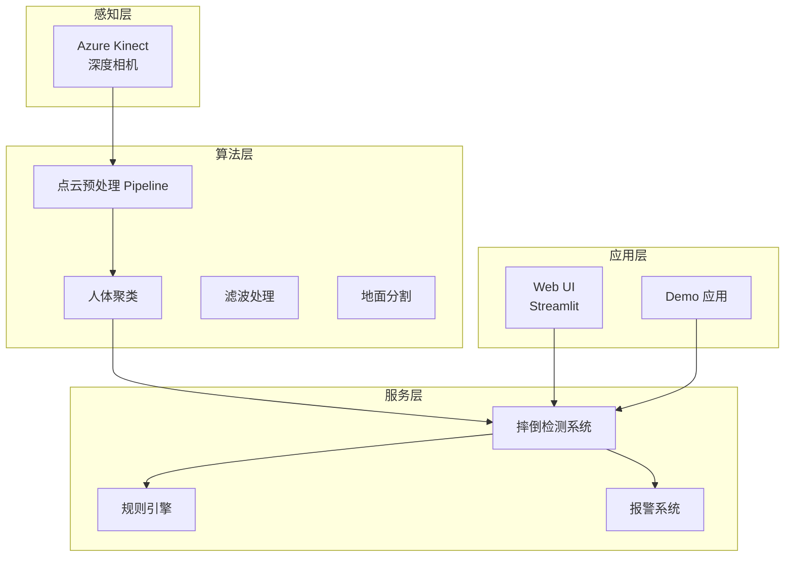
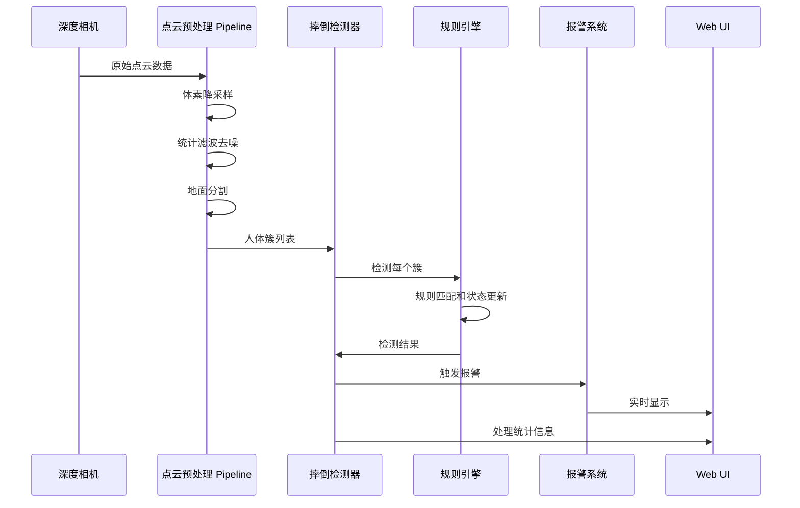
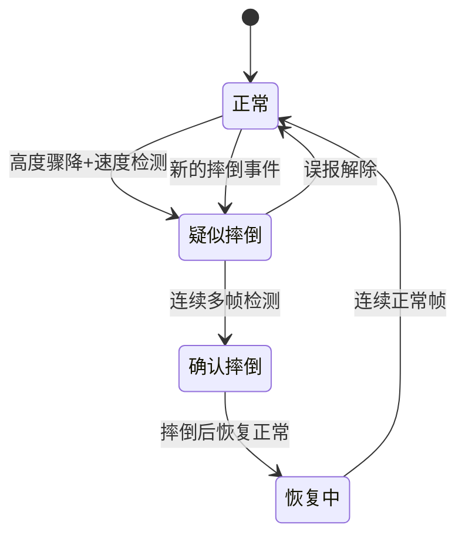
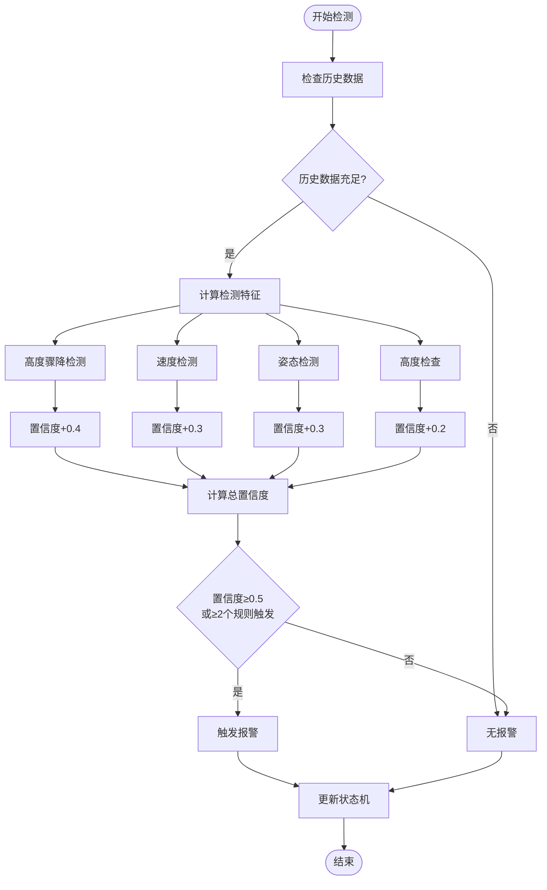
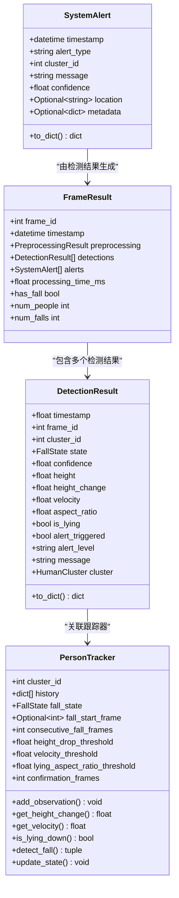
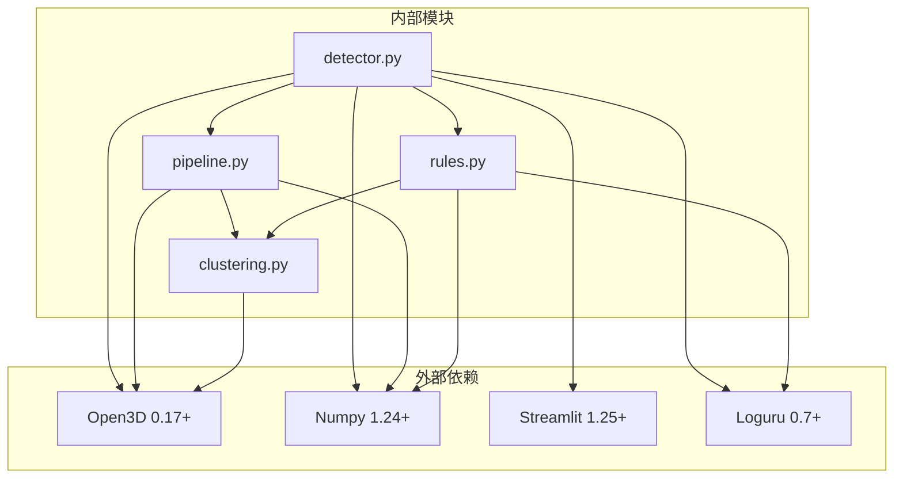

# 摔倒检测模块

<cite>
**本文档引用的文件**
- [src/detection/detector.py](file://src/detection/detector.py)
- [src/detection/rules.py](file://src/detection/rules.py)
- [src/preprocessing/clustering.py](file://src/preprocessing/clustering.py)
- [src/preprocessing/pipeline.py](file://src/preprocessing/pipeline.py)
- [demos/fall_detection_demo.py](file://demos/fall_detection_demo.py)
- [app.py](file://app.py)
- [README.md](file://README.md)
- [requirements.txt](file://requirements.txt)
</cite>

## 目录
1. [简介](#简介)
2. [项目结构](#项目结构)
3. [核心组件](#核心组件)
4. [架构概览](#架构概览)
5. [详细组件分析](#详细组件分析)
6. [依赖关系分析](#依赖关系分析)
7. [性能考虑](#性能考虑)
8. [故障排除指南](#故障排除指南)
9. [结论](#结论)
10. [附录](#附录)

## 简介

GuardianFall 是一个基于激光雷达/ToF 深度相机的室内人体摔倒实时预警系统。该系统通过点云数据处理和规则引擎实现高精度的摔倒检测，具有以下核心特性：

- **隐私保护**：只获取 3D 点云，不拍摄图像
- **实时检测**：端到端延迟<3 秒
- **高精度**：摔倒检测准确率>95%，误报率<5%
- **全天候工作**：不受光线影响，黑夜也能正常工作
- **AI 驱动**：基于规则引擎 + 深度学习的混合算法

## 项目结构

该项目采用模块化设计，主要分为以下几个核心模块：



**图表来源**
- [src/detection/detector.py:1-373](file://src/detection/detector.py#L1-L373)
- [src/preprocessing/pipeline.py:1-337](file://src/preprocessing/pipeline.py#L1-L337)

**章节来源**
- [README.md:61-86](file://README.md#L61-L86)
- [README.md:177-190](file://README.md#L177-L190)

## 核心组件

### 摔倒检测系统主类

`FallDetectionSystem` 是整个系统的核心控制器，负责协调各个组件的工作流程。

**主要职责：**
- 管理点云预处理 Pipeline
- 协调摔倒检测规则引擎
- 处理报警回调和通知
- 统计系统性能指标

**关键配置参数：**
- `voxel_size`: 体素降采样尺寸 (0.05m)
- `height_drop_threshold`: 高度骤降阈值 (0.5m)
- `velocity_threshold`: 速度阈值 (1.0 m/s)
- `confirmation_frames`: 确认摔倒所需连续帧数 (3帧)
- `fps`: 帧率 (30 FPS)

### 规则引擎

`RuleBasedFallDetector` 实现了基于规则的摔倒检测算法，包含四个核心检测规则：

1. **高度骤降检测** - 人体高度突然降低
2. **速度检测** - 下落速度超过阈值
3. **姿态检测** - 躺倒姿态识别
4. **静止检测** - 摔倒后保持静止

**章节来源**
- [src/detection/detector.py:75-283](file://src/detection/detector.py#L75-L283)
- [src/detection/rules.py:226-423](file://src/detection/rules.py#L226-L423)

## 架构概览

系统采用分层架构设计，确保各组件的职责清晰分离：



**图表来源**
- [src/detection/detector.py:138-227](file://src/detection/detector.py#L138-L227)
- [src/preprocessing/pipeline.py:98-139](file://src/preprocessing/pipeline.py#L98-L139)

## 详细组件分析

### 状态机设计

系统实现了完整的摔倒状态机，包含以下状态转换：



**状态定义：**
- `NORMAL`: 正常状态
- `SUSPECTED`: 疑似摔倒
- `CONFIRMED`: 确认摔倒
- `RECOVERING`: 恢复中
- `FALSE_ALARM`: 误报

**章节来源**
- [src/detection/rules.py:22-29](file://src/detection/rules.py#L22-L29)
- [src/detection/rules.py:190-224](file://src/detection/rules.py#L190-L224)

### 规则引擎实现

规则引擎采用多规则融合的方式，通过置信度评分实现智能决策：



**图表来源**
- [src/detection/rules.py:145-188](file://src/detection/rules.py#L145-L188)
- [src/detection/rules.py:306-330](file://src/detection/rules.py#L306-L330)

**章节来源**
- [src/detection/rules.py:145-188](file://src/detection/rules.py#L145-L188)
- [src/detection/rules.py:339-389](file://src/detection/rules.py#L339-L389)

### 报警机制

系统实现了多层次的报警机制，包含报警级别分类和重复报警抑制：

**报警级别：**
- `critical`: 确认摔倒 - 最高级别，需要立即响应
- `warning`: 疑似摔倒 - 需要关注的警告
- `info`: 状态信息 - 一般状态更新

**报警触发条件：**
- 确认摔倒：状态机进入 CONFIRMED 状态
- 疑似摔倒：状态机进入 SUSPECTED 状态
- 恢复中：状态机从 CONFIRMED 进入 RECOVERING
- 误报解除：状态机从 SUSPECTED 进入 FALSE_ALARM

**章节来源**
- [src/detection/rules.py:348-373](file://src/detection/rules.py#L348-L373)
- [src/detection/detector.py:174-192](file://src/detection/detector.py#L174-L192)

### 数据结构设计

系统使用了丰富的数据结构来封装处理结果和状态信息：



**图表来源**
- [src/detection/detector.py:25-73](file://src/detection/detector.py#L25-L73)
- [src/detection/rules.py:31-79](file://src/detection/rules.py#L31-L79)
- [src/detection/rules.py:82-224](file://src/detection/rules.py#L82-L224)

**章节来源**
- [src/detection/detector.py:25-73](file://src/detection/detector.py#L25-L73)
- [src/detection/rules.py:31-79](file://src/detection/rules.py#L31-L79)

## 依赖关系分析

系统依赖关系清晰，遵循单一职责原则：



**图表来源**
- [requirements.txt:1-34](file://requirements.txt#L1-L34)
- [src/detection/detector.py:12-22](file://src/detection/detector.py#L12-L22)
- [src/preprocessing/pipeline.py:13-21](file://src/preprocessing/pipeline.py#L13-L21)

**章节来源**
- [requirements.txt:1-34](file://requirements.txt#L1-L34)

## 性能考虑

### 处理延迟优化

系统针对实时处理进行了专门优化：

**关键优化措施：**
- **体素降采样**：减少点云数据量，提高处理速度
- **统计滤波**：去除噪声点，提升检测准确性
- **历史数据缓存**：限制历史记录长度，避免内存泄漏
- **异步报警处理**：避免阻塞主处理流程

**性能指标：**
- **处理速度**：> 20 FPS
- **单帧耗时**：< 100ms
- **内存占用**：< 2GB
- **CPU 占用**：< 50% (2 核)

### 参数调优指南

**预处理参数调优：**
- `voxel_size`: 0.05m (平衡精度和速度)
- `std_ratio`: 2.0 (去噪效果最佳)
- `distance_threshold`: 0.05m (地面分割精度)

**检测参数调优：**
- `height_drop_threshold`: 0.3-0.5m (根据环境调整)
- `velocity_threshold`: 0.5-1.0 m/s (根据场景调整)
- `confirmation_frames`: 2-3 帧 (平衡准确性和响应速度)

**章节来源**
- [README.md:201-218](file://README.md#L201-L218)
- [src/detection/detector.py:78-103](file://src/detection/detector.py#L78-L103)

## 故障排除指南

### 常见问题及解决方案

**问题1：检测准确率低**
- **症状**：频繁误报或漏报
- **可能原因**：
  - 阈值设置不当
  - 环境光照变化
  - 相机安装角度问题
- **解决方法**：
  - 调整 `height_drop_threshold` 和 `velocity_threshold`
  - 检查相机固定稳定性
  - 优化相机安装高度和角度

**问题2：处理速度慢**
- **症状**：帧率低于预期
- **可能原因**：
  - 点云数据量过大
  - CPU 性能不足
  - 参数设置过于严格
- **解决方法**：
  - 增大 `voxel_size`
  - 降低 `confirmation_frames`
  - 升级硬件配置

**问题3：报警不触发**
- **症状**：应该报警时没有触发
- **可能原因**：
  - 确认帧数过高
  - 姿态阈值设置过严
  - 相机视野遮挡
- **解决方法**：
  - 减少 `confirmation_frames`
  - 放宽 `lying_aspect_ratio_threshold`
  - 检查相机安装位置

**章节来源**
- [src/detection/rules.py:90-95](file://src/detection/rules.py#L90-L95)
- [src/detection/detector.py:104-112](file://src/detection/detector.py#L104-L112)

### 调试技巧

**实时监控：**
- 使用 Web UI 实时查看检测结果
- 监控 FPS 和处理时间
- 查看报警历史记录

**参数调试：**
- 通过滑块实时调整参数
- 观察对检测结果的影响
- 记录最佳参数组合

**数据验证：**
- 检查预处理结果
- 验证聚类质量
- 分析检测特征

**章节来源**
- [app.py:210-270](file://app.py#L210-L270)
- [demos/fall_detection_demo.py:92-179](file://demos/fall_detection_demo.py#L92-L179)

## 结论

GuardianFall 摔倒检测模块是一个设计精良的实时系统，具有以下优势：

**技术优势：**
- 基于规则引擎的稳定性和可解释性
- 多层次的状态机设计
- 完善的报警机制
- 优秀的性能表现

**实用性特点：**
- 隐私保护的设计理念
- 低误报率的算法实现
- 实时处理能力
- 用户友好的可视化界面

**改进建议：**
- 可考虑集成深度学习模型提升检测精度
- 增加多相机融合功能
- 实现云端数据分析和存储
- 扩展移动端报警推送功能

该系统为独居老人安全监护提供了可靠的技术解决方案，具有良好的应用前景和推广价值。

## 附录

### API 参考

**核心方法：**

1. `process_frame(raw_cloud: o3d.geometry.PointCloud, frame_id: Optional[int] = None) -> FrameResult`
   - 处理单帧点云数据
   - 参数：原始点云、帧 ID
   - 返回：处理结果对象

2. `process_continuous(cloud_generator, max_frames: Optional[int] = None)`
   - 连续处理点云流
   - 参数：点云生成器、最大帧数
   - 返回：迭代器，逐帧产生处理结果

3. `get_statistics() -> Dict`
   - 获取系统统计信息
   - 返回：包含处理帧数、报警次数、平均 FPS 等信息

4. `reset()`
   - 重置系统状态
   - 重新初始化 Pipeline 和检测器

**章节来源**
- [src/detection/detector.py:138-282](file://src/detection/detector.py#L138-L282)

### 使用示例

**基本使用：**
```python
# 创建检测系统
system = FallDetectionSystem(
    height_drop_threshold=0.3,
    velocity_threshold=0.5,
    confirmation_frames=2
)

# 处理单帧
result = system.process_frame(point_cloud)

# 连续处理
for result in system.process_continuous(generator):
    # 处理结果
    pass
```

**章节来源**
- [demos/fall_detection_demo.py:110-120](file://demos/fall_detection_demo.py#L110-L120)
- [src/detection/detector.py:302-373](file://src/detection/detector.py#L302-L373)

### 配置参数说明

**系统配置：**
- `voxel_size`: 体素降采样尺寸 (0.01-0.2m)
- `std_ratio`: 统计滤波标准差倍数 (1.0-3.0)
- `distance_threshold`: 地面分割距离阈值 (0.01-0.1m)
- `cluster_tolerance`: 聚类半径阈值 (0.05-0.3m)
- `height_drop_threshold`: 高度骤降阈值 (0.1-1.0m)
- `velocity_threshold`: 速度阈值 (0.2-2.0 m/s)
- `confirmation_frames`: 确认帧数 (1-10帧)
- `fps`: 帧率 (10-60 FPS)

**章节来源**
- [src/detection/detector.py:78-103](file://src/detection/detector.py#L78-L103)
- [src/detection/rules.py:229-251](file://src/detection/rules.py#L229-L251)