# 数据采集模块

<cite>
**本文引用的文件**
- [azure_kinect.py](file://src/data_capture/azure_kinect.py)
- [recorder.py](file://src/data_capture/recorder.py)
- [fall_detection_demo.py](file://demos/fall_detection_demo.py)
- [README.md](file://README.md)
- [requirements.txt](file://requirements.txt)
- [app.py](file://app.py)
</cite>

## 目录
1. [简介](#简介)
2. [项目结构](#项目结构)
3. [核心组件](#核心组件)
4. [架构概览](#架构概览)
5. [详细组件分析](#详细组件分析)
6. [依赖关系分析](#依赖关系分析)
7. [性能考虑](#性能考虑)
8. [故障排除指南](#故障排除指南)
9. [结论](#结论)
10. [附录](#附录)

## 简介

GuardianFall 数据采集模块是基于 Azure Kinect DK 深度相机的室内人体摔倒检测系统的感知层核心组件。该模块提供了完整的数据采集、点云生成、录制回放等功能，为上层的摔倒检测算法提供高质量的3D点云数据。

本模块的主要特点包括：
- 实时点云采集和深度图捕获
- 彩色图捕获（可选）
- 点云保存和多帧录制
- 完善的错误处理和异常管理
- 灵活的配置参数设置
- 性能优化和硬件兼容性支持

## 项目结构

数据采集模块位于 `src/data_capture/` 目录下，主要包含两个核心文件：

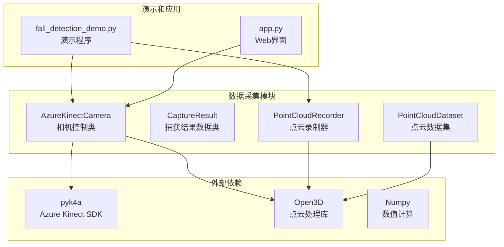

**图表来源**
- [azure_kinect.py:1-532](file://src/data_capture/azure_kinect.py#L1-L532)
- [recorder.py:1-489](file://src/data_capture/recorder.py#L1-L489)

**章节来源**
- [azure_kinect.py:1-50](file://src/data_capture/azure_kinect.py#L1-L50)
- [recorder.py:1-20](file://src/data_capture/recorder.py#L1-L20)

## 核心组件

数据采集模块由以下核心组件构成：

### AzureKinectCamera 类
这是模块的核心类，负责与 Azure Kinect DK 相机进行交互，提供完整的数据采集功能。

### CaptureResult 数据类
封装单次捕获的结果，包含时间戳、深度图、点云、彩色图和点数等信息。

### PointCloudRecorder 类
提供点云录制功能，支持将连续的点云序列保存为文件并生成元数据。

### PointCloudDataset 类
用于加载和回放已录制的数据集，支持迭代访问和标注管理。

**章节来源**
- [azure_kinect.py:32-462](file://src/data_capture/azure_kinect.py#L32-L462)
- [recorder.py:24-489](file://src/data_capture/recorder.py#L24-L489)

## 架构概览

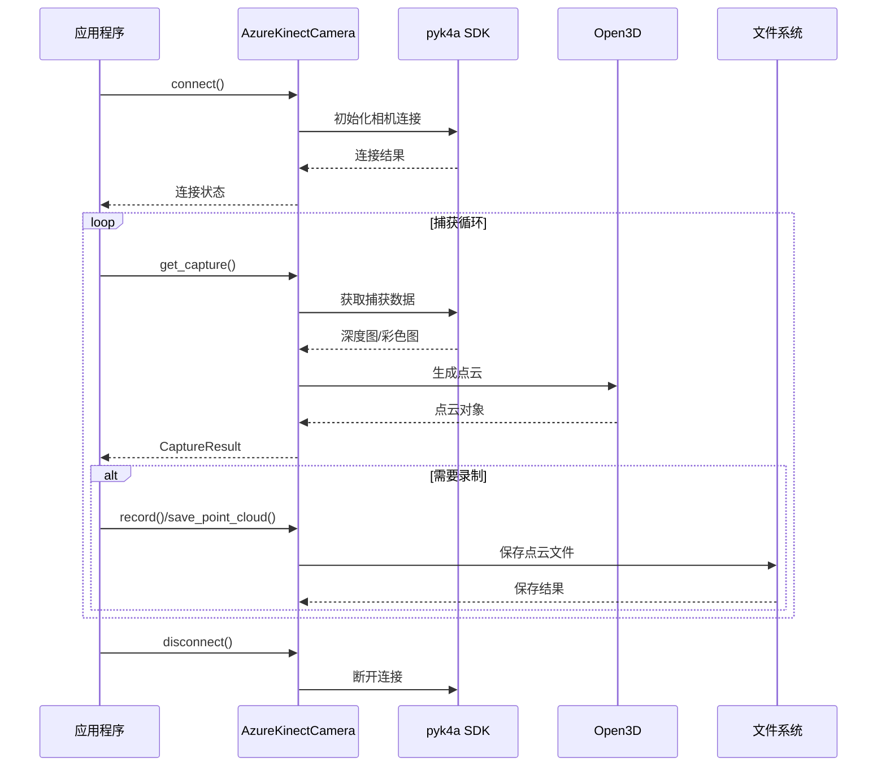

**图表来源**
- [azure_kinect.py:152-459](file://src/data_capture/azure_kinect.py#L152-L459)
- [recorder.py:177-221](file://src/data_capture/recorder.py#L177-L221)

## 详细组件分析

### AzureKinectCamera 类详细分析

#### 类结构图

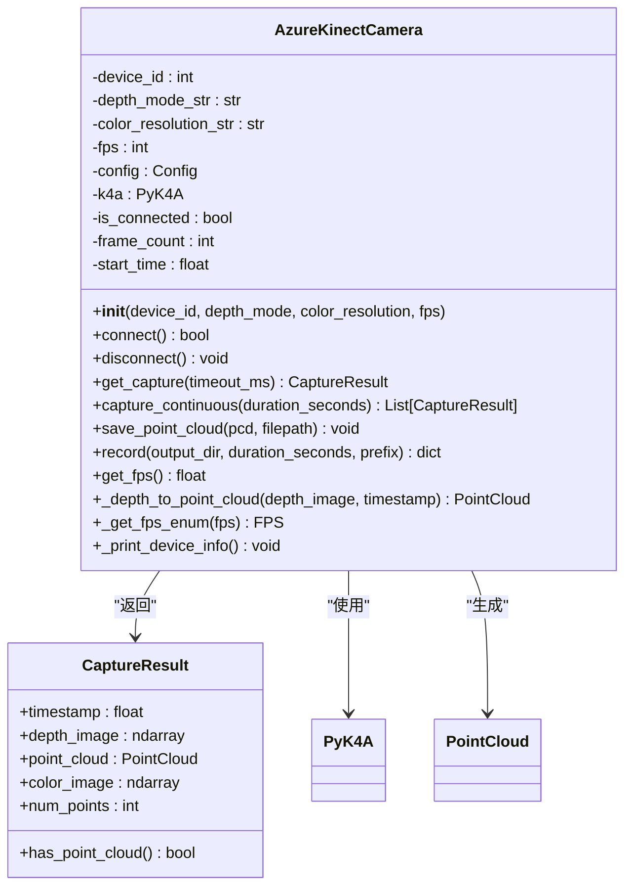

**图表来源**
- [azure_kinect.py:47-462](file://src/data_capture/azure_kinect.py#L47-L462)
- [azure_kinect.py:32-45](file://src/data_capture/azure_kinect.py#L32-L45)

#### 相机初始化流程

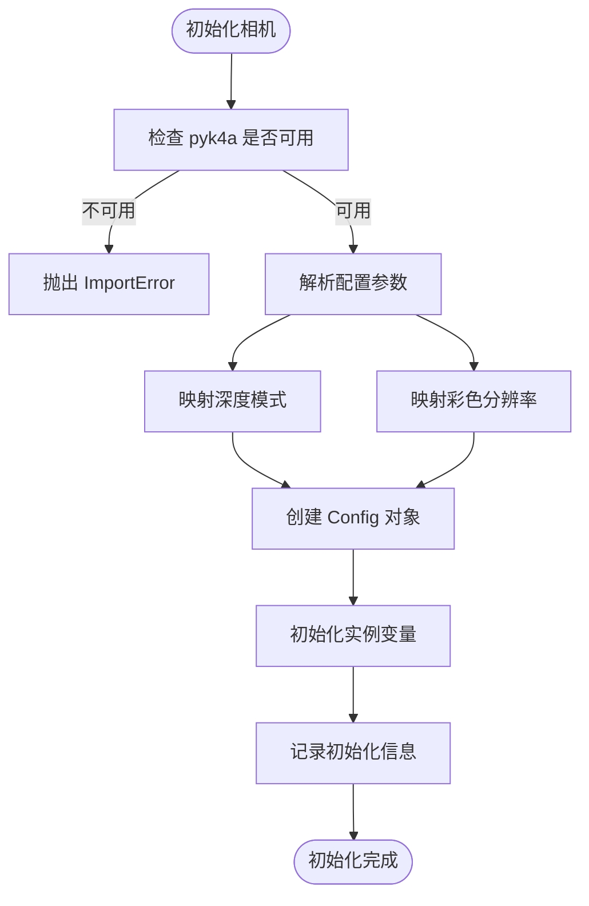

**图表来源**
- [azure_kinect.py:50-134](file://src/data_capture/azure_kinect.py#L50-L134)

#### 相机连接管理

相机连接采用状态管理模式，确保资源的正确管理和释放：

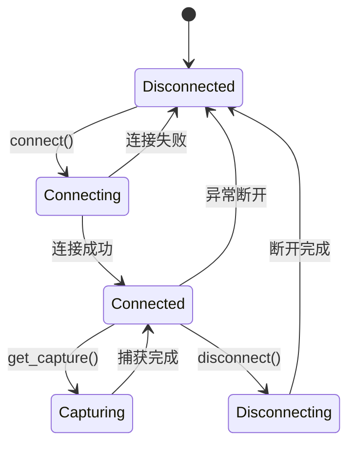

**图表来源**
- [azure_kinect.py:152-191](file://src/data_capture/azure_kinect.py#L152-L191)

#### 点云生成算法

点云生成是模块的核心功能，采用 RGBD 相机模型进行深度到3D的转换：

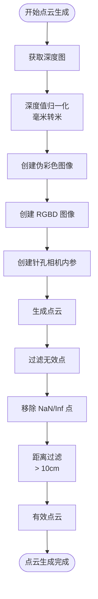

**图表来源**
- [azure_kinect.py:285-344](file://src/data_capture/azure_kinect.py#L285-L344)

#### 关键参数配置

| 参数名称 | 可选值 | 默认值 | 作用描述 |
|---------|--------|--------|----------|
| device_id | 整数 | 0 | 设备ID（多相机场景） |
| depth_mode | 'nfov_unbinned'<br/>'wfov_unbinned'<br/>'nfov_binned'<br/>'passive_ir' | 'nfov_unbinned' | 深度模式选择 |
| color_resolution | 'off'<br/>'720p'<br/>'1080p'<br/>'1440p'<br/>'1536p'<br/>'2160p'<br/>'3072p' | 'off' | 彩色分辨率设置 |
| fps | 5, 15, 30 | 30 | 帧率设置 |
| synchronized_images_only | 布尔值 | True | 是否只获取同步图像 |

**章节来源**
- [azure_kinect.py:50-134](file://src/data_capture/azure_kinect.py#L50-L134)
- [azure_kinect.py:216-284](file://src/data_capture/azure_kinect.py#L216-L284)

### 录制和回放模块

#### PointCloudRecorder 类

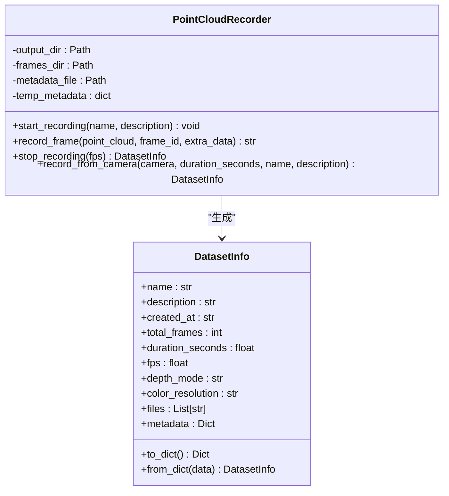

**图表来源**
- [recorder.py:48-176](file://src/data_capture/recorder.py#L48-L176)
- [recorder.py:24-46](file://src/data_capture/recorder.py#L24-L46)

#### 数据集管理

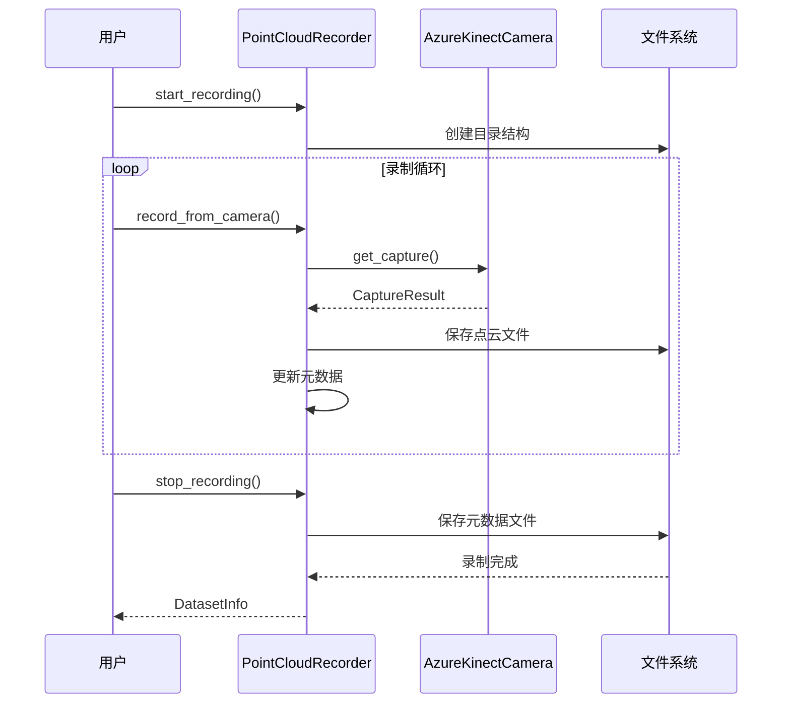

**图表来源**
- [recorder.py:177-221](file://src/data_capture/recorder.py#L177-L221)

**章节来源**
- [recorder.py:48-489](file://src/data_capture/recorder.py#L48-L489)

## 依赖关系分析

### 外部依赖

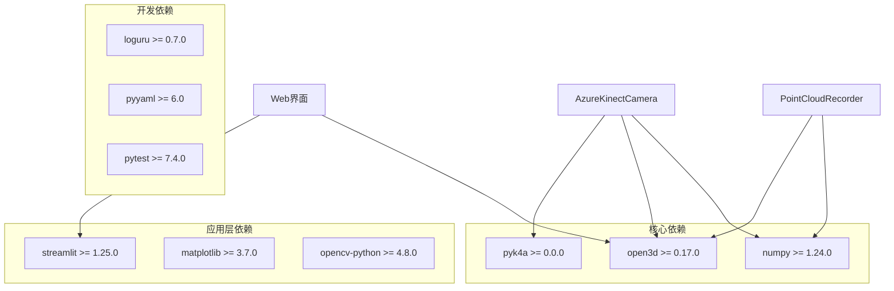

**图表来源**
- [requirements.txt:1-34](file://requirements.txt#L1-L34)
- [azure_kinect.py:14-20](file://src/data_capture/azure_kinect.py#L14-L20)

### 内部模块依赖

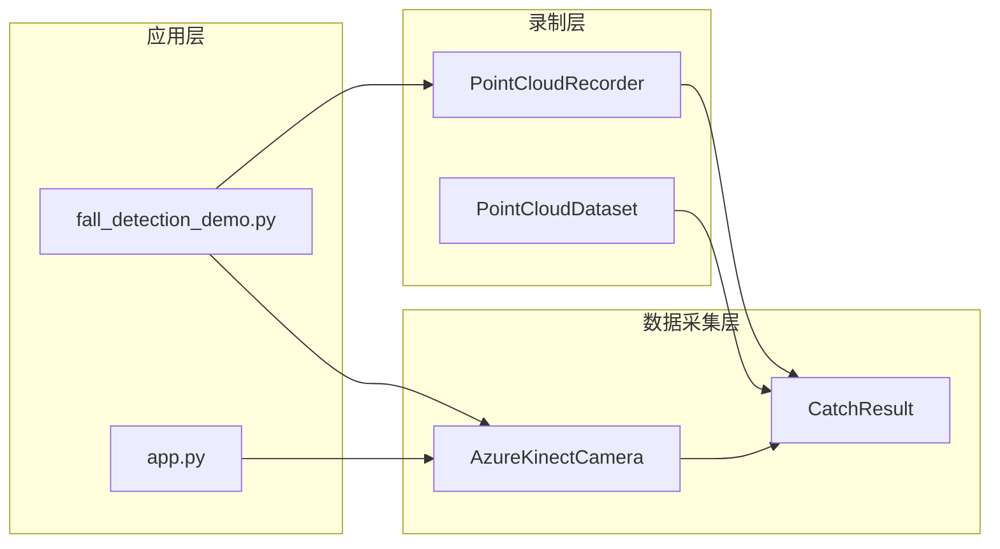

**图表来源**
- [fall_detection_demo.py:181-270](file://demos/fall_detection_demo.py#L181-L270)
- [app.py:105-134](file://app.py#L105-L134)

**章节来源**
- [requirements.txt:1-34](file://requirements.txt#L1-L34)
- [azure_kinect.py:22-30](file://src/data_capture/azure_kinect.py#L22-L30)

## 性能考虑

### 硬件要求

Azure Kinect DK 的性能要求：
- **USB 接口**: USB 3.0 或更高版本
- **处理器**: Intel i5 或同等性能的 AMD 处理器
- **内存**: 至少 8GB RAM
- **存储**: SSD 存储空间（录制大量数据时）
- **操作系统**: Windows 10/11, Ubuntu 18.04+, macOS

### 性能优化策略

1. **帧率优化**
   - 默认使用 30 FPS，平衡性能和精度
   - 可根据硬件能力调整到 15 FPS 或 5 FPS
   - 在录制模式下适当降低帧率以节省存储

2. **内存管理**
   - 及时释放不再使用的点云对象
   - 使用生成器模式处理大数据集
   - 合理设置点云过滤参数

3. **I/O 优化**
   - 批量保存点云文件
   - 使用高效的文件格式（.ply）
   - 异步文件写入操作

### 错误处理机制

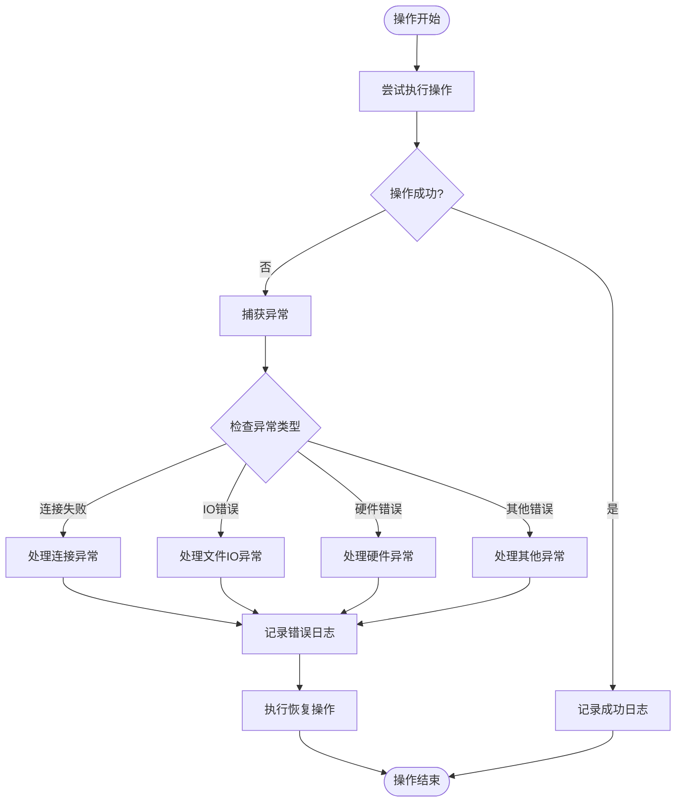

**图表来源**
- [azure_kinect.py:177-184](file://src/data_capture/azure_kinect.py#L177-L184)
- [azure_kinect.py:275-283](file://src/data_capture/azure_kinect.py#L275-L283)

**章节来源**
- [azure_kinect.py:152-191](file://src/data_capture/azure_kinect.py#L152-L191)
- [azure_kinect.py:275-283](file://src/data_capture/azure_kinect.py#L275-L283)

## 故障排除指南

### 常见问题及解决方案

#### 相机连接问题

| 问题症状 | 可能原因 | 解决方案 |
|---------|---------|---------|
| 连接失败 | USB 线不是 USB 3.0 | 更换为 USB 3.0 线缆 |
| 连接超时 | 驱动程序未安装 | 安装 Azure Kinect 驱动 |
| 设备占用 | 其他程序占用相机 | 关闭占用相机的应用程序 |
| 权限不足 | 操作系统权限限制 | 以管理员身份运行或修改权限 |

#### 性能问题

| 问题症状 | 可能原因 | 解决方案 |
|---------|---------|---------|
| 帧率过低 | CPU 性能不足 | 降低帧率或关闭彩色相机 |
| 内存不足 | 点云数据过大 | 优化点云过滤参数 |
| 录制卡顿 | 存储速度慢 | 使用 SSD 存储或降低帧率 |

#### 点云质量问题

| 问题症状 | 可能原因 | 解决方案 |
|---------|---------|---------|
| 点云稀疏 | 深度模式不合适 | 调整深度模式为 nfov_unbinned |
| 噪声过多 | 光线干扰 | 改变拍摄环境或调整参数 |
| 点云缺失 | 相机角度问题 | 调整相机位置和角度 |

**章节来源**
- [azure_kinect.py:177-184](file://src/data_capture/azure_kinect.py#L177-L184)
- [fall_detection_demo.py:218-227](file://demos/fall_detection_demo.py#L218-L227)

## 结论

GuardianFall 数据采集模块为摔倒检测系统提供了稳定可靠的感知层基础。通过 AzureKinectCamera 类的精心设计，实现了从硬件抽象到高级API的完整数据采集链路。

模块的主要优势包括：
- **完整的功能覆盖**: 从基础的点云采集到高级的录制回放
- **灵活的配置选项**: 支持多种深度模式和分辨率设置
- **完善的错误处理**: 提供详细的异常信息和恢复机制
- **良好的性能表现**: 通过合理的优化策略保证实时性
- **易于使用的API**: 简洁的接口设计降低了使用门槛

对于开发者而言，该模块提供了清晰的扩展点和良好的代码组织结构，便于进一步的功能增强和定制化开发。

## 附录

### API 参考

#### AzureKinectCamera 类

| 方法 | 参数 | 返回值 | 描述 |
|------|------|--------|------|
| `__init__` | device_id, depth_mode, color_resolution, fps | None | 初始化相机实例 |
| `connect` | - | bool | 连接相机设备 |
| `disconnect` | - | None | 断开相机连接 |
| `get_capture` | timeout_ms=1000 | CaptureResult | 捕获单帧数据 |
| `capture_continuous` | duration_seconds=10.0 | List[CaptureResult] | 连续捕获多帧 |
| `save_point_cloud` | pcd, filepath | None | 保存点云文件 |
| `record` | output_dir, duration_seconds=60.0, prefix='frame' | dict | 录制点云序列 |
| `get_fps` | - | float | 获取当前帧率 |

#### 录制相关类

| 方法 | 参数 | 返回值 | 描述 |
|------|------|--------|------|
| `start_recording` | name, description | None | 开始录制 |
| `record_frame` | point_cloud, frame_id, extra_data | str | 录制单帧 |
| `stop_recording` | fps=30.0 | DatasetInfo | 停止录制 |
| `load_frame` | frame_id | PointCloud | 加载单帧 |
| `iter_frames` | batch_size=1 | Iterator | 迭代所有帧 |

### 使用示例

#### 基础使用

```python
# 创建相机实例
camera = AzureKinectCamera(
    depth_mode='nfov_unbinned',
    color_resolution='off',
    fps=30
)

# 连接相机
if camera.connect():
    # 捕获单帧
    result = camera.get_capture()
    if result.has_point_cloud:
        # 处理点云数据
        pass
    
    # 断开连接
    camera.disconnect()
```

#### 录制数据集

```python
# 创建录制器
recorder = PointCloudRecorder('./datasets')

# 开始录制
recorder.start_recording('test_dataset', '测试数据集')

# 录制循环
for i in range(100):
    result = camera.get_capture()
    if result.has_point_cloud:
        recorder.record_frame(result.point_cloud, i)

# 停止录制
dataset_info = recorder.stop_recording(fps=30.0)
```

**章节来源**
- [azure_kinect.py:462-472](file://src/data_capture/azure_kinect.py#L462-L472)
- [recorder.py:413-436](file://src/data_capture/recorder.py#L413-L436)