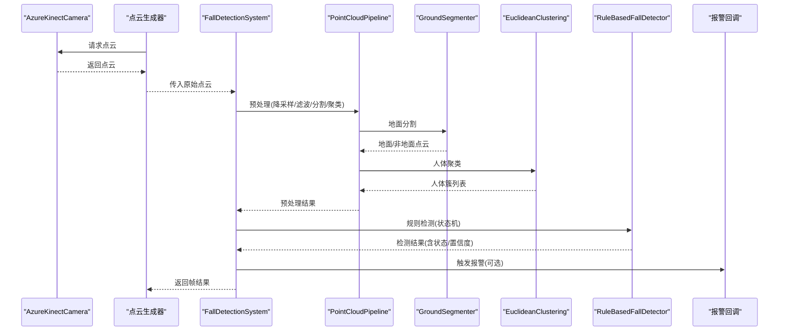
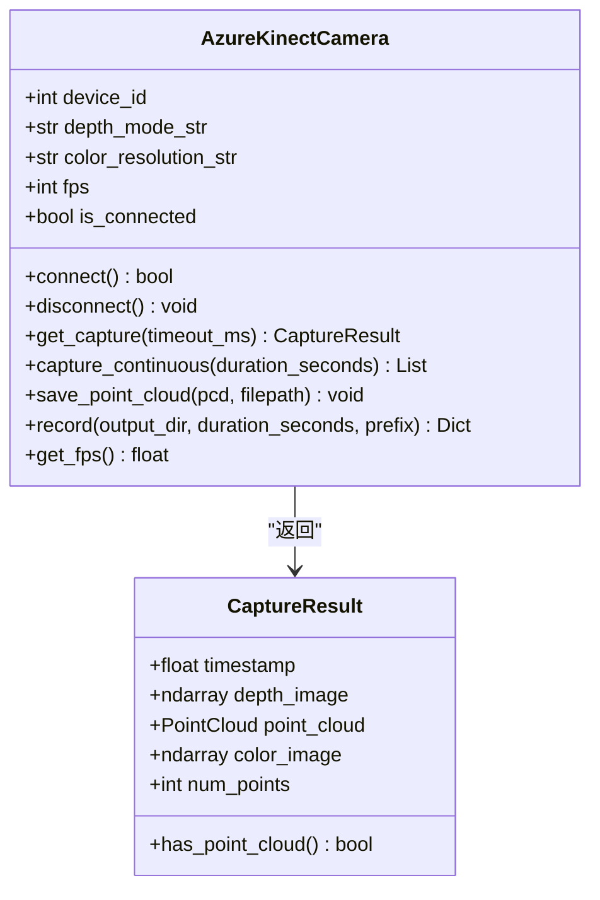
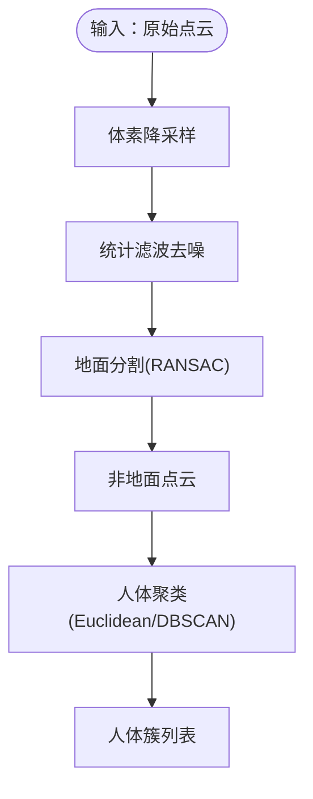
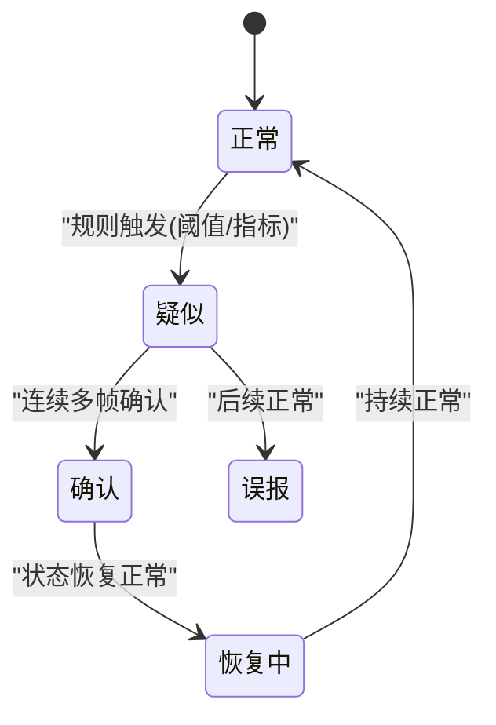
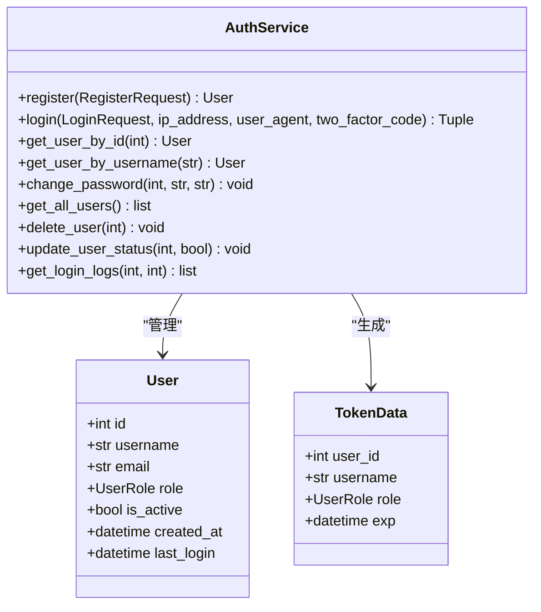
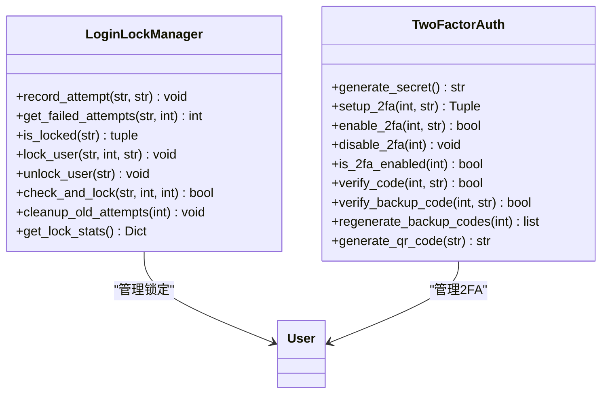
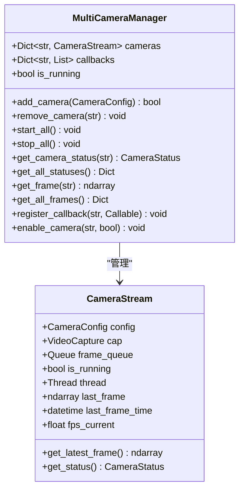
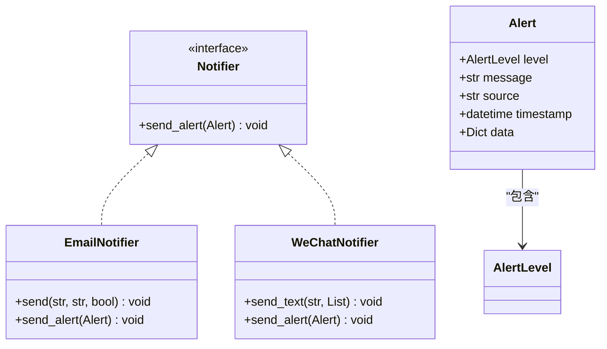
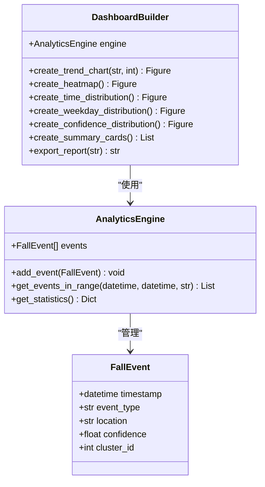
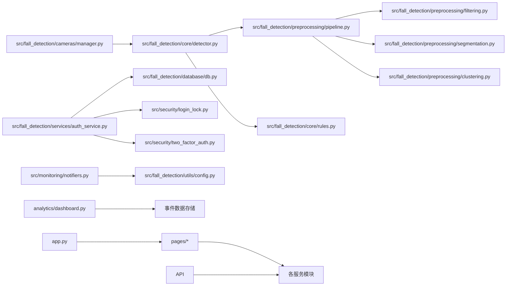

# 核心模块

<cite>
**本文引用的文件**
- [src/fall_detection/core/detector.py](file://src/fall_detection/core/detector.py)
- [src/fall_detection/services/auth_service.py](file://src/fall_detection/services/auth_service.py)
- [src/fall_detection/cameras/manager.py](file://src/fall_detection/cameras/manager.py)
- [src/monitoring/notifiers.py](file://src/monitoring/notifiers.py)
- [src/security/login_lock.py](file://src/security/login_lock.py)
- [src/security/two_factor_auth.py](file://src/security/two_factor_auth.py)
- [analytics/dashboard.py](file://analytics/dashboard.py)
- [pages/multi_camera_monitor.py](file://pages/multi_camera_monitor.py)
- [pages/security_center.py](file://pages/security_center.py)
- [pages/detection_dashboard.py](file://pages/detection_dashboard.py)
- [src/fall_detection/core/rules.py](file://src/fall_detection/core/rules.py)
- [src/fall_detection/preprocessing/pipeline.py](file://src/fall_detection/preprocessing/pipeline.py)
- [src/fall_detection/preprocessing/filtering.py](file://src/fall_detection/preprocessing/filtering.py)
- [src/fall_detection/preprocessing/segmentation.py](file://src/fall_detection/preprocessing/segmentation.py)
- [src/fall_detection/preprocessing/clustering.py](file://src/fall_detection/preprocessing/clustering.py)
- [src/fall_detection/utils/config.py](file://src/fall_detection/utils/config.py)
- [src/fall_detection/utils/error_handler.py](file://src/fall_detection/utils/error_handler.py)
- [src/fall_detection/database/db.py](file://src/fall_detection/database/db.py)
- [app.py](file://app.py)
- [demos/fall_detection_demo.py](file://demos/fall_detection_demo.py)
- [config.yaml](file://config.yaml)
- [requirements.txt](file://requirements.txt)
- [README.md](file://README.md)
</cite>

## 更新摘要
**变更内容**
- 新增认证服务模块（SQLite数据库、JWT令牌、用户管理）
- 新增安全模块（登录锁定、双因素认证、IP白名单）
- 新增多摄像头管理模块（多相机流管理、状态监控）
- 新增通知系统模块（邮件、企业微信通知）
- 新增分析仪表板模块（跌倒事件统计、可视化图表）
- 新增多摄像头监控界面和检测仪表板
- 新增安全中心页面（2FA设置、密码管理、登录历史）
- 增强系统架构，支持多用户、多摄像头、多通知渠道

## 目录
1. [简介](#简介)
2. [项目结构](#项目结构)
3. [核心组件](#核心组件)
4. [架构总览](#架构总览)
5. [详细组件分析](#详细组件分析)
6. [新增核心模块](#新增核心模块)
7. [依赖关系分析](#依赖关系分析)
8. [性能考量](#性能考量)
9. [故障排查指南](#故障排查指南)
10. [结论](#结论)
11. [附录](#附录)

## 简介
本文件面向GuardianFall核心模块，聚焦七大关键子系统：数据采集（Azure Kinect DK集成）、点云预处理（滤波、分割、聚类）、摔倒检测（规则引擎与状态机）、**新增**认证服务（SQLite数据库、JWT令牌、用户管理）、**新增**安全模块（登录锁定、双因素认证）、**新增**多摄像头管理、**新增**通知系统、**新增**分析仪表板。文档解释模块间调用关系与数据传递机制，提供配置选项、参数设置、性能调优方法，并给出错误处理策略与最佳实践。

## 项目结构
GuardianFall采用分层模块化设计，核心代码位于src目录，包含数据采集、预处理、检测与工具模块；应用入口通过Streamlit提供可视化界面，FastAPI提供RESTful API服务，Demo脚本展示从采集到检测的完整流程。新增的安全、认证、通知、分析模块提供了完整的系统管理能力。

```mermaid
graph TB
subgraph "应用层"
UI["Web UI (Streamlit)<br/>app.py"]
API["API服务 (FastAPI)<br/>src/api/main.py"]
Demo["Demo 脚本<br/>demos/fall_detection_demo.py"]
Pages["页面应用<br/>pages/*"]
end
subgraph "核心检测层"
DC["数据采集<br/>src/data_capture/*"]
PP["点云预处理<br/>src/preprocessing/*"]
DET["摔倒检测<br/>src/detection/*"]
CORE["核心检测<br/>src/fall_detection/core/*"]
end
subgraph "业务服务层"
AUTH["认证服务<br/>src/fall_detection/services/auth_service.py"]
CAM["摄像头管理<br/>src/fall_detection/cameras/manager.py"]
NOTIFY["通知系统<br/>src/monitoring/notifiers.py"]
ANALYTICS["分析仪表板<br/>analytics/dashboard.py"]
end
subgraph "支撑层"
DB["数据库<br/>src/fall_detection/database/db.py"]
SEC["安全模块<br/>src/security/*"]
UTIL["工具模块<br/>src/fall_detection/utils/*"]
end
subgraph "外部依赖"
O3D["Open3D"]
K4A["pyk4a/Azure Kinect SDK"]
Torch["PyTorch"]
FastAPI["FastAPI"]
Loguru["Loguru"]
YAML["PyYAML"]
SQLite["SQLite3"]
JWT["PyJWT"]
bcrypt["bcrypt"]
pyotp["pyotp"]
qrcode["qrcode"]
requests["requests"]
```

**图表来源**
- [app.py](file://app.py)
- [src/fall_detection/services/auth_service.py](file://src/fall_detection/services/auth_service.py)
- [src/fall_detection/cameras/manager.py](file://src/fall_detection/cameras/manager.py)
- [src/monitoring/notifiers.py](file://src/monitoring/notifiers.py)
- [analytics/dashboard.py](file://analytics/dashboard.py)
- [src/fall_detection/database/db.py](file://src/fall_detection/database/db.py)
- [src/security/login_lock.py](file://src/security/login_lock.py)
- [src/security/two_factor_auth.py](file://src/security/two_factor_auth.py)

**章节来源**
- [README.md](file://README.md)
- [requirements.txt](file://requirements.txt)

## 核心组件
- 数据采集模块：封装Azure Kinect DK，提供点云采集、深度/彩色图提取、点云保存、连续录制等功能。
- 点云预处理模块：提供滤波（体素降采样、统计滤波、半径滤波）、地面分割（RANSAC）、人体聚类（欧式聚类、DBSCAN、多视角融合）与Pipeline编排。
- 摔倒检测模块：基于规则引擎与状态机，结合高度骤降、速度、姿态、静止等指标，输出报警与状态流转。
- **新增** 认证服务模块：基于SQLite的用户认证系统，提供JWT令牌生成、用户注册登录、密码加密、会话管理等功能。
- **新增** 安全模块：包含登录锁定机制（防暴力破解）、双因素认证（TOTP）、IP白名单等安全功能。
- **新增** 多摄像头管理模块：支持USB/RTSP/HTTP/File等多种摄像头源，提供实时视频流管理、状态监控、帧队列处理。
- **新增** 通知系统模块：支持邮件通知、企业微信通知，提供告警分发、消息格式化、多渠道通知。
- **新增** 分析仪表板模块：提供跌倒事件统计、趋势分析、热力图、时间分布等可视化图表，支持数据导出。

**章节来源**
- [src/fall_detection/core/detector.py](file://src/fall_detection/core/detector.py)
- [src/fall_detection/services/auth_service.py](file://src/fall_detection/services/auth_service.py)
- [src/fall_detection/cameras/manager.py](file://src/fall_detection/cameras/manager.py)
- [src/monitoring/notifiers.py](file://src/monitoring/notifiers.py)
- [analytics/dashboard.py](file://analytics/dashboard.py)

## 架构总览
系统采用"采集-预处理-检测-报警"的流水线架构，新增支撑层提供认证、安全、通知、分析等完整的企业级功能。数据采集模块负责产生原始点云；预处理模块将点云清洗、分割地面、聚类得到人体簇；检测模块对簇进行状态跟踪与规则判定，触发报警并通过回调对外输出。



**图表来源**
- [src/fall_detection/core/detector.py](file://src/fall_detection/core/detector.py)
- [src/fall_detection/core/rules.py](file://src/fall_detection/core/rules.py)
- [src/fall_detection/preprocessing/pipeline.py](file://src/fall_detection/preprocessing/pipeline.py)
- [src/fall_detection/preprocessing/segmentation.py](file://src/fall_detection/preprocessing/segmentation.py)
- [src/fall_detection/preprocessing/clustering.py](file://src/fall_detection/preprocessing/clustering.py)

## 详细组件分析

### 数据采集模块（Azure Kinect DK集成）
- 功能要点
  - 相机初始化与连接，支持多参数配置（深度模式、彩色分辨率、帧率、同步模式）。
  - 单帧捕获与连续捕获，自动将深度图转为点云，过滤无效点。
  - 点云保存与录制（PLY/PCD），生成元数据文件。
  - 上下文管理器，确保资源释放。
- 关键接口
  - connect/disconnect：建立/断开相机连接。
  - get_capture/capture_continuous：获取单帧或多帧点云。
  - save_point_cloud/record：保存点云与录制序列。
- 错误处理
  - 未安装pyk4a时抛出友好异常；连接失败/超时记录日志并提示常见问题。
  - 捕获异常时返回空结果，避免中断流程。
- 使用模式
  - 直接调用工厂函数创建相机实例，或使用上下文管理器自动生命周期管理。
  - 结合Demo脚本或Web UI进行实时采集与录制。



**图表来源**
- [src/data_capture/azure_kinect.py](file://src/data_capture/azure_kinect.py)

**章节来源**
- [src/data_capture/azure_kinect.py](file://src/data_capture/azure_kinect.py)

### 点云预处理模块（滤波、分割、聚类）
- 流水线编排
  - PointCloudPipeline：串联体素降采样、统计滤波、地面分割、人体聚类。
  - RealTimePipeline：面向连续帧的优化，内置帧率统计与重置能力。
- 滤波器
  - VoxelGridFilter：体素降采样，控制点数规模。
  - StatisticalFilter：统计离群点剔除，提升鲁棒性。
  - RadiusFilter：半径邻域滤波，适合局部噪声去除。
- 地面分割
  - GroundSegmenter：基于RANSAC平面拟合，分离地面与非地面点。
  - ProgressiveMorphologicalFilter：地形复杂场景的简化实现。
- 聚类
  - EuclideanClustering：基于DBSCAN的欧式聚类，支持置信度评估。
  - DBSCANClustering：通用DBSCAN实现，可降级至Open3D。
  - MultiViewClustering：多视角融合聚类。
- 数据结构
  - HumanCluster：封装簇的几何属性（高度、宽度、深度、包围盒、置信度）。
  - PreprocessingResult：封装预处理统计与结果。



**图表来源**
- [src/fall_detection/preprocessing/pipeline.py](file://src/fall_detection/preprocessing/pipeline.py)
- [src/fall_detection/preprocessing/filtering.py](file://src/fall_detection/preprocessing/filtering.py)
- [src/fall_detection/preprocessing/segmentation.py](file://src/fall_detection/preprocessing/segmentation.py)
- [src/fall_detection/preprocessing/clustering.py](file://src/fall_detection/preprocessing/clustering.py)

**章节来源**
- [src/fall_detection/preprocessing/pipeline.py](file://src/fall_detection/preprocessing/pipeline.py)
- [src/fall_detection/preprocessing/filtering.py](file://src/fall_detection/preprocessing/filtering.py)
- [src/fall_detection/preprocessing/segmentation.py](file://src/fall_detection/preprocessing/segmentation.py)
- [src/fall_detection/preprocessing/clustering.py](file://src/fall_detection/preprocessing/clustering.py)

### 摔倒检测模块（规则引擎与状态机）
- 系统架构
  - FallDetectionSystem：整合预处理与检测，提供单帧/连续处理、统计信息与重置。
  - RuleBasedFallDetector：基于规则的状态机，跟踪每个人体簇的历史状态，输出疑似/确认/恢复/误报等状态。
- 状态机
  - NORMAL → SUSPECTED → CONFIRMED → RECOVERING → NORMAL
  - 通过连续帧阈值与多规则融合决定状态转移。
- 检测指标
  - 高度骤降、垂直速度、宽高比（躺倒姿态）、高度阈值等。
- 报警与回调
  - DetectionResult包含状态、置信度、报警级别与消息；支持回调函数对外通知。



**图表来源**
- [src/fall_detection/core/detector.py](file://src/fall_detection/core/detector.py)
- [src/fall_detection/core/rules.py](file://src/fall_detection/core/rules.py)

**章节来源**
- [src/fall_detection/core/detector.py](file://src/fall_detection/core/detector.py)
- [src/fall_detection/core/rules.py](file://src/fall_detection/core/rules.py)

## 新增核心模块

### 认证服务模块（SQLite数据库）
- 系统架构
  - AuthService：基于SQLite的用户认证服务，提供JWT令牌生成、用户注册登录、密码加密、会话管理。
  - 支持用户角色管理（admin/user）、用户状态控制（激活/禁用）。
- 核心功能
  - 用户注册：用户名唯一性检查、邮箱唯一性检查、密码bcrypt加密。
  - 用户登录：密码验证、登录锁定检查、2FA验证、会话创建。
  - JWT令牌：基于HS256算法的令牌生成与验证，支持过期时间配置。
  - 用户管理：获取用户信息、修改密码、用户状态管理、删除用户。
- 数据库设计
  - users表：用户基本信息、密码哈希、角色、状态。
  - user_sessions表：用户会话信息、设备信息、IP地址、过期时间。
  - user_locks表：用户锁定状态、锁定截止时间、锁定原因。
  - login_attempts表：登录失败尝试记录、IP地址、时间戳。
- 安全特性
  - 密码使用bcrypt加密，盐值随机生成。
  - JWT密钥从环境变量读取，支持运行时配置。
  - 登录失败自动锁定，防止暴力破解。
  - 2FA支持备用码机制，提供应急访问。



**图表来源**
- [src/fall_detection/services/auth_service.py](file://src/fall_detection/services/auth_service.py)

**章节来源**
- [src/fall_detection/services/auth_service.py](file://src/fall_detection/services/auth_service.py)
- [src/fall_detection/database/db.py](file://src/fall_detection/database/db.py)

### 安全模块（登录锁定与双因素认证）
- 登录锁定机制
  - LoginLockManager：防暴力破解的登录锁定管理器。
  - 失败尝试记录：15分钟内最多5次失败尝试，超过则锁定30分钟。
  - 锁定状态查询：检查用户是否被锁定及锁定截止时间。
  - 自动清理：定期清理过期的锁定记录和历史尝试。
- 双因素认证（2FA）
  - TwoFactorAuth：基于TOTP的双因素认证管理器。
  - 密钥生成：使用pyotp生成随机Base32密钥。
  - QR码生成：生成Provisioning URI并转换为Base64二维码。
  - 备用码：生成10个8位数字备用码，支持重新生成。
  - 验证机制：支持当前时间窗口前后1个窗口的验证码验证。
- 安全统计
  - 锁定用户统计：当前被锁定的用户数量。
  - 攻击IP统计：今日最常见的攻击IP地址。
  - 失败尝试统计：今日总失败尝试次数。



**图表来源**
- [src/security/login_lock.py](file://src/security/login_lock.py)
- [src/security/two_factor_auth.py](file://src/security/two_factor_auth.py)

**章节来源**
- [src/security/login_lock.py](file://src/security/login_lock.py)
- [src/security/two_factor_auth.py](file://src/security/two_factor_auth.py)

### 多摄像头管理模块
- 摄像头类型支持
  - USB摄像头：本地USB设备，支持设备号或设备路径。
  - RTSP流：网络摄像头RTSP协议，支持RTSP URL。
  - HTTP流：HTTP协议视频流，支持HTTP URL。
  - 文件流：本地视频文件播放，支持MP4/AVI等格式。
- 摄像头配置
  - CameraConfig：包含ID、名称、源地址、类型、分辨率、帧率、位置等。
  - CameraStatus：实时状态监控，包括连接状态、录制状态、FPS、错误信息。
- 流管理
  - CameraStream：单个摄像头流管理，支持后台线程读取、帧队列、状态监控。
  - MultiCameraManager：多摄像头管理器，支持添加/移除摄像头、启动/停止、状态查询。
- 实时处理
  - 帧队列：最大10帧缓冲，避免内存占用过高。
  - FPS计算：实时计算当前FPS，支持1秒窗口统计。
  - 线程安全：使用线程锁和队列确保多线程安全。
- 状态监控
  - 连接状态：检查摄像头是否成功连接。
  - 错误处理：捕获连接失败、读取失败等异常。
  - 健康检查：定期检查摄像头健康状况。



**图表来源**
- [src/fall_detection/cameras/manager.py](file://src/fall_detection/cameras/manager.py)

**章节来源**
- [src/fall_detection/cameras/manager.py](file://src/fall_detection/cameras/manager.py)

### 通知系统模块
- 通知渠道支持
  - EmailNotifier：SMTP邮件通知，支持HTML格式、附件、批量收件人。
  - WeChatNotifier：企业微信通知，支持Webhook和API两种方式。
- 配置管理
  - 基于配置文件的通道配置，支持不同通知渠道的独立配置。
  - 通知模板：标准化的告警消息格式，包含级别、时间、来源、详情。
- 告警分发
  - Alert类：统一的告警数据结构，包含级别、消息、来源、时间戳、数据。
  - 多渠道分发：支持同时向多个通知渠道发送告警。
  - 错误处理：通知失败时的重试机制和错误日志。
- 集成方式
  - 全局实例管理：邮件和微信通知器的单例模式。
  - 异常安全：通知器初始化失败时优雅降级。
  - 性能考虑：异步通知发送，避免阻塞主线程。



**图表来源**
- [src/monitoring/notifiers.py](file://src/monitoring/notifiers.py)

**章节来源**
- [src/monitoring/notifiers.py](file://src/monitoring/notifiers.py)

### 分析仪表板模块
- 数据收集
  - AnalyticsEngine：分析引擎，负责跌倒事件数据的收集、存储、统计。
  - FallEvent：事件数据模型，包含时间戳、事件类型、位置、置信度、人员ID等。
  - JSON存储：事件数据持久化存储，支持增量更新和批量导出。
- 统计分析
  - get_statistics()：总体统计信息，包括事件总数、确认/疑似比例、平均置信度等。
  - 时间范围查询：支持按时间范围筛选事件数据。
  - 位置分析：统计各位置的事件分布和占比。
- 可视化图表
  - DashboardBuilder：仪表板构建器，提供多种图表类型的生成方法。
  - 趋势图：支持小时/日/周/月粒度的趋势分析。
  - 热力图：位置分布的表格形式展示。
  - 时间分布：24小时事件分布和星期分布。
  - 置信度分布：高/中/低置信度的饼图展示。
- 报表导出
  - JSON导出：完整的事件数据和统计信息。
  - CSV导出：结构化的CSV格式，便于Excel分析。
  - 自动命名：基于时间戳的文件命名，避免冲突。



**图表来源**
- [analytics/dashboard.py](file://analytics/dashboard.py)

**章节来源**
- [analytics/dashboard.py](file://analytics/dashboard.py)

### 多摄像头监控界面
- 功能特性
  - 多画面布局：支持1x1、2x2、3x3画面布局切换。
  - 实时预览：所有活跃摄像头的实时视频流显示。
  - 摄像头管理：添加、删除、配置摄像头，启用/禁用状态。
  - 状态监控：实时显示摄像头连接状态、FPS、最后更新时间。
- 用户交互
  - 侧边栏控制：摄像头列表、布局选择、添加摄像头按钮。
  - 主界面显示：根据选择的布局显示对应的摄像头画面。
  - 详细信息：点击摄像头查看详细状态和配置信息。
- 技术实现
  - Streamlit集成：使用Streamlit的多页面架构。
  - 实时更新：使用st.session_state管理状态，支持自动刷新。
  - 错误处理：摄像头加载失败时的降级显示和错误提示。

**章节来源**
- [pages/multi_camera_monitor.py](file://pages/multi_camera_monitor.py)

### 安全中心页面
- 功能模块
  - 双因素认证：完整的2FA设置向导，支持启用、禁用、备用码管理。
  - 密码管理：修改密码功能，包含密码强度验证和安全提示。
  - 登录历史：查看最近的登录记录，包括成功/失败状态、IP地址、设备信息。
  - 会话管理：查看和管理活跃会话，支持强制下线功能。
- 用户体验
  - 分步引导：2FA设置采用分步向导，降低使用难度。
  - 安全提示：密码修改时提供安全建议和强度提示。
  - 实时状态：会话管理显示当前设备和其他设备的登录状态。
- 技术实现
  - 权限控制：所有功能都需要登录状态才能访问。
  - 数据安全：敏感操作（如修改密码、下线其他设备）需要二次确认。
  - 错误处理：操作失败时提供友好的错误提示和解决方案。

**章节来源**
- [pages/security_center.py](file://pages/security_center.py)

### 检测仪表板页面
- 功能特性
  - 检测控制：启动/停止所有检测器，启用/禁用单个摄像头检测。
  - 实时统计：总体统计信息，包括总摄像头数、活跃检测数、处理帧数、告警数。
  - 摄像头状态：各摄像头的检测状态、处理统计、最后检测时间。
  - 告警历史：告警历史记录查看（功能开发中）。
- 用户界面
  - 侧边栏控制：检测器控制、活跃检测器列表、快速操作。
  - 主界面统计：大卡片形式的总体统计信息。
  - 详细状态：各摄像头的详细检测状态和快速操作按钮。
- 集成架构
  - 多摄像头检测：支持多个摄像头的同时检测和统一管理。
  - 实时更新：检测状态的实时更新和统计信息的动态变化。
  - 统一告警：来自多个摄像头的告警统一处理和显示。

**章节来源**
- [pages/detection_dashboard.py](file://pages/detection_dashboard.py)

## 依赖关系分析
- 内部依赖
  - 检测系统依赖预处理Pipeline；预处理Pipeline依赖滤波、分割、聚类模块。
  - 规则检测器依赖聚类结果与追踪器。
  - 认证服务依赖数据库模块；安全模块依赖认证服务。
  - 多摄像头管理依赖OpenCV；通知系统依赖配置模块。
  - 分析仪表板依赖事件数据存储；页面应用依赖各服务模块。
- 外部依赖
  - Open3D：点云数据结构与算法基础。
  - pyk4a：Azure Kinect SDK绑定。
  - PyTorch：AI增强模块预留。
  - FastAPI：API服务框架。
  - Loguru：现代化日志系统。
  - PyYAML：配置文件解析。
  - SQLite3：本地数据库存储。
  - PyJWT：JWT令牌处理。
  - bcrypt：密码加密。
  - pyotp：双因素认证。
  - qrcode：二维码生成。
  - requests：HTTP请求处理。
- 依赖可视化



**图表来源**
- [src/fall_detection/core/detector.py](file://src/fall_detection/core/detector.py)
- [src/fall_detection/services/auth_service.py](file://src/fall_detection/services/auth_service.py)
- [src/fall_detection/cameras/manager.py](file://src/fall_detection/cameras/manager.py)
- [src/monitoring/notifiers.py](file://src/monitoring/notifiers.py)
- [analytics/dashboard.py](file://analytics/dashboard.py)
- [pages/multi_camera_monitor.py](file://pages/multi_camera_monitor.py)

**章节来源**
- [requirements.txt](file://requirements.txt)

## 性能考量
- 处理链路优化
  - 体素降采样优先，显著降低后续计算量；统计滤波减少噪声；RANSAC地面分割需平衡迭代次数与精度。
  - 聚类半径与点数阈值直接影响召回与误检，应结合场景动态调整。
- 实时性保障
  - RealTimePipeline内置帧率统计，可通过降低滤波强度或增大容忍阈值缓解延迟。
  - 多摄像头管理器使用线程池和队列，避免阻塞主处理流程。
  - 通知系统异步发送，避免影响检测性能。
- 并发与扩展
  - AsyncProcessor支持线程池和进程池，可根据任务类型选择合适的执行模式。
  - 多摄像头管理器支持多线程读取，使用队列避免内存占用过高。
  - 认证服务使用连接池，支持高并发用户访问。
- 硬件与SDK
  - Azure Kinect DK在30FPS下可满足实时需求；USB3.0与驱动安装是稳定性的关键。
  - 多摄像头场景下需要足够的带宽和处理能力。
- 资源占用
  - 系统目标单帧<100ms，平均FPS>20；内存占用<2GB，CPU占用<50%（2核）。
  - 缓存系统支持最大缓存大小限制，避免内存溢出。
  - 数据库连接池限制最大连接数，避免资源耗尽。

## 故障排查指南
- 相机连接问题
  - 症状：连接失败、超时、无点云。
  - 排查：确认USB3.0线缆、驱动安装、无其他程序占用；查看日志中的常见问题提示。
- 点云质量差
  - 症状：地面分割异常、聚类碎片化。
  - 排查：提高统计滤波std_ratio、增大体素降采样尺寸、调整RANSAC阈值。
- 报警误报/漏报
  - 症状：频繁误报或未检测到摔倒。
  - 排查：调整高度骤降阈值、速度阈值、确认帧数；检查宽高比阈值与高度阈值。
- 配置问题
  - 症状：配置不生效或加载失败。
  - 排查：检查config.yaml格式和语法；确认环境变量覆盖正确；使用get_config()验证配置加载。
- 性能问题
  - 症状：处理延迟增加、内存占用过高。
  - 排查：检查缓存配置和统计；调整异步处理参数；监控错误日志。
- Web UI与Demo
  - 症状：界面卡顿、参数不生效。
  - 排查：参数变更后需重启系统；检查依赖安装与端口占用。
- API服务问题
  - 症状：API接口不可用或响应缓慢。
  - 排查：检查FastAPI服务状态；验证CORS配置；监控WebSocket连接。
- 认证问题
  - 症状：登录失败、无法注册、令牌过期。
  - 排查：检查JWT密钥配置、数据库连接、用户状态；验证2FA设置。
- 多摄像头问题
  - 症状：摄像头无信号、FPS异常、内存占用过高。
  - 排查：检查摄像头连接、网络带宽、队列大小；监控线程状态。
- 通知问题
  - 症状：邮件发送失败、微信通知异常。
  - 排查：检查SMTP配置、微信Webhook配置、网络连接；查看通知日志。

**章节来源**
- [src/fall_detection/core/detector.py](file://src/fall_detection/core/detector.py)
- [src/fall_detection/services/auth_service.py](file://src/fall_detection/services/auth_service.py)
- [src/fall_detection/cameras/manager.py](file://src/fall_detection/cameras/manager.py)
- [src/monitoring/notifiers.py](file://src/monitoring/notifiers.py)
- [pages/multi_camera_monitor.py](file://pages/multi_camera_monitor.py)

## 结论
GuardianFall通过清晰的模块划分与稳健的流水线设计，实现了从深度相机到实时报警的完整闭环。新增的认证服务、安全模块、多摄像头管理、通知系统、分析仪表板等核心功能模块显著提升了系统的安全性、可扩展性和企业级应用能力。系统支持多用户管理、多摄像头监控、多渠道通知、实时数据分析，为独居老人安全监护提供了完整的解决方案。配合Web UI、API服务和Demo，系统具备良好的可操作性、可扩展性和生产就绪能力。

## 附录

### 配置与参数参考
- 数据采集
  - 深度模式：nfov_unbinned/wfov_unbinned/nfov_binned/passive_ir
  - 彩色分辨率：off/720p/1080p/1440p/1536p/2160p/3072p
  - 帧率：5/15/30
  - 同步模式：wired_sync_mode=WiredSyncMode.STANDALONE
- 预处理
  - 体素尺寸：voxel_size（米）
  - 统计滤波：nb_neighbors/std_ratio
  - 地面分割：distance_threshold/ransac_n/num_iterations
  - 聚类：cluster_tolerance/min_cluster_size/max_cluster_size
- 检测
  - 高度骤降阈值：height_drop_threshold（米）
  - 速度阈值：velocity_threshold（米/秒）
  - 确认帧数：confirmation_frames
  - 帧率：fps
- **新增** 认证配置
  - JWT密钥：JWT_SECRET（环境变量）
  - JWT过期时间：JWT_EXPIRE_MINUTES（分钟）
  - 用户角色：admin/user
  - 用户状态：is_active
- **新增** 摄像头配置
  - 摄像头类型：usb/rtsp/http/file
  - 分辨率：width/height（像素）
  - 帧率：fps（帧/秒）
  - 位置信息：location
- **新增** 通知配置
  - 邮件SMTP：smtp_server/smtp_port/username/password/from_addr
  - 企业微信：webhook_url/agent_id/corp_id/corp_secret
  - 通知渠道：enabled_channels

**章节来源**
- [src/fall_detection/core/detector.py](file://src/fall_detection/core/detector.py)
- [src/fall_detection/services/auth_service.py](file://src/fall_detection/services/auth_service.py)
- [src/fall_detection/cameras/manager.py](file://src/fall_detection/cameras/manager.py)
- [src/monitoring/notifiers.py](file://src/monitoring/notifiers.py)
- [config.yaml](file://config.yaml)

### 使用模式与最佳实践
- 模拟测试
  - 使用Demo脚本的模拟数据模式，验证系统整体流程与参数效果。
- 真机运行
  - 安装pyk4a后连接Azure Kinect，运行Demo的真实相机模式；或通过Web UI进行参数调试。
- 数据录制与回放
  - 使用录制器保存点云序列，便于离线分析与模型训练；通过数据集类进行回放与标注。
- 参数调优
  - 先以默认参数跑通流程，再逐步微调；优先调整高度骤降与速度阈值，其次调整确认帧数与聚类容忍度。
- **新增** 认证管理
  - 使用SQLite数据库进行用户管理，支持多用户并发访问。
  - 配置JWT密钥和过期时间，确保令牌安全。
  - 定期清理登录尝试记录和锁定状态。
- **新增** 多摄像头管理
  - 合理配置摄像头参数，避免网络带宽不足。
  - 使用队列管理避免内存占用过高。
  - 定期检查摄像头健康状态。
- **新增** 通知配置
  - 配置多个通知渠道，确保告警能够及时送达。
  - 测试通知功能，验证邮件和微信通知正常工作。
  - 监控通知发送状态，及时处理发送失败的情况。
- **新增** 分析仪表板
  - 定期查看分析报表，了解系统运行状况。
  - 导出报表数据，用于进一步的数据分析。
  - 根据统计数据调整检测参数和阈值。

**章节来源**
- [demos/fall_detection_demo.py](file://demos/fall_detection_demo.py)
- [pages/multi_camera_monitor.py](file://pages/multi_camera_monitor.py)
- [pages/security_center.py](file://pages/security_center.py)
- [pages/detection_dashboard.py](file://pages/detection_dashboard.py)
- [analytics/dashboard.py](file://analytics/dashboard.py)