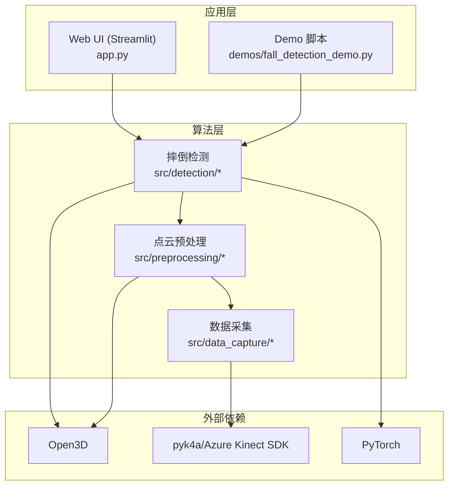
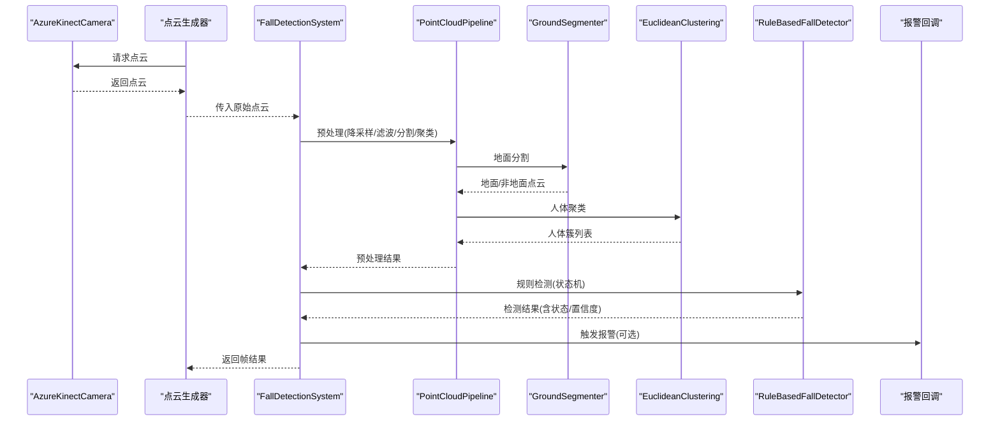
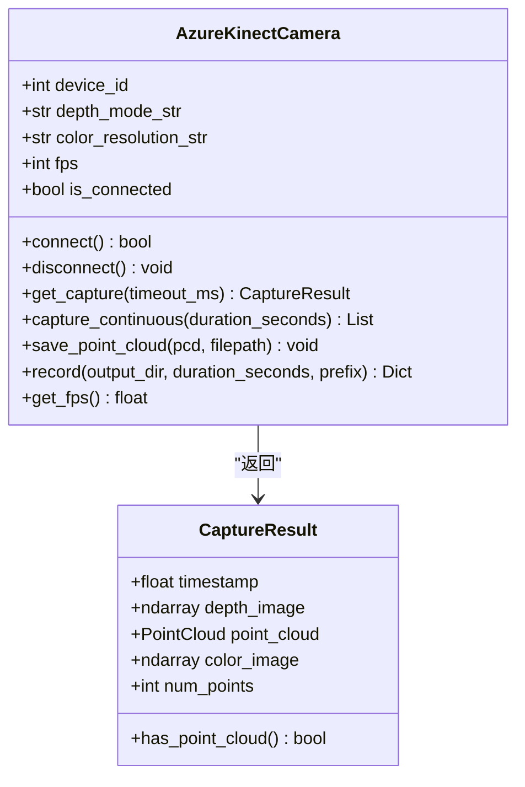
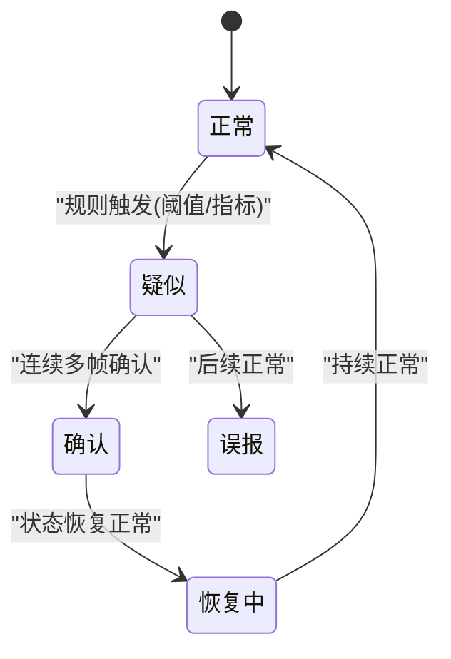
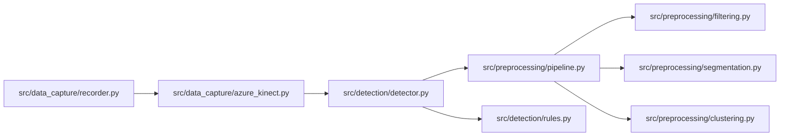

# 核心模块

<cite>
**本文引用的文件**
- [src/data_capture/azure_kinect.py](file://src/data_capture/azure_kinect.py)
- [src/data_capture/recorder.py](file://src/data_capture/recorder.py)
- [src/preprocessing/pipeline.py](file://src/preprocessing/pipeline.py)
- [src/preprocessing/filtering.py](file://src/preprocessing/filtering.py)
- [src/preprocessing/segmentation.py](file://src/preprocessing/segmentation.py)
- [src/preprocessing/clustering.py](file://src/preprocessing/clustering.py)
- [src/detection/detector.py](file://src/detection/detector.py)
- [src/detection/rules.py](file://src/detection/rules.py)
- [app.py](file://app.py)
- [demos/fall_detection_demo.py](file://demos/fall_detection_demo.py)
- [requirements.txt](file://requirements.txt)
- [README.md](file://README.md)
</cite>

## 目录
1. [简介](#简介)
2. [项目结构](#项目结构)
3. [核心组件](#核心组件)
4. [架构总览](#架构总览)
5. [详细组件分析](#详细组件分析)
6. [依赖关系分析](#依赖关系分析)
7. [性能考量](#性能考量)
8. [故障排查指南](#故障排查指南)
9. [结论](#结论)
10. [附录](#附录)

## 简介
本文件面向GuardianFall核心模块，聚焦三大关键子系统：数据采集（Azure Kinect DK集成）、点云预处理（滤波、分割、聚类）、摔倒检测（规则引擎与状态机）。文档解释模块间调用关系与数据传递机制，提供配置选项、参数设置、性能调优方法，并给出错误处理策略与最佳实践。

## 项目结构
GuardianFall采用分层模块化设计，核心代码位于src目录，包含数据采集、预处理、检测与工具模块；应用入口通过Streamlit提供可视化界面，Demo脚本展示从采集到检测的完整流程。

**图表来源**
- [app.py](file://app.py)
- [demos/fall_detection_demo.py](file://demos/fall_detection_demo.py)
- [src/data_capture/azure_kinect.py](file://src/data_capture/azure_kinect.py)
- [src/preprocessing/pipeline.py](file://src/preprocessing/pipeline.py)
- [src/detection/detector.py](file://src/detection/detector.py)

**章节来源**
- [README.md](file://README.md)
- [requirements.txt](file://requirements.txt)

## 核心组件
- 数据采集模块：封装Azure Kinect DK，提供点云采集、深度/彩色图提取、点云保存、连续录制等功能。
- 点云预处理模块：提供滤波（体素降采样、统计滤波、半径滤波）、地面分割（RANSAC）、人体聚类（欧式聚类、DBSCAN、多视角融合）与Pipeline编排。
- 摔倒检测模块：基于规则引擎与状态机，结合高度骤降、速度、姿态、静止等指标，输出报警与状态流转。

**章节来源**
- [src/data_capture/azure_kinect.py](file://src/data_capture/azure_kinect.py)
- [src/preprocessing/pipeline.py](file://src/preprocessing/pipeline.py)
- [src/detection/detector.py](file://src/detection/detector.py)

## 架构总览
系统采用“采集-预处理-检测-报警”的流水线架构。数据采集模块负责产生原始点云；预处理模块将点云清洗、分割地面、聚类得到人体簇；检测模块对簇进行状态跟踪与规则判定，触发报警并通过回调对外输出。

**图表来源**
- [src/data_capture/azure_kinect.py](file://src/data_capture/azure_kinect.py)
- [src/detection/detector.py](file://src/detection/detector.py)
- [src/preprocessing/pipeline.py](file://src/preprocessing/pipeline.py)
- [src/preprocessing/segmentation.py](file://src/preprocessing/segmentation.py)
- [src/preprocessing/clustering.py](file://src/preprocessing/clustering.py)
- [src/detection/rules.py](file://src/detection/rules.py)

## 详细组件分析

### 数据采集模块（Azure Kinect DK集成）
- 功能要点
  - 相机初始化与连接，支持多参数配置（深度模式、彩色分辨率、帧率、同步模式）。
  - 单帧捕获与连续捕获，自动将深度图转为点云，过滤无效点。
  - 点云保存与录制（PLY/PCD），生成元数据文件。
  - 上下文管理器，确保资源释放。
- 关键接口
  - connect/disconnect：建立/断开相机连接。
  - get_capture/capture_continuous：获取单帧或多帧点云。
  - save_point_cloud/record：保存点云与录制序列。
- 错误处理
  - 未安装pyk4a时抛出友好异常；连接失败/超时记录日志并提示常见问题。
  - 捕获异常时返回空结果，避免中断流程。
- 使用模式
  - 直接调用工厂函数创建相机实例，或使用上下文管理器自动生命周期管理。
  - 结合Demo脚本或Web UI进行实时采集与录制。

**图表来源**
- [src/data_capture/azure_kinect.py](file://src/data_capture/azure_kinect.py)

**章节来源**
- [src/data_capture/azure_kinect.py](file://src/data_capture/azure_kinect.py)

### 点云预处理模块（滤波、分割、聚类）
- 流水线编排
  - PointCloudPipeline：串联体素降采样、统计滤波、地面分割、人体聚类。
  - RealTimePipeline：面向连续帧的优化，内置帧率统计与重置能力。
- 滤波器
  - VoxelGridFilter：体素降采样，控制点数规模。
  - StatisticalFilter：统计离群点剔除，提升鲁棒性。
  - RadiusFilter：半径邻域滤波，适合局部噪声去除。
- 地面分割
  - GroundSegmenter：基于RANSAC平面拟合，分离地面与非地面点。
  - ProgressiveMorphologicalFilter：地形复杂场景的简化实现。
- 聚类
  - EuclideanClustering：基于DBSCAN的欧式聚类，支持置信度评估。
  - DBSCANClustering：通用DBSCAN实现，可降级至Open3D。
  - MultiViewClustering：多视角融合聚类。
- 数据结构
  - HumanCluster：封装簇的几何属性（高度、宽度、深度、包围盒、置信度）。
  - PreprocessingResult：封装预处理统计与结果。

**图表来源**
- [src/preprocessing/pipeline.py](file://src/preprocessing/pipeline.py)
- [src/preprocessing/filtering.py](file://src/preprocessing/filtering.py)
- [src/preprocessing/segmentation.py](file://src/preprocessing/segmentation.py)
- [src/preprocessing/clustering.py](file://src/preprocessing/clustering.py)

**章节来源**
- [src/preprocessing/pipeline.py](file://src/preprocessing/pipeline.py)
- [src/preprocessing/filtering.py](file://src/preprocessing/filtering.py)
- [src/preprocessing/segmentation.py](file://src/preprocessing/segmentation.py)
- [src/preprocessing/clustering.py](file://src/preprocessing/clustering.py)

### 摔倒检测模块（规则引擎与状态机）
- 系统架构
  - FallDetectionSystem：整合预处理与检测，提供单帧/连续处理、统计信息与重置。
  - RuleBasedFallDetector：基于规则的状态机，跟踪每个人体簇的历史状态，输出疑似/确认/恢复/误报等状态。
- 状态机
  - NORMAL → SUSPECTED → CONFIRMED → RECOVERING → NORMAL
  - 通过连续帧阈值与多规则融合决定状态转移。
- 检测指标
  - 高度骤降、垂直速度、宽高比（躺倒姿态）、高度阈值等。
- 报警与回调
  - DetectionResult包含状态、置信度、报警级别与消息；支持回调函数对外通知。

**图表来源**
- [src/detection/detector.py](file://src/detection/detector.py)
- [src/detection/rules.py](file://src/detection/rules.py)

**章节来源**
- [src/detection/detector.py](file://src/detection/detector.py)
- [src/detection/rules.py](file://src/detection/rules.py)

## 依赖关系分析
- 内部依赖
  - 检测系统依赖预处理Pipeline；预处理Pipeline依赖滤波、分割、聚类模块。
  - 规则检测器依赖聚类结果与追踪器。
- 外部依赖
  - Open3D：点云数据结构与算法基础。
  - pyk4a：Azure Kinect SDK绑定。
  - PyTorch：AI增强模块预留。
- 依赖可视化

**图表来源**
- [src/detection/detector.py](file://src/detection/detector.py)
- [src/preprocessing/pipeline.py](file://src/preprocessing/pipeline.py)
- [src/preprocessing/filtering.py](file://src/preprocessing/filtering.py)
- [src/preprocessing/segmentation.py](file://src/preprocessing/segmentation.py)
- [src/preprocessing/clustering.py](file://src/preprocessing/clustering.py)
- [src/detection/rules.py](file://src/detection/rules.py)
- [src/data_capture/azure_kinect.py](file://src/data_capture/azure_kinect.py)
- [src/data_capture/recorder.py](file://src/data_capture/recorder.py)

**章节来源**
- [requirements.txt](file://requirements.txt)

## 性能考量
- 处理链路优化
  - 体素降采样优先，显著降低后续计算量；统计滤波减少噪声；RANSAC地面分割需平衡迭代次数与精度。
  - 聚类半径与点数阈值直接影响召回与误检，应结合场景动态调整。
- 实时性保障
  - RealTimePipeline内置帧率统计，可通过降低滤波强度或增大容忍阈值缓解延迟。
  - Web UI与Demo均提供参数调节，便于在准确率与速度间权衡。
- 硬件与SDK
  - Azure Kinect DK在30FPS下可满足实时需求；USB3.0与驱动安装是稳定性的关键。
- 资源占用
  - 系统目标单帧<100ms，平均FPS>20；内存占用<2GB，CPU占用<50%（2核）。

[本节为通用性能建议，无需特定文件引用]

## 故障排查指南
- 相机连接问题
  - 症状：连接失败、超时、无点云。
  - 排查：确认USB3.0线缆、驱动安装、无其他程序占用；查看日志中的常见问题提示。
- 点云质量差
  - 症状：地面分割异常、聚类碎片化。
  - 排查：提高统计滤波std_ratio、增大体素降采样尺寸、调整RANSAC阈值。
- 报警误报/漏报
  - 症状：频繁误报或未检测到摔倒。
  - 排查：调整高度骤降阈值、速度阈值、确认帧数；检查宽高比阈值与高度阈值。
- Web UI与Demo
  - 症状：界面卡顿、参数不生效。
  - 排查：参数变更后需重启系统；检查依赖安装与端口占用。

**章节来源**
- [src/data_capture/azure_kinect.py](file://src/data_capture/azure_kinect.py)
- [src/detection/detector.py](file://src/detection/detector.py)
- [src/detection/rules.py](file://src/detection/rules.py)
- [app.py](file://app.py)
- [demos/fall_detection_demo.py](file://demos/fall_detection_demo.py)

## 结论
GuardianFall通过清晰的模块划分与稳健的流水线设计，实现了从深度相机到实时报警的完整闭环。数据采集模块提供高质量点云，预处理模块保证数据稳定性，检测模块以规则与状态机实现高可靠报警。配合Web UI与Demo，系统具备良好的可操作性与可扩展性。

[本节为总结性内容，无需特定文件引用]

## 附录

### 配置与参数参考
- 数据采集
  - 深度模式：nfov_unbinned/wfov_unbinned/nfov_binned/passive_ir
  - 彩色分辨率：off/720p/1080p/1440p/1536p/2160p/3072p
  - 帧率：5/15/30
  - 同步模式：wired_sync_mode=WiredSyncMode.STANDALONE
- 预处理
  - 体素尺寸：voxel_size（米）
  - 统计滤波：nb_neighbors/std_ratio
  - 地面分割：distance_threshold/ransac_n/num_iterations
  - 聚类：cluster_tolerance/min_cluster_size/max_cluster_size
- 检测
  - 高度骤降阈值：height_drop_threshold（米）
  - 速度阈值：velocity_threshold（米/秒）
  - 确认帧数：confirmation_frames
  - 帧率：fps

**章节来源**
- [src/data_capture/azure_kinect.py](file://src/data_capture/azure_kinect.py)
- [src/preprocessing/pipeline.py](file://src/preprocessing/pipeline.py)
- [src/detection/detector.py](file://src/detection/detector.py)
- [src/detection/rules.py](file://src/detection/rules.py)

### 使用模式与最佳实践
- 模拟测试
  - 使用Demo脚本的模拟数据模式，验证系统整体流程与参数效果。
- 真机运行
  - 安装pyk4a后连接Azure Kinect，运行Demo的真实相机模式；或通过Web UI进行参数调试。
- 数据录制与回放
  - 使用录制器保存点云序列，便于离线分析与模型训练；通过数据集类进行回放与标注。
- 参数调优
  - 先以默认参数跑通流程，再逐步微调；优先调整高度骤降与速度阈值，其次调整确认帧数与聚类容忍度。

**章节来源**
- [demos/fall_detection_demo.py](file://demos/fall_detection_demo.py)
- [src/data_capture/recorder.py](file://src/data_capture/recorder.py)
- [app.py](file://app.py)