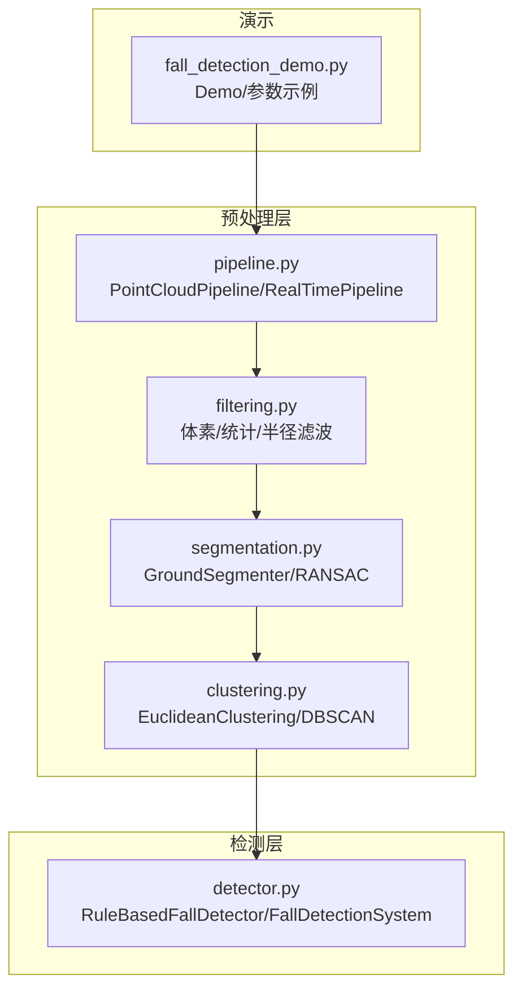
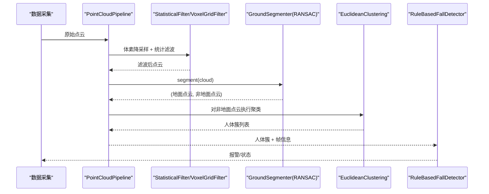
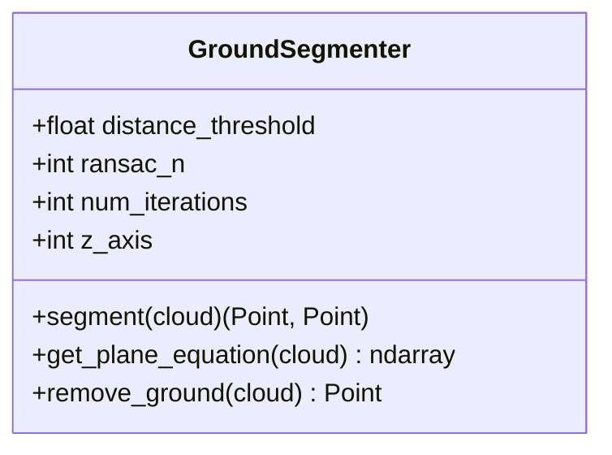
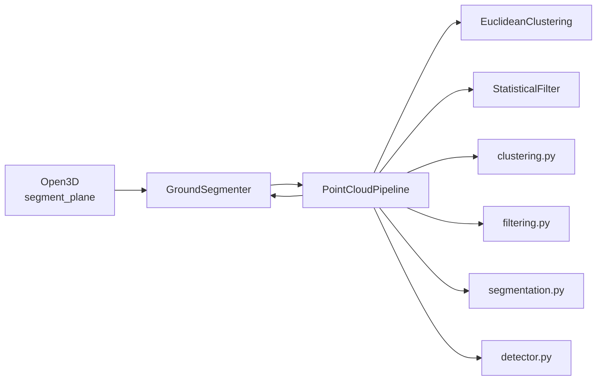

# 地面分割

<cite>
**本文引用的文件**
- [segmentation.py](file://src/preprocessing/segmentation.py)
- [pipeline.py](file://src/preprocessing/pipeline.py)
- [filtering.py](file://src/preprocessing/filtering.py)
- [clustering.py](file://src/preprocessing/clustering.py)
- [detector.py](file://src/detection/detector.py)
- [fall_detection_demo.py](file://demos/fall_detection_demo.py)
- [README.md](file://README.md)
</cite>

## 目录
1. [简介](#简介)
2. [项目结构](#项目结构)
3. [核心组件](#核心组件)
4. [架构总览](#架构总览)
5. [详细组件分析](#详细组件分析)
6. [依赖分析](#依赖分析)
7. [性能考量](#性能考量)
8. [故障排查指南](#故障排查指南)
9. [结论](#结论)
10. [附录](#附录)

## 简介
本文件面向“地面分割”模块，系统性阐述其理论基础、实现方法、参数配置、API 规范、典型用法、质量评估与后处理策略，并给出常见问题的诊断与解决建议。该模块基于 RANSAC 算法进行地面平面拟合，结合 Open3D 的点云处理能力，为后续人体聚类与摔倒检测提供高质量的非地面点云输入。

## 项目结构
与地面分割直接相关的核心文件如下：
- src/preprocessing/segmentation.py：地面分割器实现（RANSAC）、渐进形态学滤波器（PMF）以及工厂函数
- src/preprocessing/pipeline.py：点云预处理流水线，串联滤波、地面分割、聚类
- src/preprocessing/filtering.py：体素降采样、统计滤波、半径滤波
- src/preprocessing/clustering.py：人体聚类（欧式聚类、DBSCAN、多视角聚类）
- src/detection/detector.py：摔倒检测系统，调用预处理流水线并驱动规则引擎
- demos/fall_detection_demo.py：演示从数据采集到摔倒检测的完整流程，包含地面分割参数示例
- README.md：项目总体介绍与技术架构概览

图表来源
- [pipeline.py:65-178](file://src/preprocessing/pipeline.py#L65-L178)
- [segmentation.py:13-82](file://src/preprocessing/segmentation.py#L13-L82)
- [filtering.py:13-140](file://src/preprocessing/filtering.py#L13-L140)
- [clustering.py:99-182](file://src/preprocessing/clustering.py#L99-L182)
- [detector.py:75-283](file://src/detection/detector.py#L75-L283)
- [fall_detection_demo.py:92-179](file://demos/fall_detection_demo.py#L92-L179)

章节来源
- [README.md:61-86](file://README.md#L61-L86)

## 核心组件
- GroundSegmenter：基于 RANSAC 的地面分割器，提供 segment()、get_plane_equation()、remove_ground() 等接口
- ProgressiveMorphologicalFilter：渐进形态学滤波器（PMF），作为复杂地形的备选方案
- PointCloudPipeline：预处理流水线，串联滤波、地面分割、聚类
- FallDetectionSystem：摔倒检测系统，调用流水线并驱动规则引擎

章节来源
- [segmentation.py:13-137](file://src/preprocessing/segmentation.py#L13-L137)
- [segmentation.py:139-186](file://src/preprocessing/segmentation.py#L139-L186)
- [pipeline.py:65-178](file://src/preprocessing/pipeline.py#L65-L178)
- [detector.py:75-283](file://src/detection/detector.py#L75-L283)

## 架构总览
下图展示了从原始点云到最终摔倒检测的关键路径，重点突出地面分割在其中的位置与职责。

图表来源
- [pipeline.py:98-159](file://src/preprocessing/pipeline.py#L98-L159)
- [segmentation.py:41-81](file://src/preprocessing/segmentation.py#L41-L81)
- [filtering.py:28-49](file://src/preprocessing/filtering.py#L28-L49)
- [clustering.py:124-181](file://src/preprocessing/clustering.py#L124-L181)
- [detector.py:138-227](file://src/detection/detector.py#L138-L227)

## 详细组件分析

### GroundSegmenter：RANSAC 地面分割器
GroundSegmenter 使用 Open3D 的 RANSAC 平面拟合接口，通过 distance_threshold 控制点到平面的距离阈值，从而分离地面与非地面点；同时对拟合平面的法向量与垂直轴夹角进行合理性检查，避免将倾斜/不规则表面误判为“地面”。

关键点：
- segment() 返回地面点云与非地面点云
- get_plane_equation() 基于内点重新拟合平面（最小二乘法），并归一化为 ax+by+cz+d=0
- remove_ground() 直接返回非地面点云
- 参数：
  - distance_threshold：距离阈值（米）
  - ransac_n：RANSAC 采样点数
  - num_iterations：迭代次数
  - z_axis：垂直轴索引（Azure Kinect 坐标系下通常为 Y 轴）

图表来源
- [segmentation.py:13-137](file://src/preprocessing/segmentation.py#L13-L137)

章节来源
- [segmentation.py:16-40](file://src/preprocessing/segmentation.py#L16-L40)
- [segmentation.py:41-81](file://src/preprocessing/segmentation.py#L41-L81)
- [segmentation.py:83-123](file://src/preprocessing/segmentation.py#L83-L123)
- [segmentation.py:125-136](file://src/preprocessing/segmentation.py#L125-L136)

### ProgressiveMorphologicalFilter：渐进形态学滤波器
PMF 适用于地形起伏较大场景，但当前实现为简化版，退化为 RANSAC；建议在复杂地形优先使用 GroundSegmenter。

章节来源
- [segmentation.py:139-186](file://src/preprocessing/segmentation.py#L139-L186)

### PointCloudPipeline：预处理流水线
PointCloudPipeline 将滤波、地面分割、聚类串联起来，支持批量处理与实时模式（RealTimePipeline）。地面分割参数通过配置字典传入 GroundSegmenter。

章节来源
- [pipeline.py:65-178](file://src/preprocessing/pipeline.py#L65-L178)
- [pipeline.py:98-159](file://src/preprocessing/pipeline.py#L98-L159)

### API 参考：segment() 方法
- 方法签名：segment(cloud: o3d.geometry.PointCloud) -> Tuple[o3d.geometry.PointCloud, o3d.geometry.PointCloud]
- 输入：原始点云
- 输出：(地面点云, 非地面点云)
- 关键参数（来自构造函数）：
  - distance_threshold：点到平面的距离阈值（米）
  - ransac_n：RANSAC 采样点数
  - num_iterations：RANSAC 迭代次数
  - z_axis：垂直轴索引（坐标系定义）

章节来源
- [segmentation.py:41-81](file://src/preprocessing/segmentation.py#L41-L81)
- [segmentation.py:16-35](file://src/preprocessing/segmentation.py#L16-L35)

### 参数配置与影响机制
- distance_threshold（距离阈值）：
  - 影响地面点内点集合大小与拟合稳定性
  - 过小：可能误剔除地面点，导致地面不足
  - 过大：可能将非地面点误判为地面，导致地面过多
  - 建议：从 0.03~0.08m 范围内调试，结合具体传感器分辨率与场景
- ransac_n（采样点数）：
  - 通常为 3（平面拟合）
- num_iterations（迭代次数）：
  - 影响拟合稳定性和计算开销
  - 建议：50~200，根据点云密度与场景复杂度调整
- z_axis（垂直轴）：
  - Azure Kinect 下通常为 Y 轴（索引 1）
  - 若使用其他坐标系，需相应调整

章节来源
- [segmentation.py:16-40](file://src/preprocessing/segmentation.py#L16-L40)
- [segmentation.py:64-76](file://src/preprocessing/segmentation.py#L64-L76)

### 实际代码示例与用法
- 在 Demo 中演示了 distance_threshold=0.05 的配置方式，以及 GroundSegmenter 的基本使用
- 在流水线中通过配置字典传入 distance_threshold，确保各模块一致

章节来源
- [fall_detection_demo.py:110-120](file://demos/fall_detection_demo.py#L110-L120)
- [pipeline.py:78-93](file://src/preprocessing/pipeline.py#L78-L93)

### 质量评估与后处理
- 质量评估：
  - 比较地面点占比与非地面点占比，评估分割合理性
  - 检查拟合平面法向量与垂直轴夹角，避免将倾斜面误判为地面
  - 结合聚类结果验证人体簇是否集中在非地面区域
- 后处理：
  - remove_ground() 直接获取非地面点云，供聚类使用
  - get_plane_equation() 可用于进一步分析地面平面参数

章节来源
- [segmentation.py:77-81](file://src/preprocessing/segmentation.py#L77-L81)
- [segmentation.py:64-76](file://src/preprocessing/segmentation.py#L64-L76)
- [segmentation.py:125-136](file://src/preprocessing/segmentation.py#L125-L136)
- [segmentation.py:83-123](file://src/preprocessing/segmentation.py#L83-L123)

## 依赖分析
- GroundSegmenter 依赖 Open3D 的 segment_plane 接口进行 RANSAC 平面拟合
- PointCloudPipeline 依赖 GroundSegmenter、StatisticalFilter、EuclideanClustering
- FallDetectionSystem 依赖 PointCloudPipeline 与规则引擎

图表来源
- [segmentation.py:53-58](file://src/preprocessing/segmentation.py#L53-L58)
- [pipeline.py:86-93](file://src/preprocessing/pipeline.py#L86-L93)
- [clustering.py:136-141](file://src/preprocessing/clustering.py#L136-L141)
- [filtering.py:40-43](file://src/preprocessing/filtering.py#L40-L43)
- [detector.py:105-120](file://src/detection/detector.py#L105-L120)

## 性能考量
- RANSAC 迭代次数与点云规模呈线性关系，可通过体素降采样降低计算负担
- distance_threshold 过小会增加迭代次数与误判风险，过大则可能导致地面不足
- 建议在 Demo 中使用默认参数进行基准测试，再根据场景微调

章节来源
- [pipeline.py:141-159](file://src/preprocessing/pipeline.py#L141-L159)
- [filtering.py:112-139](file://src/preprocessing/filtering.py#L112-L139)
- [segmentation.py:16-40](file://src/preprocessing/segmentation.py#L16-L40)

## 故障排查指南
- 倾斜地面/不规则地面：
  - 现象：法向量与垂直轴夹角异常，地面点过少或过多
  - 处理：提高 distance_threshold 或切换到 PMF（简化实现退化为 RANSAC）
- 非地面点残留：
  - 现象：聚类后仍有大量非人体点
  - 处理：减小 distance_threshold，或在聚类阶段调整 cluster_tolerance
- 误判为地面：
  - 现象：障碍物被误判为地面
  - 处理：增大 distance_threshold，或引入更高阶的平面拟合与几何约束
- 坐标系不匹配：
  - 现象：z_axis 设置错误导致法向量判断异常
  - 处理：根据传感器坐标系调整 z_axis（Azure Kinect 下通常为 1）

章节来源
- [segmentation.py:64-76](file://src/preprocessing/segmentation.py#L64-L76)
- [segmentation.py:177-185](file://src/preprocessing/segmentation.py#L177-L185)
- [clustering.py:102-122](file://src/preprocessing/clustering.py#L102-L122)

## 结论
GroundSegmenter 通过 RANSAC 平面拟合实现了稳健的地面分割，配合合理的参数与后处理策略，能够有效支撑后续的人体聚类与摔倒检测。在复杂地形场景下，建议结合 PMF 或进一步优化参数，以提升鲁棒性与精度。

## 附录

### API 参考摘要
- GroundSegmenter.segment(cloud)
  - 输入：点云
  - 输出：(地面点云, 非地面点云)
- GroundSegmenter.get_plane_equation(cloud)
  - 输入：点云
  - 输出：平面参数 [a,b,c,d]
- GroundSegmenter.remove_ground(cloud)
  - 输入：点云
  - 输出：非地面点云

章节来源
- [segmentation.py:41-81](file://src/preprocessing/segmentation.py#L41-L81)
- [segmentation.py:83-123](file://src/preprocessing/segmentation.py#L83-L123)
- [segmentation.py:125-136](file://src/preprocessing/segmentation.py#L125-L136)

### 示例用法路径
- Demo 中的参数示例：[fall_detection_demo.py:110-120](file://demos/fall_detection_demo.py#L110-L120)
- 流水线中的参数传递：[pipeline.py:78-93](file://src/preprocessing/pipeline.py#L78-L93)