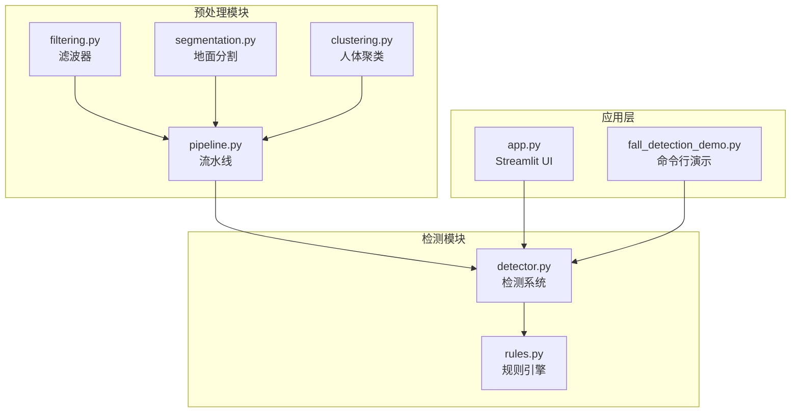
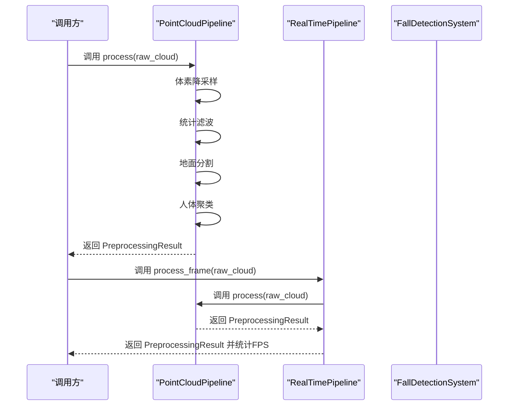
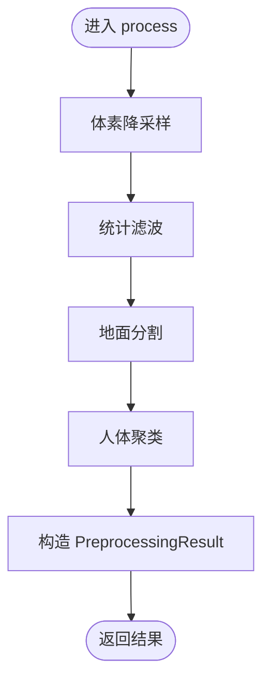
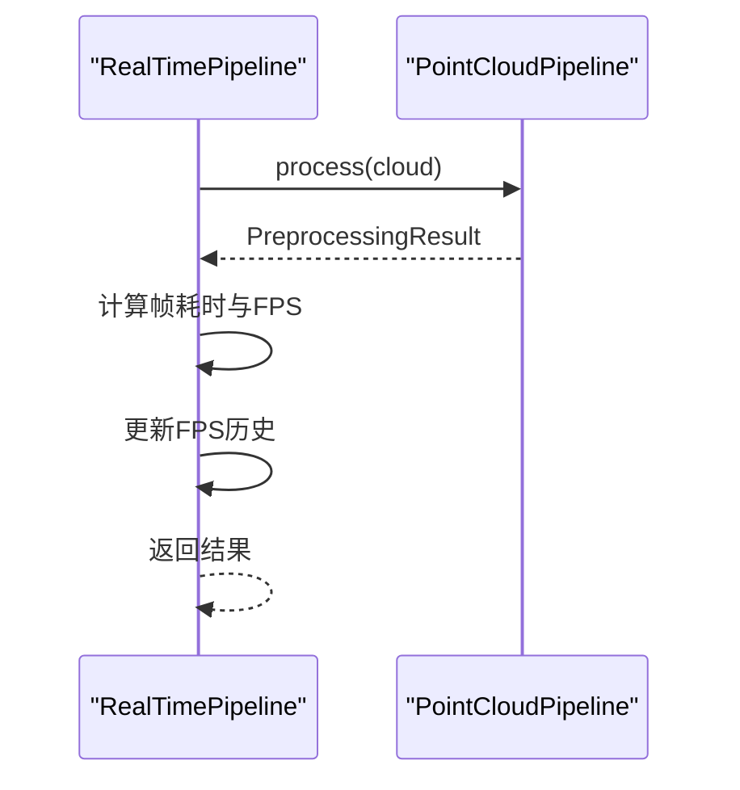
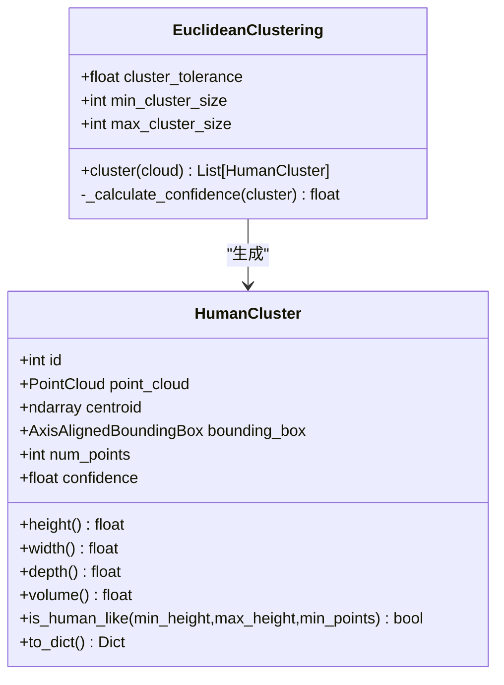
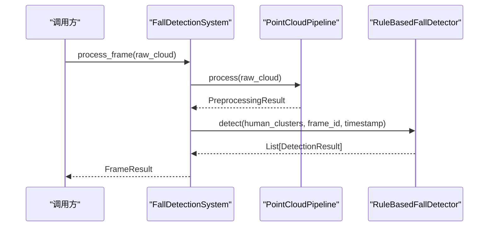
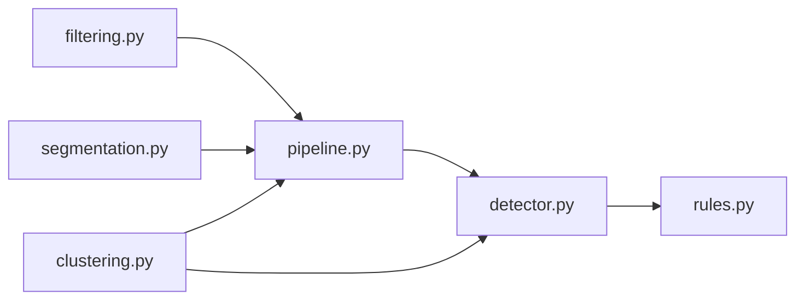

# 流水线架构

<cite>
**本文引用的文件**
- [pipeline.py](file://src/preprocessing/pipeline.py)
- [clustering.py](file://src/preprocessing/clustering.py)
- [filtering.py](file://src/preprocessing/filtering.py)
- [segmentation.py](file://src/preprocessing/segmentation.py)
- [detector.py](file://src/detection/detector.py)
- [rules.py](file://src/detection/rules.py)
- [app.py](file://app.py)
- [fall_detection_demo.py](file://demos/fall_detection_demo.py)
- [requirements.txt](file://requirements.txt)
- [README.md](file://README.md)
</cite>

## 目录
1. [简介](#简介)
2. [项目结构](#项目结构)
3. [核心组件](#核心组件)
4. [架构总览](#架构总览)
5. [详细组件分析](#详细组件分析)
6. [依赖关系分析](#依赖关系分析)
7. [性能考虑](#性能考虑)
8. [故障排查指南](#故障排查指南)
9. [结论](#结论)
10. [附录](#附录)

## 简介
本文件面向“点云预处理流水线”的架构文档，重点阐述两种流水线模式：标准流水线与实时流水线的设计理念与适用场景；详细说明四个处理步骤（体素降采样、统计滤波、地面分割、人体聚类）的执行顺序与相互关系；提供完整的 API 参考（process、process_batch、process_frame 等）；展示实际使用示例路径；解释预处理结果数据结构 PreprocessingResult 的设计思路与字段含义；给出性能优化建议与错误处理方案。

## 项目结构
该系统围绕“点云预处理”和“摔倒检测”两大模块组织，其中预处理模块位于 src/preprocessing，检测模块位于 src/detection，UI 与演示位于 app.py 与 demos/fall_detection_demo.py，依赖通过 requirements.txt 管理。

**图表来源**
- [pipeline.py:65-178](file://src/preprocessing/pipeline.py#L65-L178)
- [filtering.py:13-164](file://src/preprocessing/filtering.py#L13-L164)
- [segmentation.py:13-204](file://src/preprocessing/segmentation.py#L13-L204)
- [clustering.py:99-181](file://src/preprocessing/clustering.py#L99-L181)
- [detector.py:75-282](file://src/detection/detector.py#L75-L282)
- [rules.py:226-422](file://src/detection/rules.py#L226-L422)
- [app.py:105-131](file://app.py#L105-L131)
- [fall_detection_demo.py:110-120](file://demos/fall_detection_demo.py#L110-L120)

**章节来源**
- [README.md:100-147](file://README.md#L100-L147)
- [requirements.txt:1-34](file://requirements.txt#L1-L34)

## 核心组件
- 预处理流水线
  - 标准流水线：PointCloudPipeline，负责四步处理与批量处理。
  - 实时流水线：RealTimePipeline，在标准流水线上增加帧率统计与重置能力。
- 预处理步骤
  - 体素降采样：VoxelGridFilter
  - 统计滤波：StatisticalFilter
  - 地面分割：GroundSegmenter
  - 人体聚类：EuclideanClustering
- 结果数据结构
  - PreprocessingResult：封装原始点数、滤波后点数、地面/非地面点数、人体簇列表、处理耗时等。
- 检测系统
  - FallDetectionSystem：整合预处理与规则检测，提供 process_frame/process_continuous 等接口。
  - RuleBasedFallDetector：基于规则的状态机检测器。

**章节来源**
- [pipeline.py:24-178](file://src/preprocessing/pipeline.py#L24-L178)
- [filtering.py:13-164](file://src/preprocessing/filtering.py#L13-L164)
- [segmentation.py:13-204](file://src/preprocessing/segmentation.py#L13-L204)
- [clustering.py:15-181](file://src/preprocessing/clustering.py#L15-L181)
- [detector.py:75-282](file://src/detection/detector.py#L75-L282)
- [rules.py:226-422](file://src/detection/rules.py#L226-L422)

## 架构总览
标准流水线与实时流水线共享相同的四步处理链路，区别在于实时流水线额外统计帧率并提供重置能力。检测系统在预处理之后接入规则引擎，形成“预处理 + 检测”的完整链路。

**图表来源**
- [pipeline.py:98-139](file://src/preprocessing/pipeline.py#L98-L139)
- [pipeline.py:199-235](file://src/preprocessing/pipeline.py#L199-L235)
- [detector.py:138-227](file://src/detection/detector.py#L138-L227)

## 详细组件分析

### 预处理流水线（PointCloudPipeline）
- 设计理念
  - 将点云处理拆分为四个步骤，便于参数化与模块化，便于在不同场景下灵活组合。
  - 支持批量处理，适合离线分析与数据集评估。
- 处理步骤
  - 体素降采样：降低点云密度，提升后续处理速度。
  - 统计滤波：去除离群点，提高鲁棒性。
  - 地面分割：分离地面与非地面点，聚焦人体区域。
  - 人体聚类：基于 DBSCAN 的欧式聚类，提取人体簇并计算几何特征。
- 关键 API
  - process(raw_cloud)：完整流程入口，返回 PreprocessingResult。
  - process_batch(clouds)：批量处理，逐帧调用 process。
- 参数配置
  - 通过构造函数注入配置字典，支持 voxel_size、std_ratio、distance_threshold、cluster_tolerance、min_cluster_size、max_cluster_size 等。

**图表来源**
- [pipeline.py:98-139](file://src/preprocessing/pipeline.py#L98-L139)

**章节来源**
- [pipeline.py:65-178](file://src/preprocessing/pipeline.py#L65-L178)

### 实时流水线（RealTimePipeline）
- 设计理念
  - 针对连续帧流优化，内置帧率统计与重置能力，便于在线监控与调试。
- 关键 API
  - process_frame(cloud)：处理单帧，记录处理时间并更新 FPS 历史。
  - get_average_fps()：获取最近若干帧的平均 FPS。
  - reset()：重置内部统计与状态。
- 性能监控
  - 维护最近 30 帧的 FPS 历史，避免内存膨胀。

**图表来源**
- [pipeline.py:199-235](file://src/preprocessing/pipeline.py#L199-L235)

**章节来源**
- [pipeline.py:180-248](file://src/preprocessing/pipeline.py#L180-L248)

### 预处理步骤详解

#### 体素降采样（VoxelGridFilter）
- 作用：按体素大小聚合点云，显著降低点数，提升后续处理速度。
- 关键参数：leaf_size（体素边长，单位米）。
- 返回：降采样后的点云。

**章节来源**
- [filtering.py:109-139](file://src/preprocessing/filtering.py#L109-L139)

#### 统计滤波（StatisticalFilter）
- 作用：基于邻域统计剔除离群点，增强鲁棒性。
- 关键参数：nb_neighbors（邻域点数）、std_ratio（标准差倍数）。
- 返回：滤波后的点云。

**章节来源**
- [filtering.py:13-49](file://src/preprocessing/filtering.py#L13-L49)

#### 地面分割（GroundSegmenter）
- 作用：使用 RANSAC 平面拟合分离地面与非地面点。
- 关键参数：distance_threshold（距离阈值）、ransac_n（采样点数）、num_iterations（迭代次数）、z_axis（垂直轴索引）。
- 返回：(地面点云, 非地面点云)。

**章节来源**
- [segmentation.py:13-81](file://src/preprocessing/segmentation.py#L13-L81)

#### 人体聚类（EuclideanClustering）
- 作用：对非地面点进行 DBSCAN 聚类，提取人体簇。
- 关键参数：cluster_tolerance（簇内最大距离）、min_cluster_size、max_cluster_size。
- 返回：List[HumanCluster]。
- HumanCluster 字段：id、point_cloud、centroid、bounding_box、num_points、confidence。
- HumanCluster 方法：height/width/depth/volume、is_human_like()、to_dict()。

**图表来源**
- [clustering.py:15-181](file://src/preprocessing/clustering.py#L15-L181)

**章节来源**
- [clustering.py:99-181](file://src/preprocessing/clustering.py#L99-L181)

### 预处理结果数据结构（PreprocessingResult）
- 字段
  - original_points：原始点数
  - filtered_points：滤波后点数
  - ground_points：地面点数
  - non_ground_points：非地面点数
  - human_clusters：人体簇列表
  - processing_time_ms：处理耗时（毫秒）
- 属性
  - num_humans：检测到的人数
  - has_humans：是否存在人体
- 方法
  - to_dict()：序列化为字典
  - __str__()：人类可读字符串

**章节来源**
- [pipeline.py:24-62](file://src/preprocessing/pipeline.py#L24-L62)

### 检测系统（FallDetectionSystem）
- 设计理念
  - 将预处理与规则检测串联，提供连续处理接口与统计信息。
- 关键 API
  - process_frame(raw_cloud, frame_id)：处理单帧，返回 FrameResult。
  - process_continuous(cloud_generator, max_frames)：持续处理点云流。
  - get_statistics()：获取系统统计信息（含平均 FPS、活跃追踪器等）。
  - reset()：重置系统状态。
- 结果数据结构（FrameResult）
  - 包含 preprocessing（PreprocessingResult）、detections（DetectionResult 列表）、alerts（报警列表）、processing_time_ms 等。

**图表来源**
- [detector.py:138-227](file://src/detection/detector.py#L138-L227)
- [rules.py:266-337](file://src/detection/rules.py#L266-L337)

**章节来源**
- [detector.py:75-282](file://src/detection/detector.py#L75-L282)
- [rules.py:226-422](file://src/detection/rules.py#L226-L422)

## 依赖关系分析
- 内部依赖
  - pipeline.py 依赖 filtering.py、segmentation.py、clustering.py。
  - detector.py 依赖 pipeline.py、clustering.py、rules.py。
  - rules.py 依赖 clustering.py。
- 外部依赖
  - numpy、open3d、loguru 等通过 requirements.txt 管理。

**图表来源**
- [pipeline.py:19-21](file://src/preprocessing/pipeline.py#L19-L21)
- [detector.py:20-22](file://src/detection/detector.py#L20-L22)

**章节来源**
- [requirements.txt:1-34](file://requirements.txt#L1-L34)

## 性能考虑
- 批量处理策略
  - 使用 process_batch 对多帧进行批处理，减少重复初始化开销。
  - 在离线场景中，优先选择标准流水线并结合多进程/多线程加速（需自行扩展）。
- 实时处理优化
  - 使用 RealTimePipeline 的 process_frame，自动统计 FPS 并限制历史长度，避免内存增长。
  - 合理设置体素尺寸与聚类容忍度，平衡精度与速度。
- 性能监控
  - 通过 get_average_fps() 与 get_statistics() 获取系统平均 FPS 与活跃追踪器数量。
  - 在 UI 中展示 FPS 趋势与处理时间，辅助调参。
- 算法参数建议
  - 体素尺寸：根据场景与硬件性能调整，通常 0.03~0.08m。
  - 统计滤波：std_ratio 一般 1.5~3.0。
  - 地面分割：distance_threshold 一般 0.03~0.08m。
  - 聚类容忍度：0.05~0.2m，min/max_cluster_size 根据人体密度调整。

[本节为通用性能指导，不直接分析具体文件]

## 故障排查指南
- 常见问题与处理
  - 体素降采样后点数过少：增大 leaf_size 或在统计滤波前先做半径滤波。
  - 地面分割失败：检查 distance_threshold 是否过大；必要时切换到 ProgressiveMorphologicalFilter（简化实现）。
  - 聚类结果为空：检查 min_cluster_size 是否过大；适当降低 cluster_tolerance。
  - 报警回调异常：在 FallDetectionSystem 中已捕获并记录异常，不影响主流程。
- 日志与调试
  - 使用 loguru 输出详细日志，定位各步骤耗时与中间结果。
  - 在 UI 中查看最近报警与处理时间，辅助定位异常帧。
- 示例路径
  - 标准流水线测试：[pipeline.py:271-336](file://src/preprocessing/pipeline.py#L271-L336)
  - 实时流水线测试：[pipeline.py:199-235](file://src/preprocessing/pipeline.py#L199-L235)
  - 检测系统测试：[detector.py:302-372](file://src/detection/detector.py#L302-L372)
  - 规则引擎测试：[rules.py:448-525](file://src/detection/rules.py#L448-L525)

**章节来源**
- [pipeline.py:199-235](file://src/preprocessing/pipeline.py#L199-L235)
- [detector.py:186-191](file://src/detection/detector.py#L186-L191)

## 结论
该流水线以模块化设计实现了从原始点云到人体簇的完整预处理链路，标准与实时两种模式分别适配离线与在线场景。通过清晰的 API 与结果数据结构，开发者可以轻松构建自定义预处理流程并进行参数调优。配合规则检测器与 UI 可视化，系统具备良好的可扩展性与可维护性。

[本节为总结性内容，不直接分析具体文件]

## 附录

### API 参考（预处理流水线）
- PointCloudPipeline
  - 构造：PointCloudPipeline(config)
  - 方法：
    - process(raw_cloud) → PreprocessingResult
    - process_batch(clouds) → List[PreprocessingResult]
- RealTimePipeline
  - 构造：RealTimePipeline(config)
  - 方法：
    - process_frame(raw_cloud) → PreprocessingResult
    - get_average_fps() → float
    - reset() → void
- PreprocessingResult
  - 字段：original_points, filtered_points, ground_points, non_ground_points, human_clusters, processing_time_ms
  - 属性：num_humans, has_humans
  - 方法：to_dict(), __str__()

**章节来源**
- [pipeline.py:65-178](file://src/preprocessing/pipeline.py#L65-L178)
- [pipeline.py:180-248](file://src/preprocessing/pipeline.py#L180-L248)
- [pipeline.py:24-62](file://src/preprocessing/pipeline.py#L24-L62)

### API 参考（检测系统）
- FallDetectionSystem
  - 构造：FallDetectionSystem(...)
  - 方法：
    - process_frame(raw_cloud, frame_id) → FrameResult
    - process_continuous(cloud_generator, max_frames) → Generator[FrameResult]
    - get_statistics() → Dict
    - reset() → void
- RuleBasedFallDetector
  - 构造：RuleBasedFallDetector(...)
  - 方法：
    - detect(clusters, frame_id, timestamp) → List[DetectionResult]
    - get_statistics() → Dict
    - reset() → void

**章节来源**
- [detector.py:75-282](file://src/detection/detector.py#L75-L282)
- [rules.py:226-422](file://src/detection/rules.py#L226-L422)

### 实际使用示例（路径）
- 标准流水线示例
  - [pipeline.py:295-304](file://src/preprocessing/pipeline.py#L295-L304)
- 实时流水线示例
  - [pipeline.py:199-235](file://src/preprocessing/pipeline.py#L199-L235)
- 检测系统示例
  - [detector.py:138-227](file://src/detection/detector.py#L138-L227)
  - [fall_detection_demo.py:110-120](file://demos/fall_detection_demo.py#L110-L120)
- UI 集成示例
  - [app.py:105-131](file://app.py#L105-L131)

**章节来源**
- [fall_detection_demo.py:92-179](file://demos/fall_detection_demo.py#L92-L179)
- [app.py:105-131](file://app.py#L105-L131)