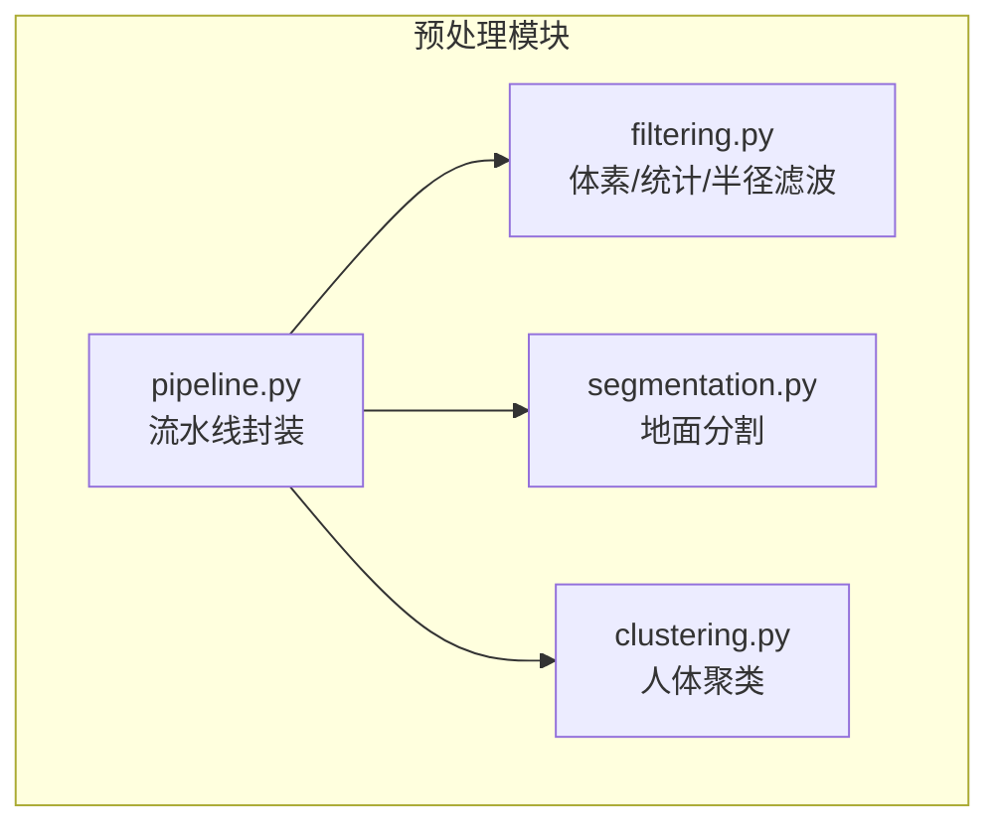
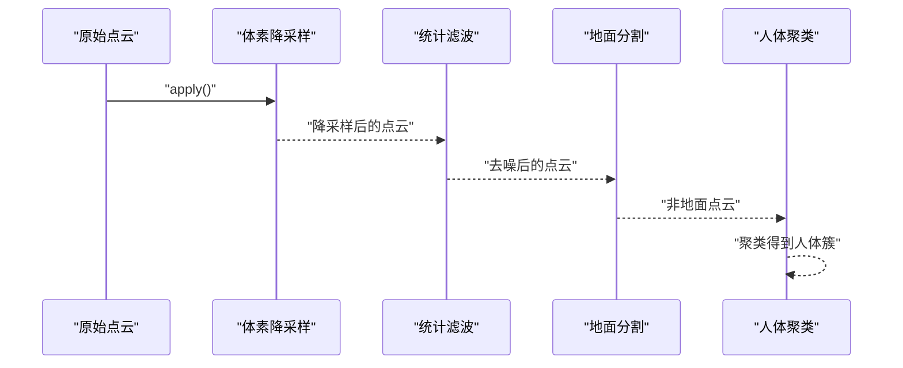
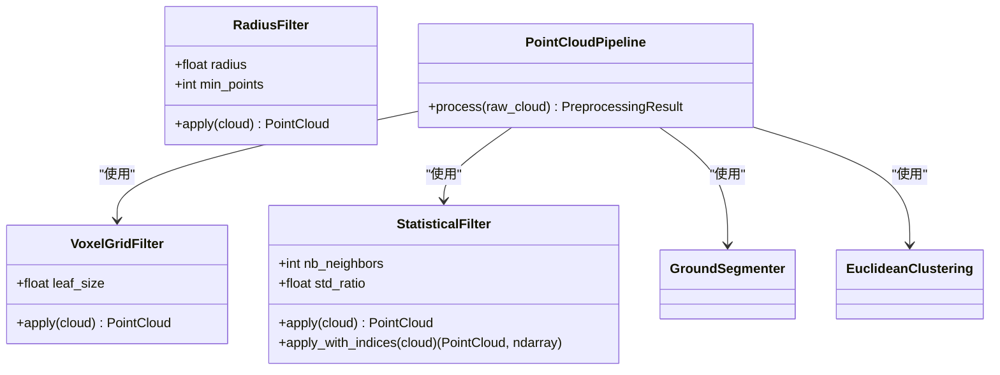

# 滤波算法

<cite>
**本文引用的文件**
- [filtering.py](file://src/preprocessing/filtering.py)
- [pipeline.py](file://src/preprocessing/pipeline.py)
- [segmentation.py](file://src/preprocessing/segmentation.py)
- [clustering.py](file://src/preprocessing/clustering.py)
- [fall_detection_demo.py](file://demos/fall_detection_demo.py)
- [CODE_GENERATION_PLAN.md](file://CODE_GENERATION_PLAN.md)
</cite>

## 目录
1. [简介](#简介)
2. [项目结构](#项目结构)
3. [核心组件](#核心组件)
4. [架构总览](#架构总览)
5. [详细组件分析](#详细组件分析)
6. [依赖分析](#依赖分析)
7. [性能考量](#性能考量)
8. [故障排查指南](#故障排查指南)
9. [结论](#结论)
10. [附录](#附录)

## 简介
本文件聚焦于点云预处理中的“滤波算法”模块，系统性阐述三种主流滤波策略：体素网格降采样、统计离群点滤波、半径离群点滤波。内容涵盖：
- 数学原理与实现思路
- 关键参数的作用机制与典型取值
- 完整 API 参考（含 apply() 与工厂函数）
- 实战示例与参数调优建议
- 对点云质量与处理性能的影响及常见问题

## 项目结构
滤波算法位于预处理子模块中，与地面分割、聚类等模块协同工作，构成完整的点云预处理流水线。

图示来源
- [filtering.py:13-188](file://src/preprocessing/filtering.py#L13-L188)
- [segmentation.py:13-200](file://src/preprocessing/segmentation.py#L13-L200)
- [clustering.py:99-200](file://src/preprocessing/clustering.py#L99-L200)
- [pipeline.py:65-178](file://src/preprocessing/pipeline.py#L65-L178)

章节来源
- [filtering.py:1-188](file://src/preprocessing/filtering.py#L1-L188)
- [pipeline.py:1-178](file://src/preprocessing/pipeline.py#L1-L178)

## 核心组件
- 体素网格降采样滤波器：通过规则化空间划分进行降采样，显著减少点数，提升后续处理效率。
- 统计离群点滤波器：基于局部均值与标准差的统计检验，剔除离群点，改善噪声。
- 半径离群点滤波器：基于固定半径内邻域点数阈值，剔除孤立或稀疏区域的点。

章节来源
- [filtering.py:13-188](file://src/preprocessing/filtering.py#L13-L188)

## 架构总览
滤波算法在整体流水线中的位置如下：

图示来源
- [pipeline.py:98-159](file://src/preprocessing/pipeline.py#L98-L159)
- [filtering.py:109-139](file://src/preprocessing/filtering.py#L109-L139)

章节来源
- [pipeline.py:65-178](file://src/preprocessing/pipeline.py#L65-L178)

## 详细组件分析

### 体素网格降采样滤波器（VoxelGridFilter）
- 功能：按给定体素大小对三维空间进行网格化，每个格子仅保留一个代表性点，从而大幅降低点数。
- 关键参数
  - leaf_size：体素边长（米）。leaf_size 越大，降采样越激进，点数越少，处理更快但细节损失越大。
- 返回值
  - 返回降采样后的点云；内部会记录保留比例，便于性能评估。
- 典型应用场景
  - 高分辨率点云预处理、实时性要求较高场景、作为后续滤波/分割的前置步骤。

章节来源
- [filtering.py:109-139](file://src/preprocessing/filtering.py#L109-L139)

### 统计离群点滤波器（StatisticalFilter）
- 功能：对每个点计算其在邻域内的距离均值与标准差，若该点到中心的距离超过均值加若干倍标准差，则视为离群点剔除。
- 关键参数
  - nb_neighbors：邻域点数。邻域越大，统计越稳定，但计算成本越高；邻域过小易误判。
  - std_ratio：标准差倍数。std_ratio 越大，越保守，剔除更多离群点；过小则过滤不彻底。
- 返回值
  - 返回去噪后的点云；同时提供带索引的版本，便于追踪保留点。
- 典型应用场景
  - 去除传感器噪声、结构光/ToF等设备引入的离群点；与体素降采样配合，先降采样再去噪。

章节来源
- [filtering.py:13-67](file://src/preprocessing/filtering.py#L13-L67)

### 半径离群点滤波器（RadiusFilter）
- 功能：以每个点为中心，设定搜索半径与最小邻域点数，若某点在其半径内邻域点数不足，则认为该点处于稀疏区域，将其剔除。
- 关键参数
  - radius：搜索半径（米）。radius 越大，考虑范围越广；过大可能把正常点也误判为离群。
  - min_points：最小邻域点数。min_points 越大，越严格，越容易剔除稀疏点。
- 返回值
  - 返回去噪后的点云；适合去除孤立噪声或异常分布区域。
- 典型应用场景
  - 去除极端稀疏区域噪声、处理遮挡或反射异常导致的孤立点。

章节来源
- [filtering.py:70-106](file://src/preprocessing/filtering.py#L70-L106)

### 工厂函数与 API 参考
- 工厂函数
  - create_filter(filter_type, **kwargs)：根据类型创建对应滤波器实例。
  - 支持类型：'statistical'、'radius'、'voxel'。
- StatisticalFilter
  - apply(cloud)：返回去噪后的点云。
  - apply_with_indices(cloud)：返回去噪后的点云与保留点索引数组。
- RadiusFilter
  - apply(cloud)：返回去噪后的点云。
- VoxelGridFilter
  - apply(cloud)：返回降采样后的点云。
- 流水线集成
  - PointCloudPipeline：在流水线中顺序执行体素降采样、统计滤波、地面分割、聚类。
  - RealTimePipeline：面向连续帧的实时优化版本，包含 FPS 统计。

章节来源
- [filtering.py:142-164](file://src/preprocessing/filtering.py#L142-L164)
- [pipeline.py:65-178](file://src/preprocessing/pipeline.py#L65-L178)

### 代码示例与使用场景
- 示例一：统计滤波 + 体素降采样
  - 参考路径：[filtering.py:167-188](file://src/preprocessing/filtering.py#L167-L188)
- 示例二：流水线处理（含滤波）
  - 参考路径：[pipeline.py:270-337](file://src/preprocessing/pipeline.py#L270-L337)
- 示例三：Demo 中的参数配置
  - 参考路径：[fall_detection_demo.py:110-120](file://demos/fall_detection_demo.py#L110-L120)

章节来源
- [filtering.py:167-188](file://src/preprocessing/filtering.py#L167-L188)
- [pipeline.py:270-337](file://src/preprocessing/pipeline.py#L270-L337)
- [fall_detection_demo.py:110-120](file://demos/fall_detection_demo.py#L110-L120)

## 依赖分析
- 组件耦合
  - StatisticalFilter/RadialFilter/VoxelGridFilter 之间无直接依赖，均依赖 Open3D 的点云接口。
  - PointCloudPipeline 将三类滤波器与地面分割、聚类串联，形成端到端流水线。
- 外部依赖
  - Open3D：提供 remove_statistical_outlier、remove_radius_outlier、voxel_down_sample、cluster_dbscan 等底层能力。
  - 日志：使用 loguru 记录处理过程与性能信息。

图示来源
- [filtering.py:13-188](file://src/preprocessing/filtering.py#L13-L188)
- [pipeline.py:65-178](file://src/preprocessing/pipeline.py#L65-L178)
- [segmentation.py:13-200](file://src/preprocessing/segmentation.py#L13-L200)
- [clustering.py:99-200](file://src/preprocessing/clustering.py#L99-L200)

章节来源
- [filtering.py:13-188](file://src/preprocessing/filtering.py#L13-L188)
- [pipeline.py:65-178](file://src/preprocessing/pipeline.py#L65-L178)

## 性能考量
- 体素降采样
  - 显著降低点数，提升后续处理速度；leaf_size 增大，加速明显但细节损失增大。
- 统计滤波
  - 计算复杂度与邻域大小 nb_neighbors 成正比；std_ratio 增大，剔除更多点，噪声更干净但可能误删边界点。
- 半径滤波
  - 与半径 radius 和最小邻域点数 min_points 相关；半径过大可能误伤正常点，过小则效果有限。
- 流水线优化
  - RealTimePipeline 提供帧率统计与平均 FPS 计算，便于在实时场景中评估性能。

章节来源
- [pipeline.py:180-248](file://src/preprocessing/pipeline.py#L180-L248)

## 故障排查指南
- 症状：滤波后点数过少
  - 可能原因：参数设置过于激进（如 leaf_size 过大、std_ratio 过大、min_points 过大、radius 过小）。
  - 建议：逐步减小阈值或增大半径，观察保留比例与质量。
- 症状：离群点未被有效剔除
  - 可能原因：邻域过小或 std_ratio 过小；半径过小或 min_points 设置过高。
  - 建议：增大 nb_neighbors/std_ratio 或增大 radius/min_points。
- 症状：处理时间过长
  - 可能原因：点数过多、邻域过大、半径过小导致大量邻域查询。
  - 建议：先进行体素降采样，适当降低邻域大小或半径。
- 症状：边界细节丢失
  - 可能原因：leaf_size 过大或 std_ratio 过大。
  - 建议：适度增大 leaf_size，或在必要时跳过统计滤波以保留边界。

章节来源
- [filtering.py:13-188](file://src/preprocessing/filtering.py#L13-L188)
- [pipeline.py:180-248](file://src/preprocessing/pipeline.py#L180-L248)

## 结论
- 体素降采样是提升处理效率的关键一步；统计与半径滤波分别从统计稳定性与局部密度两个角度去噪。
- 参数调优应结合具体场景：噪声多选统计滤波，稀疏噪声选半径滤波，实时性优先选较大 leaf_size。
- 在流水线中，先降采样再去噪，有助于兼顾质量与性能。

## 附录

### 参数配置与最佳实践
- 体素大小（leaf_size）
  - 建议范围：0.02~0.1m；高频场景可选 0.05~0.1m。
- 统计滤波（nb_neighbors, std_ratio）
  - 建议范围：nb_neighbors 10~50；std_ratio 1.5~3.0。
- 半径滤波（radius, min_points）
  - 建议范围：radius 0.05~0.2m；min_points 3~10。
- 参考配置示例
  - 参考路径：[fall_detection_demo.py:110-120](file://demos/fall_detection_demo.py#L110-L120)

章节来源
- [fall_detection_demo.py:110-120](file://demos/fall_detection_demo.py#L110-L120)

### API 参考摘要
- create_filter(filter_type, **kwargs)
  - 返回对应滤波器实例；支持类型：'statistical'、'radius'、'voxel'。
- StatisticalFilter.apply(cloud)
  - 返回去噪后的点云。
- StatisticalFilter.apply_with_indices(cloud)
  - 返回去噪后的点云与保留点索引数组。
- RadiusFilter.apply(cloud)
  - 返回去噪后的点云。
- VoxelGridFilter.apply(cloud)
  - 返回降采样后的点云。
- PointCloudPipeline.process(raw_cloud)
  - 返回包含原始点数、滤波后点数、地面/非地面点数、人体簇列表与处理时间的结果对象。

章节来源
- [filtering.py:142-164](file://src/preprocessing/filtering.py#L142-L164)
- [pipeline.py:98-159](file://src/preprocessing/pipeline.py#L98-L159)