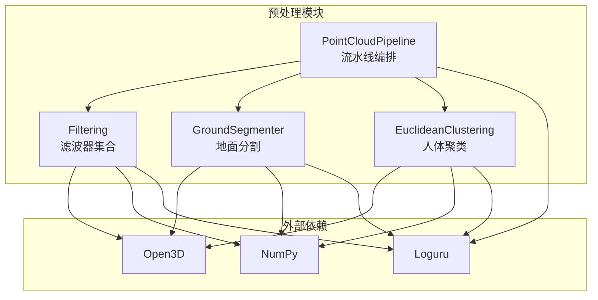
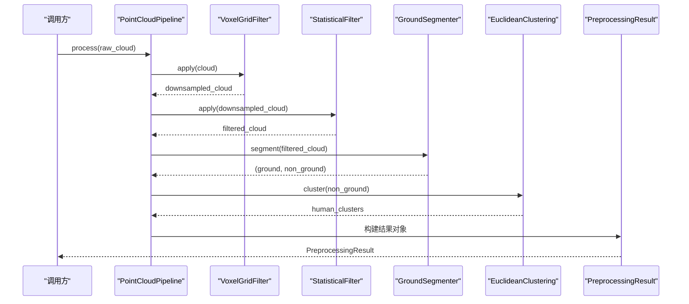
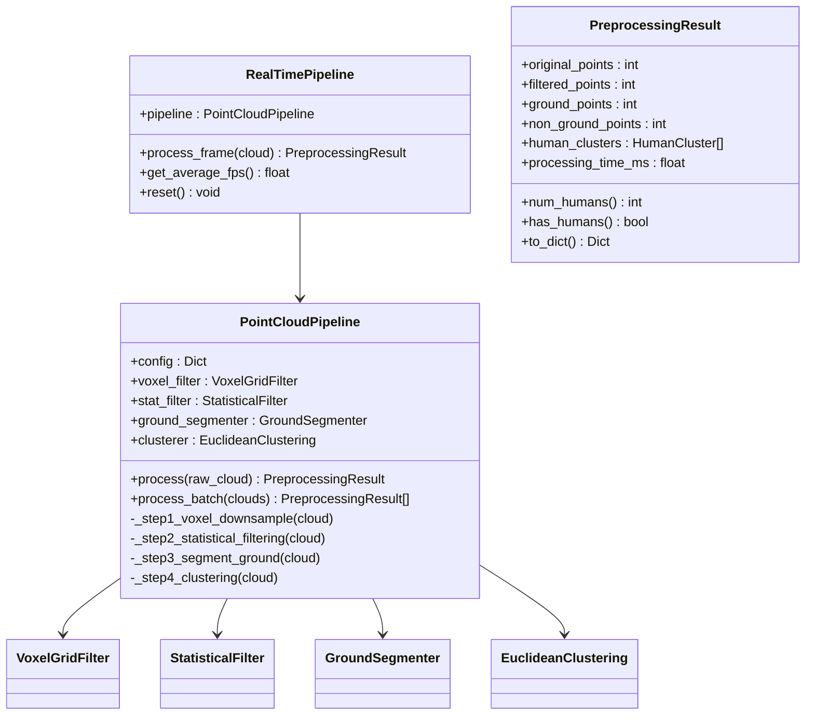
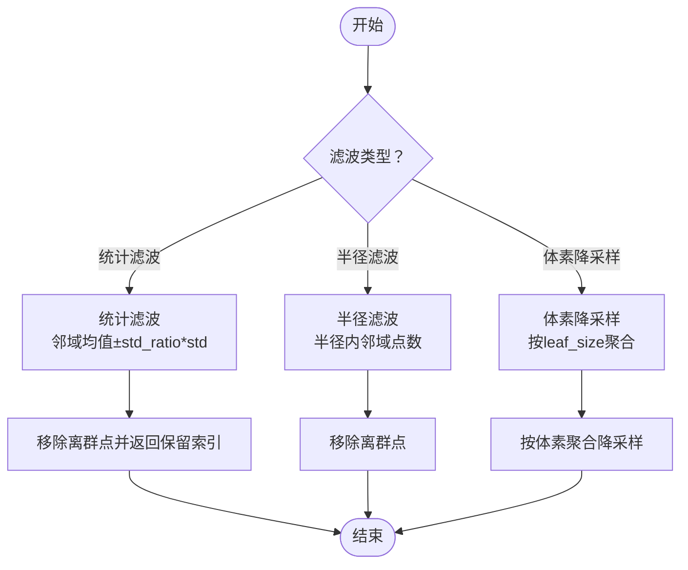
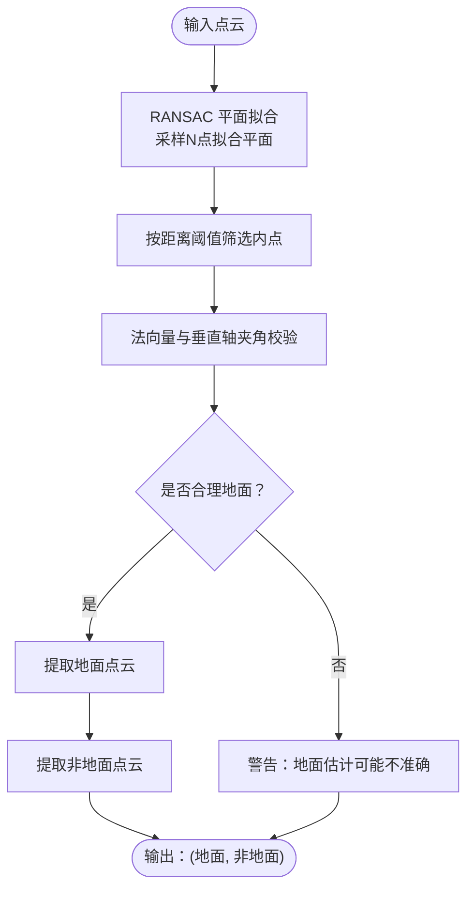
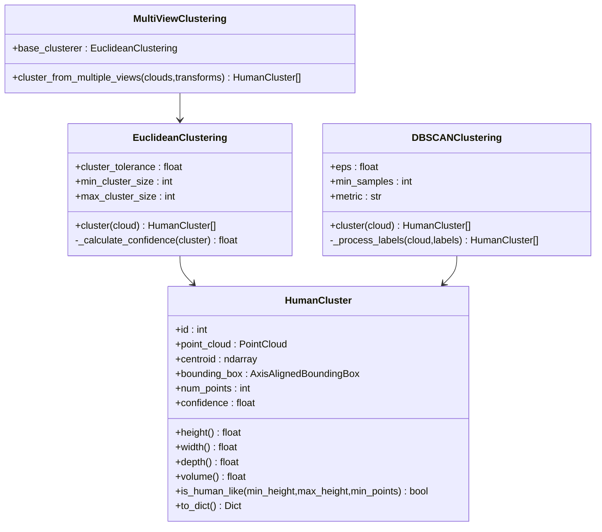
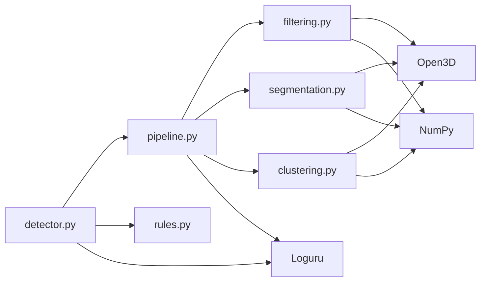

# 点云预处理模块

<cite>
**本文档引用的文件**
- [pipeline.py](file://src/preprocessing/pipeline.py)
- [filtering.py](file://src/preprocessing/filtering.py)
- [clustering.py](file://src/preprocessing/clustering.py)
- [segmentation.py](file://src/preprocessing/segmentation.py)
- [detector.py](file://src/detection/detector.py)
- [rules.py](file://src/detection/rules.py)
- [app.py](file://app.py)
- [requirements.txt](file://requirements.txt)
- [README.md](file://README.md)
- [docs/README.md](file://docs/README.md)
</cite>

## 目录
1. [简介](#简介)
2. [项目结构](#项目结构)
3. [核心组件](#核心组件)
4. [架构总览](#架构总览)
5. [详细组件分析](#详细组件分析)
6. [依赖关系分析](#依赖关系分析)
7. [性能考量](#性能考量)
8. [故障排查指南](#故障排查指南)
9. [结论](#结论)
10. [附录](#附录)

## 简介
本文件面向点云预处理模块，系统化阐述从原始点云到人体簇的完整处理流水线，涵盖滤波去噪、地面分割、人体聚类与结果封装，并给出参数调优策略、性能优化建议、错误处理与调试指导。该模块是摔倒检测系统的核心前置环节，为后续规则引擎提供高质量的人体簇输入。

## 项目结构
点云预处理模块位于 src/preprocessing 目录，包含四个核心子模块：
- pipeline.py：预处理流水线入口，编排滤波、地面分割与聚类
- filtering.py：提供统计滤波、半径滤波、体素降采样等滤波器
- segmentation.py：基于 RANSAC 的地面分割与渐进形态学滤波
- clustering.py：人体簇数据结构与多种聚类算法（欧式聚类、DBSCAN、多视角融合）

**图表来源**
- [pipeline.py:65-178](file://src/preprocessing/pipeline.py#L65-L178)
- [filtering.py:13-139](file://src/preprocessing/filtering.py#L13-L139)
- [segmentation.py:13-136](file://src/preprocessing/segmentation.py#L13-L136)
- [clustering.py:99-181](file://src/preprocessing/clustering.py#L99-L181)

**章节来源**
- [pipeline.py:1-337](file://src/preprocessing/pipeline.py#L1-L337)
- [filtering.py:1-189](file://src/preprocessing/filtering.py#L1-L189)
- [segmentation.py:1-243](file://src/preprocessing/segmentation.py#L1-L243)
- [clustering.py:1-495](file://src/preprocessing/clustering.py#L1-L495)

## 核心组件
- 预处理流水线（PointCloudPipeline）：统一编排体素降采样、统计滤波、地面分割、人体聚类四步，输出标准化结果对象
- 滤波器集合：StatisticalFilter、RadiusFilter、VoxelGridFilter，分别用于离群点剔除、密度异常点过滤、降采样
- 地面分割器：GroundSegmenter 基于 RANSAC，ProgressiveMorphologicalFilter 提供地形复杂场景的简化方案
- 聚类器：EuclideanClustering（DBSCAN 实现）、DBSCANClustering（Open3D 或 sklearn）、MultiViewClustering（多视角融合）
- 结果封装：PreprocessingResult、HumanCluster 数据结构，便于后续检测与可视化

**章节来源**
- [pipeline.py:24-178](file://src/preprocessing/pipeline.py#L24-L178)
- [filtering.py:13-164](file://src/preprocessing/filtering.py#L13-L164)
- [segmentation.py:13-136](file://src/preprocessing/segmentation.py#L13-L136)
- [clustering.py:15-181](file://src/preprocessing/clustering.py#L15-L181)

## 架构总览
点云预处理流水线采用“步骤化编排 + 组件化实现”的设计，确保各模块职责清晰、可替换性强。整体流程如下：

**图表来源**
- [pipeline.py:98-139](file://src/preprocessing/pipeline.py#L98-L139)
- [filtering.py:28-49](file://src/preprocessing/filtering.py#L28-L49)
- [segmentation.py:41-81](file://src/preprocessing/segmentation.py#L41-L81)
- [clustering.py:124-181](file://src/preprocessing/clustering.py#L124-L181)

## 详细组件分析

### 预处理流水线（PointCloudPipeline）
- 职责：统一编排四步处理，暴露 batch 处理能力；提供工厂函数创建标准/实时模式
- 关键参数：体素尺寸、统计滤波标准差倍数、地面分割距离阈值、聚类容忍半径、最小/最大簇点数
- 输出：PreprocessingResult，包含原始点数、滤波后点数、地面/非地面点数、人体簇列表、处理耗时

**图表来源**
- [pipeline.py:65-267](file://src/preprocessing/pipeline.py#L65-L267)

**章节来源**
- [pipeline.py:65-178](file://src/preprocessing/pipeline.py#L65-L178)

### 滤波算法实现原理
- 统计滤波（StatisticalFilter）
  - 原理：对每个点计算其邻域点距离均值与标准差，剔除偏离超过设定倍数的离群点
  - 参数：邻域点数、标准差倍数
  - 适用：去除传感器噪声、异常反射点
- 半径滤波（RadiusFilter）
  - 原理：以某点为中心的固定半径内，若邻域点数小于阈值则认为该点为离群点
  - 参数：搜索半径、最小邻域点数
  - 适用：密度异常区域的离群点剔除
- 体素降采样（VoxelGridFilter）
  - 原理：按体素边长划分空间，每个体内保留一个代表点（如重心或第一个点）
  - 参数：体素边长
  - 适用：大规模点云降采样，加速后续处理

**图表来源**
- [filtering.py:13-139](file://src/preprocessing/filtering.py#L13-L139)

**章节来源**
- [filtering.py:13-164](file://src/preprocessing/filtering.py#L13-L164)

### 人体分割算法（地面分割）
- 基于 RANSAC 的平面拟合
  - 通过迭代随机采样三点拟合平面，依据点到平面距离阈值筛选内点
  - 法向量与垂直轴夹角校验，避免非水平表面被误判为地面
  - 返回地面点云与非地面点云
- 渐进形态学滤波（ProgressiveMorphologicalFilter）
  - 面向复杂地形的简化实现，退化为 RANSAC 的参数化变体
  - 生产环境建议使用专业库（如 PCL）的完整实现

**图表来源**
- [segmentation.py:41-81](file://src/preprocessing/segmentation.py#L41-L81)

**章节来源**
- [segmentation.py:13-136](file://src/preprocessing/segmentation.py#L13-L136)

### 聚类算法实现（人体检测）
- 人体簇数据结构（HumanCluster）
  - 字段：簇 ID、点云、质心、包围盒、点数、置信度
  - 属性：高度、宽度、深度、体积；人体相似度判断（高度、点数、宽高比）
- 欧式聚类（EuclideanClustering）
  - 基于 Open3D 的 DBSCAN 实现，按欧式距离聚类
  - 标签 -1 为噪声点；按最小/最大簇点数过滤；置信度由高度、点数、宽高比评分合成
- DBSCANClustering
  - 支持 sklearn 或 Open3D 的 DBSCAN；自动降级
  - 通用性强，适合多场景
- 多视角聚类（MultiViewClustering）
  - 将多视角点云变换到世界坐标并合并，再进行聚类
  - 适合多相机覆盖场景

**图表来源**
- [clustering.py:15-181](file://src/preprocessing/clustering.py#L15-L181)
- [clustering.py:223-318](file://src/preprocessing/clustering.py#L223-L318)
- [clustering.py:321-372](file://src/preprocessing/clustering.py#L321-L372)

**章节来源**
- [clustering.py:15-495](file://src/preprocessing/clustering.py#L15-L495)

### API 参考与使用示例
- 创建流水线
  - 标准模式：PointCloudPipeline(config)
  - 实时模式：RealTimePipeline(config)
  - 工厂函数：create_pipeline(mode, **kwargs)
- 处理单帧/批量
  - pipeline.process(raw_cloud) -> PreprocessingResult
  - pipeline.process_batch(clouds) -> List[PreprocessingResult]
  - realtime.process_frame(raw_cloud) -> PreprocessingResult
- 滤波器工厂
  - create_filter('statistical'|'radius'|'voxel', **kwargs)
- 聚类器工厂
  - create_clusterer('euclidean'|'dbscan'|'multiview', **kwargs)
- 地面分割器工厂
  - create_segmenter('ransac'|'pmf', **kwargs)

示例路径（不直接展示代码内容）：
- [pipeline.py:251-267](file://src/preprocessing/pipeline.py#L251-L267)
- [filtering.py:142-164](file://src/preprocessing/filtering.py#L142-L164)
- [clustering.py:375-398](file://src/preprocessing/clustering.py#L375-L398)
- [segmentation.py:188-204](file://src/preprocessing/segmentation.py#L188-L204)

**章节来源**
- [pipeline.py:251-267](file://src/preprocessing/pipeline.py#L251-L267)
- [filtering.py:142-164](file://src/preprocessing/filtering.py#L142-L164)
- [clustering.py:375-398](file://src/preprocessing/clustering.py#L375-L398)
- [segmentation.py:188-204](file://src/preprocessing/segmentation.py#L188-L204)

### 参数调优策略
- 体素降采样（voxel_size）
  - 建议：0.02–0.1m；越小保留细节越多，计算量越大
- 统计滤波（std_ratio）
  - 建议：1.5–3.0；增大可更强去噪，可能误删真实点
- 地面分割（distance_threshold）
  - 建议：0.02–0.1m；过小易误判，过大可能残留地面点
- 聚类容忍半径（cluster_tolerance）
  - 建议：0.05–0.3m；过小易切碎，过大易合并
- 最小/最大簇点数（min_cluster_size/max_cluster_size）
  - 建议：结合场景密度与目标大小；避免噪声簇干扰
- DBSCAN 参数（eps/min_samples）
  - 建议：eps 与 cluster_tolerance 对应；min_samples 与 min_cluster_size 对应

**章节来源**
- [pipeline.py:68-96](file://src/preprocessing/pipeline.py#L68-L96)
- [filtering.py:16-26](file://src/preprocessing/filtering.py#L16-L26)
- [segmentation.py:16-36](file://src/preprocessing/segmentation.py#L16-L36)
- [clustering.py:102-119](file://src/preprocessing/clustering.py#L102-L119)

### 性能优化技巧
- 降采样优先：先体素降采样再滤波，显著降低后续计算量
- 参数协同：滤波参数与聚类容忍半径匹配，避免“过度去噪+过度合并”
- 批处理：对连续帧使用 batch 处理，减少重复初始化开销
- 实时模式：RealTimePipeline 统计 FPS，动态观察性能瓶颈
- 可视化与日志：利用日志与可视化定位异常（如法向量角度异常、聚类空结果）

**章节来源**
- [pipeline.py:161-177](file://src/preprocessing/pipeline.py#L161-L177)
- [pipeline.py:180-248](file://src/preprocessing/pipeline.py#L180-L248)
- [segmentation.py:64-76](file://src/preprocessing/segmentation.py#L64-L76)

### 错误处理与异常情况
- 空输入或点数过少
  - 滤波/聚类/地面分割在点数不足时会发出警告或返回空结果
- 法向量角度异常
  - 地面分割对法向量与垂直轴夹角进行校验，角度过大发出警告
- 聚类结果为空
  - 欧式聚类/DBSCAN 返回空簇列表时，流水线仍安全继续
- 实时模式统计
  - RealTimePipeline 维护最近 30 帧 FPS 历史，便于性能监控

**章节来源**
- [filtering.py:28-49](file://src/preprocessing/filtering.py#L28-L49)
- [segmentation.py:64-76](file://src/preprocessing/segmentation.py#L64-L76)
- [clustering.py:143-145](file://src/preprocessing/clustering.py#L143-L145)
- [pipeline.py:215-233](file://src/preprocessing/pipeline.py#L215-L233)

## 依赖关系分析
- 内部依赖
  - pipeline 依赖 filtering、segmentation、clustering
  - detector 依赖 pipeline 与 rules
- 外部依赖
  - NumPy、Open3D、Loguru（日志）
  - 可选：sklearn（DBSCAN 降级路径）

**图表来源**
- [detector.py:20-22](file://src/detection/detector.py#L20-L22)
- [requirements.txt:4-9](file://requirements.txt#L4-L9)

**章节来源**
- [detector.py:20-22](file://src/detection/detector.py#L20-L22)
- [requirements.txt:1-34](file://requirements.txt#L1-L34)

## 性能考量
- 处理延迟与吞吐
  - 体素降采样与统计滤波是主要耗时步骤，建议在保证精度前提下调参
  - RealTimePipeline 提供平均 FPS 统计，便于实时监控
- 内存占用
  - 降采样与滤波可显著降低内存占用；注意不要过度降采样导致信息丢失
- 算法选择
  - DBSCAN 在大数据集上表现稳定；sklearn 版本性能优于 Open3D 版本时优先使用
  - 多视角融合适合大场景覆盖，但需注意坐标变换与合并成本

[本节为通用性能建议，无需特定文件来源]

## 故障排查指南
- 症状：聚类结果为空
  - 检查滤波参数是否过度；检查地面分割阈值是否过大；检查聚类容忍半径是否过小
- 症状：地面分割误判
  - 检查法向量角度校验；尝试调整 distance_threshold；确认相机坐标系 z 轴设置
- 症状：实时帧率下降
  - 降低 voxel_size 或 cluster_tolerance；减少 min_cluster_size；启用 batch 处理
- 症状：置信度偏低
  - 调整高度、宽高比评分权重；提高 min_cluster_size；优化聚类容忍半径

**章节来源**
- [segmentation.py:64-76](file://src/preprocessing/segmentation.py#L64-L76)
- [clustering.py:183-220](file://src/preprocessing/clustering.py#L183-L220)
- [pipeline.py:215-233](file://src/preprocessing/pipeline.py#L215-L233)

## 结论
点云预处理模块通过“流水线编排 + 组件化实现”提供了高效、可调、可扩展的预处理能力。配合摔倒检测系统的规则引擎，能够实现从原始点云到人体簇再到报警的完整链路。建议在部署前完成参数调优与性能基准测试，并结合实时模式持续监控系统表现。

[本节为总结性内容，无需特定文件来源]

## 附录

### 与其他模块的集成
- 与检测系统集成
  - FallDetectionSystem 将预处理结果作为输入，驱动规则引擎进行摔倒判定
- 与 Web 界面集成
  - app.py 通过 Open3D 可视化点云与聚类结果，展示系统状态与报警历史

**章节来源**
- [detector.py:104-120](file://src/detection/detector.py#L104-L120)
- [app.py:136-165](file://app.py#L136-L165)

### 依赖与运行环境
- Python 3.10+
- NumPy、Open3D、Loguru、scikit-learn（可选）
- Streamlit、Plotly（UI/可视化）

**章节来源**
- [requirements.txt:1-34](file://requirements.txt#L1-L34)
- [README.md:100-147](file://README.md#L100-L147)