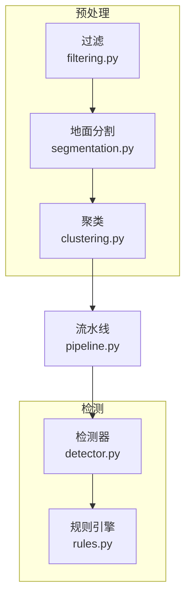
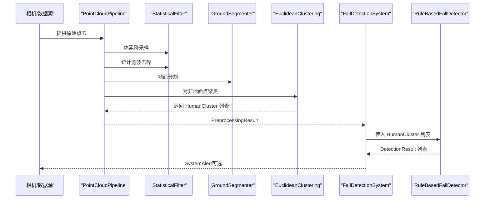
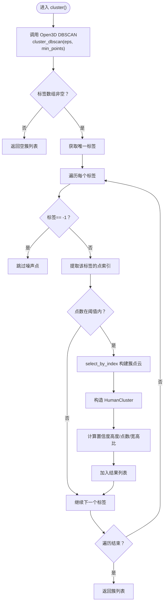
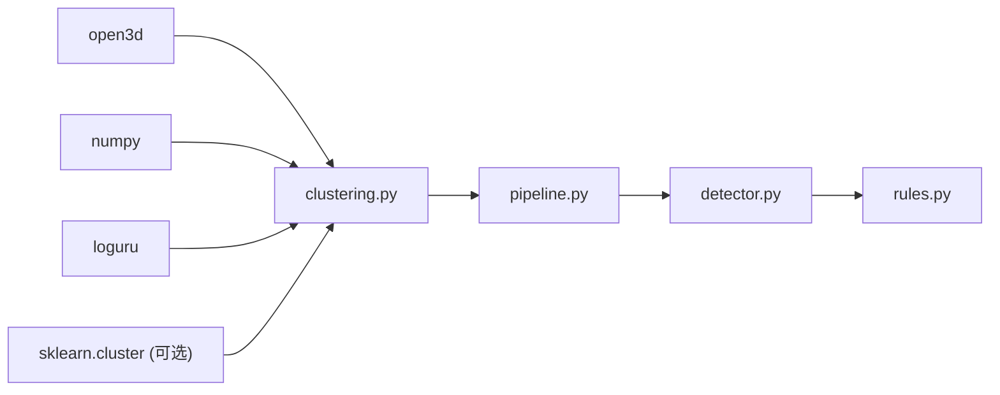

# 聚类算法

<cite>
**本文引用的文件**
- [clustering.py](file://src/preprocessing/clustering.py)
- [pipeline.py](file://src/preprocessing/pipeline.py)
- [rules.py](file://src/detection/rules.py)
- [detector.py](file://src/detection/detector.py)
- [filtering.py](file://src/preprocessing/filtering.py)
- [segmentation.py](file://src/preprocessing/segmentation.py)
- [fall_detection_demo.py](file://demos/fall_detection_demo.py)
</cite>

## 目录
1. [简介](#简介)
2. [项目结构](#项目结构)
3. [核心组件](#核心组件)
4. [架构总览](#架构总览)
5. [详细组件分析](#详细组件分析)
6. [依赖分析](#依赖分析)
7. [性能考量](#性能考量)
8. [故障排查指南](#故障排查指南)
9. [结论](#结论)
10. [附录](#附录)

## 简介
本文件面向“聚类算法模块”，聚焦于欧几里得聚类与 DBSCAN 在人体检测中的应用。内容涵盖：
- 欧几里得聚类与 DBSCAN 的实现细节与差异
- 聚类参数配置（容忍度、最小/最大簇大小等）对检测效果的影响
- API 参考：cluster() 方法与 HumanCluster 数据结构
- 实际用法示例：从非地面点云中提取人体簇
- 特征提取：高度、质心、包围盒、宽深、体积与置信度
- 质量评估与优化建议（参数调优、性能优化）

## 项目结构
聚类算法位于预处理子系统中，作为点云流水线的一部分，服务于摔倒检测系统。整体结构如下：

图表来源
- [filtering.py:1-189](file://src/preprocessing/filtering.py#L1-L189)
- [segmentation.py:1-243](file://src/preprocessing/segmentation.py#L1-L243)
- [clustering.py:1-495](file://src/preprocessing/clustering.py#L1-L495)
- [pipeline.py:1-337](file://src/preprocessing/pipeline.py#L1-L337)
- [detector.py:1-373](file://src/detection/detector.py#L1-L373)
- [rules.py:1-526](file://src/detection/rules.py#L1-L526)

章节来源
- [pipeline.py:65-178](file://src/preprocessing/pipeline.py#L65-L178)
- [clustering.py:99-398](file://src/preprocessing/clustering.py#L99-L398)

## 核心组件
- HumanCluster：人体簇数据结构，包含点云、质心、包围盒、尺寸、置信度等，并提供 is_human_like() 与特征属性（高度、宽、深、体积）。
- EuclideanClustering：基于 Open3D 的 DBSCAN 实现的欧式聚类器，支持容忍度、最小/最大簇大小等参数。
- DBSCANClustering：通用 DBSCAN 聚类器，优先使用 sklearn，若不可用则回退到 Open3D。
- MultiViewClustering：多视角融合聚类，将多个视角点云合并后统一聚类。
- PointCloudPipeline：完整的点云预处理流水线，串联体素降采样、统计滤波、地面分割与聚类。
- FallDetectionSystem：整合预处理与规则检测的系统入口，负责端到端的帧处理与报警。

章节来源
- [clustering.py:15-97](file://src/preprocessing/clustering.py#L15-L97)
- [clustering.py:99-221](file://src/preprocessing/clustering.py#L99-L221)
- [clustering.py:223-318](file://src/preprocessing/clustering.py#L223-L318)
- [clustering.py:321-373](file://src/preprocessing/clustering.py#L321-L373)
- [pipeline.py:65-178](file://src/preprocessing/pipeline.py#L65-L178)
- [detector.py:75-283](file://src/detection/detector.py#L75-L283)

## 架构总览
聚类在流水线中的位置与调用关系如下：

图表来源
- [pipeline.py:98-159](file://src/preprocessing/pipeline.py#L98-L159)
- [filtering.py:13-68](file://src/preprocessing/filtering.py#L13-L68)
- [segmentation.py:41-81](file://src/preprocessing/segmentation.py#L41-L81)
- [clustering.py:124-181](file://src/preprocessing/clustering.py#L124-L181)
- [detector.py:138-227](file://src/detection/detector.py#L138-L227)
- [rules.py:266-337](file://src/detection/rules.py#L266-L337)

## 详细组件分析

### HumanCluster 数据结构
- 字段与含义
  - id：簇标识
  - point_cloud：该簇的点云对象
  - centroid：质心坐标
  - bounding_box：轴对齐包围盒
  - num_points：点数
  - confidence：置信度（0~1）
- 关键属性
  - height/width/depth：包围盒尺寸
  - volume：包围盒体积
- 判定方法
  - is_human_like(min_height, max_height, min_points)：基于高度、点数与宽高比的启发式判定
- 序列化
  - to_dict()：导出为字典，便于日志与可视化

章节来源
- [clustering.py:15-97](file://src/preprocessing/clustering.py#L15-L97)

### EuclideanClustering（欧式聚类）
- 初始化参数
  - cluster_tolerance：簇内点的最大欧式距离（米）
  - min_cluster_size：最小簇点数
  - max_cluster_size：最大簇点数
- 核心流程
  - 调用 Open3D 的 DBSCAN（cluster_dbscan），得到每个点的簇标签
  - 过滤噪声标签（-1），按标签分组
  - 按点数阈值筛选簇
  - 构造 HumanCluster，计算置信度（基于高度、点数、宽高比）
- 置信度计算
  - 高度评分：理想身高区间给予更高权重
  - 点数评分：合理点数范围提升置信度
  - 宽高比评分：人体通常瘦高，宽高比过低视为可疑

图表来源
- [clustering.py:124-181](file://src/preprocessing/clustering.py#L124-L181)
- [clustering.py:183-220](file://src/preprocessing/clustering.py#L183-L220)

章节来源
- [clustering.py:99-221](file://src/preprocessing/clustering.py#L99-L221)

### DBSCANClustering（通用 DBSCAN）
- 初始化参数
  - eps：邻域半径（米）
  - min_samples：核心点最小样本数
  - metric：距离度量（euclidean/manhattan）
- 核心流程
  - 优先尝试 sklearn.cluster.DBSCAN；若不可用则回退到 Open3D 的 cluster_dbscan
  - 统一处理标签，过滤噪声，按最小点数阈值筛选
  - 构造 HumanCluster（默认置信度较低）

章节来源
- [clustering.py:223-318](file://src/preprocessing/clustering.py#L223-L318)

### MultiViewClustering（多视角融合）
- 功能：将多个视角的点云变换到世界坐标系后合并，再用基础聚类器统一聚类
- 适用场景：多相机或多视角覆盖更大区域
- 关键步骤：逐视角变换、合并点云、统一聚类

章节来源
- [clustering.py:321-373](file://src/preprocessing/clustering.py#L321-L373)

### PointCloudPipeline（预处理流水线）
- 步骤
  - 体素降采样（VoxelGridFilter）
  - 统计滤波去噪（StatisticalFilter）
  - 地面分割（GroundSegmenter）
  - 人体聚类（EuclideanClustering）
- 支持批量处理与实时模式（RealTimePipeline）

章节来源
- [pipeline.py:65-178](file://src/preprocessing/pipeline.py#L65-L178)

### API 参考

- HumanCluster
  - 属性
    - id, point_cloud, centroid, bounding_box, num_points, confidence
    - height, width, depth, volume
  - 方法
    - is_human_like(min_height=0.5, max_height=2.5, min_points=50) -> bool
    - to_dict() -> dict

- EuclideanClustering
  - 初始化：cluster_tolerance, min_cluster_size, max_cluster_size
  - 方法：cluster(cloud: o3d.geometry.PointCloud) -> List[HumanCluster]
  - 内部：_calculate_confidence(cluster: HumanCluster) -> float

- DBSCANClustering
  - 初始化：eps, min_samples, metric
  - 方法：cluster(cloud: o3d.geometry.PointCloud) -> List[HumanCluster]

- MultiViewClustering
  - 初始化：base_clusterer: EuclideanClustering
  - 方法：cluster_from_multiple_views(clouds: List, transforms: List) -> List[HumanCluster]

- 工厂函数
  - create_clusterer(method: str, **kwargs)
  - create_pipeline(mode: str, **kwargs)
  - create_detection_system(config: Optional[Dict] = None, **kwargs)

章节来源
- [clustering.py:15-97](file://src/preprocessing/clustering.py#L15-L97)
- [clustering.py:99-221](file://src/preprocessing/clustering.py#L99-L221)
- [clustering.py:223-318](file://src/preprocessing/clustering.py#L223-L318)
- [clustering.py:321-398](file://src/preprocessing/clustering.py#L321-L398)
- [pipeline.py:251-268](file://src/preprocessing/pipeline.py#L251-L268)
- [detector.py:285-299](file://src/detection/detector.py#L285-L299)

## 依赖分析
- 模块间耦合
  - clustering 依赖 open3d 与 numpy；可选依赖 sklearn（DBSCANClustering）
  - pipeline 将 filtering、segmentation、clustering 组合
  - detector 依赖 pipeline 与 rules
- 外部依赖
  - open3d：点云操作、DBSCAN、包围盒、可视化
  - numpy：数值计算
  - loguru：日志
  - 可选：scikit-learn（DBSCANClustering）

图表来源
- [clustering.py:8-12](file://src/preprocessing/clustering.py#L8-L12)
- [pipeline.py:13-21](file://src/preprocessing/pipeline.py#L13-L21)
- [detector.py:12-22](file://src/detection/detector.py#L12-L22)

章节来源
- [clustering.py:8-12](file://src/preprocessing/clustering.py#L8-L12)
- [pipeline.py:13-21](file://src/preprocessing/pipeline.py#L13-L21)
- [detector.py:12-22](file://src/detection/detector.py#L12-L22)

## 性能考量
- 体素降采样（VoxelGridFilter）：显著减少点数，提高聚类效率
- 统计滤波（StatisticalFilter）：去除离群点，提升聚类稳定性
- 地面分割（GroundSegmenter）：将非地面点送入聚类，避免地面干扰
- 聚类参数
  - cluster_tolerance：增大容忍度会合并更远的点，可能合并多个目标；减小容忍度更易拆分，但噪声影响更大
  - min_cluster_size：过小易误检噪声；过大可能漏检小目标
  - max_cluster_size：限制簇规模，避免异常大簇影响后续处理
- DBSCANClustering 的 eps 与 min_samples：eps 过大易合并；过小导致碎片化；min_samples 过小易误判噪声
- 多视角融合：合并后点数增多，需权衡聚类容忍度与性能

章节来源
- [filtering.py:109-139](file://src/preprocessing/filtering.py#L109-L139)
- [segmentation.py:13-81](file://src/preprocessing/segmentation.py#L13-L81)
- [clustering.py:99-118](file://src/preprocessing/clustering.py#L99-L118)
- [clustering.py:226-242](file://src/preprocessing/clustering.py#L226-L242)

## 故障排查指南
- 聚类结果为空
  - 检查输入是否为非地面点云
  - 检查 cluster_tolerance 是否过大或 min_cluster_size 是否过小
- 簇过多或过少
  - 调整 cluster_tolerance 与 min/max_cluster_size
  - 检查地面分割是否有效（法向量角度检查）
- 置信度偏低
  - 检查高度、点数与宽高比是否符合预期
  - 调整 EuclideanClustering 的容忍度与点数阈值
- DBSCANClustering 未安装 sklearn
  - 会自动回退到 Open3D 实现；若性能不足，建议安装 sklearn
- 可视化
  - 使用 visualize_clusters 可快速观察簇与包围盒

章节来源
- [clustering.py:136-145](file://src/preprocessing/clustering.py#L136-L145)
- [segmentation.py:64-76](file://src/preprocessing/segmentation.py#L64-L76)
- [clustering.py:401-438](file://src/preprocessing/clustering.py#L401-L438)

## 结论
- 欧几里得聚类（基于 DBSCAN）是本系统人体检测的核心步骤，通过合理的容忍度与点数阈值，能在复杂场景中稳定提取人体簇
- HumanCluster 提供了丰富的几何与形态特征，结合启发式置信度评估，为后续摔倒检测规则提供了可靠输入
- 通过流水线化的预处理与可插拔的聚类器工厂，系统具备良好的扩展性与可调性
- 建议在部署前根据具体场景校准聚类参数，并结合规则引擎进行联合优化

## 附录

### 实际用法示例（从非地面点云提取人体簇）
- 使用流水线
  - 创建 PointCloudPipeline 并传入配置
  - 调用 process(raw_cloud) 获取 PreprocessingResult
  - 从 result.human_clusters 获取 HumanCluster 列表
- 直接使用聚类器
  - 创建 EuclideanClustering 或 DBSCANClustering
  - 调用 cluster(non_ground_cloud) 获取簇列表
- 可视化
  - 调用 visualize_clusters(clusters, show_bbox=True) 查看结果

章节来源
- [pipeline.py:98-159](file://src/preprocessing/pipeline.py#L98-L159)
- [clustering.py:124-181](file://src/preprocessing/clustering.py#L124-L181)
- [clustering.py:401-438](file://src/preprocessing/clustering.py#L401-L438)
- [fall_detection_demo.py:92-179](file://demos/fall_detection_demo.py#L92-L179)

### 参数配置与调优建议
- 聚类容忍度（cluster_tolerance/eps）
  - 影响：容忍度越大，越容易将分散点合并；容忍度越小，越易拆分
  - 建议：先以中等值启动，结合可视化逐步微调
- 最小/最大簇大小（min_cluster_size/max_cluster_size）
  - 影响：过小易误检噪声；过大可能漏检小目标
  - 建议：结合典型人体点数范围设定，必要时动态调整
- 点云预处理
  - 体素降采样：平衡精度与性能
  - 统计滤波：去除离群点，提升稳定性
  - 地面分割：确保输入为非地面点
- 规则引擎联动
  - 高度骤降阈值、速度阈值、确认帧数与帧率共同决定检测灵敏度与稳定性

章节来源
- [pipeline.py:68-93](file://src/preprocessing/pipeline.py#L68-L93)
- [clustering.py:99-118](file://src/preprocessing/clustering.py#L99-L118)
- [rules.py:229-251](file://src/detection/rules.py#L229-L251)