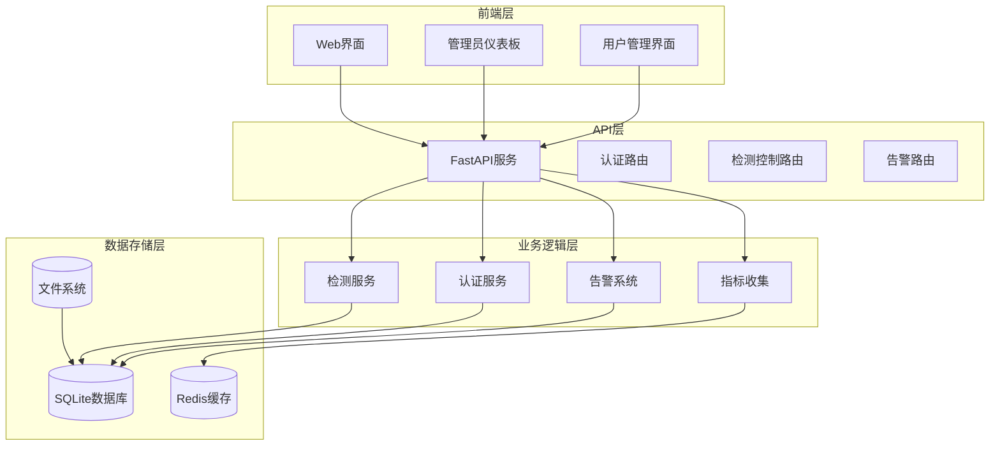
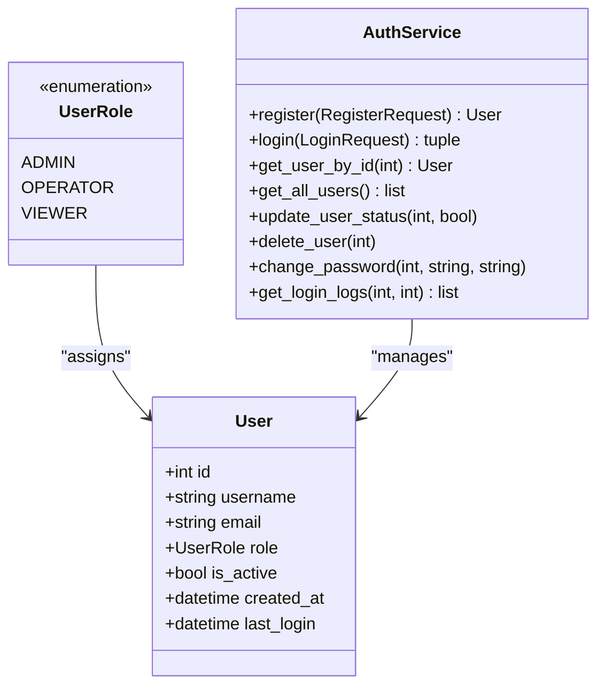
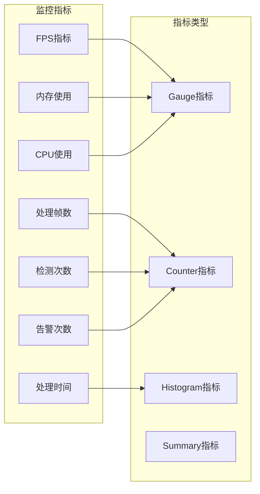
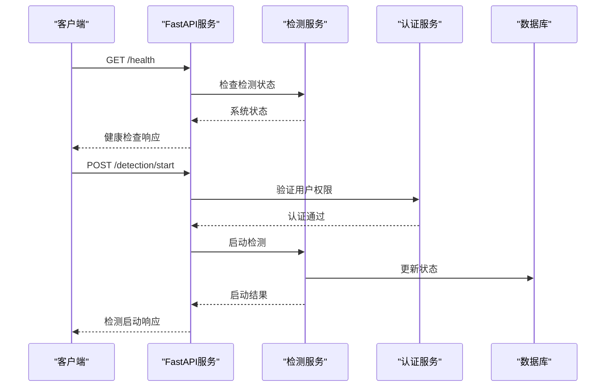
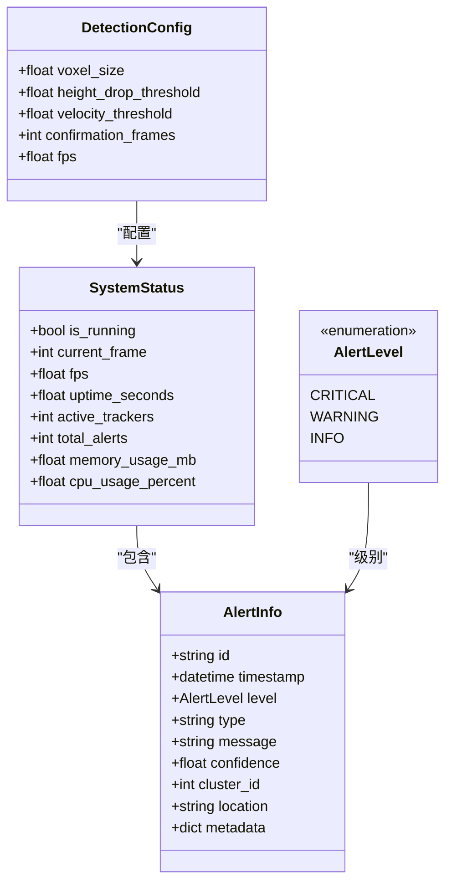
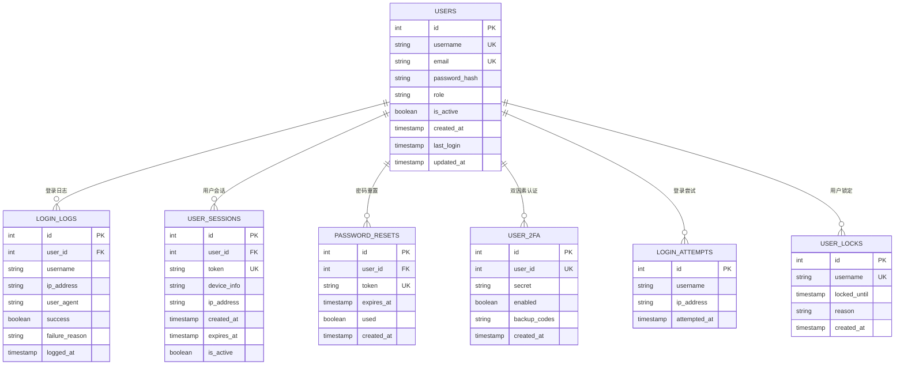
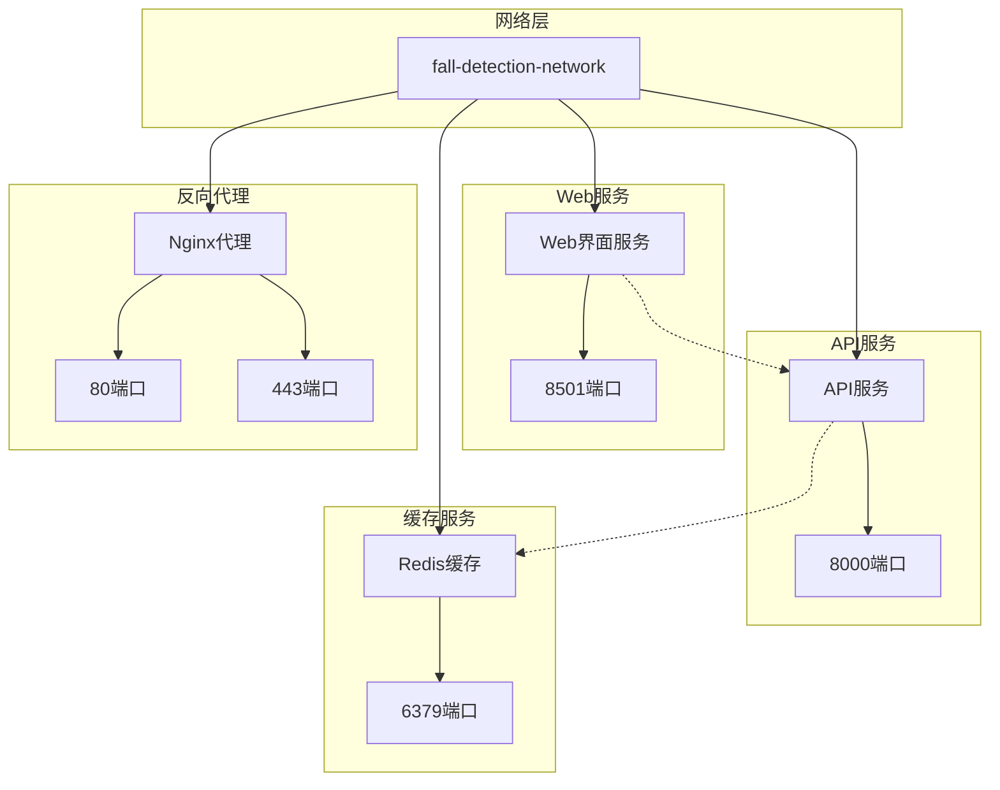
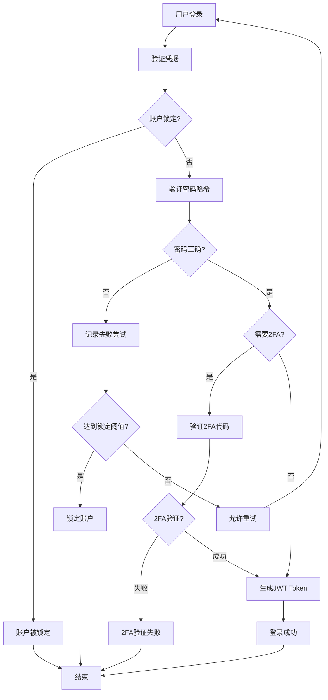

# 管理员后台系统

<cite>
**本文档引用的文件**
- [README.md](file://README.md)
- [ADMIN_GUIDE.md](file://ADMIN_GUIDE.md)
- [app.py](file://app.py)
- [src/api/main.py](file://src/api/main.py)
- [pages/system_dashboard.py](file://pages/system_dashboard.py)
- [pages/user_management.py](file://pages/user_management.py)
- [src/auth/auth_service_sqlite.py](file://src/auth/auth_service_sqlite.py)
- [src/database/db.py](file://src/database/db.py)
- [src/api/detection_service.py](file://src/api/detection_service.py)
- [src/monitoring/metrics.py](file://src/monitoring/metrics.py)
- [src/auth/models.py](file://src/auth/models.py)
- [src/api/models.py](file://src/api/models.py)
- [requirements.txt](file://requirements.txt)
- [docker-compose.yml](file://docker-compose.yml)
- [Dockerfile](file://Dockerfile)
</cite>

## 目录
1. [项目概述](#项目概述)
2. [系统架构](#系统架构)
3. [管理员后台功能](#管理员后台功能)
4. [用户管理系统](#用户管理系统)
5. [系统监控与仪表板](#系统监控与仪表板)
6. [API接口设计](#api接口设计)
7. [数据库设计](#数据库设计)
8. [部署架构](#部署架构)
9. [安全机制](#安全机制)
10. [性能优化](#性能优化)
11. [故障排除](#故障排除)
12. [总结](#总结)

## 项目概述

GuardianFall是一个基于3D视觉的室内人体摔倒实时预警系统，专为独居老人家庭、医院病房、养老院等场景设计。系统采用激光雷达/ToF深度相机结合AI算法，提供高精度的摔倒检测和实时报警功能。

### 核心特性

- **隐私保护**：仅获取3D点云数据，不拍摄图像
- **实时检测**：端到端延迟小于3秒
- **高精度**：准确率>95%，误报率<5%
- **全天候工作**：不受光线影响，24小时正常工作
- **AI驱动**：基于规则引擎+深度学习的混合算法

### 技术架构

系统采用分层架构设计，包括应用层、服务层、感知层和边缘层：

```
┌─────────────────────────────────────────────┐
│              应用层                          │
│  ┌──────────┐  ┌──────────┐  ┌──────────┐  │
│  │ Web UI   │  │ 报警通知 │  │ 数据分析 │  │
│  └──────────┘  └──────────┘  └──────────┘  │
└─────────────────────┬───────────────────────┘
                      │ HTTP/WebSocket
┌─────────────────────▼───────────────────────┐
│              服务层                          │
│  ┌──────────────────────────────────────┐   │
│  │      摔倒检测系统 (Streamlit)        │   │
│  │  预处理 · 聚类 · 检测 · 报警          │   │
│  └──────────────────────────────────────┘   │
└─────────────────────┬───────────────────────┘
                      │ USB/以太网
┌─────────────────────▼───────────────────────┐
│              感知层                          │
│  ┌──────────────────────────────────────┐   │
│  │      Azure Kinect DK 深度相机         │   │
│  │      点云数据采集 (30 FPS)            │   │
│  └──────────────────────────────────────┘   │
└─────────────────────────────────────────────┘
```

## 系统架构

### 整体架构设计

系统采用微服务架构，主要包含以下核心组件：



**图表来源**
- [src/api/main.py:70-87](file://src/api/main.py#L70-L87)
- [pages/system_dashboard.py:83-105](file://pages/system_dashboard.py#L83-L105)
- [pages/user_management.py:96-119](file://pages/user_management.py#L96-L119)

### 组件关系分析

系统采用松耦合设计，各组件通过清晰的接口进行通信：

1. **前端组件**：使用Streamlit构建用户界面
2. **API服务**：提供RESTful接口和WebSocket通信
3. **业务服务**：封装核心业务逻辑
4. **数据服务**：管理数据持久化和缓存

**章节来源**
- [src/api/main.py:29-68](file://src/api/main.py#L29-L68)
- [pages/system_dashboard.py:30-58](file://pages/system_dashboard.py#L30-L58)

## 管理员后台功能

### 系统仪表板

管理员仪表板提供全面的系统监控和管理功能：

#### 核心指标展示

| 指标 | 功能描述 | 阈值设置 |
|------|----------|----------|
| 总用户数 | 显示注册用户总数和活跃用户数 | - |
| 今日登录 | 今天的登录次数和失败次数 | 成功/失败状态 |
| 系统运行时间 | 自上次重启以来的运行时长 | - |
| 磁盘使用率 | 当前磁盘使用情况 | <80%正常，>80%警告，>90%错误 |

#### 系统资源监控

- **CPU使用率**：实时进度条显示，超过80%显示警告
- **内存使用率**：显示已用/总量+百分比
- **磁盘使用率**：超过80%提示注意，超过90%显示错误

#### 用户分析功能

1. **角色分布统计**：管理员、操作员、观察员的数量分布
2. **最近创建用户**：显示最近5个注册的用户及其创建日期
3. **最近登录用户**：显示最近5个登录的用户及其最后登录时间

**章节来源**
- [pages/system_dashboard.py:119-176](file://pages/system_dashboard.py#L119-L176)
- [pages/system_dashboard.py:184-211](file://pages/system_dashboard.py#L184-L211)
- [pages/system_dashboard.py:225-261](file://pages/system_dashboard.py#L225-L261)

### 快速操作面板

提供便捷的操作入口：

- 👥 **用户管理**：跳转到用户管理页面
- 📊 **查看日志**：查看详细日志
- 🔄 **刷新数据**：重新加载数据
- ⚙️ **系统设置**：系统配置（开发中）

## 用户管理系统

### 用户角色体系

系统采用三层用户权限模型：



**图表来源**
- [src/auth/models.py:11-16](file://src/auth/models.py#L11-L16)
- [src/auth/models.py:18-30](file://src/auth/models.py#L18-L30)
- [src/auth/auth_service_sqlite.py:28-34](file://src/auth/auth_service_sqlite.py#L28-L34)

#### 角色权限矩阵

| 功能 | 管理员 | 操作员 | 观察员 |
|------|--------|--------|--------|
| 用户管理 | ✅ 全部权限 | ❌ 无权限 | ❌ 无权限 |
| 系统监控 | ✅ 全部权限 | ✅ 读取权限 | ❌ 无权限 |
| 检测控制 | ✅ 全部权限 | ✅ 部分权限 | ❌ 无权限 |
| 日志查看 | ✅ 全部权限 | ✅ 读取权限 | ❌ 无权限 |
| 配置管理 | ✅ 全部权限 | ❌ 无权限 | ❌ 无权限 |

### 用户管理功能

#### 用户列表视图

- **统计卡片**：总用户数、活跃用户、管理员数量、观察员数量
- **用户表格**：显示用户ID、用户名、邮箱、角色、状态、创建时间、最后登录时间

#### 批量操作功能

1. **选择用户ID**：输入要操作用户的ID
2. **选择操作类型**：启用账户、禁用账户、删除用户、重置密码
3. **执行操作**：点击按钮执行相应操作

#### 单个用户快捷操作

- **启用**：激活已禁用的账户
- **禁用**：禁用已启用的账户（仅对已启用的显示）
- **删除**：删除账户（不能删除自己）
- **编辑**：编辑用户信息（开发中）

#### 创建新用户流程

1. **填写表单**：用户名（3-50字符）、邮箱、密码（至少6字符）、确认密码
2. **选择角色**：观察者/操作员/管理员
3. **创建选项**：创建后立即启用（默认勾选）
4. **验证规则**：用户名唯一、邮箱唯一且格式正确、密码长度至少6位、两次密码输入一致

**章节来源**
- [pages/user_management.py:127-270](file://pages/user_management.py#L127-L270)
- [pages/user_management.py:271-337](file://pages/user_management.py#L271-L337)
- [pages/user_management.py:339-404](file://pages/user_management.py#L339-L404)

## 系统监控与仪表板

### 登录日志功能

#### 过滤选项

- **筛选用户**：查看特定用户的日志
- **筛选状态**：只看成功/失败的登录
- **显示数量**：10-1000条记录

#### 统计数据

- **总登录次数**：符合条件的总记录数
- **成功**：成功登录次数和成功率
- **失败**：失败登录次数

#### 日志详情

每条日志包含：时间、用户、IP地址、设备、状态（成功/失败及原因）

### 性能监控指标

系统使用Prometheus进行指标收集和监控：



**图表来源**
- [src/monitoring/metrics.py:22-44](file://src/monitoring/metrics.py#L22-L44)

#### 指标分类

1. **系统性能指标**：FPS、处理时间、内存使用、CPU使用
2. **检测统计指标**：处理帧数、检测次数、告警次数
3. **状态指标**：系统状态、摄像头状态、最后检测时间
4. **用户相关指标**：活跃用户数、登录尝试

**章节来源**
- [pages/system_dashboard.py:265-286](file://pages/system_dashboard.py#L265-L286)
- [src/monitoring/metrics.py:18-51](file://src/monitoring/metrics.py#L18-L51)

## API接口设计

### 核心API路由

系统提供RESTful API接口，主要包含以下路由：



**图表来源**
- [src/api/main.py:108-155](file://src/api/main.py#L108-L155)

#### 健康检查接口

- **GET /**：API根路径，返回基本信息
- **GET /health**：健康检查，返回系统运行状态

#### 检测控制接口

- **POST /detection/start**：启动检测（需要认证）
- **POST /detection/stop**：停止检测（需要认证）
- **GET /detection/status**：获取检测状态（需要认证）

#### 监控告警接口

- **GET /alerts**：获取告警列表（需要认证）
- **GET /alerts/active**：获取活动告警（需要认证）
- **POST /alerts/{alert_id}/acknowledge**：确认告警（需要认证）
- **GET /alerts/statistics**：获取告警统计（需要认证）

#### 用户管理接口

- **GET /users/me**：获取当前用户信息

**章节来源**
- [src/api/main.py:97-260](file://src/api/main.py#L97-L260)

### 数据模型设计

系统使用Pydantic定义数据模型，确保数据验证和序列化：

#### 核心数据模型



**图表来源**
- [src/api/models.py:28-38](file://src/api/models.py#L28-L38)
- [src/api/models.py:50-61](file://src/api/models.py#L50-L61)
- [src/api/models.py:63-81](file://src/api/models.py#L63-L81)

**章节来源**
- [src/api/models.py:13-18](file://src/api/models.py#L13-L18)
- [src/api/models.py:28-61](file://src/api/models.py#L28-L61)

## 数据库设计

### 数据库架构

系统使用SQLite作为默认数据库，采用单例模式管理连接：



**图表来源**
- [src/database/db.py:55-145](file://src/database/db.py#L55-L145)

#### 表结构说明

1. **用户表（users）**：存储用户基本信息和认证数据
2. **登录日志表（login_logs）**：记录用户登录尝试和结果
3. **用户会话表（user_sessions）**：管理用户会话和Token
4. **密码重置表（password_resets）**：处理密码重置流程
5. **双因素认证表（user_2fa）**：存储2FA相关信息
6. **登录失败尝试表（login_attempts）**：记录失败登录尝试
7. **用户锁定表（user_locks）**：管理账户锁定状态

#### 索引优化

系统自动创建以下索引以优化查询性能：

- 用户名索引：加速用户查找
- 邮箱索引：加速邮箱验证
- 登录日志索引：按用户和时间排序
- 会话索引：加速Token验证
- 2FA索引：加速2FA验证
- 登录尝试索引：加速失败尝试统计
- 锁定索引：加速锁定状态检查

**章节来源**
- [src/database/db.py:13-50](file://src/database/db.py#L13-L50)
- [src/database/db.py:147-177](file://src/database/db.py#L147-L177)

## 部署架构

### Docker容器化部署

系统采用Docker进行容器化部署，支持多服务协调：



**图表来源**
- [docker-compose.yml:6-72](file://docker-compose.yml#L6-L72)
- [docker-compose.yml:74-133](file://docker-compose.yml#L74-L133)

#### 服务配置

1. **Web界面服务（web-ui）**
   - 基于Streamlit的Web界面
   - 端口映射：8501:8501
   - 环境变量：STREAMLIT_SERVER_ADDRESS=0.0.0.0
   - 数据卷：应用代码、配置文件、持久化数据

2. **API服务（api）**
   - 基于FastAPI的后端服务
   - 端口映射：8000:8000
   - 环境变量：API_BASE_URL=http://api:8000
   - 数据卷：源代码、配置文件、数据目录

3. **Redis缓存服务**
   - 用于会话管理和缓存
   - 端口映射：6379:6379
   - 数据持久化：redis-data卷

4. **Nginx反向代理**
   - 可选的生产环境代理
   - 端口映射：80:80, 443:443
   - 配置文件：nginx.conf

#### 资源限制

每个服务都有明确的资源限制：

- **Web服务**：CPU 1.0核，内存1G
- **API服务**：CPU 2.0核，内存2G  
- **Redis服务**：CPU 0.5核，内存256M

**章节来源**
- [docker-compose.yml:1-209](file://docker-compose.yml#L1-L209)
- [Dockerfile:1-50](file://Dockerfile#L1-L50)

### 部署流程

#### 一键部署

```bash
# 克隆项目
git clone https://github.com/nanfeng2021/fall-detection-system.git
cd fall-detection-system

# 一键部署
sudo ./deploy.sh
```

#### Docker Compose部署

```bash
# 启动服务
docker-compose up -d

# 查看状态
docker-compose ps

# 访问系统
# Web界面：http://localhost:8501
# API接口：http://localhost:8000
```

#### 手动运行

```bash
# 安装依赖
python3 -m venv venv
source venv/bin/activate
pip install -r requirements.txt

# 启动Web界面
streamlit run app.py --server.address 0.0.0.0 --server.port 8501
```

## 安全机制

### 认证与授权

系统采用JWT Token进行用户认证，支持多层安全机制：



**图表来源**
- [src/auth/auth_service_sqlite.py:83-172](file://src/auth/auth_service_sqlite.py#L83-L172)

#### 认证流程

1. **凭据验证**：检查用户名是否存在
2. **密码验证**：使用bcrypt验证密码哈希
3. **账户状态检查**：确认账户是否激活
4. **2FA验证**：如启用则验证双因素代码
5. **Token生成**：创建JWT访问令牌
6. **会话记录**：记录用户会话信息

#### 安全特性

1. **密码加密**：使用bcrypt进行密码哈希
2. **账户锁定**：防止暴力破解攻击
3. **双因素认证**：额外的安全层
4. **会话管理**：Token过期和失效处理
5. **权限控制**：基于角色的访问控制

### 安全最佳实践

#### 密码策略

- 最少8个字符
- 包含大小写字母
- 包含数字和特殊字符
- 定期更换密码

#### 权限管理

- **最小权限原则**：分配必要的最少权限
- **角色分离**：管理员、操作员、观察员职责分离
- **定期审查**：定期检查用户权限和活动

#### 监控与审计

- **登录日志**：记录所有登录尝试
- **异常检测**：监控异常登录模式
- **权限变更**：跟踪用户权限变更

**章节来源**
- [src/auth/auth_service_sqlite.py:35-44](file://src/auth/auth_service_sqlite.py#L35-L44)
- [src/auth/auth_service_sqlite.py:173-186](file://src/auth/auth_service_sqlite.py#L173-L186)
- [ADMIN_GUIDE.md:186-217](file://ADMIN_GUIDE.md#L186-L217)

## 性能优化

### 系统性能指标

系统监控关键性能指标以确保最佳运行状态：

#### 检测性能

- **准确率**：> 95%
- **误报率**：< 5%
- **漏报率**：< 3%
- **检测延迟**：< 3秒（目标<100ms）

#### 系统性能

- **处理速度**：> 20 FPS
- **单帧耗时**：< 100ms
- **内存占用**：< 2GB
- **CPU占用**：< 50%（2核）

#### 覆盖范围

- **单设备**：20-50㎡
- **检测高度**：0.3-2.5m
- **视角**：水平75°, 垂直65°

### 优化策略

#### 数据库优化

1. **索引优化**：自动创建必要索引
2. **查询优化**：使用参数化查询
3. **连接池**：复用数据库连接
4. **定期维护**：清理过期数据

#### 缓存策略

对于大型系统，可以考虑：

- 使用Redis缓存用户信息
- 缓存常用查询结果
- 定期清理过期会话

#### 日志管理

```python
# 日志清理示例
from src.database.db import get_db_connection

with get_db_connection() as conn:
    cursor = conn.cursor()
    
    # 删除90天前的日志
    cursor.execute("""
        DELETE FROM login_logs 
        WHERE logged_at < datetime('now', '-90 days')
    """)
    
    conn.commit()
```

**章节来源**
- [ADMIN_GUIDE.md:279-310](file://ADMIN_GUIDE.md#L279-L310)
- [README.md:201-219](file://README.md#L201-L219)

## 故障排除

### 常见问题解决

#### 用户管理问题

**Q1: 如何重置忘记密码的用户？**

**方法1**: 管理员直接修改数据库
```bash
cd /root/.openclaw/workspace/projects/fall-detection-system
python3 -c "
from src.auth.auth_service_sqlite import AuthService
auth = AuthService()
auth.change_password(user_id=1, old_password='xxx', new_password='newpass123')
"
```

**方法2**: 删除并重新创建用户

**Q2: 如何查看某个用户的所有登录历史？**

1. 进入"登录日志"页面
2. 在"筛选用户"下拉框选择该用户
3. 设置合适的显示数量
4. 点击应用

**Q3: 误删了用户怎么办？**

目前不支持恢复已删除的用户。需要重新创建账户。

**建议**：优先使用"禁用"而非"删除"。

#### 系统部署问题

**Q4: 如何批量导入用户？**

可以使用脚本批量创建：

```python
from src.auth.auth_service_sqlite import AuthService
from src.auth.models import RegisterRequest, UserRole

auth = AuthService()

users = [
    {"username": "user1", "email": "user1@example.com"},
    {"username": "user2", "email": "user2@example.com"},
]

for user_info in users:
    request = RegisterRequest(
        username=user_info["username"],
        email=user_info["email"],
        password="default123",  # 建议首次登录强制修改
        role=UserRole.VIEWER
    )
    auth.register(request)
```

**Q5: 如何限制登录失败次数？**

这个功能正在开发中。临时方案是定期检查登录日志，手动禁用可疑账户。

### 系统监控

#### 性能监控

使用Prometheus指标进行系统监控：

```python
from src.monitoring.metrics import get_metrics

# 更新FPS指标
metrics = get_metrics()
metrics.update_fps(current_fps)

# 记录处理时间
metrics.observe_processing_time(duration)

# 增加检测计数
metrics.increment_detection("fall")
```

#### 告警机制

系统支持多种级别的告警：

- **严重告警**：同时发送邮件和微信通知
- **错误告警**：只发送邮件通知
- **信息告警**：记录到日志系统

**章节来源**
- [ADMIN_GUIDE.md:219-277](file://ADMIN_GUIDE.md#L219-L277)
- [src/monitoring/metrics.py:76-132](file://src/monitoring/metrics.py#L76-L132)

## 总结

管理员后台系统为GuardianFall摔倒检测系统提供了完整的管理功能，包括用户管理、系统监控、日志查看等核心功能。系统采用现代化的技术架构，具有以下特点：

### 技术优势

1. **模块化设计**：清晰的分层架构，便于维护和扩展
2. **安全性**：多层安全机制，包括JWT认证、密码加密、账户锁定等
3. **可观测性**：完善的监控指标和日志系统
4. **可扩展性**：容器化部署，支持水平扩展
5. **易用性**：直观的Web界面和丰富的管理功能

### 应用价值

- **隐私保护**：不拍摄图像，保护用户隐私
- **实时预警**：从摔倒到报警延迟<3秒
- **高精度检测**：准确率>95%，误报率<5%
- **全天候工作**：不受光线影响，24小时正常工作
- **成本效益**：相比传统方案成本降低80%

### 未来发展

系统持续演进，计划中的功能包括：

- 用户编辑功能
- 批量导入/导出
- 密码重置邮件
- 双因素认证
- 自定义角色和权限
- 操作审计日志
- API密钥管理
- Webhook集成

管理员后台系统为系统的稳定运行和高效管理提供了坚实基础，是整个GuardianFall生态系统的重要组成部分。