# 分层架构设计

<cite>
**本文档引用的文件**
- [app.py](file://app.py)
- [azure_kinect.py](file://src/data_capture/azure_kinect.py)
- [pipeline.py](file://src/preprocessing/pipeline.py)
- [clustering.py](file://src/preprocessing/clustering.py)
- [filtering.py](file://src/preprocessing/filtering.py)
- [segmentation.py](file://src/preprocessing/segmentation.py)
- [detector.py](file://src/detection/detector.py)
- [rules.py](file://src/detection/rules.py)
- [fall_detection_demo.py](file://demos/fall_detection_demo.py)
- [requirements.txt](file://requirements.txt)
- [README.md](file://README.md)
</cite>

## 目录
1. [简介](#简介)
2. [项目结构](#项目结构)
3. [核心组件](#核心组件)
4. [架构概览](#架构概览)
5. [详细组件分析](#详细组件分析)
6. [依赖关系分析](#依赖关系分析)
7. [性能考虑](#性能考虑)
8. [故障排除指南](#故障排除指南)
9. [结论](#结论)

## 简介

GuardianFall是一个基于3D视觉的室内人体摔倒实时预警系统，采用四层架构设计，通过Azure Kinect DK深度相机采集点云数据，经过数据预处理、算法检测和应用界面三层处理，最终实现对摔倒事件的实时检测和报警。

该系统的核心价值在于：
- **隐私保护**：只采集3D点云数据，不拍摄可见光图像
- **实时检测**：端到端延迟小于3秒
- **高精度**：摔倒检测准确率>95%，误报率<5%
- **全天候工作**：不受光线影响，24小时正常工作

## 项目结构

GuardianFall系统采用清晰的模块化组织结构，按照功能职责划分为四个主要层次：

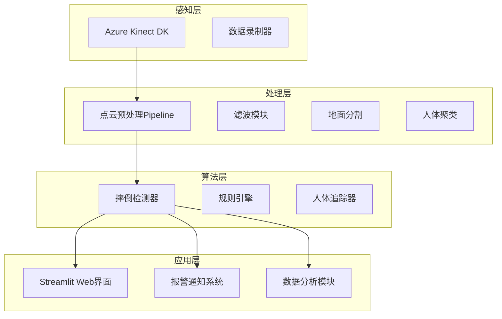

**图表来源**
- [app.py:1-662](file://app.py#L1-L662)
- [azure_kinect.py:1-532](file://src/data_capture/azure_kinect.py#L1-L532)
- [pipeline.py:1-337](file://src/preprocessing/pipeline.py#L1-L337)
- [detector.py:1-373](file://src/detection/detector.py#L1-L373)

**章节来源**
- [README.md:61-86](file://README.md#L61-L86)
- [requirements.txt:1-34](file://requirements.txt#L1-L34)

## 核心组件

### 感知层组件

感知层负责从Azure Kinect DK深度相机采集原始点云数据，提供实时数据流和录制功能。

**章节来源**
- [azure_kinect.py:47-460](file://src/data_capture/azure_kinect.py#L47-L460)

### 处理层组件

处理层包含完整的点云预处理Pipeline，涵盖滤波、地面分割和人体聚类三个核心步骤。

**章节来源**
- [pipeline.py:65-178](file://src/preprocessing/pipeline.py#L65-L178)
- [filtering.py:13-189](file://src/preprocessing/filtering.py#L13-L189)
- [segmentation.py:13-205](file://src/preprocessing/segmentation.py#L13-L205)
- [clustering.py:99-495](file://src/preprocessing/clustering.py#L99-L495)

### 算法层组件

算法层实现基于规则的摔倒检测系统，包含检测器、规则引擎和人体追踪器。

**章节来源**
- [detector.py:75-283](file://src/detection/detector.py#L75-L283)
- [rules.py:226-423](file://src/detection/rules.py#L226-L423)

### 应用层组件

应用层提供Streamlit Web界面，实现3D可视化、实时监控和报警管理功能。

**章节来源**
- [app.py:105-450](file://app.py#L105-L450)

## 架构概览

GuardianFall系统采用经典的四层架构设计，每层都有明确的职责边界和接口定义：

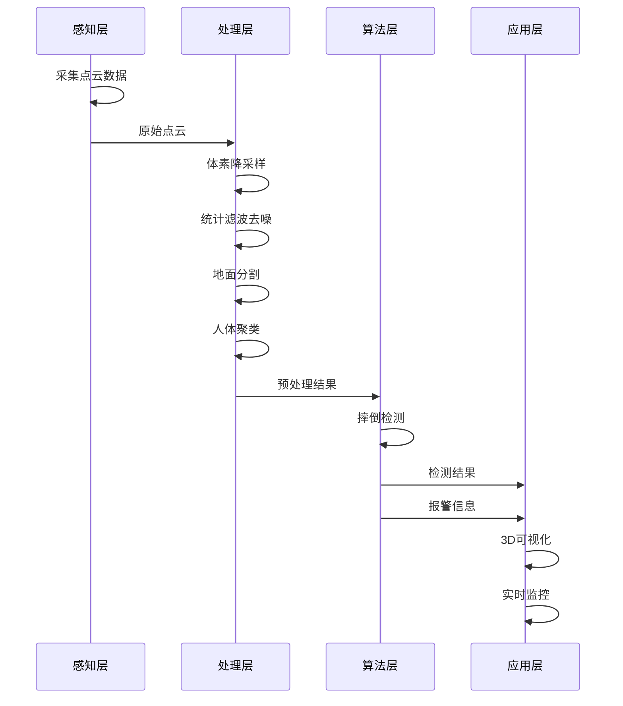

**图表来源**
- [azure_kinect.py:216-284](file://src/data_capture/azure_kinect.py#L216-L284)
- [pipeline.py:98-139](file://src/preprocessing/pipeline.py#L98-L139)
- [detector.py:138-227](file://src/detection/detector.py#L138-L227)

### 层间通信协议

系统采用Python数据类作为跨层通信载体，确保数据格式的一致性和类型安全：

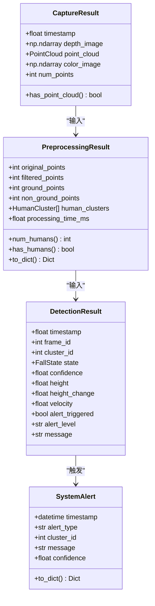

**图表来源**
- [azure_kinect.py:32-45](file://src/data_capture/azure_kinect.py#L32-L45)
- [pipeline.py:24-63](file://src/preprocessing/pipeline.py#L24-L63)
- [rules.py:31-79](file://src/detection/rules.py#L31-L79)
- [detector.py:25-47](file://src/detection/detector.py#L25-L47)

### 数据格式转换

系统在各层之间进行必要的数据格式转换：

1. **感知层** → **处理层**：原始深度图 → Open3D点云
2. **处理层** → **算法层**：点云数据 → 人体簇列表
3. **算法层** → **应用层**：检测结果 → 可视化数据

**章节来源**
- [azure_kinect.py:285-344](file://src/data_capture/azure_kinect.py#L285-L344)
- [pipeline.py:141-159](file://src/preprocessing/pipeline.py#L141-L159)

## 详细组件分析

### 感知层分析

感知层的核心组件是AzureKinectCamera，负责从硬件设备采集实时点云数据。

#### 组件架构

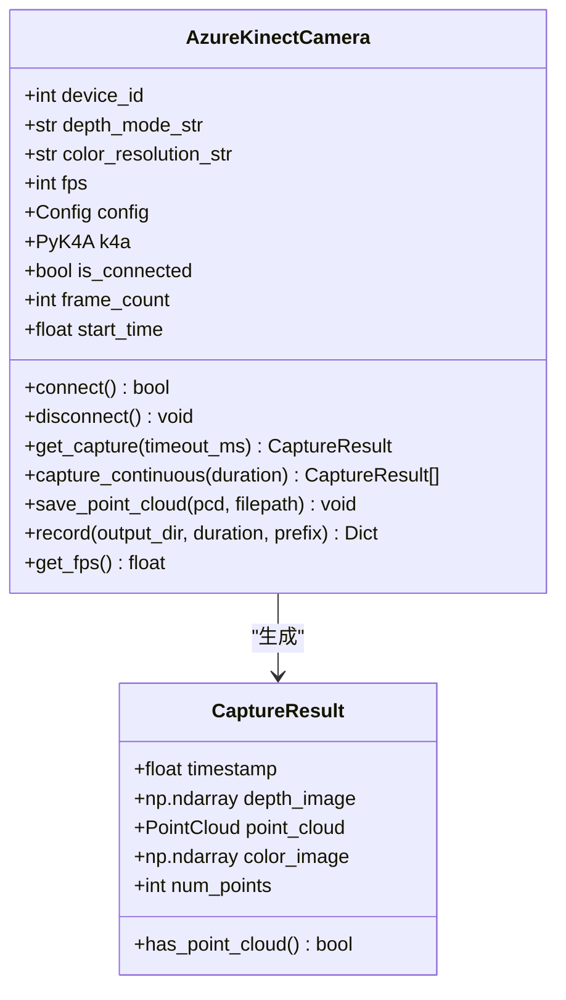

**图表来源**
- [azure_kinect.py:47-460](file://src/data_capture/azure_kinect.py#L47-L460)

#### 数据采集流程

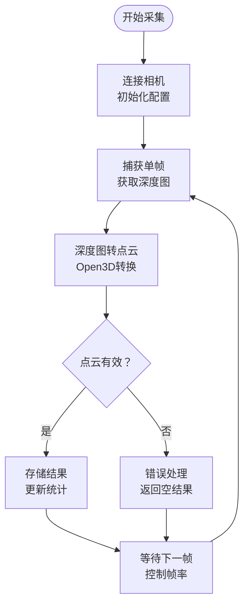

**图表来源**
- [azure_kinect.py:152-185](file://src/data_capture/azure_kinect.py#L152-L185)
- [azure_kinect.py:216-284](file://src/data_capture/azure_kinect.py#L216-L284)

**章节来源**
- [azure_kinect.py:152-284](file://src/data_capture/azure_kinect.py#L152-L284)

### 处理层分析

处理层实现完整的点云预处理Pipeline，包含四个核心步骤。

#### Pipeline架构

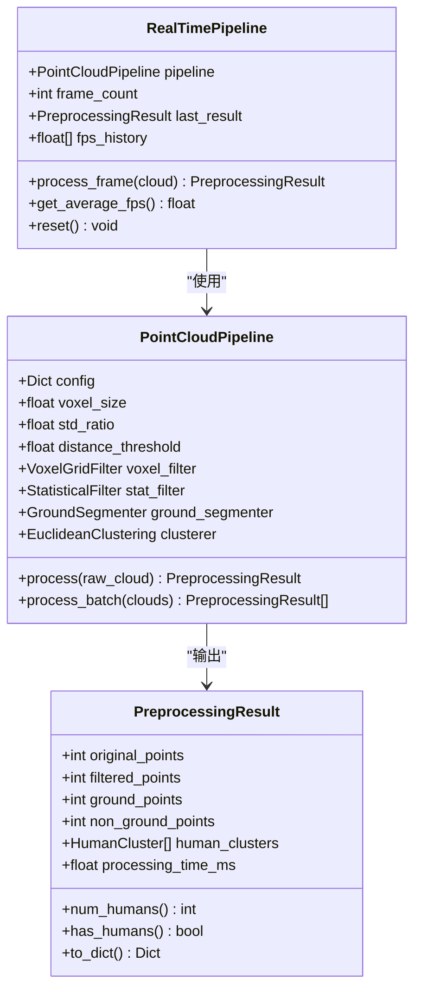

**图表来源**
- [pipeline.py:65-249](file://src/preprocessing/pipeline.py#L65-L249)

#### 预处理流程

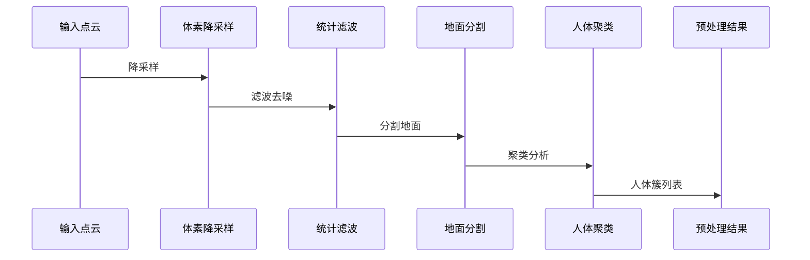

**图表来源**
- [pipeline.py:98-139](file://src/preprocessing/pipeline.py#L98-L139)

**章节来源**
- [pipeline.py:65-178](file://src/preprocessing/pipeline.py#L65-L178)

### 算法层分析

算法层实现基于规则的摔倒检测系统，包含检测器、规则引擎和人体追踪器。

#### 检测器架构

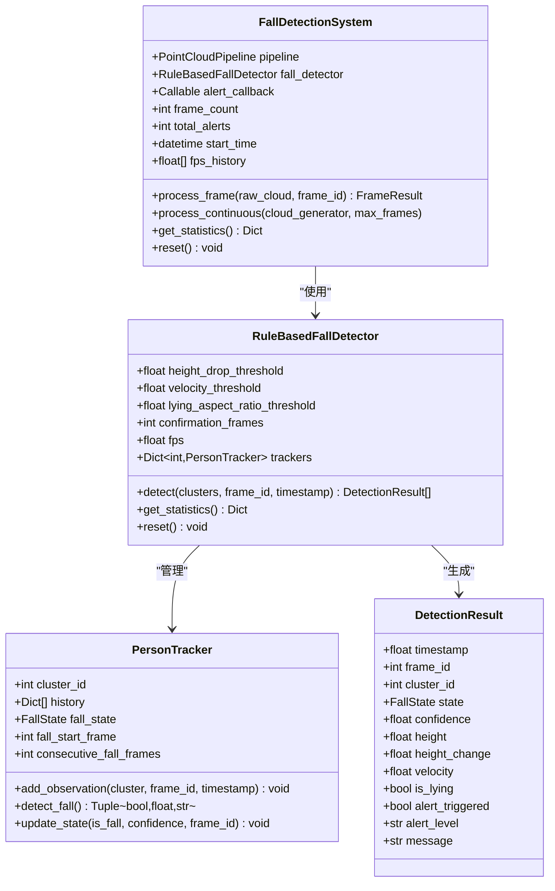

**图表来源**
- [detector.py:75-283](file://src/detection/detector.py#L75-L283)
- [rules.py:226-423](file://src/detection/rules.py#L226-L423)

#### 摔倒检测算法

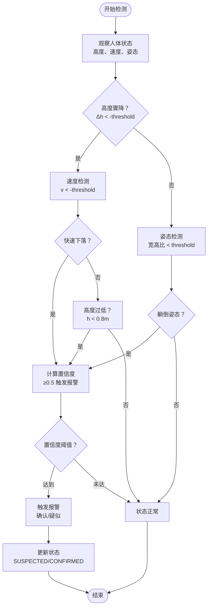

**图表来源**
- [rules.py:145-189](file://src/detection/rules.py#L145-L189)
- [rules.py:190-224](file://src/detection/rules.py#L190-L224)

**章节来源**
- [detector.py:75-227](file://src/detection/detector.py#L75-L227)
- [rules.py:226-337](file://src/detection/rules.py#L226-L337)

### 应用层分析

应用层提供Streamlit Web界面，实现3D可视化、实时监控和报警管理功能。

#### 界面架构

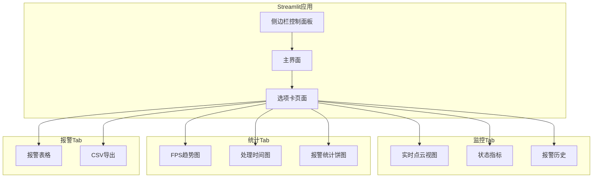

**图表来源**
- [app.py:308-652](file://app.py#L308-L652)

#### 数据可视化流程

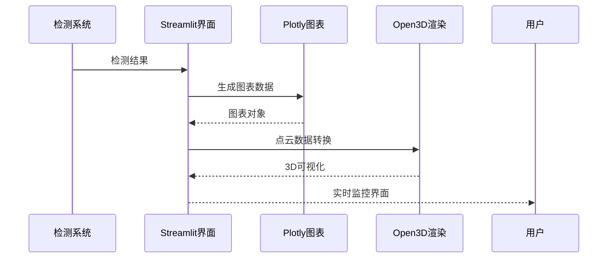

**图表来源**
- [app.py:168-193](file://app.py#L168-L193)
- [app.py:340-420](file://app.py#L340-L420)

**章节来源**
- [app.py:105-450](file://app.py#L105-L450)

## 依赖关系分析

系统采用模块化设计，各层之间的依赖关系清晰明确：

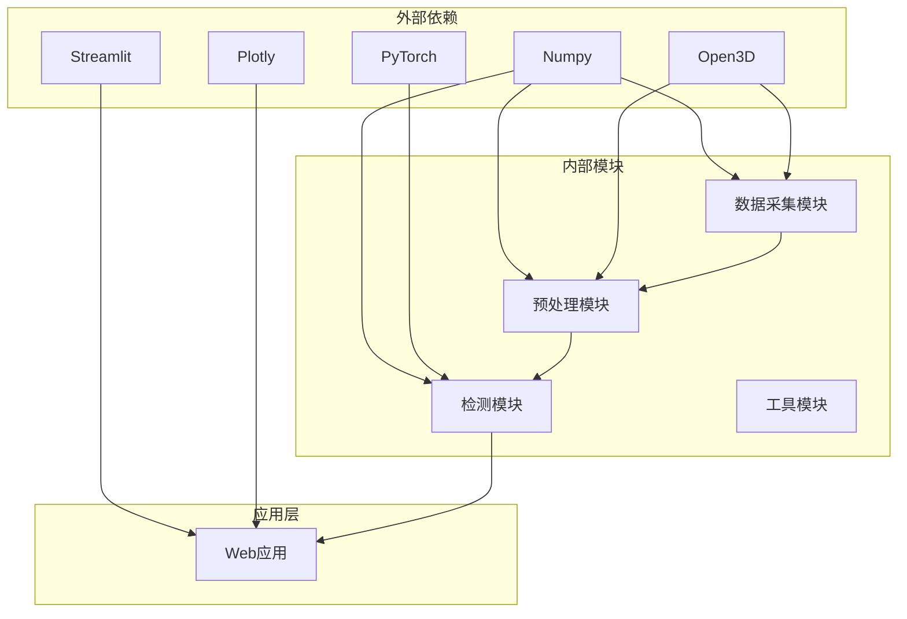

**图表来源**
- [requirements.txt:1-34](file://requirements.txt#L1-L34)

### 错误处理机制

系统在各层都实现了完善的错误处理机制：

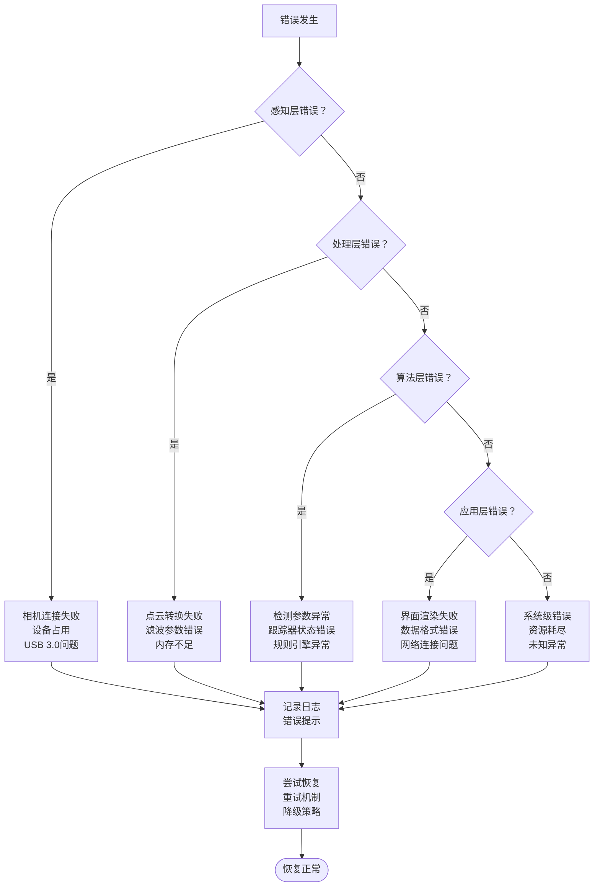

**图表来源**
- [azure_kinect.py:177-184](file://src/data_capture/azure_kinect.py#L177-L184)
- [detector.py:190-192](file://src/detection/detector.py#L190-L192)

**章节来源**
- [azure_kinect.py:152-185](file://src/data_capture/azure_kinect.py#L152-L185)
- [detector.py:253-257](file://src/detection/detector.py#L253-L257)

## 性能考虑

### 处理性能指标

系统在性能方面有明确的目标和实现：

- **检测延迟**：< 100ms（目标 < 3秒）
- **处理速度**：> 20 FPS
- **单帧耗时**：< 100ms
- **内存占用**：< 2GB
- **CPU占用**：< 50%（2核）

### 优化策略

1. **实时Pipeline优化**：使用滑动窗口和缓存机制
2. **并行处理**：多线程处理不同类型的检测任务
3. **内存管理**：及时释放不需要的中间结果
4. **算法优化**：选择合适的阈值和参数

**章节来源**
- [README.md:201-214](file://README.md#L201-L214)
- [pipeline.py:199-235](file://src/preprocessing/pipeline.py#L199-L235)

## 故障排除指南

### 常见问题及解决方案

#### 相机连接问题

| 问题症状 | 可能原因 | 解决方案 |
|---------|---------|---------|
| 相机无法连接 | USB 3.0线缆问题 | 使用原装USB 3.0线缆 |
| 相机被占用 | 其他程序占用 | 关闭其他应用程序 |
| 驱动程序缺失 | SDK未安装 | 安装pyk4a驱动 |

#### 点云处理问题

| 问题症状 | 可能原因 | 解决方案 |
|---------|---------|---------|
| 点云为空 | 相机角度问题 | 调整相机位置和角度 |
| 处理速度慢 | 参数设置不当 | 优化滤波参数和聚类阈值 |
| 内存不足 | 点云过大 | 增加体素降采样尺寸 |

#### 检测准确性问题

| 问题症状 | 可能原因 | 解决方案 |
|---------|---------|---------|
| 误报过多 | 阈值设置过高 | 适当提高检测阈值 |
| 漏报严重 | 阈值设置过低 | 降低检测阈值 |
| 响应延迟 | 算法复杂度过高 | 简化检测规则 |

**章节来源**
- [azure_kinect.py:177-184](file://src/data_capture/azure_kinect.py#L177-L184)
- [rules.py:406-422](file://src/detection/rules.py#L406-L422)

## 结论

GuardianFall系统的四层架构设计体现了良好的软件工程实践：

### 架构优势

1. **清晰的职责分离**：每层都有明确的功能定位
2. **良好的扩展性**：模块化设计便于功能扩展
3. **稳定的接口契约**：数据类确保跨层通信的稳定性
4. **完善的错误处理**：多层次的异常处理机制

### 技术决策考量

1. **分层设计的选择**：将复杂的计算机视觉任务分解为可管理的模块
2. **实时性的保证**：通过Pipeline和优化算法确保系统响应速度
3. **隐私保护的设计**：仅使用深度数据，避免隐私泄露风险
4. **用户体验的优化**：提供直观的Web界面和实时监控能力

### 未来发展方向

1. **AI算法增强**：集成深度学习模型提升检测准确性
2. **多传感器融合**：结合其他传感器提高检测可靠性
3. **边缘计算优化**：在边缘设备上部署轻量化模型
4. **云端服务扩展**：提供远程监控和数据分析服务

该架构为GuardianFall系统提供了坚实的技术基础，能够满足室内摔倒检测的实际需求，并为未来的功能扩展和技术升级奠定了良好基础。