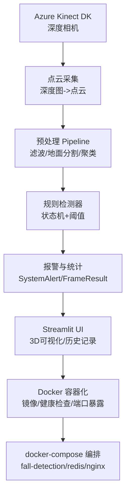
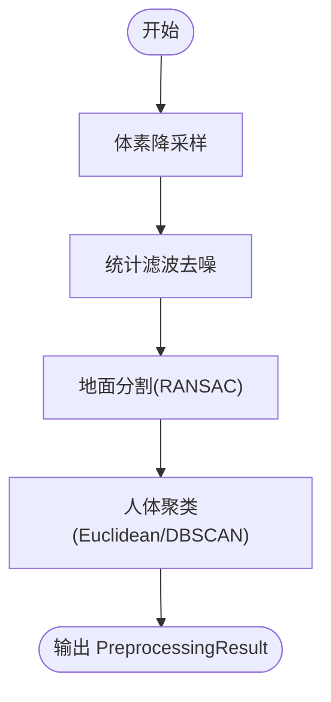
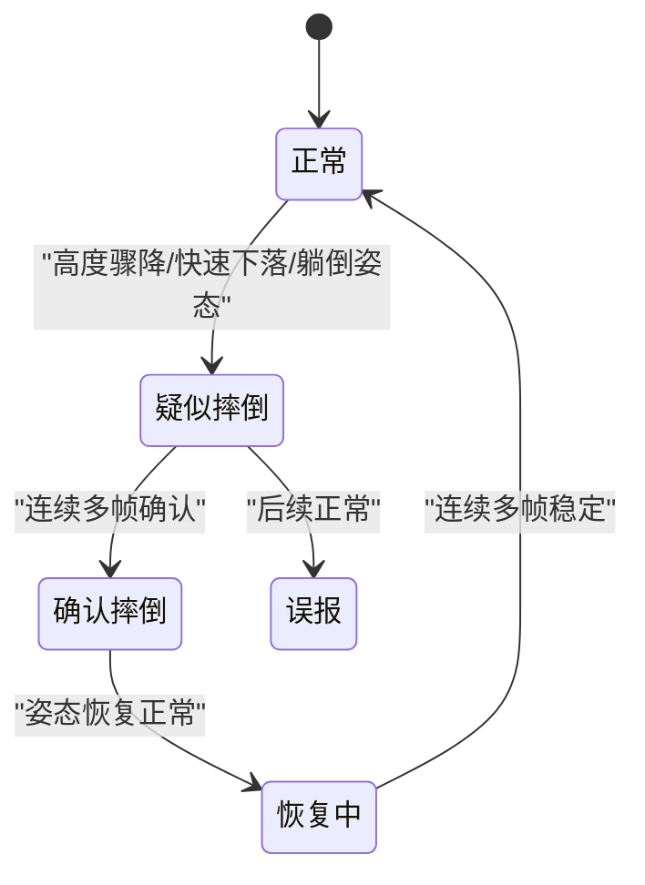
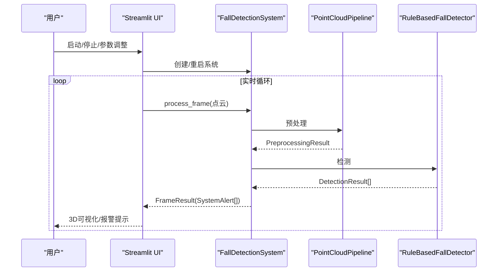
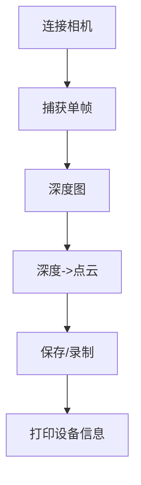
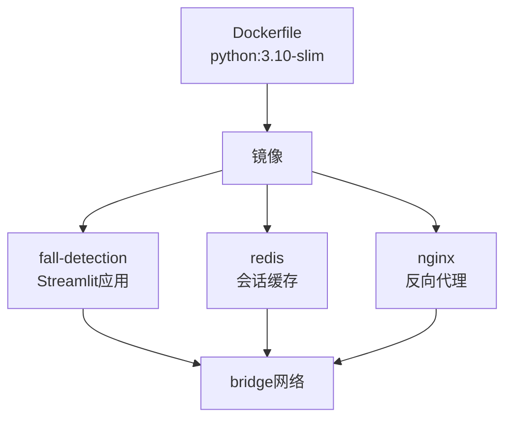
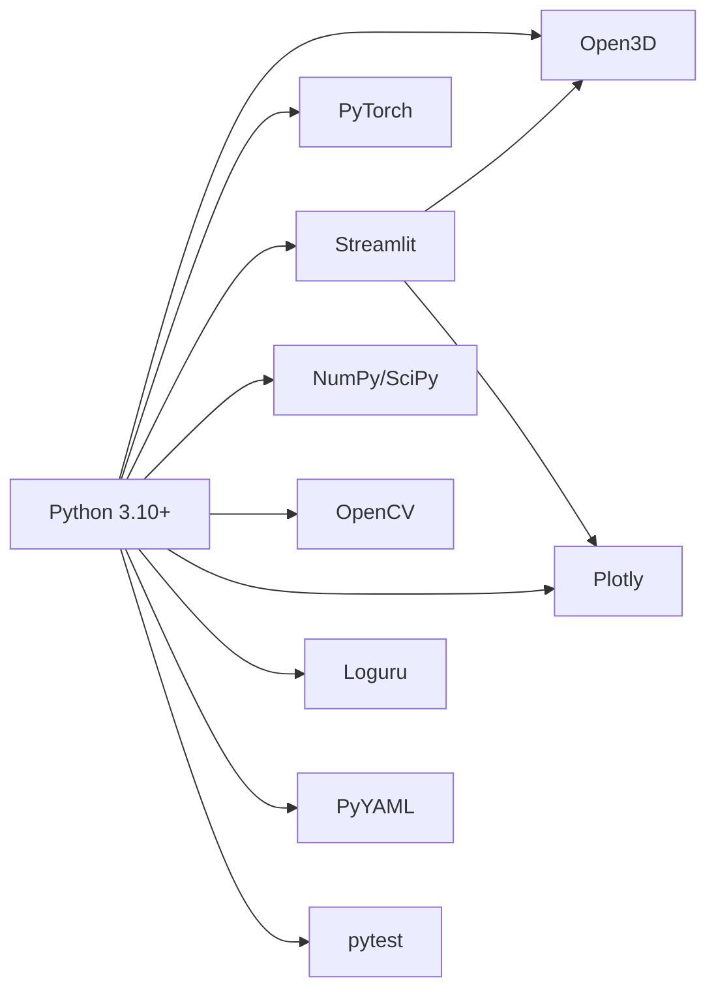

# 技术栈选型

<cite>
**本文引用的文件**   
- [requirements.txt](file://requirements.txt)
- [Dockerfile](file://Dockerfile)
- [docker-compose.yml](file://docker-compose.yml)
- [app.py](file://app.py)
- [src/detection/detector.py](file://src/detection/detector.py)
- [src/data_capture/azure_kinect.py](file://src/data_capture/azure_kinect.py)
- [src/preprocessing/pipeline.py](file://src/preprocessing/pipeline.py)
- [src/detection/rules.py](file://src/detection/rules.py)
- [src/preprocessing/clustering.py](file://src/preprocessing/clustering.py)
- [src/preprocessing/filtering.py](file://src/preprocessing/filtering.py)
- [src/preprocessing/segmentation.py](file://src/preprocessing/segmentation.py)
- [demos/fall_detection_demo.py](file://demos/fall_detection_demo.py)
- [README.md](file://README.md)
</cite>

## 目录
1. [引言](#引言)
2. [项目结构](#项目结构)
3. [核心组件](#核心组件)
4. [架构总览](#架构总览)
5. [详细组件分析](#详细组件分析)
6. [依赖关系分析](#依赖关系分析)
7. [性能考量](#性能考量)
8. [故障排查指南](#故障排查指南)
9. [结论](#结论)
10. [附录](#附录)

## 引言
本文件围绕GuardianFall系统的“技术栈选型”展开，系统采用Python 3.10+、Open3D、PyTorch、Streamlit为核心技术，并通过Docker容器化实现环境一致性、部署便利性和可移植性。本文将从技术选型动机、版本兼容性、性能特性、扩展能力、替代方案对比、生态与社区支持、未来趋势等方面进行全面分析，并提供架构图与依赖关系图，帮助读者全面理解系统的技术基础。

## 项目结构
项目采用模块化分层组织，核心模块包括：
- 数据采集层：Azure Kinect DK SDK封装，负责深度图与点云采集
- 预处理层：点云滤波、地面分割、聚类，形成人体簇
- 检测层：基于规则的状态机检测，输出报警
- 应用层：Streamlit Web界面，提供可视化与交互
- 部署层：Docker镜像与Compose编排，支持Redis缓存与Nginx反向代理

```mermaid
graph TB
subgraph "感知层"
AK["Azure Kinect DK<br/>深度相机"]
end
subgraph "算法层"
PF["滤波模块<br/>Statistical/Radius/Voxel"]
GS["地面分割<br/>RANSAC"]
CL["聚类模块<br/>Euclidean/DBSCAN"]
RD["规则检测器<br/>状态机"]
end
subgraph "应用层"
UI["Streamlit Web UI"]
end
subgraph "部署层"
DF["Dockerfile"]
DC["docker-compose.yml"]
REDIS["Redis 缓存"]
NGINX["Nginx 反向代理"]
end
AK --> PF --> GS --> CL --> RD --> UI
UI <- --> DF
UI <- --> DC
UI <- --> REDIS
UI <- --> NGINX
```

**图表来源**
- [src/data_capture/azure_kinect.py:47-134](file://src/data_capture/azure_kinect.py#L47-L134)
- [src/preprocessing/filtering.py:13-139](file://src/preprocessing/filtering.py#L13-L139)
- [src/preprocessing/segmentation.py:13-81](file://src/preprocessing/segmentation.py#L13-L81)
- [src/preprocessing/clustering.py:99-181](file://src/preprocessing/clustering.py#L99-L181)
- [src/detection/rules.py:226-337](file://src/detection/rules.py#L226-L337)
- [app.py:16-29](file://app.py#L16-L29)
- [Dockerfile:4-49](file://Dockerfile#L4-L49)
- [docker-compose.yml:8-72](file://docker-compose.yml#L8-L72)

**章节来源**
- [README.md:61-96](file://README.md#L61-L96)

## 核心组件
- Python 3.10+：统一开发与运行环境，确保与Open3D、PyTorch等依赖兼容；Streamlit与现代生态良好配合
- Open3D：点云处理核心库，提供滤波、地面分割、聚类、可视化等能力
- PyTorch：深度学习框架，为后续AI增强模块（如PointNet++、ST-GCN）预留接口
- Streamlit：Web界面与Demo展示，便于演示与调试
- Docker：容器化部署，保证环境一致性与可移植性

**章节来源**
- [requirements.txt:1-34](file://requirements.txt#L1-L34)
- [Dockerfile:4-15](file://Dockerfile#L4-L15)
- [app.py:16-29](file://app.py#L16-L29)

## 架构总览
系统采用“感知-算法-应用-部署”的分层架构，数据从Azure Kinect采集，经Open3D处理与规则检测，最终在Streamlit中呈现。Docker与Compose提供一致的运行环境与服务编排。



**图表来源**
- [src/data_capture/azure_kinect.py:285-343](file://src/data_capture/azure_kinect.py#L285-L343)
- [src/preprocessing/pipeline.py:98-139](file://src/preprocessing/pipeline.py#L98-L139)
- [src/detection/detector.py:138-227](file://src/detection/detector.py#L138-L227)
- [app.py:304-450](file://app.py#L304-L450)
- [Dockerfile:44-49](file://Dockerfile#L44-L49)
- [docker-compose.yml:8-72](file://docker-compose.yml#L8-L72)

## 详细组件分析

### 点云预处理Pipeline
- 功能：体素降采样、统计滤波去噪、地面分割、人体聚类
- 性能：支持批量处理与实时Pipeline，具备平均FPS统计
- 扩展：可切换聚类算法（Euclidean/DBSCAN/MultiView）



**图表来源**
- [src/preprocessing/pipeline.py:98-139](file://src/preprocessing/pipeline.py#L98-L139)
- [src/preprocessing/filtering.py:13-49](file://src/preprocessing/filtering.py#L13-L49)
- [src/preprocessing/segmentation.py:41-81](file://src/preprocessing/segmentation.py#L41-L81)
- [src/preprocessing/clustering.py:124-181](file://src/preprocessing/clustering.py#L124-L181)

**章节来源**
- [src/preprocessing/pipeline.py:65-178](file://src/preprocessing/pipeline.py#L65-L178)
- [src/preprocessing/filtering.py:13-139](file://src/preprocessing/filtering.py#L13-L139)
- [src/preprocessing/segmentation.py:13-137](file://src/preprocessing/segmentation.py#L13-L137)
- [src/preprocessing/clustering.py:99-181](file://src/preprocessing/clustering.py#L99-L181)

### 规则检测器与状态机
- 功能：基于高度骤降、速度、姿态、静止等规则，结合状态机（NORMAL/SUSPECTED/CONFIRMED/RECOVERING/FAKE_ALARM）
- 报警级别：info/warning/critical，支持置信度与历史帧确认
- 可视化：在UI中展示检测结果与报警历史



**图表来源**
- [src/detection/rules.py:22-28](file://src/detection/rules.py#L22-L28)
- [src/detection/rules.py:190-224](file://src/detection/rules.py#L190-L224)

**章节来源**
- [src/detection/rules.py:226-423](file://src/detection/rules.py#L226-L423)

### Streamlit Web界面
- 功能：实时3D点云显示、检测结果可视化、报警历史、参数配置、数据管理
- 交互：侧边栏控制面板、Tab页组织、配置持久化
- 性能：模拟帧率控制、处理时间统计、FPS趋势图



**图表来源**
- [app.py:105-134](file://app.py#L105-L134)
- [src/detection/detector.py:138-227](file://src/detection/detector.py#L138-L227)
- [src/preprocessing/pipeline.py:98-139](file://src/preprocessing/pipeline.py#L98-L139)
- [src/detection/rules.py:266-337](file://src/detection/rules.py#L266-L337)

**章节来源**
- [app.py:104-450](file://app.py#L104-L450)

### Azure Kinect数据采集
- 功能：深度图转点云、多帧录制、元数据保存、设备信息打印
- 兼容性：支持多种深度模式与彩色分辨率，提供错误提示与连接诊断
- 实时性：按帧率控制，支持持续捕获



**图表来源**
- [src/data_capture/azure_kinect.py:152-191](file://src/data_capture/azure_kinect.py#L152-L191)
- [src/data_capture/azure_kinect.py:216-283](file://src/data_capture/azure_kinect.py#L216-L283)
- [src/data_capture/azure_kinect.py:285-343](file://src/data_capture/azure_kinect.py#L285-L343)

**章节来源**
- [src/data_capture/azure_kinect.py:47-134](file://src/data_capture/azure_kinect.py#L47-L134)
- [src/data_capture/azure_kinect.py:152-343](file://src/data_capture/azure_kinect.py#L152-L343)

### Docker容器化方案
- 基础镜像：python:3.10-slim，轻量化且与项目依赖匹配
- 系统依赖：安装OpenGL/GTK/FFmpeg/USB设备库，满足Open3D与相机SDK需求
- 端口与健康检查：暴露8501端口，Streamlit健康检查
- Compose编排：主应用、Redis缓存、Nginx反向代理，网络隔离与资源限制



**图表来源**
- [Dockerfile:4-49](file://Dockerfile#L4-L49)
- [docker-compose.yml:8-72](file://docker-compose.yml#L8-L72)
- [docker-compose.yml:74-101](file://docker-compose.yml#L74-L101)
- [docker-compose.yml:102-135](file://docker-compose.yml#L102-L135)

**章节来源**
- [Dockerfile:1-50](file://Dockerfile#L1-L50)
- [docker-compose.yml:1-149](file://docker-compose.yml#L1-L149)

## 依赖关系分析
- Python生态：NumPy/SciPy/PyTorch/Opencv/Plotly/Loguru/PyYAML/pytest
- Open3D：点云处理与可视化
- Streamlit：Web界面与Demo
- Docker：环境一致性与部署



**图表来源**
- [requirements.txt:1-34](file://requirements.txt#L1-L34)
- [app.py:16-29](file://app.py#L16-L29)

**章节来源**
- [requirements.txt:1-34](file://requirements.txt#L1-L34)

## 性能考量
- 处理速度：目标帧率>20 FPS，单帧耗时<100ms
- 内存占用：<2GB，CPU占用<50%（2核）
- 实时性：UI模拟30 FPS，系统统计平均FPS与处理时间
- 可扩展性：Pipeline支持批量与实时模式，检测器支持多簇追踪

**章节来源**
- [README.md:201-218](file://README.md#L201-L218)
- [src/preprocessing/pipeline.py:199-248](file://src/preprocessing/pipeline.py#L199-L248)
- [src/detection/detector.py:261-272](file://src/detection/detector.py#L261-L272)

## 故障排查指南
- 相机连接失败：检查USB 3.0线缆、驱动安装、是否被其他程序占用
- pyk4a未安装：安装pyk4a后重试，或使用模拟数据模式
- Docker健康检查失败：确认Streamlit端口映射与健康检查URL
- 性能异常：调整体素尺寸、聚类容忍度、确认帧数等参数

**章节来源**
- [src/data_capture/azure_kinect.py:177-184](file://src/data_capture/azure_kinect.py#L177-L184)
- [demos/fall_detection_demo.py:189-195](file://demos/fall_detection_demo.py#L189-L195)
- [Dockerfile:44-46](file://Dockerfile#L44-L46)

## 结论
GuardianFall的技术栈选型体现了“成熟生态+工程落地”的平衡：Python 3.10+提供稳定的运行环境，Open3D与PyTorch支撑点云与AI增强，Streamlit兼顾演示与交互，Docker保障部署一致性与可移植性。该组合在准确性、实时性与可维护性之间取得良好折中，适合从原型到生产的演进路径。

## 附录

### 技术栈选型要点与替代方案对比
- Python 3.10+
  - 优点：生态成熟、与Open3D/PyTorch兼容性好、社区支持强
  - 替代：3.9/3.11，但需验证依赖兼容性
- Open3D
  - 优点：点云处理完备、与PCL生态互通、可视化友好
  - 替代：PCL（C++）、Pypointcloud（Python），但Open3D在Python生态更易集成
- PyTorch
  - 优点：易于扩展AI模块、与CUDA生态协同
  - 替代：TensorFlow/Keras，但PyTorch在研究与快速迭代中更常用
- Streamlit
  - 优点：零前端经验即可构建Web界面、适合演示与原型
  - 替代：Dash/FastAPI+React，但开发成本更高
- Docker
  - 优点：环境一致、部署便捷、可移植性强
  - 替代：虚拟机/裸机部署，但缺乏标准化与可移植性

**章节来源**
- [requirements.txt:1-34](file://requirements.txt#L1-L34)
- [Dockerfile:4-15](file://Dockerfile#L4-L15)
- [README.md:330-337](file://README.md#L330-L337)