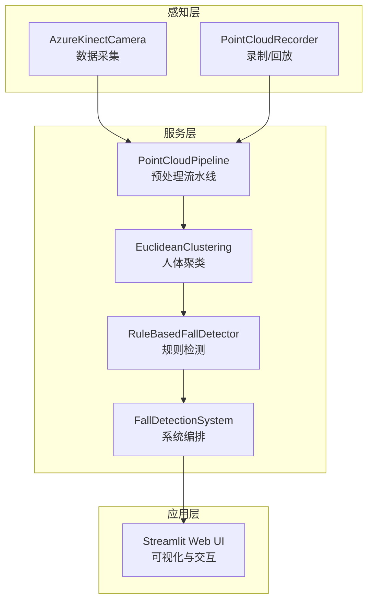
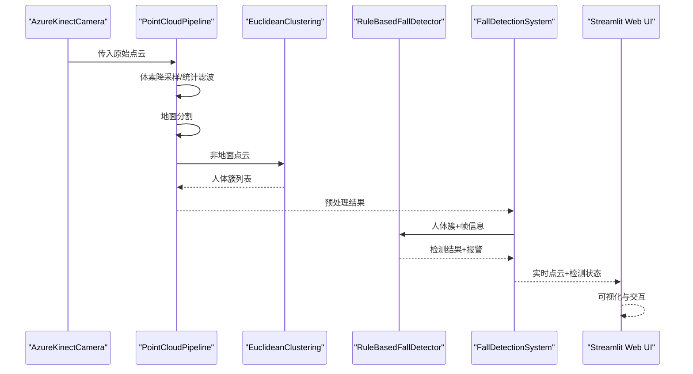
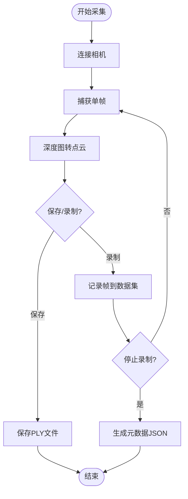
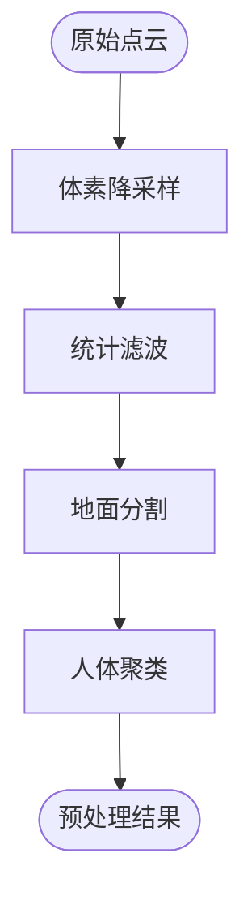
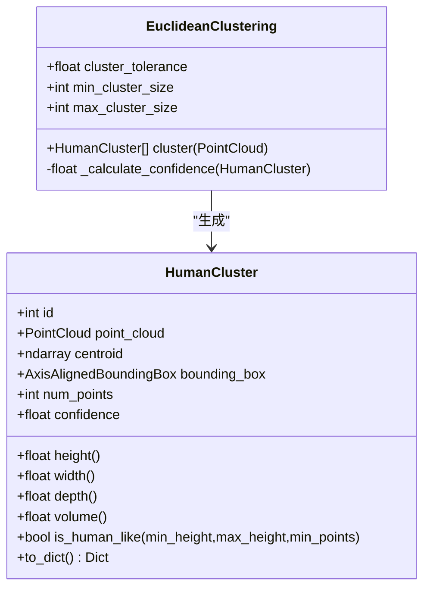
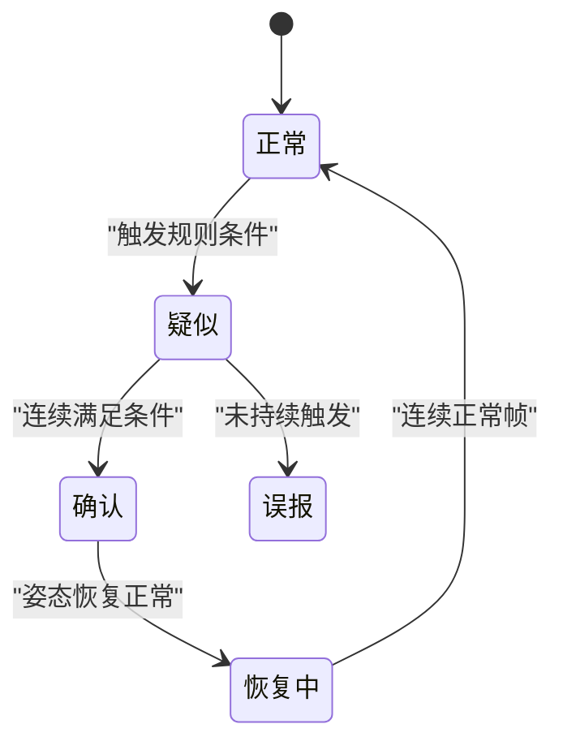
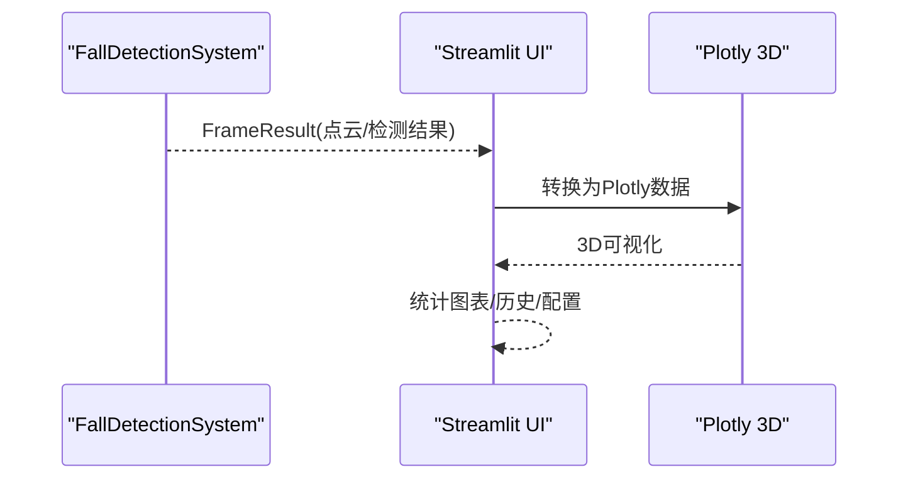
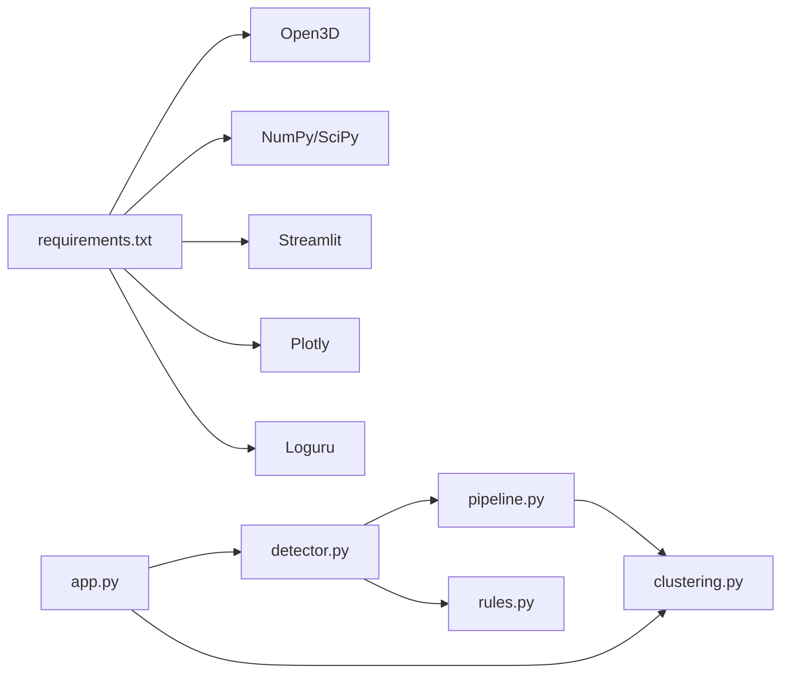
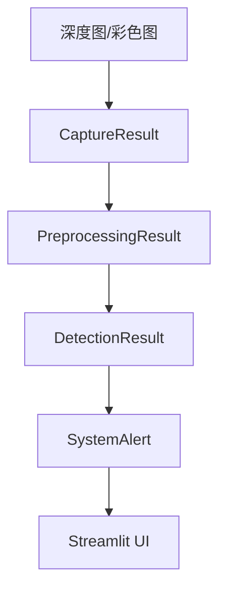

# 数据流设计

<cite>
**本文档引用的文件**
- [app.py](file://app.py)
- [azure_kinect.py](file://src/data_capture/azure_kinect.py)
- [recorder.py](file://src/data_capture/recorder.py)
- [pipeline.py](file://src/preprocessing/pipeline.py)
- [clustering.py](file://src/preprocessing/clustering.py)
- [detector.py](file://src/detection/detector.py)
- [rules.py](file://src/detection/rules.py)
- [fall_detection_demo.py](file://demos/fall_detection_demo.py)
- [requirements.txt](file://requirements.txt)
- [README.md](file://README.md)
</cite>

## 目录
1. [引言](#引言)
2. [项目结构](#项目结构)
3. [核心组件](#核心组件)
4. [架构总览](#架构总览)
5. [详细组件分析](#详细组件分析)
6. [依赖关系分析](#依赖关系分析)
7. [性能考虑](#性能考虑)
8. [故障排查指南](#故障排查指南)
9. [结论](#结论)
10. [附录](#附录)

## 引言
本文件面向开发者与系统集成人员，系统性梳理GuardianFall从硬件数据采集到Web界面可视化的完整数据流设计。重点涵盖：
- 原始点云数据的采集与转换
- 预处理流水线的阶段划分与数据结构
- 检测算法的处理过程与状态机
- 结果数据格式与Web界面渲染流程
- 关键数据结构设计理念（PointCloud、HumanCluster、DetectionResult等）
- 数据缓存策略、内存管理与性能优化
- 数据流图与关键节点的数据格式示例

## 项目结构
GuardianFall采用模块化分层设计，围绕“感知层-服务层-应用层”的架构组织代码：
- 感知层：Azure Kinect DK 数据采集与录制回放
- 服务层：点云预处理、人体聚类、摔倒检测与报警
- 应用层：Streamlit Web 界面与可视化

**图表来源**
- [azure_kinect.py:47-460](file://src/data_capture/azure_kinect.py#L47-L460)
- [recorder.py:48-437](file://src/data_capture/recorder.py#L48-L437)
- [pipeline.py:65-178](file://src/preprocessing/pipeline.py#L65-L178)
- [clustering.py:99-181](file://src/preprocessing/clustering.py#L99-L181)
- [rules.py:226-337](file://src/detection/rules.py#L226-L337)
- [detector.py:75-283](file://src/detection/detector.py#L75-L283)
- [app.py:16-662](file://app.py#L16-L662)

**章节来源**
- [README.md:61-86](file://README.md#L61-L86)

## 核心组件
- AzureKinectCamera：负责从硬件相机采集深度图与点云，提供单帧捕获、连续捕获、点云保存与录制能力。
- PointCloudPipeline：统一的预处理流水线，包含体素降采样、统计滤波、地面分割、人体聚类四个阶段。
- EuclideanClustering：基于Open3D DBSCAN的欧式聚类，提取人体簇并计算几何特征与置信度。
- RuleBasedFallDetector：基于规则的状态机检测器，结合高度骤降、速度、姿态与静止等指标判定摔倒。
- FallDetectionSystem：系统编排器，串联预处理与检测，并生成报警回调。
- Streamlit Web UI：实时3D点云可视化、检测结果展示、报警历史与系统状态监控。

**章节来源**
- [azure_kinect.py:47-460](file://src/data_capture/azure_kinect.py#L47-L460)
- [pipeline.py:65-178](file://src/preprocessing/pipeline.py#L65-L178)
- [clustering.py:99-181](file://src/preprocessing/clustering.py#L99-L181)
- [rules.py:226-337](file://src/detection/rules.py#L226-L337)
- [detector.py:75-283](file://src/detection/detector.py#L75-L283)
- [app.py:16-662](file://app.py#L16-L662)

## 架构总览
GuardianFall的数据流从硬件采集开始，经过预处理与检测，最终在Web界面呈现。整体流程如下：

**图表来源**
- [azure_kinect.py:216-283](file://src/data_capture/azure_kinect.py#L216-L283)
- [pipeline.py:98-139](file://src/preprocessing/pipeline.py#L98-L139)
- [clustering.py:124-181](file://src/preprocessing/clustering.py#L124-L181)
- [rules.py:266-337](file://src/detection/rules.py#L266-L337)
- [detector.py:138-227](file://src/detection/detector.py#L138-L227)
- [app.py:346-420](file://app.py#L346-L420)

## 详细组件分析

### 数据采集与录制（AzureKinectCamera 与 Recorder）
- 数据采集
  - 通过相机SDK获取深度图与彩色图，将深度图转换为Open3D点云。
  - 支持单帧捕获、连续捕获与录制元数据。
- 录制与回放
  - 录制器将点云序列保存为PLY文件，生成包含帧信息的元数据JSON。
  - 数据集加载器支持迭代帧、缓存与标注管理。

**图表来源**
- [azure_kinect.py:216-283](file://src/data_capture/azure_kinect.py#L216-L283)
- [recorder.py:87-175](file://src/data_capture/recorder.py#L87-L175)

**章节来源**
- [azure_kinect.py:47-460](file://src/data_capture/azure_kinect.py#L47-L460)
- [recorder.py:48-437](file://src/data_capture/recorder.py#L48-L437)

### 预处理流水线（PointCloudPipeline）
- 流水线阶段
  - 体素降采样：降低点云密度，提升后续处理速度。
  - 统计滤波：去除离群点，提升鲁棒性。
  - 地面分割：分离地面与非地面点云。
  - 人体聚类：对非地面点进行欧式聚类，得到人体簇。
- 关键数据结构
  - PreprocessingResult：封装原始点数、滤波后点数、地面/非地面点数、人体簇列表与处理耗时。

**图表来源**
- [pipeline.py:98-139](file://src/preprocessing/pipeline.py#L98-L139)

**章节来源**
- [pipeline.py:65-178](file://src/preprocessing/pipeline.py#L65-L178)

### 人体聚类（EuclideanClustering）
- 聚类算法
  - 基于Open3D DBSCAN的欧式聚类，支持阈值与点数范围过滤。
- 几何特征与置信度
  - 通过包围盒计算高度、宽度、深度与体积；综合高度、点数与宽高比计算置信度。
- 可视化
  - 支持将簇点云着色并绘制包围盒，便于调试与展示。

**图表来源**
- [clustering.py:15-97](file://src/preprocessing/clustering.py#L15-L97)
- [clustering.py:99-181](file://src/preprocessing/clustering.py#L99-L181)

**章节来源**
- [clustering.py:99-181](file://src/preprocessing/clustering.py#L99-L181)

### 摔倒检测（RuleBasedFallDetector 与 FallDetectionSystem）
- 检测规则
  - 高度骤降：单位时间内高度显著下降。
  - 快速下落：垂直速度超过阈值。
  - 躺倒姿态：宽高比小于阈值。
  - 高度阈值：低于阈值可能为摔倒。
- 状态机
  - NORMAL → SUSPECTED → CONFIRMED → RECOVERING → NORMAL，支持误报与恢复识别。
- 系统编排
  - FallDetectionSystem串联预处理与检测，生成FrameResult与报警回调，支持连续处理与统计信息。

**图表来源**
- [rules.py:22-29](file://src/detection/rules.py#L22-L29)
- [rules.py:190-224](file://src/detection/rules.py#L190-L224)

**章节来源**
- [rules.py:226-337](file://src/detection/rules.py#L226-L337)
- [detector.py:75-283](file://src/detection/detector.py#L75-L283)

### Web 界面渲染（Streamlit）
- 实时监控
  - 3D点云可视化（Plotly），显示当前帧人数、摔倒状态与处理时间。
- 统计图表
  - FPS趋势、处理时间趋势与报警类型分布。
- 报警历史
  - 过滤与导出CSV，支持级别筛选。
- 数据管理
  - 数据集列表、元数据展示与配置导入导出。

**图表来源**
- [app.py:346-420](file://app.py#L346-L420)
- [app.py:452-533](file://app.py#L452-L533)
- [app.py:535-588](file://app.py#L535-L588)

**章节来源**
- [app.py:16-662](file://app.py#L16-L662)

## 依赖关系分析
- 外部依赖
  - Open3D：点云处理与可视化。
  - NumPy/SciPy：数值计算与统计。
  - Streamlit/Plotly：Web界面与图表。
  - Loguru：结构化日志。
- 内部模块耦合
  - detector依赖pipeline与clustering；rules依赖clustering；app依赖detector与clustering。
- 可能的循环依赖
  - 未发现循环依赖，模块职责清晰。

**图表来源**
- [requirements.txt:1-34](file://requirements.txt#L1-L34)
- [detector.py:20-22](file://src/detection/detector.py#L20-L22)
- [pipeline.py:19-21](file://src/preprocessing/pipeline.py#L19-L21)
- [clustering.py:8-12](file://src/preprocessing/clustering.py#L8-L12)
- [rules.py:13-19](file://src/detection/rules.py#L13-L19)
- [app.py:16-31](file://app.py#L16-L31)

**章节来源**
- [requirements.txt:1-34](file://requirements.txt#L1-L34)

## 性能考虑
- 处理延迟与吞吐
  - 系统目标延迟<100ms，目标处理速度>20FPS，内存占用<2GB。
- 优化策略
  - 体素降采样与统计滤波降低点云规模。
  - DBSCAN聚类与阈值过滤限制簇数量与大小。
  - 实时Pipeline维护最近30帧FPS历史，便于动态调参。
  - Web UI使用Plotly渲染，避免阻塞主线程。
- 内存管理
  - 数据集加载器对帧进行缓存，避免重复IO；支持清理缓存。
  - 点云对象生命周期由Open3D管理，注意及时释放不再使用的对象。

**章节来源**
- [README.md:201-218](file://README.md#L201-L218)
- [pipeline.py:180-248](file://src/preprocessing/pipeline.py#L180-L248)
- [recorder.py:245-280](file://src/data_capture/recorder.py#L245-L280)

## 故障排查指南
- 相机连接失败
  - 检查USB 3.0线缆、驱动安装与设备占用情况。
  - 参考相机模块的错误提示与日志。
- 处理异常
  - 检查Open3D版本与依赖安装。
  - 逐步缩小到具体模块（采集→预处理→检测→UI）。
- Web界面问题
  - 确认端口开放与依赖安装。
  - 查看浏览器控制台与服务器日志。

**章节来源**
- [azure_kinect.py:152-184](file://src/data_capture/azure_kinect.py#L152-L184)
- [app.py:13-14](file://app.py#L13-L14)

## 结论
GuardianFall通过清晰的模块化设计与稳健的数据流，实现了从硬件采集到Web可视化的完整闭环。关键数据结构与状态机确保了检测的准确性与可解释性，同时Web界面提供了直观的监控与分析能力。建议在实际部署中结合硬件性能与场景需求，动态调整阈值与参数，持续优化处理延迟与内存占用。

## 附录

### 关键数据结构与字段定义
- CaptureResult（采集结果）
  - 字段：timestamp、depth_image、point_cloud、color_image、num_points、has_point_cloud
  - 用途：封装单帧采集结果，便于后续处理与保存。
- PreprocessingResult（预处理结果）
  - 字段：original_points、filtered_points、ground_points、non_ground_points、human_clusters、processing_time_ms、num_humans、has_humans、to_dict()
  - 用途：汇总预处理阶段统计与人体簇列表。
- HumanCluster（人体簇）
  - 字段：id、point_cloud、centroid、bounding_box、num_points、confidence、height、width、depth、volume、is_human_like()、to_dict()
  - 用途：描述人体几何特征与置信度，支撑检测与可视化。
- DetectionResult（检测结果）
  - 字段：timestamp、frame_id、cluster_id、state、confidence、height、height_change、velocity、aspect_ratio、is_lying、alert_triggered、alert_level、message、to_dict()
  - 用途：记录单帧检测指标与报警信息。
- SystemAlert（系统报警）
  - 字段：timestamp、alert_type、cluster_id、message、confidence、location、metadata、to_dict()
  - 用途：统一报警格式，便于回调与持久化。
- FrameResult（单帧处理结果）
  - 字段：frame_id、timestamp、preprocessing、detections、alerts、processing_time_ms、has_fall、num_people、num_falls
  - 用途：系统编排器的统一输出，便于UI展示与统计。

**章节来源**
- [azure_kinect.py:32-45](file://src/data_capture/azure_kinect.py#L32-L45)
- [pipeline.py:24-63](file://src/preprocessing/pipeline.py#L24-L63)
- [clustering.py:15-97](file://src/preprocessing/clustering.py#L15-L97)
- [rules.py:31-79](file://src/detection/rules.py#L31-L79)
- [detector.py:25-73](file://src/detection/detector.py#L25-L73)

### 数据流图与关键节点示例
- 采集阶段
  - 输入：深度图/彩色图
  - 输出：CaptureResult（含点云）
- 预处理阶段
  - 输入：原始点云
  - 输出：PreprocessingResult（含人体簇列表）
- 检测阶段
  - 输入：人体簇列表
  - 输出：DetectionResult（含报警级别与消息）
- Web渲染阶段
  - 输入：FrameResult
  - 输出：3D点云、统计图表、报警历史

**图表来源**
- [azure_kinect.py:216-283](file://src/data_capture/azure_kinect.py#L216-L283)
- [pipeline.py:98-139](file://src/preprocessing/pipeline.py#L98-L139)
- [rules.py:266-337](file://src/detection/rules.py#L266-L337)
- [detector.py:138-227](file://src/detection/detector.py#L138-L227)
- [app.py:346-420](file://app.py#L346-L420)

### 使用示例与参考路径
- 模拟数据Demo
  - [fall_detection_demo.py:92-179](file://demos/fall_detection_demo.py#L92-L179)
- 真实相机Demo
  - [fall_detection_demo.py:181-271](file://demos/fall_detection_demo.py#L181-L271)
- 录制数据集Demo
  - [fall_detection_demo.py:273-325](file://demos/fall_detection_demo.py#L273-L325)

**章节来源**
- [fall_detection_demo.py:1-373](file://demos/fall_detection_demo.py#L1-L373)