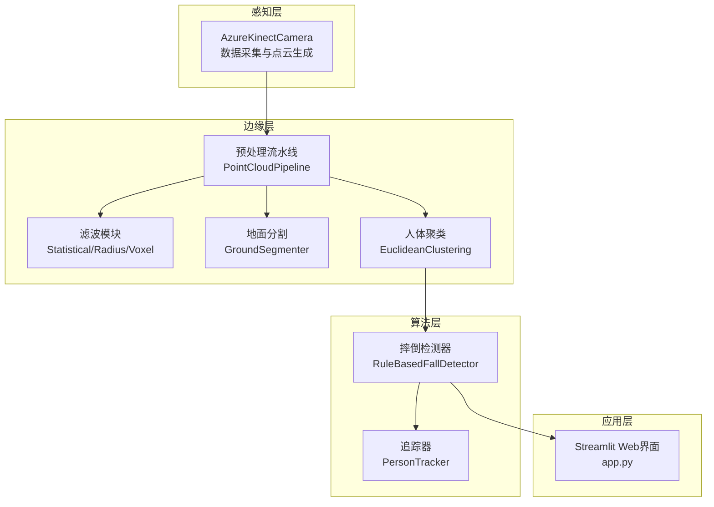
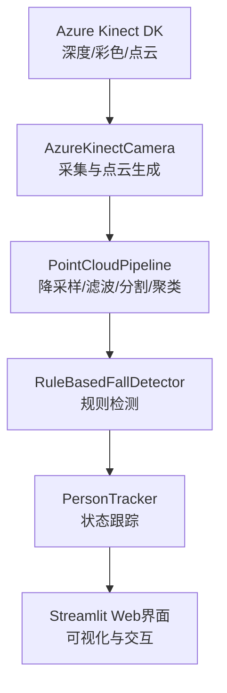
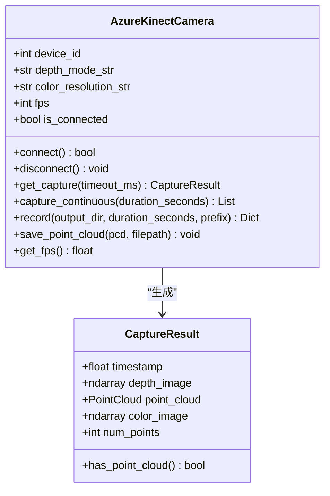
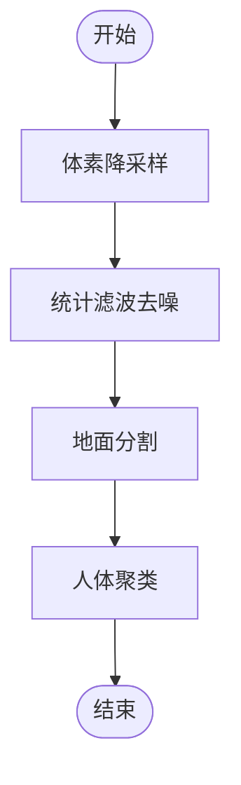
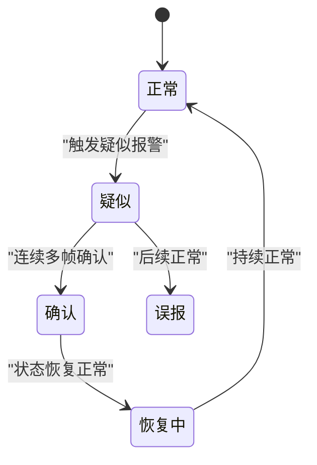
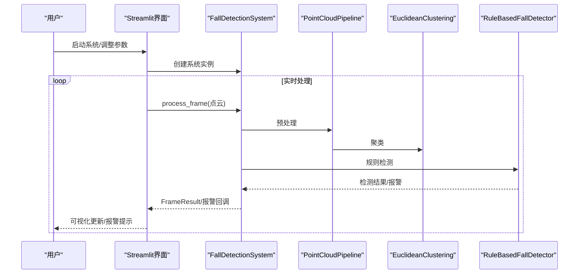
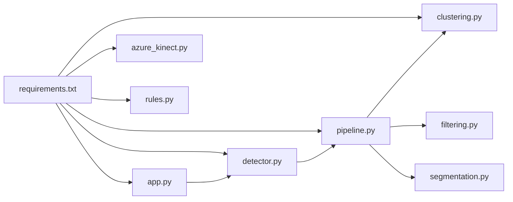
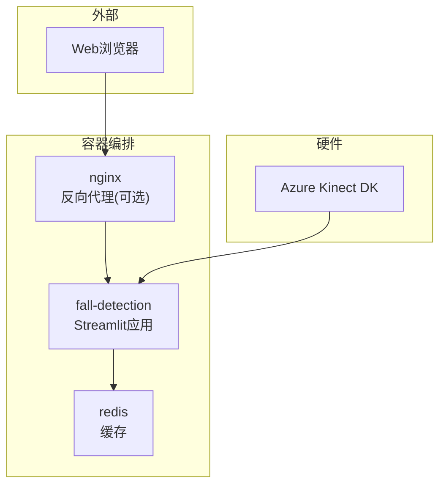
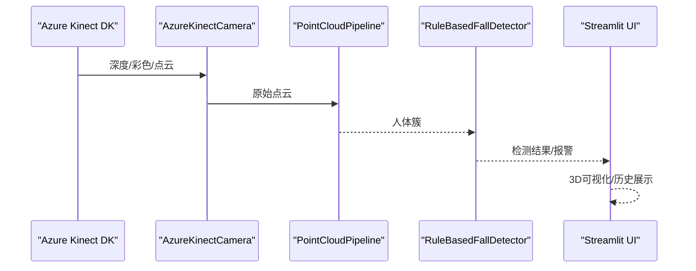

# 系统架构

<cite>
**本文档引用的文件**
- [app.py](file://app.py)
- [src/data_capture/azure_kinect.py](file://src/data_capture/azure_kinect.py)
- [src/preprocessing/pipeline.py](file://src/preprocessing/pipeline.py)
- [src/preprocessing/filtering.py](file://src/preprocessing/filtering.py)
- [src/preprocessing/segmentation.py](file://src/preprocessing/segmentation.py)
- [src/preprocessing/clustering.py](file://src/preprocessing/clustering.py)
- [src/detection/detector.py](file://src/detection/detector.py)
- [src/detection/rules.py](file://src/detection/rules.py)
- [docker-compose.yml](file://docker-compose.yml)
- [Dockerfile](file://Dockerfile)
- [requirements.txt](file://requirements.txt)
- [deploy.sh](file://deploy.sh)
- [monitor.sh](file://monitor.sh)
- [docs/DEPLOYMENT_GUIDE.md](file://docs/DEPLOYMENT_GUIDE.md)
</cite>

## 目录
1. [简介](#简介)
2. [项目结构](#项目结构)
3. [核心组件](#核心组件)
4. [架构总览](#架构总览)
5. [详细组件分析](#详细组件分析)
6. [依赖关系分析](#依赖关系分析)
7. [性能考量](#性能考量)
8. [故障排查指南](#故障排查指南)
9. [结论](#结论)
10. [附录](#附录)

## 简介
GuardianFall 是一个基于点云的实时摔倒检测系统，采用分层架构设计，覆盖从硬件采集到Web可视化的完整处理链路。系统通过感知层（Azure Kinect DK）采集深度与点云数据，边缘层进行点云预处理（降采样、滤波、地面分割、聚类），算法层执行基于规则的摔倒检测，应用层提供Streamlit Web界面进行可视化与交互。系统同时提供容器化部署、健康检查、日志轮转与运维脚本，便于在生产环境中稳定运行。

## 项目结构
系统采用按功能域划分的模块化组织：
- 感知层：src/data_capture/azure_kinect.py
- 预处理层：src/preprocessing/（pipeline、filtering、segmentation、clustering）
- 检测层：src/detection/（detector、rules）
- 应用层：app.py（Streamlit Web界面）
- 部署与运维：Dockerfile、docker-compose.yml、deploy.sh、monitor.sh、requirements.txt、docs/DEPLOYMENT_GUIDE.md

**图表来源**
- [src/data_capture/azure_kinect.py:47-460](file://src/data_capture/azure_kinect.py#L47-L460)
- [src/preprocessing/pipeline.py:65-178](file://src/preprocessing/pipeline.py#L65-L178)
- [src/preprocessing/filtering.py:13-189](file://src/preprocessing/filtering.py#L13-L189)
- [src/preprocessing/segmentation.py:13-243](file://src/preprocessing/segmentation.py#L13-L243)
- [src/preprocessing/clustering.py:99-495](file://src/preprocessing/clustering.py#L99-L495)
- [src/detection/detector.py:75-283](file://src/detection/detector.py#L75-L283)
- [src/detection/rules.py:226-446](file://src/detection/rules.py#L226-L446)
- [app.py:1-662](file://app.py#L1-L662)

**章节来源**
- [app.py:1-662](file://app.py#L1-L662)
- [src/data_capture/azure_kinect.py:1-532](file://src/data_capture/azure_kinect.py#L1-L532)
- [src/preprocessing/pipeline.py:1-337](file://src/preprocessing/pipeline.py#L1-L337)
- [src/preprocessing/filtering.py:1-189](file://src/preprocessing/filtering.py#L1-L189)
- [src/preprocessing/segmentation.py:1-243](file://src/preprocessing/segmentation.py#L1-L243)
- [src/preprocessing/clustering.py:1-495](file://src/preprocessing/clustering.py#L1-L495)
- [src/detection/detector.py:1-373](file://src/detection/detector.py#L1-L373)
- [src/detection/rules.py:1-526](file://src/detection/rules.py#L1-L526)

## 核心组件
- 感知层组件：AzureKinectCamera，负责连接硬件、捕获深度图与彩色图，并生成Open3D点云；支持连续捕获、录制与元数据保存。
- 预处理组件：PointCloudPipeline，串联体素降采样、统计滤波、地面分割与人体聚类；提供实时优化版RealTimePipeline。
- 检测组件：RuleBasedFallDetector，基于高度骤降、速度、姿态与静止等规则进行摔倒判定，并通过PersonTracker进行状态跟踪与确认帧机制。
- 应用组件：Streamlit Web界面，提供实时点云可视化、检测结果展示、报警历史、配置管理与统计图表。

**章节来源**
- [src/data_capture/azure_kinect.py:47-460](file://src/data_capture/azure_kinect.py#L47-L460)
- [src/preprocessing/pipeline.py:65-268](file://src/preprocessing/pipeline.py#L65-L268)
- [src/detection/detector.py:75-283](file://src/detection/detector.py#L75-L283)
- [src/detection/rules.py:226-446](file://src/detection/rules.py#L226-L446)
- [app.py:1-662](file://app.py#L1-L662)

## 架构总览
系统采用“感知-边缘-算法-应用”的分层架构，数据从硬件采集开始，依次经过预处理、检测与可视化，形成闭环。系统通过Docker Compose进行容器化编排，包含主应用、Redis缓存与可选Nginx反向代理，具备健康检查与日志轮转能力。

**图表来源**
- [src/data_capture/azure_kinect.py:216-440](file://src/data_capture/azure_kinect.py#L216-L440)
- [src/preprocessing/pipeline.py:98-178](file://src/preprocessing/pipeline.py#L98-L178)
- [src/detection/detector.py:138-227](file://src/detection/detector.py#L138-L227)
- [src/detection/rules.py:226-446](file://src/detection/rules.py#L226-L446)
- [app.py:308-450](file://app.py#L308-L450)

**章节来源**
- [docker-compose.yml:6-149](file://docker-compose.yml#L6-L149)
- [Dockerfile:1-50](file://Dockerfile#L1-L50)

## 详细组件分析

### 感知层：AzureKinectCamera
- 职责：封装pyk4a SDK，提供相机连接、捕获、深度图到点云转换、连续捕获与录制。
- 关键特性：深度模式与彩色分辨率配置、帧率控制、超时处理、点云保存与元数据生成。
- 错误处理：连接失败、异常捕获、设备信息打印与用户提示。

**图表来源**
- [src/data_capture/azure_kinect.py:47-460](file://src/data_capture/azure_kinect.py#L47-L460)

**章节来源**
- [src/data_capture/azure_kinect.py:1-532](file://src/data_capture/azure_kinect.py#L1-L532)

### 预处理层：PointCloudPipeline
- 职责：统一的点云预处理流水线，包含体素降采样、统计滤波、地面分割与人体聚类。
- 实时优化：RealTimePipeline提供帧计数、平均FPS统计与历史记录。
- 结果结构：PreprocessingResult包含原始点数、滤波后点数、地面/非地面点数、人体簇列表与处理耗时。

**图表来源**
- [src/preprocessing/pipeline.py:98-178](file://src/preprocessing/pipeline.py#L98-L178)

**章节来源**
- [src/preprocessing/pipeline.py:1-337](file://src/preprocessing/pipeline.py#L1-L337)
- [src/preprocessing/filtering.py:1-189](file://src/preprocessing/filtering.py#L1-L189)
- [src/preprocessing/segmentation.py:1-243](file://src/preprocessing/segmentation.py#L1-L243)
- [src/preprocessing/clustering.py:1-495](file://src/preprocessing/clustering.py#L1-L495)

### 算法层：摔倒检测器与规则引擎
- 职责：基于规则的摔倒检测，结合高度骤降、速度、姿态与静止等指标，通过PersonTracker进行状态跟踪与确认帧机制。
- 状态机：NORMAL → SUSPECTED → CONFIRMED → RECOVERING → FALSE_ALARM，支持连续帧确认与恢复判断。
- 报警级别：info/warning/critical，分别对应正常、疑似与确认摔倒。

**图表来源**
- [src/detection/rules.py:22-89](file://src/detection/rules.py#L22-L89)
- [src/detection/rules.py:190-224](file://src/detection/rules.py#L190-L224)

**章节来源**
- [src/detection/detector.py:1-373](file://src/detection/detector.py#L1-L373)
- [src/detection/rules.py:1-526](file://src/detection/rules.py#L1-L526)

### 应用层：Streamlit Web界面
- 职责：提供实时监控、统计图表、报警历史与数据管理；支持参数配置、配置导入导出与数据集浏览。
- 可视化：3D点云渲染、检测结果展示、报警级别提示与历史记录导出。
- 交互：启动/停止/重置系统、滑块调节参数、系统信息展示。

**图表来源**
- [app.py:104-270](file://app.py#L104-L270)
- [src/detection/detector.py:138-227](file://src/detection/detector.py#L138-L227)
- [src/preprocessing/pipeline.py:98-178](file://src/preprocessing/pipeline.py#L98-L178)
- [src/detection/rules.py:266-337](file://src/detection/rules.py#L266-L337)

**章节来源**
- [app.py:1-662](file://app.py#L1-L662)

## 依赖关系分析
- 技术栈：Python生态（numpy、open3d、streamlit、loguru等），Docker容器化，Docker Compose编排。
- 外部依赖：pyk4a（Azure Kinect SDK）、Open3D（点云处理）、Redis（会话缓存）、Nginx（可选反向代理）。
- 组件耦合：应用层依赖检测层，检测层依赖预处理层，预处理层依赖滤波/分割/聚类模块；各模块内部通过工厂函数解耦。

**图表来源**
- [requirements.txt:1-34](file://requirements.txt#L1-L34)
- [app.py:29-30](file://app.py#L29-L30)
- [src/detection/detector.py:20-22](file://src/detection/detector.py#L20-L22)
- [src/preprocessing/pipeline.py:19-21](file://src/preprocessing/pipeline.py#L19-L21)

**章节来源**
- [requirements.txt:1-34](file://requirements.txt#L1-L34)

## 性能考量
- 体素降采样：通过降低点云密度减少计算量，提升实时性。
- 统计滤波：去除离群点，提高后续分割与聚类的稳定性。
- 地面分割：RANSAC平面拟合，快速分离地面与非地面点。
- 聚类算法：Open3D DBSCAN（欧式聚类）在人体簇上表现稳定，结合置信度评估。
- 规则检测：高度骤降、速度阈值、姿态与静止等规则组合，避免单一指标误判。
- 容器化优化：Docker资源限制、健康检查与日志轮转，保障服务稳定性与可观测性。

[本节为通用性能讨论，不直接分析具体文件]

## 故障排查指南
- 服务无法启动：检查Docker状态、端口占用、内存与依赖安装；查看容器日志与健康检查。
- Web界面不可访问：确认防火墙放行、Nginx配置（如启用）、Streamlit端口监听。
- 性能低下：增大体素尺寸、降低帧率、增加服务器资源、使用SSD存储。
- 频繁崩溃：查看崩溃日志、检查内存不足与依赖版本兼容性，必要时增加Swap。
- Docker相关问题：停止所有容器、删除镜像与数据卷、清理系统后重新构建部署。

**章节来源**
- [docs/DEPLOYMENT_GUIDE.md:329-415](file://docs/DEPLOYMENT_GUIDE.md#L329-L415)
- [deploy.sh:39-102](file://deploy.sh#L39-L102)
- [monitor.sh:26-76](file://monitor.sh#L26-L76)

## 结论
GuardianFall系统通过清晰的分层架构实现了从硬件采集到Web可视化的完整链路。感知层提供高质量点云，边缘层进行高效预处理，算法层以规则引擎实现鲁棒的摔倒检测，应用层以Streamlit提供直观的可视化与交互。配合Docker容器化与运维脚本，系统具备良好的可扩展性、可维护性与生产可用性。未来可在算法层引入AI模型与边缘推理加速，在应用层扩展多相机融合与报警联动能力。

[本节为总结性内容，不直接分析具体文件]

## 附录

### 系统边界与部署拓扑
- 边界：硬件（Azure Kinect DK）、容器（主应用、Redis、Nginx）、Web浏览器（Streamlit UI）。
- 拓扑：主应用容器通过端口映射暴露Web服务，Redis用于会话缓存，Nginx作为可选反向代理与SSL终止。

**图表来源**
- [docker-compose.yml:6-149](file://docker-compose.yml#L6-L149)
- [Dockerfile:1-50](file://Dockerfile#L1-L50)

**章节来源**
- [docker-compose.yml:1-149](file://docker-compose.yml#L1-L149)
- [Dockerfile:1-50](file://Dockerfile#L1-L50)

### 关键流程：从硬件到Web可视化
- 硬件采集：AzureKinectCamera捕获深度图与彩色图，生成点云。
- 预处理：PointCloudPipeline执行降采样、滤波、地面分割与聚类。
- 检测：RuleBasedFallDetector基于规则与状态机进行摔倒判定。
- 可视化：Streamlit界面实时渲染点云与检测结果，展示报警历史与统计图表。

**图表来源**
- [src/data_capture/azure_kinect.py:216-284](file://src/data_capture/azure_kinect.py#L216-L284)
- [src/preprocessing/pipeline.py:98-178](file://src/preprocessing/pipeline.py#L98-L178)
- [src/detection/detector.py:138-227](file://src/detection/detector.py#L138-L227)
- [app.py:308-450](file://app.py#L308-L450)

**章节来源**
- [src/data_capture/azure_kinect.py:1-532](file://src/data_capture/azure_kinect.py#L1-L532)
- [src/preprocessing/pipeline.py:1-337](file://src/preprocessing/pipeline.py#L1-L337)
- [src/detection/detector.py:1-373](file://src/detection/detector.py#L1-L373)
- [app.py:1-662](file://app.py#L1-L662)