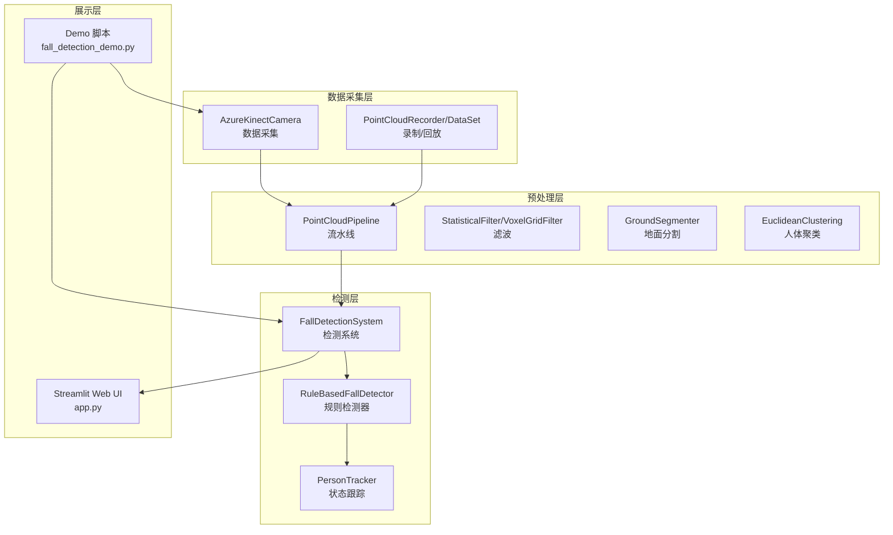
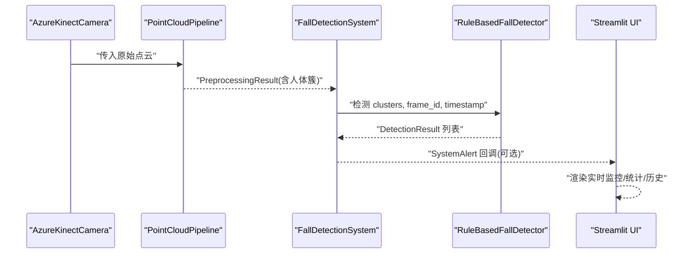
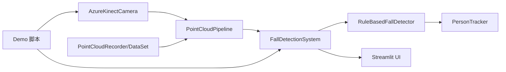
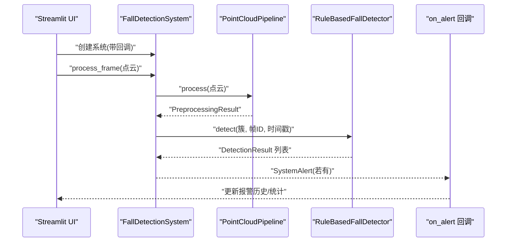

# 组件交互关系

<cite>
**本文引用的文件**
- [app.py](file://app.py)
- [src/data_capture/azure_kinect.py](file://src/data_capture/azure_kinect.py)
- [src/data_capture/recorder.py](file://src/data_capture/recorder.py)
- [src/preprocessing/pipeline.py](file://src/preprocessing/pipeline.py)
- [src/preprocessing/filtering.py](file://src/preprocessing/filtering.py)
- [src/preprocessing/segmentation.py](file://src/preprocessing/segmentation.py)
- [src/preprocessing/clustering.py](file://src/preprocessing/clustering.py)
- [src/detection/detector.py](file://src/detection/detector.py)
- [src/detection/rules.py](file://src/detection/rules.py)
- [demos/fall_detection_demo.py](file://demos/fall_detection_demo.py)
- [requirements.txt](file://requirements.txt)
</cite>

## 目录
1. [简介](#简介)
2. [项目结构](#项目结构)
3. [核心组件](#核心组件)
4. [架构总览](#架构总览)
5. [详细组件分析](#详细组件分析)
6. [依赖关系分析](#依赖关系分析)
7. [性能考量](#性能考量)
8. [故障排查指南](#故障排查指南)
9. [结论](#结论)
10. [附录](#附录)

## 简介
本文件聚焦于 GuardianFall 系统的组件交互关系，围绕“数据采集模块”“预处理模块”“检测模块”“Web 界面”的协作展开，解释各模块之间的依赖、调用顺序、数据传递机制，以及事件驱动、回调与异步处理策略。同时给出组件生命周期管理、资源分配与释放策略，辅以时序图与依赖关系图，帮助开发者理解系统的动态行为。

## 项目结构
GuardianFall 采用模块化分层组织：
- 数据采集层：Azure Kinect 相机封装与数据录制/回放
- 预处理层：体素降采样、统计滤波、地面分割、人体聚类
- 检测层：基于规则的摔倒检测与状态机
- 展示层：Streamlit Web UI 与 Demo 脚本

图表来源
- [app.py:1-662](file://app.py#L1-L662)
- [src/data_capture/azure_kinect.py:1-532](file://src/data_capture/azure_kinect.py#L1-L532)
- [src/data_capture/recorder.py:1-489](file://src/data_capture/recorder.py#L1-L489)
- [src/preprocessing/pipeline.py:1-337](file://src/preprocessing/pipeline.py#L1-L337)
- [src/preprocessing/filtering.py:1-189](file://src/preprocessing/filtering.py#L1-L189)
- [src/preprocessing/segmentation.py:1-243](file://src/preprocessing/segmentation.py#L1-L243)
- [src/preprocessing/clustering.py:1-495](file://src/preprocessing/clustering.py#L1-L495)
- [src/detection/detector.py:1-373](file://src/detection/detector.py#L1-L373)
- [src/detection/rules.py:1-526](file://src/detection/rules.py#L1-L526)
- [demos/fall_detection_demo.py:1-373](file://demos/fall_detection_demo.py#L1-L373)

章节来源
- [app.py:1-662](file://app.py#L1-L662)
- [src/data_capture/azure_kinect.py:1-532](file://src/data_capture/azure_kinect.py#L1-L532)
- [src/data_capture/recorder.py:1-489](file://src/data_capture/recorder.py#L1-L489)
- [src/preprocessing/pipeline.py:1-337](file://src/preprocessing/pipeline.py#L1-L337)
- [src/preprocessing/filtering.py:1-189](file://src/preprocessing/filtering.py#L1-L189)
- [src/preprocessing/segmentation.py:1-243](file://src/preprocessing/segmentation.py#L1-L243)
- [src/preprocessing/clustering.py:1-495](file://src/preprocessing/clustering.py#L1-L495)
- [src/detection/detector.py:1-373](file://src/detection/detector.py#L1-L373)
- [src/detection/rules.py:1-526](file://src/detection/rules.py#L1-L526)
- [demos/fall_detection_demo.py:1-373](file://demos/fall_detection_demo.py#L1-L373)

## 核心组件
- 数据采集模块
  - AzureKinectCamera：封装相机连接、捕获、深度图转点云、连续捕获、录制等能力
  - PointCloudRecorder/PointCloudDataset：录制点云序列、保存元数据、加载/回放数据集
- 预处理模块
  - PointCloudPipeline：串联体素降采样、统计滤波、地面分割、人体聚类
  - Filtering/Segmentation/Clustering：具体算法实现
- 检测模块
  - FallDetectionSystem：系统入口，负责调用预处理与检测，触发报警回调
  - RuleBasedFallDetector + PersonTracker：基于规则的检测与状态跟踪
- 展示模块
  - Streamlit Web UI：实时监控、统计图表、报警历史、数据管理
  - Demo 脚本：模拟/相机/录制三种模式的演示

章节来源
- [src/data_capture/azure_kinect.py:1-532](file://src/data_capture/azure_kinect.py#L1-L532)
- [src/data_capture/recorder.py:1-489](file://src/data_capture/recorder.py#L1-L489)
- [src/preprocessing/pipeline.py:1-337](file://src/preprocessing/pipeline.py#L1-L337)
- [src/preprocessing/filtering.py:1-189](file://src/preprocessing/filtering.py#L1-L189)
- [src/preprocessing/segmentation.py:1-243](file://src/preprocessing/segmentation.py#L1-L243)
- [src/preprocessing/clustering.py:1-495](file://src/preprocessing/clustering.py#L1-L495)
- [src/detection/detector.py:1-373](file://src/detection/detector.py#L1-L373)
- [src/detection/rules.py:1-526](file://src/detection/rules.py#L1-L526)
- [app.py:1-662](file://app.py#L1-L662)
- [demos/fall_detection_demo.py:1-373](file://demos/fall_detection_demo.py#L1-L373)

## 架构总览
GuardianFall 的运行链路遵循“采集 → 预处理 → 检测 → 可视化/报警”的闭环：
- 数据采集层提供原始点云
- 预处理层产出人体簇集合
- 检测层基于簇状态与规则判定摔倒
- 展示层接收检测结果并呈现

图表来源
- [src/data_capture/azure_kinect.py:216-284](file://src/data_capture/azure_kinect.py#L216-L284)
- [src/preprocessing/pipeline.py:98-139](file://src/preprocessing/pipeline.py#L98-L139)
- [src/detection/detector.py:138-227](file://src/detection/detector.py#L138-L227)
- [src/detection/rules.py:266-337](file://src/detection/rules.py#L266-L337)
- [app.py:109-131](file://app.py#L109-L131)

## 详细组件分析

### 数据采集模块
- AzureKinectCamera
  - 负责连接设备、配置参数、捕获帧、深度图转点云、保存点云、录制序列
  - 提供连续捕获与录制接口，便于 Demo 与实际部署
- PointCloudRecorder/PointCloudDataset
  - 支持录制帧、保存元数据、加载/迭代帧、标注、导出格式等
  - 为离线测试与训练提供数据支撑

章节来源
- [src/data_capture/azure_kinect.py:1-532](file://src/data_capture/azure_kinect.py#L1-L532)
- [src/data_capture/recorder.py:1-489](file://src/data_capture/recorder.py#L1-L489)

### 预处理模块
- PointCloudPipeline
  - 串联：体素降采样 → 统计滤波去噪 → 地面分割 → 人体聚类
  - 提供批量处理与实时优化版本，记录处理时间与统计
- Filtering/Segmentation/Clustering
  - StatisticalFilter/RadiusFilter/VoxelGridFilter：降采样与去噪
  - GroundSegmenter：RANSAC 地面分割
  - EuclideanClustering：基于 DBSCAN 的人体聚类，输出 HumanCluster

章节来源
- [src/preprocessing/pipeline.py:1-337](file://src/preprocessing/pipeline.py#L1-L337)
- [src/preprocessing/filtering.py:1-189](file://src/preprocessing/filtering.py#L1-L189)
- [src/preprocessing/segmentation.py:1-243](file://src/preprocessing/segmentation.py#L1-L243)
- [src/preprocessing/clustering.py:1-495](file://src/preprocessing/clustering.py#L1-L495)

### 检测模块
- FallDetectionSystem
  - 组合预处理与规则检测，生成 FrameResult，触发 SystemAlert 回调
  - 支持连续处理与统计信息查询
- RuleBasedFallDetector + PersonTracker
  - 基于高度骤降、速度、姿态、静止等规则，结合状态机（疑似/确认/恢复/误报）
  - 对每个簇维护追踪器，跨帧累积证据，达到阈值后触发报警

章节来源
- [src/detection/detector.py:1-373](file://src/detection/detector.py#L1-L373)
- [src/detection/rules.py:1-526](file://src/detection/rules.py#L1-L526)

### 展示模块
- Streamlit Web UI
  - 提供系统控制、参数配置、实时监控、统计图表、报警历史、数据管理
  - 通过回调接收报警并更新界面
- Demo 脚本
  - 模拟/相机/录制三种模式，验证端到端流程

章节来源
- [app.py:1-662](file://app.py#L1-L662)
- [demos/fall_detection_demo.py:1-373](file://demos/fall_detection_demo.py#L1-L373)

## 依赖关系分析

图表来源
- [src/data_capture/azure_kinect.py:1-532](file://src/data_capture/azure_kinect.py#L1-L532)
- [src/data_capture/recorder.py:1-489](file://src/data_capture/recorder.py#L1-L489)
- [src/preprocessing/pipeline.py:1-337](file://src/preprocessing/pipeline.py#L1-L337)
- [src/detection/detector.py:1-373](file://src/detection/detector.py#L1-L373)
- [src/detection/rules.py:1-526](file://src/detection/rules.py#L1-L526)
- [app.py:1-662](file://app.py#L1-L662)
- [demos/fall_detection_demo.py:1-373](file://demos/fall_detection_demo.py#L1-L373)

章节来源
- [requirements.txt:1-34](file://requirements.txt#L1-L34)

## 性能考量
- 预处理阶段
  - 体素降采样显著减少点数，提升后续处理效率
  - 统计滤波去除离群点，提高地面分割与聚类稳定性
- 检测阶段
  - 基于规则的状态机避免复杂模型，保证低延迟
  - 通过确认帧数与阈值调节误报率
- 展示阶段
  - Streamlit 为轻量可视化；若需更高吞吐，可考虑后台服务 + 前端分离

[本节为通用指导，不直接分析具体文件]

## 故障排查指南
- 相机连接问题
  - 确认驱动安装、USB 3.0 线缆、设备占用情况
  - 参考相机模块的错误日志与提示
- 数据采集异常
  - 检查帧率与深度模式配置，确保与硬件匹配
- 预处理失败
  - 检查点数是否过少、地面分割是否合理
- 检测误报/漏报
  - 调整高度骤降阈值、速度阈值、确认帧数与宽高比阈值
- UI 无响应
  - 检查回调函数是否抛出异常，确认会话状态与配置持久化

章节来源
- [src/data_capture/azure_kinect.py:152-191](file://src/data_capture/azure_kinect.py#L152-L191)
- [src/detection/detector.py:186-192](file://src/detection/detector.py#L186-L192)
- [app.py:195-208](file://app.py#L195-L208)

## 结论
GuardianFall 通过清晰的模块边界与事件驱动回调，实现了从数据采集到检测报警的完整链路。预处理模块与检测模块之间以标准化数据结构衔接，Web 界面通过回调与统计接口实现可观测性与可配置性。建议在生产环境中结合硬件性能与业务需求，持续优化阈值与并发策略，确保低延迟与高稳定性。

[本节为总结性内容，不直接分析具体文件]

## 附录

### 组件生命周期与资源管理
- 相机生命周期
  - 连接/断开：connect/disconnect
  - 连续捕获：capture_continuous
  - 录制：record/save_point_cloud
- 预处理生命周期
  - Pipeline 初始化即创建子模块实例
  - process/process_batch 返回结果并记录处理时间
- 检测生命周期
  - 系统初始化时创建 Pipeline 与检测器
  - process_frame/process_continuous 处理帧并更新统计
  - reset 重置状态与统计
- UI 生命周期
  - session_state 管理运行状态、配置、历史记录
  - 回调 on_alert 注册于系统初始化

章节来源
- [src/data_capture/azure_kinect.py:152-191](file://src/data_capture/azure_kinect.py#L152-L191)
- [src/preprocessing/pipeline.py:65-97](file://src/preprocessing/pipeline.py#L65-L97)
- [src/detection/detector.py:75-137](file://src/detection/detector.py#L75-L137)
- [app.py:84-131](file://app.py#L84-L131)

### 数据传递机制与接口
- 预处理模块与检测模块接口
  - 输入：原始点云
  - 输出：PreprocessingResult（含人体簇）
  - 检测器接收簇列表与帧信息，返回 DetectionResult 列表
- 检测模块与 Web 界面通信
  - 通过 SystemAlert 回调传递报警信息
  - UI 侧维护报警历史与统计信息

章节来源
- [src/preprocessing/pipeline.py:98-139](file://src/preprocessing/pipeline.py#L98-L139)
- [src/detection/detector.py:138-227](file://src/detection/detector.py#L138-L227)
- [app.py:109-131](file://app.py#L109-L131)

### 事件驱动与异步策略
- 事件驱动
  - 系统通过回调函数 SystemAlert 将检测结果推送给 UI
  - UI 侧 on_alert 将报警写入会话状态，自动刷新界面
- 异步处理
  - Web UI 与 Demo 脚本采用同步处理；若需高吞吐，可在后台线程/进程执行检测，UI 通过队列或轮询获取结果

章节来源
- [src/detection/detector.py:173-192](file://src/detection/detector.py#L173-L192)
- [app.py:109-131](file://app.py#L109-L131)

### 时序图：Web 界面与检测系统

图表来源
- [app.py:109-131](file://app.py#L109-L131)
- [src/detection/detector.py:138-227](file://src/detection/detector.py#L138-L227)
- [src/detection/rules.py:266-337](file://src/detection/rules.py#L266-L337)