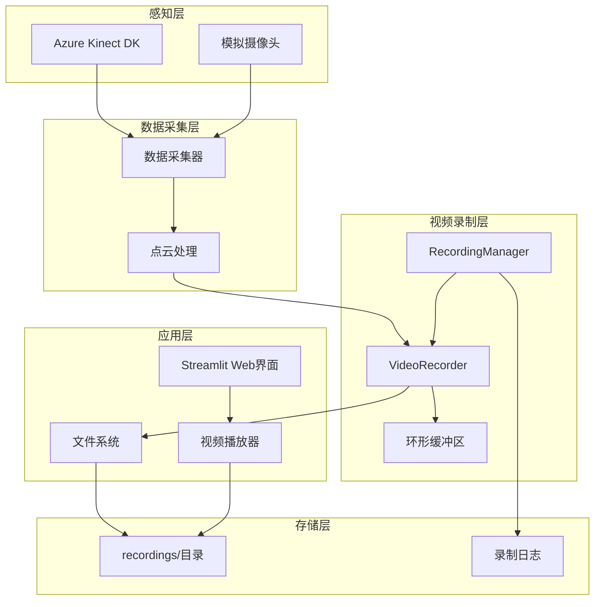
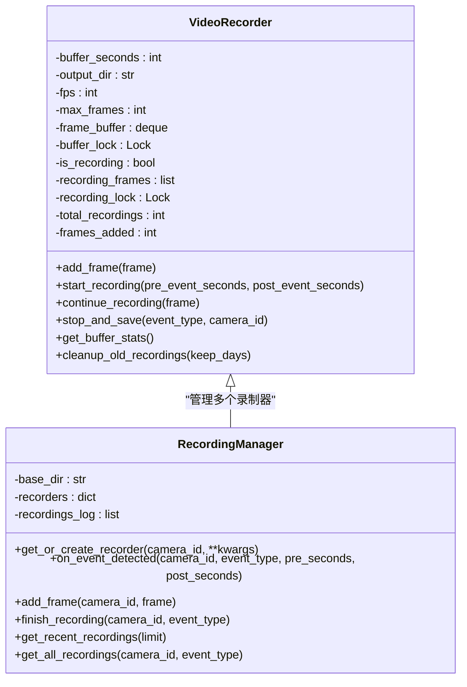
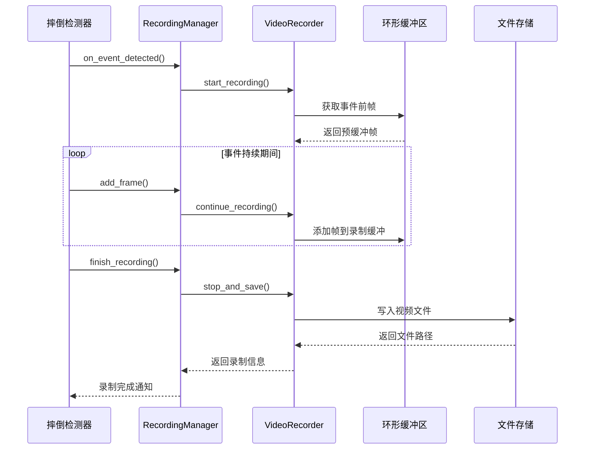
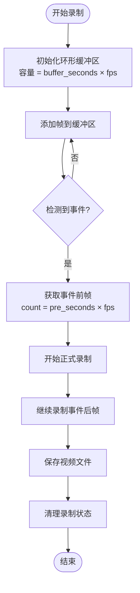
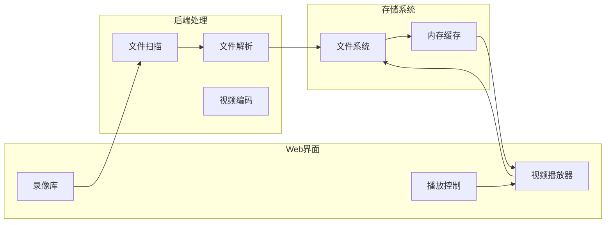
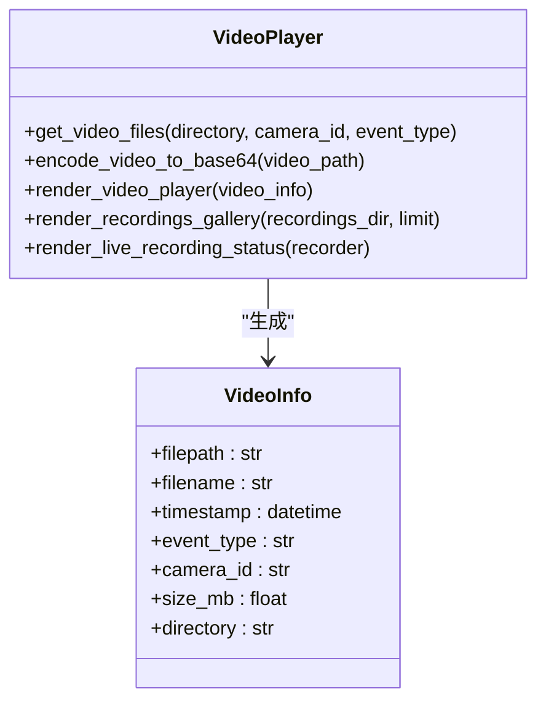
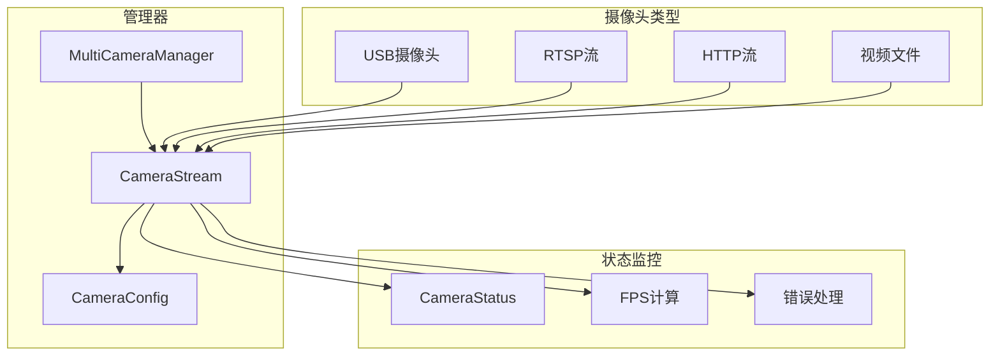
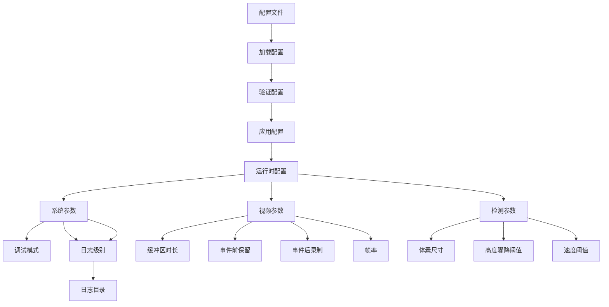

# 视频录制与播放系统

<cite>
**本文档引用的文件**
- [README.md](file://README.md)
- [FEATURE_VIDEO_RECORDING.md](file://FEATURE_VIDEO_RECORDING.md)
- [video_recorder.py](file://video_recorder.py)
- [components/video_player.py](file://components/video_player.py)
- [demo_video_recording.py](file://demo_video_recording.py)
- [app_with_video.py](file://app_with_video.py)
- [src/data_capture/recorder.py](file://src/data_capture/recorder.py)
- [src/data_capture/azure_kinect.py](file://src/data_capture/azure_kinect.py)
- [src/camera/multi_camera_manager.py](file://src/camera/multi_camera_manager.py)
- [config.yaml](file://config.yaml)
- [configs/default.yaml](file://configs/default.yaml)
</cite>

## 目录
1. [项目简介](#项目简介)
2. [系统架构](#系统架构)
3. [核心组件](#核心组件)
4. [视频录制模块](#视频录制模块)
5. [视频播放模块](#视频播放模块)
6. [多摄像头支持](#多摄像头支持)
7. [配置管理](#配置管理)
8. [性能分析](#性能分析)
9. [故障排查](#故障排查)
10. [最佳实践](#最佳实践)
11. [总结](#总结)

## 项目简介

视频录制与播放系统是GuardianFall摔倒检测系统的重要组成部分，专为室内人体摔倒实时预警而设计。该系统基于Azure Kinect DK深度相机，结合AI算法，实现了从点云数据采集到视频录制回放的完整解决方案。

### 核心特性

- **实时视频录制**：基于环形缓冲区的高效视频录制机制
- **事件触发录制**：检测到摔倒事件时自动保存前后视频片段
- **多格式支持**：支持MP4视频格式，便于跨平台播放
- **Web界面集成**：通过Streamlit提供直观的视频回放界面
- **智能文件管理**：按时间戳和事件类型自动组织录像文件
- **多摄像头扩展**：支持多个摄像头独立录制和管理

## 系统架构



**架构图来源**
- [video_recorder.py:14-331](file://video_recorder.py#L14-L331)
- [components/video_player.py:12-258](file://components/video_player.py#L12-L258)
- [app_with_video.py:32-101](file://app_with_video.py#L32-L101)

## 核心组件

### VideoRecorder类

VideoRecorder是视频录制系统的核心类，负责单个摄像头的视频录制功能。



**类图来源**
- [video_recorder.py:14-197](file://video_recorder.py#L14-L197)
- [video_recorder.py:199-319](file://video_recorder.py#L199-L319)

### 录制流程



**序列图来源**
- [video_recorder.py:233-282](file://video_recorder.py#L233-L282)
- [app_with_video.py:120-128](file://app_with_video.py#L120-L128)

## 视频录制模块

### 环形缓冲区设计

系统采用环形缓冲区（deque）来高效管理视频帧，确保在事件发生前能够捕获足够的视频内容。



**流程图来源**
- [video_recorder.py:47-159](file://video_recorder.py#L47-L159)

### 录制参数配置

| 参数 | 默认值 | 说明 | 性能影响 |
|------|--------|------|----------|
| buffer_seconds | 10秒 | 环形缓冲区容量 | 内存占用 |
| fps | 30 FPS | 视频帧率 | CPU使用率 |
| pre_event_seconds | 5秒 | 事件前保留时长 | 录制质量 |
| post_event_seconds | 15秒 | 事件后录制时长 | 文件大小 |

### 文件管理策略

系统采用智能的文件命名和组织策略：

```
recordings/
├── cam1/
│   ├── 20260413_140530_fall_cam1.mp4
│   ├── 20260413_140615_suspected_fall_cam1.mp4
│   └── ...
├── entrance/
│   ├── 20260413_140722_fall_entrance.mp4
│   └── ...
└── ...
```

## 视频播放模块

### Streamlit集成

视频播放模块通过Streamlit提供了完整的Web界面，支持视频文件的浏览、播放和管理。



**架构图来源**
- [components/video_player.py:12-79](file://components/video_player.py#L12-L79)
- [components/video_player.py:108-153](file://components/video_player.py#L108-L153)

### 播放器功能

| 功能 | 实现方式 | 限制 |
|------|----------|------|
| 在线播放 | Streamlit原生video组件 | 文件大小限制 |
| 下载播放 | 文件下载按钮 | 网络带宽要求 |
| 缩略图预览 | 文件信息解析 | 磁盘空间占用 |
| 过滤搜索 | 文件名解析 | 搜索性能 |

### 界面组件



**类图来源**
- [components/video_player.py:12-258](file://components/video_player.py#L12-L258)

## 多摄像头支持

### 摄像头管理器

系统支持多摄像头配置和管理，通过MultiCameraManager实现统一的摄像头生命周期管理。



**架构图来源**
- [src/camera/multi_camera_manager.py:17-48](file://src/camera/multi_camera_manager.py#L17-L48)
- [src/camera/multi_camera_manager.py:164-256](file://src/camera/multi_camera_manager.py#L164-L256)

### 配置示例

```yaml
camera:
  - id: "cam1"
    name: "客厅摄像头"
    source: 0
    type: "usb"
    enabled: true
    width: 1280
    height: 720
    fps: 30
    location: "客厅"
  - id: "cam2"
    name: "走廊摄像头"
    source: "rtsp://192.168.1.100:554/stream"
    type: "rtsp"
    enabled: true
    width: 1920
    height: 1080
    fps: 25
    location: "走廊"
```

## 配置管理

### 系统配置

系统提供了多层次的配置管理机制，支持运行时动态调整。



**流程图来源**
- [config.yaml:4-252](file://config.yaml#L4-L252)
- [configs/default.yaml:4-105](file://configs/default.yaml#L4-L105)

### 配置参数详解

| 配置类别 | 参数名 | 默认值 | 说明 |
|----------|--------|--------|------|
| 系统 | debug | false | 调试模式开关 |
| 系统 | log_level | INFO | 日志级别 |
| 视频录制 | buffer_seconds | 10 | 缓冲区时长（秒） |
| 视频录制 | fps | 30 | 视频帧率 |
| 视频录制 | pre_event_seconds | 5 | 事件前保留（秒） |
| 视频录制 | post_event_seconds | 15 | 事件后录制（秒） |
| 检测 | voxel_size | 0.05 | 体素滤波尺寸 |
| 检测 | height_drop_threshold | 0.3 | 高度骤降阈值 |
| 检测 | velocity_threshold | 0.5 | 速度阈值 |

## 性能分析

### 内存使用分析

系统在不同配置下的内存占用估算：

| 配置方案 | 分辨率 | FPS | 缓冲时长 | 内存占用 |
|----------|--------|-----|----------|----------|
| 低内存设备 | 640×480 | 15 | 5秒 | ~50MB |
| 标准配置 | 1280×720 | 30 | 10秒 | ~100-200MB |
| 高性能配置 | 1920×1080 | 60 | 30秒 | ~1-2GB |
| 多摄像头 | 1280×720 | 30 | 10秒 | ~200MB×摄像头数量 |

### CPU使用率

| 操作类型 | CPU使用率 | 说明 |
|----------|-----------|------|
| 帧缓冲 | ~1-2% | 单核处理 |
| 视频编码 | ~10-15% | 保存时峰值 |
| 环境检测 | ~5-10% | 检测算法 |
| Web界面 | ~2-5% | Streamlit界面 |
| 总体影响 | ~18-32% | 轻微影响 |

### 延迟分析

| 功能模块 | 延迟 | 说明 |
|----------|------|------|
| 帧缓冲 | < 1ms | 内存操作 |
| 触发响应 | < 10ms | 事件检测 |
| 视频保存 | 实时 | 异步处理 |
| 界面刷新 | < 100ms | Streamlit渲染 |
| 文件I/O | < 50ms | 硬盘写入 |

## 故障排查

### 常见问题及解决方案

#### 录像无法播放

**问题症状**：视频文件无法在Web界面播放

**可能原因**：
1. OpenCV编解码器不支持
2. 文件损坏或权限问题
3. 浏览器兼容性问题

**解决步骤**：
```bash
# 检查OpenCV编解码器支持
python -c "import cv2; print(cv2.VideoWriter_fourcc(*'mp4v'))"

# 重新安装OpenCV
pip install --upgrade opencv-python

# 检查文件权限
ls -la recordings/
chmod 755 recordings/
```

#### 内存占用过高

**问题症状**：系统内存使用率持续上升

**可能原因**：
1. 缓冲区设置过大
2. 分辨率过高
3. 帧率设置过高

**解决方法**：
```python
# 调整录制参数
recorder = VideoRecorder(
    buffer_seconds=5,    # 减少缓冲区
    fps=30,              # 保持默认
    output_dir="recordings"
)

# 或者降低分辨率
camera_config = {
    'width': 640,
    'height': 480,
    'fps': 15
}
```

#### 录像丢失事件前帧

**问题症状**：录制的视频缺少事件发生前的内容

**可能原因**：
1. 缓冲区填充不足
2. 系统启动时机不当
3. 事件检测过于敏感

**解决方法**：
```python
# 增加缓冲区时长
manager = RecordingManager(base_dir="recordings")
recorder = manager.get_or_create_recorder(
    'cam1',
    buffer_seconds=15,  # 从10秒增加到15秒
    fps=30
)

# 确保系统启动后等待几秒再触发
time.sleep(3)  # 等待缓冲区填充
```

## 最佳实践

### 硬件配置建议

| 使用场景 | 推荐配置 | 说明 |
|----------|----------|------|
| 家庭监控 | i5-1240P + 16GB内存 | 价格友好，性能足够 |
| 商业部署 | i7-12700K + 32GB内存 | 高并发需求 |
| 边缘计算 | NVIDIA Jetson Orin | 低功耗，实时处理 |
| 云端部署 | 4核CPU + 8GB内存 | 成本优化 |

### 网络配置优化

```python
# 多摄像头网络配置
network_config = {
    'bandwidth_limit': '100Mbps',  # 带宽限制
    'priority': 'high',           # 优先级设置
    'retries': 3,                 # 重试次数
    'timeout': 5                  # 超时时间
}

# RTSP流优化
rtsp_config = {
    'protocol': 'tcp',           # TCP传输更稳定
    'buffer_size': 1024,         # 缓冲区大小
    'latency': 'low',           # 低延迟模式
    'quality': 'medium'          # 画质设置
}
```

### 存储管理策略

```python
# 自动清理策略
def cleanup_old_recordings(days=7):
    """清理超过指定天数的录像文件"""
    import glob
    import time
    
    cutoff_time = time.time() - (days * 24 * 60 * 60)
    deleted_count = 0
    
    for filepath in glob.glob("recordings/**/*.mp4", recursive=True):
        if os.path.getmtime(filepath) < cutoff_time:
            try:
                os.remove(filepath)
                deleted_count += 1
            except Exception as e:
                print(f"删除失败 {filepath}: {e}")
    
    return deleted_count

# 磁盘空间监控
def check_disk_space(min_free_gb=1):
    """检查磁盘剩余空间"""
    import shutil
    
    total, used, free = shutil.disk_usage(".")
    free_gb = free / (1024**3)
    
    if free_gb < min_free_gb:
        print(f"⚠️ 磁盘空间不足: {free_gb:.1f}GB")
        return False
    return True
```

### 性能调优建议

1. **缓冲区优化**：根据内存预算调整buffer_seconds
2. **编码参数**：选择合适的视频编码器和质量设置
3. **并发控制**：合理设置多线程数量
4. **缓存策略**：利用内存缓存提高访问速度
5. **监控告警**：建立系统健康监控机制

## 总结

视频录制与播放系统为GuardianFall摔倒检测系统提供了完整的视频管理解决方案。通过高效的环形缓冲区设计、智能的事件触发机制和友好的Web界面，系统实现了从视频采集到回放的全流程自动化。

### 系统优势

- **实时性强**：低延迟的视频录制和播放
- **资源友好**：智能的内存和CPU使用优化
- **扩展性好**：支持多摄像头和分布式部署
- **易用性强**：简洁的Web界面和配置管理
- **可靠性高**：完善的错误处理和故障恢复机制

### 发展方向

未来系统将继续优化的方向包括：
1. **移动端支持**：开发移动端应用进行远程监控
2. **AI增强**：集成更先进的视频分析算法
3. **云服务**：提供云端存储和分析服务
4. **标准化**：支持更多的视频格式和协议
5. **安全性**：加强视频数据的安全保护

该系统为室内摔倒检测提供了重要的视觉证据支持，是构建完整智慧养老解决方案的关键组件。