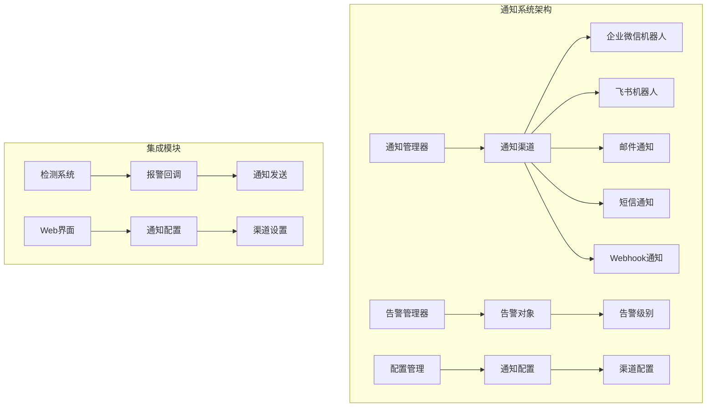
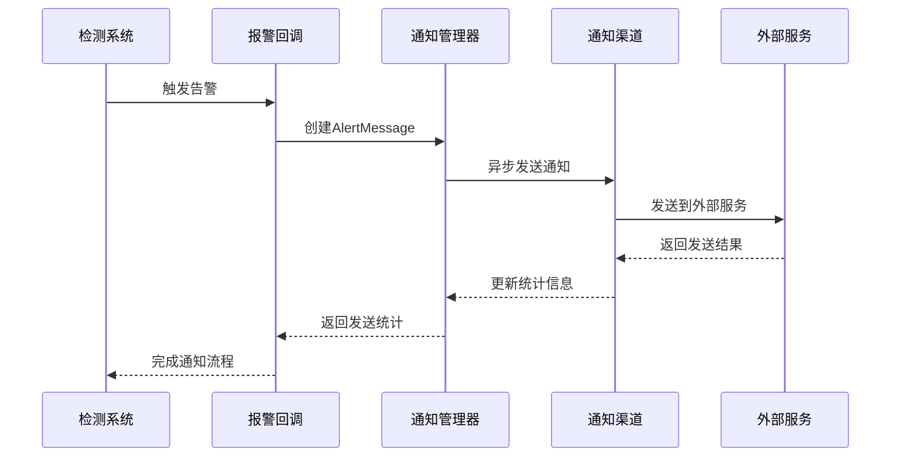
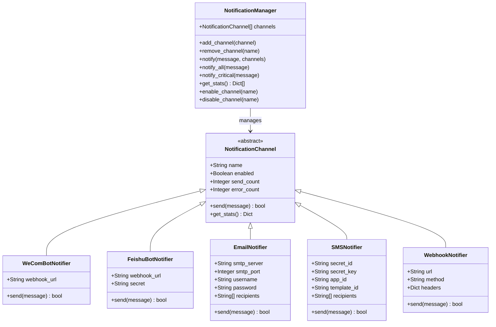
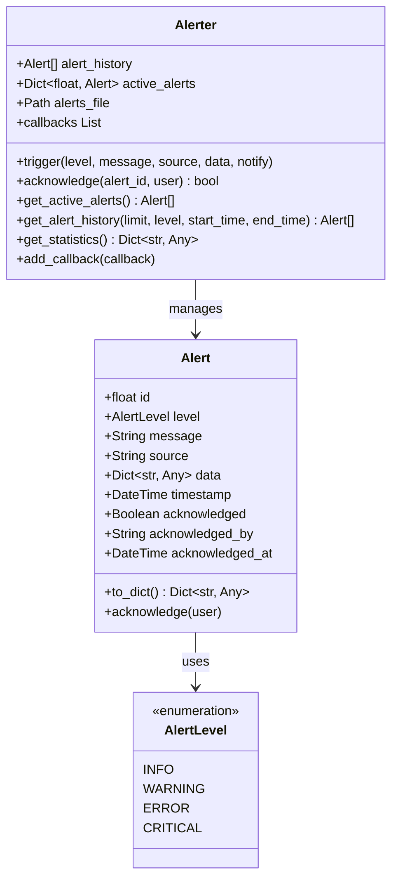
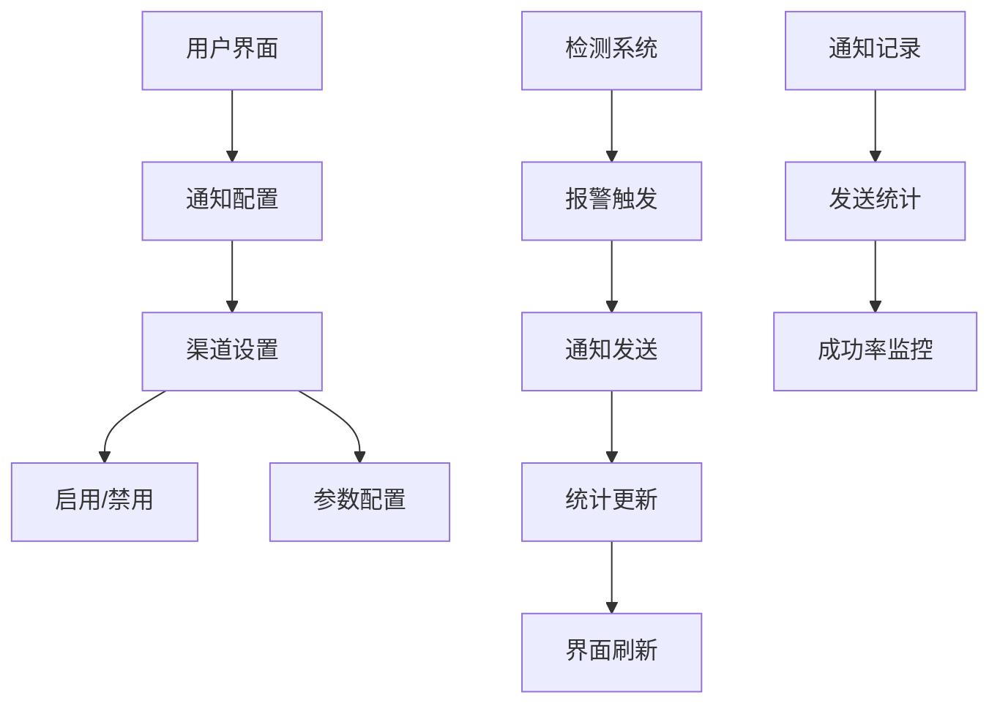
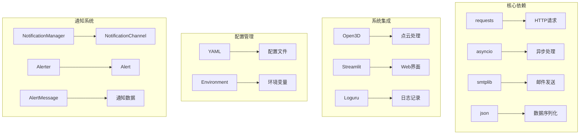

# 通知与通信系统

<cite>
**本文档引用的文件**
- [notifiers/base.py](file://notifiers/base.py)
- [src/monitoring/notifiers.py](file://src/monitoring/notifiers.py)
- [src/monitoring/alerter.py](file://src/monitoring/alerter.py)
- [app_with_notifications.py](file://app_with_notifications.py)
- [config.notifications.example.json](file://config.notifications.example.json)
- [src/detection/detector.py](file://src/detection/detector.py)
- [src/utils/config.py](file://src/utils/config.py)
- [requirements.txt](file://requirements.txt)
</cite>

## 目录
1. [简介](#简介)
2. [项目结构](#项目结构)
3. [核心组件](#核心组件)
4. [架构概览](#架构概览)
5. [详细组件分析](#详细组件分析)
6. [依赖关系分析](#依赖关系分析)
7. [性能考虑](#性能考虑)
8. [故障排除指南](#故障排除指南)
9. [结论](#结论)

## 简介

通知与通信系统是摔倒检测系统的重要组成部分，负责在检测到异常情况时及时向相关人员发送通知。该系统支持多种通知渠道，包括企业微信、飞书、邮件、短信和Webhook，并提供了完整的告警管理和通知路由机制。

系统采用异步通知机制，确保在检测到摔倒事件时能够快速响应并发送通知到多个渠道。同时，系统还提供了通知统计、渠道管理、告警历史等功能，便于监控和管理通知系统的运行状态。

## 项目结构

通知与通信系统主要分布在以下几个模块中：

**图表来源**
- [notifiers/base.py:596-682](file://notifiers/base.py#L596-L682)
- [src/monitoring/alerter.py:65-224](file://src/monitoring/alerter.py#L65-L224)

**章节来源**
- [notifiers/base.py:1-682](file://notifiers/base.py#L1-L682)
- [src/monitoring/notifiers.py:1-253](file://src/monitoring/notifiers.py#L1-L253)
- [src/monitoring/alerter.py:1-224](file://src/monitoring/alerter.py#L1-L224)

## 核心组件

通知与通信系统由以下核心组件构成：

### 通知管理器 (NotificationManager)
负责统一管理所有通知渠道，提供通知发送、渠道管理和统计功能。

### 通知渠道接口 (NotificationChannel)
定义了所有通知渠道的抽象接口，确保不同渠道的一致性。

### 告警管理器 (Alerter)
管理告警级别、触发条件和告警历史，提供告警回调机制。

### 告警对象 (Alert)
封装告警信息，包括级别、消息、来源、时间戳等属性。

**章节来源**
- [notifiers/base.py:596-682](file://notifiers/base.py#L596-L682)
- [src/monitoring/alerter.py:24-63](file://src/monitoring/alerter.py#L24-L63)

## 架构概览

系统采用分层架构设计，实现了通知渠道的统一管理和异步通知发送：

**图表来源**
- [app_with_notifications.py:219-248](file://app_with_notifications.py#L219-L248)
- [notifiers/base.py:613-642](file://notifiers/base.py#L613-L642)

系统架构特点：
- **异步通知**：使用asyncio实现并发通知发送
- **渠道管理**：统一管理多个通知渠道
- **统计监控**：实时跟踪通知发送成功率
- **灵活配置**：支持动态启用/禁用通知渠道

## 详细组件分析

### 通知管理器 (NotificationManager)

通知管理器是整个通知系统的核心，负责协调各个通知渠道的工作：

**图表来源**
- [notifiers/base.py:596-682](file://notifiers/base.py#L596-L682)
- [notifiers/base.py:57-97](file://notifiers/base.py#L57-L97)

#### 通知渠道特性

| 通知渠道 | 支持格式 | 配置要求 | 适用场景 |
|---------|---------|---------|---------|
| 企业微信机器人 | Markdown | Webhook URL | 团队协作 |
| 飞书机器人 | 交互式卡片 | Webhook URL + 密钥 | 企业内部 |
| 邮件通知 | HTML/纯文本 | SMTP配置 | 管理员通知 |
| 短信通知 | 文本 | 腾讯云凭证 | 紧急告警 |
| Webhook | JSON | URL + Headers | 自定义集成 |

**章节来源**
- [notifiers/base.py:99-176](file://notifiers/base.py#L99-L176)
- [notifiers/base.py:178-312](file://notifiers/base.py#L178-L312)
- [notifiers/base.py:314-438](file://notifiers/base.py#L314-L438)
- [notifiers/base.py:440-546](file://notifiers/base.py#L440-L546)
- [notifiers/base.py:548-594](file://notifiers/base.py#L548-L594)

### 告警管理器 (Alerter)

告警管理器负责管理告警级别、触发条件和告警历史：

**图表来源**
- [src/monitoring/alerter.py:65-224](file://src/monitoring/alerter.py#L65-L224)

#### 告警级别定义

| 级别 | 颜色 | 适用场景 | 处理优先级 |
|------|------|---------|-----------|
| INFO | 蓝色 | 系统信息 | 低 |
| WARNING | 橙色 | 疑似异常 | 中 |
| ERROR | 红色 | 系统错误 | 高 |
| CRITICAL | 红色深 | 确认摔倒 | 最高 |

**章节来源**
- [src/monitoring/alerter.py:16-22](file://src/monitoring/alerter.py#L16-L22)
- [src/monitoring/alerter.py:24-63](file://src/monitoring/alerter.py#L24-L63)

### Web界面集成

Web界面提供了完整的通知配置和管理功能：

**图表来源**
- [app_with_notifications.py:380-408](file://app_with_notifications.py#L380-L408)
- [app_with_notifications.py:677-728](file://app_with_notifications.py#L677-L728)

**章节来源**
- [app_with_notifications.py:140-186](file://app_with_notifications.py#L140-L186)
- [app_with_notifications.py:677-728](file://app_with_notifications.py#L677-L728)

## 依赖关系分析

通知系统依赖关系如下：

**图表来源**
- [requirements.txt:1-93](file://requirements.txt#L1-L93)
- [notifiers/base.py:17-31](file://notifiers/base.py#L17-L31)

**章节来源**
- [requirements.txt:1-93](file://requirements.txt#L1-L93)
- [src/utils/config.py:145-277](file://src/utils/config.py#L145-L277)

## 性能考虑

通知系统在设计时充分考虑了性能优化：

### 异步通知机制
- 使用asyncio实现并发通知发送
- 支持多个渠道同时发送而不阻塞主线程
- 异步任务管理确保资源有效利用

### 统计监控
- 实时跟踪每个渠道的发送成功率
- 记录发送和失败次数
- 提供详细的统计报告

### 内存管理
- 使用LRU缓存管理配置
- 限制告警历史数量（默认1000条）
- 及时清理过期通知记录

### 错误处理
- 每个渠道独立的错误处理
- 异常不影响其他渠道的通知发送
- 详细的错误日志记录

## 故障排除指南

### 常见问题及解决方案

#### 通知渠道无法连接
**症状**：通知发送失败，渠道状态显示错误
**可能原因**：
- 网络连接问题
- API密钥配置错误
- 服务端限制

**解决步骤**：
1. 检查网络连接状态
2. 验证API密钥和URL配置
3. 查看系统日志获取详细错误信息

#### 邮件发送失败
**症状**：邮件通知无法送达
**可能原因**：
- SMTP服务器配置错误
- 身份验证失败
- 邮件服务商限制

**解决步骤**：
1. 验证SMTP服务器地址和端口
2. 检查用户名和密码配置
3. 确认TLS/SSL设置正确

#### 通知延迟
**症状**：通知发送延迟
**可能原因**：
- 网络延迟
- API限流
- 系统负载过高

**优化建议**：
1. 检查网络带宽和延迟
2. 调整通知发送频率
3. 监控系统资源使用情况

**章节来源**
- [notifiers/base.py:79-96](file://notifiers/base.py#L79-L96)
- [src/monitoring/notifiers.py:31-58](file://src/monitoring/notifiers.py#L31-L58)

### 监控和诊断

系统提供了完善的监控功能：

#### 通知统计
- 发送成功率统计
- 失败原因分析
- 渠道性能对比

#### 告警历史
- 告警触发记录
- 处理状态跟踪
- 统计报表生成

#### 配置验证
- 实时配置检查
- 渠道连通性测试
- 自动故障检测

## 结论

通知与通信系统为摔倒检测系统提供了完整、可靠的通知解决方案。系统具有以下优势：

### 技术优势
- **多渠道支持**：支持企业微信、飞书、邮件、短信、Webhook等多种通知渠道
- **异步处理**：采用异步机制确保通知发送的高效性
- **灵活配置**：支持动态启用/禁用通知渠道和参数调整
- **完整监控**：提供详细的统计信息和故障诊断功能

### 实用价值
- **及时响应**：在检测到摔倒事件时能够快速通知相关人员
- **降低风险**：通过多渠道通知确保告警信息能够及时传达
- **易于维护**：清晰的架构设计和完善的错误处理机制
- **扩展性强**：支持新增通知渠道和自定义通知格式

### 发展前景
随着系统在实际应用中的不断完善，通知与通信系统将继续优化其性能和功能，为用户提供更加稳定、高效的告警通知服务。未来的发展方向包括支持更多通知渠道、增强个性化定制能力、提升系统智能化水平等。