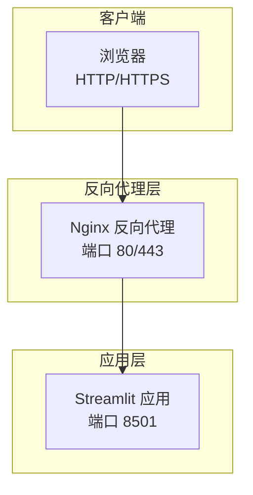
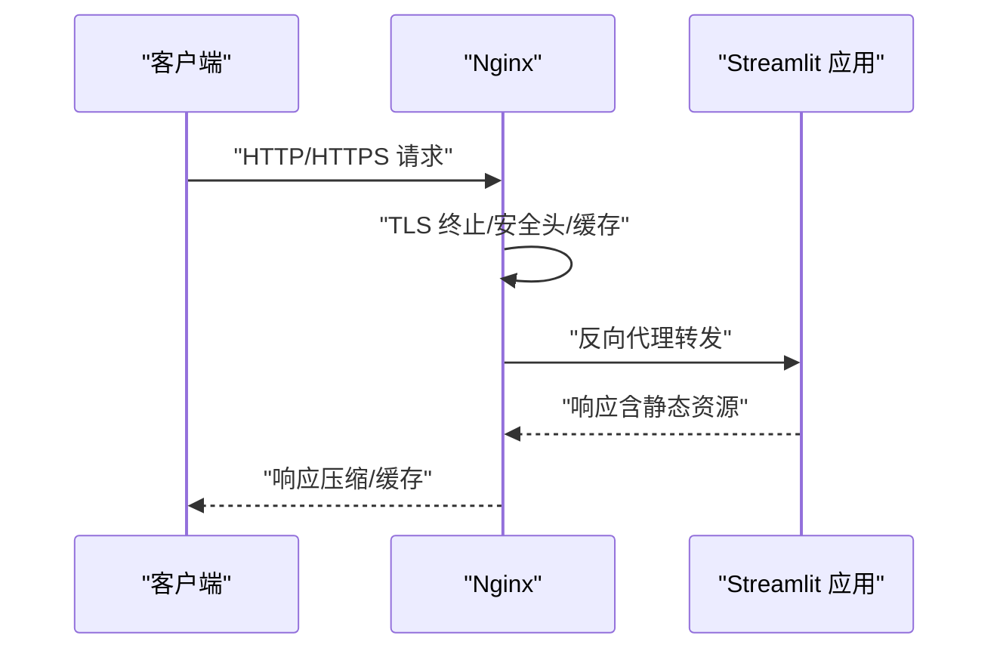
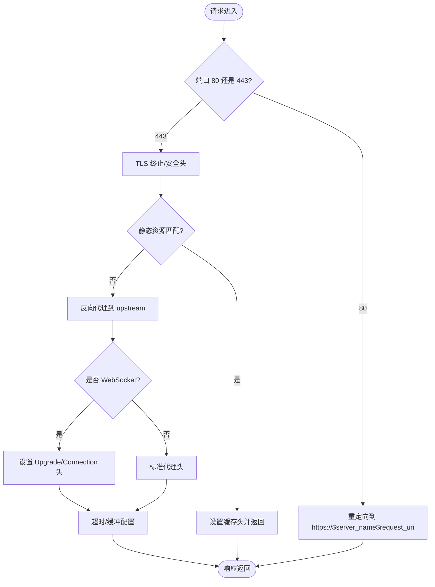
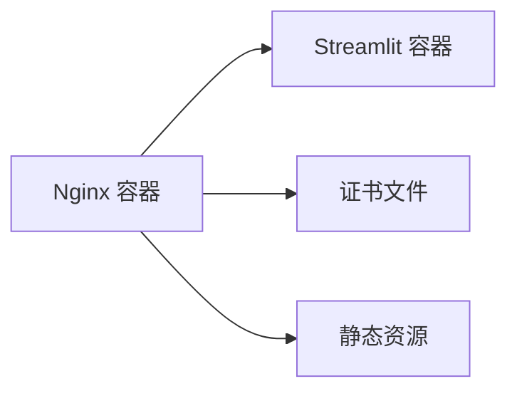

# Web代理配置

<cite>
**本文引用的文件**
- [nginx.conf](file://nginx.conf)
- [docker-compose.yml](file://docker-compose.yml)
- [Dockerfile](file://Dockerfile)
- [deploy.sh](file://deploy.sh)
- [docs/DEPLOYMENT_GUIDE.md](file://docs/DEPLOYMENT_GUIDE.md)
- [docs/WEB_UI_GUIDE.md](file://docs/WEB_UI_GUIDE.md)
- [README.md](file://README.md)
</cite>

## 目录
1. [简介](#简介)
2. [项目结构](#项目结构)
3. [核心组件](#核心组件)
4. [架构总览](#架构总览)
5. [详细组件分析](#详细组件分析)
6. [依赖分析](#依赖分析)
7. [性能考虑](#性能考虑)
8. [故障排查指南](#故障排查指南)
9. [结论](#结论)
10. [附录](#附录)

## 简介
本文件面向生产环境的 GuardianFall 系统，提供完整的 Web 代理配置文档，重点围绕 Nginx 反向代理、负载均衡、SSL 证书、静态资源缓存、请求转发规则、错误页面处理、性能优化、安全加固与访问控制、域名与端口映射以及防火墙规则进行系统化说明，并结合项目现有的 nginx.conf、docker-compose.yml、Dockerfile 与部署脚本给出可落地的配置步骤与最佳实践。

## 项目结构
GuardianFall 系统采用容器化部署，核心由 Streamlit Web 应用与 Nginx 反向代理组成，二者通过 Docker Compose 编排在同一网络中，实现对外统一入口与安全增强。

**图表来源**
- [nginx.conf:38-119](file://nginx.conf#L38-L119)
- [docker-compose.yml:102-132](file://docker-compose.yml#L102-L132)

**章节来源**
- [nginx.conf:1-127](file://nginx.conf#L1-L127)
- [docker-compose.yml:1-149](file://docker-compose.yml#L1-L149)

## 核心组件
- Nginx 反向代理：负责 HTTP/HTTPS 终端、证书管理、安全头、静态资源缓存、WebSocket 支持、上游转发与健康检查。
- Streamlit 应用：提供 Web 界面与实时可视化，监听 8501 端口。
- Docker Compose：编排应用与 Nginx，定义网络、端口映射与依赖关系。
- 部署脚本：提供一键部署、更新、日志查看与清理等运维能力。

**章节来源**
- [nginx.conf:32-119](file://nginx.conf#L32-L119)
- [docker-compose.yml:8-132](file://docker-compose.yml#L8-L132)
- [Dockerfile:1-50](file://Dockerfile#L1-L50)
- [deploy.sh:1-243](file://deploy.sh#L1-L243)

## 架构总览
GuardianFall 的生产部署采用“Nginx + Streamlit”的经典反向代理架构。Nginx 对外暴露 80/443 端口，内部将请求转发至 Streamlit 应用；同时提供静态资源缓存、安全头、压缩与健康检查等能力。

**图表来源**
- [nginx.conf:54-119](file://nginx.conf#L54-L119)
- [docker-compose.yml:102-132](file://docker-compose.yml#L102-L132)

## 详细组件分析

### Nginx 反向代理配置
- 基础配置与性能优化
  - 事件模型与连接数：worker_connections、keepalive_timeout。
  - Gzip 压缩：开启 gzip，指定压缩类型，提升传输效率。
  - 日志格式与路径：access_log、error_log。
- 上游与转发
  - upstream 定义：指向 fall-detection:8501，启用 keepalive。
  - server（HTTP）：监听 80，重定向至 HTTPS，并开放 ACME 挑战路径。
  - server（HTTPS）：监听 443，启用 http2，配置现代 SSL 参数与安全头。
- WebSocket 支持
  - 代理头设置：Upgrade、Connection、Host、X-Real-IP、X-Forwarded-*。
- 超时与缓冲
  - proxy_connect/send/read_timeout、proxy_buffering/off、client_max_body_size。
- 静态资源缓存
  - 对图片、字体、CSS、JS 等资源设置一年缓存与 immutable。
- 健康检查
  - /health 端点返回 200 healthy，关闭访问日志。

**图表来源**
- [nginx.conf:38-119](file://nginx.conf#L38-L119)

**章节来源**
- [nginx.conf:4-127](file://nginx.conf#L4-L127)

### 负载均衡设置
- 当前配置为单上游节点（upstream 中仅一个 server），未启用多实例负载均衡。
- 如需扩展，可在 upstream 中添加多个 server，并结合权重、健康检查与会话保持策略。

**章节来源**
- [nginx.conf:32-35](file://nginx.conf#L32-L35)

### SSL 证书配置
- 证书与密钥路径：/etc/nginx/ssl/fullchain.pem、privkey.pem。
- Let's Encrypt 验证：/.well-known/acme-challenge/ 路径直接映射到 /usr/share/nginx/html。
- 现代 TLS：TLSv1.2/1.3、安全套件、会话缓存与禁用会话票据。
- 安全头：HSTS、X-Frame-Options、X-Content-Type-Options、X-XSS-Protection、Referrer-Policy。

**章节来源**
- [nginx.conf:58-76](file://nginx.conf#L58-L76)
- [nginx.conf:42-45](file://nginx.conf#L42-L45)

### 静态资源缓存策略
- 缓存规则：对图片、图标、字体、CSS、JS 设置一年缓存与 immutable。
- 适用场景：Web UI 的静态资源，显著降低带宽与服务器压力。

**章节来源**
- [nginx.conf:114-118](file://nginx.conf#L114-L118)

### 请求转发规则与错误页面
- 转发规则：location / 代理到 upstream，保留 Host、X-Real-IP、X-Forwarded-*。
- 错误页面：500/502/503/504 映射到 /50x.html，静态文件根目录为 /usr/share/nginx/html。

**章节来源**
- [nginx.conf:77-105](file://nginx.conf#L77-L105)
- [nginx.conf:121-125](file://nginx.conf#L121-L125)

### 健康检查端点
- /health 返回 200 healthy，用于外部探针与容器健康检查。

**章节来源**
- [nginx.conf:107-112](file://nginx.conf#L107-L112)

### 域名配置、端口映射与防火墙
- 域名：ainfanfeng.cn、www.ainfanfeng.cn。
- 端口映射：Nginx 暴露 80/443；Streamlit 暴露 8501。
- 防火墙：允许 22、80、443、可选 8501（若直连应用）。

**章节来源**
- [nginx.conf:40-56](file://nginx.conf#L40-L56)
- [docker-compose.yml:108-111](file://docker-compose.yml#L108-L111)
- [docs/DEPLOYMENT_GUIDE.md:206-227](file://docs/DEPLOYMENT_GUIDE.md#L206-L227)

### 安全加固与访问控制
- 安全头：HSTS、X-Frame-Options、X-Content-Type-Options、X-XSS-Protection、Referrer-Policy。
- TLS：现代协议与套件、禁用会话票据、合理会话缓存。
- 访问控制：可结合 GeoIP、IP 白名单、速率限制与 WAF（建议在上游或前置网关实现）。

**章节来源**
- [nginx.conf:70-76](file://nginx.conf#L70-L76)
- [nginx.conf:65-69](file://nginx.conf#L65-L69)

### Web 服务器性能优化
- TCP 优化：tcp_nopush、tcp_nodelay、keepalive_timeout。
- Gzip：压缩文本与脚本资源，降低传输体积。
- 缓存：静态资源一年缓存，immutable。
- 超时与缓冲：合理设置代理超时与关闭缓冲以满足实时性需求（WebSocket）。

**章节来源**
- [nginx.conf:10-29](file://nginx.conf#L10-L29)

## 依赖分析
- Nginx 依赖 Streamlit 应用容器（fall-detection:8501）。
- Nginx 依赖证书文件与静态资源目录。
- Docker Compose 管理网络、端口映射与服务依赖。

**图表来源**
- [docker-compose.yml:102-132](file://docker-compose.yml#L102-L132)
- [nginx.conf:58-60](file://nginx.conf#L58-L60)

**章节来源**
- [docker-compose.yml:102-132](file://docker-compose.yml#L102-L132)
- [nginx.conf:32-35](file://nginx.conf#L32-L35)

## 性能考虑
- 传输优化：启用 gzip 与静态资源缓存。
- 连接优化：合理 keepalive 与超时配置，避免阻塞。
- 实时性：WebSocket 头部设置与关闭代理缓冲，确保低延迟。
- 资源限制：容器资源限制与健康检查，保障稳定性。

[本节为通用指导，无需特定文件引用]

## 故障排查指南
- 服务无法启动：检查 Docker 状态、端口占用、依赖缺失。
- 无法访问 Web 界面：检查防火墙、端口监听、Nginx 配置与证书。
- 性能低下：检查资源使用、磁盘 I/O、网络流量与参数调优。
- 频繁崩溃：查看容器状态、日志与系统资源，必要时增加 Swap。
- Docker 相关问题：重置 Docker 系统、清理镜像与数据卷后重建。

**章节来源**
- [docs/DEPLOYMENT_GUIDE.md:329-414](file://docs/DEPLOYMENT_GUIDE.md#L329-L414)
- [deploy.sh:131-171](file://deploy.sh#L131-L171)

## 结论
本文基于项目现有配置与文档，系统梳理了 GuardianFall 的 Web 代理部署要点，包括 Nginx 反向代理、SSL 证书、静态资源缓存、请求转发、错误页面、健康检查、安全加固与运维脚本。建议在生产环境中结合 Let's Encrypt 自动化证书管理、启用 WAF 与访问控制、持续监控与日志轮转，以获得更高的安全性与稳定性。

[本节为总结，无需特定文件引用]

## 附录

### A. Nginx 配置要点清单
- 监听端口：80（重定向）、443（TLS）
- 证书路径：/etc/nginx/ssl/fullchain.pem、privkey.pem
- 上游：fall-detection:8501
- 安全头：HSTS、X-Frame-Options、X-Content-Type-Options、X-XSS-Protection、Referrer-Policy
- 静态资源缓存：一年缓存与 immutable
- WebSocket：Upgrade/Connection 头
- 错误页面：500/502/503/504 -> /50x.html

**章节来源**
- [nginx.conf:38-125](file://nginx.conf#L38-L125)

### B. 域名与端口映射
- 域名：ainfanfeng.cn、www.ainfanfeng.cn
- 端口：80（HTTP）、443（HTTPS）、8501（应用，可选直连）

**章节来源**
- [nginx.conf:40-56](file://nginx.conf#L40-L56)
- [docker-compose.yml:108-111](file://docker-compose.yml#L108-L111)

### C. 防火墙规则
- 允许：22（SSH）、80（HTTP）、443（HTTPS）、可选 8501（应用直连）
- 启用：ufw

**章节来源**
- [docs/DEPLOYMENT_GUIDE.md:206-227](file://docs/DEPLOYMENT_GUIDE.md#L206-L227)

### D. 一键部署与运维
- 部署脚本：提供部署、更新、启动、停止、日志查看、清理等命令。
- Docker Compose：编排应用与 Nginx，定义网络、端口映射与健康检查。

**章节来源**
- [deploy.sh:131-242](file://deploy.sh#L131-L242)
- [docker-compose.yml:1-149](file://docker-compose.yml#L1-L149)