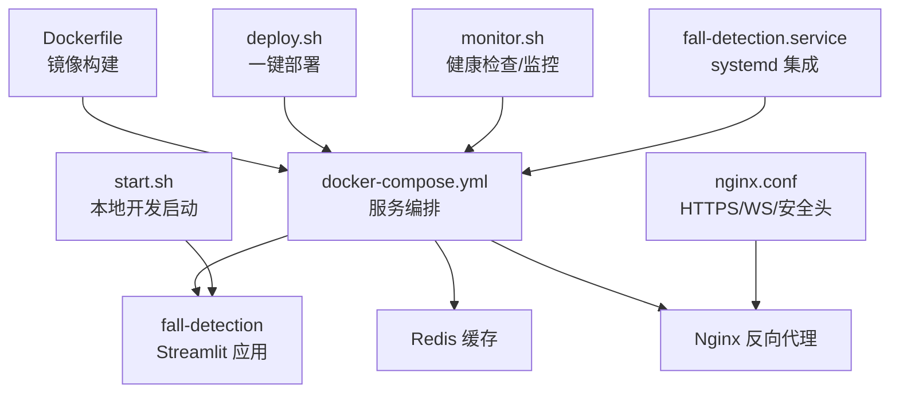
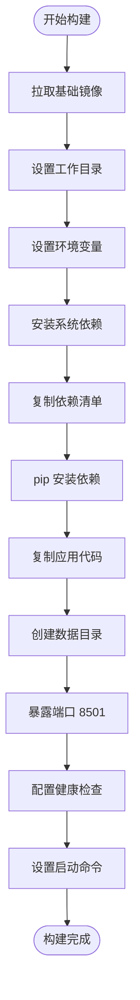
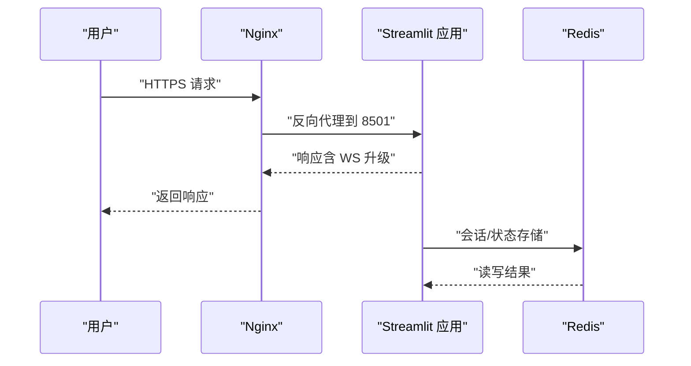
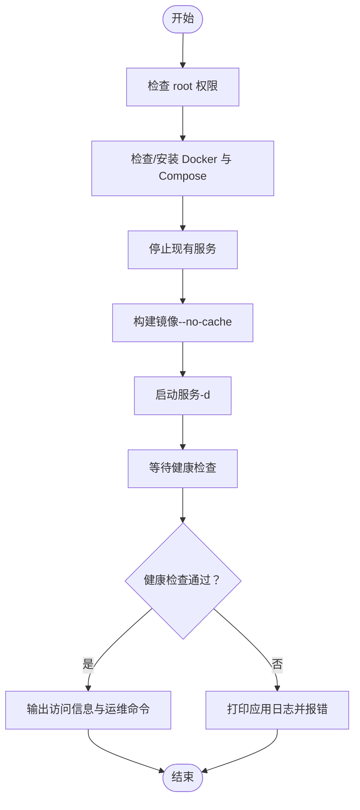
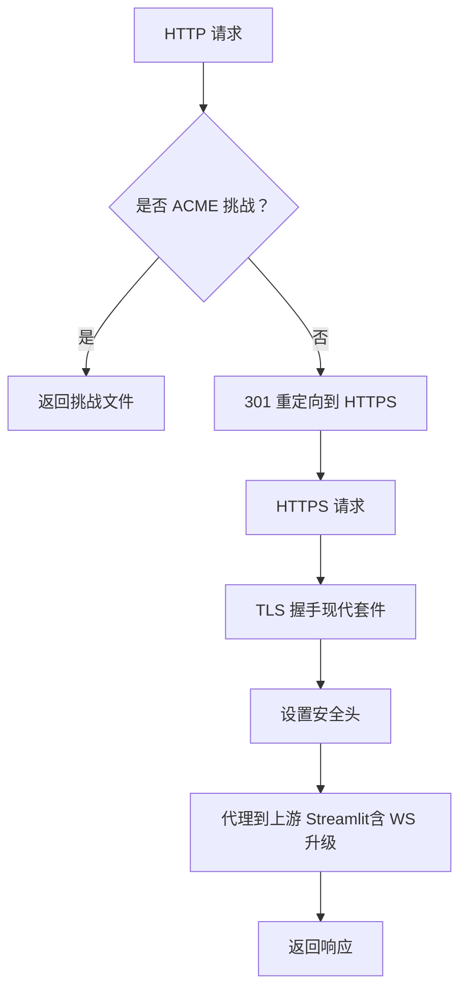
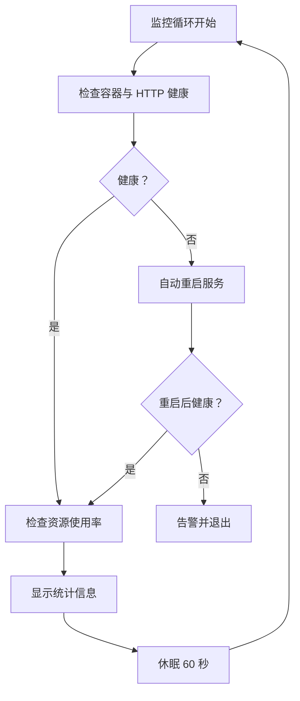
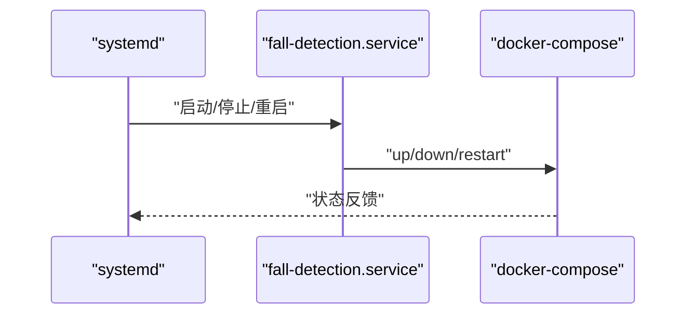
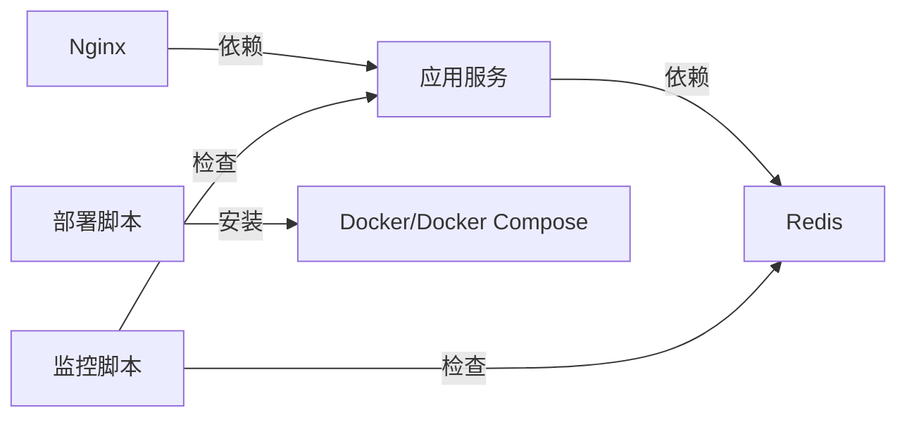

# 容器化部署

<cite>
**本文引用的文件**
- [Dockerfile](file://Dockerfile)
- [docker-compose.yml](file://docker-compose.yml)
- [deploy.sh](file://deploy.sh)
- [start.sh](file://start.sh)
- [nginx.conf](file://nginx.conf)
- [requirements.txt](file://requirements.txt)
- [app.py](file://app.py)
- [fall-detection.service](file://fall-detection.service)
- [monitor.sh](file://monitor.sh)
</cite>

## 目录
1. [简介](#简介)
2. [项目结构](#项目结构)
3. [核心组件](#核心组件)
4. [架构总览](#架构总览)
5. [详细组件分析](#详细组件分析)
6. [依赖关系分析](#依赖关系分析)
7. [性能与资源优化](#性能与资源优化)
8. [故障排查指南](#故障排查指南)
9. [结论](#结论)
10. [附录](#附录)

## 简介
本文件面向生产与开发环境，系统性阐述 GuardianFall（摔倒检测系统）的容器化部署方案。内容涵盖：
- Dockerfile 的镜像构建流程与运行时配置
- docker-compose 的多服务编排、网络与数据卷设计
- 一键部署脚本的环境检查、服务启动顺序与健康检查机制
- 生产级反向代理与安全加固（Nginx）
- 容器资源限制、日志轮转与健康检查策略
- 性能优化与故障排查最佳实践

## 项目结构
围绕容器化部署的关键文件组织如下：
- 镜像构建：Dockerfile
- 多服务编排：docker-compose.yml
- 一键部署：deploy.sh
- 本地开发启动：start.sh
- 反向代理与安全：nginx.conf
- 应用入口与配置：app.py、requirements.txt
- systemd 服务集成：fall-detection.service
- 运行时监控：monitor.sh



图表来源
- [Dockerfile:1-50](file://Dockerfile#L1-L50)
- [docker-compose.yml:6-149](file://docker-compose.yml#L6-L149)
- [deploy.sh:131-145](file://deploy.sh#L131-L145)
- [nginx.conf:1-127](file://nginx.conf#L1-L127)
- [monitor.sh:26-47](file://monitor.sh#L26-L47)
- [fall-detection.service:8-21](file://fall-detection.service#L8-L21)

章节来源
- [Dockerfile:1-50](file://Dockerfile#L1-L50)
- [docker-compose.yml:1-149](file://docker-compose.yml#L1-L149)
- [deploy.sh:1-243](file://deploy.sh#L1-L243)
- [start.sh:1-109](file://start.sh#L1-L109)
- [nginx.conf:1-127](file://nginx.conf#L1-L127)
- [app.py:1-200](file://app.py#L1-L200)
- [requirements.txt:1-34](file://requirements.txt#L1-L34)
- [fall-detection.service:1-28](file://fall-detection.service#L1-L28)
- [monitor.sh:1-183](file://monitor.sh#L1-L183)

## 核心组件
- 镜像构建层（Dockerfile）
  - 基于精简 Python 基础镜像，安装系统依赖（图形库、USB/相机相关、FFmpeg），复制依赖清单并安装，复制应用代码，创建数据目录，暴露端口，配置健康检查，设置启动命令。
- 多服务编排层（docker-compose.yml）
  - 定义三个服务：主应用、Redis 缓存、可选 Nginx；统一桥接网络、数据卷挂载、资源限制、健康检查、日志轮转、服务依赖。
- 一键部署脚本（deploy.sh）
  - 根权限校验、Docker/Docker Compose 安装检测、停止旧服务、强制重建镜像、启动服务、健康检查等待、输出访问信息与运维命令。
- 反向代理与安全（nginx.conf）
  - HTTP -> HTTPS 重定向、Let’s Encrypt 挑战路径、TLS1.2/1.3、现代密码套件、安全头、WebSocket 支持、健康检查端点、静态资源缓存。
- 运行时监控（monitor.sh）
  - 容器状态、HTTP 响应、资源使用率、日志查看、统计信息、自动重启与持续监控循环。
- systemd 集成（fall-detection.service）
  - 将 docker-compose 作为系统服务管理，支持启动/停止/重启与超时控制。
- 本地开发启动（start.sh）
  - Python 环境检查、虚拟环境创建与激活、依赖安装、交互式运行模式选择（Web/命令行/实时/录制）。

章节来源
- [Dockerfile:1-50](file://Dockerfile#L1-L50)
- [docker-compose.yml:6-149](file://docker-compose.yml#L6-L149)
- [deploy.sh:31-102](file://deploy.sh#L31-L102)
- [nginx.conf:38-119](file://nginx.conf#L38-L119)
- [monitor.sh:26-146](file://monitor.sh#L26-L146)
- [fall-detection.service:8-21](file://fall-detection.service#L8-L21)
- [start.sh:7-108](file://start.sh#L7-L108)

## 架构总览
GuardianFall 的容器化架构由“应用服务 + 缓存 + 反向代理”三层组成，通过自定义桥接网络互通，数据持久化至宿主机卷，支持健康检查与日志轮转。

```mermaid
graph TB
subgraph "外部访问"
U["用户浏览器"]
end
subgraph "反向代理层"
NGINX["Nginx<br/>HTTPS/TLS/WS/安全头"]
end
subgraph "应用层"
APP["Streamlit 应用<br/>端口 8501"]
REDIS["Redis 缓存"]
end
subgraph "存储与网络"
VOL1["datasets 挂载卷"]
VOL2["logs 挂载卷"]
VOL3["configs 挂载卷"]
VOL4["redis-data 卷"]
NET["自定义桥接网络"]
end
U --> NGINX
NGINX --> APP
APP <- --> REDIS
APP --- VOL1
APP --- VOL2
APP --- VOL3
REDIS --- VOL4
APP --- NET
REDIS --- NET
NGINX --- NET
```

图表来源
- [docker-compose.yml:6-149](file://docker-compose.yml#L6-L149)
- [nginx.conf:38-119](file://nginx.conf#L38-L119)

## 详细组件分析

### Dockerfile 镜像构建配置
- 基础镜像与工作目录：基于精简 Python 基础镜像，设置工作目录。
- 环境变量：禁用字节码写入、禁用缓冲、设置 Streamlit 服务器参数等。
- 系统依赖：安装图形库、USB/相机相关、FFmpeg 等，便于点云与视频处理。
- 依赖安装：复制依赖清单并离线缓存安装，减少构建时间。
- 应用代码与数据目录：复制代码，创建 datasets/logs/configs 目录。
- 端口与健康检查：暴露 8501，使用 curl 对健康端点进行探测。
- 启动命令：以 Streamlit 运行应用，绑定 0.0.0.0 并设为 headless。



图表来源
- [Dockerfile:4-49](file://Dockerfile#L4-L49)

章节来源
- [Dockerfile:1-50](file://Dockerfile#L1-L50)

### docker-compose 多服务编排
- 服务定义
  - fall-detection：基于 Dockerfile 构建，端口映射 8501:8501，环境变量覆盖默认参数，挂载应用代码与持久化数据卷，配置健康检查、日志轮转、资源限制、网络与依赖。
  - redis：官方 Redis 镜像，数据卷持久化，健康检查，资源限制。
  - nginx：官方 Nginx 镜像，端口映射 80/443，挂载配置与证书，依赖应用服务。
- 网络与数据卷
  - 自定义桥接网络，子网 172.28.0.0/16，隔离服务间通信。
  - 持久化卷：datasets、logs、configs、redis-data。
- 健康检查与日志
  - 应用健康检查：对 Streamlit 内部健康端点进行探测。
  - Redis 健康检查：redis-cli ping。
  - 日志驱动：json-file，单文件最大 10MB，最多 3 个文件。
- 服务依赖
  - 应用依赖 Redis；Nginx 依赖应用服务。



图表来源
- [docker-compose.yml:6-149](file://docker-compose.yml#L6-L149)
- [nginx.conf:77-105](file://nginx.conf#L77-L105)

章节来源
- [docker-compose.yml:6-149](file://docker-compose.yml#L6-L149)

### 一键部署脚本（deploy.sh）
- 功能概览
  - 根权限检查、Docker/Docker Compose 安装检测与自动安装。
  - 停止现有服务、强制重建镜像、启动服务、等待健康检查、输出访问信息与运维命令。
- 关键流程
  - stop_services：停止 compose 服务与可能的本地 Streamlit 进程。
  - build_images：使用 --no-cache 强制重建，确保依赖最新。
  - start_services：后台启动，短暂等待后继续检查。
  - check_status：轮询健康端点，超时则打印应用日志并报错。
- 命令扩展
  - update：拉取镜像、重建、启动并检查。
  - start/stop/logs/status/cleanup/help：提供运维便捷命令。



图表来源
- [deploy.sh:131-145](file://deploy.sh#L131-L145)
- [deploy.sh:61-102](file://deploy.sh#L61-L102)

章节来源
- [deploy.sh:1-243](file://deploy.sh#L1-L243)

### 反向代理与安全（nginx.conf）
- HTTP -> HTTPS 重定向与 ACME 挑战路径
- TLS 配置：TLS1.2/1.3、现代密码套件、会话缓存与禁用会话票据
- 安全头：HSTS、X-Frame-Options、X-Content-Type-Options、X-XSS-Protection、Referrer-Policy
- WebSocket 支持：升级头透传
- 健康检查端点：/health 返回 200 healthy
- 静态资源缓存：长期缓存策略
- 上游服务：指向 fall-detection:8501，启用 keepalive



图表来源
- [nginx.conf:38-119](file://nginx.conf#L38-L119)

章节来源
- [nginx.conf:1-127](file://nginx.conf#L1-L127)

### 运行时监控（monitor.sh）
- 健康检查：容器状态与 HTTP 200 探针
- 资源监控：CPU、内存、磁盘使用率阈值告警
- 日志查看：实时跟踪指定服务日志
- 统计信息：启动时间、重启次数、网络与进程信息
- 自动重启：失败时触发 compose restart 并二次验证
- 持续监控：定时循环检查与统计



图表来源
- [monitor.sh:26-146](file://monitor.sh#L26-L146)

章节来源
- [monitor.sh:1-183](file://monitor.sh#L1-L183)

### systemd 集成（fall-detection.service）
- 服务单元：描述、依赖网络与 Docker 服务
- 执行命令：启动/停止/重启对应 docker-compose 操作
- 超时控制：启动/停止超时配置
- 安装目标：多用户目标



图表来源
- [fall-detection.service:8-21](file://fall-detection.service#L8-L21)

章节来源
- [fall-detection.service:1-28](file://fall-detection.service#L1-L28)

### 本地开发启动（start.sh）
- Python 版本检查、虚拟环境创建与激活
- 依赖安装（requirements.txt）
- 交互式模式：Web 界面、命令行 Demo、实时检测、数据录制
- 适合本地调试与演示，不涉及容器化

章节来源
- [start.sh:1-109](file://start.sh#L1-L109)

## 依赖关系分析
- 应用服务依赖
  - Redis：用于会话或状态存储（compose 中声明 depends_on）
  - Nginx：生产环境可选，依赖应用服务
- 系统依赖
  - Docker 与 Docker Compose：部署脚本自动安装
  - curl：健康检查与部署脚本中使用
  - top/free/df：监控脚本中用于资源检查
- 网络与存储
  - 自定义桥接网络隔离服务
  - 持久化卷保证数据不随容器删除而丢失



图表来源
- [docker-compose.yml:71-120](file://docker-compose.yml#L71-L120)
- [deploy.sh:39-59](file://deploy.sh#L39-L59)
- [monitor.sh:26-47](file://monitor.sh#L26-L47)

章节来源
- [docker-compose.yml:6-149](file://docker-compose.yml#L6-L149)
- [deploy.sh:39-59](file://deploy.sh#L39-L59)
- [monitor.sh:26-47](file://monitor.sh#L26-L47)

## 性能与资源优化
- 资源限制
  - 应用服务：CPU 限制 2.0、内存 2GB；预留 CPU 0.5、内存 512MB
  - Redis：CPU 0.5、内存 256MB
  - 建议：根据实际负载调优，避免过度预留导致资源浪费
- 健康检查与重启
  - 应用健康检查间隔 30s、超时 10s、重试 3 次、启动期 40s
  - Nginx 健康检查端点 /health，便于外部探活
- 日志轮转
  - json-file 驱动，单文件 10MB，最多 3 份，降低磁盘占用
- 反向代理优化
  - WebSocket 支持、keepalive、静态资源缓存、HTTP/2
- 端口与网络
  - 应用仅暴露 8501，Nginx 暴露 80/443，内部通过自定义网络通信
- 依赖安装
  - pip --no-cache-dir 与 apt 清理缓存，减小镜像体积

章节来源
- [docker-compose.yml:41-101](file://docker-compose.yml#L41-L101)
- [Dockerfile:18-33](file://Dockerfile#L18-L33)
- [nginx.conf:77-119](file://nginx.conf#L77-L119)

## 故障排查指南
- 健康检查失败
  - 检查应用健康端点可达性与日志输出
  - 使用部署脚本的 check_status 或 monitor.sh 的 status 子命令
- 服务未启动
  - 确认 Docker 与 Compose 安装状态
  - 使用 deploy.sh 的 start 子命令单独启动
- 端口冲突
  - 修改 docker-compose.yml 的端口映射或宿主机端口
- 数据丢失
  - 确认数据卷挂载路径正确且权限允许
  - 使用 cleanup 子命令清理前备份重要数据卷
- Nginx 问题
  - 检查证书路径与权限
  - 使用 nginx.conf 的 /health 端点验证代理连通性
- 自动重启
  - monitor.sh 在检测异常时会尝试自动重启，若失败需手动介入

章节来源
- [deploy.sh:84-102](file://deploy.sh#L84-L102)
- [monitor.sh:26-47](file://monitor.sh#L26-L47)
- [nginx.conf:107-112](file://nginx.conf#L107-L112)

## 结论
GuardianFall 的容器化部署以 docker-compose 为核心，结合 Dockerfile 的标准化构建、Nginx 的生产级反向代理与安全加固、以及完善的健康检查与日志轮转策略，形成一套可维护、可观测、可扩展的部署方案。配合一键部署脚本与监控脚本，能够快速完成从开发到生产的迁移，并在生产环境中提供稳定的服务保障。

## 附录
- 生产环境建议
  - 启用 Nginx 并配置 SSL 证书与安全头
  - 使用独立的生产 profile（compose profiles）按需启用 Nginx
  - 为 Redis 配置持久化策略（RDB/AOF）与备份
  - 为应用与 Redis 设置更严格的资源限制与配额
- 安全配置要点
  - TLS1.2/1.3、现代密码套件、HSTS、X-Frame-Options、X-Content-Type-Options、X-XSS-Protection、Referrer-Policy
  - WebSocket 升级头透传，确保交互式体验
  - 证书与密钥文件权限最小化
- 运维最佳实践
  - 使用 systemd 集成，实现开机自启与优雅重启
  - 定期轮转日志，监控资源使用率
  - 使用健康检查端点与 /health 端点进行外部探活
  - 通过 compose logs -f 实时观察应用日志