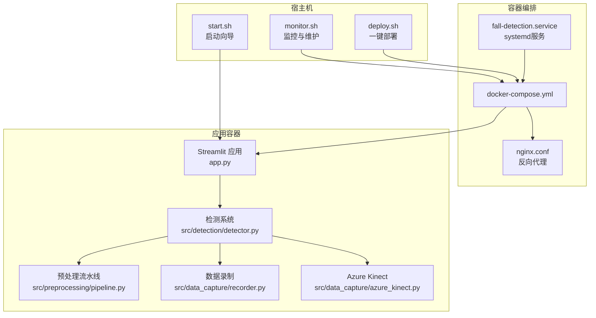
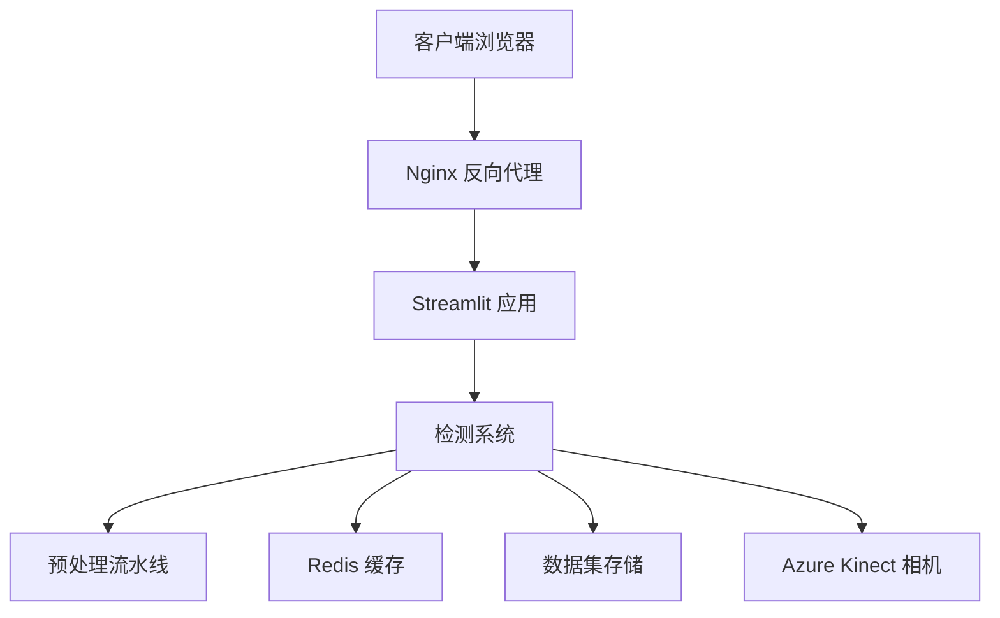
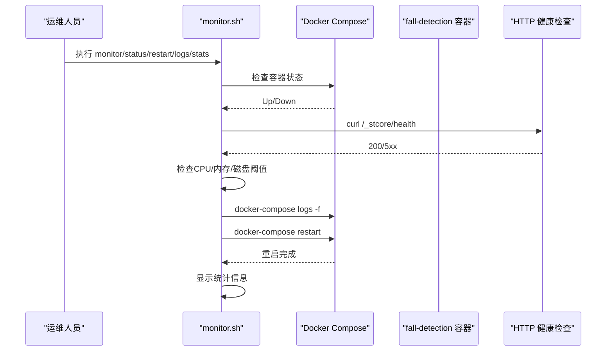
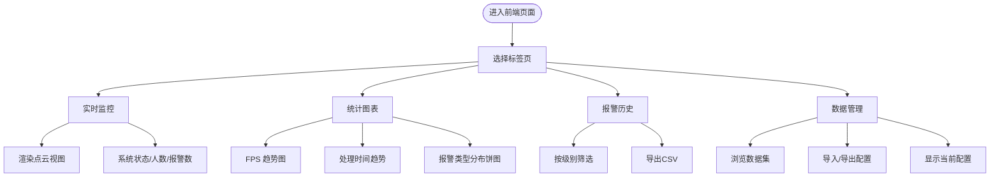
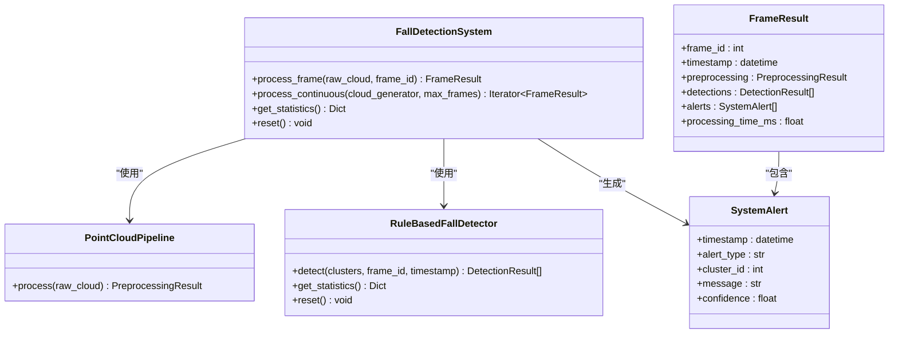
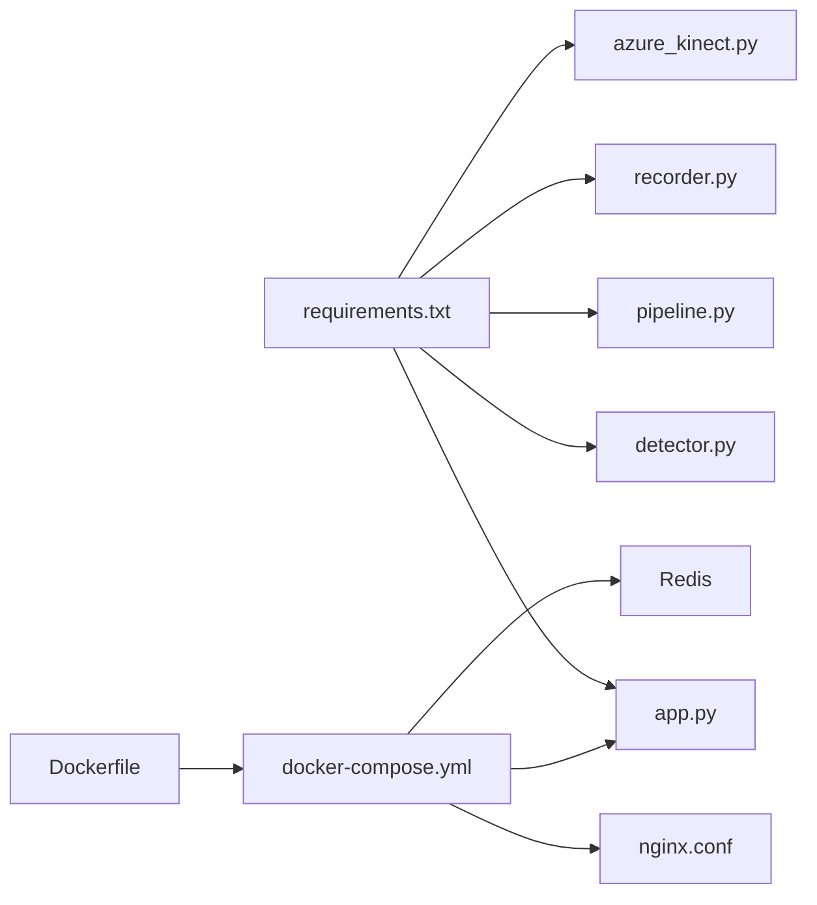

# 监控与维护

<cite>
**本文引用的文件**
- [monitor.sh](file://monitor.sh)
- [app.py](file://app.py)
- [requirements.txt](file://requirements.txt)
- [Dockerfile](file://Dockerfile)
- [docker-compose.yml](file://docker-compose.yml)
- [deploy.sh](file://deploy.sh)
- [start.sh](file://start.sh)
- [src/detection/detector.py](file://src/detection/detector.py)
- [src/data_capture/recorder.py](file://src/data_capture/recorder.py)
- [src/preprocessing/pipeline.py](file://src/preprocessing/pipeline.py)
- [src/data_capture/azure_kinect.py](file://src/data_capture/azure_kinect.py)
- [demos/fall_detection_demo.py](file://demos/fall_detection_demo.py)
- [nginx.conf](file://nginx.conf)
- [fall-detection.service](file://fall-detection.service)
</cite>

## 目录
1. [简介](#简介)
2. [项目结构](#项目结构)
3. [核心组件](#核心组件)
4. [架构总览](#架构总览)
5. [详细组件分析](#详细组件分析)
6. [依赖关系分析](#依赖关系分析)
7. [性能考量](#性能考量)
8. [故障排查指南](#故障排查指南)
9. [结论](#结论)
10. [附录](#附录)

## 简介
本文件面向GuardianFall系统（摔倒检测系统）的监控与维护，围绕系统监控脚本、性能指标采集、告警机制、硬件状态监控、资源使用、磁盘空间与网络连接检测、定期维护任务、日志清理策略、系统健康检查自动化、监控数据可视化与趋势分析、异常检测、维护窗口规划、备份策略与灾难恢复准备等方面进行系统化说明。文档同时结合项目现有脚本与模块，给出可落地的实施方案与最佳实践。

## 项目结构
GuardianFall系统采用容器化部署，前端通过Streamlit提供可视化界面，后端由点云预处理、人体聚类与摔倒检测规则组成，并提供数据录制与回放能力。监控与维护涉及：
- Shell监控脚本：服务状态、资源使用、日志查看、统计信息、自动重启
- Docker Compose编排：容器生命周期、健康检查、日志轮转、资源限制
- Streamlit前端：系统状态展示、统计图表、报警历史、数据管理
- 检测系统：实时处理、性能统计、报警回调
- 部署与启动脚本：一键部署、启动向导、日志查看、清理资源

**图表来源**
- [monitor.sh:1-183](file://monitor.sh#L1-L183)
- [start.sh:1-109](file://start.sh#L1-L109)
- [deploy.sh:1-243](file://deploy.sh#L1-L243)
- [docker-compose.yml:1-149](file://docker-compose.yml#L1-L149)
- [nginx.conf:1-127](file://nginx.conf#L1-L127)
- [fall-detection.service:1-28](file://fall-detection.service#L1-L28)
- [app.py:1-662](file://app.py#L1-L662)
- [src/detection/detector.py:1-373](file://src/detection/detector.py#L1-L373)
- [src/preprocessing/pipeline.py:1-337](file://src/preprocessing/pipeline.py#L1-L337)
- [src/data_capture/recorder.py:1-489](file://src/data_capture/recorder.py#L1-L489)
- [src/data_capture/azure_kinect.py:1-532](file://src/data_capture/azure_kinect.py#L1-L532)

**章节来源**
- [monitor.sh:1-183](file://monitor.sh#L1-L183)
- [docker-compose.yml:1-149](file://docker-compose.yml#L1-L149)
- [app.py:1-662](file://app.py#L1-L662)

## 核心组件
- 监控脚本：提供服务状态检查、资源使用检查、日志查看、统计信息展示、自动重启与持续监控循环
- Streamlit前端：系统状态、统计图表（FPS、处理时间、报警分布）、报警历史、数据管理
- 检测系统：实时处理点云、性能统计、报警回调、系统重置
- 预处理流水线：体素降采样、统计滤波、地面分割、人体聚类
- 数据录制：录制点云序列、保存元数据、回放与导出
- 部署与启动：Docker镜像构建、容器编排、健康检查、日志轮转、资源限制
- 反向代理：Nginx配置，支持HTTPS、WebSocket、健康检查端点

**章节来源**
- [monitor.sh:26-146](file://monitor.sh#L26-L146)
- [app.py:210-652](file://app.py#L210-L652)
- [src/detection/detector.py:75-283](file://src/detection/detector.py#L75-L283)
- [src/preprocessing/pipeline.py:65-178](file://src/preprocessing/pipeline.py#L65-L178)
- [src/data_capture/recorder.py:48-176](file://src/data_capture/recorder.py#L48-L176)
- [Dockerfile:44-49](file://Dockerfile#L44-L49)
- [docker-compose.yml:52-57](file://docker-compose.yml#L52-L57)
- [nginx.conf:32-119](file://nginx.conf#L32-L119)

## 架构总览
GuardianFall系统采用“容器化 + 反向代理 + 前端可视化”的架构。Streamlit应用作为Web入口，通过Nginx反向代理对外提供服务；Docker Compose负责编排应用容器、Redis缓存与可选Nginx；检测系统在容器内运行，接收点云数据并输出报警与统计信息。

**图表来源**
- [nginx.conf:32-119](file://nginx.conf#L32-L119)
- [docker-compose.yml:8-73](file://docker-compose.yml#L8-L73)
- [app.py:210-652](file://app.py#L210-L652)
- [src/detection/detector.py:75-283](file://src/detection/detector.py#L75-L283)
- [src/preprocessing/pipeline.py:65-178](file://src/preprocessing/pipeline.py#L65-L178)
- [src/data_capture/azure_kinect.py:47-460](file://src/data_capture/azure_kinect.py#L47-L460)
- [src/data_capture/recorder.py:223-439](file://src/data_capture/recorder.py#L223-L439)

## 详细组件分析

### 监控脚本（monitor.sh）
- 功能要点
  - 服务状态检查：Docker容器状态与HTTP健康检查
  - 资源使用检查：CPU、内存、磁盘使用率阈值判断
  - 日志查看：实时查看容器日志
  - 统计信息：运行时间、重启次数、网络统计、进程信息
  - 自动重启：失败时尝试重启并验证
  - 持续监控循环：周期性检查与统计
- 命令与行为
  - status：检查服务状态与资源使用
  - logs：查看指定容器日志
  - stats：显示统计信息
  - monitor：持续监控循环
  - restart：自动重启服务
  - help：帮助信息

**图表来源**
- [monitor.sh:26-146](file://monitor.sh#L26-L146)
- [docker-compose.yml:52-57](file://docker-compose.yml#L52-L57)

**章节来源**
- [monitor.sh:14-183](file://monitor.sh#L14-L183)

### Streamlit前端（app.py）
- 功能要点
  - 实时监控Tab：系统状态、人数、确认/疑似摔倒数量、点云视图
  - 统计图表Tab：FPS趋势、处理时间趋势、报警类型分布
  - 报警历史Tab：筛选与导出CSV
  - 数据管理Tab：数据集列表、配置导入导出、当前配置展示
- 性能指标
  - 系统运行时长、总报警数、平均FPS、活跃追踪器数量
  - 帧处理时间（ms）与FPS（帧/秒）

**图表来源**
- [app.py:309-652](file://app.py#L309-L652)

**章节来源**
- [app.py:210-652](file://app.py#L210-L652)

### 检测系统（src/detection/detector.py）
- 功能要点
  - 预处理流水线集成：体素降采样、统计滤波、地面分割、人体聚类
  - 规则引擎：高度骤降与速度阈值，确认帧数，状态机（疑似/确认）
  - 报警回调：触发外部处理（UI、日志、告警）
  - 性能统计：帧计数、总报警数、平均FPS、活跃追踪器
  - 连续处理：生成器驱动的流式处理
- 异常处理
  - 回调执行失败的日志记录
  - 处理异常的捕获与抛出

**图表来源**
- [src/detection/detector.py:75-283](file://src/detection/detector.py#L75-L283)

**章节来源**
- [src/detection/detector.py:75-283](file://src/detection/detector.py#L75-L283)

### 预处理流水线（src/preprocessing/pipeline.py）
- 功能要点
  - 体素降采样、统计滤波、地面分割、人体聚类
  - 实时优化：帧计数、平均FPS、性能历史
- 批处理与单帧处理：支持批量与单帧处理，便于测试与生产

**章节来源**
- [src/preprocessing/pipeline.py:65-178](file://src/preprocessing/pipeline.py#L65-L178)

### 数据录制与回放（src/data_capture/recorder.py）
- 功能要点
  - 录制点云序列、保存元数据（名称、描述、帧数、时长、FPS、文件列表）
  - 加载数据集、迭代帧、添加标注、保存标注、播放回放、格式导出
- 用途：训练数据准备、离线测试、标注与分析

**章节来源**
- [src/data_capture/recorder.py:48-176](file://src/data_capture/recorder.py#L48-L176)
- [src/data_capture/recorder.py:223-439](file://src/data_capture/recorder.py#L223-L439)

### Azure Kinect数据采集（src/data_capture/azure_kinect.py）
- 功能要点
  - 相机连接、配置（深度模式、彩色分辨率、FPS）、捕获单帧、连续捕获
  - 深度图转点云、保存点云、录制序列、元数据保存、FPS统计
- 注意：需要安装pyk4a依赖

**章节来源**
- [src/data_capture/azure_kinect.py:47-460](file://src/data_capture/azure_kinect.py#L47-L460)

### Demo演示（demos/fall_detection_demo.py）
- 功能要点
  - 模拟数据演示：生成模拟点云、处理与统计
  - 真实相机演示：连接Azure Kinect、实时检测
  - 录制演示：连接相机并录制数据集
- 用途：快速验证系统功能、硬件连接与数据采集

**章节来源**
- [demos/fall_detection_demo.py:92-373](file://demos/fall_detection_demo.py#L92-L373)

### 部署与启动脚本
- monitor.sh：系统监控与维护
- deploy.sh：一键部署（Docker安装、镜像构建、服务启动、状态检查、访问信息）
- start.sh：启动向导（Python环境、虚拟环境、依赖安装、运行模式选择）

**章节来源**
- [monitor.sh:14-183](file://monitor.sh#L14-L183)
- [deploy.sh:132-243](file://deploy.sh#L132-L243)
- [start.sh:1-109](file://start.sh#L1-L109)

### 反向代理与服务单元
- nginx.conf：Nginx反向代理配置，支持HTTPS、WebSocket、健康检查端点、安全头
- fall-detection.service：systemd服务单元，管理Docker Compose的启动/停止/重启与超时

**章节来源**
- [nginx.conf:32-119](file://nginx.conf#L32-L119)
- [fall-detection.service:1-28](file://fall-detection.service#L1-L28)

## 依赖关系分析
- 外部依赖：Open3D、NumPy、PyK4A（可选）、Streamlit、Plotly、Redis
- 容器健康检查：Dockerfile与docker-compose.yml均配置健康检查
- 日志轮转：容器日志driver为json-file，限制单文件大小与文件数量
- 资源限制：CPU与内存上限与预留

**图表来源**
- [requirements.txt:1-34](file://requirements.txt#L1-L34)
- [Dockerfile:44-49](file://Dockerfile#L44-L49)
- [docker-compose.yml:52-57](file://docker-compose.yml#L52-L57)

**章节来源**
- [requirements.txt:1-34](file://requirements.txt#L1-L34)
- [Dockerfile:44-49](file://Dockerfile#L44-L49)
- [docker-compose.yml:52-57](file://docker-compose.yml#L52-L57)

## 性能考量
- 实时处理性能
  - 检测系统内部维护FPS历史，用于趋势分析与异常检测
  - 预处理流水线提供实时优化版本，记录帧时间并计算平均FPS
- 资源使用
  - monitor.sh对CPU、内存、磁盘使用率进行阈值检查
  - docker-compose对容器进行CPU与内存限制与预留
- 健康检查
  - Docker健康检查与Nginx健康检查端点，确保服务可用性
- 建议
  - 结合前端统计图表与monitor.sh阈值告警，建立性能基线与预警阈值
  - 在高峰期进行容量评估，必要时调整容器资源限制与并发策略

**章节来源**
- [src/detection/detector.py:261-272](file://src/detection/detector.py#L261-L272)
- [src/preprocessing/pipeline.py:199-248](file://src/preprocessing/pipeline.py#L199-L248)
- [monitor.sh:50-76](file://monitor.sh#L50-L76)
- [docker-compose.yml:42-49](file://docker-compose.yml#L42-L49)

## 故障排查指南
- 服务状态异常
  - 使用monitor.sh status检查容器与HTTP健康检查
  - 使用monitor.sh logs查看实时日志
  - 使用monitor.sh restart尝试自动重启
- 部署问题
  - 使用deploy.sh deploy进行完整部署，检查Docker与Compose安装
  - 使用deploy.sh logs查看容器日志
  - 使用deploy.sh cleanup清理资源（谨慎使用）
- 前端访问
  - 通过nginx.conf配置的反向代理访问，确认HTTPS与WebSocket支持
  - 使用Nginx健康检查端点验证服务可用性
- 硬件问题（Azure Kinect）
  - 确认pyk4a已安装
  - 检查USB 3.0连接、驱动程序与占用情况
- 日志与清理
  - docker-compose.yml配置了json-file日志轮转（单文件大小与文件数量限制）
  - monitor.sh支持查看容器日志

**章节来源**
- [monitor.sh:26-183](file://monitor.sh#L26-L183)
- [deploy.sh:132-243](file://deploy.sh#L132-L243)
- [nginx.conf:108-112](file://nginx.conf#L108-L112)
- [src/data_capture/azure_kinect.py:23-29](file://src/data_capture/azure_kinect.py#L23-L29)
- [docker-compose.yml:60-64](file://docker-compose.yml#L60-L64)

## 结论
GuardianFall系统具备完善的监控与维护基础：Shell监控脚本、容器健康检查、前端可视化与统计、日志轮转与资源限制。建议在此基础上进一步完善：
- 建立统一的监控指标与阈值体系（CPU/内存/磁盘/网络/服务可用性/FPS/报警率）
- 引入集中式日志与告警平台（如Prometheus/Grafana/Alertmanager或类似方案）
- 制定定期维护计划（系统升级、依赖更新、日志清理、备份与恢复演练）
- 完善异常检测与趋势分析（基于历史数据的异常检测模型）
- 规划维护窗口与变更管理流程，确保业务连续性

## 附录

### 监控与维护清单
- 系统监控
  - 使用monitor.sh status/monitor/logs/stats/restart
  - 定期检查CPU/内存/磁盘阈值
  - 关注HTTP健康检查与容器状态
- 性能指标采集
  - 前端统计图表：FPS、处理时间、报警分布
  - 检测系统统计：运行时长、总帧数、总报警数、平均FPS
- 告警机制
  - monitor.sh阈值告警与自动重启
  - 检测系统报警回调（UI/日志/外部系统）
- 硬件状态监控
  - Azure Kinect连接状态与捕获质量
  - 相机驱动与USB连接检查
- 磁盘空间与日志清理
  - docker-compose日志轮转配置
  - 定期清理旧日志与数据集
- 网络连接检测
  - Nginx健康检查端点
  - 反向代理与WebSocket支持
- 定期维护任务
  - 部署更新：deploy.sh update
  - 一键启动：start.sh
  - 资源清理：deploy.sh cleanup
- 备份策略与灾难恢复
  - 数据集备份：数据集目录持久化
  - 配置备份：config.json与容器配置
  - 灾难恢复：容器重建与数据恢复流程

**章节来源**
- [monitor.sh:14-183](file://monitor.sh#L14-L183)
- [app.py:210-652](file://app.py#L210-L652)
- [src/detection/detector.py:261-272](file://src/detection/detector.py#L261-L272)
- [docker-compose.yml:60-64](file://docker-compose.yml#L60-L64)
- [nginx.conf:108-112](file://nginx.conf#L108-L112)
- [deploy.sh:148-243](file://deploy.sh#L148-L243)
- [start.sh:1-109](file://start.sh#L1-L109)